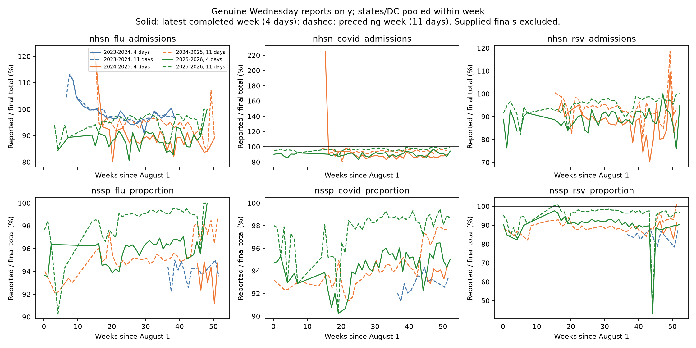

# B1 interpretation and revision-season audit

This analysis interprets the completed original screen and the user's 41/48-run
300-cap snapshot. It does not update that snapshot or fit/score any model.
The revision audit uses the exact dataset pinned by the screen and follow-up:
SHA256 `451d004d7a9626f8b6cdc4815347ac2729d41ecf57d8607f714b06f89b27e2e7`.
Reference truth cutoff: 2026-09-16. Reproduce from the repository root:

```bash
.venv/bin/python analysis/b1-revision-seasons/audit.py
```

## What is established

B1's best models forecast future finalized observations from mixed finalized and
preliminary inputs. B, the leading formulation, has no explicit nowcast output.
Thus good B forecasting does not establish a good stand-alone revision model.
B0's approximately .883 and B1's approximately .94 are not a controlled estimate
of the price of revisions: training recipes, inputs, and label support differ.
The narrow historical matched-final experiment was retired, and is not recreated here.

B versus A supports explicitly representing observation status. C is competitive,
with no consistent universal gain over B. Two-stage loses under every architecture
in the original natural-input comparison. Longer training does not fix it. This
rejects the current formulation, not the possibility of useful nowcasting.

Forecast calibration is an immediate concern: the original winning gap-only model
has approximately 41.9% and 85.2% coverage for nominal 50% and 95% intervals.
This can reflect bias as well as insufficient spread. A mean of seed WIS scores
is not the WIS of the predictive mixture of those seeds.

## Formulations actually implemented

All use 12 context weeks and forecast four future weeks, with all six input channels.
Older history is finalized. Recent reports refer to the two completed weeks, 11 and
4 days before Wednesday. Missing recent reports can be replaced by flagged finals.

| Formulation | Meaning | Training / selection |
|---|---|---|
| A, direct | Values + availability go into a direct probabilistic forecaster. It cannot distinguish a visible supplied final from a visible report. No nowcast head. | Future loss / future selection |
| B, direct_finalflag | Same direct backbone with per-cell known-final indicators. No nowcast head. | Future loss / future selection |
| C, joint_aux025 | B's shared representation with separate probabilistic recent and future heads. Recent predictions do not feed into future predictions. | Future + .25 recent loss / future selection |
| two_stage | A sampled recent correction feeds a future correction embedding and supplies the latest-value forecast anchor. The forecast also retains the raw-history encoded representation. Visible finals pass through exactly. | .5 recent + .5 future loss / same combined selection |

Losses are native-unit fair CRPS normalized by training-only target scales with
scientific weights. Forecast WIS against Hub is the evaluation endpoint, not the
identical training objective. Visible supplied finals are excluded from recent
loss; hiding them with dropout turns them into reconstruction targets.

**Correction to previous prose:** the frozen two-stage code DOES consume final
flags in both shared and focal encoders. Its `forward` also passes them to `encode`
and uses them for exact bypass. This is present in the frozen screen source, not
just current code. The previous claim that it lacked the feature was incorrect.
The screen/workflow descriptions are corrected. Two-stage is not a pure bottleneck:
raw-history context still reaches the forecast. It also uses a different decoder
and anchoring implementation from the direct B0 backbone, so the comparison does
not isolate feedback alone. Each forecast target receives its own two corrected
recent values, not a jointly re-encoded corrected six-channel history.

Architecture and formulation are separate choices:

- Target MLP: six independently fitted components, one per output channel.
- Pathogen MLP: three components, each sharing admissions and ED for one pathogen.
- Target multiscale convolution: six components with convolutional temporal encoders.
- Joint MLP: one fit for all targets, joint location/target attention and pathogen
  output heads. It changes spatial architecture as well as sharing.

Every component sees all six observed channels; independent output fits do not
mean isolated single-channel inputs. Parameters are shared across locations.

Earlier B1 suites included `onlymask` (direct plus artificial masks), `onlynowcast`
(two-stage without artificial masks), and full two-stage with masks. Their names
are not clean causal attribution because they also change the information/task
relative to B0. The subsequent A/B/C seed42 screen used 2,048 evaluation members.
The completed overnight screen used 40 configurations × three seeds at 256 members:
16 formulation cells, eight additional B mask-rate cells, 12 B mechanism cells,
and four C outage-only cells. The cap follow-up repeats the 16 formulation cells
at cap 300; joint MLP already had that cap. Caps are maxima with patience 30.
Same-seed repeat variation prevents treating every observed change as a cap effect.

## What the seasonal audit actually finds

For genuine reports only, the table gives the net upward revision as a percent
of final totals: `100 * sum(final - reported) / sum(final)`. States/DC are pooled;
US is separate in the CSVs. This is a descriptive total ratio, not an average
state percentage or forecast scoring weight. Each lag is analyzed separately.

| Latest completed week (4 days old) | 2023–24 | 2024–25 | 2025–26 |
|---|---:|---:|---:|
| Flu admissions | 3.25% | 11.01% | 11.44% |
| COVID admissions | No genuine reports | 7.48% | 10.35% |
| RSV admissions | No genuine reports | 10.30% | 10.94% |

Flu has a clear change from 2023–24 to later seasons. On identical seasonal weeks,
locations AND selected source, 2023–24 versus 2024–25 is **3.79% versus 10.99%**
(20 weeks, 1,020 cells each). The comparable 2024–25 versus 2025–26 contrast is
**11.04% versus 11.96%** (26 weeks, 1,324 cells each). Thus revisions are not simply
radically different every season; the later flu seasons are substantially closer.
Winter-only unpaired results show the same broad pattern.

On matched sources/weeks/locations, COVID net revisions are 7.48% versus 10.26%,
but absolute revisions fall from 15.92% to 10.76%. Direction and dispersion matter
separately. RSV net revisions are similar, 10.30% versus 10.59%.

**Age matters substantially.** In 2025–26, flu admissions need +11.44% at four days
but +3.85% at 11 days; COVID +10.35% versus +4.09%; RSV +10.94% versus +4.37%.
These full-support lag summaries are not perfectly paired, but show why reporting
maturity should be modeled separately from epidemic growth. A preliminary newest
week can create an apparent downturn against an older, more mature observation.

**Coverage shift is at least as important as revision shift.** Latest-week ED has
no genuine reports in 2023–24, only seven weeks in 2024–25, and 36–43 weeks in
2025–26. For COVID ED the report share among labeled state cells is 0%, 13.2%,
and 79.9%; remaining inputs are supplied finals. COVID/RSV admissions also have no
natural reports at either recent lag in 2023–24. Training on two other seasons
therefore provides limited genuine newest-week revision supervision for some
held-out channels. Artificially hiding finals teaches missing-value reconstruction,
not revision of an observed biased report.

Preceding-week ED net revisions also change: COVID 6.48% to 3.03%, flu 4.96% to
1.52%, RSV 10.83% to 3.03% between the last two seasons. But these aggregates mix
provider and calendar support. Exact source-matched overlaps are only eight weeks
for COVID/RSV and one week for flu; RSV even reverses the aggregate direction on
that restricted subset. Do not describe the aggregate decline as an isolated
season effect. Provider-stratified and matched results are included for this reason.



These are descriptive observations, not evidence that revision shift causes the
forecast gap. Epidemic dynamics, reporting practices, archive coverage and source
selection remain entangled. Matching weeks does not match epidemic intensity.
The calendar audit includes weeks outside Hub's scored support; the previous
seed42 support audit found only 2.3% recent supplied finals on scored focal cells.
Both statements can be true: training-calendar coverage and forecast-scored
coverage have different denominators. All older input history remains finalized.

## What to try before external covariates

1. **Make the next contrasts interpretable.** Keep pathogen B and target B gap-only
   as anchors. Use common natural-input forecast validation for every new mask or
   auxiliary-loss contrast; keep stress validation separate. The existing recipes
   change validation corruption along with training corruption. Compare natural
   recent-head accuracy for C/two-stage against preliminary persistence on the
   identical genuine-report cells, separating age, target, season and geography.
   Keep reconstruction of hidden finals separate. Existing cross-formulation
   nowcast ranking rejects differing support, so forecast rankings cannot answer
   whether their recent estimates are good.
2. **Repair the two-stage comparison before replacing the architecture.** Hold
   its architecture and masks fixed; select on forecast loss and reduce recent
   loss from equal weight to .1 or .25 relative to forecast. Then test a small
   recent correction branch on B's exact direct backbone, preserving its direct
   forecast path. Compare correction gradients allowed versus detached only if
   the first result warrants it. These distinguish objective competition from
   harmful feedback; adding flags is not an experiment because they already exist.
3. **Prefer a residual revision model with separate missingness handling.** For
   visible provisional data, predict a distribution of corrections around the
   report in the existing transformed space; for missing data, use a separate
   reconstruction route; visible finals bypass exactly. In a B-based extension,
   add a small gated correction to the direct forecast rather than obligatorily
   anchoring it on a sampled correction. Initialize the added output to zero and
   the gate small (not both exactly zero, which can block learning). Maintain
   nonnegative admissions and bounded ED via the existing inverse transforms.
   The current two-stage model is already residual at the recent head; the new
   features are task separation and preservation of B's direct forecast baseline.
4. **Train against revisions, not only absence.** Draw realistic paired two-week
   correction errors from training seasons only, conditioning first on target and
   lag and preserving temporal/geographic correlation by drawing whole blocks.
   Perturb visible provisional reports; retain availability, keep known-final false.
   Use additive errors in transformed space rather than raw ratios near zero.
   Estimate perturbations strictly inside each inner fitting partition and never
   from the held-out season. This is a stationarity/transfer assumption to test;
   zero-support target/lag cases must be explicitly omitted or use a documented
   pooling assumption. A simple mask curriculum can start with more corruption
   and taper toward natural inputs; a proposed pilot is episode rate .5 to .1,
   compared against fixed .5 and mild gap-only on the same validation data. These
   rates are proposals, not established optima. A mask schedule alone cannot teach
   the revision of a value that remains visible.
5. **Use available reporting information before external covariates.** A second
   phase can expose actual source/release age, provider identity and recent vintage
   changes from the existing archives. Fixed context position already identifies
   nominal lag; actual release age and vintage-to-vintage changes add information.
   A small shared reporting-state encoder could condition correction location and
   scale on recently observed revision trajectories. Give it only releases available
   by issuance. Do not use held-out season finals or a retrospective season label
   as a substitute for reporting state. Current NPZ recent pairs are not a complete
   revision triangle; reconstructing older vintage trajectories requires archives,
   not treating finalized older input slots as historical reports.
6. **Check uncertainty before enlarging the network.** Evaluate predictive mixtures
   of seeds rather than merely averaging their WIS. Fit any spread adjustment on
   inner validation alone and evaluate on the held-out season. Undercoverage
   motivates this experiment but does not guarantee that widening improves WIS.
   A local-plus-shared noise extension is a later candidate; the current global
   latent alone does not prove inadequate marginal uncertainty. Larger networks
   or longer budgets have less direct support than the targeted changes above.

A compact first round would use one backbone, three seeds, and six recipes:
B mixed-.5, B mild gap-only, C with .1 recent loss, two-stage with .1 recent loss
and forecast-only selection, B plus gated recent correction, and B plus
training-only revision augmentation. All use the same natural validation rule;
these are new matched baselines rather than direct comparisons to old checkpoint
selection. Add a curriculum only after one augmentation mechanism helps. Retain
the original target gap-only winner as a separate reference. Do not cross every
new idea with every architecture immediately. No runs are launched by this note.

## Assumptions and outputs

- These recommendations are hypotheses, not demonstrated improvements.
- Three seasons and three seeds do not establish an untouched prospective result.
- The 41/48 cap snapshot is retained as supplied; missing runs are not imputed.
- Source code in the experiment snapshot is authoritative for implemented behavior;
  current working-tree edits were not overwritten.
- Reference finals are pinned rather than immutable. Supplied-final flags describe
  a retrospective conditioning policy, not provider-certified finality.
- Only cells with a genuine available report and valid recent truth enter revision
  statistics. Zero finals are retained in total-based metrics but excluded from
  per-cell report/final quantiles. States and US are not pooled together.
- The same observation can appear at two report ages; lags are reported separately.
  Cells, locations and weeks are dependent; there is no independent-cell test.
- Matching uses week position within CDC seasons, not ISO week numbers; an extra
  53rd seasonal week has no match in a 52-week season. Curves use days since Aug 1
  purely for a readable common x-axis. Seasonal matching does not remove source
  methodology changes inside one provider identifier.
- Full audit metadata are in `manifest.json`; `cells.csv`, `coverage.csv`,
  `season-summary.csv`, `source-summary.csv`, `winter-summary.csv`,
  `weekly-summary.csv`, and `matched-season-summary.csv` retain the calculations.
- Graphs were generated, not visually inspected, following repository instructions.

Related primary research supports considering reporting dynamics explicitly:
[Back2Future](https://arxiv.org/abs/2106.04420) models revision information to refine
forecasts; [NobBS](https://pmc.ncbi.nlm.nih.gov/articles/PMC7162546/) combines epidemic
smoothness with reporting delays and studies time-varying delay distributions.
Neither establishes which architecture will win on this dataset; count-arrival
models should not be imposed blindly on bidirectional revisions or ED proportions.

## Log

- 2026-09-17: checked pinned B1 inputs, generated descriptive seasonal revision
  tables/curves, corrected the two-stage flag prose against frozen code, and wrote
  prioritized hypotheses. No training or model-scoring jobs launched.
