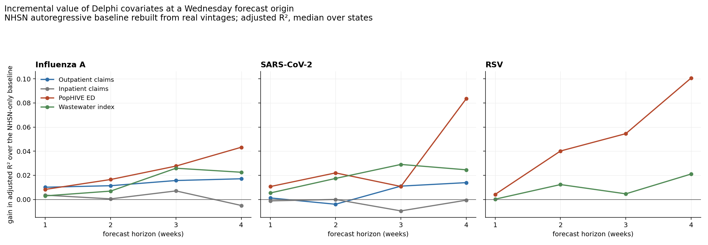

# Clinical covariates: claims, PopHIVE, and what survives a Wednesday origin

Status: analysis note, 2026-09-20. Companion to
[Wastewater](wastewater.md) §7, which established the protocol. This page
applies it to Delphi's inpatient claims, outpatient claims, and PopHIVE ED
signals, and puts all four candidates on one axis.

The regressions below are in-sample exploratory evidence, not held-out
forecasting comparisons.

## Summary

1. **Freshness and usefulness are almost inversely related here.** Outpatient
   claims arrive the same day and add little; PopHIVE arrives 25 days late,
   updates only twice a month, and adds the most.
2. **Inpatient claims are worthless as a covariate** — gain of −0.010 to +0.007
   adjusted R², straddling zero. They measure the same construct as the NHSN
   target.
3. **Nothing helps at one week ahead.** Every candidate lands between −0.001 and
   +0.011 against an NHSN baseline already at 0.85–0.91.
4. **Everything that helps, helps at three to four weeks**, and the ranking
   there is PopHIVE > wastewater ≈ outpatient claims > inpatient claims.
5. **Adjusted R² matters.** Switching from raw to adjusted R² roughly halves the
   wastewater gains reported on the companion page; those were not paying for
   their parameters as cleanly as they looked.

## Protocol

Identical to [Wastewater](wastewater.md) §7, so the numbers are comparable:

```text
origin r     a Wednesday NHSN report_time; the newest NHSN week is t = r - 4 days
baseline     log NHSN admissions at t and t-1 AS KNOWN AT r, plus their growth
covariate    the source's value at reference week t-k and its two-week change,
             using only rows with report_time <= r
target       final NHSN admissions at t+h,  h = 1..4
k            per source, the smallest lag at which >=80% of observations have
             arrived by the Wednesday origin -- measured, not assumed
score        adjusted R², median over states
```

Two changes from the wastewater run, both of which make this stricter:

- **Adjusted rather than raw R².** The covariate arms add two predictors to
  three, and the usable sample differs a lot by source (PopHIVE gives ~37
  origins per state, claims ~78). Raw R² would reward the short samples.
- **A real as-of join on the covariate.** Each origin sees the latest vintage
  published on or before it, so a source that updates twice a month is correctly
  penalised for being stale between updates. The wastewater arm cannot do this
  (see the caveat below) and uses a modelled availability instead.

Daily claims signals are the trailing-seven-day percentage at the week ending
Saturday. PopHIVE is filtered to its `all` age group.

## What each source actually is, operationally

| source | signals used | update cadence | median latency | lag *k* used | vintages held |
|---|---|---|---:|---:|---:|
| `claims_outpatient` | `..._ov_pct_claims_{flu,covid}` | daily | **0 days** | 0 | 870 |
| `claims_inpatient` | `..._adm_pct_claims_{flu,covid}` | daily | 2 days | 0 | 869 |
| `pophive` | `{flu,covid,rsv}_pct_ed` | ~every 14 days, irregular | **25 days** | 5 | 28 |
| NWSS wastewater | `*_avg_conc_lin` → state index | weekly | 11 days | 2 | — |
| *(NHSN, the target)* | `confirmed_admissions_*_ew` | weekly, Wednesday | 4 days | — | 180 |

Three things here are worth more than the regression results.

**Outpatient claims are the freshest respiratory signal available** — median
latency of **zero days**, with 94% of a week's value in hand by the Wednesday
origin. That is fresher than NHSN itself, which lands at 4 days. Inpatient
claims are close behind at 2 days.

**PopHIVE is not a weekly feed.** Its archive holds 28 vintages over roughly 14
months, a median of 14 days apart with gaps ranging from 3 to 37 days. Combined
with a 25-day median reporting latency, the freshest reasonably complete week at
a Wednesday origin is **five weeks old**. Any use of PopHIVE has to be designed
around that; treating it as a weekly signal would silently feed the model stale
values carried forward.

**PopHIVE's vintage archive begins 2025-07-11**, against 2024-11-19 for NHSN.
The overlap is roughly one season, which is why its rows below rest on ~37
origins per state where the claims rows have ~78. Those PopHIVE numbers are the
least trustworthy on the page.

## Results



Gain in adjusted R² over the NHSN-only baseline, median over states:

| source | pathogen | h=1 | h=2 | h=3 | h=4 |
|---|---|---:|---:|---:|---:|
| Outpatient claims | Influenza A | +0.010 | +0.011 | +0.016 | +0.017 |
| | SARS-CoV-2 | +0.001 | −0.004 | +0.011 | +0.014 |
| Inpatient claims | Influenza A | +0.004 | +0.000 | +0.007 | −0.005 |
| | SARS-CoV-2 | −0.001 | −0.000 | −0.010 | −0.001 |
| PopHIVE ED | Influenza A | +0.008 | +0.017 | +0.028 | **+0.043** |
| | SARS-CoV-2 | +0.011 | +0.022 | +0.011 | **+0.083** |
| | RSV | +0.004 | +0.040 | +0.055 | **+0.101** |
| Wastewater index | Influenza A | +0.003 | +0.007 | +0.026 | +0.023 |
| | SARS-CoV-2 | +0.005 | +0.017 | +0.029 | +0.025 |
| | RSV | +0.000 | +0.012 | +0.005 | +0.021 |

Baseline adjusted R² runs 0.85–0.91 at h=1 down to 0.50–0.68 at h=4.

### Inpatient claims add nothing

Every cell is within ±0.01 of zero and four of eight are negative — the
covariate does not pay for the two parameters it costs. This is the expected
result rather than a disappointing one: inpatient claims are a percentage of
hospital admissions, and the target is hospital admissions. The signal is
already in the autoregressive terms. **Do not pursue this one.**

### Outpatient claims are small, consistent, and free

+0.010 to +0.017 for influenza A across all four horizons, +0.011 to +0.014 for
SARS-CoV-2 at the longer ones. Modest, but it is the only candidate that is
positive at h=1, it never goes meaningfully negative, and it costs nothing in
timeliness — at k=0 the model sees the current week. Outpatient visits are a
genuinely earlier point in the care pathway than admissions, which is the
mechanism you would want.

### PopHIVE is the strongest, and the least trustworthy

The largest gains on the page: +0.043 for influenza A, +0.083 for SARS-CoV-2,
+0.101 for RSV, all at four weeks. It achieves this while being five weeks
stale, which says the information is genuinely different from what NHSN
contains rather than a fresher view of the same thing. ED visits capture milder
presentations that never become admissions, so this is mechanistically
plausible.

It is also the result most likely to be wrong. It rests on ~37 origins per
state against ~78 elsewhere, one season rather than two, and the SARS-CoV-2
profile is not monotone in the horizon (+0.011 at h=3, then +0.083 at h=4),
which is the signature of a noisy estimate rather than a stable relationship.
**Treat the PopHIVE row as a strong reason to look harder, not as a measured
effect size.**

### Wastewater, restated under the stricter score

| pathogen | h | raw R² gain (wastewater page §7) | adjusted R² gain (here) |
|---|---:|---:|---:|
| Influenza A | 4 | +0.058 | +0.023 |
| SARS-CoV-2 | 3 | +0.065 | +0.029 |
| SARS-CoV-2 | 4 | +0.065 | +0.025 |
| RSV | 4 | +0.039 | +0.021 |

Roughly half the reported gain was the two extra parameters. The conclusion on
the companion page — nothing at h=1, something real at h=3–4 — survives, but the
effect is about half the size. **The §7 tables should be read as raw R²**; this
page's numbers are the ones to plan against.

## Limitations

- In-sample adjusted R², not cross-validated and not a forecasting evaluation.
  Adjusted R² penalises parameter count but is not a substitute for held-out
  scoring. A real assessment needs WIS on held-out seasons.
- Linear and additive, with each covariate entering as a level and a two-week
  change. Nonlinear or interaction effects are not tested.
- States pooled by taking the median of per-state fits, so a covariate that
  helps a few states a lot and most states not at all would look weak here.
- The NHSN vintage archive starts 2024-11-19, capping every source at about two
  seasons, and PopHIVE at about one.
- Covariates were tested one at a time. Outpatient claims, PopHIVE and
  wastewater may well be measuring overlapping things; nothing here says their
  gains would add.
- **The wastewater arm's availability is modelled, not observed.** Delphi's NWSS
  archive only begins 2026-02-25, and the snapshot's `report_time` records when
  a value was *last set* — for rows in the 2026-06-26 bulk backfill that sits
  ~265 days after collection, which is useless as a first-availability proxy. So
  wastewater is stamped as visible 18 days after each week ends, from its
  measured sample-level latency (median 11 days, 90% within 19). The other three
  sources use observed vintages.

## Next steps

1. **Take outpatient claims into the forecasting experiment.** Small but
   consistent, positive at every horizon for influenza A, and free in
   timeliness. The cheapest thing on this page to act on.
2. **Resolve PopHIVE.** Either wait for more vintages or reconstruct earlier
   ones, then re-measure. If the effect holds at half its current size it is
   still the best covariate available. Design around the twice-monthly cadence
   and carry the age of the latest value as a feature.
3. **Test the covariates jointly**, not one at a time, before concluding
   anything about a combined model.
4. Drop inpatient claims.
5. Correct the raw-R² framing in [Wastewater](wastewater.md) §7 if that page is
   revised again.

## Reproducing

Code in `analysis/covariates/`. Acquisition is the Delphi V5 `/archive/`
endpoint at `geo_type=state`; the claims archives are **1–5 GB each** and the
four together are about 13 GB, so `covsources.load_source_chunked` streams them.

```sh
python analysis/covariates/run_all.py    # -> covariate_results.csv, covariate_latency.csv
python analysis/covariates/plot_cov.py   # -> covariates.png
```

Results are kept at `analysis/wval/evidence/covariate_results.csv` and
`covariate_latency.csv`.
