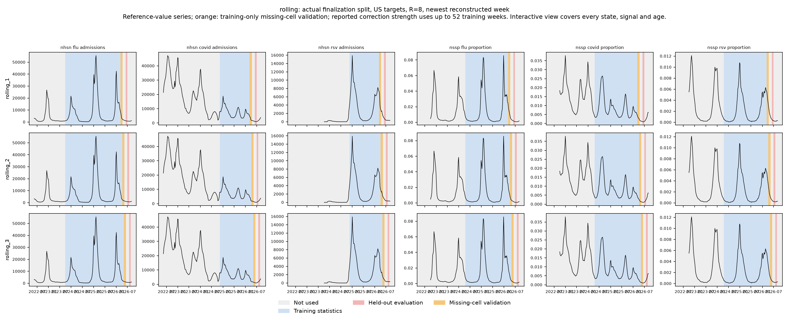
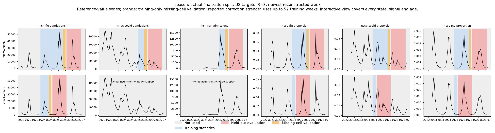

# Wednesday revision explorer

[Open availability and revisions side by side](revisions/comparison.html) · [Open revisions and fitting periods](revisions/index.html).

<iframe class="availability-frame" src="../revisions/index.html" title="Wednesday revisions and actual fitting periods" loading="lazy"></iframe>

Each point compares the report in a nominal Wednesday panel snapshot with the frozen reference snapshot of **September 22, 2026**. The default signed percentage is **100 × (reference − Wednesday report) / Wednesday report**. Positive means revised upward, negative means revised downward, and zero means unchanged. The denominator can instead be the reference value. Both axes auto-scale independently with rounded ticks and without clipping. The revision axis includes zero but does not force it to the middle; gridlines follow the percentage ticks on the left axis. Each colored line is a Wednesday forecast round; select 2–12 trailing weeks or isolate a single round. The black dashed reference-value history uses the right axis in raw signal units.

Material assumptions and definitions:

- The frozen reference is treated as final for this comparison; it is not a guarantee against future revisions.
- All signals show T−0 through T−(N−1), with N selectable from 2 to 12, where T−0 is the preceding Saturday. Points sit on actual Saturday observation dates. A dotted horizontal tail connects a finite T−0 point to its forecast Wednesday; that tail is a date guide, not an additional observation. This revision view does not shift the window for source-specific publication lags. The fitting view does use each source's documented T−X boundary: X=1 for ILINet, clinical-lab influenza positivity and FluSurv; X=0 otherwise.
- Snapshots use the processed panel's existing as-of cutoff policy. This exporter does not reconstruct additional publication times or assume that an absent archived report proves late publication. The availability evidence explorer is a separate view.
- No report, no reference, and undefined percentages are separate from zero revision. If both values are zero, change is zero; otherwise a zero denominator is undefined. If both are unavailable, the point is classified as “missing report.” Missing or undefined points break lines and remain explicit in CSV exports. Weeks before the panel calendar are blank.
- Kinsa is national-only; no state values are synthesized. Other sources retain their native missing values and unsupported locations.
- Training/evaluation backgrounds come from `reporting-triangle-v11-20261001`, with the pinned panel hash checked and recomputed mask counts checked against saved run manifests. The current model reconstructs eight weeks; reconstruction age is selectable. The signal masks are checked against that experiment.
- A role describes the example's observation week at the selected reconstruction age, not every history value used as a feature. At fixed age, an observation week maps to a single Wednesday. Skipped signal/fold fits are entirely unused. Location eligibility is applied to held-out cells as in the experiment.
- The nowcaster uses **chronological missing-cell validation** inside outer training, shown in orange; those rows also enter the final gap-model refit. Reported-cell correction strength is fitted over up to 52 training weeks. Red denotes held-out evaluation. There is a four-week maturity/gap rule; scored observation dates are purged from training across all ages. Historical labels use the later frozen reference, so these remain retrospective experiments rather than strict prospective replay.

## Forecast-style split figures

US targets, R=8, newest reconstructed week. The interactive view above covers all available locations, signals and ages.





Regenerate without fitting or scoring:

```bash
.venv/bin/python -m tapestry.explorer.revisions --experiment data/experiments/reporting-triangle-v11-20261001
```

For the reporting-triangle model these colors describe reference-label calibration and scoring. Development factors are updated each Wednesday using available report pairs, including earlier evaluation-period reports. They are not a depiction of every triangle input.
