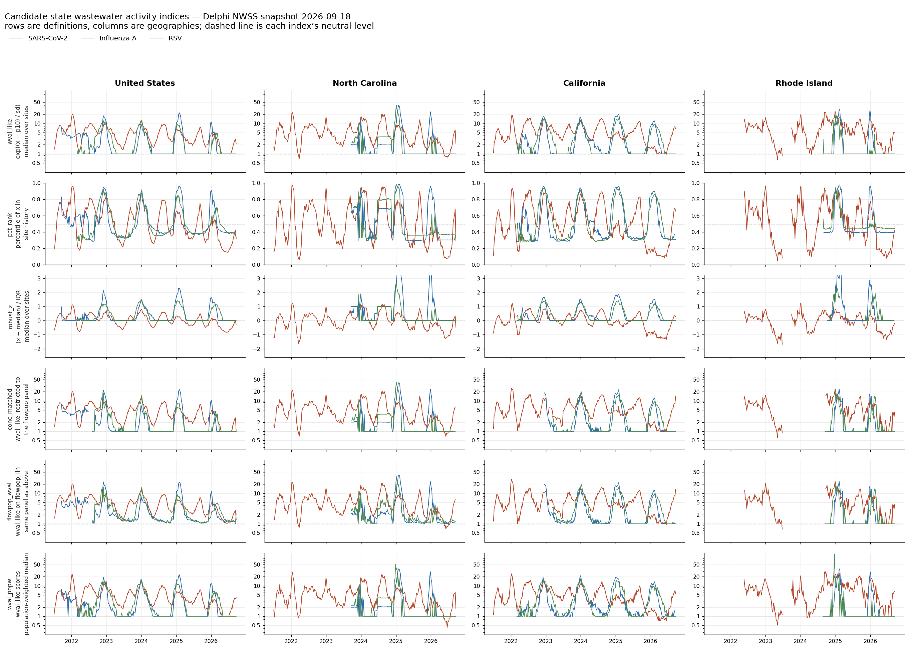

# Wastewater: CDC WVAL, Delphi NWSS, and what we can rebuild

Status: production indices section current as of 2026-09-22; the rest is an analysis note, 2026-09-20. Supersedes nothing; it extends the
September 13 audit (`analysis/wval/report.md`), whose evidence files and
scripts remain the primary record for the revision counts quoted here.

## Production indices (`derived_nwss_state_indices`)

The panel's wastewater covariates (`ww_wval_like`, `ww_pct_rank`; one column per
pathogen) come from the derived raw snapshot `derived_nwss_state_indices`, rebuilt by

```bash
python -m tapestry.dataset.build nwss-indices --data-root data
```

(`src/tapestry/dataset/nwss.py`). Run it after pulling `delphi_nwss` or
`delphi_nwss_aux` and before `tapestry.dataset.build build`. It is not part of
`build` because it streams the 1.2 GB auxiliary archive (minutes) and its inputs
only change when NWSS is re-pulled. It registers a new snapshot (`data.csv.gz`:
`report_time, geo_type, geo_value, reference_time, pathogen, wval_like, pct_rank,
n_sites`, plus `derivation.json` with input checksums) and moves `latest.json` to it.

History: this is the builder that produced the 2026-09-21 snapshot
(`tapestry.model_data build-b2-nwss`, removed in the 2026-09-21 restructure,
restored 2026-09-22 with the same policy, from the deleted source in git history).
Regenerating it on 2026-09-22 from the same `delphi_nwss`/`delphi_nwss_aux`
snapshots (identical input sha256s) gave 880,352 rows against the stored 880,384:
**every shared row is bit-identical** (`wval_like`, `pct_rank`, `n_sites`, max
absolute difference 0), and the 32 extra stored rows are one US row per report time
for reference week 2020-02-29 with `n_sites = 1`, which the >= 3 site rule excludes.
The committed builder had that rule, so the stored snapshot came from a variant that
did not apply it nationally; the week is before the panel calendar (2023-09-02), so
`panel.npz` is unchanged by the regeneration (verified array by array; only the
recorded snapshot id changes). The two formulas
(`score_wval`, `score_pct_rank`) are defined in `tapestry.dataset.nwss` and imported
by the analysis module `analysis/covariates/indices.py`, which keeps the
full-history (not origin-safe) variant used in §7 below.

Policy, applied separately at every Delphi report time R from 2026-02-25 (first
archive vintage; earlier states cannot be reconstructed):

- Publisher state at R: latest row per sample key reported on or before R
  (retractions count); value finite and > 0, reference date <= R, and a visible
  aux row giving the state (`state_territory`) and `major_lab_method`, both
  versioned. Same-release conflicting duplicates become missing.
- Group g = (sewershed, `nwss_source`, `pcr_target`, `major_lab_method`), x = ln(value).
  Eligible with >= 26 distinct weeks and sd(x) > 0, using only samples visible at R.
- `wval_like` = exp((x - p10_g) / sd_g); `pct_rank` = percentile of x within g.
- Mean over a group's samples in a Saturday-ending week, median over groups at a
  site, median over sites per state and nationally (`US`); both need >= 3 sites.
- A state-week present at an earlier report time and absent now gets an explicit
  null row.

`tapestry.dataset.build` then takes, for each cutoff day, the latest non-missing
value reported on or before it. Plots of both indices for US, NC and a few states,
and their state coverage per week: [panel analysis §5](panel.md#5-wastewater-indices-nwss).

## Earlier analysis note (2026-09-20)

The rest of this page is the analysis that chose the indices. It predates the
restructure. For the forecasting experiment that used them, see the
[B2 results and diagnosis](../legacy-v0/results/B2-screen/index.md) (legacy). The
alternative index proposal and synthetic wastewater availability used in the
exploratory regressions below were not used in B2. Its "Build B" and selection
remarks refer to the [legacy B0 dataset](../legacy-v0/data/build-b-finalized.md);
sewershed observations are still excluded from `SelectedData` and the explorer
(see [shared selection](selection.md)).

## Summary

1. **CDC's state WVAL is a published series** and can be pulled directly from the
   dashboard's JSON feed. No modelling required.
2. **Delphi's `nwss` source does not publish WVAL.** It publishes the *inputs*:
   per-sample concentrations, versioned by `report_time`.
3. **Delphi does carry every field the WVAL recipe needs**, in its `aux_data`
   table — including `lod_sewage`, `major_lab_method`, `state_territory` — and
   that table is itself versioned. This is the finding that changes the picture
   relative to the September 13 report, which left the auxiliary table
   unexamined.
4. **Both feeds revise.** CDC WVAL revisions are demonstrated (15 changed
   Pennsylvania site values across one weekly update, some months old). Delphi
   concentration revisions are demonstrated (5,091 keys with differing values
   across report times in one signal's archive).
5. **The reason to rebuild WVAL from Delphi rather than scrape CDC** is vintage,
   not accuracy: CDC gives you today's WVAL for all history, Delphi lets you
   compute WVAL *as it would have been computable* at a past forecast origin.
   That is exactly the property this project is built around.
6. **A state index is built** (§7), for all three pathogens and 1,981
   sewersheds. For use as a forecasting covariate the recommended pair is
   **`log_mean`** (level) and **`frac_above`** (detection prevalence), tested
   against NHSN admissions. A WVAL-style median pins at its floor for 62% of
   influenza and 66% of RSV state-weeks and is unusable as a covariate there.
   Population weighting and flow-population normalization were tested and
   rejected.
7. **At a Wednesday origin, NHSN is fresher than wastewater** — 4 days versus a
   median 11. Against an autoregressive NHSN baseline rebuilt from real
   vintages, wastewater adds +0.006 to +0.012 R² at one week ahead and **+0.04
   to +0.065 at three to four weeks**, consistently across all three pathogens.
   Conditioning on vintage rather than final NHSN costs the baseline only
   0.002–0.028 and leaves the wastewater gain essentially unchanged (§7).

## 1. How WVAL is actually computed

From the [NWSS CoE Collaborative Script](https://github.com/CDCgov/NWSS/tree/master/jurisdiction-scripts/WVAL%20Collaborative%20Script)
(saved locally as `analysis/wval/evidence/CoE_Collaborative_Script_WVAL.Rmd`),
which is an R translation of CDC's Python pipeline under the **August 2025**
methodology.

Grouping unit — the "site/method combination" — is
`(site, data submitter, PCR target, lab method, normalization method)`.
Everything below is computed within that group.

```text
# 1. per-sample log concentration, with censoring
x[i,t] = log(conc_lin[i,t])                        # natural log
         with conc_lin replaced by lod_sewage/2 when below LOD

# 2. baseline and scale, from a trailing window (see reset rules)
baseline[i] = 10th percentile of x[i, window]
sd[i]       = standard deviation of x[i, window]

# 3. z-score, then exponentiate back to linear
index[i,t]  = exp( (x[i,t] - baseline[i]) / sd[i] )

# 4. site-week
wval_site_week[i,w] = mean(index[i, t in w])

# 5. state-week — UNWEIGHTED median over eligible sites
wval_state[s,w] = median(wval_site_week[i,w] for i in s, i eligible)
```

Two details that are easy to get wrong:

- Step 3 exponentiates. WVAL is `e^z`, not `z`. A WVAL of 1.0 means "at
  baseline + 0 SD"; the category cut points below are therefore on a
  multiplicative scale.
- Step 5 is an **unweighted** median of *sites*, not of samples and not
  population-weighted.

### Baseline reset schedule

| Pathogen | Window | Reset | Warm-up for new sites |
|---|---|---|---|
| SARS-CoV-2 | previous 24 months | April 1 and October 1 | recomputed on every new sample until 6 months of history |
| Influenza A | previous 24 months | August 1 | recomputed weekly until 12 months of history |
| RSV | previous 24 months | August 1 | recomputed weekly until 12 months of history |

Because baselines are recomputed against a moving 24-month window, **every
historical WVAL changes at each reset**, even when no new sample arrives for
that week. This is the structural reason WVAL is not a fixed historical series.

### Eligibility

Sites need **≥ 8 weeks** of samples for that pathogen before entering any
median. For influenza A and RSV there is an additional seasonal gate: a site
enters on August 1, and data reported after October 1 of that year are held
until the *following* August 1.

### Category cut points (linear index scale)

| Category | SARS-CoV-2 | Influenza A | RSV |
|---|---|---|---|
| Very Low | ≤ 2.0 | ≤ 2.7 | ≤ 2.5 |
| Low | ≤ 3.4 | ≤ 6.2 | ≤ 5.2 |
| Moderate | ≤ 5.3 | ≤ 11.2 | ≤ 8.0 |
| High | ≤ 7.8 | ≤ 17.6 | ≤ 11.0 |
| Very High | > 7.8 | > 17.6 | > 11.0 |

Intervals are right-closed.

## 2. Is `CDCgov/NWSS` the WVAL code?

**No — not officially.** The repository is a code-sharing space; its README
says CDC does not review submitted code and cannot guarantee it works. Its only
top-level content is `jurisdiction-scripts/`, plus a submission guide and
licence.

The WVAL Collaborative Script inside it is maintained by Colorado and
Washington, and is the best available written specification of the algorithm —
that is why the recipe above is quoted from it. But it targets **August 2025**
methods. CDC's [WVAL methodology page](https://www.cdc.gov/wastewater/about/wval.html)
documents **August 2026** changes (outlier winsorization; laboratory-based
initialization for newer sites) that the script does not implement. Treat the
script as documentation, not as a drop-in reference implementation.

## 3. Getting CDC's published state WVAL

The dashboard's own feed, discovered from
[state.html](https://www.cdc.gov/wastewater/respiratory-viruses/state.html) via
[state-page-combined.json](https://www.cdc.gov/wastewater/modules/state-data/state-page-combined.json):

```
https://www.cdc.gov/wcms/vizdata/NCEZID_DIDRI/NWSS_WVAL_metric/NWSSWVALStateActivityLevel.json
```

All three pathogens in one file, keyed `(State/Territory, Week_End,
Pathogen_Target)`, carrying `State/Territory_WVAL`, `..._WVAL_Category`,
`Coverage`, and `Date_Updated`. 16,264 rows at the September 13 pull.

Two things to know before wiring this up:

- The per-pathogen legacy CSVs (`nwsssc2stateactivitylevelDL.csv` and
  siblings) are the endpoints used by the WVAL Collaborative Script and by the
  **existing scraper in `../Pfizer Consulting 2026/research/CDC-WVAL-scrap/`**.
  Those return 404 under the CDC domain as of September 13. The Pfizer CSVs are
  stamped 2026-02-12 and carry `National_WVAL` and `Regional_WVAL` columns the
  combined JSON does not. If we want national/regional WVAL, the combined feed
  alone is not enough and the Pfizer snapshot is the only local copy.
- This is a dashboard asset, not a contracted API. Save complete dated payloads
  with retrieval timestamps under the project's normal provenance rules
  ([storage and provenance](storage.md)).

Site-level WVAL remains available as Socrata
[`atcp-73re`](https://data.cdc.gov/resource/atcp-73re.json), already cataloged
as `cdc_nwss_wval`. Taking an unweighted median of `site_wval` reproduced
Pennsylvania's dashboard values: of 312 numeric state-week/pathogen pairs, 270
matched to 1e-9 and all 312 within ~0.005.

**Neither route is versioned.** Both give you today's recomputation of all
history.

## 4. Delphi: what is actually there

Signal rows (`/epidata/v5/snapshot/` and `/archive/`, `source=nwss`,
`geo_type=sewershed`) have exactly these columns:

```
signal, report_time, geo_type, geo_value, fill_method,
reference_time, nwss_source, sample_index, pcr_target, value
```

The companion table at `/epidata/v5/aux_data/?source=nwss` joins on
`(report_time, geo_value, reference_time, nwss_source, sample_index,
pcr_target)` — the project's `delphi_nwss` natural key plus `pcr_target` — and
supplies:

| Field | WVAL step it serves |
|---|---|
| `state_territory`, `county_fips`, `counties_served`, `population_served` | state aggregation (step 5); population only for sensitivity analysis |
| `lod_sewage` | censoring in step 1 |
| `major_lab_method`, `concentration_method`, `extraction_method`, `pcr_type` | the "lab method" part of the grouping key |
| `pcr_target_units`, `pcr_gene_target_agg` | unit/target consistency within a group |
| `nwss_source` (signal side) | the "data submitter" part of the grouping key |
| `rec_eff_percent`, `hum_frac_*`, `inhibition_*`, `ntc_amplify` | QC, not used by WVAL but available |

Verified live on 2026-09-20: the endpoint returns CSV with a `report_time`
column and multiple vintages interleaved. It accepts **no filter beyond
`source` and `limit`** — not `report_time`, not `geo_value`, not `pcr_target` —
so vintage and geography selection both happen client-side after download. The
full table is **10.1 GB / 26,951,813 rows**. One streaming pass keyed on the
sample identifiers reduces it to the 1.3 M rows that join to the three
concentration signals, which is what `analysis/wval/index/extract_aux.py` does.
The join is exact: all 1,291,113 signal keys matched.

### What is missing relative to the WVAL script

- **No explicit `pcr_target_below_lod` flag.** Derive it as
  `conc_lin < lod_sewage`, and record that this is a derivation, not CDC's flag.
  In practice this turned out to be unnecessary: across all three
  concentration feeds there are **no zeros and no missing values**, and each has
  a hard minimum (0.249 for SARS-CoV-2, exactly 2.0 for influenza A and RSV).
  Non-detects are already floored upstream, so `lod_sewage` was not used in §7.
  The floor has large consequences for flu and RSV — see §7.
- **`fill_method`.** Every row in the snapshot checked was `source`. Confirm
  what other values exist before assuming it can be ignored.
- **No normalization-method field as such.** Normalization is encoded in the
  *signal choice* (`avg_conc_lin` vs `flowpop_lin` vs `mic_lin`), so the
  grouping key's "normalization method" dimension is fixed by which signal you
  run the pipeline on. Run one pipeline per normalization; do not pool.

### The normalized signals are CDC's, not Delphi's

CDC's own Socrata schema already carries `pcr_target_avg_conc_lin`,
`pcr_target_flowpop_lin` and `pcr_target_mic_lin`, and Delphi declares those as
the source fields for `*_avg_conc_lin`, `*_flowpop_lin` and `*_mic_lin`. Delphi
renames; it does not derive.

Both are reproducible from `aux_data`, which is worth knowing before trusting
them. Over 304k SARS-CoV-2 samples, `flowpop_lin / (conc_lin × flow_rate /
population_served)` equals **3,785,400** from the 1st to the 99th percentile —
the million-gallons-to-litres constant, rounded from 3,785,411.784. It is exact
arithmetic, nothing estimated. About 1% of rows are off by exactly 1000×,
i.e. submitters reporting flow rate in inconsistent units, passed through
uncleaned. For the microbial ratio, `mic_lin / (conc_lin / hum_frac_mic_conc)`
has median exactly 1.0000 but an IQR of 0.994–1.005, so the marker
concentration in `aux_data` is close to but not identical to the one used.

The decisive constraint is coverage, not precision. The two normalizations suit
different sample matrices and neither covers the network:

| sample matrix | n | has flowpop | has mic |
|---|---:|---:|---:|
| raw wastewater | 268,418 | 96% | 43% |
| post grit removal | 89,617 | 52% | 88% |
| primary sludge | 25,109 | **0.9%** | 100% |

Switching the whole pipeline to `flowpop_lin` drops essentially every sludge
site; `mic_lin` drops over half the raw-wastewater samples. This is very likely
why CDC keeps normalization method in the grouping key and runs per method
rather than picking one. The microbial denominator is also not one marker —
243k samples use PMMoV, but crAssphage, HF183 and F+ RNA coliphage also appear,
and they are not interchangeable.

## 5. Are there real revisions?

### Delphi — yes, genuine numeric revisions

Scanning the local `flu_avg_conc_lin` archive on the full observation key:

| | |
|---|---:|
| Archive rows | 4,375,142 |
| Distinct observation keys | 326,930 |
| Keys whose stored value differs across `report_time` | **5,091** |

That count includes changes involving missing-value markers. A definite numeric
case: sewershed `1128`, collection date 2026-01-26, `State_Territory`, sample
`5618015` — **859.66** in report 2026-06-26, **600** in report 2026-07-06.
Comparison used `Decimal`, so `1` vs `1.0` is not counted as a change.

So the answer to "is everything just added?" is **no**. Values are restated,
not only appended. But note the qualifier below.

### The February 2026 floor

The checked Delphi metadata has an earliest `report_time` of **2026-02-25**,
while observations reach back to 2020. A 2023 sample appearing in a February
2026 snapshot tells you nothing about what a forecaster knew in 2023. For any
origin before 2026-02-25 there is no real vintage — that is retrospective
analysis on revised data and must be labelled as such.

### CDC — yes, including months-old weeks

Comparing the project's September 4 `atcp-73re` snapshot with a fresh September
11 Pennsylvania pull, on `(state, site, week_end, pathogen)`:

| | |
|---|---:|
| Matched numeric pairs | 14,460 |
| **Numeric WVAL changes** | **15** |
| Added / removed keys | 43 / 0 |
| Category changes | 0 |
| Reconstructed state medians compared | 665 |
| **Changed state medians** | **0** |

Examples at site `ID:2690`: influenza A week ending 2026-02-21 went 17.13 →
17.61; SARS-CoV-2 week ending 2026-08-22 went 2.50 → 1.75.

The important asymmetry: **site values moved, state medians did not.** A stable
state series is not evidence of stable inputs — the median absorbed it. And this
is one state over one ordinary weekly update, well away from a baseline reset
date; the resets in §1 are where the large revisions should live, and we have
not measured one.

## 6. So is it easy to rebuild WVAL here?

**Rebuilding published CDC WVAL: not worth it.** Just fetch it.

**Rebuilding a vintage-correct WVAL from Delphi: feasible and worth costing.**
The algorithm is fully specified in §1, and §4 shows Delphi carries the inputs
with `report_time` on both the signals and the metadata. Concretely:

```text
for each forecast origin T:
    signals = snapshot(source=nwss, signal=<pathogen>_avg_conc_lin,
                       geo_type=sewershed, snapshot_date=T)
    aux     = aux_data(source=nwss) filtered to report_time <= T,
              taking the latest row per key
    join on (geo_value, reference_time, nwss_source, sample_index, pcr_target)
    group by (geo_value, nwss_source, pcr_target, major_lab_method)
    apply steps 1-5 of section 1, using only data with reference_time <= T
```

What we would *not* reproduce, and should say so in any result:

- The August 2026 winsorization and lab-based initialization, absent from the
  script we have.
- CDC's exact eligibility bookkeeping, especially the flu/RSV October 1 cutoff.
- Anything before 2026-02-25, for lack of vintages.

Call the output something other than WVAL — `wval_recon` — and validate it
against CDC's published series on the overlap where both exist. Agreement on
the latest vintage is the test that the recipe is right; the vintages before it
are the thing CDC cannot give us and are the entire point of building it.

Expected shape of a first cut: three pathogens × ~50 states × weekly, one
`report_time` axis, joined into the existing vintage machinery described in
[vintages and geography](vintages-and-geography.md).

**This has since been done for the index rather than for WVAL itself** — see
§7. A `wval_recon` that tracks CDC closely enough to validate against
`atcp-73re` is still unbuilt, and is a different and stricter target than the
index in §7.

## 7. A state index built from Delphi, and how it is defined

Section 6 argued this was feasible. It is built. The code is in
`analysis/wval/index/` with acquisition instructions in its README; the series
is `analysis/wval/evidence/state_indices.csv.gz`.

This is deliberately **not** WVAL and is not named as such. It borrows WVAL's
skeleton — normalize each site against its own history, then take an unweighted
median across sites — because that skeleton is what makes a state aggregate
meaningful. It drops WVAL's moving baseline windows, calendar resets, seasonal
eligibility gates and winsorization.

### The skeleton

Every candidate shares this and differs in exactly one place, so they can be
compared as a controlled experiment:

```text
group g    = (sewershed, nwss_source, pcr_target, major_lab_method)
x          = ln(signal value)
score      = <transform of x against g's own history>      <- the denominator
group-week = mean of score over that week's samples
site-week  = median of group-weeks at that site
state-week = <aggregation over sites>                      <- the weighting
```

The grouping key is the point. A site's concentration scale depends on its
sewer network, its submitter and its laboratory method, so raw concentrations
from different sites are not comparable quantities and their median is not
meaningful. Normalizing each group against **its own** history first is what
makes the cross-site median defensible, and it is also what stops the state
series from jumping when sites enter or leave the panel.

`nwss_source` is in the key because four submitters — `State_Territory`,
`WastewaterSCAN`, `CDC_Verily`, `CDC_Biobot` — report on overlapping
sewersheds with different methods. `major_lab_method` is in the key because
sites change method: including it splits SARS-CoV-2 from 2,415 groups to 4,185.

Eligibility: a group needs **26 distinct sample-weeks** of history before it is
scored at all, and a state-week needs **at least 3 reporting sites**. CDC uses
8 weeks; 26 was chosen to stabilize the baseline, and it is a free parameter.

### The candidates

| key | score | aggregation | signal |
|---|---|---|---|
| `wval_like` | `exp((x − p10) / sd)` | unweighted median | `avg_conc_lin` |
| `pct_rank` | percentile of x within g's history | unweighted median | `avg_conc_lin` |
| `robust_z` | `(x − median) / IQR` | unweighted median | `avg_conc_lin` |
| `conc_matched` | `exp((x − p10) / sd)` | unweighted median | `avg_conc_lin`, flowpop panel only |
| `flowpop_wval` | `exp((x − p10) / sd)` | unweighted median | `flowpop_lin`, same panel |
| `wval_popw` | `exp((x − p10) / sd)` | population-weighted median | `avg_conc_lin` |

`conc_matched` exists only as the control for `flowpop_wval`: the two run on an
identical site panel, so any difference between them is the normalization and
not a change of panel.



### What the comparison shows

Built from `snapshot_date=2026-09-18`, all three pathogens, 1,981 sewersheds.
The `aux_data` join is exact — all 1,291,113 signal sample keys matched.

**Roughness** (sd of the week-over-week change divided by the IQR of the level,
median over states; lower is smoother):

| key | SARS-CoV-2 | Influenza A | RSV |
|---|---:|---:|---:|
| `pct_rank` | 0.255 | **0.337** | 0.363 |
| `robust_z` | 0.319 | 0.350 | **0.290** |
| `wval_like` | 0.388 | 0.854 | 0.587 |
| `conc_matched` | 0.410 | 1.368 | 1.082 |
| `flowpop_wval` | 0.436 | 2.284 | 1.174 |
| `wval_popw` | 0.496 | 0.845 | 0.802 |

**Population weighting is the worst option.** `wval_popw` is the roughest for
SARS-CoV-2 and the least correlated with every other candidate (Spearman
0.86–0.89, against 0.92–0.99 among the rest). A weighted median snaps between a
few large sewersheds instead of moving with the panel. Equal weight per *site*
is the better denominator.

**Flow-population normalization does not settle cleanly.** On the identical
panel, `flowpop_wval` against `conc_matched` gives Spearman 0.981 for
SARS-CoV-2 — no meaningful difference, 90% of weeks within ±0.26 in log — but
only **0.784 for influenza A and 0.755 for RSV**, where it is also by far the
roughest candidate. So the tempting SARS-CoV-2 conclusion that normalization is
redundant does not generalize. The per-site log baseline already absorbs
between-site dilution; what remains is within-site rain dilution, and for the
sparser flu/RSV signals that correction is noisier than the thing it corrects.
Neither pathogen gives a reason to adopt it.

**Influenza A and RSV are mostly non-detect, and this drives everything.** Both
feeds have a hard floor at exactly 2.0 with no zeros or missing values, applied
upstream. The consequence:

| | SARS-CoV-2 | Influenza A | RSV |
|---|---:|---:|---:|
| Groups where the 10th percentile *is* the minimum | 38.7% | **91.2%** | 85.3% |
| Groups with IQR = 0 | 2.5% | **43.4%** | 42.1% |
| Median share of a group's samples sitting on its minimum | 5.7% | **70.9%** | 67.7% |

For flu and RSV the WVAL-style baseline is usually the non-detect floor itself,
so `wval_like` pins at exactly 1.0 through the off-season and carries no
information below baseline — visible as the flat summer segments in the figure.
This is not a bug and CDC's own WVAL behaves the same way, but it means the
index is really measuring *how far above its floor* a site is. It also breaks
`robust_z`: with IQR = 0 for over 40% of flu/RSV groups the score is undefined,
costing 19% of flu and 21% of RSV state-weeks relative to the other candidates.

### Recommended pair, on display criteria only

*Superseded by the covariate analysis below; kept because it records how the
choice looks when judged on smoothness and CDC comparability.*

**`wval_like` as the headline, `pct_rank` as the companion.** `wval_like` is
the only candidate on a scale comparable to CDC's published WVAL, so it is the
only one that can be sanity-checked against `atcp-73re`. `pct_rank` is bounded,
assumes nothing about the distribution, degrades gracefully under the
non-detect floor (ties average rather than pinning), and is the smoothest
candidate for flu and RSV by a factor of 2.5. They correlate 0.96 for
SARS-CoV-2 and 0.76–0.78 for flu/RSV, so disagreement between them is itself a
useful diagnostic — it localizes exactly the weeks where the floor is doing the
work.

Drop `robust_z` (coverage loss on flu/RSV), `wval_popw` (weighting), and the
`flowpop_wval`/`conc_matched` pair (no gain on SARS-CoV-2, active harm on
flu/RSV).

### Selection criterion, corrected: these are covariates, not charts

The comparison above ranked candidates on smoothness and on comparability with
CDC's scale. Both are display criteria. If the purpose is a covariate layer for
forecasting NHSN admissions or ED visits, the right criterion is predictive
information, and it points the other way.

The problem with `wval_like` is precisely that it bottoms out. For influenza A
**62% of state-weeks** have the median pinned at exactly 1.0, and for RSV
**66%** — the index is literally constant across two thirds of its own history,
including every pre-season week when a forecaster most wants to know whether a
wave is starting. A constant covariate contributes nothing there.

Tested against NHSN admissions per 100k from the local `cdc_nhsn_final`
snapshot, Spearman between the index at week *t* and admissions at *t+lag*,
median over states. Two further aggregations of the *same* per-site scores are
included: `log_mean`, the mean of log score across sites instead of the median,
and `frac_above`, the share of sites whose week sits above their own observed
floor — a detection-prevalence measure rather than a level.

All weeks, lag 1:

| pathogen | `wval_like` | `pct_rank` | `frac_above` | `log_mean` |
|---|---:|---:|---:|---:|
| Influenza A | 0.719 | 0.740 | 0.732 | **0.761** |
| SARS-CoV-2 | 0.633 | 0.621 | 0.636 | **0.638** |
| RSV | 0.500 | 0.654 | 0.647 | **0.659** |

Restricted to the weeks where `wval_like` is pinned at exactly 1.0, lag 2:

| pathogen | share of weeks | `wval_like` | `robust_z` | `pct_rank` | `frac_above` | `log_mean` |
|---|---:|---:|---:|---:|---:|---:|
| Influenza A | 62% | undefined | 0.358 | 0.354 | 0.388 | **0.424** |
| SARS-CoV-2 | 7% | undefined | — | 0.033 | **0.687** | 0.444 |
| RSV | 66% | undefined | 0.459 | 0.550 | **0.538** | 0.523 |

`wval_like` has no entry because it has zero variance there, so the correlation
does not exist. Everything else retains real signal in exactly the regime where
the headline index is dead.

Two qualifications on the mechanism. First, the censoring is in the **data**,
not the transform: 62.5% of influenza samples sit exactly on their group's
floor, and only 0.3% of scores fall below 1. No choice of transform invents
information that the measurement does not contain. Second, despite that,
`robust_z` *is* partially better than `wval_like` — 0.358 for flu in the pinned
regime — because it centres on the median rather than the 10th percentile, so a
floor sample from a group whose median is above floor still scores negative.
But it is still constant for 77% of pinned flu weeks, against 26% for
`frac_above`, and it is undefined for the 43% of flu groups with zero IQR, so it
is usable in 40 states against 45. Its advantage is real but partial.

What actually recovers the information is changing the **aggregation**, not the
transform. A median across sites discards the fact that 20% of sites have lifted
off their floor while 80% have not; a count does not. This is the same
distinction as between a median and a prevalence, and at wave onset the
prevalence is the thing that moves first.

### Recommended set, revised

For use as a covariate layer:

- **`log_mean`** as the level covariate. Defined in every week, best or tied-best
  at every lag for every pathogen, and it degrades gracefully rather than
  pinning.
- **`frac_above`** as the companion. It carries the onset signal, is the
  strongest single predictor inside the censored regime for SARS-CoV-2 and RSV,
  and is close to `log_mean` for influenza A. It is also directly interpretable
  as reporting-site detection prevalence.
- **`wval_like`** retained only for validation against CDC's published WVAL, not
  as a model input.
- Carry `n_sites` alongside both, since the precision of either aggregate
  depends on it.

`pct_rank` remains a reasonable robust alternative to `log_mean` but is
dominated by it in this test; `wval_popw` is still rejected on weighting
grounds, and `flowpop_wval` on §7's normalization evidence. Note that `robust_z`
was rejected above on coverage and smoothness — on the predictive criterion it
is defensible, and the earlier rejection should be read as "not needed given
`log_mean` and `frac_above`" rather than "uninformative".

The lead structure is weak for all of them: correlation is flat or declining
from lag 0 to lag 4, so none of these behaves like a clean leading indicator at
state-week resolution. That is an argument for treating wastewater as a
concurrent nowcast covariate rather than as a source of lead time, and it should
be tested properly inside a forecasting model rather than inferred from marginal
correlations. Reproduce with `analysis/wval/index/covariate_test.py`.

### At a Wednesday forecast origin, NHSN is fresher than wastewater

The lead correlations above are indexed by **sample collection date**, which is
not what a forecaster holds at an origin. The operational question needs
reporting latency, and it was measured on both feeds.

| feed | days from week end / collection to first publication |
|---|---|
| NHSN state admissions (Delphi archive, first `report_time`) | **4 days**, at every decile — the week ending Saturday appears the following **Wednesday** |
| Delphi NWSS samples (report vs collection, post-backfill rows) | median **11 days**; p25 9, p75 16, p90 19 |

Only **8% of wastewater samples arrive within 5 days** of collection; 62% within
12 days; 90% within 19. So at a Wednesday origin the forecaster holds NHSN
through the week that ended four days earlier, complete, while wastewater's
reference week *t* is about 8% reported, *t−1* about 60%, and *t−2* about 90%.

**Wastewater is roughly one to two weeks staler than NHSN at that origin.** This
inverts the usual claim that wastewater leads clinical surveillance. It leads in
biology — shedding precedes admission — but this pipeline loses that lead and
more to reporting. Combined with the flat-to-declining lead profile measured
above, wastewater here is a concurrent-or-lagging indicator in wall-clock terms.

### How much does it actually add?

Predicting log NHSN admissions per 100k at *t+h* from an origin where week *t*
is known. Baseline is NHSN's own history (level, one lag, one-week growth).
Wastewater enters either at week *t−2* — the freshest realistically available —
or at week *t*, a no-latency upper bound. In-sample R², median over states:

| pathogen | h | NHSN only | + ww(*t−2*) | gain | + ww(*t*), no latency | gain | ww alone |
|---|---:|---:|---:|---:|---:|---:|---:|
| Influenza A | 1 | 0.949 | 0.952 | +0.002 | 0.955 | +0.006 | 0.643 |
| | 2 | 0.857 | 0.872 | +0.015 | 0.880 | +0.023 | 0.556 |
| | 3 | 0.746 | 0.766 | +0.020 | 0.786 | +0.040 | 0.477 |
| | 4 | 0.635 | 0.677 | **+0.042** | 0.681 | +0.046 | 0.389 |
| SARS-CoV-2 | 1 | 0.952 | 0.955 | +0.002 | 0.957 | +0.005 | 0.445 |
| | 4 | 0.768 | 0.785 | +0.017 | 0.796 | +0.028 | 0.340 |
| RSV | 1 | 0.936 | 0.942 | +0.005 | 0.939 | +0.003 | 0.513 |
| | 4 | 0.677 | 0.742 | **+0.065** | 0.739 | +0.062 | 0.313 |

Three readings, in order of how much they should change what we do:

1. **At one week ahead, wastewater adds essentially nothing** — two to five R²
   points in the third decimal, against an autoregressive baseline already at
   0.95. Recent admissions contain almost everything wastewater would tell us
   about next week.
2. **The gain grows with horizon**, reaching +0.042 for influenza A and +0.065
   for RSV at four weeks. That is a real if modest contribution, and it is
   exactly where an AR baseline runs out of information.
3. **Latency is not the binding constraint.** Giving the model wastewater with
   zero reporting delay barely improves it — +0.046 rather than +0.042 for flu
   at h=4, and nothing at all for RSV. So the Friday release schedule is not
   what is limiting the signal. Wastewater is simply largely redundant with
   recent admissions.

### The caveat that could overturn this

The baseline above uses **final** NHSN values for week *t*, which no forecaster
has on the Wednesday. Real-time NHSN is substantially revised: over
2024-11 onward, **67% of state-week flu admissions changed after first
publication**, and the first published value is a median of 0.944 of the final,
with the 10th percentile at 0.667 — one in ten first reports lands a third below
where it ends up.

So the AR baseline here is an oracle baseline, and it is flattered by exactly
the amount NHSN backfills. A vintage-correct rerun would weaken it, and
wastewater — whose own revisions are milder (§5) — would gain ground against a
noisier recent-admissions signal. **These numbers are therefore a lower bound on wastewater's value.** That
objection has since been tested directly — see the next subsection. The
understatement turned out to be small.

Other limits: in-sample R² with no cross-validation, linear and additive,
marginal rather than within a real forecasting model, and states pooled by
taking a median of per-state fits. Reproduce with
`analysis/wval/index/wednesday_test.py`.

### Rerun against real NHSN vintages: the caveat does not overturn it

The test above was redone with the autoregressive features rebuilt from the
Delphi NHSN archive **as they actually stood at each Wednesday `report_time`**,
carrying values forward between restatements. Only the target stays final. Both
arms use the same origins — the archive begins 2024-11-19, so this is roughly
two seasons and a median of **81–84 origins per state**, against ~250 in the
full-period run.

In-sample R², median over states:

| pathogen | h | AR on final | AR on vintage | cost of vintage | AR vintage + ww | **gain** | gain with final AR |
|---|---:|---:|---:|---:|---:|---:|---:|
| Influenza A | 1 | 0.920 | 0.907 | 0.013 | 0.913 | +0.006 | +0.004 |
| | 2 | 0.836 | 0.821 | 0.015 | 0.838 | +0.017 | +0.017 |
| | 3 | 0.743 | 0.724 | 0.018 | 0.766 | +0.041 | +0.036 |
| | 4 | 0.651 | 0.636 | 0.014 | 0.695 | **+0.058** | +0.057 |
| SARS-CoV-2 | 1 | 0.884 | 0.868 | 0.016 | 0.880 | +0.012 | +0.009 |
| | 2 | 0.817 | 0.800 | 0.017 | 0.826 | +0.026 | +0.013 |
| | 3 | 0.730 | 0.702 | 0.028 | 0.767 | **+0.065** | +0.036 |
| | 4 | 0.643 | 0.632 | 0.012 | 0.696 | **+0.065** | +0.070 |
| RSV | 1 | 0.893 | 0.890 | 0.003 | 0.898 | +0.008 | +0.008 |
| | 2 | 0.846 | 0.844 | 0.002 | 0.857 | +0.013 | +0.018 |
| | 3 | 0.790 | 0.781 | 0.009 | 0.802 | +0.021 | +0.024 |
| | 4 | 0.719 | 0.700 | 0.019 | 0.739 | +0.039 | +0.042 |

**The caveat was real but small, and it does not change the conclusion.** Using
the vintage a forecaster actually held costs the autoregressive baseline only
0.002–0.028 R². NHSN revises 67% of its flu observations, but those revisions
turn out to matter little for a model conditioning on the last two weeks —
presumably because the backfill is largely proportional and the growth term
absorbs it.

More to the point, the wastewater gain is **essentially identical in the two
arms** — +0.058 versus +0.057 for influenza A at four weeks, +0.039 versus
+0.042 for RSV. Wastewater is not compensating for NHSN's backfill; it is adding
its own, separate, small amount of information. The one exception is SARS-CoV-2
at three weeks, where the gain roughly doubles under vintage conditioning
(+0.065 against +0.036), the only cell where wastewater visibly substitutes for
knowing the truth about last week.

So the earlier verdict stands, with the uncertainty removed:

- **One week ahead: not worth it.** +0.006 to +0.012 against a baseline of
  0.87–0.91.
- **Three to four weeks ahead: worth testing properly.** +0.04 to +0.065,
  consistent across all three pathogens, and robust to how the baseline is
  conditioned.
- The restricted period gives somewhat larger gains than the full-history run
  (influenza A at h=4: +0.058 here against +0.042 over 2021-2026), which is
  consistent with wastewater coverage having improved, but the two runs are not
  directly comparable and this was not tested.

**These are raw R².** Redoing the same fits with R² adjusted for predictor
count roughly halves every gain — influenza A at h=4 falls from +0.058 to
+0.023, SARS-CoV-2 at h=3 from +0.065 to +0.029. The shape of the conclusion
holds (nothing at h=1, something real at h=3–4) but the effect is about half
this size. See [Clinical covariates](covariates.md), which scores all four
candidate sources on the adjusted measure and is the page to plan against.

Remaining limits are unchanged and now binding: in-sample R², no
cross-validation, linear and additive, states pooled by median of per-state
fits, and only ~82 origins per state. A proper evaluation needs held-out seasons
and WIS rather than R². What this settles is narrower: **the vintage objection
is answered, and the horizon-3-4 signal survives it.** Reproduce with
`analysis/wval/index/vintage_test.py`.

### Known limitations

- **Not origin-safe yet.** Baselines use each group's full history, so the
  series as plotted uses information from after any given week. For forecasting,
  the quantile and sd must be restricted to `reference_time <= T` at each
  origin. That is a small change to `indices.py`, but it will make the index
  drift as baselines mature, and that drift is not characterized.
- The 26-week and 3-site thresholds are unvalidated choices.
- Rhode Island runs on 9 sites, and 5 in the matched panel with a gap through
  2023–24. Small-state medians are jumpy; treat `n_sites` as part of the output.
- North Carolina shows a flat plateau at exactly 2.0 and 4.0 for flu and RSV
  from roughly July to November 2024 — constant values across ~18 weeks. That
  looks like an upstream artifact rather than epidemiology and has not been
  chased down.
- Only `avg_conc_lin` and `flowpop_lin` were tested. `mic_lin` was not, because
  it covers a different and largely disjoint set of sample matrices (§4).

## 8. Concrete next steps

1. Catalog the combined state WVAL JSON as a new snapshot source
   (`cdc_nwss_wval_state`). Cheap, and gives an immediate covariate plus the
   validation target for step 3.
2. Fix the `cdc_nwss_wval` measure labels in
   `src/tapestry/data/catalog.py`: they read
   `wval`/`wval_category` but the downloaded fields are
   `site_wval`/`site_wval_category`.
3. Add `aux_data` acquisition to the `delphi_v5` fetcher — currently it
   does not pull that table at all ([sources](sources.md)). Chunked, given the
   size in §4.
4. Make the §7 index origin-safe: restrict each group's baseline quantile and
   sd to `reference_time <= T`, rebuild at several past `snapshot_date` values,
   and measure how much the series drifts as baselines mature. Until this is
   done the index cannot be used as a forecasting feature.
5. Optionally, prototype a strict `wval_recon` and validate against
   `atcp-73re`. Only worth it if we need comparability with CDC's published
   numbers rather than a defensible index of our own.
6. ~~Rerun the Wednesday-origin test against `delphi_nhsn` vintages.~~ **Done**
   — the vintage objection costs the baseline 0.002–0.028 R² and leaves the
   wastewater gain intact (§7).
7. The forecasting experiment. Baseline vs baseline + `log_mean` and
   `frac_above`, rolling origins, MAE and WIS by horizon and state, with
   missingness preserved rather than zero-filled, and `n_sites` carried as a
   covariate. Weight the effort toward horizons 3–4, where §7 found the gain,
   and use held-out seasons and WIS rather than the in-sample R² of §7.

Steps 1–2 are small and independent. Steps 3–4 are the real commitment, and §7
now supports making them — with the expectation of a modest long-horizon gain,
not a short-horizon one.

## References

- September 13 audit, scripts and evidence: `analysis/wval/report.md`, `analysis/wval/evidence/`
- Index code and acquisition instructions: `analysis/wval/index/README.md`
- [CDC WVAL methodology](https://www.cdc.gov/wastewater/about/wval.html)
- [CDCgov/NWSS](https://github.com/CDCgov/NWSS)
- [Delphi NWSS source](https://cmu-delphi.github.io/delphi-epidata/api/v5-signals/nwss.html)
- Prior scraper and state plots: `../Pfizer Consulting 2026/research/CDC-WVAL-scrap/`
