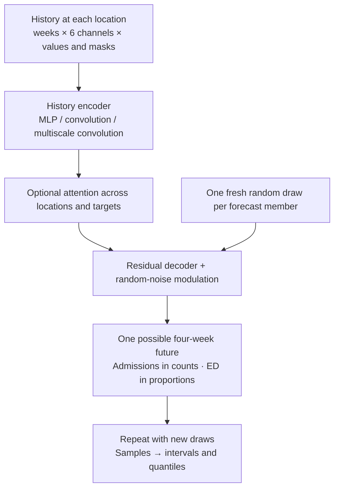
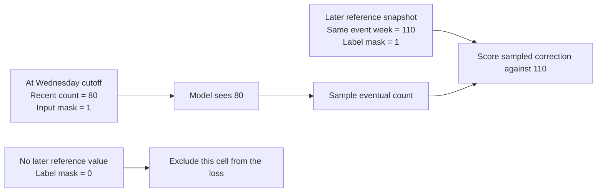
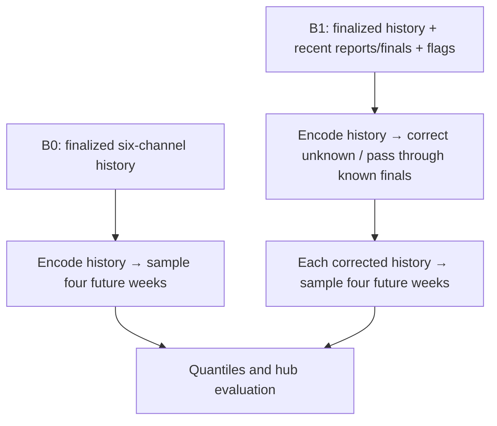

# Architecture

Tapestry uses available surveillance data to learn across pathogens and
generate plausible futures. B0 is the simple version: six
channels, finalized histories, and four-week forecasts. B1 adds historical
reporting states and corrections for recent weeks.

The [front page](../index.md) has the motivation and unicorn results. This page
explains the model and the masks. Exact experiment settings live in
[B0.1](b0.1.md); the vintage implementation is described in [B1](b1.md).

## Where the ideas come from {#2-what-is-borrowed-from-each-paper}

- **[Flusion](https://arxiv.org/abs/2407.19054v1):** learn across surveillance
  signals and locations, with useful transforms and recent-history residuals.
- **[InfluPaint](https://arxiv.org/abs/2604.24913v1):** the modeling background,
  simulation infrastructure, and Slurm job management used as a starting point.
  B0 uses observed data and a direct sample generator; simulation training is
  still on the wishlist.
- **[DeepMind's Functional Generative Networks](https://arxiv.org/abs/2506.10772v1):**
  inject random noise into a network and fit its generated samples with fair
  CRPS. Tapestry adapts that idea to small epidemic forecasting models.
- **EpiBenchmark:** score the exported forecasts against the hub ensembles.

## The model

Each location gets the recent history of all six channels: influenza, COVID-19,
and RSV admissions, plus their three ED proportions. The history includes
values and availability masks. Calendar and population features provide context;
recent dynamics and location embeddings are experiment options.



The MLP flattens the short history. Convolutions learn patterns over successive
weeks; the multiscale version uses several temporal spacings. Attention mixes
the resulting representations across locations, within pathogens or targets,
or across all location–target pairs. These are transformer-style exchange
blocks, not a temporal-transformer encoder.

The experiments tested shared output heads, separate pathogen/target heads,
and independent models by pathogen or target. Even a separately fitted flu-admission model can
use all six local histories. In B0.1 the leading configurations use separate
fits and simple encoders. The stochastic-trend decoder performed poorly
and was removed. See the [comparisons](../results/b0-1-crosses/index.md).

A member is a sampled future, not a predicted mean with an interval added
later. Shared noise can connect its outputs, but good marginal CRPS or WIS
does not by itself establish correct dependence across weeks or locations.

## What the masks mean

A mask says whether a value is available. It is not the value itself. Missing cells are stored
as zero with a false mask, so a real observed zero remains distinct:

| Example | Stored value | Availability mask | Meaning |
|---|---:|---:|---|
| Reported zero admissions | 0 | 1 | Observed zero; the model can use it |
| No report available | 0 | 0 | Missing; the zero is only a storage placeholder |
| Preliminary count of 80 | 80 | 1 | Available input, even if it will later be revised |

The **input mask** controls what the model sees. The **label mask** controls what
can contribute to the loss. They are separate: a missing or provisional input
can still have an eventual observed value to learn from. A missing label cannot
be treated as a zero outcome.



This 80-to-110 example is illustrative, not a measured revision. The later 110
must never replace the historical 80 in the input. In B1, hidden values are
zeroed before transforms, anchors, and derived features, so those features do
not reveal a masked observation. Masking arbitrary sources and adding new
covariates still require evaluation; having mask arrays alone is not evidence
that all missing-data patterns work well.

## B0 prediction and B1 nowcasting

B0 reads a saved finalized panel with axes
`[week, channel, value_or_mask, location]`. A history window has shape
`[lookback, 6, 2, 52]`; its four-week label window has shape `[4, 6, 2, 52]`.
The 52 locations are states, DC, and native US. No state-to-US summation is used.
The [B0 data page](../data/build-b-finalized.md) gives units and source details.

B1 saves finalized older history and two recent weeks of Wednesday reports,
falling back to flagged reference finals where reports are absent. It corrects
unknown recent values, passes through visible known finals, and forecasts four
future weeks. Known finals are excluded from nowcast loss and scoring; hiding
them also hides their flag and restores permitted nowcast supervision.



B0's latest frozen ED snapshot is treated as truth, not assumed permanently
final. B1 reference truth is separately pinned to a cutoff. Recent report selection
includes all of Wednesday UTC. Supplied finals can contain later revisions, so
this experiment measures retrospective conditional forecasting. B0's unicorn results do not establish B1 performance.

## Fitting with CRPS

For an observed value `y` and `M` independent members from one fitted model:

```text
fair_CRPS = mean_m |sample_m - y|
            - sum_{m != n} |sample_m - sample_n| / (2 M (M - 1))
```

The first term measures error; the second accounts for predictive spread.
The fair correction uses distinct member pairs. Scoring follows inverse
transforms, in admission counts and ED proportions. B0.1 used 128 training
members, 256 fixed validation members, and 256 evaluation members.

### Loss scales and weights {#82-design-choices-for-b0-loss-and-weights}


**Adopted 2026-09-15:** the six targets have weights
`[1, 1, 1, .5, .5, .5]` in flu/COVID/RSV admissions, then flu/COVID/RSV ED
order. There is no extra flu preference. Native US receives **20%** of each
target's geography objective; the **80%** state/DC component weights eligible
jurisdictions equally. Seasons receive equal weight, with target weights
normalized over the available targets *inside each season*.

**Values being scored are untransformed.** Count preprocessing (rates,
fourth-root, log1p, etc.) and ED preprocessing are inverted before fair CRPS.
Admissions are scored in counts; ED is scored in 0–1 proportions. Exported WIS
likewise uses native values, with admission quantiles rounded to integers.
Neither loss is computed in fourth-root or logit space.

For fitting, define `s[c,l]` from native observed values in the fitting partition:

- With at least 26 observed unique weeks, use that channel/location's Q95.
- With fewer observations, use `alpha * local_Q95 + (1-alpha) * pooled_channel_Q95`,
  where `alpha = n_observed / 26`; no observations use the pooled scale.
- Apply positive floors of **1 admission** and **.001 ED proportion** (0.1
  percentage points). Missing placeholders do not enter the quantiles.

The 26-week pooling threshold and these floors are explicit engineering
assumptions, not tuned results. Scales are fitted independently inside every
outer/inner fitting partition and saved in checkpoints. They are fixed across
representation and target-weight alternatives using the same partition.
Normalization does not modify the observations: an admission CRPS of 20 with a
historical Q95 of 200 contributes `20/200 = .10` to the normalized mean.

```text
E[s,c,l] = mean_valid_dates_and_horizons(fair_CRPS_native / scale[c,l])
G[s,c]   = .80 * mean_states_and_DC(E[s,c,l]) + .20 * E[s,c,US]
L[s]     = sum_available_channels(weight[c] * G[s,c]) / sum_available_channels(weight[c])
L        = mean_available_seasons(L[s])
```

Season membership uses the target date. Missing channels receive no weight in
that season; valid zero observations remain eligible. Locations without labels
are excluded from their state mean. If only one geography group is available,
its weight renormalizes to one. The usual six-channel/52-location corpus has
both groups. Masks and fixed per-cell weights are computed for the whole fitting
partition before minibatching, so random batch composition does not redefine
season/channel/location weights. Training and early stopping use this same
aggregation; all validation noise sources use fixed independent draws.

**Q95 normalization is a training surrogate for relative skill, not relative
WIS against an ensemble.** Q95 measures typical outcome magnitude, not baseline
forecast difficulty. The selection score below instead divides model WIS
by ensemble WIS within each location. Do not divide training errors by that
week's observed outcome or realized benchmark error. A future training-side
baseline-error normalizer would be a separate, explicitly evaluated alternative.

## Comparing with the ensemble {#103-metrics}

Export 23 quantiles and score WIS on the same frozen tasks as the hub ensemble.
For each location, target, and season, divide the sum of model WIS by the sum
of ensemble WIS. Average location ratios with 80% on equally weighted states/DC
and 20% on native US. Within a season, weight admission targets 1 and ED targets
0.5; then average the season scores equally. Missing groups renormalize over
available support. Nonpositive ensemble denominators are errors.

**One means ensemble parity; lower is better.** Average scores over the three
seeds and report their spread. Coverage and individual target/season results
remain necessary alongside the combined score.

The frozen comparison support is incomplete:

| Season | Targets with ensemble comparison support |
|---|---|
| 2023–24 | Influenza admissions |
| 2024–25 | Influenza and COVID-19 admissions |
| 2025–26 | All six targets |

Each fold trains on the other two seasons. These are retrospective experiments
with finalized inputs, and the same seasons informed model selection. They do
not measure an operational information boundary or an untouched holdout.

## Log


- **2026-09-15 — B0 objective:** adopted native-unit fair CRPS with training-only
  channel/location Q95 normalization, admission/ED weights 1/.5, US 20%, equal
  state/DC weights, and season-first averaging. Selection uses location-level
  ensemble-relative WIS. This replaces pooled channel loss scaling and the
  target-first pooled-WIS selection score. Fixed shared-factor validation draws;
  US is a direct forecast, so state-error cancellation is not its mechanism.
  See [B0 follow-up](../results/b0-crosses/next-steps.md) for rationale and
  remaining hypotheses. No new model-performance claim follows from these edits.

- **2026-09-16 — Documentation:** replaced the proposal-style architecture
  with the implemented model, masks, data flow, and scoring contract. Removed
  research questions, data tiers, speculative experiment plans, and obsolete
  defaults. The front page now carries the personal motivation and unicorn
  update. Mask examples are illustrative; reported scores were not recomputed.

- **2026-09-16 — Tone:** retained first person only in the front-page opening
  sentence; removed personal asides and tightened the unicorn definition.
