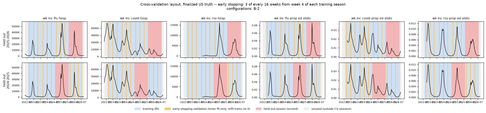

# B-2: scheduled availability and final values

B-2 trains on finalized values with the human-made T-0/T-1 availability schedule
at the top of [Data](../data/index.md). The schedule is identical during fitting,
early stopping and evaluation. Final labels remain available for scoring whenever
the dataset contains them. This is a retrospective experiment: final revisions
are supplied, not the values originally released at each deadline.

## Season splits

| Role | Training seasons | Evaluation season |
| --- | --- | --- |
| Forward-time season holdout | 2022–2023, 2023–2024, 2024–2025 | 2025–2026 |
| Retrospective season holdout | 2022–2023, 2023–2024, 2025–2026 | 2024–2025 |

Seasons use CDC epiweeks 31–30. The second split intentionally trains on a season
later than its evaluation season. Training inputs, labels, standardization and
loss scales exclude all held-out weeks. Evaluation may use earlier observed
weeks as context. Missing historical targets (including RSV admissions in
2022–2023) remain missing; six targets does not imply complete historical support.
Early stopping uses three hidden weeks every sixteen weeks starting at season
week four, within training seasons only; selected epochs are refitted on all
three training seasons. Cap 300 epochs, patience 30.

## Availability and missingness assumptions

T is the latest completed Saturday, four days before a Wednesday issuance.
T-1 means the newest context week is unavailable; earlier finite final values
are supplied without shifting them to another observation date. All six target
histories use T-0. Kinsa, inpatient/outpatient claims and NWSS use T-0. ILINet,
clinical laboratory positivity and FluSurv use T-1.

Native final-value gaps define geographic and historical coverage: no imputation
of unavailable state observations, no invented CT clinical-lab stop date, and no
blanket removal of UT ILINet if a historical finite observation exists. CT's
cessation, UT's absence, restricted FluSurv/lab/NWSS states, and occasional NSSP
or outpatient gaps therefore follow the actual final panel. Vermont inpatient
flu/COVID is explicitly unavailable throughout, interpreting “VT never” literally.
An archive-only gap is not proof of historical unavailability, but without a final
value it cannot be supplied. Kinsa remains the dataset's native national signal.

Training masks affect 0%, 10%, or 20% of episodes. In masked episodes, one state/DC
is chosen uniformly; 25% hide its full history and 75% hide its newest one or two
scheduled available weeks (respecting each source lag). All six target histories and selected covariates are hidden together.
US is not artificially masked. This can leave a national Kinsa signal accessible
through other states. Masks never alter labels. Early stopping and the single
outer evaluation have **no artificial masking**; scheduled lags and natural gaps
remain. No second masked evaluation is run.

## Experiment grid

309 unique configurations × seeds **42, 43, 44** = **927 runs**, each fitting both
folds: **1,854 outer fits**. Three backbones reproduce the earlier study's structure:
pathogen-partition MLP, target-partition MLP, target-partition multiscale convolution.

- Source attribution: target-only, each of seven sources individually, all sources,
  and each leave-one-source-out combination; summary encoder and 20% episode masking.
- Spatial sharing: none, pooled states plus native US, attention, native-US broadcast,
  recipient-gated pooling, four nearest state internal points, distance weighting,
  and a population-weighted geographic proxy. Crossed with no covariates, Kinsa,
  ILINet, or all covariates. Latitude/longitude ablations use none/distance sharing.
- Covariate encoders: raw, trailing smoothing, summaries, shared learned encoder;
  crossed with none/nearest-state/national sharing and mask rates 0/10/20%, using
  all sources. Duplicate configurations across families are fitted only once.

- Signal transforms: 3/6/12-week means, least-squares slopes and quadratic
  curvature, either directly or after trailing-three-week smoothing. Applied to
  all six targets and covariates, crossed with three spatial choices and all
  three mask rates. These supplement the existing histories and summaries.

The transform block is inspired by [Flusion's level, trend and curvature features](https://pmc.ncbi.nlm.nih.gov/articles/PMC12367328/),
not a reproduction of its fitted forecasting model. Windows are causal, retain
calendar spacing across missing reports and include coverage and validity flags.
Slopes require two reports and curvature requires three. Smoothing averages only
available reports and may derive a feature at an otherwise missing week from
older context; it never changes the observation mask or imports future data.
Targets use the model's transformed/normalized scale; covariates use signed-log
standardized values. The quadratic design rescales time for conditioning, then
returns curvature in units per week squared. No transforms are fitted on evaluation
labels. A sparse two-point slope denominator was corrected so adjacent observations
retain the true per-week slope rather than half its value.

Geographic points come from the [Census 2024 state Gazetteer](https://www2.census.gov/geo/docs/maps-data/data/gazetteer/2024_Gazetteer/2024_Gaz_state_national.zip)
(`INTPTLAT`, `INTPTLONG`; internal points, not population centroids). Distances use
a spherical Earth of radius 6,371 km. “Neighbors” means four nearest states/DC,
not shared borders. Self and US are excluded. Distance weights are exp(-km/750).
The `gravity` proxy multiplies those weights by sqrt(sender population) and uses
a learned recipient gate. These are modeling assumptions, **not measured mobility
flows**. Alaska/Hawaii use the same distance rule. Missing sender states are
excluded and remaining weights renormalized. Spatial messages contain encoded
targets and covariates. National pooling is equal-state, not population-weighted.
Latitude/longitude features are divided by 180, with a separate non-US flag.

Training uses 128 sample members and validation/evaluation use 256. The unchanged
manager scorer uses matched frozen hub tasks and reports each season separately;
its combined ranking gives the two seasons equal weight, then averages three seeds.
Both are season cross-validation folds; 2025–2026 is the forward-time holdout.
Read the seasons separately as well as their equal-weight combined score.

## Run and resume on Longleaf

From `/proj/jlessler/projects/tapestry-all/tapestry`:

```bash
.venv/bin/python experiments/b-2.py --plan
LANES=6 GPUS=6 sbatch --job-name=b-2-t0 --array=0-3 scripts/jlessler.sbatch b-2-t0
LANES=10 GPUS=6 sbatch --job-name=b-2-t0-h100 --array=0-1 --nodelist=g1803jles02 --mem=180G scripts/jlessler.sbatch b-2-t0
.venv/bin/python -m tapestry.experiment.planner status -e b-2-t0
.venv/bin/python -m tapestry.experiment.planner rank -e b-2-t0
```

The design script invokes `planner plan -e b-2-t0 -s <all generated scenarios>
--seeds 42 43 44 --device cuda --eval-members 256 --dataset data/processed/panel.npz`.
Use `status` for exact resubmission commands. Do not re-plan an existing experiment.
The manager snapshots code and geographic metadata. Notifications remain on.

## Decision log

2026-09-28: replaced the prior B2 experiments, code, run artifacts and reports,
including cluster runs. The prior 156 configurations × three seeds (468 runs)
inspired source attribution, model backbones and matched spatial comparisons.
Its vintage-input, three-evaluation-season, 50%-masking protocol and results are
retired. B-2 uses the expanded default panel, two requested folds, fixed human
availability assumptions, final values and lighter state/recent masking.

2026-09-28: user confirmed geographic proximity for this sweep and requested
Flusion-inspired transforms; added 54 matched transform configurations.

## Corrected T-0 rerun

2026-09-29: the user corrected all six target histories to **T-0**. The previous
T-1 interpretation removed the newest completed target week. The corrected
protocol supplies every finite final target value through that week during fitting,
early stopping and evaluation. Artificial recent training masks now end at T-0
for targets; covariates retain their individual lags. Labels and forecast horizons
are unchanged. Native missing final values remain missing.

The mistaken `b-2` sweep (arrays 2850376 / 2850377) was stopped at 536 completed,
44 active and 347 pending runs. Its checkpoints, forecasts, intermediate data and
obsolete smoke outputs were deleted locally and on Longleaf at the user's request. Its scores must
not be used as results of the corrected experiment.

The replacement is **`b-2-t0`**, with the same 309 configurations, three seeds and
two held-out seasons. Every model is retrained from scratch; no T-1 checkpoint is
resumed. The corrected protocol identifier is
`scheduled_final_targets_t0_two_season_v2`.

Dataset SHA-256: `54d0e3306a76ded067c6d1b65493d50b1c19bde2e66ab80a438674ec37e6c80f`.
The finalized panel and shared frozen ensemble support are unchanged.



[Cleanup inventory and incidental legacy-cache removal](../../analysis/b-2/cleanup.md).

## Queue choice for the corrected rerun

At 2026-09-29 11:57 EDT, both patron nodes were idle. Scheduler test submissions
(`sbatch --test-only`, no jobs launched) estimated immediate starts on patron L40
and H100, 12:19 EDT on regular A100 (~22 minutes), 12:26 EDT on V100 (~29 minutes),
and September 30 at 20:34 EDT on regular L40 (~33 hours). Regular GPU partitions
require `--qos=gpu_access`; the patron partition uses `normal`. These are changing
scheduler estimates for one GPU, not guarantees for a whole array.

Decision: use the six patron GPUs, with six fitting lanes per L40 and ten per H100,
for 44 concurrent runs. This retains the previously demonstrated configuration
and avoids the public queue. No claim is made about unmeasured A100/V100 throughput.

Corrected sweep submitted on September 29 as **2941107** (four L40 allocations,
six fitting lanes each) and **2941108** (two H100 allocations, ten lanes each).
The manager plan contains 309 configurations, seeds 42/43/44, 927 runs and 1,854
outer fits. Every run uses a fresh snapshot of the corrected code.

Verification: three targeted tests passed. All 52 forward-time and 51 retrospective
score origins were checked against the finalized panel: their newest target
values and availability masks match exactly, while the existing covariate lag
checks still pass. The mistaken `b-2`, `b-2-smoke` and `b-2-final-smoke` run directories
were deleted. Shared raw data, the finalized panel and frozen hub support remain.
