# 2026-09-15 · B0.0 — Input transforms, model components and training duration

Archived experiment. Results and figures describe the recorded protocol; current execution instructions are in the Workflow page.

## Best models by season

Top three configurations by the reported combined score (all configurations if fewer than three). Season columns are seed means. Lower is better; 1 is the matched Hub ensemble.

| Model | 2023-2024 | 2024-2025 | 2025-2026 | Combined |
|---|---:|---:|---:|---:|
| `anchor__stopping_300_0` | 1.6880 | 0.8320 | 0.8370 | 0.8924 |
| `conv__decoder_leg` | 1.1450 | 0.8110 | 0.9250 | 0.9069 |
| `anchor__stopping_100_0` | 1.2290 | 0.8650 | 0.8890 | 0.9150 |
| Hub ensemble | 1.0000 | 1.0000 | 1.0000 | 1.0000 |
| B0 reference | No known result | No known result | No known result | No known result |

Values are copied from the archived ranking and season table. Its combined score uses the archived aggregation and is not the arithmetic mean of these season columns. No known B0 reference on the identical scoring protocol; do not compare this aggregate directly with the current season-first score.

## Protocol

<!-- protocol:start -->

37 of 60 configurations beat the hub ensemble under the historical combined
score. `anchor__stopping_300_0` ranks first at 0.8924, but scores 1.688 on
2023–2024 influenza admissions. Results depend on the season and location weights.

### Experiment and score

60 configurations × 3 seeds = 180 season-CV runs and 540 season fits.
Stored experiment: `b0-us-cross-4`. The suite tests one-factor changes around
three reference recipes after the per-location input scaling fix (`11a23ea`).

This page retains the historical score:

1. For each target and season, divide total model WIS by total ensemble WIS on
   matching tasks, pooling locations, dates and horizons 0–3.
2. Average season ratios within each target.
3. Combine targets with weight 2 for admissions and 1 for ED visits.
4. Report the mean and SD across three seeds.

Lower is better; 1 means parity with the hub ensemble. This differs from the
later objective with equal seasons, location-relative WIS and 20% US weight.
See [B0.1](../b0-1-crosses/index.md#comparison-with-b00) for a comparison using
rescored B0.0 forecasts.

| Reference | Recipe | Combined score | Rank |
|---|---|---:|---:|
| `raw` | Historical raw-count B0, 8 weeks, no geography/dynamics | 1.0199 | 46 |
| `anchor` | Fourth-root, geography, dynamics, 12 weeks, shared MLP, latent 16 | 0.9701 | 24 |
| `conv` | Anchor + convolution, residual decoder, latent 32, spatial attention, local noise, separate heads, logit ED | 0.9215 | 4 |

<!-- protocol:end -->

## Season splits

No known season-split graph or description.

## Findings

<!-- write-up: kept across regenerations -->

### Training length and season

| Family | ep50 | ep100 | ep300 | ep300 + patience 20 |
|---|---:|---:|---:|---:|
| `raw` | 1.0199 | 1.0391 | 1.0360 | 1.0202 |
| `anchor` | 0.9701 | 0.9150 | 0.8924 | 0.9293 |
| `conv` | 0.9215 | 0.9666 | 0.9939 | 0.9530 |

Longer training lowers the combined score for `anchor` and raises it for `conv`.
The improvement for `anchor` does not hold in every season:

| Configuration | 2023-2024 | 2024-2025 | 2025-2026 | Overall |
|---|---|---|---|---|
| `anchor__stopping_300_0` | 1.688 (51) | 0.832 (7) | 0.837 (1) | 0.8924 (1) |
| `conv__decoder_leg` | 1.145 (21) | 0.811 (3) | 0.925 (3) | 0.9069 (2) |
| `anchor__stopping_100_0` | 1.229 (30) | 0.865 (13) | 0.889 (2) | 0.9150 (3) |
| `conv` | 0.966 (10) | 0.865 (12) | 0.969 (28) | 0.9215 (4) |
| `conv__us_error_shf` | 1.107 (20) | 0.846 (8) | 0.962 (17) | 0.9291 (5) |
| `anchor__stopping_300_20` | 0.946 (5) | 0.778 (1) | 0.960 (14) | 0.9293 (6) |
| `anchor__us_error_shf` | 0.985 (12) | 0.848 (11) | 0.965 (22) | 0.9445 (7) |
| `anchor__decoder_res2` | 0.879 (1) | 0.905 (21) | 0.960 (15) | 0.9518 (8) |
| `conv__encoder_mlp` | 1.213 (27) | 0.830 (6) | 0.967 (23) | 0.9518 (9) |
| `conv__stopping_300_20` | 1.172 (26) | 0.848 (10) | 1.014 (45) | 0.9530 (10) |
| `anchor__ed_transform_4rt` | 0.896 (2) | 0.976 (45) | 0.972 (30) | 0.9604 (11) |
| `conv__count_transform_log1p` | 1.514 (39) | 0.925 (25) | 0.927 (4) | 0.9613 (12) |

At 300 epochs, adding patience 20 lowers the 2023–2024 score from 1.688 to
0.946, while raising the combined score from 0.8924 to 0.9293. These results
show a tradeoff across seasons; they do not establish its cause.

The scored season is excluded from fitting and scaling. Early stopping uses
validation data within the training seasons.

### Location weights

The historical score pools WIS across locations. The US contributes 47.2% of
influenza-admissions WIS. Averaging the 52 location-specific ratios equally
reduces its weight to 1/52 and changes the ranking:

| Configuration | Equal-weight 52 (± seed SD) | Rank | WIS-sum | Rank | Shift |
|---|---|---:|---:|---:|---:|
| `conv__decoder_leg` | 0.9591 ± 0.0201 | 1 | 0.9069 | 2 | +1 |
| `conv` | 0.9601 ± 0.0253 | 2 | 0.9215 | 4 | +2 |
| `anchor__stopping_300_0` | 0.9620 ± 0.0255 | 3 | 0.8924 | 1 | −2 |
| `conv__count_transform_log1p` | 0.9832 ± 0.0500 | 4 | 0.9613 | 12 | +8 |
| `conv__stopping_300_20` | 0.9844 ± 0.0370 | 5 | 0.9530 | 10 | +5 |
| `anchor__stopping_100_0` | 0.9870 ± 0.0177 | 6 | 0.9150 | 3 | −3 |
| `conv__stopping_300_0` | 0.9938 ± 0.0323 | 7 | 0.9939 | 36 | +29 |
| `conv__us_error_shf` | 0.9957 ± 0.0702 | 8 | 0.9291 | 5 | −3 |
| `conv__stopping_100_0` | 0.9996 ± 0.0661 | 9 | 0.9666 | 18 | +9 |
| `conv__encoder_mlp` | 1.0006 ± 0.0270 | 10 | 0.9518 | 9 | −1 |

Under equal location weights, 9 of 60 configurations beat the ensemble,
compared with 37 under the historical score. None beat it in all three seasons.
This equal-location score also differs from B0.1's 20% US weighting.

### Coverage and horizon

Coverage percentages averaged over all 180 runs; each cell gives model / ensemble:

| Target | 50% states (model/ens) | 95% states | 50% US | 95% US |
|---|---|---|---|---|
| Flu admissions | 36.7 / 51.2 | 77.7 / 88.0 | 39.5 / 49.7 | 80.3 / 86.8 |
| COVID admissions | 38.5 / 52.3 | 79.3 / 94.2 | 42.8 / 60.7 | 87.6 / 97.6 |
| RSV admissions | 38.7 / 42.8 | 77.5 / 88.9 | 41.8 / 49.1 | 84.0 / 92.2 |
| Flu ED visits | 40.7 / 53.9 | 84.9 / 90.3 | 41.7 / 67.0 | 78.0 / 89.3 |
| COVID ED visits | 34.1 / 52.0 | 80.8 / 93.5 | 31.6 / 78.2 | 82.6 / 100.0 |
| RSV ED visits | 46.2 / 48.1 | 88.2 / 89.4 | 45.0 / 65.8 | 82.2 / 97.3 |

Coverage is below nominal levels for all reported target/geography combinations.
No interval calibration was applied. Coverage alone does not identify the cause
of the errors.

For `anchor__stopping_300_0`, states/DC WIS ratios rise from 0.861 at horizon 0
to 0.999 at horizon 3; US ratios rise from 0.781 to 1.042.

### Assumptions and limitations

- These are retrospective fits on finalized data, using NSSP values as truth.
  Earlier held-out seasons can have later seasons in their training set.
- All three seasons inform model selection; the ranking is not an independent
  evaluation of the selected model.
- Target coverage differs by season: 2023–2024 has influenza admissions only,
  2024–2025 adds COVID admissions, and 2025–2026 has all six targets.
- Three seeds describe run-to-run variation. Their SD is not a significance
  threshold for differences between configurations.
- One-factor changes apply to their reference recipes; the suite does not
  estimate all interactions.
- Runs include mixed clean/dirty source states. The recorded review found no
  model-code differences; publication results need a clean rerun.
- This rewrite retains the reported numerical results; it does not recompute scores.

### B0.0 follow-up: adopted objective and B0.1 direction

Updated 2026-09-15. The objective below is adopted in code; architecture ideas
remain proposals. Evidence is the [post-scaling crosses report](index.md), saved
ranking CSVs, and focused reads/checks of the model and scoring implementation.
Historical reported scores retain their original objective. The subsequent
B0.1 crosses specification (not retained in the experiment archive) is the active experiment
plan: 172 sample-based configurations, with raw/rate inputs and direct quantile
prediction excluded. Earlier exploratory suggestions below do not override it.

### Adopted loss and selection choices

The six targets are flu/COVID/RSV admissions and ED proportions. Peak and
rate-change targets are outside this objective. B0 continues to use finalized
six-channel data; B1 adds vintages and masking, and B3 adds wastewater.

- Target weights: **[1,1,1,.5,.5,.5]**, with no extra flu preference.
- Geography: **80% states/DC**, equally across eligible jurisdictions, and
  **20% native US**, which is predicted directly.
- **Seasons count equally.** Inside a season, normalize the target weights over
  the available challenges. Missing historical ED comparisons get no weight.
- CRPS and WIS score **native, untransformed predictions**: admission counts and
  0–1 ED proportions. Input fourth roots/logits are inverted first. Admission
  quantiles are rounded for WIS.
- Training divides each cell's native CRPS by its **training-only
  channel/location Q95**, then uses season/target/geography weights. This is a
  magnitude-normalized surrogate, not ensemble-relative skill.
- Selection divides **each location's model WIS sum by its ensemble WIS sum**,
  using identical tasks within that target and season. Average state ratios,
  combine with US, combine targets within season, then average seasons.

See design choices for loss (not retained in the experiment archive)
and selection (not retained in the experiment archive) for the complete contract.

#### What the Q95 division means

If a state's training flu-admission Q95 is 200, CRPS 20 contributes .10. If
another state's Q95 is 2,000, CRPS 200 also contributes .10. The original data
and forecasts still have count units; only their score contributions are scaled.
This treats comparable fractions of typical burden similarly. It does not
establish equal skill relative to a benchmark: a state can have small typical
burden but be difficult to forecast.

Explicit engineering assumptions: with fewer than 26 observed unique weeks,
blend local Q95 with pooled channel Q95 using local weight n/26; impose floors
of 1 admission and .001 ED proportion. Fit scales within each allowed training
partition. Fixed cell weights preserve the objective across minibatches. Missing
geography groups renormalize to the available group; the full corpus ordinarily
has both. Nonpositive ensemble denominators raise an error when ranking, rather
than silently removing a jurisdiction or assigning an arbitrary ratio.

#### Consequences of equal seasons

Each of the three scored seasons now contributes one third. The oldest season
has only flu admissions, the middle flu/COVID admissions, and the newest all six.
Thus flu still has more *effective historical weight* because it is observed in
more challenge seasons: 31/54 for flu admissions, 13/54 COVID admissions, 2/27 RSV
admissions, and 1/27 for each ED target. There is no added flu coefficient; this
is the direct consequence of the chosen season-first aggregation and available
support. Per-target means remain diagnostics, not a way to reconstruct the
combined score. No unavailable challenge is imputed.

### What to keep from crosses

Use the early-stopped anchor and conv as contrasting development references.
The user has excluded raw and rate-only admission representations completely
from B0.1, including controls. The retained transforms are square root, fourth
root, and log1p. All candidates still receive native-unit count/proportion loss.

The data constraint is independent epidemic seasons, not merely tensor cells:
157 weeks and 52 correlated locations provide about two fitting seasons per
fold. No more data or augmentation is part of the current code change. More
seeds reduce training noise, not uncertainty about a new epidemic season.

### Promising architectural biases, in priority order

1. **Stochastic local trend with damping and a small learned residual.** Estimate
   current level and recent growth from context; let each sampled path vary in
   level and slope. Damping shrinks extrapolated growth with horizon, and a
   small residual allows departures/turning points. This encodes smooth local
   progression without forcing a single seasonal peak.
2. **Shared temporal representation with small disease-specific heads.** Keep
   transfer across six channels while allowing COVID to behave differently from
   winter flu/RSV. This tests negative transfer; benefit is not established by
   the current sweep's state/US head experiment.
3. **Multi-scale temporal features or a small multi-scale convolution.** Combine
   a few-week trend with a broader 8–12-week background rather than assuming one
   temporal scale captures both rapid changes and seasonal context. Compare
   against the plain MLP before adding spatial complexity.

All are proposed inductive biases, not claims of measured improvement. First
change the objective and stopping, so architecture effects can be interpreted.

#### Level and slope uncertainty: concrete meaning

An illustrative transformed-space path is

`u_m(h) = mean_path(h) + a_m + h*b_m`,

where a sampled `a_m` shifts the whole path up/down and `b_m` changes its growth
or decline. The actual positive/bounded decoder maps the path back to native
counts/proportions. A path can begin near its neighbors and diverge by week four.
The terms' amplitudes depend on context, disease, and location; their dependence
can retain shared epidemic uncertainty. A damped h term can prevent explosive
extrapolation. A small curvature/residual term can represent turning points.

For intuition only, at current level 100 the four future medians might follow
110,120,130,140. Level uncertainty alone could shift this to 100,110,120,130.
Slope uncertainty could instead produce 105,110,115,120 or 115,130,145,160.
These illustrative sequences are not fitted forecasts or a claim about count
noise. A level/slope model alone cannot predict an unseen rebound. Its purpose
is to represent uncertainty in future change more directly. Marginal CRPS still
does not identify the full joint distribution; check trajectory diagnostics.

### Prospective confidence, by target

No current B0 recipe has established a reliable prospective advantage over the
ensemble. The finalized-input advantage, season reuse in selection, calibration
shortfall, and limited independent seasons prevent that claim. Confidence is
not equally low across targets, and marginal skill need not imply good paths.

| Target | Assessment before new fits |
|---|---|
| Flu admissions | Not confident. Strong candidate performance with stopping, but pronounced season sensitivity; rank-1's flu average is actually above parity. |
| Flu ED | Cautiously promising, not established. Broad retrospective wins, but only one benchmark season. |
| COVID admissions | Cautiously promising. Two benchmark seasons and several useful candidates; prospective/revision robustness unestablished. |
| COVID ED | No confidence in beating the ensemble. Every recipe loses; investigate this separately before adding capacity. |
| RSV admissions | Strongest encouraging retrospective margin, but only one benchmark season; cannot call it a reliable prospective win. |
| RSV ED | Encouraging retrospective performance across recipes, but likewise only one benchmark season. |

Selected saved **old-objective** mean WIS ratios (not the newly adopted
location-relative scores), read from the crosses ranking CSVs:

| Target | Anchor, patience 20 | Conv | Conv, legacy decoder |
|---|---:|---:|---:|
| Flu admissions | .882 | .992 | 1.004 |
| COVID admissions | .876 | .926 | .841 |
| RSV admissions | .696 | .832 | .793 |
| Flu ED | .894 | .906 | .835 |
| COVID ED | 1.736 | 1.174 | 1.353 |
| RSV ED | .826 | .715 | .700 |

These are evidence of opportunities and tradeoffs, not calibrated probabilities
of winning next season. In particular, the safe flu stopping recipe is poor
for COVID ED. One checkpoint need not be used for all six submissions.

### Implementation changes and follow-up

- Fixed shared-factor validation noise by passing explicit frozen draws, just
  like global/local noise. Validation preserves the training RNG.
- Corrected comments/help attributing direct-US uncertainty to cancellation of
  summed state errors. No aggregation of states produces the US forecast.
- Added channel/location loss scales, global season/target/location cell
  weights, location-preserving WIS totals, season-first ranking, and explicit
  scoring-version metadata. The version enters ranking directory hashes.
- Old totals without location columns need rescoring from saved forecasts.
  Fresh training experiments are necessary to assess the changed loss. No
  historical performance numbers are relabeled as new-objective results.

Next: fit the two reference families with stopping under the adopted objective,
then compare modest calibration and seed mixtures. Score a mixture's actual
quantiles. Diagnose COVID ED and growth/turning-point coverage before expanding
architecture. Saved inner calibration forecasts come from a model refitted
later; calibration transfer remains an assumption to evaluate on outer folds.

### Transform shortlist and additional experiments

Assessment from the saved historical ranking, 2026-09-15. These numbers use the
old pooled/target-first objective and the 50-epoch reference recipes. They do
not establish winners under the newly adopted loss, scoring, or early stopping.
Entries are combined six-target scores, so changes can affect other channels
through the shared model. Lower is better.

| Admission transform | Anchor | Conv |
|---|---:|---:|
| Fourth root | .9701 | .9215 |
| Square root | .9635 | .9975 |
| Log1p | .9646 | .9613 |
| Rate | .9905 | 1.0042 |
| Raw counts | .9914 | 1.0159 |

| ED transform | Anchor | Conv |
|---|---:|---:|
| Linear | .9701 | 1.0238 |
| Logit | .9714 | .9215 |
| Fourth root | .9604 | 1.0374 |

Fourth-root admissions are the strongest default across the two retained
families and especially for flu: anchor flu-admission score is .9477 with
fourth root versus 1.0369 with square root and 1.0256 with log1p. Square root
and log1p have slightly better anchor combined scores, but differences near
.006 are not persuasive evidence of a winner with three seeds. Log1p is the
main alternative; it also leads the historical raw-family transform changes.

Logit ED is strongly favored within conv. There is no resolved anchor ED
winner: fourth root has the best point estimate, but its approximately .01
combined advantage is small. Its anchor COVID ED score improves from 1.5925 to
1.0782, while flu ED worsens from .9681 to 1.0183. Do not interpret that as a
universal ED improvement or as an isolated per-channel transformation effect.

The earlier small-run proposal (superseded by B0.1) was two existing families (anchor/conv)
by two admission transforms (fourth_root/log1p) by two ED transforms
(linear/logit): eight recipes. Add anchor with fourth-root ED and anchor with
square-root admissions as two targeted checks; include no raw/rate control under the subsequently adopted exclusion. Fix 12-week context, the adopted objective, and an initial
300-epoch cap/patience 20 policy. Three seeds are a screen; expand finalists
before resolving small differences. These are proposed configurations, not a
new implemented experiment-manager suite.

Additional retained comparisons are simple training-side calibration and
seed/architecture mixtures, scored on the mixture's actual quantiles. Direct
quantile prediction was proposed and subsequently rejected by the user; it is
not part of B0.1. The architecture modes and independent-model controls remain
specified rather than implemented. The active 100/300-cap, six-reference grid
is in the B0.1 plan (not retained in the experiment archive).

<!-- end write-up -->

## Forecast fans

### Fan plots

United States on the left, North Carolina on the right. Rows show the three
leading configurations at their median-scoring seed (s44) and the hub ensemble.
Every third forecast origin is drawn against frozen truth.

#### Member trajectories

50 of the rank-1 configuration's 100 saved members per origin:

<figure class="report-figure" markdown="1">

<figcaption>Influenza admissions 2023-2024</figcaption>

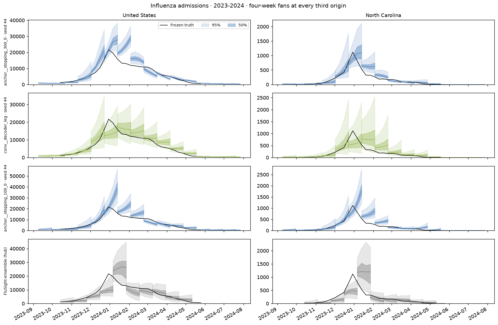{style="width: 1200px"}

[Open original figure](figures/fans-flu_hosp-2023-2024.png)

</figure>

<figure class="report-figure" markdown="1">

<figcaption>Influenza admissions 2024-2025</figcaption>

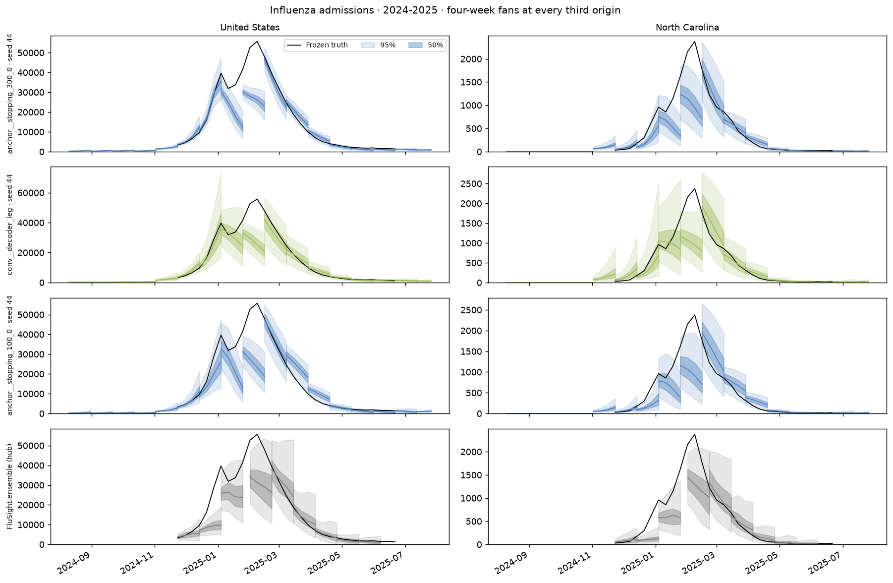{style="width: 1200px"}

[Open original figure](figures/fans-flu_hosp-2024-2025.png)

</figure>

<figure class="report-figure" markdown="1">

<figcaption>Influenza admissions 2025-2026</figcaption>

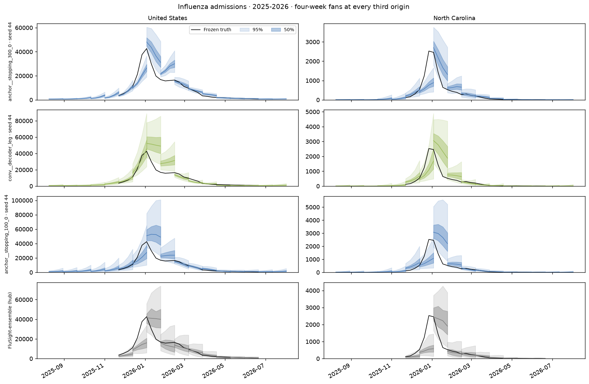{style="width: 1200px"}

[Open original figure](figures/fans-flu_hosp-2025-2026.png)

</figure>

<figure class="report-figure" markdown="1">

<figcaption>COVID-19 admissions 2024-2025</figcaption>

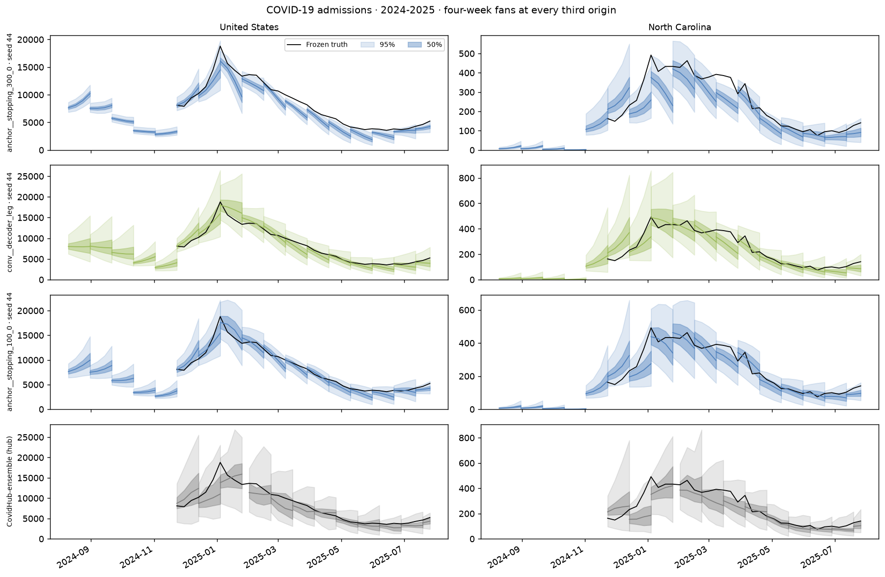{style="width: 1200px"}

[Open original figure](figures/fans-covid_hosp-2024-2025.png)

</figure>

<figure class="report-figure" markdown="1">

<figcaption>COVID-19 admissions 2025-2026</figcaption>

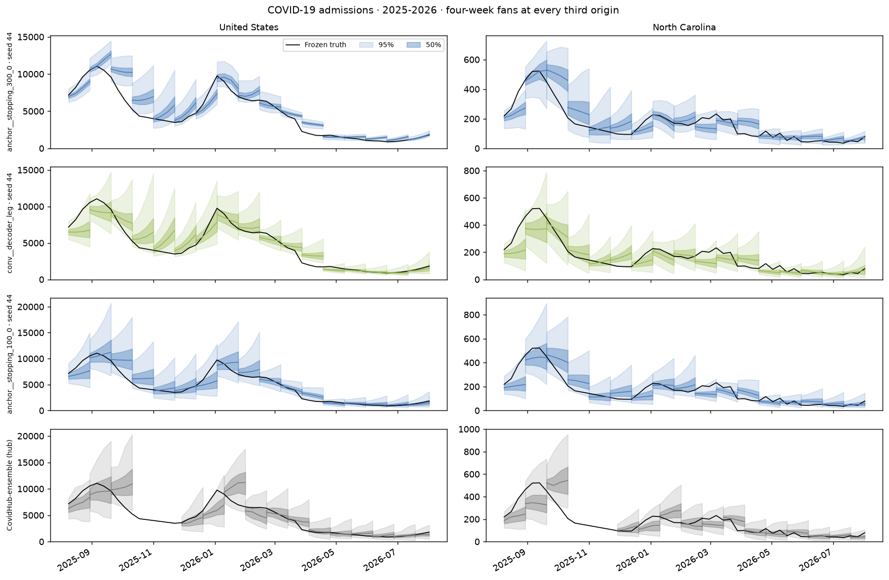{style="width: 1200px"}

[Open original figure](figures/fans-covid_hosp-2025-2026.png)

</figure>

<figure class="report-figure" markdown="1">

<figcaption>RSV admissions 2025-2026</figcaption>

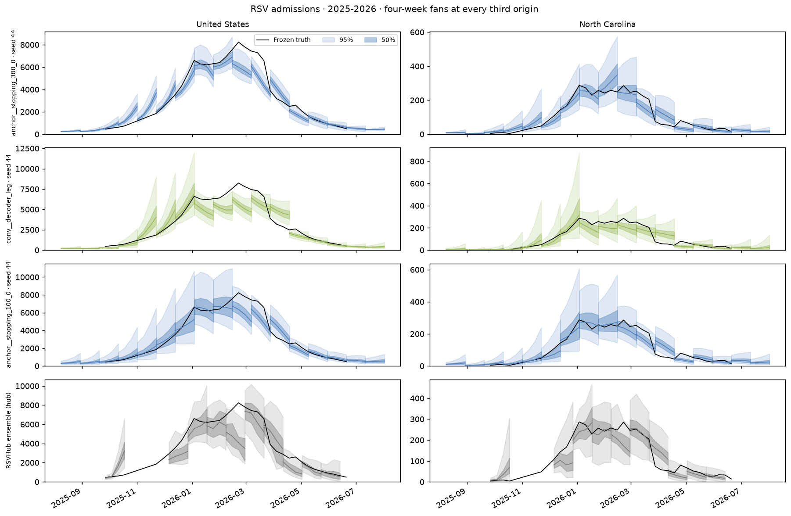{style="width: 1200px"}

[Open original figure](figures/fans-rsv_hosp-2025-2026.png)

</figure>

<figure class="report-figure" markdown="1">

<figcaption>Influenza ED visits 2025-2026</figcaption>

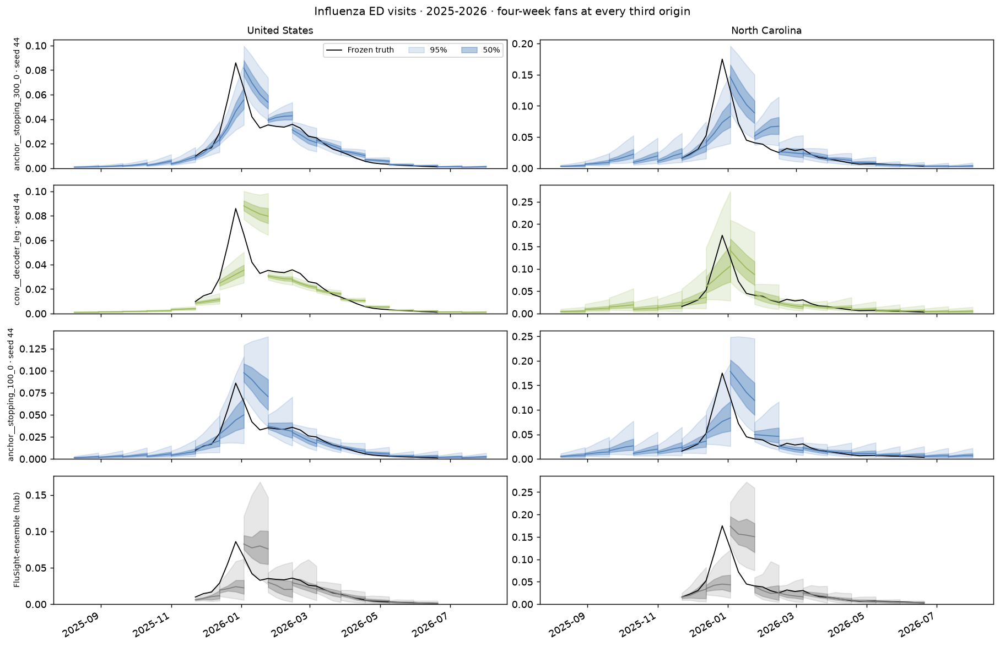{style="width: 1200px"}

[Open original figure](figures/fans-flu_prop_ed_visits-2025-2026.png)

</figure>

<figure class="report-figure" markdown="1">

<figcaption>COVID-19 ED visits 2025-2026</figcaption>

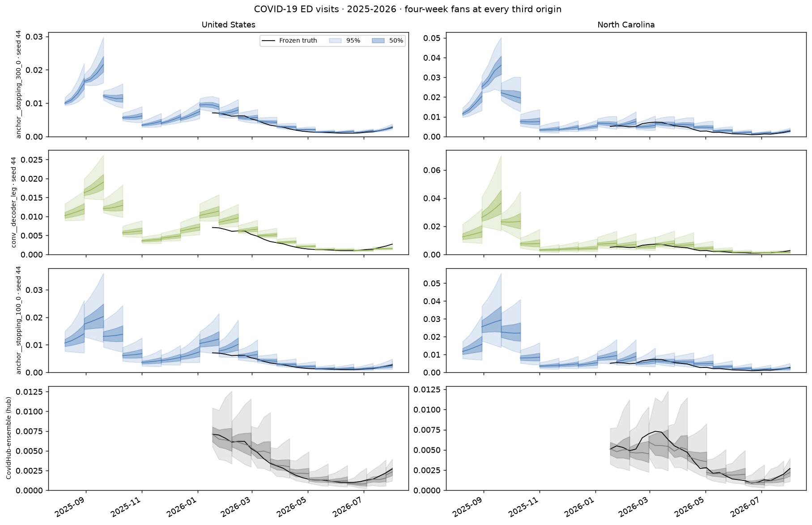{style="width: 1200px"}

[Open original figure](figures/fans-covid_prop_ed_visits-2025-2026.png)

</figure>

<figure class="report-figure" markdown="1">

<figcaption>RSV ED visits 2025-2026</figcaption>

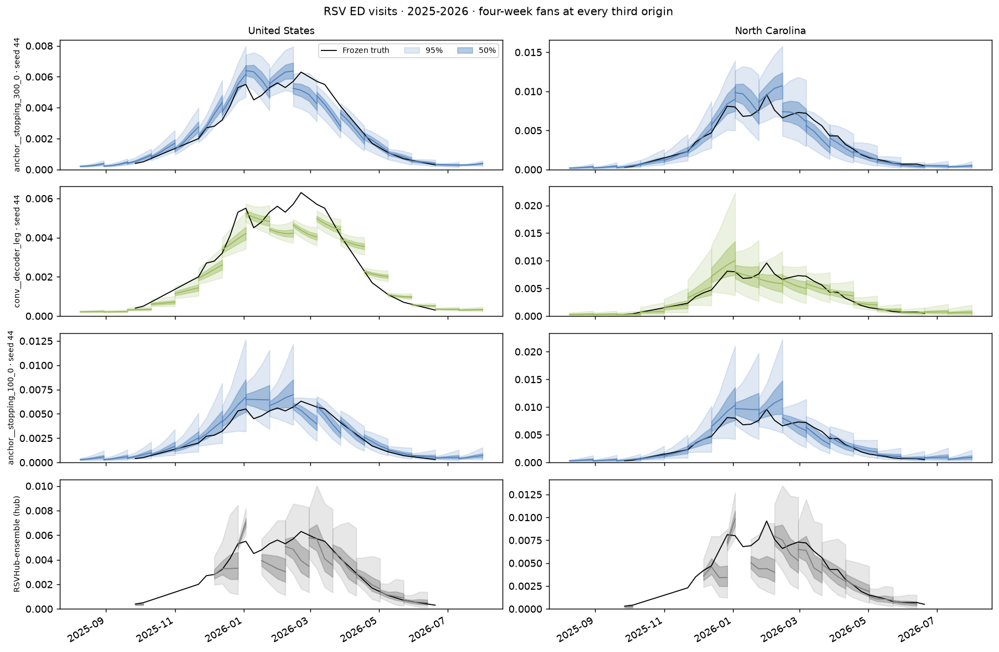{style="width: 1200px"}

[Open original figure](figures/fans-rsv_prop_ed_visits-2025-2026.png)

</figure>

<figure class="report-figure" markdown="1">

<figcaption>Member trajectories, influenza admissions 2024-2025</figcaption>

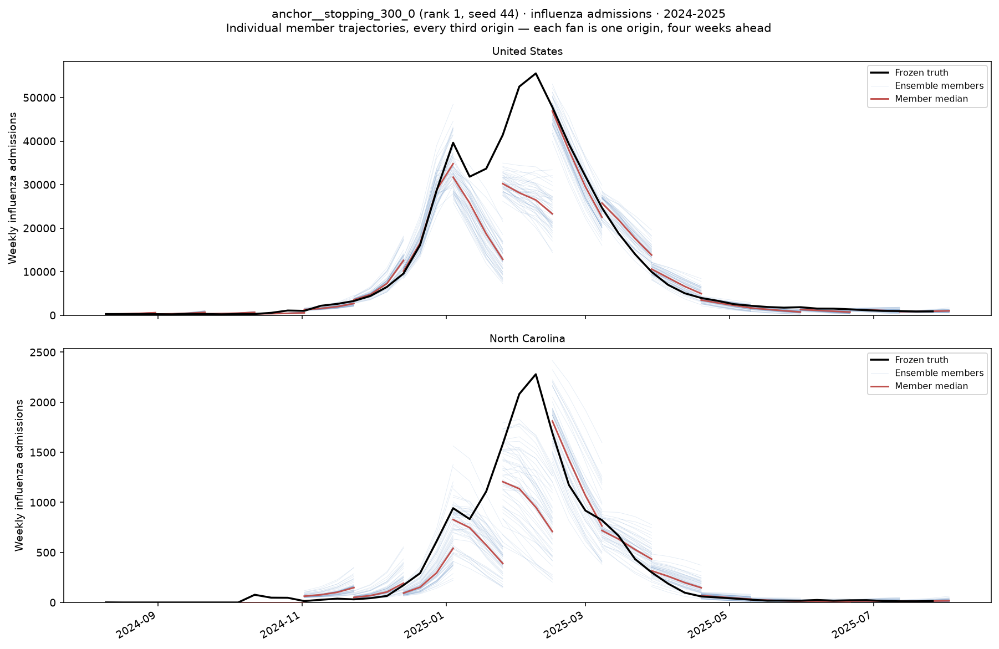{style="width: 1200px"}

[Open original figure](figures/trajectories-flu_hosp-2024-2025.png)

</figure>

## Score diagnostics

<figure class="report-figure" markdown="1">

<figcaption>Combined score for all 60 configurations, with individual seeds</figcaption>

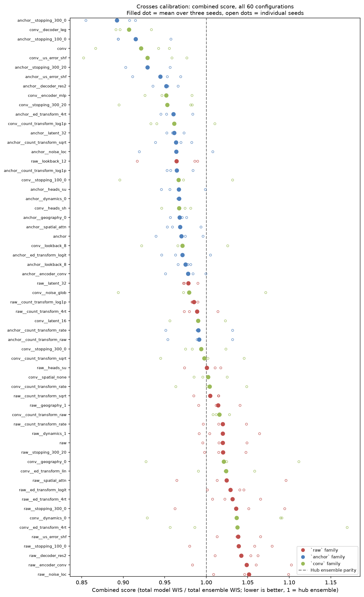{style="width: 1200px"}

[Open original figure](figures/ranking-combined.png)

</figure>

<figure class="report-figure" markdown="1">

<figcaption>Seed noise against leaderboard spread, and per-seed rank reshuffling</figcaption>

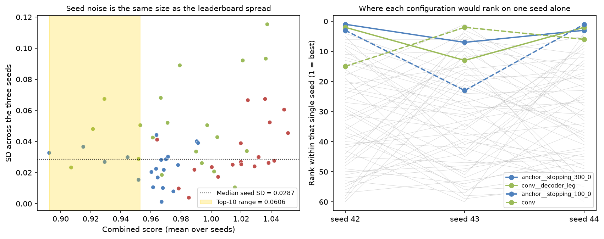{style="width: 1200px"}

[Open original figure](figures/seed-instability.png)

</figure>

<figure class="report-figure" markdown="1">

<figcaption>Training-length ladder by reference family</figcaption>

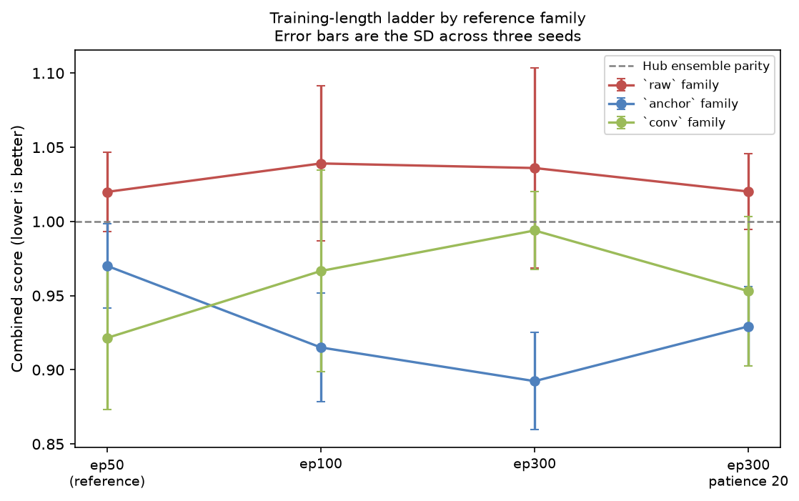{style="width: 1118px"}

[Open original figure](figures/epoch-ladder.png)

</figure>

<figure class="report-figure" markdown="1">

<figcaption>Weighting comparison and per-season ranks</figcaption>

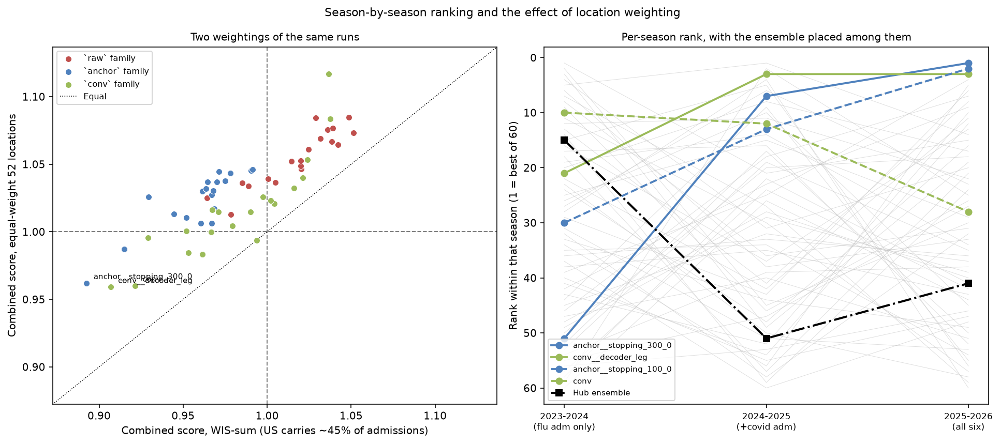{style="width: 1200px"}

[Open original figure](figures/weighting-and-seasons.png)

</figure>

<figure class="report-figure" markdown="1">

<figcaption>States/DC versus US combined score, by family</figcaption>

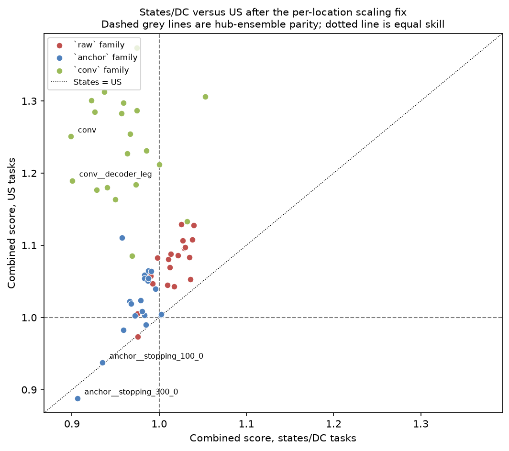{style="width: 1064px"}

[Open original figure](figures/states-vs-us.png)

</figure>

<figure class="report-figure" markdown="1">

<figcaption>Coverage by target and geography against nominal levels</figcaption>

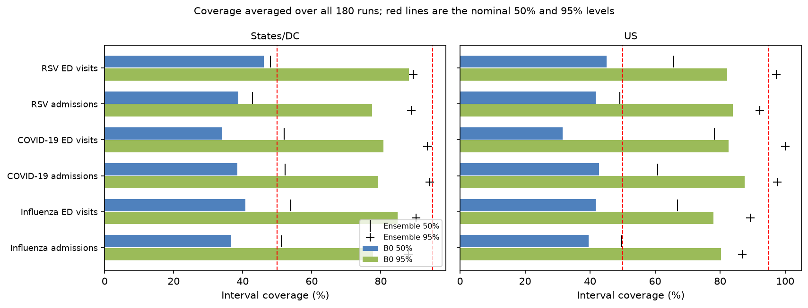{style="width: 1200px"}

[Open original figure](figures/coverage.png)

</figure>

<figure class="report-figure" markdown="1">

<figcaption>Total WIS ratio by horizon</figcaption>

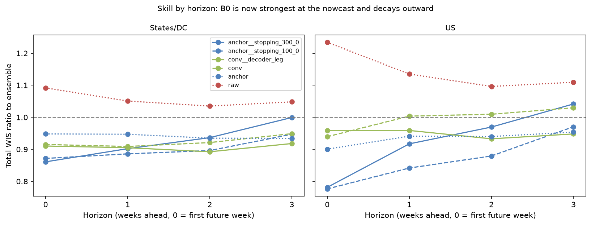{style="width: 1200px"}

[Open original figure](figures/horizon.png)

</figure>

## Matched comparisons

### One-factor changes

Deltas compare each configuration with its own reference; negative is better.

#### Anchor

| Change | Δ combined | Δ states | Δ US |
|---|---:|---:|---:|
| `stopping_300_0` | −0.0777 | −0.0811 | −0.1773 |
| `stopping_100_0` | −0.0550 | −0.0522 | −0.1277 |
| `stopping_300_20` | −0.0408 | −0.0280 | −0.0827 |
| `us_error_shf` | −0.0256 | −0.0211 | −0.0430 |
| `decoder_res2` | −0.0183 | −0.0193 | −0.0461 |
| `ed_transform_4rt` | −0.0097 | −0.0149 | −0.0627 |
| `count_transform_raw` | +0.0214 | +0.0153 | −0.0608 |
| `count_transform_rate` | +0.0205 | +0.0144 | −0.0617 |

#### Convolution

| Change | Δ combined | Δ states | Δ US |
|---|---:|---:|---:|
| `decoder_leg` | −0.0145 | +0.0015 | −0.0612 |
| `us_error_shf` | +0.0076 | +0.0294 | −0.0737 |
| `encoder_mlp` | +0.0303 | +0.0415 | −0.0707 |
| `heads_sh` | +0.0458 | +0.0699 | −0.1651 |
| `geography_0` | +0.0997 | +0.0755 | +0.1226 |
| `ed_transform_lin` | +0.1024 | +0.1014 | −0.0387 |
| `dynamics_0` | +0.1150 | +0.1539 | +0.0553 |
| `ed_transform_4rt` | +0.1159 | +0.1331 | −0.1176 |

#### Raw

| Change | Δ combined | Δ states | Δ US |
|---|---:|---:|---:|
| `lookback_12` | −0.0558 | −0.0365 | −0.0962 |
| `latent_32` | −0.0414 | −0.0372 | −0.0647 |
| `count_transform_log1p` | −0.0346 | −0.0199 | −0.0225 |
| `count_transform_4rt` | −0.0309 | −0.0217 | −0.0122 |
| `encoder_conv` | +0.0287 | +0.0275 | +0.0579 |
| `noise_loc` | +0.0313 | +0.0260 | +0.0385 |

Effects depend on the reference. For example, convolution raises the score on
`raw` and `anchor`, while the bundled `conv` reference ranks fourth overall.
The reference ranking cannot isolate the contribution of convolution.

## Full ranking

### Ranking

| Rank | Configuration | Combined (mean ± seed SD) | States/DC | US |
|---:|---|---:|---:|---:|
| 1 | `anchor__stopping_300_0` | 0.8924 ± 0.0327 | 0.9062 | 0.8879 |
| 2 | `conv__decoder_leg` | 0.9069 ± 0.0233 | 0.9003 | 1.1895 |
| 3 | `anchor__stopping_100_0` | 0.9150 ± 0.0366 | 0.9351 | 0.9374 |
| 4 | `conv` (reference) | 0.9215 ± 0.0480 | 0.8988 | 1.2507 |
| 5 | `conv__us_error_shf` | 0.9291 ± 0.0674 | 0.9282 | 1.1770 |
| 6 | `anchor__stopping_300_20` | 0.9293 ± 0.0269 | 0.9593 | 0.9824 |

40 of 60 configurations beat the ensemble on states/DC tasks; 5 of 60 do so
on US tasks. Scores and seed variation for the full suite:

## Appendix

No known result or figure.
