
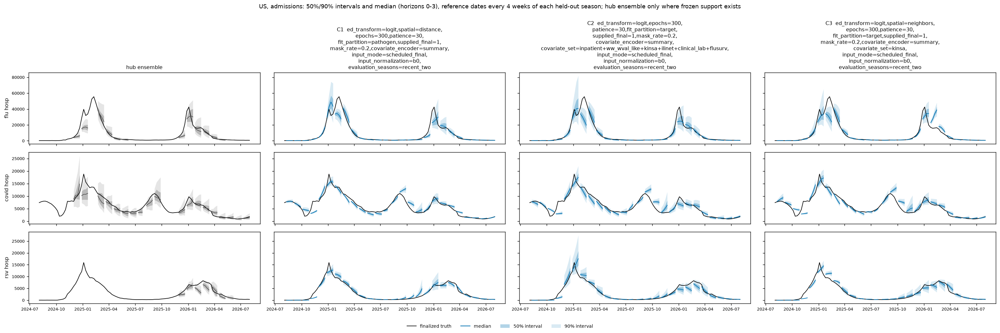
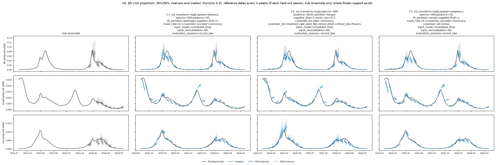
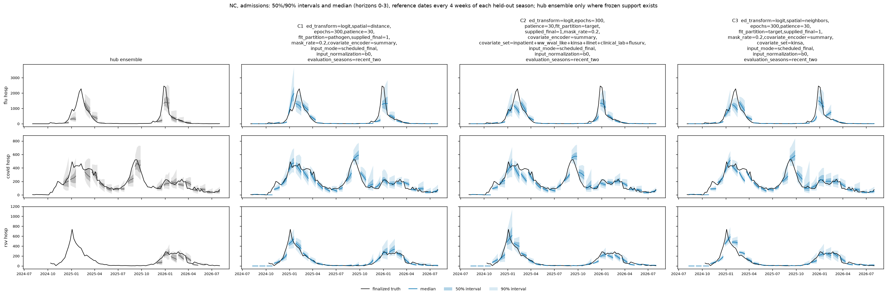
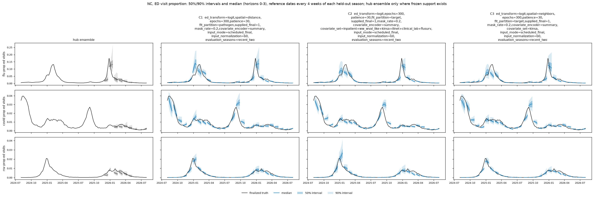
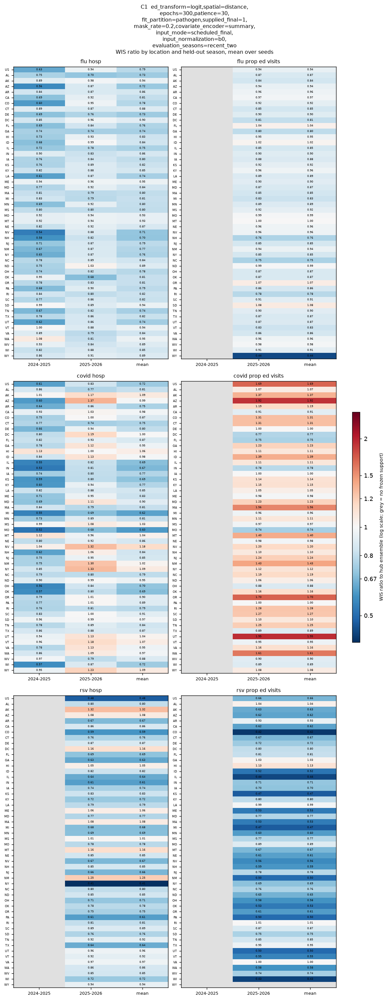
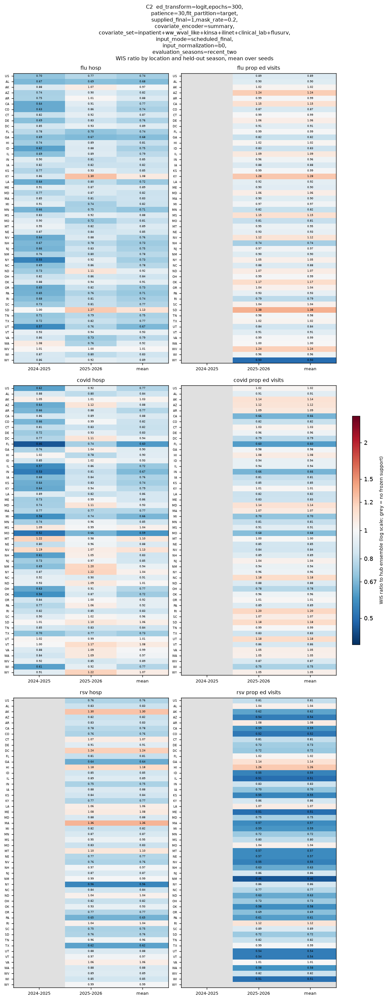
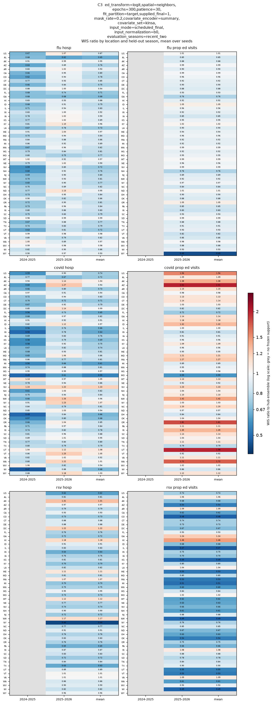
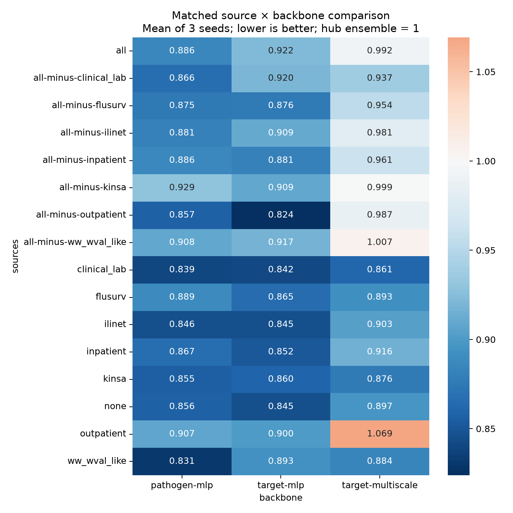

# 2026-09-30 · B2 — Covariates, spatial sharing and masking with finalized T-0 inputs

## Best models by season

Top three configurations by the reported combined score (all configurations if fewer than three). Season columns are seed means. Lower is better; 1 is the matched Hub ensemble.

| Model | 2024-2025 | 2025-2026 | Combined |
|---|---:|---:|---:|
| C1 | 0.7495 | 0.8919 | 0.8207 |
| C2 | 0.7599 | 0.8880 | 0.8239 |
| C3 | 0.7368 | 0.9163 | 0.8265 |
| Hub ensemble | 1.0000 | 1.0000 | 1.0000 |
| B0 reference | 0.7485 | 0.9003 | 0.8244 |

C1–C3 refer to the full ranking below. B0 is the reproduced stage09 reference, averaged over these same seasons and its three seeds. B0 uses finalized target histories and a different training recipe and forecast sample count; this is a reference comparison, not a matched intervention or a claim of significance.

## Protocol

<!-- protocol:start -->

### Experiment protocol

B-2 trains on finalized values with the human-made T-0/T-1 availability schedule
at the top of [Data](../../data/index.md). The schedule is identical during fitting,
early stopping and evaluation. Final labels remain available for scoring whenever
the dataset contains them. This is a retrospective experiment: final revisions
are supplied, not the values originally released at each deadline.

#### Season splits

| Role | Training seasons | Evaluation season |
| --- | --- | --- |
| Forward-time season holdout | 2022–2023, 2023–2024, 2024–2025 | 2025–2026 |
| Retrospective season holdout | 2022–2023, 2023–2024, 2025–2026 | 2024–2025 |

Seasons use CDC epiweeks 31–30. The second split intentionally trains on a season
later than its evaluation season. Training inputs, labels, standardization and
loss scales exclude all held-out weeks. Evaluation may use earlier observed
weeks as context. Missing historical targets (including RSV admissions in
2022–2023) remain missing; six targets does not imply complete historical support.
Early stopping uses three hidden weeks every sixteen weeks starting at season
week four, within training seasons only; selected epochs are refitted on all
three training seasons. Cap 300 epochs, patience 30.

#### Availability and missingness assumptions

T is the latest completed Saturday, four days before a Wednesday issuance.
T-1 means the newest context week is unavailable; earlier finite final values
are supplied without shifting them to another observation date. All six target
histories use T-0. Kinsa, inpatient/outpatient claims and NWSS use T-0. ILINet,
clinical laboratory positivity and FluSurv use T-1.

Native final-value gaps define geographic and historical coverage: no imputation
of unavailable state observations, no invented CT clinical-lab stop date, and no
blanket removal of UT ILINet if a historical finite observation exists. CT's
cessation, UT's absence, restricted FluSurv/lab/NWSS states, and occasional NSSP
or outpatient gaps therefore follow the actual final panel. Vermont inpatient
flu/COVID is explicitly unavailable throughout, interpreting “VT never” literally.
An archive-only gap is not proof of historical unavailability, but without a final
value it cannot be supplied. Kinsa remains the dataset's native national signal.

Training masks affect 0%, 10%, or 20% of episodes. In masked episodes, one state/DC
is chosen uniformly; 25% hide its full history and 75% hide its newest one or two
scheduled available weeks (respecting each source lag). All six target histories and selected covariates are hidden together.
US is not artificially masked. This can leave a national Kinsa signal accessible
through other states. Masks never alter labels. Early stopping and the single
outer evaluation have **no artificial masking**; scheduled lags and natural gaps
remain. No second masked evaluation is run.

#### Experiment grid

309 unique configurations × seeds **42, 43, 44** = **927 runs**, each fitting both
folds: **1,854 outer fits**. Three backbones reproduce the earlier study's structure:
pathogen-partition MLP, target-partition MLP, target-partition multiscale convolution.

- Source attribution: target-only, each of seven sources individually, all sources,
  and each leave-one-source-out combination; summary encoder and 20% episode masking.
- Spatial sharing: none, pooled states plus native US, attention, native-US broadcast,
  recipient-gated pooling, four nearest state internal points, distance weighting,
  and a population-weighted geographic proxy. Crossed with no covariates, Kinsa,
  ILINet, or all covariates. Latitude/longitude ablations use none/distance sharing.
- Covariate encoders: raw, trailing smoothing, summaries, shared learned encoder;
  crossed with none/nearest-state/national sharing and mask rates 0/10/20%, using
  all sources. Duplicate configurations across families are fitted only once.

- Signal transforms: 3/6/12-week means, least-squares slopes and quadratic
  curvature, either directly or after trailing-three-week smoothing. Applied to
  all six targets and covariates, crossed with three spatial choices and all
  three mask rates. These supplement the existing histories and summaries.

The transform block is inspired by [Flusion's level, trend and curvature features](https://pmc.ncbi.nlm.nih.gov/articles/PMC12367328/),
not a reproduction of its fitted forecasting model. Windows are causal, retain
calendar spacing across missing reports and include coverage and validity flags.
Slopes require two reports and curvature requires three. Smoothing averages only
available reports and may derive a feature at an otherwise missing week from
older context; it never changes the observation mask or imports future data.
Targets use the model's transformed/normalized scale; covariates use signed-log
standardized values. The quadratic design rescales time for conditioning, then
returns curvature in units per week squared. No transforms are fitted on evaluation
labels. A sparse two-point slope denominator was corrected so adjacent observations
retain the true per-week slope rather than half its value.

Geographic points come from the [Census 2024 state Gazetteer](https://www2.census.gov/geo/docs/maps-data/data/gazetteer/2024_Gazetteer/2024_Gaz_state_national.zip)
(`INTPTLAT`, `INTPTLONG`; internal points, not population centroids). Distances use
a spherical Earth of radius 6,371 km. “Neighbors” means four nearest states/DC,
not shared borders. Self and US are excluded. Distance weights are exp(-km/750).
The `gravity` proxy multiplies those weights by sqrt(sender population) and uses
a learned recipient gate. These are modeling assumptions, **not measured mobility
flows**. Alaska/Hawaii use the same distance rule. Missing sender states are
excluded and remaining weights renormalized. Spatial messages contain encoded
targets and covariates. National pooling is equal-state, not population-weighted.
Latitude/longitude features are divided by 180, with a separate non-US flag.

Training uses 128 sample members and validation/evaluation use 256. The unchanged
manager scorer uses matched frozen hub tasks and reports each season separately;
its combined ranking gives the two seasons equal weight, then averages three seeds.
Both are season cross-validation folds; 2025–2026 is the forward-time holdout.
Read the seasons separately as well as their equal-weight combined score.

#### Run and resume on Longleaf

From `/proj/jlessler/projects/tapestry-all/tapestry`:

```bash
.venv/bin/python experiments/b-2.py --plan
LANES=6 GPUS=6 sbatch --job-name=b-2-t0 --array=0-3 scripts/jlessler.sbatch b-2-t0
LANES=10 GPUS=6 sbatch --job-name=b-2-t0-h100 --array=0-1 --nodelist=g1803jles02 --mem=180G scripts/jlessler.sbatch b-2-t0
.venv/bin/python -m tapestry.experiment.planner status -e b-2-t0
.venv/bin/python -m tapestry.experiment.planner rank -e b-2-t0
```

The design script invokes `planner plan -e b-2-t0 -s <all generated scenarios>
--seeds 42 43 44 --device cuda --eval-members 256 --dataset data/processed/panel.npz`.
Use `status` for exact resubmission commands. Do not re-plan an existing experiment.
The manager snapshots code and geographic metadata. Notifications remain on.

<!-- protocol:end -->

## Season splits

<figure class="report-figure" markdown="1">

<figcaption>cv-layout-es3-16-4</figcaption>

<div class="report-plot" markdown="1">

{style="width: 4000px"}

</div>

[Open original figure](figures/0b207d64770581d2.png)

</figure>

## Findings

<!-- write-up: kept across regenerations -->

### Write-up

#### Write-up

##### Main findings

All **927 runs are complete: 309 configurations × 3 seeds (42–44)**. The final ranking is `ranking-edfe99ea0c26`. **281/309 (90.9%)** configurations beat the Hub ensemble on the equally weighted two-season mean: **300/309 (97.1%)** in 2024–25 and **181/309 (58.6%)** in 2025–26. All counts use configuration means across three seeds.

**The sweep finds several competitive recipes, but no convincing improvement over B0.** C1 has the lowest observed mean; C2 has the smallest seed spread among the top three and the best 2025–26 score of those three. The first two are only 0.45% and 0.05% below the reproduced B0 two-season score. These differences are much smaller than seed uncertainty.

| Model | 2024–25 | 2025–26 | Combined mean ± seed SD |
|---|---:|---:|---:|
| C1: Pathogen MLP; distance sharing; no covariates | 0.7495 | 0.8919 | 0.8207 ± 0.0329 |
| C2: Target MLP; all covariates except outpatient; no spatial sharing | 0.7599 | 0.8880 | 0.8239 ± 0.0080 |
| C3: Target MLP; neighbor sharing; Kinsa | 0.7368 | 0.9163 | 0.8265 ± 0.0225 |
| B0 reproduced reference | 0.7485 | 0.9003 | 0.8244 ± 0.0254 |

All three selected current models use 20% training masking. Fans above use **seed 42**, with predictive 50%/90% intervals; they do not pool seeds and do not show confidence intervals for performance. Heatmaps average all three seeds. Fans include the Hub ensemble, US and North Carolina, admissions and ED separately. Grey heatmap cells have no frozen evaluation support.

##### Why the leaders differ

| 2025–26 target | C1 | C2 | C3 |
|---|---:|---:|---:|
| flu hosp | 0.881 | 0.847 | 0.943 |
| covid hosp | 0.947 | 0.946 | 0.933 |
| rsv hosp | 0.758 | 0.869 | 0.808 |
| flu prop ed visits | 0.903 | 0.960 | 0.931 |
| covid prop ed visits | 1.261 | 0.952 | 1.200 |
| rsv prop ed visits | 0.691 | 0.755 | 0.747 |

C1 is particularly strong on RSV admissions and ED, but COVID ED is worse than the ensemble (1.261). C2 improves all six targets against the ensemble in 2025–26, including COVID ED (0.952), while sacrificing some of C1’s RSV advantage. C3’s strength is 2024–25; its 2025–26 COVID ED remains weak (1.200). There is no uniform winner across targets or seasons.

##### What helps or hurts: matched comparisons

Each comparison below changes only the named factor and holds **every other Scenario field fixed**. A context is one otherwise identical configuration. Deltas are changes in the combined relative-WIS score, not percentages; negative is better. We average the matched deltas within each seed, then form an exploratory 95% Student-t interval across the three seed averages (2 degrees of freedom). The context counts show consistency, not independent sample sizes.

| Change from reference | Matched contexts | Mean Δ WIS ratio | 95% seed-only interval | Contexts improved |
|---|---:|---:|---:|---:|
| backbone: pathogen-mlp → target-multiscale | 103 | +0.0484 | [+0.0241, +0.0728] | 13/103 |
| backbone: pathogen-mlp → target-mlp | 103 | -0.0063 | [-0.0171, +0.0045] | 61/103 |
| covariate_encoder: summary → raw | 27 | +0.0809 | [+0.0113, +0.1505] | 2/27 |
| spatial: none → attention | 12 | +0.0732 | [+0.0176, +0.1287] | 1/12 |
| spatial: none → national_broadcast | 63 | +0.0552 | [+0.0180, +0.0924] | 5/63 |
| spatial: none → gated_pool | 12 | +0.0476 | [+0.0187, +0.0764] | 1/12 |
| spatial: none → pooled | 12 | +0.0359 | [+0.0015, +0.0704] | 1/12 |
| spatial: none → distance | 24 | +0.0028 | [-0.0319, +0.0374] | 12/24 |
| sources: none → outpatient | 3 | +0.0929 | [+0.0396, +0.1463] | 0/3 |
| sources: none → all | 30 | +0.0499 | [-0.0026, +0.1024] | 4/30 |
| sources: none → kinsa | 30 | -0.0077 | [-0.0430, +0.0275] | 21/30 |
| sources: none → ilinet | 30 | -0.0124 | [-0.0610, +0.0363] | 18/30 |
| mask_rate: 0.0 → 0.1 | 54 | +0.0079 | [-0.0240, +0.0398] | 20/54 |
| mask_rate: 0.0 → 0.2 | 54 | +0.0154 | [-0.0020, +0.0328] | 14/54 |
| signal_features: none → multiscale | 27 | -0.0135 | [-0.0500, +0.0231] | 16/27 |
| coordinates: False → True | 24 | +0.0047 | [-0.0291, +0.0385] | 9/24 |

**Most consistent evidence within this sweep:** the multiscale CNN underperforms pathogen MLP in 90/103 matched contexts; raw covariate encoding underperforms summary encoding in 25/27; national broadcast underperforms no spatial sharing in 58/63; attention in 11/12; gated pooling in 11/12. Their seed-only intervals remain on the harmful side. This supports avoiding those choices as defaults in this protocol, but it is exploratory evidence rather than a multiplicity-adjusted claim about future seasons.

**Inputs are selective, not “more is better.”** Adding all covariates worsens 26/30 matched contexts (mean +0.0499), although its seed-only interval includes zero. Kinsa helps 21/30 and ILINet 18/30, with intervals also crossing zero: promising but context-dependent. Outpatient alone harms all three backbone comparisons (mean +0.0930). Removing outpatient from the full bundle improves all three backbones: −0.0288 for pathogen MLP, −0.0980 for target MLP, and −0.0048 for the multiscale CNN. That is a result for this source representation and protocol, not proof outpatient information is intrinsically unhelpful.

**Weak or mixed evidence:** target-wise versus pathogen-wise MLP fitting, coordinates, distance/neighbor sharing, smoothed/shared encoders, and engineered signal features have intervals spanning zero. C1’s distance sharing does not establish a general distance-sharing benefit: its average effect is approximately zero across matched contexts.

**Masking did not clearly improve B-2 T-0 and worsened performance on average.** Holding every other Scenario field fixed, 10% masking versus none increases the combined relative-WIS score by +0.0079 and improves only 20/54 contexts; 20% masking increases it by +0.0154 and improves only 14/54. The respective 95% seed-only intervals are [−0.0240, +0.0398] and [−0.0020, +0.0328], so the evidence suggests harm but is not conclusive. All three leading configurations use 20% masking, but their ranking does not establish that masking helped them. Based on these matched comparisons, **use no masking as the default for this protocol**; this recommendation is conditional on the tested configurations and seasons, not proof that masking never helps.


The supplementary heatmap holds spatial sharing at none, masking at 0.2, coordinates off, signal features at none and covariate encoder at summary. It compares only combinations actually run.

##### Worst configurations

| Label | Backbone | Covariates | Spatial sharing | Covariate encoder | Masking | Combined mean ± SD |
|---|---|---|---|---|---:|---:|
| C309 | pathogen-mlp | all | national_broadcast | raw | 20% | 1.1287 ± 0.0370 |
| C308 | pathogen-mlp | all | national_broadcast | raw | 0% | 1.1179 ± 0.0121 |
| C307 | pathogen-mlp | all | national_broadcast | raw | 10% | 1.1163 ± 0.0472 |
| C306 | target-multiscale | outpatient | none | summary | 20% | 1.0692 ± 0.0481 |
| C305 | target-multiscale | all | national_broadcast | shared | 10% | 1.0453 ± 0.0385 |

The three worst combine pathogen MLP, all covariates, raw covariate encoding and national broadcast. All three masking choices perform poorly, so this is not explained by a single masking setting. Matched comparisons independently implicate both raw encoding and national broadcast; their interaction is not separately estimated here.

##### Confidence and interpretation

| Comparison with B0 | Mean difference | 95% seed-only interval | Seeds better than B0 |
|---|---:|---:|---:|
| C1 − B0 | -0.0037 | [-0.0841, +0.0767] | 2/3 |
| C2 − B0 | -0.0004 | [-0.0804, +0.0795] | 1/3 |
| C3 − B0 | +0.0022 | [-0.1034, +0.1077] | 1/3 |

**Confidence in beating B0 is low.** Every interval above crosses zero widely. C1 beats B0 in two of three seed-ID comparisons; C2 in only one. A small rank difference is insufficient to declare either superior. C2’s smaller SD describes fitting stability on these tasks, not a guarantee of better generalization.

**Confidence in the broad harmful patterns is stronger, but conditional.** The matched-direction counts and seed intervals support the CNN/raw-encoder/broad-pooling penalties within the tested settings. Only three seeds are available; Student-t intervals assume independent approximately normal seed differences and cannot verify that assumption. We do not treat correlated configurations or locations as independent replicates. No multiple-comparison adjustment was applied.

**This is season-held-out CV, not an untouched final test.** The held-out season is excluded from training and early stopping, but the 2024–25 fold can train on 2025–26. All 309 models were selected and compared using these same CV outcomes. These intervals omit model-selection optimism, temporal sampling uncertainty and performance on genuinely new seasons. The safest conclusion is a competitive cluster of MLP recipes, not a newly proven champion.

##### Scope, assumptions and reproducibility

- The request is interpreted as reporting the completed sweep; no models were retrained. The standard report job was **3061288**.
- Current and B0 target histories are finalized. Current training adds 2022–23 and changes other training settings; B0 used 2,048 evaluation samples versus 256 here. The B0 reference is a recipe comparison, not an isolated architecture ablation.
- The metric is the location-relative WIS ratio on frozen identical tasks: US 20%, states/DC 80%; admissions weight 1, ED 0.5; equal season weights. 2024–25 has flu/COVID admissions only; 2025–26 has all six targets. The older three-season B0 average is not compared directly with this two-season average.
- Complete B0.1 sweep comparison: 114/172 (66.3%) beat the ensemble on the same two-season mean, versus 281/309 (90.9%) here. Different configuration sets and training panels prevent attributing this difference to one change.
- Reproduce scoring and reports with `.venv/bin/python -m tapestry.experiment.planner rank -e b-2-t0`. The [experiment protocol](#protocol) and [saved design](design.json) describe the grid. Interpretive text is preserved inside the report write-up markers.
- [Matched effects](sweep_matched_effects.csv), [B0 seed comparisons](b0_seed_comparison.csv), and [named final ranking](named_ranking.csv) accompany this report. No visual inspection of generated plots was performed, following project instructions.

##### Predictive interval coverage

Coverage uses the same location, target and season weights as WIS, averaged over three seeds on the two shared evaluation seasons. These are empirical predictive coverages, not confidence levels for score differences.

| Model | 50% interval | 80% interval | 90% interval | 95% interval |
|---|---:|---:|---:|---:|
| Hub ensemble | 53.0% | 77.9% | 85.5% | 89.9% |
| B0 | 42.3% | 68.6% | 78.6% | 84.9% |
| C1 | 46.5% | 71.5% | 80.8% | 85.8% |
| C2 | 44.8% | 70.6% | 80.1% | 85.4% |
| C3 | 44.3% | 69.8% | 79.2% | 84.9% |

All model families shown under-cover. C1 improves modestly over B0, but its nominal 90% interval covers only 80.8% overall. The ensemble also under-covers at 90% and 95%, but is closer to nominal than these models. C1 COVID ED in 2025–26 is particularly weak: 54.3% coverage for the 90% interval; C2 improves it to 66.9%. WIS superiority does not imply calibrated intervals. Undercoverage may reflect narrow intervals, forecast bias or both.

Protocol distinction: the current sweep is B-2 T-0, not the earlier availability-restricted B1. B0 and B-2 both supply finalized target histories through the latest context week. Audited B1 variants withheld inputs missing from the Wednesday archive and some used recent vintages/nowcasting, making the usable context much poorer. B-2 adds the older 2022–23 training season, optional covariates and artificial training masks; outer evaluation has no artificial masks. This adds historical volume, not a more recent season. B-2 scores two seasons rather than the original three; excluding 2023–24 substantially changes the headline comparison.

<!-- end write-up -->

## Forecast fans

<figure class="report-figure" markdown="1">

<figcaption>fans-US-hosp</figcaption>

<div class="report-plot" markdown="1">

{style="width: 1200px"}

</div>

[Open original figure](figures/4069052cc8285d9e.png)

</figure>

<figure class="report-figure" markdown="1">

<figcaption>fans-US-ed</figcaption>

<div class="report-plot" markdown="1">

{style="width: 1200px"}

</div>

[Open original figure](figures/a0f4482fa6749403.png)

</figure>

<figure class="report-figure" markdown="1">

<figcaption>fans-NC-hosp</figcaption>

<div class="report-plot" markdown="1">

{style="width: 1200px"}

</div>

[Open original figure](figures/73fd3f1d92330e8f.png)

</figure>

<figure class="report-figure" markdown="1">

<figcaption>fans-NC-ed</figcaption>

<div class="report-plot" markdown="1">

{style="width: 1200px"}

</div>

[Open original figure](figures/462a86660db41800.png)

</figure>

## Score diagnostics

<figure class="report-figure" markdown="1">

<figcaption>dotplot</figcaption>

<div class="report-plot" markdown="1">

{style="width: 1200px"}

</div>

[Open original figure](figures/84626771b90f595e.png)

</figure>

<figure class="report-figure" markdown="1">

<figcaption>heatmap-C1</figcaption>

<div class="report-plot" markdown="1">

{style="width: 1182px"}

</div>

[Open original figure](figures/2d2066fd76668a64.png)

</figure>

<figure class="report-figure" markdown="1">

<figcaption>heatmap-C2</figcaption>

<div class="report-plot" markdown="1">

{style="width: 1182px"}

</div>

[Open original figure](figures/bbe97fbb535b06e3.png)

</figure>

<figure class="report-figure" markdown="1">

<figcaption>heatmap-C3</figcaption>

<div class="report-plot" markdown="1">

{style="width: 1182px"}

</div>

[Open original figure](figures/58bc65dbe92b8950.png)

</figure>

<figure class="report-figure" markdown="1">

<figcaption>Matched source and backbone heatmap</figcaption>

<div class="report-plot" markdown="1">

{style="width: 1200px"}

</div>

[Open original figure](source-backbone-heatmap.png)

</figure>

## Matched comparisons

Single-field changes with every other scenario field fixed, paired on identical seeds. Positive changes worsen relative WIS. Intervals use seed averages, not contexts as independent replicates; they describe fitting randomness on fixed tasks, not new-season uncertainty. Blank intervals mean fewer than two seeds. [Method](../../workflow.md#analyze-a-run).

[All effects](matched_effects.csv) · Seed pairs (`matched_pairs.csv`, removed 9 October 2026: over 1 MB)

| Field | Reference → value | Contexts | Seeds | Mean Δ WIS ratio | 95% seed-only interval | Improved |
|---|---|---:|---|---:|---|---:|
| coordinates | `False` → `True` | 24 | 42,43,44 | +0.0047 | [-0.0291, +0.0385] | 9/24 |
| covariate_encoder | `raw` → `shared` | 27 | 42,43,44 | -0.0801 | [-0.1290, -0.0313] | 23/27 |
| covariate_encoder | `raw` → `smooth` | 27 | 42,43,44 | -0.0851 | [-0.1046, -0.0656] | 27/27 |
| covariate_encoder | `raw` → `summary` | 27 | 42,43,44 | -0.0809 | [-0.1505, -0.0113] | 25/27 |
| covariate_encoder | `shared` → `smooth` | 27 | 42,43,44 | -0.0050 | [-0.0345, +0.0245] | 13/27 |
| covariate_encoder | `shared` → `summary` | 27 | 42,43,44 | -0.0008 | [-0.0237, +0.0221] | 14/27 |
| covariate_encoder | `smooth` → `summary` | 27 | 42,43,44 | +0.0042 | [-0.0460, +0.0544] | 14/27 |
| covariate_set | `` → `clinical_lab` | 3 | 42,43,44 | -0.0186 | [-0.1025, +0.0654] | 3/3 |
| covariate_set | `` → `flusurv` | 3 | 42,43,44 | +0.0162 | [-0.1028, +0.1352] | 1/3 |
| covariate_set | `` → `ilinet` | 30 | 42,43,44 | -0.0124 | [-0.0610, +0.0363] | 18/30 |
| covariate_set | `` → `inpatient` | 3 | 42,43,44 | +0.0120 | [-0.0031, +0.0272] | 0/3 |
| covariate_set | `` → `inpatient+outpatient+kinsa+ilinet+clinical_lab+flusurv` | 3 | 42,43,44 | +0.0783 | [+0.0070, +0.1497] | 0/3 |
| covariate_set | `` → `inpatient+outpatient+ww_wval_like+ilinet+clinical_lab+flusurv` | 3 | 42,43,44 | +0.0796 | [+0.0381, +0.1210] | 0/3 |
| covariate_set | `` → `inpatient+outpatient+ww_wval_like+kinsa+clinical_lab+flusurv` | 3 | 42,43,44 | +0.0576 | [-0.0341, +0.1493] | 0/3 |
| covariate_set | `` → `inpatient+outpatient+ww_wval_like+kinsa+ilinet+clinical_lab` | 3 | 42,43,44 | +0.0355 | [-0.0118, +0.0828] | 0/3 |
| covariate_set | `` → `inpatient+outpatient+ww_wval_like+kinsa+ilinet+clinical_lab+flusurv` | 30 | 42,43,44 | +0.0499 | [-0.0026, +0.1024] | 4/30 |
| covariate_set | `` → `inpatient+outpatient+ww_wval_like+kinsa+ilinet+flusurv` | 3 | 42,43,44 | +0.0416 | [+0.0104, +0.0729] | 0/3 |
| covariate_set | `` → `inpatient+ww_wval_like+kinsa+ilinet+clinical_lab+flusurv` | 3 | 42,43,44 | +0.0232 | [-0.0742, +0.1207] | 1/3 |
| covariate_set | `` → `kinsa` | 30 | 42,43,44 | -0.0077 | [-0.0430, +0.0275] | 21/30 |
| covariate_set | `` → `outpatient` | 3 | 42,43,44 | +0.0929 | [+0.0396, +0.1463] | 0/3 |
| covariate_set | `` → `outpatient+ww_wval_like+kinsa+ilinet+clinical_lab+flusurv` | 3 | 42,43,44 | +0.0436 | [-0.0894, +0.1765] | 0/3 |
| covariate_set | `` → `ww_wval_like` | 3 | 42,43,44 | +0.0037 | [-0.0709, +0.0782] | 2/3 |
| covariate_set | `clinical_lab` → `flusurv` | 3 | 42,43,44 | +0.0348 | [-0.0323, +0.1018] | 0/3 |
| covariate_set | `clinical_lab` → `ilinet` | 3 | 42,43,44 | +0.0172 | [-0.0319, +0.0662] | 0/3 |
| covariate_set | `clinical_lab` → `inpatient` | 3 | 42,43,44 | +0.0306 | [-0.0383, +0.0995] | 0/3 |
| covariate_set | `clinical_lab` → `inpatient+outpatient+kinsa+ilinet+clinical_lab+flusurv` | 3 | 42,43,44 | +0.0969 | [+0.0615, +0.1322] | 0/3 |
| covariate_set | `clinical_lab` → `inpatient+outpatient+ww_wval_like+ilinet+clinical_lab+flusurv` | 3 | 42,43,44 | +0.0981 | [+0.0385, +0.1577] | 0/3 |
| covariate_set | `clinical_lab` → `inpatient+outpatient+ww_wval_like+kinsa+clinical_lab+flusurv` | 3 | 42,43,44 | +0.0762 | [+0.0251, +0.1272] | 0/3 |
| covariate_set | `clinical_lab` → `inpatient+outpatient+ww_wval_like+kinsa+ilinet+clinical_lab` | 3 | 42,43,44 | +0.0541 | [-0.0081, +0.1163] | 0/3 |
| covariate_set | `clinical_lab` → `inpatient+outpatient+ww_wval_like+kinsa+ilinet+clinical_lab+flusurv` | 3 | 42,43,44 | +0.0857 | [+0.0345, +0.1369] | 0/3 |
| covariate_set | `clinical_lab` → `inpatient+outpatient+ww_wval_like+kinsa+ilinet+flusurv` | 3 | 42,43,44 | +0.0602 | [-0.0134, +0.1338] | 0/3 |
| covariate_set | `clinical_lab` → `inpatient+ww_wval_like+kinsa+ilinet+clinical_lab+flusurv` | 3 | 42,43,44 | +0.0418 | [-0.0139, +0.0975] | 1/3 |
| covariate_set | `clinical_lab` → `kinsa` | 3 | 42,43,44 | +0.0163 | [+0.0096, +0.0230] | 0/3 |
| covariate_set | `clinical_lab` → `outpatient` | 3 | 42,43,44 | +0.1115 | [+0.0766, +0.1465] | 0/3 |
| covariate_set | `clinical_lab` → `outpatient+ww_wval_like+kinsa+ilinet+clinical_lab+flusurv` | 3 | 42,43,44 | +0.0621 | [+0.0003, +0.1240] | 0/3 |
| covariate_set | `clinical_lab` → `ww_wval_like` | 3 | 42,43,44 | +0.0222 | [+0.0042, +0.0402] | 1/3 |
| covariate_set | `flusurv` → `ilinet` | 3 | 42,43,44 | -0.0176 | [-0.0462, +0.0110] | 2/3 |
| covariate_set | `flusurv` → `inpatient` | 3 | 42,43,44 | -0.0042 | [-0.1115, +0.1032] | 2/3 |
| covariate_set | `flusurv` → `inpatient+outpatient+kinsa+ilinet+clinical_lab+flusurv` | 3 | 42,43,44 | +0.0621 | [-0.0390, +0.1632] | 0/3 |
| covariate_set | `flusurv` → `inpatient+outpatient+ww_wval_like+ilinet+clinical_lab+flusurv` | 3 | 42,43,44 | +0.0634 | [-0.0148, +0.1416] | 0/3 |
| covariate_set | `flusurv` → `inpatient+outpatient+ww_wval_like+kinsa+clinical_lab+flusurv` | 3 | 42,43,44 | +0.0414 | [-0.0767, +0.1594] | 1/3 |
| covariate_set | `flusurv` → `inpatient+outpatient+ww_wval_like+kinsa+ilinet+clinical_lab` | 3 | 42,43,44 | +0.0193 | [-0.0546, +0.0932] | 1/3 |
| covariate_set | `flusurv` → `inpatient+outpatient+ww_wval_like+kinsa+ilinet+clinical_lab+flusurv` | 3 | 42,43,44 | +0.0509 | [+0.0133, +0.0885] | 1/3 |
| covariate_set | `flusurv` → `inpatient+outpatient+ww_wval_like+kinsa+ilinet+flusurv` | 3 | 42,43,44 | +0.0255 | [-0.0668, +0.1177] | 1/3 |
| covariate_set | `flusurv` → `inpatient+ww_wval_like+kinsa+ilinet+clinical_lab+flusurv` | 3 | 42,43,44 | +0.0070 | [-0.0147, +0.0288] | 2/3 |
| covariate_set | `flusurv` → `kinsa` | 3 | 42,43,44 | -0.0184 | [-0.0788, +0.0420] | 3/3 |
| covariate_set | `flusurv` → `outpatient` | 3 | 42,43,44 | +0.0768 | [-0.0153, +0.1688] | 0/3 |
| covariate_set | `flusurv` → `outpatient+ww_wval_like+kinsa+ilinet+clinical_lab+flusurv` | 3 | 42,43,44 | +0.0274 | [-0.0038, +0.0585] | 1/3 |
| covariate_set | `flusurv` → `ww_wval_like` | 3 | 42,43,44 | -0.0125 | [-0.0964, +0.0714] | 2/3 |
| covariate_set | `ilinet` → `inpatient` | 3 | 42,43,44 | +0.0134 | [-0.0653, +0.0922] | 0/3 |
| covariate_set | `ilinet` → `inpatient+outpatient+kinsa+ilinet+clinical_lab+flusurv` | 3 | 42,43,44 | +0.0797 | [+0.0007, +0.1587] | 0/3 |
| covariate_set | `ilinet` → `inpatient+outpatient+ww_wval_like+ilinet+clinical_lab+flusurv` | 3 | 42,43,44 | +0.0810 | [+0.0310, +0.1309] | 0/3 |
| covariate_set | `ilinet` → `inpatient+outpatient+ww_wval_like+kinsa+clinical_lab+flusurv` | 3 | 42,43,44 | +0.0590 | [-0.0400, +0.1580] | 0/3 |
| covariate_set | `ilinet` → `inpatient+outpatient+ww_wval_like+kinsa+ilinet+clinical_lab` | 3 | 42,43,44 | +0.0369 | [-0.0093, +0.0831] | 0/3 |
| covariate_set | `ilinet` → `inpatient+outpatient+ww_wval_like+kinsa+ilinet+clinical_lab+flusurv` | 30 | 42,43,44 | +0.0623 | [+0.0261, +0.0985] | 2/30 |
| covariate_set | `ilinet` → `inpatient+outpatient+ww_wval_like+kinsa+ilinet+flusurv` | 3 | 42,43,44 | +0.0430 | [-0.0214, +0.1075] | 0/3 |
| covariate_set | `ilinet` → `inpatient+ww_wval_like+kinsa+ilinet+clinical_lab+flusurv` | 3 | 42,43,44 | +0.0246 | [+0.0166, +0.0326] | 1/3 |
| covariate_set | `ilinet` → `kinsa` | 30 | 42,43,44 | +0.0046 | [-0.0136, +0.0229] | 15/30 |
| covariate_set | `ilinet` → `outpatient` | 3 | 42,43,44 | +0.0944 | [+0.0278, +0.1609] | 0/3 |
| covariate_set | `ilinet` → `outpatient+ww_wval_like+kinsa+ilinet+clinical_lab+flusurv` | 3 | 42,43,44 | +0.0450 | [-0.0032, +0.0931] | 0/3 |
| covariate_set | `ilinet` → `ww_wval_like` | 3 | 42,43,44 | +0.0051 | [-0.0578, +0.0680] | 2/3 |
| covariate_set | `inpatient` → `inpatient+outpatient+kinsa+ilinet+clinical_lab+flusurv` | 3 | 42,43,44 | +0.0663 | [+0.0088, +0.1237] | 0/3 |
| covariate_set | `inpatient` → `inpatient+outpatient+ww_wval_like+ilinet+clinical_lab+flusurv` | 3 | 42,43,44 | +0.0675 | [+0.0349, +0.1002] | 0/3 |
| covariate_set | `inpatient` → `inpatient+outpatient+ww_wval_like+kinsa+clinical_lab+flusurv` | 3 | 42,43,44 | +0.0455 | [-0.0333, +0.1244] | 0/3 |
| covariate_set | `inpatient` → `inpatient+outpatient+ww_wval_like+kinsa+ilinet+clinical_lab` | 3 | 42,43,44 | +0.0235 | [-0.0161, +0.0630] | 0/3 |
| covariate_set | `inpatient` → `inpatient+outpatient+ww_wval_like+kinsa+ilinet+clinical_lab+flusurv` | 3 | 42,43,44 | +0.0551 | [-0.0572, +0.1674] | 0/3 |
| covariate_set | `inpatient` → `inpatient+outpatient+ww_wval_like+kinsa+ilinet+flusurv` | 3 | 42,43,44 | +0.0296 | [+0.0014, +0.0578] | 1/3 |
| covariate_set | `inpatient` → `inpatient+ww_wval_like+kinsa+ilinet+clinical_lab+flusurv` | 3 | 42,43,44 | +0.0112 | [-0.0750, +0.0974] | 2/3 |
| covariate_set | `inpatient` → `kinsa` | 3 | 42,43,44 | -0.0143 | [-0.0854, +0.0568] | 2/3 |
| covariate_set | `inpatient` → `outpatient` | 3 | 42,43,44 | +0.0809 | [+0.0423, +0.1195] | 0/3 |
| covariate_set | `inpatient` → `outpatient+ww_wval_like+kinsa+ilinet+clinical_lab+flusurv` | 3 | 42,43,44 | +0.0315 | [-0.0878, +0.1509] | 0/3 |
| covariate_set | `inpatient` → `ww_wval_like` | 3 | 42,43,44 | -0.0084 | [-0.0679, +0.0512] | 2/3 |
| covariate_set | `inpatient+outpatient+kinsa+ilinet+clinical_lab+flusurv` → `inpatient+outpatient+ww_wval_like+ilinet+clinical_lab+flusurv` | 3 | 42,43,44 | +0.0012 | [-0.0652, +0.0677] | 2/3 |
| covariate_set | `inpatient+outpatient+kinsa+ilinet+clinical_lab+flusurv` → `inpatient+outpatient+ww_wval_like+kinsa+clinical_lab+flusurv` | 3 | 42,43,44 | -0.0207 | [-0.0446, +0.0031] | 3/3 |
| covariate_set | `inpatient+outpatient+kinsa+ilinet+clinical_lab+flusurv` → `inpatient+outpatient+ww_wval_like+kinsa+ilinet+clinical_lab` | 3 | 42,43,44 | -0.0428 | [-0.1150, +0.0293] | 3/3 |
| covariate_set | `inpatient+outpatient+kinsa+ilinet+clinical_lab+flusurv` → `inpatient+outpatient+ww_wval_like+kinsa+ilinet+clinical_lab+flusurv` | 3 | 42,43,44 | -0.0112 | [-0.0971, +0.0747] | 2/3 |
| covariate_set | `inpatient+outpatient+kinsa+ilinet+clinical_lab+flusurv` → `inpatient+outpatient+ww_wval_like+kinsa+ilinet+flusurv` | 3 | 42,43,44 | -0.0367 | [-0.1119, +0.0386] | 2/3 |
| covariate_set | `inpatient+outpatient+kinsa+ilinet+clinical_lab+flusurv` → `inpatient+ww_wval_like+kinsa+ilinet+clinical_lab+flusurv` | 3 | 42,43,44 | -0.0551 | [-0.1417, +0.0315] | 3/3 |
| covariate_set | `inpatient+outpatient+kinsa+ilinet+clinical_lab+flusurv` → `kinsa` | 3 | 42,43,44 | -0.0806 | [-0.1224, -0.0388] | 3/3 |
| covariate_set | `inpatient+outpatient+kinsa+ilinet+clinical_lab+flusurv` → `outpatient` | 3 | 42,43,44 | +0.0146 | [-0.0064, +0.0356] | 2/3 |
| covariate_set | `inpatient+outpatient+kinsa+ilinet+clinical_lab+flusurv` → `outpatient+ww_wval_like+kinsa+ilinet+clinical_lab+flusurv` | 3 | 42,43,44 | -0.0348 | [-0.1317, +0.0622] | 3/3 |
| covariate_set | `inpatient+outpatient+kinsa+ilinet+clinical_lab+flusurv` → `ww_wval_like` | 3 | 42,43,44 | -0.0746 | [-0.0921, -0.0572] | 3/3 |
| covariate_set | `inpatient+outpatient+ww_wval_like+ilinet+clinical_lab+flusurv` → `inpatient+outpatient+ww_wval_like+kinsa+clinical_lab+flusurv` | 3 | 42,43,44 | -0.0220 | [-0.1123, +0.0683] | 2/3 |
| covariate_set | `inpatient+outpatient+ww_wval_like+ilinet+clinical_lab+flusurv` → `inpatient+outpatient+ww_wval_like+kinsa+ilinet+clinical_lab` | 3 | 42,43,44 | -0.0441 | [-0.0513, -0.0368] | 3/3 |
| covariate_set | `inpatient+outpatient+ww_wval_like+ilinet+clinical_lab+flusurv` → `inpatient+outpatient+ww_wval_like+kinsa+ilinet+clinical_lab+flusurv` | 3 | 42,43,44 | -0.0124 | [-0.1032, +0.0784] | 2/3 |
| covariate_set | `inpatient+outpatient+ww_wval_like+ilinet+clinical_lab+flusurv` → `inpatient+outpatient+ww_wval_like+kinsa+ilinet+flusurv` | 3 | 42,43,44 | -0.0379 | [-0.0534, -0.0224] | 2/3 |
| covariate_set | `inpatient+outpatient+ww_wval_like+ilinet+clinical_lab+flusurv` → `inpatient+ww_wval_like+kinsa+ilinet+clinical_lab+flusurv` | 3 | 42,43,44 | -0.0563 | [-0.1129, +0.0002] | 3/3 |
| covariate_set | `inpatient+outpatient+ww_wval_like+ilinet+clinical_lab+flusurv` → `kinsa` | 3 | 42,43,44 | -0.0818 | [-0.1404, -0.0232] | 3/3 |
| covariate_set | `inpatient+outpatient+ww_wval_like+ilinet+clinical_lab+flusurv` → `outpatient` | 3 | 42,43,44 | +0.0134 | [-0.0324, +0.0591] | 2/3 |
| covariate_set | `inpatient+outpatient+ww_wval_like+ilinet+clinical_lab+flusurv` → `outpatient+ww_wval_like+kinsa+ilinet+clinical_lab+flusurv` | 3 | 42,43,44 | -0.0360 | [-0.1314, +0.0594] | 3/3 |
| covariate_set | `inpatient+outpatient+ww_wval_like+ilinet+clinical_lab+flusurv` → `ww_wval_like` | 3 | 42,43,44 | -0.0759 | [-0.1353, -0.0165] | 3/3 |
| covariate_set | `inpatient+outpatient+ww_wval_like+kinsa+clinical_lab+flusurv` → `inpatient+outpatient+ww_wval_like+kinsa+ilinet+clinical_lab` | 3 | 42,43,44 | -0.0221 | [-0.1181, +0.0739] | 3/3 |
| covariate_set | `inpatient+outpatient+ww_wval_like+kinsa+clinical_lab+flusurv` → `inpatient+outpatient+ww_wval_like+kinsa+ilinet+clinical_lab+flusurv` | 3 | 42,43,44 | +0.0095 | [-0.0870, +0.1060] | 0/3 |
| covariate_set | `inpatient+outpatient+ww_wval_like+kinsa+clinical_lab+flusurv` → `inpatient+outpatient+ww_wval_like+kinsa+ilinet+flusurv` | 3 | 42,43,44 | -0.0159 | [-0.1147, +0.0828] | 2/3 |
| covariate_set | `inpatient+outpatient+ww_wval_like+kinsa+clinical_lab+flusurv` → `inpatient+ww_wval_like+kinsa+ilinet+clinical_lab+flusurv` | 3 | 42,43,44 | -0.0343 | [-0.1405, +0.0718] | 2/3 |
| covariate_set | `inpatient+outpatient+ww_wval_like+kinsa+clinical_lab+flusurv` → `kinsa` | 3 | 42,43,44 | -0.0598 | [-0.1175, -0.0021] | 3/3 |
| covariate_set | `inpatient+outpatient+ww_wval_like+kinsa+clinical_lab+flusurv` → `outpatient` | 3 | 42,43,44 | +0.0354 | [-0.0093, +0.0801] | 1/3 |
| covariate_set | `inpatient+outpatient+ww_wval_like+kinsa+clinical_lab+flusurv` → `outpatient+ww_wval_like+kinsa+ilinet+clinical_lab+flusurv` | 3 | 42,43,44 | -0.0140 | [-0.1224, +0.0944] | 2/3 |
| covariate_set | `inpatient+outpatient+ww_wval_like+kinsa+clinical_lab+flusurv` → `ww_wval_like` | 3 | 42,43,44 | -0.0539 | [-0.0902, -0.0176] | 3/3 |
| covariate_set | `inpatient+outpatient+ww_wval_like+kinsa+ilinet+clinical_lab` → `inpatient+outpatient+ww_wval_like+kinsa+ilinet+clinical_lab+flusurv` | 3 | 42,43,44 | +0.0316 | [-0.0577, +0.1209] | 0/3 |
| covariate_set | `inpatient+outpatient+ww_wval_like+kinsa+ilinet+clinical_lab` → `inpatient+outpatient+ww_wval_like+kinsa+ilinet+flusurv` | 3 | 42,43,44 | +0.0062 | [-0.0122, +0.0245] | 2/3 |
| covariate_set | `inpatient+outpatient+ww_wval_like+kinsa+ilinet+clinical_lab` → `inpatient+ww_wval_like+kinsa+ilinet+clinical_lab+flusurv` | 3 | 42,43,44 | -0.0123 | [-0.0645, +0.0400] | 2/3 |
| covariate_set | `inpatient+outpatient+ww_wval_like+kinsa+ilinet+clinical_lab` → `kinsa` | 3 | 42,43,44 | -0.0377 | [-0.0982, +0.0228] | 3/3 |
| covariate_set | `inpatient+outpatient+ww_wval_like+kinsa+ilinet+clinical_lab` → `outpatient` | 3 | 42,43,44 | +0.0575 | [+0.0057, +0.1092] | 0/3 |
| covariate_set | `inpatient+outpatient+ww_wval_like+kinsa+ilinet+clinical_lab` → `outpatient+ww_wval_like+kinsa+ilinet+clinical_lab+flusurv` | 3 | 42,43,44 | +0.0081 | [-0.0850, +0.1011] | 0/3 |
| covariate_set | `inpatient+outpatient+ww_wval_like+kinsa+ilinet+clinical_lab` → `ww_wval_like` | 3 | 42,43,44 | -0.0318 | [-0.0956, +0.0320] | 2/3 |
| covariate_set | `inpatient+outpatient+ww_wval_like+kinsa+ilinet+clinical_lab+flusurv` → `inpatient+outpatient+ww_wval_like+kinsa+ilinet+flusurv` | 3 | 42,43,44 | -0.0255 | [-0.1318, +0.0808] | 3/3 |
| covariate_set | `inpatient+outpatient+ww_wval_like+kinsa+ilinet+clinical_lab+flusurv` → `inpatient+ww_wval_like+kinsa+ilinet+clinical_lab+flusurv` | 3 | 42,43,44 | -0.0439 | [-0.0902, +0.0025] | 3/3 |
| covariate_set | `inpatient+outpatient+ww_wval_like+kinsa+ilinet+clinical_lab+flusurv` → `kinsa` | 30 | 42,43,44 | -0.0576 | [-0.0828, -0.0325] | 27/30 |
| covariate_set | `inpatient+outpatient+ww_wval_like+kinsa+ilinet+clinical_lab+flusurv` → `outpatient` | 3 | 42,43,44 | +0.0258 | [-0.0590, +0.1107] | 1/3 |
| covariate_set | `inpatient+outpatient+ww_wval_like+kinsa+ilinet+clinical_lab+flusurv` → `outpatient+ww_wval_like+kinsa+ilinet+clinical_lab+flusurv` | 3 | 42,43,44 | -0.0236 | [-0.0358, -0.0113] | 2/3 |
| covariate_set | `inpatient+outpatient+ww_wval_like+kinsa+ilinet+clinical_lab+flusurv` → `ww_wval_like` | 3 | 42,43,44 | -0.0635 | [-0.1325, +0.0055] | 3/3 |
| covariate_set | `inpatient+outpatient+ww_wval_like+kinsa+ilinet+flusurv` → `inpatient+ww_wval_like+kinsa+ilinet+clinical_lab+flusurv` | 3 | 42,43,44 | -0.0184 | [-0.0889, +0.0521] | 2/3 |
| covariate_set | `inpatient+outpatient+ww_wval_like+kinsa+ilinet+flusurv` → `kinsa` | 3 | 42,43,44 | -0.0439 | [-0.1171, +0.0294] | 3/3 |
| covariate_set | `inpatient+outpatient+ww_wval_like+kinsa+ilinet+flusurv` → `outpatient` | 3 | 42,43,44 | +0.0513 | [-0.0030, +0.1056] | 1/3 |
| covariate_set | `inpatient+outpatient+ww_wval_like+kinsa+ilinet+flusurv` → `outpatient+ww_wval_like+kinsa+ilinet+clinical_lab+flusurv` | 3 | 42,43,44 | +0.0019 | [-0.1088, +0.1126] | 1/3 |
| covariate_set | `inpatient+outpatient+ww_wval_like+kinsa+ilinet+flusurv` → `ww_wval_like` | 3 | 42,43,44 | -0.0380 | [-0.1090, +0.0330] | 3/3 |
| covariate_set | `inpatient+ww_wval_like+kinsa+ilinet+clinical_lab+flusurv` → `kinsa` | 3 | 42,43,44 | -0.0255 | [-0.0749, +0.0240] | 2/3 |
| covariate_set | `inpatient+ww_wval_like+kinsa+ilinet+clinical_lab+flusurv` → `outpatient` | 3 | 42,43,44 | +0.0697 | [-0.0048, +0.1443] | 0/3 |
| covariate_set | `inpatient+ww_wval_like+kinsa+ilinet+clinical_lab+flusurv` → `outpatient+ww_wval_like+kinsa+ilinet+clinical_lab+flusurv` | 3 | 42,43,44 | +0.0203 | [-0.0250, +0.0656] | 1/3 |
| covariate_set | `inpatient+ww_wval_like+kinsa+ilinet+clinical_lab+flusurv` → `ww_wval_like` | 3 | 42,43,44 | -0.0196 | [-0.0898, +0.0507] | 2/3 |
| covariate_set | `kinsa` → `outpatient` | 3 | 42,43,44 | +0.0952 | [+0.0557, +0.1347] | 0/3 |
| covariate_set | `kinsa` → `outpatient+ww_wval_like+kinsa+ilinet+clinical_lab+flusurv` | 3 | 42,43,44 | +0.0458 | [-0.0101, +0.1016] | 0/3 |
| covariate_set | `kinsa` → `ww_wval_like` | 3 | 42,43,44 | +0.0059 | [-0.0185, +0.0303] | 1/3 |
| covariate_set | `outpatient` → `outpatient+ww_wval_like+kinsa+ilinet+clinical_lab+flusurv` | 3 | 42,43,44 | -0.0494 | [-0.1438, +0.0450] | 3/3 |
| covariate_set | `outpatient` → `ww_wval_like` | 3 | 42,43,44 | -0.0893 | [-0.1108, -0.0678] | 3/3 |
| covariate_set | `outpatient+ww_wval_like+kinsa+ilinet+clinical_lab+flusurv` → `ww_wval_like` | 3 | 42,43,44 | -0.0399 | [-0.1197, +0.0399] | 2/3 |
| encoder | `mlp` → `multiscale_conv` | 103 | 42,43,44 | +0.0547 | [+0.0412, +0.0683] | 10/103 |
| fit_partition | `pathogen` → `target` | 103 | 42,43,44 | -0.0063 | [-0.0171, +0.0045] | 61/103 |
| mask_rate | `0.0` → `0.1` | 54 | 42,43,44 | +0.0079 | [-0.0240, +0.0398] | 20/54 |
| mask_rate | `0.0` → `0.2` | 54 | 42,43,44 | +0.0154 | [-0.0020, +0.0328] | 14/54 |
| mask_rate | `0.1` → `0.2` | 54 | 42,43,44 | +0.0075 | [-0.0085, +0.0235] | 20/54 |
| signal_features | `multiscale` → `none` | 27 | 42,43,44 | +0.0135 | [-0.0231, +0.0500] | 11/27 |
| signal_features | `multiscale` → `smooth_multiscale` | 27 | 42,43,44 | +0.0056 | [-0.0272, +0.0385] | 11/27 |
| signal_features | `none` → `smooth_multiscale` | 27 | 42,43,44 | -0.0079 | [-0.0729, +0.0572] | 17/27 |
| spatial | `attention` → `distance` | 12 | 42,43,44 | -0.0611 | [-0.1404, +0.0181] | 10/12 |
| spatial | `attention` → `gated_pool` | 12 | 42,43,44 | -0.0256 | [-0.0802, +0.0290] | 7/12 |
| spatial | `attention` → `gravity` | 12 | 42,43,44 | -0.0657 | [-0.1547, +0.0234] | 11/12 |
| spatial | `attention` → `national_broadcast` | 12 | 42,43,44 | -0.0544 | [-0.1305, +0.0217] | 10/12 |
| spatial | `attention` → `neighbors` | 12 | 42,43,44 | -0.0744 | [-0.1406, -0.0082] | 12/12 |
| spatial | `attention` → `none` | 12 | 42,43,44 | -0.0732 | [-0.1287, -0.0176] | 11/12 |
| spatial | `attention` → `pooled` | 12 | 42,43,44 | -0.0373 | [-0.1171, +0.0426] | 10/12 |
| spatial | `distance` → `gated_pool` | 12 | 42,43,44 | +0.0355 | [+0.0107, +0.0603] | 2/12 |
| spatial | `distance` → `gravity` | 12 | 42,43,44 | -0.0045 | [-0.0756, +0.0665] | 5/12 |
| spatial | `distance` → `national_broadcast` | 12 | 42,43,44 | +0.0068 | [+0.0007, +0.0129] | 4/12 |
| spatial | `distance` → `neighbors` | 12 | 42,43,44 | -0.0133 | [-0.0592, +0.0326] | 7/12 |
| spatial | `distance` → `none` | 24 | 42,43,44 | -0.0028 | [-0.0374, +0.0319] | 12/24 |
| spatial | `distance` → `pooled` | 12 | 42,43,44 | +0.0239 | [+0.0143, +0.0335] | 4/12 |
| spatial | `gated_pool` → `gravity` | 12 | 42,43,44 | -0.0400 | [-0.1100, +0.0300] | 11/12 |
| spatial | `gated_pool` → `national_broadcast` | 12 | 42,43,44 | -0.0287 | [-0.0503, -0.0072] | 10/12 |
| spatial | `gated_pool` → `neighbors` | 12 | 42,43,44 | -0.0488 | [-0.0893, -0.0083] | 12/12 |
| spatial | `gated_pool` → `none` | 12 | 42,43,44 | -0.0476 | [-0.0764, -0.0187] | 11/12 |
| spatial | `gated_pool` → `pooled` | 12 | 42,43,44 | -0.0116 | [-0.0390, +0.0157] | 6/12 |
| spatial | `gravity` → `national_broadcast` | 12 | 42,43,44 | +0.0113 | [-0.0637, +0.0863] | 3/12 |
| spatial | `gravity` → `neighbors` | 12 | 42,43,44 | -0.0088 | [-0.0384, +0.0209] | 8/12 |
| spatial | `gravity` → `none` | 12 | 42,43,44 | -0.0075 | [-0.0501, +0.0350] | 7/12 |
| spatial | `gravity` → `pooled` | 12 | 42,43,44 | +0.0284 | [-0.0336, +0.0904] | 2/12 |
| spatial | `national_broadcast` → `neighbors` | 63 | 42,43,44 | -0.0469 | [-0.0799, -0.0138] | 55/63 |
| spatial | `national_broadcast` → `none` | 63 | 42,43,44 | -0.0552 | [-0.0924, -0.0180] | 58/63 |
| spatial | `national_broadcast` → `pooled` | 12 | 42,43,44 | +0.0171 | [+0.0020, +0.0322] | 4/12 |
| spatial | `neighbors` → `none` | 63 | 42,43,44 | -0.0084 | [-0.0319, +0.0152] | 42/63 |
| spatial | `neighbors` → `pooled` | 12 | 42,43,44 | +0.0372 | [-0.0011, +0.0754] | 0/12 |
| spatial | `none` → `pooled` | 12 | 42,43,44 | +0.0359 | [+0.0015, +0.0704] | 1/12 |

## Full ranking

### Ranking

| Label | Configuration | Seeds | Combined | States/DC | US | wk inc flu hosp | wk inc covid hosp | wk inc rsv hosp | wk inc flu prop ed visits | wk inc covid prop ed visits | wk inc rsv prop ed visits |
|---|---|---|---|---|---|---|---|---|---|---|---|
| C1 | `ed_transform=logit,spatial=distance,epochs=300,patience=30,fit_partition=pathogen,supplied_final=1,mask_rate=0.2,covariate_encoder=summary,input_mode=scheduled_final,input_normalization=b0,evaluation_seasons=recent_two` | 3 | 0.821 ± 0.033 | 0.840 | 0.743 | 0.815 | 0.848 | 0.758 | 0.903 | 1.261 | 0.691 |
| C2 | `ed_transform=logit,epochs=300,patience=30,fit_partition=target,supplied_final=1,mask_rate=0.2,covariate_encoder=summary,covariate_set=inpatient+ww_wval_like+kinsa+ilinet+clinical_lab+flusurv,input_mode=scheduled_final,input_normalization=b0,evaluation_seasons=recent_two` | 3 | 0.824 ± 0.008 | 0.842 | 0.753 | 0.804 | 0.853 | 0.869 | 0.960 | 0.952 | 0.755 |
| C3 | `ed_transform=logit,spatial=neighbors,epochs=300,patience=30,fit_partition=target,supplied_final=1,mask_rate=0.2,covariate_encoder=summary,covariate_set=kinsa,input_mode=scheduled_final,input_normalization=b0,evaluation_seasons=recent_two` | 3 | 0.827 ± 0.022 | 0.837 | 0.784 | 0.848 | 0.827 | 0.808 | 0.931 | 1.200 | 0.747 |
| C4 | `ed_transform=logit,coordinates=1,spatial=distance,epochs=300,patience=30,fit_partition=pathogen,supplied_final=1,mask_rate=0.2,covariate_encoder=summary,covariate_set=ilinet,input_mode=scheduled_final,input_normalization=b0,evaluation_seasons=recent_two` | 3 | 0.829 ± 0.040 | 0.837 | 0.794 | 0.788 | 0.875 | 0.820 | 0.889 | 1.095 | 0.819 |
| C5 | `ed_transform=logit,spatial=gravity,epochs=300,patience=30,fit_partition=target,supplied_final=1,mask_rate=0.2,covariate_encoder=summary,covariate_set=kinsa,input_mode=scheduled_final,input_normalization=b0,evaluation_seasons=recent_two` | 3 | 0.829 ± 0.012 | 0.842 | 0.775 | 0.837 | 0.834 | 0.808 | 0.953 | 1.194 | 0.749 |
| C6 | `ed_transform=logit,spatial=distance,epochs=300,patience=30,fit_partition=target,supplied_final=1,mask_rate=0.2,covariate_encoder=summary,covariate_set=ilinet,input_mode=scheduled_final,input_normalization=b0,evaluation_seasons=recent_two` | 3 | 0.830 ± 0.029 | 0.839 | 0.791 | 0.784 | 0.861 | 0.801 | 1.000 | 1.212 | 0.763 |
| C7 | `ed_transform=logit,spatial=neighbors,epochs=300,patience=30,fit_partition=target,supplied_final=1,mask_rate=0.2,covariate_encoder=summary,covariate_set=ilinet,input_mode=scheduled_final,input_normalization=b0,evaluation_seasons=recent_two` | 3 | 0.831 ± 0.016 | 0.839 | 0.798 | 0.841 | 0.843 | 0.794 | 0.983 | 1.099 | 0.791 |
| C8 | `ed_transform=logit,epochs=300,patience=30,fit_partition=pathogen,supplied_final=1,mask_rate=0.2,covariate_encoder=summary,covariate_set=ww_wval_like,input_mode=scheduled_final,input_normalization=b0,evaluation_seasons=recent_two` | 3 | 0.831 ± 0.022 | 0.856 | 0.735 | 0.838 | 0.869 | 0.782 | 0.889 | 1.084 | 0.731 |
| C9 | `ed_transform=logit,spatial=gravity,epochs=300,patience=30,fit_partition=pathogen,supplied_final=1,mask_rate=0.2,covariate_encoder=summary,covariate_set=kinsa,input_mode=scheduled_final,input_normalization=b0,evaluation_seasons=recent_two` | 3 | 0.832 ± 0.008 | 0.846 | 0.774 | 0.809 | 0.869 | 0.770 | 0.873 | 1.269 | 0.713 |
| C10 | `ed_transform=logit,epochs=300,patience=30,fit_partition=pathogen,supplied_final=1,mask_rate=0.1,covariate_encoder=shared,covariate_set=inpatient+outpatient+ww_wval_like+kinsa+ilinet+clinical_lab+flusurv,input_mode=scheduled_final,input_normalization=b0,evaluation_seasons=recent_two` | 3 | 0.838 ± 0.045 | 0.861 | 0.747 | 0.851 | 0.812 | 0.995 | 0.924 | 0.919 | 0.863 |
| C11 | `ed_transform=logit,spatial=distance,epochs=300,patience=30,fit_partition=target,supplied_final=1,mask_rate=0.2,covariate_encoder=summary,covariate_set=kinsa,input_mode=scheduled_final,input_normalization=b0,evaluation_seasons=recent_two` | 3 | 0.838 ± 0.023 | 0.844 | 0.815 | 0.797 | 0.905 | 0.788 | 0.936 | 1.165 | 0.786 |
| C12 | `ed_transform=logit,epochs=300,patience=30,fit_partition=pathogen,supplied_final=1,mask_rate=0.2,covariate_encoder=summary,covariate_set=clinical_lab,input_mode=scheduled_final,input_normalization=b0,evaluation_seasons=recent_two` | 3 | 0.839 ± 0.036 | 0.861 | 0.752 | 0.887 | 0.836 | 0.778 | 0.991 | 1.070 | 0.734 |
| C13 | `ed_transform=logit,spatial=gravity,epochs=300,patience=30,fit_partition=target,supplied_final=1,mask_rate=0.2,covariate_encoder=summary,input_mode=scheduled_final,input_normalization=b0,evaluation_seasons=recent_two` | 3 | 0.839 ± 0.029 | 0.856 | 0.774 | 0.827 | 0.838 | 0.802 | 1.002 | 1.239 | 0.797 |
| C14 | `ed_transform=logit,coordinates=1,spatial=distance,epochs=300,patience=30,fit_partition=target,supplied_final=1,mask_rate=0.2,covariate_encoder=summary,input_mode=scheduled_final,input_normalization=b0,evaluation_seasons=recent_two` | 3 | 0.841 ± 0.005 | 0.849 | 0.810 | 0.837 | 0.855 | 0.791 | 0.978 | 1.240 | 0.758 |
| C15 | `ed_transform=logit,epochs=300,patience=30,fit_partition=pathogen,supplied_final=1,covariate_encoder=summary,covariate_set=inpatient+outpatient+ww_wval_like+kinsa+ilinet+clinical_lab+flusurv,input_mode=scheduled_final,input_normalization=b0,evaluation_seasons=recent_two` | 3 | 0.841 ± 0.042 | 0.859 | 0.770 | 0.864 | 0.846 | 0.828 | 0.924 | 1.224 | 0.787 |
| C16 | `ed_transform=logit,coordinates=1,epochs=300,patience=30,fit_partition=target,supplied_final=1,mask_rate=0.2,covariate_encoder=summary,covariate_set=kinsa,input_mode=scheduled_final,input_normalization=b0,evaluation_seasons=recent_two` | 3 | 0.842 ± 0.009 | 0.852 | 0.800 | 0.858 | 0.837 | 0.878 | 1.004 | 1.051 | 0.795 |
| C17 | `ed_transform=logit,epochs=300,patience=30,fit_partition=target,supplied_final=1,mask_rate=0.2,covariate_encoder=summary,covariate_set=clinical_lab,input_mode=scheduled_final,input_normalization=b0,evaluation_seasons=recent_two` | 3 | 0.842 ± 0.012 | 0.860 | 0.768 | 0.869 | 0.829 | 0.869 | 0.982 | 1.127 | 0.766 |
| C18 | `ed_transform=logit,epochs=300,patience=30,fit_partition=pathogen,supplied_final=1,covariate_encoder=shared,covariate_set=inpatient+outpatient+ww_wval_like+kinsa+ilinet+clinical_lab+flusurv,input_mode=scheduled_final,input_normalization=b0,evaluation_seasons=recent_two` | 3 | 0.844 ± 0.017 | 0.861 | 0.773 | 0.887 | 0.851 | 0.801 | 0.973 | 1.042 | 0.722 |
| C19 | `ed_transform=logit,epochs=300,patience=30,fit_partition=target,supplied_final=1,mask_rate=0.2,covariate_encoder=summary,input_mode=scheduled_final,input_normalization=b0,evaluation_seasons=recent_two` | 3 | 0.845 ± 0.036 | 0.859 | 0.790 | 0.802 | 0.880 | 0.874 | 1.046 | 1.064 | 0.764 |
| C20 | `ed_transform=logit,epochs=300,patience=30,fit_partition=target,supplied_final=1,mask_rate=0.2,covariate_encoder=summary,covariate_set=ilinet,input_mode=scheduled_final,input_normalization=b0,evaluation_seasons=recent_two` | 3 | 0.845 ± 0.012 | 0.863 | 0.773 | 0.848 | 0.840 | 0.867 | 1.029 | 1.071 | 0.814 |
| C21 | `ed_transform=logit,epochs=300,patience=30,fit_partition=pathogen,supplied_final=1,mask_rate=0.2,covariate_encoder=summary,covariate_set=ilinet,input_mode=scheduled_final,input_normalization=b0,evaluation_seasons=recent_two` | 3 | 0.846 ± 0.027 | 0.859 | 0.795 | 0.850 | 0.888 | 0.811 | 0.943 | 1.157 | 0.733 |
| C22 | `ed_transform=logit,epochs=300,patience=30,fit_partition=pathogen,supplied_final=1,covariate_encoder=summary,signal_features=smooth_multiscale,covariate_set=inpatient+outpatient+ww_wval_like+kinsa+ilinet+clinical_lab+flusurv,input_mode=scheduled_final,input_normalization=b0,evaluation_seasons=recent_two` | 3 | 0.847 ± 0.038 | 0.867 | 0.769 | 0.842 | 0.912 | 0.795 | 0.873 | 1.131 | 0.745 |
| C23 | `ed_transform=logit,spatial=gravity,epochs=300,patience=30,fit_partition=target,supplied_final=1,mask_rate=0.2,covariate_encoder=summary,covariate_set=ilinet,input_mode=scheduled_final,input_normalization=b0,evaluation_seasons=recent_two` | 3 | 0.848 ± 0.005 | 0.860 | 0.799 | 0.815 | 0.866 | 0.814 | 0.982 | 1.202 | 0.718 |
| C24 | `ed_transform=logit,coordinates=1,spatial=distance,epochs=300,patience=30,fit_partition=target,supplied_final=1,mask_rate=0.2,covariate_encoder=summary,covariate_set=kinsa,input_mode=scheduled_final,input_normalization=b0,evaluation_seasons=recent_two` | 3 | 0.848 ± 0.029 | 0.858 | 0.811 | 0.797 | 0.852 | 0.851 | 1.026 | 1.455 | 0.779 |
| C25 | `ed_transform=logit,spatial=neighbors,epochs=300,patience=30,fit_partition=pathogen,supplied_final=1,mask_rate=0.2,covariate_encoder=summary,covariate_set=kinsa,input_mode=scheduled_final,input_normalization=b0,evaluation_seasons=recent_two` | 3 | 0.849 ± 0.022 | 0.856 | 0.819 | 0.835 | 0.880 | 0.834 | 0.943 | 1.234 | 0.707 |
| C26 | `ed_transform=logit,spatial=neighbors,epochs=300,patience=30,fit_partition=pathogen,supplied_final=1,covariate_encoder=summary,covariate_set=inpatient+outpatient+ww_wval_like+kinsa+ilinet+clinical_lab+flusurv,input_mode=scheduled_final,input_normalization=b0,evaluation_seasons=recent_two` | 3 | 0.851 ± 0.031 | 0.863 | 0.807 | 0.843 | 0.872 | 0.839 | 0.943 | 1.228 | 0.792 |
| C27 | `ed_transform=logit,epochs=300,patience=30,fit_partition=target,supplied_final=1,mask_rate=0.2,covariate_encoder=summary,covariate_set=inpatient,input_mode=scheduled_final,input_normalization=b0,evaluation_seasons=recent_two` | 3 | 0.852 ± 0.020 | 0.864 | 0.802 | 0.920 | 0.835 | 0.791 | 0.944 | 1.150 | 0.818 |
| C28 | `ed_transform=logit,coordinates=1,epochs=300,patience=30,fit_partition=target,supplied_final=1,mask_rate=0.2,covariate_encoder=summary,input_mode=scheduled_final,input_normalization=b0,evaluation_seasons=recent_two` | 3 | 0.852 ± 0.021 | 0.860 | 0.819 | 0.849 | 0.859 | 0.918 | 0.984 | 1.045 | 0.888 |
| C29 | `ed_transform=logit,spatial=neighbors,epochs=300,patience=30,fit_partition=target,supplied_final=1,mask_rate=0.1,covariate_encoder=summary,signal_features=multiscale,covariate_set=inpatient+outpatient+ww_wval_like+kinsa+ilinet+clinical_lab+flusurv,input_mode=scheduled_final,input_normalization=b0,evaluation_seasons=recent_two` | 3 | 0.852 ± 0.015 | 0.867 | 0.794 | 0.869 | 0.827 | 0.926 | 1.024 | 1.025 | 0.846 |
| C30 | `ed_transform=logit,spatial=distance,epochs=300,patience=30,fit_partition=pathogen,supplied_final=1,mask_rate=0.2,covariate_encoder=summary,covariate_set=ilinet,input_mode=scheduled_final,input_normalization=b0,evaluation_seasons=recent_two` | 3 | 0.852 ± 0.064 | 0.861 | 0.818 | 0.809 | 0.867 | 0.948 | 0.879 | 1.214 | 0.865 |
| C31 | `ed_transform=logit,spatial=national_broadcast,epochs=300,patience=30,fit_partition=target,supplied_final=1,mask_rate=0.2,covariate_encoder=summary,covariate_set=ilinet,input_mode=scheduled_final,input_normalization=b0,evaluation_seasons=recent_two` | 3 | 0.854 ± 0.033 | 0.873 | 0.774 | 0.841 | 0.860 | 0.976 | 0.977 | 1.049 | 0.754 |
| C32 | `ed_transform=logit,spatial=gated_pool,epochs=300,patience=30,fit_partition=pathogen,supplied_final=1,mask_rate=0.2,covariate_encoder=summary,covariate_set=kinsa,input_mode=scheduled_final,input_normalization=b0,evaluation_seasons=recent_two` | 3 | 0.854 ± 0.025 | 0.865 | 0.807 | 0.809 | 0.899 | 0.831 | 0.857 | 1.241 | 0.822 |
| C33 | `ed_transform=logit,spatial=gravity,epochs=300,patience=30,fit_partition=pathogen,supplied_final=1,mask_rate=0.2,covariate_encoder=summary,input_mode=scheduled_final,input_normalization=b0,evaluation_seasons=recent_two` | 3 | 0.854 ± 0.013 | 0.873 | 0.778 | 0.844 | 0.889 | 0.760 | 0.966 | 1.483 | 0.678 |
| C34 | `ed_transform=logit,epochs=300,patience=30,fit_partition=pathogen,supplied_final=1,mask_rate=0.2,covariate_encoder=summary,covariate_set=kinsa,input_mode=scheduled_final,input_normalization=b0,evaluation_seasons=recent_two` | 3 | 0.855 ± 0.051 | 0.869 | 0.803 | 0.850 | 0.907 | 0.762 | 0.896 | 1.182 | 0.704 |
| C35 | `ed_transform=logit,epochs=300,patience=30,fit_partition=pathogen,supplied_final=1,mask_rate=0.2,covariate_encoder=summary,input_mode=scheduled_final,input_normalization=b0,evaluation_seasons=recent_two` | 3 | 0.856 ± 0.040 | 0.876 | 0.778 | 0.904 | 0.838 | 0.846 | 0.991 | 1.057 | 0.779 |
| C36 | `ed_transform=logit,epochs=300,patience=30,fit_partition=pathogen,supplied_final=1,mask_rate=0.2,covariate_encoder=summary,covariate_set=inpatient+ww_wval_like+kinsa+ilinet+clinical_lab+flusurv,input_mode=scheduled_final,input_normalization=b0,evaluation_seasons=recent_two` | 3 | 0.857 ± 0.028 | 0.879 | 0.770 | 0.877 | 0.884 | 0.794 | 0.968 | 1.124 | 0.735 |
| C37 | `ed_transform=logit,coordinates=1,epochs=300,patience=30,fit_partition=target,supplied_final=1,mask_rate=0.2,covariate_encoder=summary,covariate_set=ilinet,input_mode=scheduled_final,input_normalization=b0,evaluation_seasons=recent_two` | 3 | 0.858 ± 0.058 | 0.868 | 0.816 | 0.831 | 0.870 | 0.871 | 1.007 | 1.242 | 0.737 |
| C38 | `ed_transform=logit,spatial=national_broadcast,epochs=300,patience=30,fit_partition=target,supplied_final=1,mask_rate=0.2,covariate_encoder=summary,covariate_set=kinsa,input_mode=scheduled_final,input_normalization=b0,evaluation_seasons=recent_two` | 3 | 0.858 ± 0.035 | 0.869 | 0.816 | 0.820 | 0.871 | 0.919 | 1.010 | 1.042 | 0.739 |
| C39 | `ed_transform=logit,spatial=national_broadcast,epochs=300,patience=30,fit_partition=target,supplied_final=1,covariate_encoder=shared,covariate_set=inpatient+outpatient+ww_wval_like+kinsa+ilinet+clinical_lab+flusurv,input_mode=scheduled_final,input_normalization=b0,evaluation_seasons=recent_two` | 3 | 0.860 ± 0.019 | 0.878 | 0.788 | 0.884 | 0.850 | 0.892 | 1.083 | 1.066 | 0.685 |
| C40 | `ed_transform=logit,spatial=neighbors,epochs=300,patience=30,fit_partition=pathogen,supplied_final=1,mask_rate=0.2,covariate_encoder=summary,input_mode=scheduled_final,input_normalization=b0,evaluation_seasons=recent_two` | 3 | 0.860 ± 0.039 | 0.866 | 0.837 | 0.872 | 0.877 | 0.780 | 0.906 | 1.128 | 0.723 |
| C41 | `ed_transform=logit,epochs=300,patience=30,fit_partition=target,supplied_final=1,mask_rate=0.2,covariate_encoder=summary,covariate_set=kinsa,input_mode=scheduled_final,input_normalization=b0,evaluation_seasons=recent_two` | 3 | 0.860 ± 0.019 | 0.872 | 0.811 | 0.826 | 0.879 | 0.908 | 1.054 | 1.251 | 0.783 |
| C42 | `ed_transform=logit,coordinates=1,epochs=300,patience=30,fit_partition=pathogen,supplied_final=1,mask_rate=0.2,covariate_encoder=summary,covariate_set=ilinet,input_mode=scheduled_final,input_normalization=b0,evaluation_seasons=recent_two` | 3 | 0.860 ± 0.037 | 0.869 | 0.824 | 0.861 | 0.858 | 0.898 | 0.959 | 1.227 | 0.789 |
| C43 | `ed_transform=logit,epochs=300,patience=30,fit_partition=pathogen,supplied_final=1,mask_rate=0.1,covariate_encoder=smooth,covariate_set=inpatient+outpatient+ww_wval_like+kinsa+ilinet+clinical_lab+flusurv,input_mode=scheduled_final,input_normalization=b0,evaluation_seasons=recent_two` | 3 | 0.860 ± 0.026 | 0.883 | 0.770 | 0.884 | 0.893 | 0.772 | 0.906 | 1.071 | 0.692 |
| C44 | `ed_transform=logit,encoder=multiscale_conv,epochs=300,patience=30,fit_partition=target,supplied_final=1,mask_rate=0.1,covariate_encoder=summary,signal_features=multiscale,covariate_set=inpatient+outpatient+ww_wval_like+kinsa+ilinet+clinical_lab+flusurv,input_mode=scheduled_final,input_normalization=b0,evaluation_seasons=recent_two` | 3 | 0.861 ± 0.028 | 0.871 | 0.820 | 0.791 | 0.827 | 1.128 | 1.113 | 0.997 | 0.908 |
| C45 | `ed_transform=logit,encoder=multiscale_conv,epochs=300,patience=30,fit_partition=target,supplied_final=1,mask_rate=0.2,covariate_encoder=summary,covariate_set=clinical_lab,input_mode=scheduled_final,input_normalization=b0,evaluation_seasons=recent_two` | 3 | 0.861 ± 0.048 | 0.868 | 0.833 | 0.873 | 0.885 | 0.870 | 0.918 | 1.100 | 0.773 |
| C46 | `ed_transform=logit,epochs=300,patience=30,fit_partition=target,supplied_final=1,covariate_encoder=summary,signal_features=multiscale,covariate_set=inpatient+outpatient+ww_wval_like+kinsa+ilinet+clinical_lab+flusurv,input_mode=scheduled_final,input_normalization=b0,evaluation_seasons=recent_two` | 3 | 0.861 ± 0.013 | 0.873 | 0.813 | 0.866 | 0.845 | 0.831 | 1.054 | 1.091 | 0.864 |
| C47 | `ed_transform=logit,spatial=national_broadcast,epochs=300,patience=30,fit_partition=pathogen,supplied_final=1,mask_rate=0.2,covariate_encoder=summary,covariate_set=ilinet,input_mode=scheduled_final,input_normalization=b0,evaluation_seasons=recent_two` | 3 | 0.861 ± 0.011 | 0.871 | 0.821 | 0.847 | 0.877 | 0.852 | 0.963 | 1.228 | 0.829 |
| C48 | `ed_transform=logit,spatial=neighbors,epochs=300,patience=30,fit_partition=pathogen,supplied_final=1,mask_rate=0.1,covariate_encoder=shared,covariate_set=inpatient+outpatient+ww_wval_like+kinsa+ilinet+clinical_lab+flusurv,input_mode=scheduled_final,input_normalization=b0,evaluation_seasons=recent_two` | 3 | 0.861 ± 0.042 | 0.869 | 0.830 | 0.928 | 0.832 | 0.879 | 0.968 | 0.990 | 0.823 |
| C49 | `ed_transform=logit,spatial=neighbors,epochs=300,patience=30,fit_partition=target,supplied_final=1,covariate_encoder=summary,covariate_set=inpatient+outpatient+ww_wval_like+kinsa+ilinet+clinical_lab+flusurv,input_mode=scheduled_final,input_normalization=b0,evaluation_seasons=recent_two` | 3 | 0.862 ± 0.052 | 0.872 | 0.821 | 0.900 | 0.851 | 0.835 | 0.974 | 1.071 | 0.757 |
| C50 | `ed_transform=logit,epochs=300,patience=30,fit_partition=pathogen,supplied_final=1,mask_rate=0.2,covariate_encoder=summary,signal_features=smooth_multiscale,covariate_set=inpatient+outpatient+ww_wval_like+kinsa+ilinet+clinical_lab+flusurv,input_mode=scheduled_final,input_normalization=b0,evaluation_seasons=recent_two` | 3 | 0.862 ± 0.006 | 0.877 | 0.802 | 0.894 | 0.851 | 0.928 | 0.864 | 1.013 | 0.843 |
| C51 | `ed_transform=logit,coordinates=1,spatial=distance,epochs=300,patience=30,fit_partition=pathogen,supplied_final=1,mask_rate=0.2,covariate_encoder=summary,covariate_set=kinsa,input_mode=scheduled_final,input_normalization=b0,evaluation_seasons=recent_two` | 3 | 0.862 ± 0.025 | 0.861 | 0.864 | 0.805 | 0.935 | 0.816 | 0.866 | 1.322 | 0.747 |
| C52 | `ed_transform=logit,epochs=300,patience=30,fit_partition=target,supplied_final=1,covariate_encoder=summary,covariate_set=inpatient+outpatient+ww_wval_like+kinsa+ilinet+clinical_lab+flusurv,input_mode=scheduled_final,input_normalization=b0,evaluation_seasons=recent_two` | 3 | 0.862 ± 0.053 | 0.873 | 0.818 | 0.867 | 0.879 | 0.939 | 0.958 | 1.088 | 0.783 |
| C53 | `ed_transform=logit,epochs=300,patience=30,fit_partition=pathogen,supplied_final=1,mask_rate=0.1,covariate_encoder=summary,signal_features=smooth_multiscale,covariate_set=inpatient+outpatient+ww_wval_like+kinsa+ilinet+clinical_lab+flusurv,input_mode=scheduled_final,input_normalization=b0,evaluation_seasons=recent_two` | 3 | 0.863 ± 0.062 | 0.887 | 0.764 | 0.858 | 0.882 | 0.912 | 0.899 | 0.986 | 0.828 |
| C54 | `ed_transform=logit,epochs=300,patience=30,fit_partition=target,supplied_final=1,covariate_encoder=summary,signal_features=smooth_multiscale,covariate_set=inpatient+outpatient+ww_wval_like+kinsa+ilinet+clinical_lab+flusurv,input_mode=scheduled_final,input_normalization=b0,evaluation_seasons=recent_two` | 3 | 0.863 ± 0.019 | 0.880 | 0.794 | 0.848 | 0.881 | 0.858 | 1.002 | 1.113 | 0.926 |
| C55 | `ed_transform=logit,spatial=neighbors,epochs=300,patience=30,fit_partition=target,supplied_final=1,mask_rate=0.2,covariate_encoder=summary,covariate_set=inpatient+outpatient+ww_wval_like+kinsa+ilinet+clinical_lab+flusurv,input_mode=scheduled_final,input_normalization=b0,evaluation_seasons=recent_two` | 3 | 0.864 ± 0.025 | 0.866 | 0.857 | 0.881 | 0.855 | 0.883 | 1.059 | 1.102 | 0.929 |
| C56 | `ed_transform=logit,spatial=neighbors,epochs=300,patience=30,fit_partition=pathogen,supplied_final=1,mask_rate=0.2,covariate_encoder=summary,covariate_set=ilinet,input_mode=scheduled_final,input_normalization=b0,evaluation_seasons=recent_two` | 3 | 0.864 ± 0.050 | 0.866 | 0.856 | 0.852 | 0.898 | 0.826 | 0.936 | 1.145 | 0.753 |
| C57 | `ed_transform=logit,spatial=neighbors,epochs=300,patience=30,fit_partition=pathogen,supplied_final=1,covariate_encoder=shared,covariate_set=inpatient+outpatient+ww_wval_like+kinsa+ilinet+clinical_lab+flusurv,input_mode=scheduled_final,input_normalization=b0,evaluation_seasons=recent_two` | 3 | 0.864 ± 0.041 | 0.871 | 0.839 | 0.943 | 0.858 | 0.794 | 0.979 | 1.125 | 0.722 |
| C58 | `ed_transform=logit,epochs=300,patience=30,fit_partition=target,supplied_final=1,mask_rate=0.2,covariate_encoder=summary,covariate_set=flusurv,input_mode=scheduled_final,input_normalization=b0,evaluation_seasons=recent_two` | 3 | 0.865 ± 0.046 | 0.874 | 0.829 | 0.863 | 0.864 | 0.837 | 1.111 | 1.090 | 0.776 |
| C59 | `ed_transform=logit,epochs=300,patience=30,fit_partition=pathogen,supplied_final=1,mask_rate=0.2,covariate_encoder=summary,covariate_set=inpatient+outpatient+ww_wval_like+kinsa+ilinet+flusurv,input_mode=scheduled_final,input_normalization=b0,evaluation_seasons=recent_two` | 3 | 0.866 ± 0.028 | 0.878 | 0.816 | 0.925 | 0.856 | 0.879 | 0.981 | 1.012 | 0.883 |
| C60 | `ed_transform=logit,spatial=distance,epochs=300,patience=30,fit_partition=target,supplied_final=1,mask_rate=0.2,covariate_encoder=summary,input_mode=scheduled_final,input_normalization=b0,evaluation_seasons=recent_two` | 3 | 0.866 ± 0.020 | 0.872 | 0.840 | 0.863 | 0.859 | 0.887 | 1.008 | 1.124 | 0.788 |
| C61 | `ed_transform=logit,coordinates=1,spatial=distance,epochs=300,patience=30,fit_partition=target,supplied_final=1,mask_rate=0.2,covariate_encoder=summary,covariate_set=ilinet,input_mode=scheduled_final,input_normalization=b0,evaluation_seasons=recent_two` | 3 | 0.866 ± 0.020 | 0.869 | 0.854 | 0.785 | 0.904 | 0.899 | 1.168 | 1.305 | 0.747 |
| C62 | `ed_transform=logit,epochs=300,patience=30,fit_partition=target,supplied_final=1,mask_rate=0.2,covariate_encoder=summary,signal_features=smooth_multiscale,covariate_set=inpatient+outpatient+ww_wval_like+kinsa+ilinet+clinical_lab+flusurv,input_mode=scheduled_final,input_normalization=b0,evaluation_seasons=recent_two` | 3 | 0.866 ± 0.028 | 0.885 | 0.792 | 0.872 | 0.861 | 0.896 | 1.071 | 0.986 | 0.883 |
| C63 | `ed_transform=logit,epochs=300,patience=30,fit_partition=pathogen,supplied_final=1,mask_rate=0.2,covariate_encoder=summary,covariate_set=inpatient,input_mode=scheduled_final,input_normalization=b0,evaluation_seasons=recent_two` | 3 | 0.867 ± 0.027 | 0.873 | 0.842 | 0.919 | 0.858 | 0.804 | 0.991 | 1.203 | 0.745 |
| C64 | `ed_transform=logit,coordinates=1,spatial=distance,epochs=300,patience=30,fit_partition=pathogen,supplied_final=1,mask_rate=0.2,covariate_encoder=summary,input_mode=scheduled_final,input_normalization=b0,evaluation_seasons=recent_two` | 3 | 0.869 ± 0.025 | 0.875 | 0.844 | 0.836 | 0.926 | 0.777 | 0.898 | 1.202 | 0.753 |
| C65 | `ed_transform=logit,spatial=national_broadcast,epochs=300,patience=30,fit_partition=pathogen,supplied_final=1,mask_rate=0.2,covariate_encoder=summary,input_mode=scheduled_final,input_normalization=b0,evaluation_seasons=recent_two` | 3 | 0.869 ± 0.013 | 0.874 | 0.850 | 0.840 | 0.902 | 0.812 | 0.948 | 1.268 | 0.748 |
| C66 | `ed_transform=logit,epochs=300,patience=30,fit_partition=target,supplied_final=1,mask_rate=0.2,covariate_encoder=summary,signal_features=multiscale,covariate_set=inpatient+outpatient+ww_wval_like+kinsa+ilinet+clinical_lab+flusurv,input_mode=scheduled_final,input_normalization=b0,evaluation_seasons=recent_two` | 3 | 0.870 ± 0.015 | 0.882 | 0.822 | 0.848 | 0.861 | 0.819 | 1.200 | 0.979 | 1.146 |
| C67 | `ed_transform=logit,spatial=gravity,epochs=300,patience=30,fit_partition=target,supplied_final=1,mask_rate=0.2,covariate_encoder=summary,covariate_set=inpatient+outpatient+ww_wval_like+kinsa+ilinet+clinical_lab+flusurv,input_mode=scheduled_final,input_normalization=b0,evaluation_seasons=recent_two` | 3 | 0.872 ± 0.023 | 0.880 | 0.839 | 0.854 | 0.900 | 0.873 | 1.229 | 0.991 | 0.948 |
| C68 | `ed_transform=logit,spatial=pooled,epochs=300,patience=30,fit_partition=pathogen,supplied_final=1,mask_rate=0.2,covariate_encoder=summary,covariate_set=kinsa,input_mode=scheduled_final,input_normalization=b0,evaluation_seasons=recent_two` | 3 | 0.872 ± 0.024 | 0.878 | 0.848 | 0.827 | 0.923 | 0.832 | 0.904 | 1.232 | 0.730 |
| C69 | `ed_transform=logit,epochs=300,patience=30,fit_partition=target,supplied_final=1,mask_rate=0.1,covariate_encoder=summary,signal_features=multiscale,covariate_set=inpatient+outpatient+ww_wval_like+kinsa+ilinet+clinical_lab+flusurv,input_mode=scheduled_final,input_normalization=b0,evaluation_seasons=recent_two` | 3 | 0.872 ± 0.051 | 0.883 | 0.832 | 0.796 | 0.946 | 0.931 | 1.043 | 0.999 | 1.062 |
| C70 | `ed_transform=logit,epochs=300,patience=30,fit_partition=pathogen,supplied_final=1,mask_rate=0.2,covariate_encoder=summary,covariate_set=inpatient+outpatient+ww_wval_like+kinsa+ilinet+clinical_lab,input_mode=scheduled_final,input_normalization=b0,evaluation_seasons=recent_two` | 3 | 0.875 ± 0.045 | 0.888 | 0.821 | 0.896 | 0.896 | 0.982 | 0.933 | 0.917 | 0.942 |
| C71 | `ed_transform=logit,spatial=neighbors,epochs=300,patience=30,fit_partition=target,supplied_final=1,mask_rate=0.2,covariate_encoder=summary,signal_features=multiscale,covariate_set=inpatient+outpatient+ww_wval_like+kinsa+ilinet+clinical_lab+flusurv,input_mode=scheduled_final,input_normalization=b0,evaluation_seasons=recent_two` | 3 | 0.875 ± 0.008 | 0.879 | 0.856 | 0.903 | 0.841 | 0.918 | 1.007 | 1.048 | 0.986 |
| C72 | `ed_transform=logit,epochs=300,patience=30,fit_partition=pathogen,supplied_final=1,mask_rate=0.2,covariate_encoder=summary,signal_features=multiscale,covariate_set=inpatient+outpatient+ww_wval_like+kinsa+ilinet+clinical_lab+flusurv,input_mode=scheduled_final,input_normalization=b0,evaluation_seasons=recent_two` | 3 | 0.875 ± 0.013 | 0.891 | 0.811 | 0.907 | 0.839 | 0.980 | 0.975 | 0.984 | 0.983 |
| C73 | `ed_transform=logit,spatial=neighbors,epochs=300,patience=30,fit_partition=target,supplied_final=1,mask_rate=0.1,covariate_encoder=smooth,covariate_set=inpatient+outpatient+ww_wval_like+kinsa+ilinet+clinical_lab+flusurv,input_mode=scheduled_final,input_normalization=b0,evaluation_seasons=recent_two` | 3 | 0.875 ± 0.024 | 0.879 | 0.862 | 0.876 | 0.876 | 0.844 | 1.019 | 1.106 | 0.814 |
| C74 | `ed_transform=logit,encoder=multiscale_conv,epochs=300,patience=30,fit_partition=target,supplied_final=1,mask_rate=0.2,covariate_encoder=summary,covariate_set=kinsa,input_mode=scheduled_final,input_normalization=b0,evaluation_seasons=recent_two` | 3 | 0.876 ± 0.020 | 0.883 | 0.849 | 0.852 | 0.909 | 0.977 | 0.927 | 1.051 | 0.705 |
| C75 | `ed_transform=logit,spatial=neighbors,epochs=300,patience=30,fit_partition=pathogen,supplied_final=1,mask_rate=0.1,covariate_encoder=smooth,covariate_set=inpatient+outpatient+ww_wval_like+kinsa+ilinet+clinical_lab+flusurv,input_mode=scheduled_final,input_normalization=b0,evaluation_seasons=recent_two` | 3 | 0.876 ± 0.040 | 0.881 | 0.855 | 0.895 | 0.873 | 0.917 | 0.890 | 1.034 | 0.833 |
| C76 | `ed_transform=logit,epochs=300,patience=30,fit_partition=target,supplied_final=1,mask_rate=0.2,covariate_encoder=summary,covariate_set=inpatient+outpatient+ww_wval_like+kinsa+ilinet+clinical_lab,input_mode=scheduled_final,input_normalization=b0,evaluation_seasons=recent_two` | 3 | 0.876 ± 0.031 | 0.885 | 0.840 | 0.908 | 0.882 | 0.882 | 1.075 | 1.007 | 1.010 |
| C77 | `ed_transform=logit,epochs=300,patience=30,fit_partition=target,supplied_final=1,covariate_encoder=smooth,covariate_set=inpatient+outpatient+ww_wval_like+kinsa+ilinet+clinical_lab+flusurv,input_mode=scheduled_final,input_normalization=b0,evaluation_seasons=recent_two` | 3 | 0.876 ± 0.015 | 0.895 | 0.800 | 0.941 | 0.833 | 0.864 | 1.007 | 1.074 | 0.793 |
| C78 | `ed_transform=logit,coordinates=1,epochs=300,patience=30,fit_partition=pathogen,supplied_final=1,mask_rate=0.2,covariate_encoder=summary,covariate_set=kinsa,input_mode=scheduled_final,input_normalization=b0,evaluation_seasons=recent_two` | 3 | 0.877 ± 0.021 | 0.885 | 0.848 | 0.834 | 0.935 | 0.892 | 0.913 | 1.181 | 0.757 |
| C79 | `ed_transform=logit,encoder=multiscale_conv,spatial=neighbors,epochs=300,patience=30,fit_partition=target,supplied_final=1,covariate_encoder=summary,covariate_set=inpatient+outpatient+ww_wval_like+kinsa+ilinet+clinical_lab+flusurv,input_mode=scheduled_final,input_normalization=b0,evaluation_seasons=recent_two` | 3 | 0.878 ± 0.007 | 0.859 | 0.955 | 0.824 | 0.965 | 0.884 | 0.956 | 1.138 | 0.884 |
| C80 | `ed_transform=logit,spatial=national_broadcast,epochs=300,patience=30,fit_partition=target,supplied_final=1,mask_rate=0.2,covariate_encoder=shared,covariate_set=inpatient+outpatient+ww_wval_like+kinsa+ilinet+clinical_lab+flusurv,input_mode=scheduled_final,input_normalization=b0,evaluation_seasons=recent_two` | 3 | 0.880 ± 0.011 | 0.896 | 0.817 | 0.868 | 0.866 | 0.921 | 1.248 | 1.105 | 0.770 |
| C81 | `ed_transform=logit,epochs=300,patience=30,fit_partition=pathogen,supplied_final=1,mask_rate=0.2,covariate_encoder=summary,covariate_set=inpatient+outpatient+ww_wval_like+kinsa+clinical_lab+flusurv,input_mode=scheduled_final,input_normalization=b0,evaluation_seasons=recent_two` | 3 | 0.881 ± 0.027 | 0.890 | 0.844 | 0.996 | 0.835 | 0.886 | 1.050 | 0.907 | 0.895 |
| C82 | `ed_transform=logit,encoder=multiscale_conv,spatial=neighbors,epochs=300,patience=30,fit_partition=target,supplied_final=1,mask_rate=0.2,covariate_encoder=smooth,covariate_set=inpatient+outpatient+ww_wval_like+kinsa+ilinet+clinical_lab+flusurv,input_mode=scheduled_final,input_normalization=b0,evaluation_seasons=recent_two` | 3 | 0.881 ± 0.023 | 0.881 | 0.879 | 0.923 | 0.841 | 0.884 | 0.914 | 1.161 | 0.783 |
| C83 | `ed_transform=logit,encoder=multiscale_conv,spatial=neighbors,epochs=300,patience=30,fit_partition=target,supplied_final=1,covariate_encoder=smooth,covariate_set=inpatient+outpatient+ww_wval_like+kinsa+ilinet+clinical_lab+flusurv,input_mode=scheduled_final,input_normalization=b0,evaluation_seasons=recent_two` | 3 | 0.881 ± 0.031 | 0.886 | 0.859 | 0.935 | 0.872 | 0.831 | 0.915 | 1.138 | 0.811 |
| C84 | `ed_transform=logit,epochs=300,patience=30,fit_partition=target,supplied_final=1,mask_rate=0.2,covariate_encoder=summary,covariate_set=outpatient+ww_wval_like+kinsa+ilinet+clinical_lab+flusurv,input_mode=scheduled_final,input_normalization=b0,evaluation_seasons=recent_two` | 3 | 0.881 ± 0.024 | 0.890 | 0.846 | 0.962 | 0.850 | 0.825 | 1.173 | 0.988 | 0.895 |
| C85 | `ed_transform=logit,spatial=neighbors,epochs=300,patience=30,fit_partition=target,supplied_final=1,mask_rate=0.2,covariate_encoder=summary,input_mode=scheduled_final,input_normalization=b0,evaluation_seasons=recent_two` | 3 | 0.881 ± 0.015 | 0.887 | 0.860 | 0.881 | 0.881 | 0.883 | 0.955 | 1.133 | 0.813 |
| C86 | `ed_transform=logit,epochs=300,patience=30,fit_partition=pathogen,supplied_final=1,mask_rate=0.2,covariate_encoder=shared,covariate_set=inpatient+outpatient+ww_wval_like+kinsa+ilinet+clinical_lab+flusurv,input_mode=scheduled_final,input_normalization=b0,evaluation_seasons=recent_two` | 3 | 0.882 ± 0.043 | 0.894 | 0.832 | 0.876 | 0.824 | 1.158 | 0.914 | 0.983 | 1.029 |
| C87 | `ed_transform=logit,spatial=national_broadcast,epochs=300,patience=30,fit_partition=target,supplied_final=1,mask_rate=0.2,covariate_encoder=summary,input_mode=scheduled_final,input_normalization=b0,evaluation_seasons=recent_two` | 3 | 0.882 ± 0.016 | 0.889 | 0.853 | 0.869 | 0.861 | 0.964 | 0.982 | 1.033 | 0.945 |
| C88 | `ed_transform=logit,spatial=gravity,epochs=300,patience=30,fit_partition=pathogen,supplied_final=1,mask_rate=0.2,covariate_encoder=summary,covariate_set=ilinet,input_mode=scheduled_final,input_normalization=b0,evaluation_seasons=recent_two` | 3 | 0.883 ± 0.012 | 0.887 | 0.865 | 0.906 | 0.898 | 0.787 | 1.000 | 1.546 | 0.727 |
| C89 | `ed_transform=logit,spatial=national_broadcast,epochs=300,patience=30,fit_partition=target,supplied_final=1,mask_rate=0.1,covariate_encoder=shared,covariate_set=inpatient+outpatient+ww_wval_like+kinsa+ilinet+clinical_lab+flusurv,input_mode=scheduled_final,input_normalization=b0,evaluation_seasons=recent_two` | 3 | 0.883 ± 0.006 | 0.892 | 0.847 | 0.924 | 0.864 | 0.909 | 1.040 | 1.078 | 0.865 |
| C90 | `ed_transform=logit,coordinates=1,epochs=300,patience=30,fit_partition=pathogen,supplied_final=1,mask_rate=0.2,covariate_encoder=summary,input_mode=scheduled_final,input_normalization=b0,evaluation_seasons=recent_two` | 3 | 0.883 ± 0.043 | 0.895 | 0.835 | 0.955 | 0.903 | 0.837 | 1.067 | 1.087 | 0.734 |
| C91 | `ed_transform=logit,epochs=300,patience=30,fit_partition=pathogen,supplied_final=1,covariate_encoder=smooth,covariate_set=inpatient+outpatient+ww_wval_like+kinsa+ilinet+clinical_lab+flusurv,input_mode=scheduled_final,input_normalization=b0,evaluation_seasons=recent_two` | 3 | 0.884 ± 0.014 | 0.903 | 0.806 | 0.903 | 0.919 | 0.790 | 0.879 | 1.036 | 0.826 |
| C92 | `ed_transform=logit,spatial=attention,epochs=300,patience=30,fit_partition=pathogen,supplied_final=1,mask_rate=0.2,covariate_encoder=summary,covariate_set=kinsa,input_mode=scheduled_final,input_normalization=b0,evaluation_seasons=recent_two` | 3 | 0.884 ± 0.034 | 0.892 | 0.851 | 0.871 | 0.976 | 0.754 | 0.971 | 1.247 | 0.697 |
| C93 | `ed_transform=logit,spatial=neighbors,epochs=300,patience=30,fit_partition=target,supplied_final=1,covariate_encoder=shared,covariate_set=inpatient+outpatient+ww_wval_like+kinsa+ilinet+clinical_lab+flusurv,input_mode=scheduled_final,input_normalization=b0,evaluation_seasons=recent_two` | 3 | 0.884 ± 0.036 | 0.884 | 0.883 | 0.869 | 0.878 | 0.991 | 1.033 | 1.139 | 0.755 |
| C94 | `ed_transform=logit,encoder=multiscale_conv,epochs=300,patience=30,fit_partition=target,supplied_final=1,mask_rate=0.2,covariate_encoder=summary,covariate_set=ww_wval_like,input_mode=scheduled_final,input_normalization=b0,evaluation_seasons=recent_two` | 3 | 0.884 ± 0.025 | 0.893 | 0.851 | 0.878 | 0.870 | 0.935 | 0.951 | 1.182 | 0.817 |
| C95 | `ed_transform=logit,spatial=pooled,epochs=300,patience=30,fit_partition=target,supplied_final=1,mask_rate=0.2,covariate_encoder=summary,covariate_set=inpatient+outpatient+ww_wval_like+kinsa+ilinet+clinical_lab+flusurv,input_mode=scheduled_final,input_normalization=b0,evaluation_seasons=recent_two` | 3 | 0.884 ± 0.025 | 0.894 | 0.844 | 0.868 | 0.872 | 0.963 | 0.983 | 1.196 | 0.926 |
| C96 | `ed_transform=logit,spatial=neighbors,epochs=300,patience=30,fit_partition=pathogen,supplied_final=1,covariate_encoder=smooth,covariate_set=inpatient+outpatient+ww_wval_like+kinsa+ilinet+clinical_lab+flusurv,input_mode=scheduled_final,input_normalization=b0,evaluation_seasons=recent_two` | 3 | 0.885 ± 0.025 | 0.884 | 0.888 | 0.891 | 0.895 | 0.882 | 0.841 | 1.071 | 0.835 |
| C97 | `ed_transform=logit,spatial=neighbors,epochs=300,patience=30,fit_partition=target,supplied_final=1,mask_rate=0.1,covariate_encoder=summary,signal_features=smooth_multiscale,covariate_set=inpatient+outpatient+ww_wval_like+kinsa+ilinet+clinical_lab+flusurv,input_mode=scheduled_final,input_normalization=b0,evaluation_seasons=recent_two` | 3 | 0.886 ± 0.016 | 0.892 | 0.860 | 0.914 | 0.871 | 0.894 | 1.046 | 1.105 | 0.807 |
| C98 | `ed_transform=logit,epochs=300,patience=30,fit_partition=pathogen,supplied_final=1,mask_rate=0.2,covariate_encoder=summary,covariate_set=inpatient+outpatient+ww_wval_like+kinsa+ilinet+clinical_lab+flusurv,input_mode=scheduled_final,input_normalization=b0,evaluation_seasons=recent_two` | 3 | 0.886 ± 0.019 | 0.897 | 0.842 | 0.966 | 0.841 | 0.914 | 1.071 | 1.020 | 0.924 |
| C99 | `ed_transform=logit,epochs=300,patience=30,fit_partition=pathogen,supplied_final=1,mask_rate=0.1,covariate_encoder=summary,covariate_set=inpatient+outpatient+ww_wval_like+kinsa+ilinet+clinical_lab+flusurv,input_mode=scheduled_final,input_normalization=b0,evaluation_seasons=recent_two` | 3 | 0.886 ± 0.085 | 0.892 | 0.861 | 0.953 | 0.851 | 0.926 | 1.093 | 1.182 | 0.868 |
| C100 | `ed_transform=logit,epochs=300,patience=30,fit_partition=target,supplied_final=1,mask_rate=0.1,covariate_encoder=smooth,covariate_set=inpatient+outpatient+ww_wval_like+kinsa+ilinet+clinical_lab+flusurv,input_mode=scheduled_final,input_normalization=b0,evaluation_seasons=recent_two` | 3 | 0.886 ± 0.020 | 0.904 | 0.817 | 0.896 | 0.834 | 0.981 | 1.063 | 1.110 | 0.864 |
| C101 | `ed_transform=logit,epochs=300,patience=30,fit_partition=pathogen,supplied_final=1,mask_rate=0.2,covariate_encoder=summary,covariate_set=outpatient+ww_wval_like+kinsa+ilinet+clinical_lab+flusurv,input_mode=scheduled_final,input_normalization=b0,evaluation_seasons=recent_two` | 3 | 0.886 ± 0.026 | 0.893 | 0.859 | 0.921 | 0.862 | 0.987 | 0.999 | 1.137 | 0.952 |
| C102 | `ed_transform=logit,epochs=300,patience=30,fit_partition=pathogen,supplied_final=1,mask_rate=0.2,covariate_encoder=smooth,covariate_set=inpatient+outpatient+ww_wval_like+kinsa+ilinet+clinical_lab+flusurv,input_mode=scheduled_final,input_normalization=b0,evaluation_seasons=recent_two` | 3 | 0.887 ± 0.034 | 0.897 | 0.847 | 0.918 | 0.892 | 0.812 | 0.889 | 1.247 | 0.805 |
| C103 | `ed_transform=logit,encoder=multiscale_conv,spatial=national_broadcast,epochs=300,patience=30,fit_partition=target,supplied_final=1,mask_rate=0.2,covariate_encoder=summary,covariate_set=kinsa,input_mode=scheduled_final,input_normalization=b0,evaluation_seasons=recent_two` | 3 | 0.888 ± 0.014 | 0.886 | 0.893 | 0.942 | 0.836 | 1.019 | 0.992 | 1.224 | 0.751 |
| C104 | `ed_transform=logit,spatial=national_broadcast,epochs=300,patience=30,fit_partition=pathogen,supplied_final=1,mask_rate=0.2,covariate_encoder=summary,covariate_set=kinsa,input_mode=scheduled_final,input_normalization=b0,evaluation_seasons=recent_two` | 3 | 0.888 ± 0.020 | 0.899 | 0.844 | 0.938 | 0.825 | 0.977 | 1.038 | 1.229 | 0.900 |
| C105 | `ed_transform=logit,spatial=neighbors,epochs=300,patience=30,fit_partition=target,supplied_final=1,mask_rate=0.2,covariate_encoder=summary,signal_features=smooth_multiscale,covariate_set=inpatient+outpatient+ww_wval_like+kinsa+ilinet+clinical_lab+flusurv,input_mode=scheduled_final,input_normalization=b0,evaluation_seasons=recent_two` | 3 | 0.888 ± 0.037 | 0.898 | 0.851 | 0.888 | 0.872 | 0.906 | 1.116 | 1.032 | 1.013 |
| C106 | `ed_transform=logit,epochs=300,patience=30,fit_partition=target,supplied_final=1,mask_rate=0.1,covariate_encoder=shared,covariate_set=inpatient+outpatient+ww_wval_like+kinsa+ilinet+clinical_lab+flusurv,input_mode=scheduled_final,input_normalization=b0,evaluation_seasons=recent_two` | 3 | 0.889 ± 0.025 | 0.895 | 0.862 | 0.909 | 0.861 | 0.935 | 1.198 | 0.986 | 0.816 |
| C107 | `ed_transform=logit,spatial=gated_pool,epochs=300,patience=30,fit_partition=pathogen,supplied_final=1,mask_rate=0.2,covariate_encoder=summary,covariate_set=ilinet,input_mode=scheduled_final,input_normalization=b0,evaluation_seasons=recent_two` | 3 | 0.889 ± 0.083 | 0.896 | 0.859 | 0.822 | 0.906 | 0.932 | 0.943 | 1.211 | 0.892 |
| C108 | `ed_transform=logit,spatial=neighbors,epochs=300,patience=30,fit_partition=pathogen,supplied_final=1,covariate_encoder=summary,signal_features=multiscale,covariate_set=inpatient+outpatient+ww_wval_like+kinsa+ilinet+clinical_lab+flusurv,input_mode=scheduled_final,input_normalization=b0,evaluation_seasons=recent_two` | 3 | 0.889 ± 0.072 | 0.894 | 0.867 | 0.911 | 0.863 | 0.907 | 0.900 | 1.337 | 0.912 |
| C109 | `ed_transform=logit,epochs=300,patience=30,fit_partition=pathogen,supplied_final=1,mask_rate=0.2,covariate_encoder=summary,covariate_set=flusurv,input_mode=scheduled_final,input_normalization=b0,evaluation_seasons=recent_two` | 3 | 0.889 ± 0.082 | 0.896 | 0.862 | 0.852 | 0.954 | 0.800 | 0.927 | 1.331 | 0.745 |
| C110 | `ed_transform=logit,spatial=pooled,epochs=300,patience=30,fit_partition=target,supplied_final=1,mask_rate=0.2,covariate_encoder=summary,covariate_set=ilinet,input_mode=scheduled_final,input_normalization=b0,evaluation_seasons=recent_two` | 3 | 0.889 ± 0.021 | 0.889 | 0.888 | 0.829 | 0.926 | 0.910 | 0.966 | 1.138 | 0.947 |
| C111 | `ed_transform=logit,spatial=neighbors,epochs=300,patience=30,fit_partition=pathogen,supplied_final=1,mask_rate=0.2,covariate_encoder=smooth,covariate_set=inpatient+outpatient+ww_wval_like+kinsa+ilinet+clinical_lab+flusurv,input_mode=scheduled_final,input_normalization=b0,evaluation_seasons=recent_two` | 3 | 0.890 ± 0.060 | 0.885 | 0.907 | 0.917 | 0.895 | 0.890 | 0.933 | 1.078 | 0.790 |
| C112 | `ed_transform=logit,spatial=national_broadcast,epochs=300,patience=30,fit_partition=pathogen,supplied_final=1,mask_rate=0.2,covariate_encoder=summary,signal_features=multiscale,covariate_set=inpatient+outpatient+ww_wval_like+kinsa+ilinet+clinical_lab+flusurv,input_mode=scheduled_final,input_normalization=b0,evaluation_seasons=recent_two` | 3 | 0.890 ± 0.006 | 0.895 | 0.870 | 0.885 | 0.894 | 0.934 | 0.929 | 1.028 | 0.871 |
| C113 | `ed_transform=logit,epochs=300,patience=30,fit_partition=target,supplied_final=1,mask_rate=0.1,covariate_encoder=summary,signal_features=smooth_multiscale,covariate_set=inpatient+outpatient+ww_wval_like+kinsa+ilinet+clinical_lab+flusurv,input_mode=scheduled_final,input_normalization=b0,evaluation_seasons=recent_two` | 3 | 0.890 ± 0.023 | 0.906 | 0.826 | 0.971 | 0.873 | 0.827 | 0.997 | 1.017 | 0.861 |
| C114 | `ed_transform=logit,spatial=neighbors,epochs=300,patience=30,fit_partition=pathogen,supplied_final=1,mask_rate=0.2,covariate_encoder=shared,covariate_set=inpatient+outpatient+ww_wval_like+kinsa+ilinet+clinical_lab+flusurv,input_mode=scheduled_final,input_normalization=b0,evaluation_seasons=recent_two` | 3 | 0.891 ± 0.028 | 0.897 | 0.866 | 0.862 | 0.903 | 0.965 | 0.869 | 1.154 | 0.909 |
| C115 | `ed_transform=logit,spatial=neighbors,epochs=300,patience=30,fit_partition=target,supplied_final=1,mask_rate=0.1,covariate_encoder=summary,covariate_set=inpatient+outpatient+ww_wval_like+kinsa+ilinet+clinical_lab+flusurv,input_mode=scheduled_final,input_normalization=b0,evaluation_seasons=recent_two` | 3 | 0.891 ± 0.046 | 0.887 | 0.908 | 0.863 | 0.907 | 0.917 | 1.179 | 1.097 | 0.888 |
| C116 | `ed_transform=logit,coordinates=1,encoder=multiscale_conv,epochs=300,patience=30,fit_partition=target,supplied_final=1,mask_rate=0.2,covariate_encoder=summary,covariate_set=ilinet,input_mode=scheduled_final,input_normalization=b0,evaluation_seasons=recent_two` | 3 | 0.891 ± 0.038 | 0.893 | 0.883 | 0.899 | 0.883 | 0.952 | 0.960 | 1.075 | 0.777 |
| C117 | `ed_transform=logit,encoder=multiscale_conv,spatial=national_broadcast,epochs=300,patience=30,fit_partition=target,supplied_final=1,mask_rate=0.2,covariate_encoder=summary,covariate_set=ilinet,input_mode=scheduled_final,input_normalization=b0,evaluation_seasons=recent_two` | 3 | 0.891 ± 0.015 | 0.894 | 0.881 | 0.908 | 0.875 | 0.896 | 1.029 | 1.228 | 0.714 |
| C118 | `ed_transform=logit,spatial=national_broadcast,epochs=300,patience=30,fit_partition=pathogen,supplied_final=1,covariate_encoder=summary,signal_features=smooth_multiscale,covariate_set=inpatient+outpatient+ww_wval_like+kinsa+ilinet+clinical_lab+flusurv,input_mode=scheduled_final,input_normalization=b0,evaluation_seasons=recent_two` | 3 | 0.892 ± 0.011 | 0.898 | 0.868 | 0.866 | 0.928 | 0.869 | 0.898 | 1.029 | 0.797 |
| C119 | `ed_transform=logit,spatial=national_broadcast,epochs=300,patience=30,fit_partition=target,supplied_final=1,mask_rate=0.1,covariate_encoder=summary,signal_features=multiscale,covariate_set=inpatient+outpatient+ww_wval_like+kinsa+ilinet+clinical_lab+flusurv,input_mode=scheduled_final,input_normalization=b0,evaluation_seasons=recent_two` | 3 | 0.892 ± 0.032 | 0.896 | 0.876 | 0.866 | 0.879 | 1.035 | 1.061 | 1.008 | 0.908 |
| C120 | `ed_transform=logit,encoder=multiscale_conv,epochs=300,patience=30,fit_partition=target,supplied_final=1,mask_rate=0.2,covariate_encoder=summary,covariate_set=flusurv,input_mode=scheduled_final,input_normalization=b0,evaluation_seasons=recent_two` | 3 | 0.893 ± 0.010 | 0.891 | 0.899 | 0.900 | 0.910 | 0.895 | 0.996 | 1.201 | 0.778 |
| C121 | `ed_transform=logit,epochs=300,patience=30,fit_partition=target,supplied_final=1,mask_rate=0.2,covariate_encoder=summary,covariate_set=ww_wval_like,input_mode=scheduled_final,input_normalization=b0,evaluation_seasons=recent_two` | 3 | 0.893 ± 0.055 | 0.902 | 0.860 | 0.921 | 0.871 | 0.856 | 0.952 | 1.303 | 0.894 |
| C122 | `ed_transform=logit,epochs=300,patience=30,fit_partition=target,supplied_final=1,covariate_encoder=shared,covariate_set=inpatient+outpatient+ww_wval_like+kinsa+ilinet+clinical_lab+flusurv,input_mode=scheduled_final,input_normalization=b0,evaluation_seasons=recent_two` | 3 | 0.893 ± 0.028 | 0.904 | 0.849 | 0.925 | 0.836 | 0.982 | 1.134 | 1.099 | 0.869 |
| C123 | `ed_transform=logit,epochs=300,patience=30,fit_partition=pathogen,supplied_final=1,covariate_encoder=summary,signal_features=multiscale,covariate_set=inpatient+outpatient+ww_wval_like+kinsa+ilinet+clinical_lab+flusurv,input_mode=scheduled_final,input_normalization=b0,evaluation_seasons=recent_two` | 3 | 0.893 ± 0.063 | 0.907 | 0.840 | 0.879 | 0.888 | 1.028 | 0.903 | 1.150 | 0.875 |
| C124 | `ed_transform=logit,spatial=national_broadcast,epochs=300,patience=30,fit_partition=pathogen,supplied_final=1,covariate_encoder=summary,covariate_set=inpatient+outpatient+ww_wval_like+kinsa+ilinet+clinical_lab+flusurv,input_mode=scheduled_final,input_normalization=b0,evaluation_seasons=recent_two` | 3 | 0.893 ± 0.030 | 0.899 | 0.872 | 0.908 | 0.875 | 0.910 | 0.965 | 1.169 | 0.844 |
| C125 | `ed_transform=logit,spatial=neighbors,epochs=300,patience=30,fit_partition=pathogen,supplied_final=1,mask_rate=0.1,covariate_encoder=summary,covariate_set=inpatient+outpatient+ww_wval_like+kinsa+ilinet+clinical_lab+flusurv,input_mode=scheduled_final,input_normalization=b0,evaluation_seasons=recent_two` | 3 | 0.893 ± 0.028 | 0.889 | 0.909 | 0.899 | 0.877 | 0.987 | 0.984 | 1.352 | 0.911 |
| C126 | `ed_transform=logit,encoder=multiscale_conv,spatial=neighbors,epochs=300,patience=30,fit_partition=target,supplied_final=1,mask_rate=0.2,covariate_encoder=summary,covariate_set=kinsa,input_mode=scheduled_final,input_normalization=b0,evaluation_seasons=recent_two` | 3 | 0.894 ± 0.028 | 0.876 | 0.963 | 0.875 | 0.914 | 0.938 | 0.942 | 1.182 | 0.760 |
| C127 | `ed_transform=logit,spatial=neighbors,epochs=300,patience=30,fit_partition=target,supplied_final=1,covariate_encoder=summary,signal_features=smooth_multiscale,covariate_set=inpatient+outpatient+ww_wval_like+kinsa+ilinet+clinical_lab+flusurv,input_mode=scheduled_final,input_normalization=b0,evaluation_seasons=recent_two` | 3 | 0.895 ± 0.051 | 0.902 | 0.867 | 0.928 | 0.866 | 0.994 | 1.032 | 1.059 | 0.862 |
| C128 | `ed_transform=logit,epochs=300,patience=30,fit_partition=target,supplied_final=1,mask_rate=0.1,covariate_encoder=summary,covariate_set=inpatient+outpatient+ww_wval_like+kinsa+ilinet+clinical_lab+flusurv,input_mode=scheduled_final,input_normalization=b0,evaluation_seasons=recent_two` | 3 | 0.896 ± 0.040 | 0.899 | 0.882 | 0.921 | 0.857 | 0.918 | 1.074 | 1.048 | 1.047 |
| C129 | `ed_transform=logit,spatial=pooled,epochs=300,patience=30,fit_partition=pathogen,supplied_final=1,mask_rate=0.2,covariate_encoder=summary,input_mode=scheduled_final,input_normalization=b0,evaluation_seasons=recent_two` | 3 | 0.896 ± 0.042 | 0.900 | 0.881 | 0.868 | 0.896 | 0.939 | 0.939 | 1.349 | 0.818 |
| C130 | `ed_transform=logit,spatial=neighbors,epochs=300,patience=30,fit_partition=target,supplied_final=1,mask_rate=0.2,covariate_encoder=shared,covariate_set=inpatient+outpatient+ww_wval_like+kinsa+ilinet+clinical_lab+flusurv,input_mode=scheduled_final,input_normalization=b0,evaluation_seasons=recent_two` | 3 | 0.896 ± 0.019 | 0.897 | 0.891 | 0.935 | 0.880 | 0.943 | 1.049 | 0.935 | 0.922 |
| C131 | `ed_transform=logit,spatial=neighbors,epochs=300,patience=30,fit_partition=target,supplied_final=1,covariate_encoder=summary,signal_features=multiscale,covariate_set=inpatient+outpatient+ww_wval_like+kinsa+ilinet+clinical_lab+flusurv,input_mode=scheduled_final,input_normalization=b0,evaluation_seasons=recent_two` | 3 | 0.896 ± 0.011 | 0.897 | 0.892 | 0.877 | 0.950 | 0.880 | 0.992 | 1.051 | 1.003 |
| C132 | `ed_transform=logit,encoder=multiscale_conv,epochs=300,patience=30,fit_partition=target,supplied_final=1,mask_rate=0.2,covariate_encoder=summary,input_mode=scheduled_final,input_normalization=b0,evaluation_seasons=recent_two` | 3 | 0.897 ± 0.040 | 0.904 | 0.867 | 0.925 | 0.909 | 0.906 | 1.056 | 1.058 | 0.732 |
| C133 | `ed_transform=logit,spatial=national_broadcast,epochs=300,patience=30,fit_partition=target,supplied_final=1,covariate_encoder=summary,covariate_set=inpatient+outpatient+ww_wval_like+kinsa+ilinet+clinical_lab+flusurv,input_mode=scheduled_final,input_normalization=b0,evaluation_seasons=recent_two` | 3 | 0.897 ± 0.035 | 0.896 | 0.898 | 0.856 | 0.898 | 1.011 | 0.935 | 1.156 | 0.807 |
| C134 | `ed_transform=logit,spatial=neighbors,epochs=300,patience=30,fit_partition=pathogen,supplied_final=1,covariate_encoder=summary,signal_features=smooth_multiscale,covariate_set=inpatient+outpatient+ww_wval_like+kinsa+ilinet+clinical_lab+flusurv,input_mode=scheduled_final,input_normalization=b0,evaluation_seasons=recent_two` | 3 | 0.898 ± 0.041 | 0.904 | 0.872 | 0.886 | 0.883 | 0.997 | 0.893 | 1.249 | 0.880 |
| C135 | `ed_transform=logit,encoder=multiscale_conv,spatial=neighbors,epochs=300,patience=30,fit_partition=target,supplied_final=1,covariate_encoder=summary,signal_features=multiscale,covariate_set=inpatient+outpatient+ww_wval_like+kinsa+ilinet+clinical_lab+flusurv,input_mode=scheduled_final,input_normalization=b0,evaluation_seasons=recent_two` | 3 | 0.898 ± 0.046 | 0.891 | 0.926 | 0.924 | 0.885 | 0.972 | 0.975 | 1.197 | 0.888 |
| C136 | `ed_transform=logit,spatial=gated_pool,epochs=300,patience=30,fit_partition=target,supplied_final=1,mask_rate=0.2,covariate_encoder=summary,input_mode=scheduled_final,input_normalization=b0,evaluation_seasons=recent_two` | 3 | 0.898 ± 0.033 | 0.904 | 0.875 | 0.850 | 0.887 | 0.958 | 1.010 | 1.205 | 0.871 |
| C137 | `ed_transform=logit,epochs=300,patience=30,fit_partition=pathogen,supplied_final=1,mask_rate=0.1,covariate_encoder=summary,signal_features=multiscale,covariate_set=inpatient+outpatient+ww_wval_like+kinsa+ilinet+clinical_lab+flusurv,input_mode=scheduled_final,input_normalization=b0,evaluation_seasons=recent_two` | 3 | 0.898 ± 0.047 | 0.916 | 0.826 | 0.961 | 0.880 | 0.986 | 1.089 | 1.078 | 0.927 |
| C138 | `ed_transform=logit,encoder=multiscale_conv,epochs=300,patience=30,fit_partition=target,supplied_final=1,mask_rate=0.2,covariate_encoder=summary,signal_features=multiscale,covariate_set=inpatient+outpatient+ww_wval_like+kinsa+ilinet+clinical_lab+flusurv,input_mode=scheduled_final,input_normalization=b0,evaluation_seasons=recent_two` | 3 | 0.899 ± 0.037 | 0.909 | 0.856 | 0.925 | 0.878 | 0.971 | 1.204 | 0.991 | 0.975 |
| C139 | `ed_transform=logit,spatial=neighbors,epochs=300,patience=30,fit_partition=pathogen,supplied_final=1,mask_rate=0.1,covariate_encoder=summary,signal_features=multiscale,covariate_set=inpatient+outpatient+ww_wval_like+kinsa+ilinet+clinical_lab+flusurv,input_mode=scheduled_final,input_normalization=b0,evaluation_seasons=recent_two` | 3 | 0.899 ± 0.049 | 0.892 | 0.925 | 0.913 | 0.894 | 0.986 | 0.991 | 1.240 | 0.934 |
| C140 | `ed_transform=logit,spatial=neighbors,epochs=300,patience=30,fit_partition=pathogen,supplied_final=1,mask_rate=0.2,covariate_encoder=summary,signal_features=smooth_multiscale,covariate_set=inpatient+outpatient+ww_wval_like+kinsa+ilinet+clinical_lab+flusurv,input_mode=scheduled_final,input_normalization=b0,evaluation_seasons=recent_two` | 3 | 0.899 ± 0.028 | 0.891 | 0.932 | 0.893 | 0.859 | 1.046 | 0.837 | 1.085 | 0.983 |
| C141 | `ed_transform=logit,epochs=300,patience=30,fit_partition=target,supplied_final=1,mask_rate=0.2,covariate_encoder=summary,covariate_set=outpatient,input_mode=scheduled_final,input_normalization=b0,evaluation_seasons=recent_two` | 3 | 0.900 ± 0.044 | 0.905 | 0.882 | 0.994 | 0.881 | 0.886 | 1.069 | 1.116 | 0.809 |
| C142 | `ed_transform=logit,encoder=multiscale_conv,spatial=neighbors,epochs=300,patience=30,fit_partition=target,supplied_final=1,mask_rate=0.1,covariate_encoder=smooth,covariate_set=inpatient+outpatient+ww_wval_like+kinsa+ilinet+clinical_lab+flusurv,input_mode=scheduled_final,input_normalization=b0,evaluation_seasons=recent_two` | 3 | 0.900 ± 0.035 | 0.902 | 0.894 | 0.899 | 0.943 | 0.912 | 0.908 | 1.128 | 0.807 |
| C143 | `ed_transform=logit,spatial=neighbors,epochs=300,patience=30,fit_partition=target,supplied_final=1,covariate_encoder=smooth,covariate_set=inpatient+outpatient+ww_wval_like+kinsa+ilinet+clinical_lab+flusurv,input_mode=scheduled_final,input_normalization=b0,evaluation_seasons=recent_two` | 3 | 0.901 ± 0.026 | 0.903 | 0.893 | 0.975 | 0.865 | 0.790 | 1.040 | 1.147 | 0.789 |
| C144 | `ed_transform=logit,encoder=multiscale_conv,spatial=distance,epochs=300,patience=30,fit_partition=target,supplied_final=1,mask_rate=0.2,covariate_encoder=summary,covariate_set=ilinet,input_mode=scheduled_final,input_normalization=b0,evaluation_seasons=recent_two` | 3 | 0.901 ± 0.032 | 0.891 | 0.943 | 0.854 | 0.933 | 0.858 | 0.936 | 1.443 | 0.750 |
| C145 | `ed_transform=logit,spatial=attention,epochs=300,patience=30,fit_partition=pathogen,supplied_final=1,mask_rate=0.2,covariate_encoder=summary,input_mode=scheduled_final,input_normalization=b0,evaluation_seasons=recent_two` | 3 | 0.901 ± 0.040 | 0.900 | 0.906 | 0.826 | 0.988 | 0.869 | 0.886 | 1.239 | 0.820 |
| C146 | `ed_transform=logit,encoder=multiscale_conv,spatial=neighbors,epochs=300,patience=30,fit_partition=target,supplied_final=1,mask_rate=0.2,covariate_encoder=summary,covariate_set=ilinet,input_mode=scheduled_final,input_normalization=b0,evaluation_seasons=recent_two` | 3 | 0.902 ± 0.026 | 0.892 | 0.939 | 0.892 | 0.921 | 0.908 | 0.986 | 1.146 | 0.818 |
| C147 | `ed_transform=logit,spatial=attention,epochs=300,patience=30,fit_partition=target,supplied_final=1,mask_rate=0.2,covariate_encoder=summary,covariate_set=ilinet,input_mode=scheduled_final,input_normalization=b0,evaluation_seasons=recent_two` | 3 | 0.902 ± 0.025 | 0.902 | 0.899 | 0.873 | 0.941 | 0.809 | 0.991 | 1.325 | 0.794 |
| C148 | `ed_transform=logit,encoder=multiscale_conv,spatial=gravity,epochs=300,patience=30,fit_partition=target,supplied_final=1,mask_rate=0.2,covariate_encoder=summary,input_mode=scheduled_final,input_normalization=b0,evaluation_seasons=recent_two` | 3 | 0.902 ± 0.049 | 0.892 | 0.940 | 0.900 | 0.866 | 0.944 | 0.987 | 1.323 | 0.727 |
| C149 | `ed_transform=logit,spatial=pooled,epochs=300,patience=30,fit_partition=target,supplied_final=1,mask_rate=0.2,covariate_encoder=summary,covariate_set=kinsa,input_mode=scheduled_final,input_normalization=b0,evaluation_seasons=recent_two` | 3 | 0.903 ± 0.036 | 0.903 | 0.902 | 0.852 | 0.954 | 0.949 | 0.963 | 1.105 | 0.931 |
| C150 | `ed_transform=logit,encoder=multiscale_conv,epochs=300,patience=30,fit_partition=target,supplied_final=1,mask_rate=0.2,covariate_encoder=summary,covariate_set=ilinet,input_mode=scheduled_final,input_normalization=b0,evaluation_seasons=recent_two` | 3 | 0.903 ± 0.022 | 0.905 | 0.894 | 0.943 | 0.901 | 0.911 | 1.004 | 1.122 | 0.771 |
| C151 | `ed_transform=logit,encoder=multiscale_conv,spatial=neighbors,epochs=300,patience=30,fit_partition=target,supplied_final=1,mask_rate=0.1,covariate_encoder=summary,signal_features=multiscale,covariate_set=inpatient+outpatient+ww_wval_like+kinsa+ilinet+clinical_lab+flusurv,input_mode=scheduled_final,input_normalization=b0,evaluation_seasons=recent_two` | 3 | 0.903 ± 0.032 | 0.893 | 0.943 | 0.898 | 0.845 | 1.040 | 1.080 | 1.139 | 0.984 |
| C152 | `ed_transform=logit,spatial=national_broadcast,epochs=300,patience=30,fit_partition=target,supplied_final=1,covariate_encoder=summary,signal_features=smooth_multiscale,covariate_set=inpatient+outpatient+ww_wval_like+kinsa+ilinet+clinical_lab+flusurv,input_mode=scheduled_final,input_normalization=b0,evaluation_seasons=recent_two` | 3 | 0.903 ± 0.020 | 0.906 | 0.890 | 0.887 | 0.905 | 0.927 | 1.020 | 1.086 | 0.927 |
| C153 | `ed_transform=logit,spatial=neighbors,epochs=300,patience=30,fit_partition=pathogen,supplied_final=1,mask_rate=0.1,covariate_encoder=summary,signal_features=smooth_multiscale,covariate_set=inpatient+outpatient+ww_wval_like+kinsa+ilinet+clinical_lab+flusurv,input_mode=scheduled_final,input_normalization=b0,evaluation_seasons=recent_two` | 3 | 0.903 ± 0.044 | 0.892 | 0.947 | 0.913 | 0.847 | 1.098 | 0.852 | 1.054 | 1.076 |
| C154 | `ed_transform=logit,encoder=multiscale_conv,spatial=neighbors,epochs=300,patience=30,fit_partition=target,supplied_final=1,mask_rate=0.2,covariate_encoder=summary,signal_features=multiscale,covariate_set=inpatient+outpatient+ww_wval_like+kinsa+ilinet+clinical_lab+flusurv,input_mode=scheduled_final,input_normalization=b0,evaluation_seasons=recent_two` | 3 | 0.904 ± 0.044 | 0.896 | 0.935 | 0.958 | 0.828 | 0.980 | 1.197 | 1.053 | 0.958 |
| C155 | `ed_transform=logit,coordinates=1,epochs=300,patience=30,fit_partition=target,supplied_final=1,mask_rate=0.2,covariate_encoder=summary,covariate_set=inpatient+outpatient+ww_wval_like+kinsa+ilinet+clinical_lab+flusurv,input_mode=scheduled_final,input_normalization=b0,evaluation_seasons=recent_two` | 3 | 0.904 ± 0.029 | 0.900 | 0.920 | 0.965 | 0.871 | 0.915 | 1.057 | 1.176 | 0.860 |
| C156 | `ed_transform=logit,epochs=300,patience=30,fit_partition=target,supplied_final=1,mask_rate=0.2,covariate_encoder=smooth,covariate_set=inpatient+outpatient+ww_wval_like+kinsa+ilinet+clinical_lab+flusurv,input_mode=scheduled_final,input_normalization=b0,evaluation_seasons=recent_two` | 3 | 0.905 ± 0.013 | 0.922 | 0.835 | 0.923 | 0.874 | 1.088 | 0.972 | 1.029 | 0.807 |
| C157 | `ed_transform=logit,encoder=multiscale_conv,epochs=300,patience=30,fit_partition=target,supplied_final=1,covariate_encoder=summary,signal_features=smooth_multiscale,covariate_set=inpatient+outpatient+ww_wval_like+kinsa+ilinet+clinical_lab+flusurv,input_mode=scheduled_final,input_normalization=b0,evaluation_seasons=recent_two` | 3 | 0.905 ± 0.051 | 0.904 | 0.909 | 0.812 | 1.011 | 1.028 | 0.946 | 1.130 | 0.945 |
| C158 | `ed_transform=logit,coordinates=1,encoder=multiscale_conv,epochs=300,patience=30,fit_partition=target,supplied_final=1,mask_rate=0.2,covariate_encoder=summary,input_mode=scheduled_final,input_normalization=b0,evaluation_seasons=recent_two` | 3 | 0.906 ± 0.080 | 0.906 | 0.903 | 0.946 | 0.889 | 0.919 | 1.064 | 1.204 | 0.737 |
| C159 | `ed_transform=logit,encoder=multiscale_conv,epochs=300,patience=30,fit_partition=target,supplied_final=1,covariate_encoder=shared,covariate_set=inpatient+outpatient+ww_wval_like+kinsa+ilinet+clinical_lab+flusurv,input_mode=scheduled_final,input_normalization=b0,evaluation_seasons=recent_two` | 3 | 0.906 ± 0.010 | 0.917 | 0.862 | 0.885 | 0.911 | 1.090 | 0.974 | 1.180 | 0.842 |
| C160 | `ed_transform=logit,spatial=neighbors,epochs=300,patience=30,fit_partition=target,supplied_final=1,mask_rate=0.1,covariate_encoder=shared,covariate_set=inpatient+outpatient+ww_wval_like+kinsa+ilinet+clinical_lab+flusurv,input_mode=scheduled_final,input_normalization=b0,evaluation_seasons=recent_two` | 3 | 0.906 ± 0.031 | 0.899 | 0.934 | 0.905 | 0.921 | 0.967 | 1.119 | 0.984 | 0.912 |
| C161 | `ed_transform=logit,spatial=neighbors,epochs=300,patience=30,fit_partition=pathogen,supplied_final=1,mask_rate=0.2,covariate_encoder=summary,signal_features=multiscale,covariate_set=inpatient+outpatient+ww_wval_like+kinsa+ilinet+clinical_lab+flusurv,input_mode=scheduled_final,input_normalization=b0,evaluation_seasons=recent_two` | 3 | 0.906 ± 0.018 | 0.894 | 0.956 | 0.899 | 0.924 | 1.020 | 0.855 | 1.284 | 0.897 |
| C162 | `ed_transform=logit,encoder=multiscale_conv,epochs=300,patience=30,fit_partition=target,supplied_final=1,mask_rate=0.1,covariate_encoder=smooth,covariate_set=inpatient+outpatient+ww_wval_like+kinsa+ilinet+clinical_lab+flusurv,input_mode=scheduled_final,input_normalization=b0,evaluation_seasons=recent_two` | 3 | 0.906 ± 0.026 | 0.908 | 0.899 | 0.996 | 0.898 | 0.860 | 0.927 | 1.169 | 0.885 |
| C163 | `ed_transform=logit,epochs=300,patience=30,fit_partition=pathogen,supplied_final=1,mask_rate=0.2,covariate_encoder=summary,covariate_set=outpatient,input_mode=scheduled_final,input_normalization=b0,evaluation_seasons=recent_two` | 3 | 0.907 ± 0.032 | 0.905 | 0.918 | 1.091 | 0.858 | 0.883 | 1.199 | 1.029 | 0.803 |
| C164 | `ed_transform=logit,encoder=multiscale_conv,spatial=pooled,epochs=300,patience=30,fit_partition=target,supplied_final=1,mask_rate=0.2,covariate_encoder=summary,covariate_set=kinsa,input_mode=scheduled_final,input_normalization=b0,evaluation_seasons=recent_two` | 3 | 0.907 ± 0.056 | 0.900 | 0.937 | 0.885 | 0.908 | 0.921 | 0.870 | 1.531 | 0.675 |
| C165 | `ed_transform=logit,epochs=300,patience=30,fit_partition=pathogen,supplied_final=1,mask_rate=0.2,covariate_encoder=summary,covariate_set=inpatient+outpatient+kinsa+ilinet+clinical_lab+flusurv,input_mode=scheduled_final,input_normalization=b0,evaluation_seasons=recent_two` | 3 | 0.908 ± 0.039 | 0.910 | 0.902 | 1.074 | 0.854 | 0.899 | 1.131 | 0.954 | 0.870 |
| C166 | `ed_transform=logit,encoder=multiscale_conv,spatial=gravity,epochs=300,patience=30,fit_partition=target,supplied_final=1,mask_rate=0.2,covariate_encoder=summary,covariate_set=ilinet,input_mode=scheduled_final,input_normalization=b0,evaluation_seasons=recent_two` | 3 | 0.908 ± 0.041 | 0.894 | 0.967 | 0.835 | 0.935 | 1.020 | 0.958 | 1.348 | 0.753 |
| C167 | `ed_transform=logit,spatial=national_broadcast,epochs=300,patience=30,fit_partition=pathogen,supplied_final=1,covariate_encoder=summary,signal_features=multiscale,covariate_set=inpatient+outpatient+ww_wval_like+kinsa+ilinet+clinical_lab+flusurv,input_mode=scheduled_final,input_normalization=b0,evaluation_seasons=recent_two` | 3 | 0.909 ± 0.038 | 0.912 | 0.897 | 0.923 | 0.895 | 0.921 | 0.959 | 1.060 | 0.881 |
| C168 | `ed_transform=logit,epochs=300,patience=30,fit_partition=target,supplied_final=1,mask_rate=0.2,covariate_encoder=summary,covariate_set=inpatient+outpatient+ww_wval_like+ilinet+clinical_lab+flusurv,input_mode=scheduled_final,input_normalization=b0,evaluation_seasons=recent_two` | 3 | 0.909 ± 0.039 | 0.915 | 0.885 | 0.953 | 0.871 | 0.927 | 1.156 | 1.027 | 1.093 |
| C169 | `ed_transform=logit,epochs=300,patience=30,fit_partition=target,supplied_final=1,mask_rate=0.2,covariate_encoder=summary,covariate_set=inpatient+outpatient+ww_wval_like+kinsa+clinical_lab+flusurv,input_mode=scheduled_final,input_normalization=b0,evaluation_seasons=recent_two` | 3 | 0.909 ± 0.040 | 0.912 | 0.898 | 0.947 | 0.888 | 0.925 | 1.130 | 1.083 | 1.062 |
| C170 | `ed_transform=logit,spatial=distance,epochs=300,patience=30,fit_partition=pathogen,supplied_final=1,mask_rate=0.2,covariate_encoder=summary,covariate_set=kinsa,input_mode=scheduled_final,input_normalization=b0,evaluation_seasons=recent_two` | 3 | 0.910 ± 0.051 | 0.906 | 0.926 | 0.929 | 0.949 | 0.792 | 0.987 | 1.316 | 0.703 |
| C171 | `ed_transform=logit,coordinates=1,encoder=multiscale_conv,spatial=distance,epochs=300,patience=30,fit_partition=target,supplied_final=1,mask_rate=0.2,covariate_encoder=summary,covariate_set=ilinet,input_mode=scheduled_final,input_normalization=b0,evaluation_seasons=recent_two` | 3 | 0.910 ± 0.045 | 0.892 | 0.981 | 0.893 | 0.921 | 0.946 | 0.906 | 1.323 | 0.776 |
| C172 | `ed_transform=logit,spatial=neighbors,epochs=300,patience=30,fit_partition=target,supplied_final=1,mask_rate=0.2,covariate_encoder=smooth,covariate_set=inpatient+outpatient+ww_wval_like+kinsa+ilinet+clinical_lab+flusurv,input_mode=scheduled_final,input_normalization=b0,evaluation_seasons=recent_two` | 3 | 0.910 ± 0.005 | 0.903 | 0.940 | 0.901 | 0.900 | 0.929 | 1.015 | 1.077 | 0.793 |
| C173 | `ed_transform=logit,epochs=300,patience=30,fit_partition=target,supplied_final=1,mask_rate=0.2,covariate_encoder=shared,covariate_set=inpatient+outpatient+ww_wval_like+kinsa+ilinet+clinical_lab+flusurv,input_mode=scheduled_final,input_normalization=b0,evaluation_seasons=recent_two` | 3 | 0.910 ± 0.061 | 0.920 | 0.873 | 0.912 | 0.886 | 0.977 | 1.108 | 0.949 | 0.964 |
| C174 | `ed_transform=logit,coordinates=1,spatial=distance,epochs=300,patience=30,fit_partition=pathogen,supplied_final=1,mask_rate=0.2,covariate_encoder=summary,covariate_set=inpatient+outpatient+ww_wval_like+kinsa+ilinet+clinical_lab+flusurv,input_mode=scheduled_final,input_normalization=b0,evaluation_seasons=recent_two` | 3 | 0.910 ± 0.024 | 0.909 | 0.916 | 0.946 | 0.864 | 1.028 | 1.010 | 1.282 | 0.959 |
| C175 | `ed_transform=logit,spatial=national_broadcast,epochs=300,patience=30,fit_partition=target,supplied_final=1,mask_rate=0.1,covariate_encoder=summary,covariate_set=inpatient+outpatient+ww_wval_like+kinsa+ilinet+clinical_lab+flusurv,input_mode=scheduled_final,input_normalization=b0,evaluation_seasons=recent_two` | 3 | 0.911 ± 0.036 | 0.906 | 0.928 | 0.873 | 0.916 | 0.801 | 1.074 | 1.306 | 0.908 |
| C176 | `ed_transform=logit,encoder=multiscale_conv,epochs=300,patience=30,fit_partition=target,supplied_final=1,mask_rate=0.1,covariate_encoder=summary,signal_features=smooth_multiscale,covariate_set=inpatient+outpatient+ww_wval_like+kinsa+ilinet+clinical_lab+flusurv,input_mode=scheduled_final,input_normalization=b0,evaluation_seasons=recent_two` | 3 | 0.911 ± 0.043 | 0.920 | 0.873 | 0.861 | 0.914 | 1.039 | 1.119 | 1.070 | 0.986 |
| C177 | `ed_transform=logit,spatial=distance,epochs=300,patience=30,fit_partition=target,supplied_final=1,mask_rate=0.2,covariate_encoder=summary,covariate_set=inpatient+outpatient+ww_wval_like+kinsa+ilinet+clinical_lab+flusurv,input_mode=scheduled_final,input_normalization=b0,evaluation_seasons=recent_two` | 3 | 0.912 ± 0.045 | 0.914 | 0.902 | 0.939 | 0.909 | 0.971 | 1.042 | 0.972 | 0.963 |
| C178 | `ed_transform=logit,spatial=national_broadcast,epochs=300,patience=30,fit_partition=pathogen,supplied_final=1,mask_rate=0.1,covariate_encoder=summary,signal_features=multiscale,covariate_set=inpatient+outpatient+ww_wval_like+kinsa+ilinet+clinical_lab+flusurv,input_mode=scheduled_final,input_normalization=b0,evaluation_seasons=recent_two` | 3 | 0.912 ± 0.040 | 0.917 | 0.892 | 0.917 | 0.911 | 0.943 | 0.929 | 1.111 | 0.901 |
| C179 | `ed_transform=logit,encoder=multiscale_conv,spatial=neighbors,epochs=300,patience=30,fit_partition=target,supplied_final=1,mask_rate=0.2,covariate_encoder=summary,signal_features=smooth_multiscale,covariate_set=inpatient+outpatient+ww_wval_like+kinsa+ilinet+clinical_lab+flusurv,input_mode=scheduled_final,input_normalization=b0,evaluation_seasons=recent_two` | 3 | 0.914 ± 0.051 | 0.909 | 0.933 | 0.914 | 0.868 | 0.998 | 1.147 | 1.058 | 1.037 |
| C180 | `ed_transform=logit,spatial=national_broadcast,epochs=300,patience=30,fit_partition=target,supplied_final=1,mask_rate=0.2,covariate_encoder=summary,signal_features=smooth_multiscale,covariate_set=inpatient+outpatient+ww_wval_like+kinsa+ilinet+clinical_lab+flusurv,input_mode=scheduled_final,input_normalization=b0,evaluation_seasons=recent_two` | 3 | 0.914 ± 0.010 | 0.915 | 0.913 | 0.866 | 0.956 | 0.992 | 0.982 | 1.112 | 0.839 |
| C181 | `ed_transform=logit,spatial=attention,epochs=300,patience=30,fit_partition=pathogen,supplied_final=1,mask_rate=0.2,covariate_encoder=summary,covariate_set=ilinet,input_mode=scheduled_final,input_normalization=b0,evaluation_seasons=recent_two` | 3 | 0.915 ± 0.046 | 0.914 | 0.920 | 0.876 | 0.966 | 0.812 | 1.009 | 1.231 | 0.761 |
| C182 | `ed_transform=logit,encoder=multiscale_conv,epochs=300,patience=30,fit_partition=target,supplied_final=1,mask_rate=0.2,covariate_encoder=summary,covariate_set=inpatient,input_mode=scheduled_final,input_normalization=b0,evaluation_seasons=recent_two` | 3 | 0.916 ± 0.047 | 0.914 | 0.921 | 0.925 | 0.921 | 1.097 | 0.935 | 1.087 | 0.737 |
| C183 | `ed_transform=logit,encoder=multiscale_conv,spatial=gated_pool,epochs=300,patience=30,fit_partition=target,supplied_final=1,mask_rate=0.2,covariate_encoder=summary,covariate_set=ilinet,input_mode=scheduled_final,input_normalization=b0,evaluation_seasons=recent_two` | 3 | 0.916 ± 0.016 | 0.914 | 0.925 | 0.909 | 0.930 | 1.025 | 0.947 | 1.367 | 0.695 |
| C184 | `ed_transform=logit,encoder=multiscale_conv,spatial=national_broadcast,epochs=300,patience=30,fit_partition=target,supplied_final=1,mask_rate=0.1,covariate_encoder=smooth,covariate_set=inpatient+outpatient+ww_wval_like+kinsa+ilinet+clinical_lab+flusurv,input_mode=scheduled_final,input_normalization=b0,evaluation_seasons=recent_two` | 3 | 0.916 ± 0.036 | 0.917 | 0.914 | 0.889 | 0.955 | 0.976 | 0.906 | 1.309 | 0.774 |
| C185 | `ed_transform=logit,spatial=pooled,epochs=300,patience=30,fit_partition=pathogen,supplied_final=1,mask_rate=0.2,covariate_encoder=summary,covariate_set=ilinet,input_mode=scheduled_final,input_normalization=b0,evaluation_seasons=recent_two` | 3 | 0.917 ± 0.039 | 0.919 | 0.906 | 0.840 | 0.981 | 0.920 | 0.946 | 1.290 | 0.874 |
| C186 | `ed_transform=logit,spatial=gated_pool,epochs=300,patience=30,fit_partition=pathogen,supplied_final=1,mask_rate=0.2,covariate_encoder=summary,input_mode=scheduled_final,input_normalization=b0,evaluation_seasons=recent_two` | 3 | 0.917 ± 0.047 | 0.917 | 0.918 | 0.885 | 0.941 | 0.883 | 0.974 | 1.284 | 0.804 |
| C187 | `ed_transform=logit,encoder=multiscale_conv,spatial=pooled,epochs=300,patience=30,fit_partition=target,supplied_final=1,mask_rate=0.2,covariate_encoder=summary,covariate_set=ilinet,input_mode=scheduled_final,input_normalization=b0,evaluation_seasons=recent_two` | 3 | 0.917 ± 0.012 | 0.909 | 0.949 | 0.915 | 0.960 | 0.923 | 1.026 | 1.266 | 0.717 |
| C188 | `ed_transform=logit,epochs=300,patience=30,fit_partition=target,supplied_final=1,mask_rate=0.2,covariate_encoder=summary,covariate_set=inpatient+outpatient+kinsa+ilinet+clinical_lab+flusurv,input_mode=scheduled_final,input_normalization=b0,evaluation_seasons=recent_two` | 3 | 0.917 ± 0.042 | 0.914 | 0.931 | 1.027 | 0.908 | 0.920 | 1.219 | 0.987 | 0.913 |
| C189 | `ed_transform=logit,encoder=multiscale_conv,epochs=300,patience=30,fit_partition=target,supplied_final=1,covariate_encoder=summary,covariate_set=inpatient+outpatient+ww_wval_like+kinsa+ilinet+clinical_lab+flusurv,input_mode=scheduled_final,input_normalization=b0,evaluation_seasons=recent_two` | 3 | 0.918 ± 0.045 | 0.921 | 0.905 | 0.920 | 0.980 | 0.944 | 0.998 | 1.031 | 0.837 |
| C190 | `ed_transform=logit,coordinates=1,encoder=multiscale_conv,spatial=distance,epochs=300,patience=30,fit_partition=target,supplied_final=1,mask_rate=0.2,covariate_encoder=summary,covariate_set=kinsa,input_mode=scheduled_final,input_normalization=b0,evaluation_seasons=recent_two` | 3 | 0.918 ± 0.034 | 0.897 | 1.003 | 0.979 | 0.897 | 0.903 | 0.883 | 1.334 | 0.770 |
| C191 | `ed_transform=logit,encoder=multiscale_conv,spatial=neighbors,epochs=300,patience=30,fit_partition=target,supplied_final=1,mask_rate=0.2,covariate_encoder=summary,input_mode=scheduled_final,input_normalization=b0,evaluation_seasons=recent_two` | 3 | 0.918 ± 0.059 | 0.914 | 0.937 | 0.953 | 0.925 | 0.969 | 0.946 | 1.144 | 0.759 |
| C192 | `ed_transform=logit,encoder=multiscale_conv,spatial=national_broadcast,epochs=300,patience=30,fit_partition=target,supplied_final=1,mask_rate=0.2,covariate_encoder=summary,input_mode=scheduled_final,input_normalization=b0,evaluation_seasons=recent_two` | 3 | 0.918 ± 0.024 | 0.907 | 0.966 | 0.914 | 0.896 | 0.965 | 0.883 | 1.544 | 0.738 |
| C193 | `ed_transform=logit,spatial=gated_pool,epochs=300,patience=30,fit_partition=target,supplied_final=1,mask_rate=0.2,covariate_encoder=summary,covariate_set=kinsa,input_mode=scheduled_final,input_normalization=b0,evaluation_seasons=recent_two` | 3 | 0.919 ± 0.067 | 0.925 | 0.897 | 0.862 | 0.941 | 1.016 | 0.923 | 1.246 | 0.932 |
| C194 | `ed_transform=logit,coordinates=1,epochs=300,patience=30,fit_partition=pathogen,supplied_final=1,mask_rate=0.2,covariate_encoder=summary,covariate_set=inpatient+outpatient+ww_wval_like+kinsa+ilinet+clinical_lab+flusurv,input_mode=scheduled_final,input_normalization=b0,evaluation_seasons=recent_two` | 3 | 0.920 ± 0.021 | 0.917 | 0.929 | 1.005 | 0.859 | 1.000 | 1.062 | 1.299 | 0.944 |
| C195 | `ed_transform=logit,epochs=300,patience=30,fit_partition=target,supplied_final=1,mask_rate=0.2,covariate_encoder=summary,covariate_set=inpatient+outpatient+ww_wval_like+kinsa+ilinet+flusurv,input_mode=scheduled_final,input_normalization=b0,evaluation_seasons=recent_two` | 3 | 0.920 ± 0.012 | 0.922 | 0.912 | 0.962 | 0.890 | 0.943 | 1.242 | 1.142 | 0.874 |
| C196 | `ed_transform=logit,spatial=gated_pool,epochs=300,patience=30,fit_partition=target,supplied_final=1,mask_rate=0.2,covariate_encoder=summary,covariate_set=ilinet,input_mode=scheduled_final,input_normalization=b0,evaluation_seasons=recent_two` | 3 | 0.921 ± 0.030 | 0.926 | 0.897 | 0.878 | 0.935 | 0.947 | 1.078 | 1.138 | 0.847 |
| C197 | `ed_transform=logit,coordinates=1,spatial=distance,epochs=300,patience=30,fit_partition=target,supplied_final=1,mask_rate=0.2,covariate_encoder=summary,covariate_set=inpatient+outpatient+ww_wval_like+kinsa+ilinet+clinical_lab+flusurv,input_mode=scheduled_final,input_normalization=b0,evaluation_seasons=recent_two` | 3 | 0.921 ± 0.055 | 0.907 | 0.975 | 0.962 | 0.926 | 0.902 | 1.198 | 1.091 | 0.976 |
| C198 | `ed_transform=logit,spatial=national_broadcast,epochs=300,patience=30,fit_partition=pathogen,supplied_final=1,mask_rate=0.1,covariate_encoder=summary,signal_features=smooth_multiscale,covariate_set=inpatient+outpatient+ww_wval_like+kinsa+ilinet+clinical_lab+flusurv,input_mode=scheduled_final,input_normalization=b0,evaluation_seasons=recent_two` | 3 | 0.921 ± 0.043 | 0.925 | 0.905 | 0.889 | 0.965 | 0.858 | 0.908 | 1.138 | 0.792 |
| C199 | `ed_transform=logit,epochs=300,patience=30,fit_partition=target,supplied_final=1,mask_rate=0.2,covariate_set=inpatient+outpatient+ww_wval_like+kinsa+ilinet+clinical_lab+flusurv,input_mode=scheduled_final,input_normalization=b0,evaluation_seasons=recent_two` | 3 | 0.921 ± 0.017 | 0.937 | 0.856 | 0.956 | 0.923 | 0.888 | 1.137 | 1.064 | 0.839 |
| C200 | `ed_transform=logit,encoder=multiscale_conv,epochs=300,patience=30,fit_partition=target,supplied_final=1,mask_rate=0.2,covariate_encoder=summary,signal_features=smooth_multiscale,covariate_set=inpatient+outpatient+ww_wval_like+kinsa+ilinet+clinical_lab+flusurv,input_mode=scheduled_final,input_normalization=b0,evaluation_seasons=recent_two` | 3 | 0.921 ± 0.020 | 0.927 | 0.899 | 0.943 | 0.869 | 0.995 | 1.020 | 1.043 | 1.010 |
| C201 | `ed_transform=logit,epochs=300,patience=30,fit_partition=target,supplied_final=1,mask_rate=0.2,covariate_encoder=summary,covariate_set=inpatient+outpatient+ww_wval_like+kinsa+ilinet+clinical_lab+flusurv,input_mode=scheduled_final,input_normalization=b0,evaluation_seasons=recent_two` | 3 | 0.922 ± 0.040 | 0.923 | 0.919 | 0.927 | 0.961 | 0.837 | 1.175 | 1.057 | 0.982 |
| C202 | `ed_transform=logit,encoder=multiscale_conv,epochs=300,patience=30,fit_partition=target,supplied_final=1,covariate_encoder=summary,signal_features=multiscale,covariate_set=inpatient+outpatient+ww_wval_like+kinsa+ilinet+clinical_lab+flusurv,input_mode=scheduled_final,input_normalization=b0,evaluation_seasons=recent_two` | 3 | 0.922 ± 0.038 | 0.922 | 0.923 | 0.972 | 0.947 | 0.982 | 1.022 | 1.102 | 0.917 |
| C203 | `ed_transform=logit,spatial=national_broadcast,epochs=300,patience=30,fit_partition=target,supplied_final=1,mask_rate=0.2,covariate_encoder=summary,signal_features=multiscale,covariate_set=inpatient+outpatient+ww_wval_like+kinsa+ilinet+clinical_lab+flusurv,input_mode=scheduled_final,input_normalization=b0,evaluation_seasons=recent_two` | 3 | 0.923 ± 0.030 | 0.922 | 0.924 | 0.993 | 0.903 | 0.980 | 1.038 | 1.025 | 0.841 |
| C204 | `ed_transform=logit,spatial=neighbors,epochs=300,patience=30,fit_partition=pathogen,supplied_final=1,mask_rate=0.2,covariate_encoder=summary,covariate_set=inpatient+outpatient+ww_wval_like+kinsa+ilinet+clinical_lab+flusurv,input_mode=scheduled_final,input_normalization=b0,evaluation_seasons=recent_two` | 3 | 0.923 ± 0.025 | 0.911 | 0.969 | 0.897 | 0.909 | 1.023 | 0.969 | 1.489 | 1.002 |
| C205 | `ed_transform=logit,spatial=pooled,epochs=300,patience=30,fit_partition=target,supplied_final=1,mask_rate=0.2,covariate_encoder=summary,input_mode=scheduled_final,input_normalization=b0,evaluation_seasons=recent_two` | 3 | 0.924 ± 0.024 | 0.928 | 0.906 | 0.900 | 0.910 | 1.013 | 1.016 | 1.204 | 0.887 |
| C206 | `ed_transform=logit,encoder=multiscale_conv,spatial=neighbors,epochs=300,patience=30,fit_partition=target,supplied_final=1,mask_rate=0.1,covariate_encoder=summary,signal_features=smooth_multiscale,covariate_set=inpatient+outpatient+ww_wval_like+kinsa+ilinet+clinical_lab+flusurv,input_mode=scheduled_final,input_normalization=b0,evaluation_seasons=recent_two` | 3 | 0.924 ± 0.028 | 0.922 | 0.930 | 0.988 | 0.876 | 1.013 | 1.043 | 1.078 | 0.931 |
| C207 | `ed_transform=logit,spatial=national_broadcast,epochs=300,patience=30,fit_partition=pathogen,supplied_final=1,mask_rate=0.1,covariate_encoder=summary,covariate_set=inpatient+outpatient+ww_wval_like+kinsa+ilinet+clinical_lab+flusurv,input_mode=scheduled_final,input_normalization=b0,evaluation_seasons=recent_two` | 3 | 0.924 ± 0.010 | 0.925 | 0.921 | 0.963 | 0.898 | 0.928 | 0.986 | 1.163 | 0.877 |
| C208 | `ed_transform=logit,encoder=multiscale_conv,spatial=neighbors,epochs=300,patience=30,fit_partition=target,supplied_final=1,covariate_encoder=shared,covariate_set=inpatient+outpatient+ww_wval_like+kinsa+ilinet+clinical_lab+flusurv,input_mode=scheduled_final,input_normalization=b0,evaluation_seasons=recent_two` | 3 | 0.925 ± 0.036 | 0.915 | 0.966 | 0.947 | 0.924 | 0.935 | 0.996 | 1.449 | 0.788 |
| C209 | `ed_transform=logit,encoder=multiscale_conv,epochs=300,patience=30,fit_partition=target,supplied_final=1,mask_rate=0.2,covariate_encoder=smooth,covariate_set=inpatient+outpatient+ww_wval_like+kinsa+ilinet+clinical_lab+flusurv,input_mode=scheduled_final,input_normalization=b0,evaluation_seasons=recent_two` | 3 | 0.926 ± 0.026 | 0.930 | 0.912 | 0.983 | 0.943 | 0.890 | 1.002 | 1.103 | 0.846 |
| C210 | `ed_transform=logit,spatial=national_broadcast,epochs=300,patience=30,fit_partition=target,supplied_final=1,covariate_encoder=summary,signal_features=multiscale,covariate_set=inpatient+outpatient+ww_wval_like+kinsa+ilinet+clinical_lab+flusurv,input_mode=scheduled_final,input_normalization=b0,evaluation_seasons=recent_two` | 3 | 0.927 ± 0.035 | 0.931 | 0.910 | 0.937 | 0.913 | 0.997 | 0.965 | 1.109 | 0.779 |
| C211 | `ed_transform=logit,spatial=national_broadcast,epochs=300,patience=30,fit_partition=target,supplied_final=1,mask_rate=0.2,covariate_encoder=summary,covariate_set=inpatient+outpatient+ww_wval_like+kinsa+ilinet+clinical_lab+flusurv,input_mode=scheduled_final,input_normalization=b0,evaluation_seasons=recent_two` | 3 | 0.928 ± 0.015 | 0.927 | 0.930 | 0.929 | 0.907 | 0.944 | 1.137 | 1.265 | 0.899 |
| C212 | `ed_transform=logit,encoder=multiscale_conv,spatial=distance,epochs=300,patience=30,fit_partition=target,supplied_final=1,mask_rate=0.2,covariate_encoder=summary,input_mode=scheduled_final,input_normalization=b0,evaluation_seasons=recent_two` | 3 | 0.928 ± 0.015 | 0.918 | 0.965 | 0.976 | 0.981 | 0.877 | 0.940 | 1.169 | 0.713 |
| C213 | `ed_transform=logit,epochs=300,patience=30,fit_partition=pathogen,supplied_final=1,mask_rate=0.2,covariate_encoder=summary,covariate_set=inpatient+outpatient+ww_wval_like+ilinet+clinical_lab+flusurv,input_mode=scheduled_final,input_normalization=b0,evaluation_seasons=recent_two` | 3 | 0.929 ± 0.019 | 0.932 | 0.918 | 1.107 | 0.859 | 0.939 | 1.144 | 0.914 | 0.945 |
| C214 | `ed_transform=logit,spatial=gated_pool,epochs=300,patience=30,fit_partition=pathogen,supplied_final=1,mask_rate=0.2,covariate_encoder=summary,covariate_set=inpatient+outpatient+ww_wval_like+kinsa+ilinet+clinical_lab+flusurv,input_mode=scheduled_final,input_normalization=b0,evaluation_seasons=recent_two` | 3 | 0.930 ± 0.014 | 0.928 | 0.934 | 0.978 | 0.871 | 0.969 | 0.998 | 1.399 | 0.972 |
| C215 | `ed_transform=logit,encoder=multiscale_conv,epochs=300,patience=30,fit_partition=target,supplied_final=1,covariate_encoder=smooth,covariate_set=inpatient+outpatient+ww_wval_like+kinsa+ilinet+clinical_lab+flusurv,input_mode=scheduled_final,input_normalization=b0,evaluation_seasons=recent_two` | 3 | 0.931 ± 0.023 | 0.939 | 0.897 | 0.921 | 0.909 | 1.059 | 1.024 | 1.240 | 0.924 |
| C216 | `ed_transform=logit,spatial=distance,epochs=300,patience=30,fit_partition=pathogen,supplied_final=1,mask_rate=0.2,covariate_encoder=summary,covariate_set=inpatient+outpatient+ww_wval_like+kinsa+ilinet+clinical_lab+flusurv,input_mode=scheduled_final,input_normalization=b0,evaluation_seasons=recent_two` | 3 | 0.931 ± 0.031 | 0.916 | 0.988 | 0.994 | 0.911 | 0.962 | 0.990 | 1.350 | 0.946 |
| C217 | `ed_transform=logit,encoder=multiscale_conv,spatial=distance,epochs=300,patience=30,fit_partition=target,supplied_final=1,mask_rate=0.2,covariate_encoder=summary,covariate_set=kinsa,input_mode=scheduled_final,input_normalization=b0,evaluation_seasons=recent_two` | 3 | 0.931 ± 0.038 | 0.916 | 0.993 | 0.887 | 0.961 | 0.905 | 1.015 | 1.404 | 0.711 |
| C218 | `ed_transform=logit,encoder=multiscale_conv,spatial=gated_pool,epochs=300,patience=30,fit_partition=target,supplied_final=1,mask_rate=0.2,covariate_encoder=summary,input_mode=scheduled_final,input_normalization=b0,evaluation_seasons=recent_two` | 3 | 0.932 ± 0.020 | 0.914 | 1.003 | 0.874 | 0.965 | 1.007 | 0.929 | 1.482 | 0.733 |
| C219 | `ed_transform=logit,epochs=300,patience=30,fit_partition=target,supplied_final=1,mask_rate=0.1,covariate_set=inpatient+outpatient+ww_wval_like+kinsa+ilinet+clinical_lab+flusurv,input_mode=scheduled_final,input_normalization=b0,evaluation_seasons=recent_two` | 3 | 0.933 ± 0.030 | 0.947 | 0.874 | 0.944 | 0.943 | 0.967 | 1.076 | 1.067 | 0.857 |
| C220 | `ed_transform=logit,encoder=multiscale_conv,spatial=neighbors,epochs=300,patience=30,fit_partition=target,supplied_final=1,covariate_encoder=summary,signal_features=smooth_multiscale,covariate_set=inpatient+outpatient+ww_wval_like+kinsa+ilinet+clinical_lab+flusurv,input_mode=scheduled_final,input_normalization=b0,evaluation_seasons=recent_two` | 3 | 0.934 ± 0.034 | 0.924 | 0.975 | 1.057 | 0.925 | 0.961 | 0.991 | 1.194 | 0.829 |
| C221 | `ed_transform=logit,coordinates=1,encoder=multiscale_conv,epochs=300,patience=30,fit_partition=target,supplied_final=1,mask_rate=0.2,covariate_encoder=summary,covariate_set=kinsa,input_mode=scheduled_final,input_normalization=b0,evaluation_seasons=recent_two` | 3 | 0.935 ± 0.032 | 0.931 | 0.948 | 0.934 | 0.949 | 0.929 | 1.028 | 1.048 | 0.798 |
| C222 | `ed_transform=logit,encoder=multiscale_conv,epochs=300,patience=30,fit_partition=target,supplied_final=1,mask_rate=0.2,covariate_encoder=summary,covariate_set=inpatient+outpatient+ww_wval_like+kinsa+ilinet+flusurv,input_mode=scheduled_final,input_normalization=b0,evaluation_seasons=recent_two` | 3 | 0.937 ± 0.022 | 0.940 | 0.925 | 0.863 | 0.899 | 1.248 | 1.195 | 1.124 | 1.013 |
| C223 | `ed_transform=logit,spatial=gravity,epochs=300,patience=30,fit_partition=pathogen,supplied_final=1,mask_rate=0.2,covariate_encoder=summary,covariate_set=inpatient+outpatient+ww_wval_like+kinsa+ilinet+clinical_lab+flusurv,input_mode=scheduled_final,input_normalization=b0,evaluation_seasons=recent_two` | 3 | 0.938 ± 0.002 | 0.934 | 0.950 | 1.008 | 0.895 | 0.989 | 1.143 | 1.243 | 0.933 |
| C224 | `ed_transform=logit,spatial=national_broadcast,epochs=300,patience=30,fit_partition=target,supplied_final=1,mask_rate=0.1,covariate_encoder=smooth,covariate_set=inpatient+outpatient+ww_wval_like+kinsa+ilinet+clinical_lab+flusurv,input_mode=scheduled_final,input_normalization=b0,evaluation_seasons=recent_two` | 3 | 0.938 ± 0.047 | 0.951 | 0.887 | 0.967 | 0.927 | 0.952 | 1.009 | 1.120 | 0.873 |
| C225 | `ed_transform=logit,spatial=national_broadcast,epochs=300,patience=30,fit_partition=pathogen,supplied_final=1,mask_rate=0.2,covariate_encoder=shared,covariate_set=inpatient+outpatient+ww_wval_like+kinsa+ilinet+clinical_lab+flusurv,input_mode=scheduled_final,input_normalization=b0,evaluation_seasons=recent_two` | 3 | 0.939 ± 0.054 | 0.942 | 0.926 | 0.935 | 0.945 | 0.877 | 1.122 | 1.378 | 0.820 |
| C226 | `ed_transform=logit,spatial=national_broadcast,epochs=300,patience=30,fit_partition=target,supplied_final=1,mask_rate=0.1,covariate_encoder=summary,signal_features=smooth_multiscale,covariate_set=inpatient+outpatient+ww_wval_like+kinsa+ilinet+clinical_lab+flusurv,input_mode=scheduled_final,input_normalization=b0,evaluation_seasons=recent_two` | 3 | 0.941 ± 0.041 | 0.942 | 0.939 | 0.962 | 0.941 | 0.957 | 1.108 | 1.062 | 0.805 |
| C227 | `ed_transform=logit,coordinates=1,encoder=multiscale_conv,spatial=distance,epochs=300,patience=30,fit_partition=target,supplied_final=1,mask_rate=0.2,covariate_encoder=summary,input_mode=scheduled_final,input_normalization=b0,evaluation_seasons=recent_two` | 3 | 0.943 ± 0.047 | 0.918 | 1.042 | 0.908 | 1.015 | 0.995 | 0.974 | 1.120 | 0.788 |
| C228 | `ed_transform=logit,spatial=national_broadcast,epochs=300,patience=30,fit_partition=pathogen,supplied_final=1,mask_rate=0.2,covariate_encoder=summary,signal_features=smooth_multiscale,covariate_set=inpatient+outpatient+ww_wval_like+kinsa+ilinet+clinical_lab+flusurv,input_mode=scheduled_final,input_normalization=b0,evaluation_seasons=recent_two` | 3 | 0.945 ± 0.032 | 0.947 | 0.937 | 0.981 | 0.930 | 0.919 | 1.033 | 1.103 | 0.872 |
| C229 | `ed_transform=logit,spatial=neighbors,epochs=300,patience=30,fit_partition=target,supplied_final=1,mask_rate=0.2,covariate_set=inpatient+outpatient+ww_wval_like+kinsa+ilinet+clinical_lab+flusurv,input_mode=scheduled_final,input_normalization=b0,evaluation_seasons=recent_two` | 3 | 0.945 ± 0.025 | 0.948 | 0.931 | 1.003 | 0.896 | 1.000 | 1.048 | 1.069 | 0.935 |
| C230 | `ed_transform=logit,encoder=multiscale_conv,epochs=300,patience=30,fit_partition=target,supplied_final=1,mask_rate=0.1,covariate_encoder=shared,covariate_set=inpatient+outpatient+ww_wval_like+kinsa+ilinet+clinical_lab+flusurv,input_mode=scheduled_final,input_normalization=b0,evaluation_seasons=recent_two` | 3 | 0.945 ± 0.070 | 0.938 | 0.973 | 0.872 | 1.045 | 1.226 | 1.099 | 1.058 | 0.855 |
| C231 | `ed_transform=logit,epochs=300,patience=30,fit_partition=target,supplied_final=1,covariate_set=inpatient+outpatient+ww_wval_like+kinsa+ilinet+clinical_lab+flusurv,input_mode=scheduled_final,input_normalization=b0,evaluation_seasons=recent_two` | 3 | 0.945 ± 0.022 | 0.956 | 0.902 | 1.001 | 0.929 | 0.911 | 1.038 | 1.082 | 0.874 |
| C232 | `ed_transform=logit,spatial=attention,epochs=300,patience=30,fit_partition=target,supplied_final=1,mask_rate=0.2,covariate_encoder=summary,covariate_set=inpatient+outpatient+ww_wval_like+kinsa+ilinet+clinical_lab+flusurv,input_mode=scheduled_final,input_normalization=b0,evaluation_seasons=recent_two` | 3 | 0.946 ± 0.061 | 0.940 | 0.969 | 0.969 | 0.907 | 1.033 | 0.946 | 1.518 | 0.999 |
| C233 | `ed_transform=logit,spatial=national_broadcast,epochs=300,patience=30,fit_partition=pathogen,supplied_final=1,covariate_encoder=shared,covariate_set=inpatient+outpatient+ww_wval_like+kinsa+ilinet+clinical_lab+flusurv,input_mode=scheduled_final,input_normalization=b0,evaluation_seasons=recent_two` | 3 | 0.948 ± 0.015 | 0.952 | 0.931 | 1.038 | 0.920 | 0.841 | 1.057 | 1.206 | 0.796 |
| C234 | `ed_transform=logit,encoder=multiscale_conv,spatial=national_broadcast,epochs=300,patience=30,fit_partition=target,supplied_final=1,covariate_encoder=smooth,covariate_set=inpatient+outpatient+ww_wval_like+kinsa+ilinet+clinical_lab+flusurv,input_mode=scheduled_final,input_normalization=b0,evaluation_seasons=recent_two` | 3 | 0.948 ± 0.020 | 0.944 | 0.965 | 0.915 | 0.992 | 0.952 | 1.048 | 1.341 | 0.901 |
| C235 | `ed_transform=logit,spatial=neighbors,epochs=300,patience=30,fit_partition=target,supplied_final=1,covariate_set=inpatient+outpatient+ww_wval_like+kinsa+ilinet+clinical_lab+flusurv,input_mode=scheduled_final,input_normalization=b0,evaluation_seasons=recent_two` | 3 | 0.948 ± 0.036 | 0.944 | 0.963 | 0.965 | 0.914 | 0.943 | 1.008 | 1.158 | 0.978 |
| C236 | `ed_transform=logit,epochs=300,patience=30,fit_partition=pathogen,supplied_final=1,covariate_set=inpatient+outpatient+ww_wval_like+kinsa+ilinet+clinical_lab+flusurv,input_mode=scheduled_final,input_normalization=b0,evaluation_seasons=recent_two` | 3 | 0.949 ± 0.030 | 0.970 | 0.864 | 1.087 | 0.901 | 0.889 | 1.058 | 1.049 | 0.847 |
| C237 | `ed_transform=logit,encoder=multiscale_conv,epochs=300,patience=30,fit_partition=target,supplied_final=1,mask_rate=0.2,covariate_encoder=shared,covariate_set=inpatient+outpatient+ww_wval_like+kinsa+ilinet+clinical_lab+flusurv,input_mode=scheduled_final,input_normalization=b0,evaluation_seasons=recent_two` | 3 | 0.949 ± 0.020 | 0.938 | 0.995 | 0.919 | 1.014 | 1.111 | 0.970 | 1.131 | 0.928 |
| C238 | `ed_transform=logit,spatial=pooled,epochs=300,patience=30,fit_partition=pathogen,supplied_final=1,mask_rate=0.2,covariate_encoder=summary,covariate_set=inpatient+outpatient+ww_wval_like+kinsa+ilinet+clinical_lab+flusurv,input_mode=scheduled_final,input_normalization=b0,evaluation_seasons=recent_two` | 3 | 0.950 ± 0.030 | 0.945 | 0.967 | 1.032 | 0.903 | 0.996 | 1.045 | 1.313 | 0.928 |
| C239 | `ed_transform=logit,spatial=national_broadcast,epochs=300,patience=30,fit_partition=target,supplied_final=1,mask_rate=0.2,covariate_encoder=smooth,covariate_set=inpatient+outpatient+ww_wval_like+kinsa+ilinet+clinical_lab+flusurv,input_mode=scheduled_final,input_normalization=b0,evaluation_seasons=recent_two` | 3 | 0.952 ± 0.036 | 0.962 | 0.912 | 0.990 | 0.958 | 0.870 | 1.011 | 1.139 | 0.869 |
| C240 | `ed_transform=logit,spatial=national_broadcast,epochs=300,patience=30,fit_partition=pathogen,supplied_final=1,mask_rate=0.1,covariate_encoder=shared,covariate_set=inpatient+outpatient+ww_wval_like+kinsa+ilinet+clinical_lab+flusurv,input_mode=scheduled_final,input_normalization=b0,evaluation_seasons=recent_two` | 3 | 0.953 ± 0.039 | 0.953 | 0.952 | 0.986 | 0.950 | 0.881 | 1.067 | 1.379 | 0.827 |
| C241 | `ed_transform=logit,spatial=national_broadcast,epochs=300,patience=30,fit_partition=pathogen,supplied_final=1,mask_rate=0.1,covariate_encoder=smooth,covariate_set=inpatient+outpatient+ww_wval_like+kinsa+ilinet+clinical_lab+flusurv,input_mode=scheduled_final,input_normalization=b0,evaluation_seasons=recent_two` | 3 | 0.953 ± 0.019 | 0.968 | 0.893 | 1.015 | 0.956 | 0.870 | 0.996 | 1.145 | 0.764 |
| C242 | `ed_transform=logit,encoder=multiscale_conv,spatial=neighbors,epochs=300,patience=30,fit_partition=target,supplied_final=1,mask_rate=0.1,covariate_encoder=summary,covariate_set=inpatient+outpatient+ww_wval_like+kinsa+ilinet+clinical_lab+flusurv,input_mode=scheduled_final,input_normalization=b0,evaluation_seasons=recent_two` | 3 | 0.953 ± 0.044 | 0.907 | 1.139 | 0.857 | 0.923 | 1.398 | 1.131 | 1.097 | 0.974 |
| C243 | `ed_transform=logit,encoder=multiscale_conv,epochs=300,patience=30,fit_partition=target,supplied_final=1,mask_rate=0.2,covariate_encoder=summary,covariate_set=inpatient+outpatient+ww_wval_like+kinsa+ilinet+clinical_lab,input_mode=scheduled_final,input_normalization=b0,evaluation_seasons=recent_two` | 3 | 0.954 ± 0.044 | 0.955 | 0.951 | 0.826 | 0.903 | 1.476 | 1.163 | 1.044 | 1.143 |
| C244 | `ed_transform=logit,encoder=multiscale_conv,epochs=300,patience=30,fit_partition=target,supplied_final=1,mask_rate=0.1,covariate_set=inpatient+outpatient+ww_wval_like+kinsa+ilinet+clinical_lab+flusurv,input_mode=scheduled_final,input_normalization=b0,evaluation_seasons=recent_two` | 3 | 0.955 ± 0.028 | 0.961 | 0.928 | 0.969 | 0.958 | 0.946 | 1.363 | 1.263 | 0.827 |
| C245 | `ed_transform=logit,coordinates=1,encoder=multiscale_conv,spatial=distance,epochs=300,patience=30,fit_partition=target,supplied_final=1,mask_rate=0.2,covariate_encoder=summary,covariate_set=inpatient+outpatient+ww_wval_like+kinsa+ilinet+clinical_lab+flusurv,input_mode=scheduled_final,input_normalization=b0,evaluation_seasons=recent_two` | 3 | 0.955 ± 0.119 | 0.911 | 1.130 | 0.882 | 0.958 | 1.398 | 1.174 | 0.940 | 1.033 |
| C246 | `ed_transform=logit,encoder=multiscale_conv,spatial=neighbors,epochs=300,patience=30,fit_partition=target,supplied_final=1,mask_rate=0.2,covariate_encoder=summary,covariate_set=inpatient+outpatient+ww_wval_like+kinsa+ilinet+clinical_lab+flusurv,input_mode=scheduled_final,input_normalization=b0,evaluation_seasons=recent_two` | 3 | 0.956 ± 0.079 | 0.913 | 1.127 | 0.891 | 0.918 | 1.376 | 1.274 | 1.067 | 0.950 |
| C247 | `ed_transform=logit,encoder=multiscale_conv,spatial=gravity,epochs=300,patience=30,fit_partition=target,supplied_final=1,mask_rate=0.2,covariate_encoder=summary,covariate_set=kinsa,input_mode=scheduled_final,input_normalization=b0,evaluation_seasons=recent_two` | 3 | 0.956 ± 0.065 | 0.928 | 1.068 | 0.877 | 0.982 | 1.137 | 0.928 | 1.464 | 0.751 |
| C248 | `ed_transform=logit,epochs=300,patience=30,fit_partition=pathogen,supplied_final=1,mask_rate=0.2,covariate_set=inpatient+outpatient+ww_wval_like+kinsa+ilinet+clinical_lab+flusurv,input_mode=scheduled_final,input_normalization=b0,evaluation_seasons=recent_two` | 3 | 0.956 ± 0.044 | 0.971 | 0.897 | 1.004 | 0.900 | 1.065 | 0.880 | 1.084 | 0.944 |
| C249 | `ed_transform=logit,spatial=neighbors,epochs=300,patience=30,fit_partition=target,supplied_final=1,mask_rate=0.1,covariate_set=inpatient+outpatient+ww_wval_like+kinsa+ilinet+clinical_lab+flusurv,input_mode=scheduled_final,input_normalization=b0,evaluation_seasons=recent_two` | 3 | 0.957 ± 0.015 | 0.963 | 0.933 | 1.031 | 0.919 | 0.866 | 1.064 | 1.137 | 0.999 |
| C250 | `ed_transform=logit,spatial=national_broadcast,epochs=300,patience=30,fit_partition=pathogen,supplied_final=1,mask_rate=0.2,covariate_encoder=summary,covariate_set=inpatient+outpatient+ww_wval_like+kinsa+ilinet+clinical_lab+flusurv,input_mode=scheduled_final,input_normalization=b0,evaluation_seasons=recent_two` | 3 | 0.958 ± 0.050 | 0.953 | 0.978 | 0.955 | 0.938 | 1.068 | 0.985 | 1.297 | 0.997 |
| C251 | `ed_transform=logit,encoder=multiscale_conv,spatial=pooled,epochs=300,patience=30,fit_partition=target,supplied_final=1,mask_rate=0.2,covariate_encoder=summary,input_mode=scheduled_final,input_normalization=b0,evaluation_seasons=recent_two` | 3 | 0.960 ± 0.041 | 0.943 | 1.025 | 1.006 | 1.012 | 1.025 | 0.846 | 1.383 | 0.727 |
| C252 | `ed_transform=logit,encoder=multiscale_conv,epochs=300,patience=30,fit_partition=target,supplied_final=1,mask_rate=0.2,covariate_encoder=summary,covariate_set=outpatient+ww_wval_like+kinsa+ilinet+clinical_lab+flusurv,input_mode=scheduled_final,input_normalization=b0,evaluation_seasons=recent_two` | 3 | 0.961 ± 0.062 | 0.953 | 0.991 | 0.875 | 0.972 | 1.438 | 1.218 | 0.902 | 0.917 |
| C253 | `ed_transform=logit,spatial=national_broadcast,epochs=300,patience=30,fit_partition=target,supplied_final=1,covariate_encoder=smooth,covariate_set=inpatient+outpatient+ww_wval_like+kinsa+ilinet+clinical_lab+flusurv,input_mode=scheduled_final,input_normalization=b0,evaluation_seasons=recent_two` | 3 | 0.961 ± 0.034 | 0.973 | 0.915 | 1.083 | 0.933 | 0.878 | 1.039 | 1.099 | 0.897 |
| C254 | `ed_transform=logit,spatial=gated_pool,epochs=300,patience=30,fit_partition=target,supplied_final=1,mask_rate=0.2,covariate_encoder=summary,covariate_set=inpatient+outpatient+ww_wval_like+kinsa+ilinet+clinical_lab+flusurv,input_mode=scheduled_final,input_normalization=b0,evaluation_seasons=recent_two` | 3 | 0.962 ± 0.031 | 0.957 | 0.978 | 0.982 | 0.937 | 1.014 | 1.150 | 1.143 | 0.956 |
| C255 | `ed_transform=logit,encoder=multiscale_conv,spatial=attention,epochs=300,patience=30,fit_partition=target,supplied_final=1,mask_rate=0.2,covariate_encoder=summary,covariate_set=inpatient+outpatient+ww_wval_like+kinsa+ilinet+clinical_lab+flusurv,input_mode=scheduled_final,input_normalization=b0,evaluation_seasons=recent_two` | 3 | 0.963 ± 0.034 | 0.949 | 1.019 | 0.873 | 0.994 | 1.105 | 1.209 | 1.388 | 0.934 |
| C256 | `ed_transform=logit,epochs=300,patience=30,fit_partition=pathogen,supplied_final=1,mask_rate=0.1,covariate_set=inpatient+outpatient+ww_wval_like+kinsa+ilinet+clinical_lab+flusurv,input_mode=scheduled_final,input_normalization=b0,evaluation_seasons=recent_two` | 3 | 0.965 ± 0.043 | 0.980 | 0.903 | 1.066 | 0.910 | 0.959 | 0.910 | 1.162 | 0.915 |
| C257 | `ed_transform=logit,encoder=multiscale_conv,spatial=national_broadcast,epochs=300,patience=30,fit_partition=target,supplied_final=1,mask_rate=0.2,covariate_encoder=smooth,covariate_set=inpatient+outpatient+ww_wval_like+kinsa+ilinet+clinical_lab+flusurv,input_mode=scheduled_final,input_normalization=b0,evaluation_seasons=recent_two` | 3 | 0.968 ± 0.099 | 0.963 | 0.984 | 0.986 | 0.951 | 0.999 | 1.038 | 1.475 | 0.881 |
| C258 | `ed_transform=logit,spatial=attention,epochs=300,patience=30,fit_partition=pathogen,supplied_final=1,mask_rate=0.2,covariate_encoder=summary,covariate_set=inpatient+outpatient+ww_wval_like+kinsa+ilinet+clinical_lab+flusurv,input_mode=scheduled_final,input_normalization=b0,evaluation_seasons=recent_two` | 3 | 0.968 ± 0.034 | 0.949 | 1.045 | 0.950 | 1.015 | 0.971 | 0.989 | 1.567 | 1.000 |
| C259 | `ed_transform=logit,encoder=multiscale_conv,spatial=neighbors,epochs=300,patience=30,fit_partition=target,supplied_final=1,mask_rate=0.2,covariate_encoder=shared,covariate_set=inpatient+outpatient+ww_wval_like+kinsa+ilinet+clinical_lab+flusurv,input_mode=scheduled_final,input_normalization=b0,evaluation_seasons=recent_two` | 3 | 0.969 ± 0.021 | 0.919 | 1.167 | 0.864 | 1.055 | 1.265 | 1.081 | 1.268 | 0.836 |
| C260 | `ed_transform=logit,spatial=national_broadcast,epochs=300,patience=30,fit_partition=pathogen,supplied_final=1,covariate_encoder=smooth,covariate_set=inpatient+outpatient+ww_wval_like+kinsa+ilinet+clinical_lab+flusurv,input_mode=scheduled_final,input_normalization=b0,evaluation_seasons=recent_two` | 3 | 0.969 ± 0.030 | 0.980 | 0.924 | 1.013 | 0.940 | 0.996 | 0.996 | 1.125 | 0.852 |
| C261 | `ed_transform=logit,encoder=multiscale_conv,spatial=national_broadcast,epochs=300,patience=30,fit_partition=target,supplied_final=1,mask_rate=0.2,covariate_encoder=summary,signal_features=smooth_multiscale,covariate_set=inpatient+outpatient+ww_wval_like+kinsa+ilinet+clinical_lab+flusurv,input_mode=scheduled_final,input_normalization=b0,evaluation_seasons=recent_two` | 3 | 0.974 ± 0.034 | 0.966 | 1.004 | 0.978 | 0.999 | 0.962 | 1.082 | 1.137 | 0.892 |
| C262 | `ed_transform=logit,spatial=attention,epochs=300,patience=30,fit_partition=target,supplied_final=1,mask_rate=0.2,covariate_encoder=summary,covariate_set=kinsa,input_mode=scheduled_final,input_normalization=b0,evaluation_seasons=recent_two` | 3 | 0.974 ± 0.042 | 0.959 | 1.032 | 0.927 | 1.052 | 0.832 | 1.013 | 1.347 | 0.739 |
| C263 | `ed_transform=logit,spatial=attention,epochs=300,patience=30,fit_partition=target,supplied_final=1,mask_rate=0.2,covariate_encoder=summary,input_mode=scheduled_final,input_normalization=b0,evaluation_seasons=recent_two` | 3 | 0.977 ± 0.082 | 0.964 | 1.033 | 0.867 | 1.091 | 0.929 | 0.973 | 1.495 | 0.759 |
| C264 | `ed_transform=logit,encoder=multiscale_conv,spatial=attention,epochs=300,patience=30,fit_partition=target,supplied_final=1,mask_rate=0.2,covariate_encoder=summary,covariate_set=kinsa,input_mode=scheduled_final,input_normalization=b0,evaluation_seasons=recent_two` | 3 | 0.978 ± 0.053 | 0.955 | 1.067 | 1.026 | 0.916 | 1.109 | 0.945 | 1.552 | 0.701 |
| C265 | `ed_transform=logit,encoder=multiscale_conv,spatial=national_broadcast,epochs=300,patience=30,fit_partition=target,supplied_final=1,covariate_encoder=summary,signal_features=multiscale,covariate_set=inpatient+outpatient+ww_wval_like+kinsa+ilinet+clinical_lab+flusurv,input_mode=scheduled_final,input_normalization=b0,evaluation_seasons=recent_two` | 3 | 0.978 ± 0.016 | 0.965 | 1.030 | 0.938 | 1.037 | 1.016 | 0.898 | 1.369 | 0.838 |
| C266 | `ed_transform=logit,encoder=multiscale_conv,epochs=300,patience=30,fit_partition=target,supplied_final=1,mask_rate=0.2,covariate_encoder=summary,covariate_set=inpatient+outpatient+ww_wval_like+kinsa+clinical_lab+flusurv,input_mode=scheduled_final,input_normalization=b0,evaluation_seasons=recent_two` | 3 | 0.981 ± 0.015 | 0.980 | 0.985 | 0.887 | 0.906 | 1.521 | 1.366 | 1.125 | 1.018 |
| C267 | `ed_transform=logit,spatial=neighbors,epochs=300,patience=30,fit_partition=pathogen,supplied_final=1,covariate_set=inpatient+outpatient+ww_wval_like+kinsa+ilinet+clinical_lab+flusurv,input_mode=scheduled_final,input_normalization=b0,evaluation_seasons=recent_two` | 3 | 0.983 ± 0.062 | 0.981 | 0.991 | 1.076 | 0.933 | 0.936 | 0.945 | 1.214 | 0.895 |
| C268 | `ed_transform=logit,encoder=multiscale_conv,spatial=gated_pool,epochs=300,patience=30,fit_partition=target,supplied_final=1,mask_rate=0.2,covariate_encoder=summary,covariate_set=kinsa,input_mode=scheduled_final,input_normalization=b0,evaluation_seasons=recent_two` | 3 | 0.984 ± 0.057 | 0.968 | 1.046 | 0.995 | 0.989 | 0.991 | 0.922 | 1.241 | 0.750 |
| C269 | `ed_transform=logit,encoder=multiscale_conv,epochs=300,patience=30,fit_partition=target,supplied_final=1,mask_rate=0.1,covariate_encoder=summary,covariate_set=inpatient+outpatient+ww_wval_like+kinsa+ilinet+clinical_lab+flusurv,input_mode=scheduled_final,input_normalization=b0,evaluation_seasons=recent_two` | 3 | 0.985 ± 0.070 | 0.972 | 1.035 | 0.967 | 0.864 | 1.630 | 1.312 | 0.954 | 1.020 |
| C270 | `ed_transform=logit,encoder=multiscale_conv,epochs=300,patience=30,fit_partition=target,supplied_final=1,covariate_set=inpatient+outpatient+ww_wval_like+kinsa+ilinet+clinical_lab+flusurv,input_mode=scheduled_final,input_normalization=b0,evaluation_seasons=recent_two` | 3 | 0.986 ± 0.039 | 0.993 | 0.961 | 1.018 | 0.937 | 1.133 | 1.124 | 1.243 | 0.883 |
| C271 | `ed_transform=logit,encoder=multiscale_conv,epochs=300,patience=30,fit_partition=target,supplied_final=1,mask_rate=0.2,covariate_encoder=summary,covariate_set=inpatient+ww_wval_like+kinsa+ilinet+clinical_lab+flusurv,input_mode=scheduled_final,input_normalization=b0,evaluation_seasons=recent_two` | 3 | 0.987 ± 0.080 | 0.977 | 1.024 | 0.997 | 1.036 | 1.021 | 1.037 | 1.117 | 0.824 |
| C272 | `ed_transform=logit,encoder=multiscale_conv,epochs=300,patience=30,fit_partition=target,supplied_final=1,mask_rate=0.2,covariate_encoder=summary,covariate_set=inpatient+outpatient+ww_wval_like+kinsa+ilinet+clinical_lab+flusurv,input_mode=scheduled_final,input_normalization=b0,evaluation_seasons=recent_two` | 3 | 0.992 ± 0.057 | 0.988 | 1.005 | 0.957 | 0.921 | 1.574 | 1.297 | 0.923 | 0.975 |
| C273 | `ed_transform=logit,encoder=multiscale_conv,spatial=national_broadcast,epochs=300,patience=30,fit_partition=target,supplied_final=1,covariate_encoder=summary,signal_features=smooth_multiscale,covariate_set=inpatient+outpatient+ww_wval_like+kinsa+ilinet+clinical_lab+flusurv,input_mode=scheduled_final,input_normalization=b0,evaluation_seasons=recent_two` | 3 | 0.992 ± 0.060 | 0.986 | 1.019 | 0.978 | 0.989 | 1.047 | 0.934 | 1.249 | 0.835 |
| C274 | `ed_transform=logit,spatial=neighbors,epochs=300,patience=30,fit_partition=pathogen,supplied_final=1,mask_rate=0.1,covariate_set=inpatient+outpatient+ww_wval_like+kinsa+ilinet+clinical_lab+flusurv,input_mode=scheduled_final,input_normalization=b0,evaluation_seasons=recent_two` | 3 | 0.993 ± 0.067 | 0.993 | 0.994 | 1.091 | 0.939 | 1.053 | 0.963 | 1.162 | 0.925 |
| C275 | `ed_transform=logit,encoder=multiscale_conv,spatial=national_broadcast,epochs=300,patience=30,fit_partition=target,supplied_final=1,mask_rate=0.1,covariate_encoder=summary,signal_features=multiscale,covariate_set=inpatient+outpatient+ww_wval_like+kinsa+ilinet+clinical_lab+flusurv,input_mode=scheduled_final,input_normalization=b0,evaluation_seasons=recent_two` | 3 | 0.994 ± 0.028 | 0.983 | 1.036 | 0.943 | 1.034 | 1.055 | 1.120 | 1.320 | 0.791 |
| C276 | `ed_transform=logit,encoder=multiscale_conv,spatial=national_broadcast,epochs=300,patience=30,fit_partition=target,supplied_final=1,covariate_encoder=summary,covariate_set=inpatient+outpatient+ww_wval_like+kinsa+ilinet+clinical_lab+flusurv,input_mode=scheduled_final,input_normalization=b0,evaluation_seasons=recent_two` | 3 | 0.994 ± 0.026 | 0.975 | 1.069 | 0.801 | 1.143 | 1.012 | 0.986 | 1.160 | 0.804 |
| C277 | `ed_transform=logit,encoder=multiscale_conv,spatial=pooled,epochs=300,patience=30,fit_partition=target,supplied_final=1,mask_rate=0.2,covariate_encoder=summary,covariate_set=inpatient+outpatient+ww_wval_like+kinsa+ilinet+clinical_lab+flusurv,input_mode=scheduled_final,input_normalization=b0,evaluation_seasons=recent_two` | 3 | 0.995 ± 0.032 | 0.978 | 1.062 | 0.917 | 1.127 | 1.080 | 0.985 | 1.225 | 0.891 |
| C278 | `ed_transform=logit,encoder=multiscale_conv,epochs=300,patience=30,fit_partition=target,supplied_final=1,mask_rate=0.2,covariate_set=inpatient+outpatient+ww_wval_like+kinsa+ilinet+clinical_lab+flusurv,input_mode=scheduled_final,input_normalization=b0,evaluation_seasons=recent_two` | 3 | 0.995 ± 0.008 | 1.001 | 0.973 | 1.056 | 0.909 | 1.040 | 1.311 | 1.254 | 0.872 |
| C279 | `ed_transform=logit,encoder=multiscale_conv,spatial=neighbors,epochs=300,patience=30,fit_partition=target,supplied_final=1,mask_rate=0.1,covariate_set=inpatient+outpatient+ww_wval_like+kinsa+ilinet+clinical_lab+flusurv,input_mode=scheduled_final,input_normalization=b0,evaluation_seasons=recent_two` | 3 | 0.997 ± 0.012 | 0.998 | 0.995 | 1.043 | 0.993 | 0.963 | 1.121 | 1.215 | 0.903 |
| C280 | `ed_transform=logit,encoder=multiscale_conv,epochs=300,patience=30,fit_partition=target,supplied_final=1,mask_rate=0.2,covariate_encoder=summary,covariate_set=inpatient+outpatient+ww_wval_like+ilinet+clinical_lab+flusurv,input_mode=scheduled_final,input_normalization=b0,evaluation_seasons=recent_two` | 3 | 0.999 ± 0.014 | 0.982 | 1.066 | 0.860 | 0.949 | 1.649 | 1.298 | 1.036 | 1.169 |
| C281 | `ed_transform=logit,encoder=multiscale_conv,spatial=neighbors,epochs=300,patience=30,fit_partition=target,supplied_final=1,mask_rate=0.1,covariate_encoder=shared,covariate_set=inpatient+outpatient+ww_wval_like+kinsa+ilinet+clinical_lab+flusurv,input_mode=scheduled_final,input_normalization=b0,evaluation_seasons=recent_two` | 3 | 0.999 ± 0.031 | 0.949 | 1.203 | 0.913 | 1.031 | 1.468 | 1.040 | 1.367 | 0.908 |
| C282 | `ed_transform=logit,spatial=national_broadcast,epochs=300,patience=30,fit_partition=pathogen,supplied_final=1,mask_rate=0.2,covariate_encoder=smooth,covariate_set=inpatient+outpatient+ww_wval_like+kinsa+ilinet+clinical_lab+flusurv,input_mode=scheduled_final,input_normalization=b0,evaluation_seasons=recent_two` | 3 | 1.003 ± 0.052 | 1.006 | 0.987 | 1.042 | 0.997 | 0.969 | 1.037 | 1.280 | 0.852 |
| C283 | `ed_transform=logit,encoder=multiscale_conv,spatial=neighbors,epochs=300,patience=30,fit_partition=target,supplied_final=1,covariate_set=inpatient+outpatient+ww_wval_like+kinsa+ilinet+clinical_lab+flusurv,input_mode=scheduled_final,input_normalization=b0,evaluation_seasons=recent_two` | 3 | 1.004 ± 0.054 | 1.015 | 0.960 | 1.052 | 0.997 | 1.026 | 1.175 | 1.277 | 0.887 |
| C284 | `ed_transform=logit,encoder=multiscale_conv,spatial=national_broadcast,epochs=300,patience=30,fit_partition=target,supplied_final=1,covariate_set=inpatient+outpatient+ww_wval_like+kinsa+ilinet+clinical_lab+flusurv,input_mode=scheduled_final,input_normalization=b0,evaluation_seasons=recent_two` | 3 | 1.004 ± 0.041 | 0.999 | 1.024 | 1.034 | 0.977 | 0.909 | 1.258 | 1.408 | 0.845 |
| C285 | `ed_transform=logit,spatial=neighbors,epochs=300,patience=30,fit_partition=pathogen,supplied_final=1,mask_rate=0.2,covariate_set=inpatient+outpatient+ww_wval_like+kinsa+ilinet+clinical_lab+flusurv,input_mode=scheduled_final,input_normalization=b0,evaluation_seasons=recent_two` | 3 | 1.005 ± 0.037 | 1.002 | 1.018 | 1.151 | 0.944 | 0.961 | 1.017 | 1.241 | 0.887 |
| C286 | `ed_transform=logit,encoder=multiscale_conv,spatial=national_broadcast,epochs=300,patience=30,fit_partition=target,supplied_final=1,mask_rate=0.1,covariate_encoder=summary,covariate_set=inpatient+outpatient+ww_wval_like+kinsa+ilinet+clinical_lab+flusurv,input_mode=scheduled_final,input_normalization=b0,evaluation_seasons=recent_two` | 3 | 1.007 ± 0.117 | 0.992 | 1.063 | 0.892 | 1.144 | 1.044 | 0.996 | 1.089 | 0.771 |
| C287 | `ed_transform=logit,encoder=multiscale_conv,epochs=300,patience=30,fit_partition=target,supplied_final=1,mask_rate=0.2,covariate_encoder=summary,covariate_set=inpatient+outpatient+kinsa+ilinet+clinical_lab+flusurv,input_mode=scheduled_final,input_normalization=b0,evaluation_seasons=recent_two` | 3 | 1.007 ± 0.053 | 0.980 | 1.115 | 1.017 | 0.898 | 1.639 | 1.279 | 0.930 | 1.030 |
| C288 | `ed_transform=logit,encoder=multiscale_conv,spatial=distance,epochs=300,patience=30,fit_partition=target,supplied_final=1,mask_rate=0.2,covariate_encoder=summary,covariate_set=inpatient+outpatient+ww_wval_like+kinsa+ilinet+clinical_lab+flusurv,input_mode=scheduled_final,input_normalization=b0,evaluation_seasons=recent_two` | 3 | 1.008 ± 0.013 | 0.951 | 1.235 | 0.933 | 1.083 | 1.198 | 1.079 | 1.066 | 1.207 |
| C289 | `ed_transform=logit,encoder=multiscale_conv,spatial=attention,epochs=300,patience=30,fit_partition=target,supplied_final=1,mask_rate=0.2,covariate_encoder=summary,covariate_set=ilinet,input_mode=scheduled_final,input_normalization=b0,evaluation_seasons=recent_two` | 3 | 1.009 ± 0.062 | 0.978 | 1.135 | 0.902 | 1.049 | 1.012 | 0.960 | 1.771 | 0.845 |
| C290 | `ed_transform=logit,encoder=multiscale_conv,spatial=gravity,epochs=300,patience=30,fit_partition=target,supplied_final=1,mask_rate=0.2,covariate_encoder=summary,covariate_set=inpatient+outpatient+ww_wval_like+kinsa+ilinet+clinical_lab+flusurv,input_mode=scheduled_final,input_normalization=b0,evaluation_seasons=recent_two` | 3 | 1.012 ± 0.066 | 0.963 | 1.205 | 0.868 | 1.012 | 1.501 | 1.329 | 1.028 | 1.011 |
| C291 | `ed_transform=logit,encoder=multiscale_conv,spatial=national_broadcast,epochs=300,patience=30,fit_partition=target,supplied_final=1,covariate_encoder=shared,covariate_set=inpatient+outpatient+ww_wval_like+kinsa+ilinet+clinical_lab+flusurv,input_mode=scheduled_final,input_normalization=b0,evaluation_seasons=recent_two` | 3 | 1.012 ± 0.050 | 1.000 | 1.059 | 1.010 | 1.003 | 0.971 | 1.209 | 1.567 | 0.769 |
| C292 | `ed_transform=logit,encoder=multiscale_conv,spatial=neighbors,epochs=300,patience=30,fit_partition=target,supplied_final=1,mask_rate=0.2,covariate_set=inpatient+outpatient+ww_wval_like+kinsa+ilinet+clinical_lab+flusurv,input_mode=scheduled_final,input_normalization=b0,evaluation_seasons=recent_two` | 3 | 1.012 ± 0.076 | 1.018 | 0.988 | 1.046 | 0.972 | 1.026 | 1.212 | 1.193 | 0.917 |
| C293 | `ed_transform=logit,encoder=multiscale_conv,spatial=national_broadcast,epochs=300,patience=30,fit_partition=target,supplied_final=1,mask_rate=0.2,covariate_encoder=summary,covariate_set=inpatient+outpatient+ww_wval_like+kinsa+ilinet+clinical_lab+flusurv,input_mode=scheduled_final,input_normalization=b0,evaluation_seasons=recent_two` | 3 | 1.013 ± 0.029 | 0.996 | 1.080 | 0.863 | 1.125 | 1.101 | 1.004 | 1.109 | 0.836 |
| C294 | `ed_transform=logit,encoder=multiscale_conv,spatial=national_broadcast,epochs=300,patience=30,fit_partition=target,supplied_final=1,mask_rate=0.1,covariate_set=inpatient+outpatient+ww_wval_like+kinsa+ilinet+clinical_lab+flusurv,input_mode=scheduled_final,input_normalization=b0,evaluation_seasons=recent_two` | 3 | 1.016 ± 0.006 | 1.007 | 1.049 | 1.052 | 1.028 | 0.950 | 1.194 | 1.372 | 0.952 |
| C295 | `ed_transform=logit,encoder=multiscale_conv,spatial=national_broadcast,epochs=300,patience=30,fit_partition=target,supplied_final=1,mask_rate=0.1,covariate_encoder=summary,signal_features=smooth_multiscale,covariate_set=inpatient+outpatient+ww_wval_like+kinsa+ilinet+clinical_lab+flusurv,input_mode=scheduled_final,input_normalization=b0,evaluation_seasons=recent_two` | 3 | 1.018 ± 0.034 | 1.011 | 1.044 | 0.973 | 1.083 | 0.953 | 1.111 | 1.346 | 0.903 |
| C296 | `ed_transform=logit,encoder=multiscale_conv,spatial=national_broadcast,epochs=300,patience=30,fit_partition=target,supplied_final=1,mask_rate=0.2,covariate_set=inpatient+outpatient+ww_wval_like+kinsa+ilinet+clinical_lab+flusurv,input_mode=scheduled_final,input_normalization=b0,evaluation_seasons=recent_two` | 3 | 1.019 ± 0.010 | 1.013 | 1.046 | 1.005 | 1.031 | 1.003 | 1.245 | 1.295 | 0.884 |
| C297 | `ed_transform=logit,encoder=multiscale_conv,spatial=national_broadcast,epochs=300,patience=30,fit_partition=target,supplied_final=1,mask_rate=0.2,covariate_encoder=summary,signal_features=multiscale,covariate_set=inpatient+outpatient+ww_wval_like+kinsa+ilinet+clinical_lab+flusurv,input_mode=scheduled_final,input_normalization=b0,evaluation_seasons=recent_two` | 3 | 1.020 ± 0.033 | 1.016 | 1.038 | 1.093 | 1.066 | 0.970 | 1.041 | 1.235 | 0.821 |
| C298 | `ed_transform=logit,coordinates=1,encoder=multiscale_conv,epochs=300,patience=30,fit_partition=target,supplied_final=1,mask_rate=0.2,covariate_encoder=summary,covariate_set=inpatient+outpatient+ww_wval_like+kinsa+ilinet+clinical_lab+flusurv,input_mode=scheduled_final,input_normalization=b0,evaluation_seasons=recent_two` | 3 | 1.022 ± 0.035 | 1.004 | 1.096 | 1.003 | 0.920 | 1.709 | 1.286 | 0.901 | 1.089 |
| C299 | `ed_transform=logit,spatial=national_broadcast,epochs=300,patience=30,fit_partition=target,supplied_final=1,mask_rate=0.1,covariate_set=inpatient+outpatient+ww_wval_like+kinsa+ilinet+clinical_lab+flusurv,input_mode=scheduled_final,input_normalization=b0,evaluation_seasons=recent_two` | 3 | 1.029 ± 0.032 | 1.040 | 0.984 | 1.125 | 0.968 | 1.009 | 1.017 | 1.225 | 0.835 |
| C300 | `ed_transform=logit,encoder=multiscale_conv,spatial=national_broadcast,epochs=300,patience=30,fit_partition=target,supplied_final=1,mask_rate=0.2,covariate_encoder=shared,covariate_set=inpatient+outpatient+ww_wval_like+kinsa+ilinet+clinical_lab+flusurv,input_mode=scheduled_final,input_normalization=b0,evaluation_seasons=recent_two` | 3 | 1.031 ± 0.045 | 1.025 | 1.053 | 0.983 | 1.024 | 0.968 | 1.411 | 1.503 | 0.859 |
| C301 | `ed_transform=logit,encoder=multiscale_conv,spatial=gated_pool,epochs=300,patience=30,fit_partition=target,supplied_final=1,mask_rate=0.2,covariate_encoder=summary,covariate_set=inpatient+outpatient+ww_wval_like+kinsa+ilinet+clinical_lab+flusurv,input_mode=scheduled_final,input_normalization=b0,evaluation_seasons=recent_two` | 3 | 1.033 ± 0.040 | 1.011 | 1.122 | 0.847 | 1.100 | 1.351 | 1.255 | 1.137 | 0.982 |
| C302 | `ed_transform=logit,spatial=national_broadcast,epochs=300,patience=30,fit_partition=target,supplied_final=1,covariate_set=inpatient+outpatient+ww_wval_like+kinsa+ilinet+clinical_lab+flusurv,input_mode=scheduled_final,input_normalization=b0,evaluation_seasons=recent_two` | 3 | 1.042 ± 0.032 | 1.058 | 0.975 | 1.065 | 1.029 | 1.027 | 1.337 | 1.197 | 0.874 |
| C303 | `ed_transform=logit,encoder=multiscale_conv,spatial=attention,epochs=300,patience=30,fit_partition=target,supplied_final=1,mask_rate=0.2,covariate_encoder=summary,input_mode=scheduled_final,input_normalization=b0,evaluation_seasons=recent_two` | 3 | 1.043 ± 0.059 | 1.010 | 1.174 | 1.016 | 1.052 | 1.021 | 0.939 | 1.463 | 0.857 |
| C304 | `ed_transform=logit,spatial=national_broadcast,epochs=300,patience=30,fit_partition=target,supplied_final=1,mask_rate=0.2,covariate_set=inpatient+outpatient+ww_wval_like+kinsa+ilinet+clinical_lab+flusurv,input_mode=scheduled_final,input_normalization=b0,evaluation_seasons=recent_two` | 3 | 1.043 ± 0.036 | 1.053 | 1.006 | 1.044 | 1.018 | 1.006 | 1.343 | 1.211 | 0.942 |
| C305 | `ed_transform=logit,encoder=multiscale_conv,spatial=national_broadcast,epochs=300,patience=30,fit_partition=target,supplied_final=1,mask_rate=0.1,covariate_encoder=shared,covariate_set=inpatient+outpatient+ww_wval_like+kinsa+ilinet+clinical_lab+flusurv,input_mode=scheduled_final,input_normalization=b0,evaluation_seasons=recent_two` | 3 | 1.045 ± 0.039 | 1.040 | 1.065 | 1.001 | 1.044 | 1.081 | 1.390 | 1.616 | 0.848 |
| C306 | `ed_transform=logit,encoder=multiscale_conv,epochs=300,patience=30,fit_partition=target,supplied_final=1,mask_rate=0.2,covariate_encoder=summary,covariate_set=outpatient,input_mode=scheduled_final,input_normalization=b0,evaluation_seasons=recent_two` | 3 | 1.069 ± 0.048 | 1.023 | 1.255 | 0.960 | 0.936 | 1.981 | 1.728 | 0.987 | 0.973 |
| C307 | `ed_transform=logit,spatial=national_broadcast,epochs=300,patience=30,fit_partition=pathogen,supplied_final=1,mask_rate=0.1,covariate_set=inpatient+outpatient+ww_wval_like+kinsa+ilinet+clinical_lab+flusurv,input_mode=scheduled_final,input_normalization=b0,evaluation_seasons=recent_two` | 3 | 1.116 ± 0.047 | 1.146 | 0.996 | 1.241 | 1.030 | 0.981 | 1.224 | 1.240 | 0.890 |
| C308 | `ed_transform=logit,spatial=national_broadcast,epochs=300,patience=30,fit_partition=pathogen,supplied_final=1,covariate_set=inpatient+outpatient+ww_wval_like+kinsa+ilinet+clinical_lab+flusurv,input_mode=scheduled_final,input_normalization=b0,evaluation_seasons=recent_two` | 3 | 1.118 ± 0.012 | 1.145 | 1.011 | 1.230 | 1.042 | 1.004 | 1.159 | 1.284 | 0.858 |
| C309 | `ed_transform=logit,spatial=national_broadcast,epochs=300,patience=30,fit_partition=pathogen,supplied_final=1,mask_rate=0.2,covariate_set=inpatient+outpatient+ww_wval_like+kinsa+ilinet+clinical_lab+flusurv,input_mode=scheduled_final,input_normalization=b0,evaluation_seasons=recent_two` | 3 | 1.129 ± 0.037 | 1.150 | 1.042 | 1.142 | 1.123 | 1.016 | 1.015 | 1.309 | 0.911 |

## Appendix

### Appendix: scenarios run

Every configuration in this ranking. Field meanings, defaults and allowed values: [scenario field key](../../reference/scenario.md). "hub ensemble" in the figures is the frozen hub ensemble on the same tasks (WIS ratio 1).

| Label | Scenario string | Run id | Seeds | Non-default fields |
|---|---|---|---|---|
| C1 | `ed_transform=logit,spatial=distance,epochs=300,patience=30,fit_partition=pathogen,supplied_final=1,mask_rate=0.2,covariate_encoder=summary,input_mode=scheduled_final,input_normalization=b0,evaluation_seasons=recent_two` | `mlp-pathogen-scheduled_final-0d4b87a968f6` | 42, 43, 44 | `ed_transform` = 'logit' (default 'linear'); `spatial` = 'distance' (default 'none'); `epochs` = 300 (default 50); `patience` = 30 (default 0); `fit_partition` = 'pathogen' (default 'all'); `supplied_final` = True (default False); `mask_rate` = 0.2 (default 0.0); `covariate_encoder` = 'summary' (default 'raw'); `input_mode` = 'scheduled_final' (default 'finalized'); `input_normalization` = 'b0' (default 'none'); `evaluation_seasons` = 'recent_two' (default 'all') |
| C2 | `ed_transform=logit,epochs=300,patience=30,fit_partition=target,supplied_final=1,mask_rate=0.2,covariate_encoder=summary,covariate_set=inpatient+ww_wval_like+kinsa+ilinet+clinical_lab+flusurv,input_mode=scheduled_final,input_normalization=b0,evaluation_seasons=recent_two` | `mlp-target-scheduled_final-9697e97dadd9` | 42, 43, 44 | `ed_transform` = 'logit' (default 'linear'); `epochs` = 300 (default 50); `patience` = 30 (default 0); `fit_partition` = 'target' (default 'all'); `supplied_final` = True (default False); `mask_rate` = 0.2 (default 0.0); `covariate_encoder` = 'summary' (default 'raw'); `covariate_set` = 'inpatient+ww_wval_like+kinsa+ilinet+clinical_lab+flusurv' (default ''); `input_mode` = 'scheduled_final' (default 'finalized'); `input_normalization` = 'b0' (default 'none'); `evaluation_seasons` = 'recent_two' (default 'all') |
| C3 | `ed_transform=logit,spatial=neighbors,epochs=300,patience=30,fit_partition=target,supplied_final=1,mask_rate=0.2,covariate_encoder=summary,covariate_set=kinsa,input_mode=scheduled_final,input_normalization=b0,evaluation_seasons=recent_two` | `mlp-target-scheduled_final-9e12754caaee` | 42, 43, 44 | `ed_transform` = 'logit' (default 'linear'); `spatial` = 'neighbors' (default 'none'); `epochs` = 300 (default 50); `patience` = 30 (default 0); `fit_partition` = 'target' (default 'all'); `supplied_final` = True (default False); `mask_rate` = 0.2 (default 0.0); `covariate_encoder` = 'summary' (default 'raw'); `covariate_set` = 'kinsa' (default ''); `input_mode` = 'scheduled_final' (default 'finalized'); `input_normalization` = 'b0' (default 'none'); `evaluation_seasons` = 'recent_two' (default 'all') |
| C4 | `ed_transform=logit,coordinates=1,spatial=distance,epochs=300,patience=30,fit_partition=pathogen,supplied_final=1,mask_rate=0.2,covariate_encoder=summary,covariate_set=ilinet,input_mode=scheduled_final,input_normalization=b0,evaluation_seasons=recent_two` | `mlp-pathogen-scheduled_final-7cbf7665c679` | 42, 43, 44 | `ed_transform` = 'logit' (default 'linear'); `coordinates` = True (default False); `spatial` = 'distance' (default 'none'); `epochs` = 300 (default 50); `patience` = 30 (default 0); `fit_partition` = 'pathogen' (default 'all'); `supplied_final` = True (default False); `mask_rate` = 0.2 (default 0.0); `covariate_encoder` = 'summary' (default 'raw'); `covariate_set` = 'ilinet' (default ''); `input_mode` = 'scheduled_final' (default 'finalized'); `input_normalization` = 'b0' (default 'none'); `evaluation_seasons` = 'recent_two' (default 'all') |
| C5 | `ed_transform=logit,spatial=gravity,epochs=300,patience=30,fit_partition=target,supplied_final=1,mask_rate=0.2,covariate_encoder=summary,covariate_set=kinsa,input_mode=scheduled_final,input_normalization=b0,evaluation_seasons=recent_two` | `mlp-target-scheduled_final-ea37471cd237` | 42, 43, 44 | `ed_transform` = 'logit' (default 'linear'); `spatial` = 'gravity' (default 'none'); `epochs` = 300 (default 50); `patience` = 30 (default 0); `fit_partition` = 'target' (default 'all'); `supplied_final` = True (default False); `mask_rate` = 0.2 (default 0.0); `covariate_encoder` = 'summary' (default 'raw'); `covariate_set` = 'kinsa' (default ''); `input_mode` = 'scheduled_final' (default 'finalized'); `input_normalization` = 'b0' (default 'none'); `evaluation_seasons` = 'recent_two' (default 'all') |
| C6 | `ed_transform=logit,spatial=distance,epochs=300,patience=30,fit_partition=target,supplied_final=1,mask_rate=0.2,covariate_encoder=summary,covariate_set=ilinet,input_mode=scheduled_final,input_normalization=b0,evaluation_seasons=recent_two` | `mlp-target-scheduled_final-068fd375d7b3` | 42, 43, 44 | `ed_transform` = 'logit' (default 'linear'); `spatial` = 'distance' (default 'none'); `epochs` = 300 (default 50); `patience` = 30 (default 0); `fit_partition` = 'target' (default 'all'); `supplied_final` = True (default False); `mask_rate` = 0.2 (default 0.0); `covariate_encoder` = 'summary' (default 'raw'); `covariate_set` = 'ilinet' (default ''); `input_mode` = 'scheduled_final' (default 'finalized'); `input_normalization` = 'b0' (default 'none'); `evaluation_seasons` = 'recent_two' (default 'all') |
| C7 | `ed_transform=logit,spatial=neighbors,epochs=300,patience=30,fit_partition=target,supplied_final=1,mask_rate=0.2,covariate_encoder=summary,covariate_set=ilinet,input_mode=scheduled_final,input_normalization=b0,evaluation_seasons=recent_two` | `mlp-target-scheduled_final-609a2ec7ff86` | 42, 43, 44 | `ed_transform` = 'logit' (default 'linear'); `spatial` = 'neighbors' (default 'none'); `epochs` = 300 (default 50); `patience` = 30 (default 0); `fit_partition` = 'target' (default 'all'); `supplied_final` = True (default False); `mask_rate` = 0.2 (default 0.0); `covariate_encoder` = 'summary' (default 'raw'); `covariate_set` = 'ilinet' (default ''); `input_mode` = 'scheduled_final' (default 'finalized'); `input_normalization` = 'b0' (default 'none'); `evaluation_seasons` = 'recent_two' (default 'all') |
| C8 | `ed_transform=logit,epochs=300,patience=30,fit_partition=pathogen,supplied_final=1,mask_rate=0.2,covariate_encoder=summary,covariate_set=ww_wval_like,input_mode=scheduled_final,input_normalization=b0,evaluation_seasons=recent_two` | `mlp-pathogen-scheduled_final-32a44cd0dac8` | 42, 43, 44 | `ed_transform` = 'logit' (default 'linear'); `epochs` = 300 (default 50); `patience` = 30 (default 0); `fit_partition` = 'pathogen' (default 'all'); `supplied_final` = True (default False); `mask_rate` = 0.2 (default 0.0); `covariate_encoder` = 'summary' (default 'raw'); `covariate_set` = 'ww_wval_like' (default ''); `input_mode` = 'scheduled_final' (default 'finalized'); `input_normalization` = 'b0' (default 'none'); `evaluation_seasons` = 'recent_two' (default 'all') |
| C9 | `ed_transform=logit,spatial=gravity,epochs=300,patience=30,fit_partition=pathogen,supplied_final=1,mask_rate=0.2,covariate_encoder=summary,covariate_set=kinsa,input_mode=scheduled_final,input_normalization=b0,evaluation_seasons=recent_two` | `mlp-pathogen-scheduled_final-0707829120bc` | 42, 43, 44 | `ed_transform` = 'logit' (default 'linear'); `spatial` = 'gravity' (default 'none'); `epochs` = 300 (default 50); `patience` = 30 (default 0); `fit_partition` = 'pathogen' (default 'all'); `supplied_final` = True (default False); `mask_rate` = 0.2 (default 0.0); `covariate_encoder` = 'summary' (default 'raw'); `covariate_set` = 'kinsa' (default ''); `input_mode` = 'scheduled_final' (default 'finalized'); `input_normalization` = 'b0' (default 'none'); `evaluation_seasons` = 'recent_two' (default 'all') |
| C10 | `ed_transform=logit,epochs=300,patience=30,fit_partition=pathogen,supplied_final=1,mask_rate=0.1,covariate_encoder=shared,covariate_set=inpatient+outpatient+ww_wval_like+kinsa+ilinet+clinical_lab+flusurv,input_mode=scheduled_final,input_normalization=b0,evaluation_seasons=recent_two` | `mlp-pathogen-scheduled_final-20633ed7fb76` | 42, 43, 44 | `ed_transform` = 'logit' (default 'linear'); `epochs` = 300 (default 50); `patience` = 30 (default 0); `fit_partition` = 'pathogen' (default 'all'); `supplied_final` = True (default False); `mask_rate` = 0.1 (default 0.0); `covariate_encoder` = 'shared' (default 'raw'); `covariate_set` = 'inpatient+outpatient+ww_wval_like+kinsa+ilinet+clinical_lab+flusurv' (default ''); `input_mode` = 'scheduled_final' (default 'finalized'); `input_normalization` = 'b0' (default 'none'); `evaluation_seasons` = 'recent_two' (default 'all') |
| C11 | `ed_transform=logit,spatial=distance,epochs=300,patience=30,fit_partition=target,supplied_final=1,mask_rate=0.2,covariate_encoder=summary,covariate_set=kinsa,input_mode=scheduled_final,input_normalization=b0,evaluation_seasons=recent_two` | `mlp-target-scheduled_final-8d6f6031790f` | 42, 43, 44 | `ed_transform` = 'logit' (default 'linear'); `spatial` = 'distance' (default 'none'); `epochs` = 300 (default 50); `patience` = 30 (default 0); `fit_partition` = 'target' (default 'all'); `supplied_final` = True (default False); `mask_rate` = 0.2 (default 0.0); `covariate_encoder` = 'summary' (default 'raw'); `covariate_set` = 'kinsa' (default ''); `input_mode` = 'scheduled_final' (default 'finalized'); `input_normalization` = 'b0' (default 'none'); `evaluation_seasons` = 'recent_two' (default 'all') |
| C12 | `ed_transform=logit,epochs=300,patience=30,fit_partition=pathogen,supplied_final=1,mask_rate=0.2,covariate_encoder=summary,covariate_set=clinical_lab,input_mode=scheduled_final,input_normalization=b0,evaluation_seasons=recent_two` | `mlp-pathogen-scheduled_final-c85f97c71446` | 42, 43, 44 | `ed_transform` = 'logit' (default 'linear'); `epochs` = 300 (default 50); `patience` = 30 (default 0); `fit_partition` = 'pathogen' (default 'all'); `supplied_final` = True (default False); `mask_rate` = 0.2 (default 0.0); `covariate_encoder` = 'summary' (default 'raw'); `covariate_set` = 'clinical_lab' (default ''); `input_mode` = 'scheduled_final' (default 'finalized'); `input_normalization` = 'b0' (default 'none'); `evaluation_seasons` = 'recent_two' (default 'all') |
| C13 | `ed_transform=logit,spatial=gravity,epochs=300,patience=30,fit_partition=target,supplied_final=1,mask_rate=0.2,covariate_encoder=summary,input_mode=scheduled_final,input_normalization=b0,evaluation_seasons=recent_two` | `mlp-target-scheduled_final-5809bd5ed8d6` | 42, 43, 44 | `ed_transform` = 'logit' (default 'linear'); `spatial` = 'gravity' (default 'none'); `epochs` = 300 (default 50); `patience` = 30 (default 0); `fit_partition` = 'target' (default 'all'); `supplied_final` = True (default False); `mask_rate` = 0.2 (default 0.0); `covariate_encoder` = 'summary' (default 'raw'); `input_mode` = 'scheduled_final' (default 'finalized'); `input_normalization` = 'b0' (default 'none'); `evaluation_seasons` = 'recent_two' (default 'all') |
| C14 | `ed_transform=logit,coordinates=1,spatial=distance,epochs=300,patience=30,fit_partition=target,supplied_final=1,mask_rate=0.2,covariate_encoder=summary,input_mode=scheduled_final,input_normalization=b0,evaluation_seasons=recent_two` | `mlp-target-scheduled_final-2d34f170233c` | 42, 43, 44 | `ed_transform` = 'logit' (default 'linear'); `coordinates` = True (default False); `spatial` = 'distance' (default 'none'); `epochs` = 300 (default 50); `patience` = 30 (default 0); `fit_partition` = 'target' (default 'all'); `supplied_final` = True (default False); `mask_rate` = 0.2 (default 0.0); `covariate_encoder` = 'summary' (default 'raw'); `input_mode` = 'scheduled_final' (default 'finalized'); `input_normalization` = 'b0' (default 'none'); `evaluation_seasons` = 'recent_two' (default 'all') |
| C15 | `ed_transform=logit,epochs=300,patience=30,fit_partition=pathogen,supplied_final=1,covariate_encoder=summary,covariate_set=inpatient+outpatient+ww_wval_like+kinsa+ilinet+clinical_lab+flusurv,input_mode=scheduled_final,input_normalization=b0,evaluation_seasons=recent_two` | `mlp-pathogen-scheduled_final-50e4256248e3` | 42, 43, 44 | `ed_transform` = 'logit' (default 'linear'); `epochs` = 300 (default 50); `patience` = 30 (default 0); `fit_partition` = 'pathogen' (default 'all'); `supplied_final` = True (default False); `covariate_encoder` = 'summary' (default 'raw'); `covariate_set` = 'inpatient+outpatient+ww_wval_like+kinsa+ilinet+clinical_lab+flusurv' (default ''); `input_mode` = 'scheduled_final' (default 'finalized'); `input_normalization` = 'b0' (default 'none'); `evaluation_seasons` = 'recent_two' (default 'all') |
| C16 | `ed_transform=logit,coordinates=1,epochs=300,patience=30,fit_partition=target,supplied_final=1,mask_rate=0.2,covariate_encoder=summary,covariate_set=kinsa,input_mode=scheduled_final,input_normalization=b0,evaluation_seasons=recent_two` | `mlp-target-scheduled_final-0479f27a62d3` | 42, 43, 44 | `ed_transform` = 'logit' (default 'linear'); `coordinates` = True (default False); `epochs` = 300 (default 50); `patience` = 30 (default 0); `fit_partition` = 'target' (default 'all'); `supplied_final` = True (default False); `mask_rate` = 0.2 (default 0.0); `covariate_encoder` = 'summary' (default 'raw'); `covariate_set` = 'kinsa' (default ''); `input_mode` = 'scheduled_final' (default 'finalized'); `input_normalization` = 'b0' (default 'none'); `evaluation_seasons` = 'recent_two' (default 'all') |
| C17 | `ed_transform=logit,epochs=300,patience=30,fit_partition=target,supplied_final=1,mask_rate=0.2,covariate_encoder=summary,covariate_set=clinical_lab,input_mode=scheduled_final,input_normalization=b0,evaluation_seasons=recent_two` | `mlp-target-scheduled_final-cb18b0d8625e` | 42, 43, 44 | `ed_transform` = 'logit' (default 'linear'); `epochs` = 300 (default 50); `patience` = 30 (default 0); `fit_partition` = 'target' (default 'all'); `supplied_final` = True (default False); `mask_rate` = 0.2 (default 0.0); `covariate_encoder` = 'summary' (default 'raw'); `covariate_set` = 'clinical_lab' (default ''); `input_mode` = 'scheduled_final' (default 'finalized'); `input_normalization` = 'b0' (default 'none'); `evaluation_seasons` = 'recent_two' (default 'all') |
| C18 | `ed_transform=logit,epochs=300,patience=30,fit_partition=pathogen,supplied_final=1,covariate_encoder=shared,covariate_set=inpatient+outpatient+ww_wval_like+kinsa+ilinet+clinical_lab+flusurv,input_mode=scheduled_final,input_normalization=b0,evaluation_seasons=recent_two` | `mlp-pathogen-scheduled_final-6b51c0b6ef57` | 42, 43, 44 | `ed_transform` = 'logit' (default 'linear'); `epochs` = 300 (default 50); `patience` = 30 (default 0); `fit_partition` = 'pathogen' (default 'all'); `supplied_final` = True (default False); `covariate_encoder` = 'shared' (default 'raw'); `covariate_set` = 'inpatient+outpatient+ww_wval_like+kinsa+ilinet+clinical_lab+flusurv' (default ''); `input_mode` = 'scheduled_final' (default 'finalized'); `input_normalization` = 'b0' (default 'none'); `evaluation_seasons` = 'recent_two' (default 'all') |
| C19 | `ed_transform=logit,epochs=300,patience=30,fit_partition=target,supplied_final=1,mask_rate=0.2,covariate_encoder=summary,input_mode=scheduled_final,input_normalization=b0,evaluation_seasons=recent_two` | `mlp-target-scheduled_final-8e875f3c1ccf` | 42, 43, 44 | `ed_transform` = 'logit' (default 'linear'); `epochs` = 300 (default 50); `patience` = 30 (default 0); `fit_partition` = 'target' (default 'all'); `supplied_final` = True (default False); `mask_rate` = 0.2 (default 0.0); `covariate_encoder` = 'summary' (default 'raw'); `input_mode` = 'scheduled_final' (default 'finalized'); `input_normalization` = 'b0' (default 'none'); `evaluation_seasons` = 'recent_two' (default 'all') |
| C20 | `ed_transform=logit,epochs=300,patience=30,fit_partition=target,supplied_final=1,mask_rate=0.2,covariate_encoder=summary,covariate_set=ilinet,input_mode=scheduled_final,input_normalization=b0,evaluation_seasons=recent_two` | `mlp-target-scheduled_final-d0b615c044c0` | 42, 43, 44 | `ed_transform` = 'logit' (default 'linear'); `epochs` = 300 (default 50); `patience` = 30 (default 0); `fit_partition` = 'target' (default 'all'); `supplied_final` = True (default False); `mask_rate` = 0.2 (default 0.0); `covariate_encoder` = 'summary' (default 'raw'); `covariate_set` = 'ilinet' (default ''); `input_mode` = 'scheduled_final' (default 'finalized'); `input_normalization` = 'b0' (default 'none'); `evaluation_seasons` = 'recent_two' (default 'all') |
| C21 | `ed_transform=logit,epochs=300,patience=30,fit_partition=pathogen,supplied_final=1,mask_rate=0.2,covariate_encoder=summary,covariate_set=ilinet,input_mode=scheduled_final,input_normalization=b0,evaluation_seasons=recent_two` | `mlp-pathogen-scheduled_final-6e304ba89b1f` | 42, 43, 44 | `ed_transform` = 'logit' (default 'linear'); `epochs` = 300 (default 50); `patience` = 30 (default 0); `fit_partition` = 'pathogen' (default 'all'); `supplied_final` = True (default False); `mask_rate` = 0.2 (default 0.0); `covariate_encoder` = 'summary' (default 'raw'); `covariate_set` = 'ilinet' (default ''); `input_mode` = 'scheduled_final' (default 'finalized'); `input_normalization` = 'b0' (default 'none'); `evaluation_seasons` = 'recent_two' (default 'all') |
| C22 | `ed_transform=logit,epochs=300,patience=30,fit_partition=pathogen,supplied_final=1,covariate_encoder=summary,signal_features=smooth_multiscale,covariate_set=inpatient+outpatient+ww_wval_like+kinsa+ilinet+clinical_lab+flusurv,input_mode=scheduled_final,input_normalization=b0,evaluation_seasons=recent_two` | `mlp-pathogen-scheduled_final-0f1086e696c7` | 42, 43, 44 | `ed_transform` = 'logit' (default 'linear'); `epochs` = 300 (default 50); `patience` = 30 (default 0); `fit_partition` = 'pathogen' (default 'all'); `supplied_final` = True (default False); `covariate_encoder` = 'summary' (default 'raw'); `signal_features` = 'smooth_multiscale' (default 'none'); `covariate_set` = 'inpatient+outpatient+ww_wval_like+kinsa+ilinet+clinical_lab+flusurv' (default ''); `input_mode` = 'scheduled_final' (default 'finalized'); `input_normalization` = 'b0' (default 'none'); `evaluation_seasons` = 'recent_two' (default 'all') |
| C23 | `ed_transform=logit,spatial=gravity,epochs=300,patience=30,fit_partition=target,supplied_final=1,mask_rate=0.2,covariate_encoder=summary,covariate_set=ilinet,input_mode=scheduled_final,input_normalization=b0,evaluation_seasons=recent_two` | `mlp-target-scheduled_final-656b786c1380` | 42, 43, 44 | `ed_transform` = 'logit' (default 'linear'); `spatial` = 'gravity' (default 'none'); `epochs` = 300 (default 50); `patience` = 30 (default 0); `fit_partition` = 'target' (default 'all'); `supplied_final` = True (default False); `mask_rate` = 0.2 (default 0.0); `covariate_encoder` = 'summary' (default 'raw'); `covariate_set` = 'ilinet' (default ''); `input_mode` = 'scheduled_final' (default 'finalized'); `input_normalization` = 'b0' (default 'none'); `evaluation_seasons` = 'recent_two' (default 'all') |
| C24 | `ed_transform=logit,coordinates=1,spatial=distance,epochs=300,patience=30,fit_partition=target,supplied_final=1,mask_rate=0.2,covariate_encoder=summary,covariate_set=kinsa,input_mode=scheduled_final,input_normalization=b0,evaluation_seasons=recent_two` | `mlp-target-scheduled_final-190cdeaa0f71` | 42, 43, 44 | `ed_transform` = 'logit' (default 'linear'); `coordinates` = True (default False); `spatial` = 'distance' (default 'none'); `epochs` = 300 (default 50); `patience` = 30 (default 0); `fit_partition` = 'target' (default 'all'); `supplied_final` = True (default False); `mask_rate` = 0.2 (default 0.0); `covariate_encoder` = 'summary' (default 'raw'); `covariate_set` = 'kinsa' (default ''); `input_mode` = 'scheduled_final' (default 'finalized'); `input_normalization` = 'b0' (default 'none'); `evaluation_seasons` = 'recent_two' (default 'all') |
| C25 | `ed_transform=logit,spatial=neighbors,epochs=300,patience=30,fit_partition=pathogen,supplied_final=1,mask_rate=0.2,covariate_encoder=summary,covariate_set=kinsa,input_mode=scheduled_final,input_normalization=b0,evaluation_seasons=recent_two` | `mlp-pathogen-scheduled_final-76b903f509a9` | 42, 43, 44 | `ed_transform` = 'logit' (default 'linear'); `spatial` = 'neighbors' (default 'none'); `epochs` = 300 (default 50); `patience` = 30 (default 0); `fit_partition` = 'pathogen' (default 'all'); `supplied_final` = True (default False); `mask_rate` = 0.2 (default 0.0); `covariate_encoder` = 'summary' (default 'raw'); `covariate_set` = 'kinsa' (default ''); `input_mode` = 'scheduled_final' (default 'finalized'); `input_normalization` = 'b0' (default 'none'); `evaluation_seasons` = 'recent_two' (default 'all') |
| C26 | `ed_transform=logit,spatial=neighbors,epochs=300,patience=30,fit_partition=pathogen,supplied_final=1,covariate_encoder=summary,covariate_set=inpatient+outpatient+ww_wval_like+kinsa+ilinet+clinical_lab+flusurv,input_mode=scheduled_final,input_normalization=b0,evaluation_seasons=recent_two` | `mlp-pathogen-scheduled_final-d9683e414072` | 42, 43, 44 | `ed_transform` = 'logit' (default 'linear'); `spatial` = 'neighbors' (default 'none'); `epochs` = 300 (default 50); `patience` = 30 (default 0); `fit_partition` = 'pathogen' (default 'all'); `supplied_final` = True (default False); `covariate_encoder` = 'summary' (default 'raw'); `covariate_set` = 'inpatient+outpatient+ww_wval_like+kinsa+ilinet+clinical_lab+flusurv' (default ''); `input_mode` = 'scheduled_final' (default 'finalized'); `input_normalization` = 'b0' (default 'none'); `evaluation_seasons` = 'recent_two' (default 'all') |
| C27 | `ed_transform=logit,epochs=300,patience=30,fit_partition=target,supplied_final=1,mask_rate=0.2,covariate_encoder=summary,covariate_set=inpatient,input_mode=scheduled_final,input_normalization=b0,evaluation_seasons=recent_two` | `mlp-target-scheduled_final-e7ad60f4ab36` | 42, 43, 44 | `ed_transform` = 'logit' (default 'linear'); `epochs` = 300 (default 50); `patience` = 30 (default 0); `fit_partition` = 'target' (default 'all'); `supplied_final` = True (default False); `mask_rate` = 0.2 (default 0.0); `covariate_encoder` = 'summary' (default 'raw'); `covariate_set` = 'inpatient' (default ''); `input_mode` = 'scheduled_final' (default 'finalized'); `input_normalization` = 'b0' (default 'none'); `evaluation_seasons` = 'recent_two' (default 'all') |
| C28 | `ed_transform=logit,coordinates=1,epochs=300,patience=30,fit_partition=target,supplied_final=1,mask_rate=0.2,covariate_encoder=summary,input_mode=scheduled_final,input_normalization=b0,evaluation_seasons=recent_two` | `mlp-target-scheduled_final-d2d893d92822` | 42, 43, 44 | `ed_transform` = 'logit' (default 'linear'); `coordinates` = True (default False); `epochs` = 300 (default 50); `patience` = 30 (default 0); `fit_partition` = 'target' (default 'all'); `supplied_final` = True (default False); `mask_rate` = 0.2 (default 0.0); `covariate_encoder` = 'summary' (default 'raw'); `input_mode` = 'scheduled_final' (default 'finalized'); `input_normalization` = 'b0' (default 'none'); `evaluation_seasons` = 'recent_two' (default 'all') |
| C29 | `ed_transform=logit,spatial=neighbors,epochs=300,patience=30,fit_partition=target,supplied_final=1,mask_rate=0.1,covariate_encoder=summary,signal_features=multiscale,covariate_set=inpatient+outpatient+ww_wval_like+kinsa+ilinet+clinical_lab+flusurv,input_mode=scheduled_final,input_normalization=b0,evaluation_seasons=recent_two` | `mlp-target-scheduled_final-e61060de98f8` | 42, 43, 44 | `ed_transform` = 'logit' (default 'linear'); `spatial` = 'neighbors' (default 'none'); `epochs` = 300 (default 50); `patience` = 30 (default 0); `fit_partition` = 'target' (default 'all'); `supplied_final` = True (default False); `mask_rate` = 0.1 (default 0.0); `covariate_encoder` = 'summary' (default 'raw'); `signal_features` = 'multiscale' (default 'none'); `covariate_set` = 'inpatient+outpatient+ww_wval_like+kinsa+ilinet+clinical_lab+flusurv' (default ''); `input_mode` = 'scheduled_final' (default 'finalized'); `input_normalization` = 'b0' (default 'none'); `evaluation_seasons` = 'recent_two' (default 'all') |
| C30 | `ed_transform=logit,spatial=distance,epochs=300,patience=30,fit_partition=pathogen,supplied_final=1,mask_rate=0.2,covariate_encoder=summary,covariate_set=ilinet,input_mode=scheduled_final,input_normalization=b0,evaluation_seasons=recent_two` | `mlp-pathogen-scheduled_final-486224bec078` | 42, 43, 44 | `ed_transform` = 'logit' (default 'linear'); `spatial` = 'distance' (default 'none'); `epochs` = 300 (default 50); `patience` = 30 (default 0); `fit_partition` = 'pathogen' (default 'all'); `supplied_final` = True (default False); `mask_rate` = 0.2 (default 0.0); `covariate_encoder` = 'summary' (default 'raw'); `covariate_set` = 'ilinet' (default ''); `input_mode` = 'scheduled_final' (default 'finalized'); `input_normalization` = 'b0' (default 'none'); `evaluation_seasons` = 'recent_two' (default 'all') |
| C31 | `ed_transform=logit,spatial=national_broadcast,epochs=300,patience=30,fit_partition=target,supplied_final=1,mask_rate=0.2,covariate_encoder=summary,covariate_set=ilinet,input_mode=scheduled_final,input_normalization=b0,evaluation_seasons=recent_two` | `mlp-target-scheduled_final-0d573885aefb` | 42, 43, 44 | `ed_transform` = 'logit' (default 'linear'); `spatial` = 'national_broadcast' (default 'none'); `epochs` = 300 (default 50); `patience` = 30 (default 0); `fit_partition` = 'target' (default 'all'); `supplied_final` = True (default False); `mask_rate` = 0.2 (default 0.0); `covariate_encoder` = 'summary' (default 'raw'); `covariate_set` = 'ilinet' (default ''); `input_mode` = 'scheduled_final' (default 'finalized'); `input_normalization` = 'b0' (default 'none'); `evaluation_seasons` = 'recent_two' (default 'all') |
| C32 | `ed_transform=logit,spatial=gated_pool,epochs=300,patience=30,fit_partition=pathogen,supplied_final=1,mask_rate=0.2,covariate_encoder=summary,covariate_set=kinsa,input_mode=scheduled_final,input_normalization=b0,evaluation_seasons=recent_two` | `mlp-pathogen-scheduled_final-efbafd1421a0` | 42, 43, 44 | `ed_transform` = 'logit' (default 'linear'); `spatial` = 'gated_pool' (default 'none'); `epochs` = 300 (default 50); `patience` = 30 (default 0); `fit_partition` = 'pathogen' (default 'all'); `supplied_final` = True (default False); `mask_rate` = 0.2 (default 0.0); `covariate_encoder` = 'summary' (default 'raw'); `covariate_set` = 'kinsa' (default ''); `input_mode` = 'scheduled_final' (default 'finalized'); `input_normalization` = 'b0' (default 'none'); `evaluation_seasons` = 'recent_two' (default 'all') |
| C33 | `ed_transform=logit,spatial=gravity,epochs=300,patience=30,fit_partition=pathogen,supplied_final=1,mask_rate=0.2,covariate_encoder=summary,input_mode=scheduled_final,input_normalization=b0,evaluation_seasons=recent_two` | `mlp-pathogen-scheduled_final-08d7f27ef8a2` | 42, 43, 44 | `ed_transform` = 'logit' (default 'linear'); `spatial` = 'gravity' (default 'none'); `epochs` = 300 (default 50); `patience` = 30 (default 0); `fit_partition` = 'pathogen' (default 'all'); `supplied_final` = True (default False); `mask_rate` = 0.2 (default 0.0); `covariate_encoder` = 'summary' (default 'raw'); `input_mode` = 'scheduled_final' (default 'finalized'); `input_normalization` = 'b0' (default 'none'); `evaluation_seasons` = 'recent_two' (default 'all') |
| C34 | `ed_transform=logit,epochs=300,patience=30,fit_partition=pathogen,supplied_final=1,mask_rate=0.2,covariate_encoder=summary,covariate_set=kinsa,input_mode=scheduled_final,input_normalization=b0,evaluation_seasons=recent_two` | `mlp-pathogen-scheduled_final-5c6849a0a285` | 42, 43, 44 | `ed_transform` = 'logit' (default 'linear'); `epochs` = 300 (default 50); `patience` = 30 (default 0); `fit_partition` = 'pathogen' (default 'all'); `supplied_final` = True (default False); `mask_rate` = 0.2 (default 0.0); `covariate_encoder` = 'summary' (default 'raw'); `covariate_set` = 'kinsa' (default ''); `input_mode` = 'scheduled_final' (default 'finalized'); `input_normalization` = 'b0' (default 'none'); `evaluation_seasons` = 'recent_two' (default 'all') |
| C35 | `ed_transform=logit,epochs=300,patience=30,fit_partition=pathogen,supplied_final=1,mask_rate=0.2,covariate_encoder=summary,input_mode=scheduled_final,input_normalization=b0,evaluation_seasons=recent_two` | `mlp-pathogen-scheduled_final-790c6456af26` | 42, 43, 44 | `ed_transform` = 'logit' (default 'linear'); `epochs` = 300 (default 50); `patience` = 30 (default 0); `fit_partition` = 'pathogen' (default 'all'); `supplied_final` = True (default False); `mask_rate` = 0.2 (default 0.0); `covariate_encoder` = 'summary' (default 'raw'); `input_mode` = 'scheduled_final' (default 'finalized'); `input_normalization` = 'b0' (default 'none'); `evaluation_seasons` = 'recent_two' (default 'all') |
| C36 | `ed_transform=logit,epochs=300,patience=30,fit_partition=pathogen,supplied_final=1,mask_rate=0.2,covariate_encoder=summary,covariate_set=inpatient+ww_wval_like+kinsa+ilinet+clinical_lab+flusurv,input_mode=scheduled_final,input_normalization=b0,evaluation_seasons=recent_two` | `mlp-pathogen-scheduled_final-fe9edc630dda` | 42, 43, 44 | `ed_transform` = 'logit' (default 'linear'); `epochs` = 300 (default 50); `patience` = 30 (default 0); `fit_partition` = 'pathogen' (default 'all'); `supplied_final` = True (default False); `mask_rate` = 0.2 (default 0.0); `covariate_encoder` = 'summary' (default 'raw'); `covariate_set` = 'inpatient+ww_wval_like+kinsa+ilinet+clinical_lab+flusurv' (default ''); `input_mode` = 'scheduled_final' (default 'finalized'); `input_normalization` = 'b0' (default 'none'); `evaluation_seasons` = 'recent_two' (default 'all') |
| C37 | `ed_transform=logit,coordinates=1,epochs=300,patience=30,fit_partition=target,supplied_final=1,mask_rate=0.2,covariate_encoder=summary,covariate_set=ilinet,input_mode=scheduled_final,input_normalization=b0,evaluation_seasons=recent_two` | `mlp-target-scheduled_final-2b867d82870d` | 42, 43, 44 | `ed_transform` = 'logit' (default 'linear'); `coordinates` = True (default False); `epochs` = 300 (default 50); `patience` = 30 (default 0); `fit_partition` = 'target' (default 'all'); `supplied_final` = True (default False); `mask_rate` = 0.2 (default 0.0); `covariate_encoder` = 'summary' (default 'raw'); `covariate_set` = 'ilinet' (default ''); `input_mode` = 'scheduled_final' (default 'finalized'); `input_normalization` = 'b0' (default 'none'); `evaluation_seasons` = 'recent_two' (default 'all') |
| C38 | `ed_transform=logit,spatial=national_broadcast,epochs=300,patience=30,fit_partition=target,supplied_final=1,mask_rate=0.2,covariate_encoder=summary,covariate_set=kinsa,input_mode=scheduled_final,input_normalization=b0,evaluation_seasons=recent_two` | `mlp-target-scheduled_final-83af1c2c2ead` | 42, 43, 44 | `ed_transform` = 'logit' (default 'linear'); `spatial` = 'national_broadcast' (default 'none'); `epochs` = 300 (default 50); `patience` = 30 (default 0); `fit_partition` = 'target' (default 'all'); `supplied_final` = True (default False); `mask_rate` = 0.2 (default 0.0); `covariate_encoder` = 'summary' (default 'raw'); `covariate_set` = 'kinsa' (default ''); `input_mode` = 'scheduled_final' (default 'finalized'); `input_normalization` = 'b0' (default 'none'); `evaluation_seasons` = 'recent_two' (default 'all') |
| C39 | `ed_transform=logit,spatial=national_broadcast,epochs=300,patience=30,fit_partition=target,supplied_final=1,covariate_encoder=shared,covariate_set=inpatient+outpatient+ww_wval_like+kinsa+ilinet+clinical_lab+flusurv,input_mode=scheduled_final,input_normalization=b0,evaluation_seasons=recent_two` | `mlp-target-scheduled_final-331f93da12a9` | 42, 43, 44 | `ed_transform` = 'logit' (default 'linear'); `spatial` = 'national_broadcast' (default 'none'); `epochs` = 300 (default 50); `patience` = 30 (default 0); `fit_partition` = 'target' (default 'all'); `supplied_final` = True (default False); `covariate_encoder` = 'shared' (default 'raw'); `covariate_set` = 'inpatient+outpatient+ww_wval_like+kinsa+ilinet+clinical_lab+flusurv' (default ''); `input_mode` = 'scheduled_final' (default 'finalized'); `input_normalization` = 'b0' (default 'none'); `evaluation_seasons` = 'recent_two' (default 'all') |
| C40 | `ed_transform=logit,spatial=neighbors,epochs=300,patience=30,fit_partition=pathogen,supplied_final=1,mask_rate=0.2,covariate_encoder=summary,input_mode=scheduled_final,input_normalization=b0,evaluation_seasons=recent_two` | `mlp-pathogen-scheduled_final-885e1c6ed736` | 42, 43, 44 | `ed_transform` = 'logit' (default 'linear'); `spatial` = 'neighbors' (default 'none'); `epochs` = 300 (default 50); `patience` = 30 (default 0); `fit_partition` = 'pathogen' (default 'all'); `supplied_final` = True (default False); `mask_rate` = 0.2 (default 0.0); `covariate_encoder` = 'summary' (default 'raw'); `input_mode` = 'scheduled_final' (default 'finalized'); `input_normalization` = 'b0' (default 'none'); `evaluation_seasons` = 'recent_two' (default 'all') |
| C41 | `ed_transform=logit,epochs=300,patience=30,fit_partition=target,supplied_final=1,mask_rate=0.2,covariate_encoder=summary,covariate_set=kinsa,input_mode=scheduled_final,input_normalization=b0,evaluation_seasons=recent_two` | `mlp-target-scheduled_final-621a3f1dbce7` | 42, 43, 44 | `ed_transform` = 'logit' (default 'linear'); `epochs` = 300 (default 50); `patience` = 30 (default 0); `fit_partition` = 'target' (default 'all'); `supplied_final` = True (default False); `mask_rate` = 0.2 (default 0.0); `covariate_encoder` = 'summary' (default 'raw'); `covariate_set` = 'kinsa' (default ''); `input_mode` = 'scheduled_final' (default 'finalized'); `input_normalization` = 'b0' (default 'none'); `evaluation_seasons` = 'recent_two' (default 'all') |
| C42 | `ed_transform=logit,coordinates=1,epochs=300,patience=30,fit_partition=pathogen,supplied_final=1,mask_rate=0.2,covariate_encoder=summary,covariate_set=ilinet,input_mode=scheduled_final,input_normalization=b0,evaluation_seasons=recent_two` | `mlp-pathogen-scheduled_final-1f99c60d8042` | 42, 43, 44 | `ed_transform` = 'logit' (default 'linear'); `coordinates` = True (default False); `epochs` = 300 (default 50); `patience` = 30 (default 0); `fit_partition` = 'pathogen' (default 'all'); `supplied_final` = True (default False); `mask_rate` = 0.2 (default 0.0); `covariate_encoder` = 'summary' (default 'raw'); `covariate_set` = 'ilinet' (default ''); `input_mode` = 'scheduled_final' (default 'finalized'); `input_normalization` = 'b0' (default 'none'); `evaluation_seasons` = 'recent_two' (default 'all') |
| C43 | `ed_transform=logit,epochs=300,patience=30,fit_partition=pathogen,supplied_final=1,mask_rate=0.1,covariate_encoder=smooth,covariate_set=inpatient+outpatient+ww_wval_like+kinsa+ilinet+clinical_lab+flusurv,input_mode=scheduled_final,input_normalization=b0,evaluation_seasons=recent_two` | `mlp-pathogen-scheduled_final-935ddeb8bb0f` | 42, 43, 44 | `ed_transform` = 'logit' (default 'linear'); `epochs` = 300 (default 50); `patience` = 30 (default 0); `fit_partition` = 'pathogen' (default 'all'); `supplied_final` = True (default False); `mask_rate` = 0.1 (default 0.0); `covariate_encoder` = 'smooth' (default 'raw'); `covariate_set` = 'inpatient+outpatient+ww_wval_like+kinsa+ilinet+clinical_lab+flusurv' (default ''); `input_mode` = 'scheduled_final' (default 'finalized'); `input_normalization` = 'b0' (default 'none'); `evaluation_seasons` = 'recent_two' (default 'all') |
| C44 | `ed_transform=logit,encoder=multiscale_conv,epochs=300,patience=30,fit_partition=target,supplied_final=1,mask_rate=0.1,covariate_encoder=summary,signal_features=multiscale,covariate_set=inpatient+outpatient+ww_wval_like+kinsa+ilinet+clinical_lab+flusurv,input_mode=scheduled_final,input_normalization=b0,evaluation_seasons=recent_two` | `multiscale_conv-target-scheduled_final-d17750256031` | 42, 43, 44 | `ed_transform` = 'logit' (default 'linear'); `encoder` = 'multiscale_conv' (default 'mlp'); `epochs` = 300 (default 50); `patience` = 30 (default 0); `fit_partition` = 'target' (default 'all'); `supplied_final` = True (default False); `mask_rate` = 0.1 (default 0.0); `covariate_encoder` = 'summary' (default 'raw'); `signal_features` = 'multiscale' (default 'none'); `covariate_set` = 'inpatient+outpatient+ww_wval_like+kinsa+ilinet+clinical_lab+flusurv' (default ''); `input_mode` = 'scheduled_final' (default 'finalized'); `input_normalization` = 'b0' (default 'none'); `evaluation_seasons` = 'recent_two' (default 'all') |
| C45 | `ed_transform=logit,encoder=multiscale_conv,epochs=300,patience=30,fit_partition=target,supplied_final=1,mask_rate=0.2,covariate_encoder=summary,covariate_set=clinical_lab,input_mode=scheduled_final,input_normalization=b0,evaluation_seasons=recent_two` | `multiscale_conv-target-scheduled_final-72c5436d3278` | 42, 43, 44 | `ed_transform` = 'logit' (default 'linear'); `encoder` = 'multiscale_conv' (default 'mlp'); `epochs` = 300 (default 50); `patience` = 30 (default 0); `fit_partition` = 'target' (default 'all'); `supplied_final` = True (default False); `mask_rate` = 0.2 (default 0.0); `covariate_encoder` = 'summary' (default 'raw'); `covariate_set` = 'clinical_lab' (default ''); `input_mode` = 'scheduled_final' (default 'finalized'); `input_normalization` = 'b0' (default 'none'); `evaluation_seasons` = 'recent_two' (default 'all') |
| C46 | `ed_transform=logit,epochs=300,patience=30,fit_partition=target,supplied_final=1,covariate_encoder=summary,signal_features=multiscale,covariate_set=inpatient+outpatient+ww_wval_like+kinsa+ilinet+clinical_lab+flusurv,input_mode=scheduled_final,input_normalization=b0,evaluation_seasons=recent_two` | `mlp-target-scheduled_final-2264eda8ebf6` | 42, 43, 44 | `ed_transform` = 'logit' (default 'linear'); `epochs` = 300 (default 50); `patience` = 30 (default 0); `fit_partition` = 'target' (default 'all'); `supplied_final` = True (default False); `covariate_encoder` = 'summary' (default 'raw'); `signal_features` = 'multiscale' (default 'none'); `covariate_set` = 'inpatient+outpatient+ww_wval_like+kinsa+ilinet+clinical_lab+flusurv' (default ''); `input_mode` = 'scheduled_final' (default 'finalized'); `input_normalization` = 'b0' (default 'none'); `evaluation_seasons` = 'recent_two' (default 'all') |
| C47 | `ed_transform=logit,spatial=national_broadcast,epochs=300,patience=30,fit_partition=pathogen,supplied_final=1,mask_rate=0.2,covariate_encoder=summary,covariate_set=ilinet,input_mode=scheduled_final,input_normalization=b0,evaluation_seasons=recent_two` | `mlp-pathogen-scheduled_final-67e83ea904ae` | 42, 43, 44 | `ed_transform` = 'logit' (default 'linear'); `spatial` = 'national_broadcast' (default 'none'); `epochs` = 300 (default 50); `patience` = 30 (default 0); `fit_partition` = 'pathogen' (default 'all'); `supplied_final` = True (default False); `mask_rate` = 0.2 (default 0.0); `covariate_encoder` = 'summary' (default 'raw'); `covariate_set` = 'ilinet' (default ''); `input_mode` = 'scheduled_final' (default 'finalized'); `input_normalization` = 'b0' (default 'none'); `evaluation_seasons` = 'recent_two' (default 'all') |
| C48 | `ed_transform=logit,spatial=neighbors,epochs=300,patience=30,fit_partition=pathogen,supplied_final=1,mask_rate=0.1,covariate_encoder=shared,covariate_set=inpatient+outpatient+ww_wval_like+kinsa+ilinet+clinical_lab+flusurv,input_mode=scheduled_final,input_normalization=b0,evaluation_seasons=recent_two` | `mlp-pathogen-scheduled_final-bc5b0e709e98` | 42, 43, 44 | `ed_transform` = 'logit' (default 'linear'); `spatial` = 'neighbors' (default 'none'); `epochs` = 300 (default 50); `patience` = 30 (default 0); `fit_partition` = 'pathogen' (default 'all'); `supplied_final` = True (default False); `mask_rate` = 0.1 (default 0.0); `covariate_encoder` = 'shared' (default 'raw'); `covariate_set` = 'inpatient+outpatient+ww_wval_like+kinsa+ilinet+clinical_lab+flusurv' (default ''); `input_mode` = 'scheduled_final' (default 'finalized'); `input_normalization` = 'b0' (default 'none'); `evaluation_seasons` = 'recent_two' (default 'all') |
| C49 | `ed_transform=logit,spatial=neighbors,epochs=300,patience=30,fit_partition=target,supplied_final=1,covariate_encoder=summary,covariate_set=inpatient+outpatient+ww_wval_like+kinsa+ilinet+clinical_lab+flusurv,input_mode=scheduled_final,input_normalization=b0,evaluation_seasons=recent_two` | `mlp-target-scheduled_final-eae9bc2da7ab` | 42, 43, 44 | `ed_transform` = 'logit' (default 'linear'); `spatial` = 'neighbors' (default 'none'); `epochs` = 300 (default 50); `patience` = 30 (default 0); `fit_partition` = 'target' (default 'all'); `supplied_final` = True (default False); `covariate_encoder` = 'summary' (default 'raw'); `covariate_set` = 'inpatient+outpatient+ww_wval_like+kinsa+ilinet+clinical_lab+flusurv' (default ''); `input_mode` = 'scheduled_final' (default 'finalized'); `input_normalization` = 'b0' (default 'none'); `evaluation_seasons` = 'recent_two' (default 'all') |
| C50 | `ed_transform=logit,epochs=300,patience=30,fit_partition=pathogen,supplied_final=1,mask_rate=0.2,covariate_encoder=summary,signal_features=smooth_multiscale,covariate_set=inpatient+outpatient+ww_wval_like+kinsa+ilinet+clinical_lab+flusurv,input_mode=scheduled_final,input_normalization=b0,evaluation_seasons=recent_two` | `mlp-pathogen-scheduled_final-54d07c601321` | 42, 43, 44 | `ed_transform` = 'logit' (default 'linear'); `epochs` = 300 (default 50); `patience` = 30 (default 0); `fit_partition` = 'pathogen' (default 'all'); `supplied_final` = True (default False); `mask_rate` = 0.2 (default 0.0); `covariate_encoder` = 'summary' (default 'raw'); `signal_features` = 'smooth_multiscale' (default 'none'); `covariate_set` = 'inpatient+outpatient+ww_wval_like+kinsa+ilinet+clinical_lab+flusurv' (default ''); `input_mode` = 'scheduled_final' (default 'finalized'); `input_normalization` = 'b0' (default 'none'); `evaluation_seasons` = 'recent_two' (default 'all') |
| C51 | `ed_transform=logit,coordinates=1,spatial=distance,epochs=300,patience=30,fit_partition=pathogen,supplied_final=1,mask_rate=0.2,covariate_encoder=summary,covariate_set=kinsa,input_mode=scheduled_final,input_normalization=b0,evaluation_seasons=recent_two` | `mlp-pathogen-scheduled_final-6feb0c39c8ca` | 42, 43, 44 | `ed_transform` = 'logit' (default 'linear'); `coordinates` = True (default False); `spatial` = 'distance' (default 'none'); `epochs` = 300 (default 50); `patience` = 30 (default 0); `fit_partition` = 'pathogen' (default 'all'); `supplied_final` = True (default False); `mask_rate` = 0.2 (default 0.0); `covariate_encoder` = 'summary' (default 'raw'); `covariate_set` = 'kinsa' (default ''); `input_mode` = 'scheduled_final' (default 'finalized'); `input_normalization` = 'b0' (default 'none'); `evaluation_seasons` = 'recent_two' (default 'all') |
| C52 | `ed_transform=logit,epochs=300,patience=30,fit_partition=target,supplied_final=1,covariate_encoder=summary,covariate_set=inpatient+outpatient+ww_wval_like+kinsa+ilinet+clinical_lab+flusurv,input_mode=scheduled_final,input_normalization=b0,evaluation_seasons=recent_two` | `mlp-target-scheduled_final-b38a942b970d` | 42, 43, 44 | `ed_transform` = 'logit' (default 'linear'); `epochs` = 300 (default 50); `patience` = 30 (default 0); `fit_partition` = 'target' (default 'all'); `supplied_final` = True (default False); `covariate_encoder` = 'summary' (default 'raw'); `covariate_set` = 'inpatient+outpatient+ww_wval_like+kinsa+ilinet+clinical_lab+flusurv' (default ''); `input_mode` = 'scheduled_final' (default 'finalized'); `input_normalization` = 'b0' (default 'none'); `evaluation_seasons` = 'recent_two' (default 'all') |
| C53 | `ed_transform=logit,epochs=300,patience=30,fit_partition=pathogen,supplied_final=1,mask_rate=0.1,covariate_encoder=summary,signal_features=smooth_multiscale,covariate_set=inpatient+outpatient+ww_wval_like+kinsa+ilinet+clinical_lab+flusurv,input_mode=scheduled_final,input_normalization=b0,evaluation_seasons=recent_two` | `mlp-pathogen-scheduled_final-335e2c2aacc0` | 42, 43, 44 | `ed_transform` = 'logit' (default 'linear'); `epochs` = 300 (default 50); `patience` = 30 (default 0); `fit_partition` = 'pathogen' (default 'all'); `supplied_final` = True (default False); `mask_rate` = 0.1 (default 0.0); `covariate_encoder` = 'summary' (default 'raw'); `signal_features` = 'smooth_multiscale' (default 'none'); `covariate_set` = 'inpatient+outpatient+ww_wval_like+kinsa+ilinet+clinical_lab+flusurv' (default ''); `input_mode` = 'scheduled_final' (default 'finalized'); `input_normalization` = 'b0' (default 'none'); `evaluation_seasons` = 'recent_two' (default 'all') |
| C54 | `ed_transform=logit,epochs=300,patience=30,fit_partition=target,supplied_final=1,covariate_encoder=summary,signal_features=smooth_multiscale,covariate_set=inpatient+outpatient+ww_wval_like+kinsa+ilinet+clinical_lab+flusurv,input_mode=scheduled_final,input_normalization=b0,evaluation_seasons=recent_two` | `mlp-target-scheduled_final-707f4a26d1ee` | 42, 43, 44 | `ed_transform` = 'logit' (default 'linear'); `epochs` = 300 (default 50); `patience` = 30 (default 0); `fit_partition` = 'target' (default 'all'); `supplied_final` = True (default False); `covariate_encoder` = 'summary' (default 'raw'); `signal_features` = 'smooth_multiscale' (default 'none'); `covariate_set` = 'inpatient+outpatient+ww_wval_like+kinsa+ilinet+clinical_lab+flusurv' (default ''); `input_mode` = 'scheduled_final' (default 'finalized'); `input_normalization` = 'b0' (default 'none'); `evaluation_seasons` = 'recent_two' (default 'all') |
| C55 | `ed_transform=logit,spatial=neighbors,epochs=300,patience=30,fit_partition=target,supplied_final=1,mask_rate=0.2,covariate_encoder=summary,covariate_set=inpatient+outpatient+ww_wval_like+kinsa+ilinet+clinical_lab+flusurv,input_mode=scheduled_final,input_normalization=b0,evaluation_seasons=recent_two` | `mlp-target-scheduled_final-3960b511473f` | 42, 43, 44 | `ed_transform` = 'logit' (default 'linear'); `spatial` = 'neighbors' (default 'none'); `epochs` = 300 (default 50); `patience` = 30 (default 0); `fit_partition` = 'target' (default 'all'); `supplied_final` = True (default False); `mask_rate` = 0.2 (default 0.0); `covariate_encoder` = 'summary' (default 'raw'); `covariate_set` = 'inpatient+outpatient+ww_wval_like+kinsa+ilinet+clinical_lab+flusurv' (default ''); `input_mode` = 'scheduled_final' (default 'finalized'); `input_normalization` = 'b0' (default 'none'); `evaluation_seasons` = 'recent_two' (default 'all') |
| C56 | `ed_transform=logit,spatial=neighbors,epochs=300,patience=30,fit_partition=pathogen,supplied_final=1,mask_rate=0.2,covariate_encoder=summary,covariate_set=ilinet,input_mode=scheduled_final,input_normalization=b0,evaluation_seasons=recent_two` | `mlp-pathogen-scheduled_final-f4b0c3739acf` | 42, 43, 44 | `ed_transform` = 'logit' (default 'linear'); `spatial` = 'neighbors' (default 'none'); `epochs` = 300 (default 50); `patience` = 30 (default 0); `fit_partition` = 'pathogen' (default 'all'); `supplied_final` = True (default False); `mask_rate` = 0.2 (default 0.0); `covariate_encoder` = 'summary' (default 'raw'); `covariate_set` = 'ilinet' (default ''); `input_mode` = 'scheduled_final' (default 'finalized'); `input_normalization` = 'b0' (default 'none'); `evaluation_seasons` = 'recent_two' (default 'all') |
| C57 | `ed_transform=logit,spatial=neighbors,epochs=300,patience=30,fit_partition=pathogen,supplied_final=1,covariate_encoder=shared,covariate_set=inpatient+outpatient+ww_wval_like+kinsa+ilinet+clinical_lab+flusurv,input_mode=scheduled_final,input_normalization=b0,evaluation_seasons=recent_two` | `mlp-pathogen-scheduled_final-4f808fe6ba41` | 42, 43, 44 | `ed_transform` = 'logit' (default 'linear'); `spatial` = 'neighbors' (default 'none'); `epochs` = 300 (default 50); `patience` = 30 (default 0); `fit_partition` = 'pathogen' (default 'all'); `supplied_final` = True (default False); `covariate_encoder` = 'shared' (default 'raw'); `covariate_set` = 'inpatient+outpatient+ww_wval_like+kinsa+ilinet+clinical_lab+flusurv' (default ''); `input_mode` = 'scheduled_final' (default 'finalized'); `input_normalization` = 'b0' (default 'none'); `evaluation_seasons` = 'recent_two' (default 'all') |
| C58 | `ed_transform=logit,epochs=300,patience=30,fit_partition=target,supplied_final=1,mask_rate=0.2,covariate_encoder=summary,covariate_set=flusurv,input_mode=scheduled_final,input_normalization=b0,evaluation_seasons=recent_two` | `mlp-target-scheduled_final-c2e703ad002b` | 42, 43, 44 | `ed_transform` = 'logit' (default 'linear'); `epochs` = 300 (default 50); `patience` = 30 (default 0); `fit_partition` = 'target' (default 'all'); `supplied_final` = True (default False); `mask_rate` = 0.2 (default 0.0); `covariate_encoder` = 'summary' (default 'raw'); `covariate_set` = 'flusurv' (default ''); `input_mode` = 'scheduled_final' (default 'finalized'); `input_normalization` = 'b0' (default 'none'); `evaluation_seasons` = 'recent_two' (default 'all') |
| C59 | `ed_transform=logit,epochs=300,patience=30,fit_partition=pathogen,supplied_final=1,mask_rate=0.2,covariate_encoder=summary,covariate_set=inpatient+outpatient+ww_wval_like+kinsa+ilinet+flusurv,input_mode=scheduled_final,input_normalization=b0,evaluation_seasons=recent_two` | `mlp-pathogen-scheduled_final-d007724ec214` | 42, 43, 44 | `ed_transform` = 'logit' (default 'linear'); `epochs` = 300 (default 50); `patience` = 30 (default 0); `fit_partition` = 'pathogen' (default 'all'); `supplied_final` = True (default False); `mask_rate` = 0.2 (default 0.0); `covariate_encoder` = 'summary' (default 'raw'); `covariate_set` = 'inpatient+outpatient+ww_wval_like+kinsa+ilinet+flusurv' (default ''); `input_mode` = 'scheduled_final' (default 'finalized'); `input_normalization` = 'b0' (default 'none'); `evaluation_seasons` = 'recent_two' (default 'all') |
| C60 | `ed_transform=logit,spatial=distance,epochs=300,patience=30,fit_partition=target,supplied_final=1,mask_rate=0.2,covariate_encoder=summary,input_mode=scheduled_final,input_normalization=b0,evaluation_seasons=recent_two` | `mlp-target-scheduled_final-e210686cf36b` | 42, 43, 44 | `ed_transform` = 'logit' (default 'linear'); `spatial` = 'distance' (default 'none'); `epochs` = 300 (default 50); `patience` = 30 (default 0); `fit_partition` = 'target' (default 'all'); `supplied_final` = True (default False); `mask_rate` = 0.2 (default 0.0); `covariate_encoder` = 'summary' (default 'raw'); `input_mode` = 'scheduled_final' (default 'finalized'); `input_normalization` = 'b0' (default 'none'); `evaluation_seasons` = 'recent_two' (default 'all') |
| C61 | `ed_transform=logit,coordinates=1,spatial=distance,epochs=300,patience=30,fit_partition=target,supplied_final=1,mask_rate=0.2,covariate_encoder=summary,covariate_set=ilinet,input_mode=scheduled_final,input_normalization=b0,evaluation_seasons=recent_two` | `mlp-target-scheduled_final-ac1cb5281a0a` | 42, 43, 44 | `ed_transform` = 'logit' (default 'linear'); `coordinates` = True (default False); `spatial` = 'distance' (default 'none'); `epochs` = 300 (default 50); `patience` = 30 (default 0); `fit_partition` = 'target' (default 'all'); `supplied_final` = True (default False); `mask_rate` = 0.2 (default 0.0); `covariate_encoder` = 'summary' (default 'raw'); `covariate_set` = 'ilinet' (default ''); `input_mode` = 'scheduled_final' (default 'finalized'); `input_normalization` = 'b0' (default 'none'); `evaluation_seasons` = 'recent_two' (default 'all') |
| C62 | `ed_transform=logit,epochs=300,patience=30,fit_partition=target,supplied_final=1,mask_rate=0.2,covariate_encoder=summary,signal_features=smooth_multiscale,covariate_set=inpatient+outpatient+ww_wval_like+kinsa+ilinet+clinical_lab+flusurv,input_mode=scheduled_final,input_normalization=b0,evaluation_seasons=recent_two` | `mlp-target-scheduled_final-7bca5e05771b` | 42, 43, 44 | `ed_transform` = 'logit' (default 'linear'); `epochs` = 300 (default 50); `patience` = 30 (default 0); `fit_partition` = 'target' (default 'all'); `supplied_final` = True (default False); `mask_rate` = 0.2 (default 0.0); `covariate_encoder` = 'summary' (default 'raw'); `signal_features` = 'smooth_multiscale' (default 'none'); `covariate_set` = 'inpatient+outpatient+ww_wval_like+kinsa+ilinet+clinical_lab+flusurv' (default ''); `input_mode` = 'scheduled_final' (default 'finalized'); `input_normalization` = 'b0' (default 'none'); `evaluation_seasons` = 'recent_two' (default 'all') |
| C63 | `ed_transform=logit,epochs=300,patience=30,fit_partition=pathogen,supplied_final=1,mask_rate=0.2,covariate_encoder=summary,covariate_set=inpatient,input_mode=scheduled_final,input_normalization=b0,evaluation_seasons=recent_two` | `mlp-pathogen-scheduled_final-226c78ee63ec` | 42, 43, 44 | `ed_transform` = 'logit' (default 'linear'); `epochs` = 300 (default 50); `patience` = 30 (default 0); `fit_partition` = 'pathogen' (default 'all'); `supplied_final` = True (default False); `mask_rate` = 0.2 (default 0.0); `covariate_encoder` = 'summary' (default 'raw'); `covariate_set` = 'inpatient' (default ''); `input_mode` = 'scheduled_final' (default 'finalized'); `input_normalization` = 'b0' (default 'none'); `evaluation_seasons` = 'recent_two' (default 'all') |
| C64 | `ed_transform=logit,coordinates=1,spatial=distance,epochs=300,patience=30,fit_partition=pathogen,supplied_final=1,mask_rate=0.2,covariate_encoder=summary,input_mode=scheduled_final,input_normalization=b0,evaluation_seasons=recent_two` | `mlp-pathogen-scheduled_final-b72bbdd4e195` | 42, 43, 44 | `ed_transform` = 'logit' (default 'linear'); `coordinates` = True (default False); `spatial` = 'distance' (default 'none'); `epochs` = 300 (default 50); `patience` = 30 (default 0); `fit_partition` = 'pathogen' (default 'all'); `supplied_final` = True (default False); `mask_rate` = 0.2 (default 0.0); `covariate_encoder` = 'summary' (default 'raw'); `input_mode` = 'scheduled_final' (default 'finalized'); `input_normalization` = 'b0' (default 'none'); `evaluation_seasons` = 'recent_two' (default 'all') |
| C65 | `ed_transform=logit,spatial=national_broadcast,epochs=300,patience=30,fit_partition=pathogen,supplied_final=1,mask_rate=0.2,covariate_encoder=summary,input_mode=scheduled_final,input_normalization=b0,evaluation_seasons=recent_two` | `mlp-pathogen-scheduled_final-0da7da22e0b5` | 42, 43, 44 | `ed_transform` = 'logit' (default 'linear'); `spatial` = 'national_broadcast' (default 'none'); `epochs` = 300 (default 50); `patience` = 30 (default 0); `fit_partition` = 'pathogen' (default 'all'); `supplied_final` = True (default False); `mask_rate` = 0.2 (default 0.0); `covariate_encoder` = 'summary' (default 'raw'); `input_mode` = 'scheduled_final' (default 'finalized'); `input_normalization` = 'b0' (default 'none'); `evaluation_seasons` = 'recent_two' (default 'all') |
| C66 | `ed_transform=logit,epochs=300,patience=30,fit_partition=target,supplied_final=1,mask_rate=0.2,covariate_encoder=summary,signal_features=multiscale,covariate_set=inpatient+outpatient+ww_wval_like+kinsa+ilinet+clinical_lab+flusurv,input_mode=scheduled_final,input_normalization=b0,evaluation_seasons=recent_two` | `mlp-target-scheduled_final-3685bb046717` | 42, 43, 44 | `ed_transform` = 'logit' (default 'linear'); `epochs` = 300 (default 50); `patience` = 30 (default 0); `fit_partition` = 'target' (default 'all'); `supplied_final` = True (default False); `mask_rate` = 0.2 (default 0.0); `covariate_encoder` = 'summary' (default 'raw'); `signal_features` = 'multiscale' (default 'none'); `covariate_set` = 'inpatient+outpatient+ww_wval_like+kinsa+ilinet+clinical_lab+flusurv' (default ''); `input_mode` = 'scheduled_final' (default 'finalized'); `input_normalization` = 'b0' (default 'none'); `evaluation_seasons` = 'recent_two' (default 'all') |
| C67 | `ed_transform=logit,spatial=gravity,epochs=300,patience=30,fit_partition=target,supplied_final=1,mask_rate=0.2,covariate_encoder=summary,covariate_set=inpatient+outpatient+ww_wval_like+kinsa+ilinet+clinical_lab+flusurv,input_mode=scheduled_final,input_normalization=b0,evaluation_seasons=recent_two` | `mlp-target-scheduled_final-252f420c2b4a` | 42, 43, 44 | `ed_transform` = 'logit' (default 'linear'); `spatial` = 'gravity' (default 'none'); `epochs` = 300 (default 50); `patience` = 30 (default 0); `fit_partition` = 'target' (default 'all'); `supplied_final` = True (default False); `mask_rate` = 0.2 (default 0.0); `covariate_encoder` = 'summary' (default 'raw'); `covariate_set` = 'inpatient+outpatient+ww_wval_like+kinsa+ilinet+clinical_lab+flusurv' (default ''); `input_mode` = 'scheduled_final' (default 'finalized'); `input_normalization` = 'b0' (default 'none'); `evaluation_seasons` = 'recent_two' (default 'all') |
| C68 | `ed_transform=logit,spatial=pooled,epochs=300,patience=30,fit_partition=pathogen,supplied_final=1,mask_rate=0.2,covariate_encoder=summary,covariate_set=kinsa,input_mode=scheduled_final,input_normalization=b0,evaluation_seasons=recent_two` | `mlp-pathogen-scheduled_final-f0cb4b4c7294` | 42, 43, 44 | `ed_transform` = 'logit' (default 'linear'); `spatial` = 'pooled' (default 'none'); `epochs` = 300 (default 50); `patience` = 30 (default 0); `fit_partition` = 'pathogen' (default 'all'); `supplied_final` = True (default False); `mask_rate` = 0.2 (default 0.0); `covariate_encoder` = 'summary' (default 'raw'); `covariate_set` = 'kinsa' (default ''); `input_mode` = 'scheduled_final' (default 'finalized'); `input_normalization` = 'b0' (default 'none'); `evaluation_seasons` = 'recent_two' (default 'all') |
| C69 | `ed_transform=logit,epochs=300,patience=30,fit_partition=target,supplied_final=1,mask_rate=0.1,covariate_encoder=summary,signal_features=multiscale,covariate_set=inpatient+outpatient+ww_wval_like+kinsa+ilinet+clinical_lab+flusurv,input_mode=scheduled_final,input_normalization=b0,evaluation_seasons=recent_two` | `mlp-target-scheduled_final-f68ae1aeedbc` | 42, 43, 44 | `ed_transform` = 'logit' (default 'linear'); `epochs` = 300 (default 50); `patience` = 30 (default 0); `fit_partition` = 'target' (default 'all'); `supplied_final` = True (default False); `mask_rate` = 0.1 (default 0.0); `covariate_encoder` = 'summary' (default 'raw'); `signal_features` = 'multiscale' (default 'none'); `covariate_set` = 'inpatient+outpatient+ww_wval_like+kinsa+ilinet+clinical_lab+flusurv' (default ''); `input_mode` = 'scheduled_final' (default 'finalized'); `input_normalization` = 'b0' (default 'none'); `evaluation_seasons` = 'recent_two' (default 'all') |
| C70 | `ed_transform=logit,epochs=300,patience=30,fit_partition=pathogen,supplied_final=1,mask_rate=0.2,covariate_encoder=summary,covariate_set=inpatient+outpatient+ww_wval_like+kinsa+ilinet+clinical_lab,input_mode=scheduled_final,input_normalization=b0,evaluation_seasons=recent_two` | `mlp-pathogen-scheduled_final-5208e86b272b` | 42, 43, 44 | `ed_transform` = 'logit' (default 'linear'); `epochs` = 300 (default 50); `patience` = 30 (default 0); `fit_partition` = 'pathogen' (default 'all'); `supplied_final` = True (default False); `mask_rate` = 0.2 (default 0.0); `covariate_encoder` = 'summary' (default 'raw'); `covariate_set` = 'inpatient+outpatient+ww_wval_like+kinsa+ilinet+clinical_lab' (default ''); `input_mode` = 'scheduled_final' (default 'finalized'); `input_normalization` = 'b0' (default 'none'); `evaluation_seasons` = 'recent_two' (default 'all') |
| C71 | `ed_transform=logit,spatial=neighbors,epochs=300,patience=30,fit_partition=target,supplied_final=1,mask_rate=0.2,covariate_encoder=summary,signal_features=multiscale,covariate_set=inpatient+outpatient+ww_wval_like+kinsa+ilinet+clinical_lab+flusurv,input_mode=scheduled_final,input_normalization=b0,evaluation_seasons=recent_two` | `mlp-target-scheduled_final-f6b0629a8949` | 42, 43, 44 | `ed_transform` = 'logit' (default 'linear'); `spatial` = 'neighbors' (default 'none'); `epochs` = 300 (default 50); `patience` = 30 (default 0); `fit_partition` = 'target' (default 'all'); `supplied_final` = True (default False); `mask_rate` = 0.2 (default 0.0); `covariate_encoder` = 'summary' (default 'raw'); `signal_features` = 'multiscale' (default 'none'); `covariate_set` = 'inpatient+outpatient+ww_wval_like+kinsa+ilinet+clinical_lab+flusurv' (default ''); `input_mode` = 'scheduled_final' (default 'finalized'); `input_normalization` = 'b0' (default 'none'); `evaluation_seasons` = 'recent_two' (default 'all') |
| C72 | `ed_transform=logit,epochs=300,patience=30,fit_partition=pathogen,supplied_final=1,mask_rate=0.2,covariate_encoder=summary,signal_features=multiscale,covariate_set=inpatient+outpatient+ww_wval_like+kinsa+ilinet+clinical_lab+flusurv,input_mode=scheduled_final,input_normalization=b0,evaluation_seasons=recent_two` | `mlp-pathogen-scheduled_final-b3f7d97a5f7e` | 42, 43, 44 | `ed_transform` = 'logit' (default 'linear'); `epochs` = 300 (default 50); `patience` = 30 (default 0); `fit_partition` = 'pathogen' (default 'all'); `supplied_final` = True (default False); `mask_rate` = 0.2 (default 0.0); `covariate_encoder` = 'summary' (default 'raw'); `signal_features` = 'multiscale' (default 'none'); `covariate_set` = 'inpatient+outpatient+ww_wval_like+kinsa+ilinet+clinical_lab+flusurv' (default ''); `input_mode` = 'scheduled_final' (default 'finalized'); `input_normalization` = 'b0' (default 'none'); `evaluation_seasons` = 'recent_two' (default 'all') |
| C73 | `ed_transform=logit,spatial=neighbors,epochs=300,patience=30,fit_partition=target,supplied_final=1,mask_rate=0.1,covariate_encoder=smooth,covariate_set=inpatient+outpatient+ww_wval_like+kinsa+ilinet+clinical_lab+flusurv,input_mode=scheduled_final,input_normalization=b0,evaluation_seasons=recent_two` | `mlp-target-scheduled_final-803760f9d1bd` | 42, 43, 44 | `ed_transform` = 'logit' (default 'linear'); `spatial` = 'neighbors' (default 'none'); `epochs` = 300 (default 50); `patience` = 30 (default 0); `fit_partition` = 'target' (default 'all'); `supplied_final` = True (default False); `mask_rate` = 0.1 (default 0.0); `covariate_encoder` = 'smooth' (default 'raw'); `covariate_set` = 'inpatient+outpatient+ww_wval_like+kinsa+ilinet+clinical_lab+flusurv' (default ''); `input_mode` = 'scheduled_final' (default 'finalized'); `input_normalization` = 'b0' (default 'none'); `evaluation_seasons` = 'recent_two' (default 'all') |
| C74 | `ed_transform=logit,encoder=multiscale_conv,epochs=300,patience=30,fit_partition=target,supplied_final=1,mask_rate=0.2,covariate_encoder=summary,covariate_set=kinsa,input_mode=scheduled_final,input_normalization=b0,evaluation_seasons=recent_two` | `multiscale_conv-target-scheduled_final-05479ffa579a` | 42, 43, 44 | `ed_transform` = 'logit' (default 'linear'); `encoder` = 'multiscale_conv' (default 'mlp'); `epochs` = 300 (default 50); `patience` = 30 (default 0); `fit_partition` = 'target' (default 'all'); `supplied_final` = True (default False); `mask_rate` = 0.2 (default 0.0); `covariate_encoder` = 'summary' (default 'raw'); `covariate_set` = 'kinsa' (default ''); `input_mode` = 'scheduled_final' (default 'finalized'); `input_normalization` = 'b0' (default 'none'); `evaluation_seasons` = 'recent_two' (default 'all') |
| C75 | `ed_transform=logit,spatial=neighbors,epochs=300,patience=30,fit_partition=pathogen,supplied_final=1,mask_rate=0.1,covariate_encoder=smooth,covariate_set=inpatient+outpatient+ww_wval_like+kinsa+ilinet+clinical_lab+flusurv,input_mode=scheduled_final,input_normalization=b0,evaluation_seasons=recent_two` | `mlp-pathogen-scheduled_final-18c3f8a6bb91` | 42, 43, 44 | `ed_transform` = 'logit' (default 'linear'); `spatial` = 'neighbors' (default 'none'); `epochs` = 300 (default 50); `patience` = 30 (default 0); `fit_partition` = 'pathogen' (default 'all'); `supplied_final` = True (default False); `mask_rate` = 0.1 (default 0.0); `covariate_encoder` = 'smooth' (default 'raw'); `covariate_set` = 'inpatient+outpatient+ww_wval_like+kinsa+ilinet+clinical_lab+flusurv' (default ''); `input_mode` = 'scheduled_final' (default 'finalized'); `input_normalization` = 'b0' (default 'none'); `evaluation_seasons` = 'recent_two' (default 'all') |
| C76 | `ed_transform=logit,epochs=300,patience=30,fit_partition=target,supplied_final=1,mask_rate=0.2,covariate_encoder=summary,covariate_set=inpatient+outpatient+ww_wval_like+kinsa+ilinet+clinical_lab,input_mode=scheduled_final,input_normalization=b0,evaluation_seasons=recent_two` | `mlp-target-scheduled_final-c9af85c6c342` | 42, 43, 44 | `ed_transform` = 'logit' (default 'linear'); `epochs` = 300 (default 50); `patience` = 30 (default 0); `fit_partition` = 'target' (default 'all'); `supplied_final` = True (default False); `mask_rate` = 0.2 (default 0.0); `covariate_encoder` = 'summary' (default 'raw'); `covariate_set` = 'inpatient+outpatient+ww_wval_like+kinsa+ilinet+clinical_lab' (default ''); `input_mode` = 'scheduled_final' (default 'finalized'); `input_normalization` = 'b0' (default 'none'); `evaluation_seasons` = 'recent_two' (default 'all') |
| C77 | `ed_transform=logit,epochs=300,patience=30,fit_partition=target,supplied_final=1,covariate_encoder=smooth,covariate_set=inpatient+outpatient+ww_wval_like+kinsa+ilinet+clinical_lab+flusurv,input_mode=scheduled_final,input_normalization=b0,evaluation_seasons=recent_two` | `mlp-target-scheduled_final-3ef5365e22a6` | 42, 43, 44 | `ed_transform` = 'logit' (default 'linear'); `epochs` = 300 (default 50); `patience` = 30 (default 0); `fit_partition` = 'target' (default 'all'); `supplied_final` = True (default False); `covariate_encoder` = 'smooth' (default 'raw'); `covariate_set` = 'inpatient+outpatient+ww_wval_like+kinsa+ilinet+clinical_lab+flusurv' (default ''); `input_mode` = 'scheduled_final' (default 'finalized'); `input_normalization` = 'b0' (default 'none'); `evaluation_seasons` = 'recent_two' (default 'all') |
| C78 | `ed_transform=logit,coordinates=1,epochs=300,patience=30,fit_partition=pathogen,supplied_final=1,mask_rate=0.2,covariate_encoder=summary,covariate_set=kinsa,input_mode=scheduled_final,input_normalization=b0,evaluation_seasons=recent_two` | `mlp-pathogen-scheduled_final-28e20d666516` | 42, 43, 44 | `ed_transform` = 'logit' (default 'linear'); `coordinates` = True (default False); `epochs` = 300 (default 50); `patience` = 30 (default 0); `fit_partition` = 'pathogen' (default 'all'); `supplied_final` = True (default False); `mask_rate` = 0.2 (default 0.0); `covariate_encoder` = 'summary' (default 'raw'); `covariate_set` = 'kinsa' (default ''); `input_mode` = 'scheduled_final' (default 'finalized'); `input_normalization` = 'b0' (default 'none'); `evaluation_seasons` = 'recent_two' (default 'all') |
| C79 | `ed_transform=logit,encoder=multiscale_conv,spatial=neighbors,epochs=300,patience=30,fit_partition=target,supplied_final=1,covariate_encoder=summary,covariate_set=inpatient+outpatient+ww_wval_like+kinsa+ilinet+clinical_lab+flusurv,input_mode=scheduled_final,input_normalization=b0,evaluation_seasons=recent_two` | `multiscale_conv-target-scheduled_final-da386b695a75` | 42, 43, 44 | `ed_transform` = 'logit' (default 'linear'); `encoder` = 'multiscale_conv' (default 'mlp'); `spatial` = 'neighbors' (default 'none'); `epochs` = 300 (default 50); `patience` = 30 (default 0); `fit_partition` = 'target' (default 'all'); `supplied_final` = True (default False); `covariate_encoder` = 'summary' (default 'raw'); `covariate_set` = 'inpatient+outpatient+ww_wval_like+kinsa+ilinet+clinical_lab+flusurv' (default ''); `input_mode` = 'scheduled_final' (default 'finalized'); `input_normalization` = 'b0' (default 'none'); `evaluation_seasons` = 'recent_two' (default 'all') |
| C80 | `ed_transform=logit,spatial=national_broadcast,epochs=300,patience=30,fit_partition=target,supplied_final=1,mask_rate=0.2,covariate_encoder=shared,covariate_set=inpatient+outpatient+ww_wval_like+kinsa+ilinet+clinical_lab+flusurv,input_mode=scheduled_final,input_normalization=b0,evaluation_seasons=recent_two` | `mlp-target-scheduled_final-f23c445e5083` | 42, 43, 44 | `ed_transform` = 'logit' (default 'linear'); `spatial` = 'national_broadcast' (default 'none'); `epochs` = 300 (default 50); `patience` = 30 (default 0); `fit_partition` = 'target' (default 'all'); `supplied_final` = True (default False); `mask_rate` = 0.2 (default 0.0); `covariate_encoder` = 'shared' (default 'raw'); `covariate_set` = 'inpatient+outpatient+ww_wval_like+kinsa+ilinet+clinical_lab+flusurv' (default ''); `input_mode` = 'scheduled_final' (default 'finalized'); `input_normalization` = 'b0' (default 'none'); `evaluation_seasons` = 'recent_two' (default 'all') |
| C81 | `ed_transform=logit,epochs=300,patience=30,fit_partition=pathogen,supplied_final=1,mask_rate=0.2,covariate_encoder=summary,covariate_set=inpatient+outpatient+ww_wval_like+kinsa+clinical_lab+flusurv,input_mode=scheduled_final,input_normalization=b0,evaluation_seasons=recent_two` | `mlp-pathogen-scheduled_final-9ce1ef039f07` | 42, 43, 44 | `ed_transform` = 'logit' (default 'linear'); `epochs` = 300 (default 50); `patience` = 30 (default 0); `fit_partition` = 'pathogen' (default 'all'); `supplied_final` = True (default False); `mask_rate` = 0.2 (default 0.0); `covariate_encoder` = 'summary' (default 'raw'); `covariate_set` = 'inpatient+outpatient+ww_wval_like+kinsa+clinical_lab+flusurv' (default ''); `input_mode` = 'scheduled_final' (default 'finalized'); `input_normalization` = 'b0' (default 'none'); `evaluation_seasons` = 'recent_two' (default 'all') |
| C82 | `ed_transform=logit,encoder=multiscale_conv,spatial=neighbors,epochs=300,patience=30,fit_partition=target,supplied_final=1,mask_rate=0.2,covariate_encoder=smooth,covariate_set=inpatient+outpatient+ww_wval_like+kinsa+ilinet+clinical_lab+flusurv,input_mode=scheduled_final,input_normalization=b0,evaluation_seasons=recent_two` | `multiscale_conv-target-scheduled_final-8aee2165f65e` | 42, 43, 44 | `ed_transform` = 'logit' (default 'linear'); `encoder` = 'multiscale_conv' (default 'mlp'); `spatial` = 'neighbors' (default 'none'); `epochs` = 300 (default 50); `patience` = 30 (default 0); `fit_partition` = 'target' (default 'all'); `supplied_final` = True (default False); `mask_rate` = 0.2 (default 0.0); `covariate_encoder` = 'smooth' (default 'raw'); `covariate_set` = 'inpatient+outpatient+ww_wval_like+kinsa+ilinet+clinical_lab+flusurv' (default ''); `input_mode` = 'scheduled_final' (default 'finalized'); `input_normalization` = 'b0' (default 'none'); `evaluation_seasons` = 'recent_two' (default 'all') |
| C83 | `ed_transform=logit,encoder=multiscale_conv,spatial=neighbors,epochs=300,patience=30,fit_partition=target,supplied_final=1,covariate_encoder=smooth,covariate_set=inpatient+outpatient+ww_wval_like+kinsa+ilinet+clinical_lab+flusurv,input_mode=scheduled_final,input_normalization=b0,evaluation_seasons=recent_two` | `multiscale_conv-target-scheduled_final-a54c9ede5237` | 42, 43, 44 | `ed_transform` = 'logit' (default 'linear'); `encoder` = 'multiscale_conv' (default 'mlp'); `spatial` = 'neighbors' (default 'none'); `epochs` = 300 (default 50); `patience` = 30 (default 0); `fit_partition` = 'target' (default 'all'); `supplied_final` = True (default False); `covariate_encoder` = 'smooth' (default 'raw'); `covariate_set` = 'inpatient+outpatient+ww_wval_like+kinsa+ilinet+clinical_lab+flusurv' (default ''); `input_mode` = 'scheduled_final' (default 'finalized'); `input_normalization` = 'b0' (default 'none'); `evaluation_seasons` = 'recent_two' (default 'all') |
| C84 | `ed_transform=logit,epochs=300,patience=30,fit_partition=target,supplied_final=1,mask_rate=0.2,covariate_encoder=summary,covariate_set=outpatient+ww_wval_like+kinsa+ilinet+clinical_lab+flusurv,input_mode=scheduled_final,input_normalization=b0,evaluation_seasons=recent_two` | `mlp-target-scheduled_final-53570ba2aa29` | 42, 43, 44 | `ed_transform` = 'logit' (default 'linear'); `epochs` = 300 (default 50); `patience` = 30 (default 0); `fit_partition` = 'target' (default 'all'); `supplied_final` = True (default False); `mask_rate` = 0.2 (default 0.0); `covariate_encoder` = 'summary' (default 'raw'); `covariate_set` = 'outpatient+ww_wval_like+kinsa+ilinet+clinical_lab+flusurv' (default ''); `input_mode` = 'scheduled_final' (default 'finalized'); `input_normalization` = 'b0' (default 'none'); `evaluation_seasons` = 'recent_two' (default 'all') |
| C85 | `ed_transform=logit,spatial=neighbors,epochs=300,patience=30,fit_partition=target,supplied_final=1,mask_rate=0.2,covariate_encoder=summary,input_mode=scheduled_final,input_normalization=b0,evaluation_seasons=recent_two` | `mlp-target-scheduled_final-9c969a2ac464` | 42, 43, 44 | `ed_transform` = 'logit' (default 'linear'); `spatial` = 'neighbors' (default 'none'); `epochs` = 300 (default 50); `patience` = 30 (default 0); `fit_partition` = 'target' (default 'all'); `supplied_final` = True (default False); `mask_rate` = 0.2 (default 0.0); `covariate_encoder` = 'summary' (default 'raw'); `input_mode` = 'scheduled_final' (default 'finalized'); `input_normalization` = 'b0' (default 'none'); `evaluation_seasons` = 'recent_two' (default 'all') |
| C86 | `ed_transform=logit,epochs=300,patience=30,fit_partition=pathogen,supplied_final=1,mask_rate=0.2,covariate_encoder=shared,covariate_set=inpatient+outpatient+ww_wval_like+kinsa+ilinet+clinical_lab+flusurv,input_mode=scheduled_final,input_normalization=b0,evaluation_seasons=recent_two` | `mlp-pathogen-scheduled_final-72af456a9c8b` | 42, 43, 44 | `ed_transform` = 'logit' (default 'linear'); `epochs` = 300 (default 50); `patience` = 30 (default 0); `fit_partition` = 'pathogen' (default 'all'); `supplied_final` = True (default False); `mask_rate` = 0.2 (default 0.0); `covariate_encoder` = 'shared' (default 'raw'); `covariate_set` = 'inpatient+outpatient+ww_wval_like+kinsa+ilinet+clinical_lab+flusurv' (default ''); `input_mode` = 'scheduled_final' (default 'finalized'); `input_normalization` = 'b0' (default 'none'); `evaluation_seasons` = 'recent_two' (default 'all') |
| C87 | `ed_transform=logit,spatial=national_broadcast,epochs=300,patience=30,fit_partition=target,supplied_final=1,mask_rate=0.2,covariate_encoder=summary,input_mode=scheduled_final,input_normalization=b0,evaluation_seasons=recent_two` | `mlp-target-scheduled_final-d3ba96d1c516` | 42, 43, 44 | `ed_transform` = 'logit' (default 'linear'); `spatial` = 'national_broadcast' (default 'none'); `epochs` = 300 (default 50); `patience` = 30 (default 0); `fit_partition` = 'target' (default 'all'); `supplied_final` = True (default False); `mask_rate` = 0.2 (default 0.0); `covariate_encoder` = 'summary' (default 'raw'); `input_mode` = 'scheduled_final' (default 'finalized'); `input_normalization` = 'b0' (default 'none'); `evaluation_seasons` = 'recent_two' (default 'all') |
| C88 | `ed_transform=logit,spatial=gravity,epochs=300,patience=30,fit_partition=pathogen,supplied_final=1,mask_rate=0.2,covariate_encoder=summary,covariate_set=ilinet,input_mode=scheduled_final,input_normalization=b0,evaluation_seasons=recent_two` | `mlp-pathogen-scheduled_final-fb6f994491da` | 42, 43, 44 | `ed_transform` = 'logit' (default 'linear'); `spatial` = 'gravity' (default 'none'); `epochs` = 300 (default 50); `patience` = 30 (default 0); `fit_partition` = 'pathogen' (default 'all'); `supplied_final` = True (default False); `mask_rate` = 0.2 (default 0.0); `covariate_encoder` = 'summary' (default 'raw'); `covariate_set` = 'ilinet' (default ''); `input_mode` = 'scheduled_final' (default 'finalized'); `input_normalization` = 'b0' (default 'none'); `evaluation_seasons` = 'recent_two' (default 'all') |
| C89 | `ed_transform=logit,spatial=national_broadcast,epochs=300,patience=30,fit_partition=target,supplied_final=1,mask_rate=0.1,covariate_encoder=shared,covariate_set=inpatient+outpatient+ww_wval_like+kinsa+ilinet+clinical_lab+flusurv,input_mode=scheduled_final,input_normalization=b0,evaluation_seasons=recent_two` | `mlp-target-scheduled_final-dc81baca66a4` | 42, 43, 44 | `ed_transform` = 'logit' (default 'linear'); `spatial` = 'national_broadcast' (default 'none'); `epochs` = 300 (default 50); `patience` = 30 (default 0); `fit_partition` = 'target' (default 'all'); `supplied_final` = True (default False); `mask_rate` = 0.1 (default 0.0); `covariate_encoder` = 'shared' (default 'raw'); `covariate_set` = 'inpatient+outpatient+ww_wval_like+kinsa+ilinet+clinical_lab+flusurv' (default ''); `input_mode` = 'scheduled_final' (default 'finalized'); `input_normalization` = 'b0' (default 'none'); `evaluation_seasons` = 'recent_two' (default 'all') |
| C90 | `ed_transform=logit,coordinates=1,epochs=300,patience=30,fit_partition=pathogen,supplied_final=1,mask_rate=0.2,covariate_encoder=summary,input_mode=scheduled_final,input_normalization=b0,evaluation_seasons=recent_two` | `mlp-pathogen-scheduled_final-b9cfcaab3f84` | 42, 43, 44 | `ed_transform` = 'logit' (default 'linear'); `coordinates` = True (default False); `epochs` = 300 (default 50); `patience` = 30 (default 0); `fit_partition` = 'pathogen' (default 'all'); `supplied_final` = True (default False); `mask_rate` = 0.2 (default 0.0); `covariate_encoder` = 'summary' (default 'raw'); `input_mode` = 'scheduled_final' (default 'finalized'); `input_normalization` = 'b0' (default 'none'); `evaluation_seasons` = 'recent_two' (default 'all') |
| C91 | `ed_transform=logit,epochs=300,patience=30,fit_partition=pathogen,supplied_final=1,covariate_encoder=smooth,covariate_set=inpatient+outpatient+ww_wval_like+kinsa+ilinet+clinical_lab+flusurv,input_mode=scheduled_final,input_normalization=b0,evaluation_seasons=recent_two` | `mlp-pathogen-scheduled_final-51a3d25d8360` | 42, 43, 44 | `ed_transform` = 'logit' (default 'linear'); `epochs` = 300 (default 50); `patience` = 30 (default 0); `fit_partition` = 'pathogen' (default 'all'); `supplied_final` = True (default False); `covariate_encoder` = 'smooth' (default 'raw'); `covariate_set` = 'inpatient+outpatient+ww_wval_like+kinsa+ilinet+clinical_lab+flusurv' (default ''); `input_mode` = 'scheduled_final' (default 'finalized'); `input_normalization` = 'b0' (default 'none'); `evaluation_seasons` = 'recent_two' (default 'all') |
| C92 | `ed_transform=logit,spatial=attention,epochs=300,patience=30,fit_partition=pathogen,supplied_final=1,mask_rate=0.2,covariate_encoder=summary,covariate_set=kinsa,input_mode=scheduled_final,input_normalization=b0,evaluation_seasons=recent_two` | `mlp-pathogen-scheduled_final-437615556720` | 42, 43, 44 | `ed_transform` = 'logit' (default 'linear'); `spatial` = 'attention' (default 'none'); `epochs` = 300 (default 50); `patience` = 30 (default 0); `fit_partition` = 'pathogen' (default 'all'); `supplied_final` = True (default False); `mask_rate` = 0.2 (default 0.0); `covariate_encoder` = 'summary' (default 'raw'); `covariate_set` = 'kinsa' (default ''); `input_mode` = 'scheduled_final' (default 'finalized'); `input_normalization` = 'b0' (default 'none'); `evaluation_seasons` = 'recent_two' (default 'all') |
| C93 | `ed_transform=logit,spatial=neighbors,epochs=300,patience=30,fit_partition=target,supplied_final=1,covariate_encoder=shared,covariate_set=inpatient+outpatient+ww_wval_like+kinsa+ilinet+clinical_lab+flusurv,input_mode=scheduled_final,input_normalization=b0,evaluation_seasons=recent_two` | `mlp-target-scheduled_final-8736ddab154e` | 42, 43, 44 | `ed_transform` = 'logit' (default 'linear'); `spatial` = 'neighbors' (default 'none'); `epochs` = 300 (default 50); `patience` = 30 (default 0); `fit_partition` = 'target' (default 'all'); `supplied_final` = True (default False); `covariate_encoder` = 'shared' (default 'raw'); `covariate_set` = 'inpatient+outpatient+ww_wval_like+kinsa+ilinet+clinical_lab+flusurv' (default ''); `input_mode` = 'scheduled_final' (default 'finalized'); `input_normalization` = 'b0' (default 'none'); `evaluation_seasons` = 'recent_two' (default 'all') |
| C94 | `ed_transform=logit,encoder=multiscale_conv,epochs=300,patience=30,fit_partition=target,supplied_final=1,mask_rate=0.2,covariate_encoder=summary,covariate_set=ww_wval_like,input_mode=scheduled_final,input_normalization=b0,evaluation_seasons=recent_two` | `multiscale_conv-target-scheduled_final-0ee7983f9f24` | 42, 43, 44 | `ed_transform` = 'logit' (default 'linear'); `encoder` = 'multiscale_conv' (default 'mlp'); `epochs` = 300 (default 50); `patience` = 30 (default 0); `fit_partition` = 'target' (default 'all'); `supplied_final` = True (default False); `mask_rate` = 0.2 (default 0.0); `covariate_encoder` = 'summary' (default 'raw'); `covariate_set` = 'ww_wval_like' (default ''); `input_mode` = 'scheduled_final' (default 'finalized'); `input_normalization` = 'b0' (default 'none'); `evaluation_seasons` = 'recent_two' (default 'all') |
| C95 | `ed_transform=logit,spatial=pooled,epochs=300,patience=30,fit_partition=target,supplied_final=1,mask_rate=0.2,covariate_encoder=summary,covariate_set=inpatient+outpatient+ww_wval_like+kinsa+ilinet+clinical_lab+flusurv,input_mode=scheduled_final,input_normalization=b0,evaluation_seasons=recent_two` | `mlp-target-scheduled_final-a005230e7882` | 42, 43, 44 | `ed_transform` = 'logit' (default 'linear'); `spatial` = 'pooled' (default 'none'); `epochs` = 300 (default 50); `patience` = 30 (default 0); `fit_partition` = 'target' (default 'all'); `supplied_final` = True (default False); `mask_rate` = 0.2 (default 0.0); `covariate_encoder` = 'summary' (default 'raw'); `covariate_set` = 'inpatient+outpatient+ww_wval_like+kinsa+ilinet+clinical_lab+flusurv' (default ''); `input_mode` = 'scheduled_final' (default 'finalized'); `input_normalization` = 'b0' (default 'none'); `evaluation_seasons` = 'recent_two' (default 'all') |
| C96 | `ed_transform=logit,spatial=neighbors,epochs=300,patience=30,fit_partition=pathogen,supplied_final=1,covariate_encoder=smooth,covariate_set=inpatient+outpatient+ww_wval_like+kinsa+ilinet+clinical_lab+flusurv,input_mode=scheduled_final,input_normalization=b0,evaluation_seasons=recent_two` | `mlp-pathogen-scheduled_final-ad1246eb90f7` | 42, 43, 44 | `ed_transform` = 'logit' (default 'linear'); `spatial` = 'neighbors' (default 'none'); `epochs` = 300 (default 50); `patience` = 30 (default 0); `fit_partition` = 'pathogen' (default 'all'); `supplied_final` = True (default False); `covariate_encoder` = 'smooth' (default 'raw'); `covariate_set` = 'inpatient+outpatient+ww_wval_like+kinsa+ilinet+clinical_lab+flusurv' (default ''); `input_mode` = 'scheduled_final' (default 'finalized'); `input_normalization` = 'b0' (default 'none'); `evaluation_seasons` = 'recent_two' (default 'all') |
| C97 | `ed_transform=logit,spatial=neighbors,epochs=300,patience=30,fit_partition=target,supplied_final=1,mask_rate=0.1,covariate_encoder=summary,signal_features=smooth_multiscale,covariate_set=inpatient+outpatient+ww_wval_like+kinsa+ilinet+clinical_lab+flusurv,input_mode=scheduled_final,input_normalization=b0,evaluation_seasons=recent_two` | `mlp-target-scheduled_final-45939f54f8c6` | 42, 43, 44 | `ed_transform` = 'logit' (default 'linear'); `spatial` = 'neighbors' (default 'none'); `epochs` = 300 (default 50); `patience` = 30 (default 0); `fit_partition` = 'target' (default 'all'); `supplied_final` = True (default False); `mask_rate` = 0.1 (default 0.0); `covariate_encoder` = 'summary' (default 'raw'); `signal_features` = 'smooth_multiscale' (default 'none'); `covariate_set` = 'inpatient+outpatient+ww_wval_like+kinsa+ilinet+clinical_lab+flusurv' (default ''); `input_mode` = 'scheduled_final' (default 'finalized'); `input_normalization` = 'b0' (default 'none'); `evaluation_seasons` = 'recent_two' (default 'all') |
| C98 | `ed_transform=logit,epochs=300,patience=30,fit_partition=pathogen,supplied_final=1,mask_rate=0.2,covariate_encoder=summary,covariate_set=inpatient+outpatient+ww_wval_like+kinsa+ilinet+clinical_lab+flusurv,input_mode=scheduled_final,input_normalization=b0,evaluation_seasons=recent_two` | `mlp-pathogen-scheduled_final-1f604622de99` | 42, 43, 44 | `ed_transform` = 'logit' (default 'linear'); `epochs` = 300 (default 50); `patience` = 30 (default 0); `fit_partition` = 'pathogen' (default 'all'); `supplied_final` = True (default False); `mask_rate` = 0.2 (default 0.0); `covariate_encoder` = 'summary' (default 'raw'); `covariate_set` = 'inpatient+outpatient+ww_wval_like+kinsa+ilinet+clinical_lab+flusurv' (default ''); `input_mode` = 'scheduled_final' (default 'finalized'); `input_normalization` = 'b0' (default 'none'); `evaluation_seasons` = 'recent_two' (default 'all') |
| C99 | `ed_transform=logit,epochs=300,patience=30,fit_partition=pathogen,supplied_final=1,mask_rate=0.1,covariate_encoder=summary,covariate_set=inpatient+outpatient+ww_wval_like+kinsa+ilinet+clinical_lab+flusurv,input_mode=scheduled_final,input_normalization=b0,evaluation_seasons=recent_two` | `mlp-pathogen-scheduled_final-3143be843127` | 42, 43, 44 | `ed_transform` = 'logit' (default 'linear'); `epochs` = 300 (default 50); `patience` = 30 (default 0); `fit_partition` = 'pathogen' (default 'all'); `supplied_final` = True (default False); `mask_rate` = 0.1 (default 0.0); `covariate_encoder` = 'summary' (default 'raw'); `covariate_set` = 'inpatient+outpatient+ww_wval_like+kinsa+ilinet+clinical_lab+flusurv' (default ''); `input_mode` = 'scheduled_final' (default 'finalized'); `input_normalization` = 'b0' (default 'none'); `evaluation_seasons` = 'recent_two' (default 'all') |
| C100 | `ed_transform=logit,epochs=300,patience=30,fit_partition=target,supplied_final=1,mask_rate=0.1,covariate_encoder=smooth,covariate_set=inpatient+outpatient+ww_wval_like+kinsa+ilinet+clinical_lab+flusurv,input_mode=scheduled_final,input_normalization=b0,evaluation_seasons=recent_two` | `mlp-target-scheduled_final-b6e6968198f8` | 42, 43, 44 | `ed_transform` = 'logit' (default 'linear'); `epochs` = 300 (default 50); `patience` = 30 (default 0); `fit_partition` = 'target' (default 'all'); `supplied_final` = True (default False); `mask_rate` = 0.1 (default 0.0); `covariate_encoder` = 'smooth' (default 'raw'); `covariate_set` = 'inpatient+outpatient+ww_wval_like+kinsa+ilinet+clinical_lab+flusurv' (default ''); `input_mode` = 'scheduled_final' (default 'finalized'); `input_normalization` = 'b0' (default 'none'); `evaluation_seasons` = 'recent_two' (default 'all') |
| C101 | `ed_transform=logit,epochs=300,patience=30,fit_partition=pathogen,supplied_final=1,mask_rate=0.2,covariate_encoder=summary,covariate_set=outpatient+ww_wval_like+kinsa+ilinet+clinical_lab+flusurv,input_mode=scheduled_final,input_normalization=b0,evaluation_seasons=recent_two` | `mlp-pathogen-scheduled_final-2740905ee1ec` | 42, 43, 44 | `ed_transform` = 'logit' (default 'linear'); `epochs` = 300 (default 50); `patience` = 30 (default 0); `fit_partition` = 'pathogen' (default 'all'); `supplied_final` = True (default False); `mask_rate` = 0.2 (default 0.0); `covariate_encoder` = 'summary' (default 'raw'); `covariate_set` = 'outpatient+ww_wval_like+kinsa+ilinet+clinical_lab+flusurv' (default ''); `input_mode` = 'scheduled_final' (default 'finalized'); `input_normalization` = 'b0' (default 'none'); `evaluation_seasons` = 'recent_two' (default 'all') |
| C102 | `ed_transform=logit,epochs=300,patience=30,fit_partition=pathogen,supplied_final=1,mask_rate=0.2,covariate_encoder=smooth,covariate_set=inpatient+outpatient+ww_wval_like+kinsa+ilinet+clinical_lab+flusurv,input_mode=scheduled_final,input_normalization=b0,evaluation_seasons=recent_two` | `mlp-pathogen-scheduled_final-134eddeb1832` | 42, 43, 44 | `ed_transform` = 'logit' (default 'linear'); `epochs` = 300 (default 50); `patience` = 30 (default 0); `fit_partition` = 'pathogen' (default 'all'); `supplied_final` = True (default False); `mask_rate` = 0.2 (default 0.0); `covariate_encoder` = 'smooth' (default 'raw'); `covariate_set` = 'inpatient+outpatient+ww_wval_like+kinsa+ilinet+clinical_lab+flusurv' (default ''); `input_mode` = 'scheduled_final' (default 'finalized'); `input_normalization` = 'b0' (default 'none'); `evaluation_seasons` = 'recent_two' (default 'all') |
| C103 | `ed_transform=logit,encoder=multiscale_conv,spatial=national_broadcast,epochs=300,patience=30,fit_partition=target,supplied_final=1,mask_rate=0.2,covariate_encoder=summary,covariate_set=kinsa,input_mode=scheduled_final,input_normalization=b0,evaluation_seasons=recent_two` | `multiscale_conv-target-scheduled_final-7330c80161d6` | 42, 43, 44 | `ed_transform` = 'logit' (default 'linear'); `encoder` = 'multiscale_conv' (default 'mlp'); `spatial` = 'national_broadcast' (default 'none'); `epochs` = 300 (default 50); `patience` = 30 (default 0); `fit_partition` = 'target' (default 'all'); `supplied_final` = True (default False); `mask_rate` = 0.2 (default 0.0); `covariate_encoder` = 'summary' (default 'raw'); `covariate_set` = 'kinsa' (default ''); `input_mode` = 'scheduled_final' (default 'finalized'); `input_normalization` = 'b0' (default 'none'); `evaluation_seasons` = 'recent_two' (default 'all') |
| C104 | `ed_transform=logit,spatial=national_broadcast,epochs=300,patience=30,fit_partition=pathogen,supplied_final=1,mask_rate=0.2,covariate_encoder=summary,covariate_set=kinsa,input_mode=scheduled_final,input_normalization=b0,evaluation_seasons=recent_two` | `mlp-pathogen-scheduled_final-4ec09051eaf9` | 42, 43, 44 | `ed_transform` = 'logit' (default 'linear'); `spatial` = 'national_broadcast' (default 'none'); `epochs` = 300 (default 50); `patience` = 30 (default 0); `fit_partition` = 'pathogen' (default 'all'); `supplied_final` = True (default False); `mask_rate` = 0.2 (default 0.0); `covariate_encoder` = 'summary' (default 'raw'); `covariate_set` = 'kinsa' (default ''); `input_mode` = 'scheduled_final' (default 'finalized'); `input_normalization` = 'b0' (default 'none'); `evaluation_seasons` = 'recent_two' (default 'all') |
| C105 | `ed_transform=logit,spatial=neighbors,epochs=300,patience=30,fit_partition=target,supplied_final=1,mask_rate=0.2,covariate_encoder=summary,signal_features=smooth_multiscale,covariate_set=inpatient+outpatient+ww_wval_like+kinsa+ilinet+clinical_lab+flusurv,input_mode=scheduled_final,input_normalization=b0,evaluation_seasons=recent_two` | `mlp-target-scheduled_final-b1a5e134af21` | 42, 43, 44 | `ed_transform` = 'logit' (default 'linear'); `spatial` = 'neighbors' (default 'none'); `epochs` = 300 (default 50); `patience` = 30 (default 0); `fit_partition` = 'target' (default 'all'); `supplied_final` = True (default False); `mask_rate` = 0.2 (default 0.0); `covariate_encoder` = 'summary' (default 'raw'); `signal_features` = 'smooth_multiscale' (default 'none'); `covariate_set` = 'inpatient+outpatient+ww_wval_like+kinsa+ilinet+clinical_lab+flusurv' (default ''); `input_mode` = 'scheduled_final' (default 'finalized'); `input_normalization` = 'b0' (default 'none'); `evaluation_seasons` = 'recent_two' (default 'all') |
| C106 | `ed_transform=logit,epochs=300,patience=30,fit_partition=target,supplied_final=1,mask_rate=0.1,covariate_encoder=shared,covariate_set=inpatient+outpatient+ww_wval_like+kinsa+ilinet+clinical_lab+flusurv,input_mode=scheduled_final,input_normalization=b0,evaluation_seasons=recent_two` | `mlp-target-scheduled_final-4f6b3907e607` | 42, 43, 44 | `ed_transform` = 'logit' (default 'linear'); `epochs` = 300 (default 50); `patience` = 30 (default 0); `fit_partition` = 'target' (default 'all'); `supplied_final` = True (default False); `mask_rate` = 0.1 (default 0.0); `covariate_encoder` = 'shared' (default 'raw'); `covariate_set` = 'inpatient+outpatient+ww_wval_like+kinsa+ilinet+clinical_lab+flusurv' (default ''); `input_mode` = 'scheduled_final' (default 'finalized'); `input_normalization` = 'b0' (default 'none'); `evaluation_seasons` = 'recent_two' (default 'all') |
| C107 | `ed_transform=logit,spatial=gated_pool,epochs=300,patience=30,fit_partition=pathogen,supplied_final=1,mask_rate=0.2,covariate_encoder=summary,covariate_set=ilinet,input_mode=scheduled_final,input_normalization=b0,evaluation_seasons=recent_two` | `mlp-pathogen-scheduled_final-f760f78c7221` | 42, 43, 44 | `ed_transform` = 'logit' (default 'linear'); `spatial` = 'gated_pool' (default 'none'); `epochs` = 300 (default 50); `patience` = 30 (default 0); `fit_partition` = 'pathogen' (default 'all'); `supplied_final` = True (default False); `mask_rate` = 0.2 (default 0.0); `covariate_encoder` = 'summary' (default 'raw'); `covariate_set` = 'ilinet' (default ''); `input_mode` = 'scheduled_final' (default 'finalized'); `input_normalization` = 'b0' (default 'none'); `evaluation_seasons` = 'recent_two' (default 'all') |
| C108 | `ed_transform=logit,spatial=neighbors,epochs=300,patience=30,fit_partition=pathogen,supplied_final=1,covariate_encoder=summary,signal_features=multiscale,covariate_set=inpatient+outpatient+ww_wval_like+kinsa+ilinet+clinical_lab+flusurv,input_mode=scheduled_final,input_normalization=b0,evaluation_seasons=recent_two` | `mlp-pathogen-scheduled_final-5d8665102a11` | 42, 43, 44 | `ed_transform` = 'logit' (default 'linear'); `spatial` = 'neighbors' (default 'none'); `epochs` = 300 (default 50); `patience` = 30 (default 0); `fit_partition` = 'pathogen' (default 'all'); `supplied_final` = True (default False); `covariate_encoder` = 'summary' (default 'raw'); `signal_features` = 'multiscale' (default 'none'); `covariate_set` = 'inpatient+outpatient+ww_wval_like+kinsa+ilinet+clinical_lab+flusurv' (default ''); `input_mode` = 'scheduled_final' (default 'finalized'); `input_normalization` = 'b0' (default 'none'); `evaluation_seasons` = 'recent_two' (default 'all') |
| C109 | `ed_transform=logit,epochs=300,patience=30,fit_partition=pathogen,supplied_final=1,mask_rate=0.2,covariate_encoder=summary,covariate_set=flusurv,input_mode=scheduled_final,input_normalization=b0,evaluation_seasons=recent_two` | `mlp-pathogen-scheduled_final-66e94f57b418` | 42, 43, 44 | `ed_transform` = 'logit' (default 'linear'); `epochs` = 300 (default 50); `patience` = 30 (default 0); `fit_partition` = 'pathogen' (default 'all'); `supplied_final` = True (default False); `mask_rate` = 0.2 (default 0.0); `covariate_encoder` = 'summary' (default 'raw'); `covariate_set` = 'flusurv' (default ''); `input_mode` = 'scheduled_final' (default 'finalized'); `input_normalization` = 'b0' (default 'none'); `evaluation_seasons` = 'recent_two' (default 'all') |
| C110 | `ed_transform=logit,spatial=pooled,epochs=300,patience=30,fit_partition=target,supplied_final=1,mask_rate=0.2,covariate_encoder=summary,covariate_set=ilinet,input_mode=scheduled_final,input_normalization=b0,evaluation_seasons=recent_two` | `mlp-target-scheduled_final-a2e0c5e679d4` | 42, 43, 44 | `ed_transform` = 'logit' (default 'linear'); `spatial` = 'pooled' (default 'none'); `epochs` = 300 (default 50); `patience` = 30 (default 0); `fit_partition` = 'target' (default 'all'); `supplied_final` = True (default False); `mask_rate` = 0.2 (default 0.0); `covariate_encoder` = 'summary' (default 'raw'); `covariate_set` = 'ilinet' (default ''); `input_mode` = 'scheduled_final' (default 'finalized'); `input_normalization` = 'b0' (default 'none'); `evaluation_seasons` = 'recent_two' (default 'all') |
| C111 | `ed_transform=logit,spatial=neighbors,epochs=300,patience=30,fit_partition=pathogen,supplied_final=1,mask_rate=0.2,covariate_encoder=smooth,covariate_set=inpatient+outpatient+ww_wval_like+kinsa+ilinet+clinical_lab+flusurv,input_mode=scheduled_final,input_normalization=b0,evaluation_seasons=recent_two` | `mlp-pathogen-scheduled_final-580f7dd49858` | 42, 43, 44 | `ed_transform` = 'logit' (default 'linear'); `spatial` = 'neighbors' (default 'none'); `epochs` = 300 (default 50); `patience` = 30 (default 0); `fit_partition` = 'pathogen' (default 'all'); `supplied_final` = True (default False); `mask_rate` = 0.2 (default 0.0); `covariate_encoder` = 'smooth' (default 'raw'); `covariate_set` = 'inpatient+outpatient+ww_wval_like+kinsa+ilinet+clinical_lab+flusurv' (default ''); `input_mode` = 'scheduled_final' (default 'finalized'); `input_normalization` = 'b0' (default 'none'); `evaluation_seasons` = 'recent_two' (default 'all') |
| C112 | `ed_transform=logit,spatial=national_broadcast,epochs=300,patience=30,fit_partition=pathogen,supplied_final=1,mask_rate=0.2,covariate_encoder=summary,signal_features=multiscale,covariate_set=inpatient+outpatient+ww_wval_like+kinsa+ilinet+clinical_lab+flusurv,input_mode=scheduled_final,input_normalization=b0,evaluation_seasons=recent_two` | `mlp-pathogen-scheduled_final-636d6128640a` | 42, 43, 44 | `ed_transform` = 'logit' (default 'linear'); `spatial` = 'national_broadcast' (default 'none'); `epochs` = 300 (default 50); `patience` = 30 (default 0); `fit_partition` = 'pathogen' (default 'all'); `supplied_final` = True (default False); `mask_rate` = 0.2 (default 0.0); `covariate_encoder` = 'summary' (default 'raw'); `signal_features` = 'multiscale' (default 'none'); `covariate_set` = 'inpatient+outpatient+ww_wval_like+kinsa+ilinet+clinical_lab+flusurv' (default ''); `input_mode` = 'scheduled_final' (default 'finalized'); `input_normalization` = 'b0' (default 'none'); `evaluation_seasons` = 'recent_two' (default 'all') |
| C113 | `ed_transform=logit,epochs=300,patience=30,fit_partition=target,supplied_final=1,mask_rate=0.1,covariate_encoder=summary,signal_features=smooth_multiscale,covariate_set=inpatient+outpatient+ww_wval_like+kinsa+ilinet+clinical_lab+flusurv,input_mode=scheduled_final,input_normalization=b0,evaluation_seasons=recent_two` | `mlp-target-scheduled_final-9a92c555aacc` | 42, 43, 44 | `ed_transform` = 'logit' (default 'linear'); `epochs` = 300 (default 50); `patience` = 30 (default 0); `fit_partition` = 'target' (default 'all'); `supplied_final` = True (default False); `mask_rate` = 0.1 (default 0.0); `covariate_encoder` = 'summary' (default 'raw'); `signal_features` = 'smooth_multiscale' (default 'none'); `covariate_set` = 'inpatient+outpatient+ww_wval_like+kinsa+ilinet+clinical_lab+flusurv' (default ''); `input_mode` = 'scheduled_final' (default 'finalized'); `input_normalization` = 'b0' (default 'none'); `evaluation_seasons` = 'recent_two' (default 'all') |
| C114 | `ed_transform=logit,spatial=neighbors,epochs=300,patience=30,fit_partition=pathogen,supplied_final=1,mask_rate=0.2,covariate_encoder=shared,covariate_set=inpatient+outpatient+ww_wval_like+kinsa+ilinet+clinical_lab+flusurv,input_mode=scheduled_final,input_normalization=b0,evaluation_seasons=recent_two` | `mlp-pathogen-scheduled_final-a37e51e5eb8e` | 42, 43, 44 | `ed_transform` = 'logit' (default 'linear'); `spatial` = 'neighbors' (default 'none'); `epochs` = 300 (default 50); `patience` = 30 (default 0); `fit_partition` = 'pathogen' (default 'all'); `supplied_final` = True (default False); `mask_rate` = 0.2 (default 0.0); `covariate_encoder` = 'shared' (default 'raw'); `covariate_set` = 'inpatient+outpatient+ww_wval_like+kinsa+ilinet+clinical_lab+flusurv' (default ''); `input_mode` = 'scheduled_final' (default 'finalized'); `input_normalization` = 'b0' (default 'none'); `evaluation_seasons` = 'recent_two' (default 'all') |
| C115 | `ed_transform=logit,spatial=neighbors,epochs=300,patience=30,fit_partition=target,supplied_final=1,mask_rate=0.1,covariate_encoder=summary,covariate_set=inpatient+outpatient+ww_wval_like+kinsa+ilinet+clinical_lab+flusurv,input_mode=scheduled_final,input_normalization=b0,evaluation_seasons=recent_two` | `mlp-target-scheduled_final-98117a983ecc` | 42, 43, 44 | `ed_transform` = 'logit' (default 'linear'); `spatial` = 'neighbors' (default 'none'); `epochs` = 300 (default 50); `patience` = 30 (default 0); `fit_partition` = 'target' (default 'all'); `supplied_final` = True (default False); `mask_rate` = 0.1 (default 0.0); `covariate_encoder` = 'summary' (default 'raw'); `covariate_set` = 'inpatient+outpatient+ww_wval_like+kinsa+ilinet+clinical_lab+flusurv' (default ''); `input_mode` = 'scheduled_final' (default 'finalized'); `input_normalization` = 'b0' (default 'none'); `evaluation_seasons` = 'recent_two' (default 'all') |
| C116 | `ed_transform=logit,coordinates=1,encoder=multiscale_conv,epochs=300,patience=30,fit_partition=target,supplied_final=1,mask_rate=0.2,covariate_encoder=summary,covariate_set=ilinet,input_mode=scheduled_final,input_normalization=b0,evaluation_seasons=recent_two` | `multiscale_conv-target-scheduled_final-0e940e67f4a9` | 42, 43, 44 | `ed_transform` = 'logit' (default 'linear'); `coordinates` = True (default False); `encoder` = 'multiscale_conv' (default 'mlp'); `epochs` = 300 (default 50); `patience` = 30 (default 0); `fit_partition` = 'target' (default 'all'); `supplied_final` = True (default False); `mask_rate` = 0.2 (default 0.0); `covariate_encoder` = 'summary' (default 'raw'); `covariate_set` = 'ilinet' (default ''); `input_mode` = 'scheduled_final' (default 'finalized'); `input_normalization` = 'b0' (default 'none'); `evaluation_seasons` = 'recent_two' (default 'all') |
| C117 | `ed_transform=logit,encoder=multiscale_conv,spatial=national_broadcast,epochs=300,patience=30,fit_partition=target,supplied_final=1,mask_rate=0.2,covariate_encoder=summary,covariate_set=ilinet,input_mode=scheduled_final,input_normalization=b0,evaluation_seasons=recent_two` | `multiscale_conv-target-scheduled_final-00a8d5b7b883` | 42, 43, 44 | `ed_transform` = 'logit' (default 'linear'); `encoder` = 'multiscale_conv' (default 'mlp'); `spatial` = 'national_broadcast' (default 'none'); `epochs` = 300 (default 50); `patience` = 30 (default 0); `fit_partition` = 'target' (default 'all'); `supplied_final` = True (default False); `mask_rate` = 0.2 (default 0.0); `covariate_encoder` = 'summary' (default 'raw'); `covariate_set` = 'ilinet' (default ''); `input_mode` = 'scheduled_final' (default 'finalized'); `input_normalization` = 'b0' (default 'none'); `evaluation_seasons` = 'recent_two' (default 'all') |
| C118 | `ed_transform=logit,spatial=national_broadcast,epochs=300,patience=30,fit_partition=pathogen,supplied_final=1,covariate_encoder=summary,signal_features=smooth_multiscale,covariate_set=inpatient+outpatient+ww_wval_like+kinsa+ilinet+clinical_lab+flusurv,input_mode=scheduled_final,input_normalization=b0,evaluation_seasons=recent_two` | `mlp-pathogen-scheduled_final-be5b2a4fa6f9` | 42, 43, 44 | `ed_transform` = 'logit' (default 'linear'); `spatial` = 'national_broadcast' (default 'none'); `epochs` = 300 (default 50); `patience` = 30 (default 0); `fit_partition` = 'pathogen' (default 'all'); `supplied_final` = True (default False); `covariate_encoder` = 'summary' (default 'raw'); `signal_features` = 'smooth_multiscale' (default 'none'); `covariate_set` = 'inpatient+outpatient+ww_wval_like+kinsa+ilinet+clinical_lab+flusurv' (default ''); `input_mode` = 'scheduled_final' (default 'finalized'); `input_normalization` = 'b0' (default 'none'); `evaluation_seasons` = 'recent_two' (default 'all') |
| C119 | `ed_transform=logit,spatial=national_broadcast,epochs=300,patience=30,fit_partition=target,supplied_final=1,mask_rate=0.1,covariate_encoder=summary,signal_features=multiscale,covariate_set=inpatient+outpatient+ww_wval_like+kinsa+ilinet+clinical_lab+flusurv,input_mode=scheduled_final,input_normalization=b0,evaluation_seasons=recent_two` | `mlp-target-scheduled_final-5543f50eb7a9` | 42, 43, 44 | `ed_transform` = 'logit' (default 'linear'); `spatial` = 'national_broadcast' (default 'none'); `epochs` = 300 (default 50); `patience` = 30 (default 0); `fit_partition` = 'target' (default 'all'); `supplied_final` = True (default False); `mask_rate` = 0.1 (default 0.0); `covariate_encoder` = 'summary' (default 'raw'); `signal_features` = 'multiscale' (default 'none'); `covariate_set` = 'inpatient+outpatient+ww_wval_like+kinsa+ilinet+clinical_lab+flusurv' (default ''); `input_mode` = 'scheduled_final' (default 'finalized'); `input_normalization` = 'b0' (default 'none'); `evaluation_seasons` = 'recent_two' (default 'all') |
| C120 | `ed_transform=logit,encoder=multiscale_conv,epochs=300,patience=30,fit_partition=target,supplied_final=1,mask_rate=0.2,covariate_encoder=summary,covariate_set=flusurv,input_mode=scheduled_final,input_normalization=b0,evaluation_seasons=recent_two` | `multiscale_conv-target-scheduled_final-99624076d3b9` | 42, 43, 44 | `ed_transform` = 'logit' (default 'linear'); `encoder` = 'multiscale_conv' (default 'mlp'); `epochs` = 300 (default 50); `patience` = 30 (default 0); `fit_partition` = 'target' (default 'all'); `supplied_final` = True (default False); `mask_rate` = 0.2 (default 0.0); `covariate_encoder` = 'summary' (default 'raw'); `covariate_set` = 'flusurv' (default ''); `input_mode` = 'scheduled_final' (default 'finalized'); `input_normalization` = 'b0' (default 'none'); `evaluation_seasons` = 'recent_two' (default 'all') |
| C121 | `ed_transform=logit,epochs=300,patience=30,fit_partition=target,supplied_final=1,mask_rate=0.2,covariate_encoder=summary,covariate_set=ww_wval_like,input_mode=scheduled_final,input_normalization=b0,evaluation_seasons=recent_two` | `mlp-target-scheduled_final-64dd4757e065` | 42, 43, 44 | `ed_transform` = 'logit' (default 'linear'); `epochs` = 300 (default 50); `patience` = 30 (default 0); `fit_partition` = 'target' (default 'all'); `supplied_final` = True (default False); `mask_rate` = 0.2 (default 0.0); `covariate_encoder` = 'summary' (default 'raw'); `covariate_set` = 'ww_wval_like' (default ''); `input_mode` = 'scheduled_final' (default 'finalized'); `input_normalization` = 'b0' (default 'none'); `evaluation_seasons` = 'recent_two' (default 'all') |
| C122 | `ed_transform=logit,epochs=300,patience=30,fit_partition=target,supplied_final=1,covariate_encoder=shared,covariate_set=inpatient+outpatient+ww_wval_like+kinsa+ilinet+clinical_lab+flusurv,input_mode=scheduled_final,input_normalization=b0,evaluation_seasons=recent_two` | `mlp-target-scheduled_final-e8aacc07fc55` | 42, 43, 44 | `ed_transform` = 'logit' (default 'linear'); `epochs` = 300 (default 50); `patience` = 30 (default 0); `fit_partition` = 'target' (default 'all'); `supplied_final` = True (default False); `covariate_encoder` = 'shared' (default 'raw'); `covariate_set` = 'inpatient+outpatient+ww_wval_like+kinsa+ilinet+clinical_lab+flusurv' (default ''); `input_mode` = 'scheduled_final' (default 'finalized'); `input_normalization` = 'b0' (default 'none'); `evaluation_seasons` = 'recent_two' (default 'all') |
| C123 | `ed_transform=logit,epochs=300,patience=30,fit_partition=pathogen,supplied_final=1,covariate_encoder=summary,signal_features=multiscale,covariate_set=inpatient+outpatient+ww_wval_like+kinsa+ilinet+clinical_lab+flusurv,input_mode=scheduled_final,input_normalization=b0,evaluation_seasons=recent_two` | `mlp-pathogen-scheduled_final-a601154ba80c` | 42, 43, 44 | `ed_transform` = 'logit' (default 'linear'); `epochs` = 300 (default 50); `patience` = 30 (default 0); `fit_partition` = 'pathogen' (default 'all'); `supplied_final` = True (default False); `covariate_encoder` = 'summary' (default 'raw'); `signal_features` = 'multiscale' (default 'none'); `covariate_set` = 'inpatient+outpatient+ww_wval_like+kinsa+ilinet+clinical_lab+flusurv' (default ''); `input_mode` = 'scheduled_final' (default 'finalized'); `input_normalization` = 'b0' (default 'none'); `evaluation_seasons` = 'recent_two' (default 'all') |
| C124 | `ed_transform=logit,spatial=national_broadcast,epochs=300,patience=30,fit_partition=pathogen,supplied_final=1,covariate_encoder=summary,covariate_set=inpatient+outpatient+ww_wval_like+kinsa+ilinet+clinical_lab+flusurv,input_mode=scheduled_final,input_normalization=b0,evaluation_seasons=recent_two` | `mlp-pathogen-scheduled_final-d6fae2e42efa` | 42, 43, 44 | `ed_transform` = 'logit' (default 'linear'); `spatial` = 'national_broadcast' (default 'none'); `epochs` = 300 (default 50); `patience` = 30 (default 0); `fit_partition` = 'pathogen' (default 'all'); `supplied_final` = True (default False); `covariate_encoder` = 'summary' (default 'raw'); `covariate_set` = 'inpatient+outpatient+ww_wval_like+kinsa+ilinet+clinical_lab+flusurv' (default ''); `input_mode` = 'scheduled_final' (default 'finalized'); `input_normalization` = 'b0' (default 'none'); `evaluation_seasons` = 'recent_two' (default 'all') |
| C125 | `ed_transform=logit,spatial=neighbors,epochs=300,patience=30,fit_partition=pathogen,supplied_final=1,mask_rate=0.1,covariate_encoder=summary,covariate_set=inpatient+outpatient+ww_wval_like+kinsa+ilinet+clinical_lab+flusurv,input_mode=scheduled_final,input_normalization=b0,evaluation_seasons=recent_two` | `mlp-pathogen-scheduled_final-8e9f012477d6` | 42, 43, 44 | `ed_transform` = 'logit' (default 'linear'); `spatial` = 'neighbors' (default 'none'); `epochs` = 300 (default 50); `patience` = 30 (default 0); `fit_partition` = 'pathogen' (default 'all'); `supplied_final` = True (default False); `mask_rate` = 0.1 (default 0.0); `covariate_encoder` = 'summary' (default 'raw'); `covariate_set` = 'inpatient+outpatient+ww_wval_like+kinsa+ilinet+clinical_lab+flusurv' (default ''); `input_mode` = 'scheduled_final' (default 'finalized'); `input_normalization` = 'b0' (default 'none'); `evaluation_seasons` = 'recent_two' (default 'all') |
| C126 | `ed_transform=logit,encoder=multiscale_conv,spatial=neighbors,epochs=300,patience=30,fit_partition=target,supplied_final=1,mask_rate=0.2,covariate_encoder=summary,covariate_set=kinsa,input_mode=scheduled_final,input_normalization=b0,evaluation_seasons=recent_two` | `multiscale_conv-target-scheduled_final-06e0659d4a38` | 42, 43, 44 | `ed_transform` = 'logit' (default 'linear'); `encoder` = 'multiscale_conv' (default 'mlp'); `spatial` = 'neighbors' (default 'none'); `epochs` = 300 (default 50); `patience` = 30 (default 0); `fit_partition` = 'target' (default 'all'); `supplied_final` = True (default False); `mask_rate` = 0.2 (default 0.0); `covariate_encoder` = 'summary' (default 'raw'); `covariate_set` = 'kinsa' (default ''); `input_mode` = 'scheduled_final' (default 'finalized'); `input_normalization` = 'b0' (default 'none'); `evaluation_seasons` = 'recent_two' (default 'all') |
| C127 | `ed_transform=logit,spatial=neighbors,epochs=300,patience=30,fit_partition=target,supplied_final=1,covariate_encoder=summary,signal_features=smooth_multiscale,covariate_set=inpatient+outpatient+ww_wval_like+kinsa+ilinet+clinical_lab+flusurv,input_mode=scheduled_final,input_normalization=b0,evaluation_seasons=recent_two` | `mlp-target-scheduled_final-5df979acbe0c` | 42, 43, 44 | `ed_transform` = 'logit' (default 'linear'); `spatial` = 'neighbors' (default 'none'); `epochs` = 300 (default 50); `patience` = 30 (default 0); `fit_partition` = 'target' (default 'all'); `supplied_final` = True (default False); `covariate_encoder` = 'summary' (default 'raw'); `signal_features` = 'smooth_multiscale' (default 'none'); `covariate_set` = 'inpatient+outpatient+ww_wval_like+kinsa+ilinet+clinical_lab+flusurv' (default ''); `input_mode` = 'scheduled_final' (default 'finalized'); `input_normalization` = 'b0' (default 'none'); `evaluation_seasons` = 'recent_two' (default 'all') |
| C128 | `ed_transform=logit,epochs=300,patience=30,fit_partition=target,supplied_final=1,mask_rate=0.1,covariate_encoder=summary,covariate_set=inpatient+outpatient+ww_wval_like+kinsa+ilinet+clinical_lab+flusurv,input_mode=scheduled_final,input_normalization=b0,evaluation_seasons=recent_two` | `mlp-target-scheduled_final-e76bc457d7f0` | 42, 43, 44 | `ed_transform` = 'logit' (default 'linear'); `epochs` = 300 (default 50); `patience` = 30 (default 0); `fit_partition` = 'target' (default 'all'); `supplied_final` = True (default False); `mask_rate` = 0.1 (default 0.0); `covariate_encoder` = 'summary' (default 'raw'); `covariate_set` = 'inpatient+outpatient+ww_wval_like+kinsa+ilinet+clinical_lab+flusurv' (default ''); `input_mode` = 'scheduled_final' (default 'finalized'); `input_normalization` = 'b0' (default 'none'); `evaluation_seasons` = 'recent_two' (default 'all') |
| C129 | `ed_transform=logit,spatial=pooled,epochs=300,patience=30,fit_partition=pathogen,supplied_final=1,mask_rate=0.2,covariate_encoder=summary,input_mode=scheduled_final,input_normalization=b0,evaluation_seasons=recent_two` | `mlp-pathogen-scheduled_final-d3bdc788f58d` | 42, 43, 44 | `ed_transform` = 'logit' (default 'linear'); `spatial` = 'pooled' (default 'none'); `epochs` = 300 (default 50); `patience` = 30 (default 0); `fit_partition` = 'pathogen' (default 'all'); `supplied_final` = True (default False); `mask_rate` = 0.2 (default 0.0); `covariate_encoder` = 'summary' (default 'raw'); `input_mode` = 'scheduled_final' (default 'finalized'); `input_normalization` = 'b0' (default 'none'); `evaluation_seasons` = 'recent_two' (default 'all') |
| C130 | `ed_transform=logit,spatial=neighbors,epochs=300,patience=30,fit_partition=target,supplied_final=1,mask_rate=0.2,covariate_encoder=shared,covariate_set=inpatient+outpatient+ww_wval_like+kinsa+ilinet+clinical_lab+flusurv,input_mode=scheduled_final,input_normalization=b0,evaluation_seasons=recent_two` | `mlp-target-scheduled_final-571d9420fcdb` | 42, 43, 44 | `ed_transform` = 'logit' (default 'linear'); `spatial` = 'neighbors' (default 'none'); `epochs` = 300 (default 50); `patience` = 30 (default 0); `fit_partition` = 'target' (default 'all'); `supplied_final` = True (default False); `mask_rate` = 0.2 (default 0.0); `covariate_encoder` = 'shared' (default 'raw'); `covariate_set` = 'inpatient+outpatient+ww_wval_like+kinsa+ilinet+clinical_lab+flusurv' (default ''); `input_mode` = 'scheduled_final' (default 'finalized'); `input_normalization` = 'b0' (default 'none'); `evaluation_seasons` = 'recent_two' (default 'all') |
| C131 | `ed_transform=logit,spatial=neighbors,epochs=300,patience=30,fit_partition=target,supplied_final=1,covariate_encoder=summary,signal_features=multiscale,covariate_set=inpatient+outpatient+ww_wval_like+kinsa+ilinet+clinical_lab+flusurv,input_mode=scheduled_final,input_normalization=b0,evaluation_seasons=recent_two` | `mlp-target-scheduled_final-806a335f80b3` | 42, 43, 44 | `ed_transform` = 'logit' (default 'linear'); `spatial` = 'neighbors' (default 'none'); `epochs` = 300 (default 50); `patience` = 30 (default 0); `fit_partition` = 'target' (default 'all'); `supplied_final` = True (default False); `covariate_encoder` = 'summary' (default 'raw'); `signal_features` = 'multiscale' (default 'none'); `covariate_set` = 'inpatient+outpatient+ww_wval_like+kinsa+ilinet+clinical_lab+flusurv' (default ''); `input_mode` = 'scheduled_final' (default 'finalized'); `input_normalization` = 'b0' (default 'none'); `evaluation_seasons` = 'recent_two' (default 'all') |
| C132 | `ed_transform=logit,encoder=multiscale_conv,epochs=300,patience=30,fit_partition=target,supplied_final=1,mask_rate=0.2,covariate_encoder=summary,input_mode=scheduled_final,input_normalization=b0,evaluation_seasons=recent_two` | `multiscale_conv-target-scheduled_final-7f8b677ddf99` | 42, 43, 44 | `ed_transform` = 'logit' (default 'linear'); `encoder` = 'multiscale_conv' (default 'mlp'); `epochs` = 300 (default 50); `patience` = 30 (default 0); `fit_partition` = 'target' (default 'all'); `supplied_final` = True (default False); `mask_rate` = 0.2 (default 0.0); `covariate_encoder` = 'summary' (default 'raw'); `input_mode` = 'scheduled_final' (default 'finalized'); `input_normalization` = 'b0' (default 'none'); `evaluation_seasons` = 'recent_two' (default 'all') |
| C133 | `ed_transform=logit,spatial=national_broadcast,epochs=300,patience=30,fit_partition=target,supplied_final=1,covariate_encoder=summary,covariate_set=inpatient+outpatient+ww_wval_like+kinsa+ilinet+clinical_lab+flusurv,input_mode=scheduled_final,input_normalization=b0,evaluation_seasons=recent_two` | `mlp-target-scheduled_final-224a31b10e17` | 42, 43, 44 | `ed_transform` = 'logit' (default 'linear'); `spatial` = 'national_broadcast' (default 'none'); `epochs` = 300 (default 50); `patience` = 30 (default 0); `fit_partition` = 'target' (default 'all'); `supplied_final` = True (default False); `covariate_encoder` = 'summary' (default 'raw'); `covariate_set` = 'inpatient+outpatient+ww_wval_like+kinsa+ilinet+clinical_lab+flusurv' (default ''); `input_mode` = 'scheduled_final' (default 'finalized'); `input_normalization` = 'b0' (default 'none'); `evaluation_seasons` = 'recent_two' (default 'all') |
| C134 | `ed_transform=logit,spatial=neighbors,epochs=300,patience=30,fit_partition=pathogen,supplied_final=1,covariate_encoder=summary,signal_features=smooth_multiscale,covariate_set=inpatient+outpatient+ww_wval_like+kinsa+ilinet+clinical_lab+flusurv,input_mode=scheduled_final,input_normalization=b0,evaluation_seasons=recent_two` | `mlp-pathogen-scheduled_final-53eefbd34aeb` | 42, 43, 44 | `ed_transform` = 'logit' (default 'linear'); `spatial` = 'neighbors' (default 'none'); `epochs` = 300 (default 50); `patience` = 30 (default 0); `fit_partition` = 'pathogen' (default 'all'); `supplied_final` = True (default False); `covariate_encoder` = 'summary' (default 'raw'); `signal_features` = 'smooth_multiscale' (default 'none'); `covariate_set` = 'inpatient+outpatient+ww_wval_like+kinsa+ilinet+clinical_lab+flusurv' (default ''); `input_mode` = 'scheduled_final' (default 'finalized'); `input_normalization` = 'b0' (default 'none'); `evaluation_seasons` = 'recent_two' (default 'all') |
| C135 | `ed_transform=logit,encoder=multiscale_conv,spatial=neighbors,epochs=300,patience=30,fit_partition=target,supplied_final=1,covariate_encoder=summary,signal_features=multiscale,covariate_set=inpatient+outpatient+ww_wval_like+kinsa+ilinet+clinical_lab+flusurv,input_mode=scheduled_final,input_normalization=b0,evaluation_seasons=recent_two` | `multiscale_conv-target-scheduled_final-96491400dd77` | 42, 43, 44 | `ed_transform` = 'logit' (default 'linear'); `encoder` = 'multiscale_conv' (default 'mlp'); `spatial` = 'neighbors' (default 'none'); `epochs` = 300 (default 50); `patience` = 30 (default 0); `fit_partition` = 'target' (default 'all'); `supplied_final` = True (default False); `covariate_encoder` = 'summary' (default 'raw'); `signal_features` = 'multiscale' (default 'none'); `covariate_set` = 'inpatient+outpatient+ww_wval_like+kinsa+ilinet+clinical_lab+flusurv' (default ''); `input_mode` = 'scheduled_final' (default 'finalized'); `input_normalization` = 'b0' (default 'none'); `evaluation_seasons` = 'recent_two' (default 'all') |
| C136 | `ed_transform=logit,spatial=gated_pool,epochs=300,patience=30,fit_partition=target,supplied_final=1,mask_rate=0.2,covariate_encoder=summary,input_mode=scheduled_final,input_normalization=b0,evaluation_seasons=recent_two` | `mlp-target-scheduled_final-a6d62214a395` | 42, 43, 44 | `ed_transform` = 'logit' (default 'linear'); `spatial` = 'gated_pool' (default 'none'); `epochs` = 300 (default 50); `patience` = 30 (default 0); `fit_partition` = 'target' (default 'all'); `supplied_final` = True (default False); `mask_rate` = 0.2 (default 0.0); `covariate_encoder` = 'summary' (default 'raw'); `input_mode` = 'scheduled_final' (default 'finalized'); `input_normalization` = 'b0' (default 'none'); `evaluation_seasons` = 'recent_two' (default 'all') |
| C137 | `ed_transform=logit,epochs=300,patience=30,fit_partition=pathogen,supplied_final=1,mask_rate=0.1,covariate_encoder=summary,signal_features=multiscale,covariate_set=inpatient+outpatient+ww_wval_like+kinsa+ilinet+clinical_lab+flusurv,input_mode=scheduled_final,input_normalization=b0,evaluation_seasons=recent_two` | `mlp-pathogen-scheduled_final-0660f7478440` | 42, 43, 44 | `ed_transform` = 'logit' (default 'linear'); `epochs` = 300 (default 50); `patience` = 30 (default 0); `fit_partition` = 'pathogen' (default 'all'); `supplied_final` = True (default False); `mask_rate` = 0.1 (default 0.0); `covariate_encoder` = 'summary' (default 'raw'); `signal_features` = 'multiscale' (default 'none'); `covariate_set` = 'inpatient+outpatient+ww_wval_like+kinsa+ilinet+clinical_lab+flusurv' (default ''); `input_mode` = 'scheduled_final' (default 'finalized'); `input_normalization` = 'b0' (default 'none'); `evaluation_seasons` = 'recent_two' (default 'all') |
| C138 | `ed_transform=logit,encoder=multiscale_conv,epochs=300,patience=30,fit_partition=target,supplied_final=1,mask_rate=0.2,covariate_encoder=summary,signal_features=multiscale,covariate_set=inpatient+outpatient+ww_wval_like+kinsa+ilinet+clinical_lab+flusurv,input_mode=scheduled_final,input_normalization=b0,evaluation_seasons=recent_two` | `multiscale_conv-target-scheduled_final-c26e0b20ef89` | 42, 43, 44 | `ed_transform` = 'logit' (default 'linear'); `encoder` = 'multiscale_conv' (default 'mlp'); `epochs` = 300 (default 50); `patience` = 30 (default 0); `fit_partition` = 'target' (default 'all'); `supplied_final` = True (default False); `mask_rate` = 0.2 (default 0.0); `covariate_encoder` = 'summary' (default 'raw'); `signal_features` = 'multiscale' (default 'none'); `covariate_set` = 'inpatient+outpatient+ww_wval_like+kinsa+ilinet+clinical_lab+flusurv' (default ''); `input_mode` = 'scheduled_final' (default 'finalized'); `input_normalization` = 'b0' (default 'none'); `evaluation_seasons` = 'recent_two' (default 'all') |
| C139 | `ed_transform=logit,spatial=neighbors,epochs=300,patience=30,fit_partition=pathogen,supplied_final=1,mask_rate=0.1,covariate_encoder=summary,signal_features=multiscale,covariate_set=inpatient+outpatient+ww_wval_like+kinsa+ilinet+clinical_lab+flusurv,input_mode=scheduled_final,input_normalization=b0,evaluation_seasons=recent_two` | `mlp-pathogen-scheduled_final-a599b5a44b29` | 42, 43, 44 | `ed_transform` = 'logit' (default 'linear'); `spatial` = 'neighbors' (default 'none'); `epochs` = 300 (default 50); `patience` = 30 (default 0); `fit_partition` = 'pathogen' (default 'all'); `supplied_final` = True (default False); `mask_rate` = 0.1 (default 0.0); `covariate_encoder` = 'summary' (default 'raw'); `signal_features` = 'multiscale' (default 'none'); `covariate_set` = 'inpatient+outpatient+ww_wval_like+kinsa+ilinet+clinical_lab+flusurv' (default ''); `input_mode` = 'scheduled_final' (default 'finalized'); `input_normalization` = 'b0' (default 'none'); `evaluation_seasons` = 'recent_two' (default 'all') |
| C140 | `ed_transform=logit,spatial=neighbors,epochs=300,patience=30,fit_partition=pathogen,supplied_final=1,mask_rate=0.2,covariate_encoder=summary,signal_features=smooth_multiscale,covariate_set=inpatient+outpatient+ww_wval_like+kinsa+ilinet+clinical_lab+flusurv,input_mode=scheduled_final,input_normalization=b0,evaluation_seasons=recent_two` | `mlp-pathogen-scheduled_final-947edb97fd17` | 42, 43, 44 | `ed_transform` = 'logit' (default 'linear'); `spatial` = 'neighbors' (default 'none'); `epochs` = 300 (default 50); `patience` = 30 (default 0); `fit_partition` = 'pathogen' (default 'all'); `supplied_final` = True (default False); `mask_rate` = 0.2 (default 0.0); `covariate_encoder` = 'summary' (default 'raw'); `signal_features` = 'smooth_multiscale' (default 'none'); `covariate_set` = 'inpatient+outpatient+ww_wval_like+kinsa+ilinet+clinical_lab+flusurv' (default ''); `input_mode` = 'scheduled_final' (default 'finalized'); `input_normalization` = 'b0' (default 'none'); `evaluation_seasons` = 'recent_two' (default 'all') |
| C141 | `ed_transform=logit,epochs=300,patience=30,fit_partition=target,supplied_final=1,mask_rate=0.2,covariate_encoder=summary,covariate_set=outpatient,input_mode=scheduled_final,input_normalization=b0,evaluation_seasons=recent_two` | `mlp-target-scheduled_final-6bc6c2837e99` | 42, 43, 44 | `ed_transform` = 'logit' (default 'linear'); `epochs` = 300 (default 50); `patience` = 30 (default 0); `fit_partition` = 'target' (default 'all'); `supplied_final` = True (default False); `mask_rate` = 0.2 (default 0.0); `covariate_encoder` = 'summary' (default 'raw'); `covariate_set` = 'outpatient' (default ''); `input_mode` = 'scheduled_final' (default 'finalized'); `input_normalization` = 'b0' (default 'none'); `evaluation_seasons` = 'recent_two' (default 'all') |
| C142 | `ed_transform=logit,encoder=multiscale_conv,spatial=neighbors,epochs=300,patience=30,fit_partition=target,supplied_final=1,mask_rate=0.1,covariate_encoder=smooth,covariate_set=inpatient+outpatient+ww_wval_like+kinsa+ilinet+clinical_lab+flusurv,input_mode=scheduled_final,input_normalization=b0,evaluation_seasons=recent_two` | `multiscale_conv-target-scheduled_final-208a4ad0cdc5` | 42, 43, 44 | `ed_transform` = 'logit' (default 'linear'); `encoder` = 'multiscale_conv' (default 'mlp'); `spatial` = 'neighbors' (default 'none'); `epochs` = 300 (default 50); `patience` = 30 (default 0); `fit_partition` = 'target' (default 'all'); `supplied_final` = True (default False); `mask_rate` = 0.1 (default 0.0); `covariate_encoder` = 'smooth' (default 'raw'); `covariate_set` = 'inpatient+outpatient+ww_wval_like+kinsa+ilinet+clinical_lab+flusurv' (default ''); `input_mode` = 'scheduled_final' (default 'finalized'); `input_normalization` = 'b0' (default 'none'); `evaluation_seasons` = 'recent_two' (default 'all') |
| C143 | `ed_transform=logit,spatial=neighbors,epochs=300,patience=30,fit_partition=target,supplied_final=1,covariate_encoder=smooth,covariate_set=inpatient+outpatient+ww_wval_like+kinsa+ilinet+clinical_lab+flusurv,input_mode=scheduled_final,input_normalization=b0,evaluation_seasons=recent_two` | `mlp-target-scheduled_final-d11391ff3fdd` | 42, 43, 44 | `ed_transform` = 'logit' (default 'linear'); `spatial` = 'neighbors' (default 'none'); `epochs` = 300 (default 50); `patience` = 30 (default 0); `fit_partition` = 'target' (default 'all'); `supplied_final` = True (default False); `covariate_encoder` = 'smooth' (default 'raw'); `covariate_set` = 'inpatient+outpatient+ww_wval_like+kinsa+ilinet+clinical_lab+flusurv' (default ''); `input_mode` = 'scheduled_final' (default 'finalized'); `input_normalization` = 'b0' (default 'none'); `evaluation_seasons` = 'recent_two' (default 'all') |
| C144 | `ed_transform=logit,encoder=multiscale_conv,spatial=distance,epochs=300,patience=30,fit_partition=target,supplied_final=1,mask_rate=0.2,covariate_encoder=summary,covariate_set=ilinet,input_mode=scheduled_final,input_normalization=b0,evaluation_seasons=recent_two` | `multiscale_conv-target-scheduled_final-65413a5b7188` | 42, 43, 44 | `ed_transform` = 'logit' (default 'linear'); `encoder` = 'multiscale_conv' (default 'mlp'); `spatial` = 'distance' (default 'none'); `epochs` = 300 (default 50); `patience` = 30 (default 0); `fit_partition` = 'target' (default 'all'); `supplied_final` = True (default False); `mask_rate` = 0.2 (default 0.0); `covariate_encoder` = 'summary' (default 'raw'); `covariate_set` = 'ilinet' (default ''); `input_mode` = 'scheduled_final' (default 'finalized'); `input_normalization` = 'b0' (default 'none'); `evaluation_seasons` = 'recent_two' (default 'all') |
| C145 | `ed_transform=logit,spatial=attention,epochs=300,patience=30,fit_partition=pathogen,supplied_final=1,mask_rate=0.2,covariate_encoder=summary,input_mode=scheduled_final,input_normalization=b0,evaluation_seasons=recent_two` | `mlp-pathogen-scheduled_final-bd929428e419` | 42, 43, 44 | `ed_transform` = 'logit' (default 'linear'); `spatial` = 'attention' (default 'none'); `epochs` = 300 (default 50); `patience` = 30 (default 0); `fit_partition` = 'pathogen' (default 'all'); `supplied_final` = True (default False); `mask_rate` = 0.2 (default 0.0); `covariate_encoder` = 'summary' (default 'raw'); `input_mode` = 'scheduled_final' (default 'finalized'); `input_normalization` = 'b0' (default 'none'); `evaluation_seasons` = 'recent_two' (default 'all') |
| C146 | `ed_transform=logit,encoder=multiscale_conv,spatial=neighbors,epochs=300,patience=30,fit_partition=target,supplied_final=1,mask_rate=0.2,covariate_encoder=summary,covariate_set=ilinet,input_mode=scheduled_final,input_normalization=b0,evaluation_seasons=recent_two` | `multiscale_conv-target-scheduled_final-c33ed58f6f4a` | 42, 43, 44 | `ed_transform` = 'logit' (default 'linear'); `encoder` = 'multiscale_conv' (default 'mlp'); `spatial` = 'neighbors' (default 'none'); `epochs` = 300 (default 50); `patience` = 30 (default 0); `fit_partition` = 'target' (default 'all'); `supplied_final` = True (default False); `mask_rate` = 0.2 (default 0.0); `covariate_encoder` = 'summary' (default 'raw'); `covariate_set` = 'ilinet' (default ''); `input_mode` = 'scheduled_final' (default 'finalized'); `input_normalization` = 'b0' (default 'none'); `evaluation_seasons` = 'recent_two' (default 'all') |
| C147 | `ed_transform=logit,spatial=attention,epochs=300,patience=30,fit_partition=target,supplied_final=1,mask_rate=0.2,covariate_encoder=summary,covariate_set=ilinet,input_mode=scheduled_final,input_normalization=b0,evaluation_seasons=recent_two` | `mlp-target-scheduled_final-2d35a3f5e571` | 42, 43, 44 | `ed_transform` = 'logit' (default 'linear'); `spatial` = 'attention' (default 'none'); `epochs` = 300 (default 50); `patience` = 30 (default 0); `fit_partition` = 'target' (default 'all'); `supplied_final` = True (default False); `mask_rate` = 0.2 (default 0.0); `covariate_encoder` = 'summary' (default 'raw'); `covariate_set` = 'ilinet' (default ''); `input_mode` = 'scheduled_final' (default 'finalized'); `input_normalization` = 'b0' (default 'none'); `evaluation_seasons` = 'recent_two' (default 'all') |
| C148 | `ed_transform=logit,encoder=multiscale_conv,spatial=gravity,epochs=300,patience=30,fit_partition=target,supplied_final=1,mask_rate=0.2,covariate_encoder=summary,input_mode=scheduled_final,input_normalization=b0,evaluation_seasons=recent_two` | `multiscale_conv-target-scheduled_final-f1c31e9e9ddb` | 42, 43, 44 | `ed_transform` = 'logit' (default 'linear'); `encoder` = 'multiscale_conv' (default 'mlp'); `spatial` = 'gravity' (default 'none'); `epochs` = 300 (default 50); `patience` = 30 (default 0); `fit_partition` = 'target' (default 'all'); `supplied_final` = True (default False); `mask_rate` = 0.2 (default 0.0); `covariate_encoder` = 'summary' (default 'raw'); `input_mode` = 'scheduled_final' (default 'finalized'); `input_normalization` = 'b0' (default 'none'); `evaluation_seasons` = 'recent_two' (default 'all') |
| C149 | `ed_transform=logit,spatial=pooled,epochs=300,patience=30,fit_partition=target,supplied_final=1,mask_rate=0.2,covariate_encoder=summary,covariate_set=kinsa,input_mode=scheduled_final,input_normalization=b0,evaluation_seasons=recent_two` | `mlp-target-scheduled_final-18901e253d7c` | 42, 43, 44 | `ed_transform` = 'logit' (default 'linear'); `spatial` = 'pooled' (default 'none'); `epochs` = 300 (default 50); `patience` = 30 (default 0); `fit_partition` = 'target' (default 'all'); `supplied_final` = True (default False); `mask_rate` = 0.2 (default 0.0); `covariate_encoder` = 'summary' (default 'raw'); `covariate_set` = 'kinsa' (default ''); `input_mode` = 'scheduled_final' (default 'finalized'); `input_normalization` = 'b0' (default 'none'); `evaluation_seasons` = 'recent_two' (default 'all') |
| C150 | `ed_transform=logit,encoder=multiscale_conv,epochs=300,patience=30,fit_partition=target,supplied_final=1,mask_rate=0.2,covariate_encoder=summary,covariate_set=ilinet,input_mode=scheduled_final,input_normalization=b0,evaluation_seasons=recent_two` | `multiscale_conv-target-scheduled_final-93241809a911` | 42, 43, 44 | `ed_transform` = 'logit' (default 'linear'); `encoder` = 'multiscale_conv' (default 'mlp'); `epochs` = 300 (default 50); `patience` = 30 (default 0); `fit_partition` = 'target' (default 'all'); `supplied_final` = True (default False); `mask_rate` = 0.2 (default 0.0); `covariate_encoder` = 'summary' (default 'raw'); `covariate_set` = 'ilinet' (default ''); `input_mode` = 'scheduled_final' (default 'finalized'); `input_normalization` = 'b0' (default 'none'); `evaluation_seasons` = 'recent_two' (default 'all') |
| C151 | `ed_transform=logit,encoder=multiscale_conv,spatial=neighbors,epochs=300,patience=30,fit_partition=target,supplied_final=1,mask_rate=0.1,covariate_encoder=summary,signal_features=multiscale,covariate_set=inpatient+outpatient+ww_wval_like+kinsa+ilinet+clinical_lab+flusurv,input_mode=scheduled_final,input_normalization=b0,evaluation_seasons=recent_two` | `multiscale_conv-target-scheduled_final-3c353c946965` | 42, 43, 44 | `ed_transform` = 'logit' (default 'linear'); `encoder` = 'multiscale_conv' (default 'mlp'); `spatial` = 'neighbors' (default 'none'); `epochs` = 300 (default 50); `patience` = 30 (default 0); `fit_partition` = 'target' (default 'all'); `supplied_final` = True (default False); `mask_rate` = 0.1 (default 0.0); `covariate_encoder` = 'summary' (default 'raw'); `signal_features` = 'multiscale' (default 'none'); `covariate_set` = 'inpatient+outpatient+ww_wval_like+kinsa+ilinet+clinical_lab+flusurv' (default ''); `input_mode` = 'scheduled_final' (default 'finalized'); `input_normalization` = 'b0' (default 'none'); `evaluation_seasons` = 'recent_two' (default 'all') |
| C152 | `ed_transform=logit,spatial=national_broadcast,epochs=300,patience=30,fit_partition=target,supplied_final=1,covariate_encoder=summary,signal_features=smooth_multiscale,covariate_set=inpatient+outpatient+ww_wval_like+kinsa+ilinet+clinical_lab+flusurv,input_mode=scheduled_final,input_normalization=b0,evaluation_seasons=recent_two` | `mlp-target-scheduled_final-2e0545a0d7f9` | 42, 43, 44 | `ed_transform` = 'logit' (default 'linear'); `spatial` = 'national_broadcast' (default 'none'); `epochs` = 300 (default 50); `patience` = 30 (default 0); `fit_partition` = 'target' (default 'all'); `supplied_final` = True (default False); `covariate_encoder` = 'summary' (default 'raw'); `signal_features` = 'smooth_multiscale' (default 'none'); `covariate_set` = 'inpatient+outpatient+ww_wval_like+kinsa+ilinet+clinical_lab+flusurv' (default ''); `input_mode` = 'scheduled_final' (default 'finalized'); `input_normalization` = 'b0' (default 'none'); `evaluation_seasons` = 'recent_two' (default 'all') |
| C153 | `ed_transform=logit,spatial=neighbors,epochs=300,patience=30,fit_partition=pathogen,supplied_final=1,mask_rate=0.1,covariate_encoder=summary,signal_features=smooth_multiscale,covariate_set=inpatient+outpatient+ww_wval_like+kinsa+ilinet+clinical_lab+flusurv,input_mode=scheduled_final,input_normalization=b0,evaluation_seasons=recent_two` | `mlp-pathogen-scheduled_final-cb0d9cc68209` | 42, 43, 44 | `ed_transform` = 'logit' (default 'linear'); `spatial` = 'neighbors' (default 'none'); `epochs` = 300 (default 50); `patience` = 30 (default 0); `fit_partition` = 'pathogen' (default 'all'); `supplied_final` = True (default False); `mask_rate` = 0.1 (default 0.0); `covariate_encoder` = 'summary' (default 'raw'); `signal_features` = 'smooth_multiscale' (default 'none'); `covariate_set` = 'inpatient+outpatient+ww_wval_like+kinsa+ilinet+clinical_lab+flusurv' (default ''); `input_mode` = 'scheduled_final' (default 'finalized'); `input_normalization` = 'b0' (default 'none'); `evaluation_seasons` = 'recent_two' (default 'all') |
| C154 | `ed_transform=logit,encoder=multiscale_conv,spatial=neighbors,epochs=300,patience=30,fit_partition=target,supplied_final=1,mask_rate=0.2,covariate_encoder=summary,signal_features=multiscale,covariate_set=inpatient+outpatient+ww_wval_like+kinsa+ilinet+clinical_lab+flusurv,input_mode=scheduled_final,input_normalization=b0,evaluation_seasons=recent_two` | `multiscale_conv-target-scheduled_final-ad90912862eb` | 42, 43, 44 | `ed_transform` = 'logit' (default 'linear'); `encoder` = 'multiscale_conv' (default 'mlp'); `spatial` = 'neighbors' (default 'none'); `epochs` = 300 (default 50); `patience` = 30 (default 0); `fit_partition` = 'target' (default 'all'); `supplied_final` = True (default False); `mask_rate` = 0.2 (default 0.0); `covariate_encoder` = 'summary' (default 'raw'); `signal_features` = 'multiscale' (default 'none'); `covariate_set` = 'inpatient+outpatient+ww_wval_like+kinsa+ilinet+clinical_lab+flusurv' (default ''); `input_mode` = 'scheduled_final' (default 'finalized'); `input_normalization` = 'b0' (default 'none'); `evaluation_seasons` = 'recent_two' (default 'all') |
| C155 | `ed_transform=logit,coordinates=1,epochs=300,patience=30,fit_partition=target,supplied_final=1,mask_rate=0.2,covariate_encoder=summary,covariate_set=inpatient+outpatient+ww_wval_like+kinsa+ilinet+clinical_lab+flusurv,input_mode=scheduled_final,input_normalization=b0,evaluation_seasons=recent_two` | `mlp-target-scheduled_final-d4d817e6f274` | 42, 43, 44 | `ed_transform` = 'logit' (default 'linear'); `coordinates` = True (default False); `epochs` = 300 (default 50); `patience` = 30 (default 0); `fit_partition` = 'target' (default 'all'); `supplied_final` = True (default False); `mask_rate` = 0.2 (default 0.0); `covariate_encoder` = 'summary' (default 'raw'); `covariate_set` = 'inpatient+outpatient+ww_wval_like+kinsa+ilinet+clinical_lab+flusurv' (default ''); `input_mode` = 'scheduled_final' (default 'finalized'); `input_normalization` = 'b0' (default 'none'); `evaluation_seasons` = 'recent_two' (default 'all') |
| C156 | `ed_transform=logit,epochs=300,patience=30,fit_partition=target,supplied_final=1,mask_rate=0.2,covariate_encoder=smooth,covariate_set=inpatient+outpatient+ww_wval_like+kinsa+ilinet+clinical_lab+flusurv,input_mode=scheduled_final,input_normalization=b0,evaluation_seasons=recent_two` | `mlp-target-scheduled_final-cb2d2a4bf3db` | 42, 43, 44 | `ed_transform` = 'logit' (default 'linear'); `epochs` = 300 (default 50); `patience` = 30 (default 0); `fit_partition` = 'target' (default 'all'); `supplied_final` = True (default False); `mask_rate` = 0.2 (default 0.0); `covariate_encoder` = 'smooth' (default 'raw'); `covariate_set` = 'inpatient+outpatient+ww_wval_like+kinsa+ilinet+clinical_lab+flusurv' (default ''); `input_mode` = 'scheduled_final' (default 'finalized'); `input_normalization` = 'b0' (default 'none'); `evaluation_seasons` = 'recent_two' (default 'all') |
| C157 | `ed_transform=logit,encoder=multiscale_conv,epochs=300,patience=30,fit_partition=target,supplied_final=1,covariate_encoder=summary,signal_features=smooth_multiscale,covariate_set=inpatient+outpatient+ww_wval_like+kinsa+ilinet+clinical_lab+flusurv,input_mode=scheduled_final,input_normalization=b0,evaluation_seasons=recent_two` | `multiscale_conv-target-scheduled_final-4dd6d12c4b05` | 42, 43, 44 | `ed_transform` = 'logit' (default 'linear'); `encoder` = 'multiscale_conv' (default 'mlp'); `epochs` = 300 (default 50); `patience` = 30 (default 0); `fit_partition` = 'target' (default 'all'); `supplied_final` = True (default False); `covariate_encoder` = 'summary' (default 'raw'); `signal_features` = 'smooth_multiscale' (default 'none'); `covariate_set` = 'inpatient+outpatient+ww_wval_like+kinsa+ilinet+clinical_lab+flusurv' (default ''); `input_mode` = 'scheduled_final' (default 'finalized'); `input_normalization` = 'b0' (default 'none'); `evaluation_seasons` = 'recent_two' (default 'all') |
| C158 | `ed_transform=logit,coordinates=1,encoder=multiscale_conv,epochs=300,patience=30,fit_partition=target,supplied_final=1,mask_rate=0.2,covariate_encoder=summary,input_mode=scheduled_final,input_normalization=b0,evaluation_seasons=recent_two` | `multiscale_conv-target-scheduled_final-88877b000f05` | 42, 43, 44 | `ed_transform` = 'logit' (default 'linear'); `coordinates` = True (default False); `encoder` = 'multiscale_conv' (default 'mlp'); `epochs` = 300 (default 50); `patience` = 30 (default 0); `fit_partition` = 'target' (default 'all'); `supplied_final` = True (default False); `mask_rate` = 0.2 (default 0.0); `covariate_encoder` = 'summary' (default 'raw'); `input_mode` = 'scheduled_final' (default 'finalized'); `input_normalization` = 'b0' (default 'none'); `evaluation_seasons` = 'recent_two' (default 'all') |
| C159 | `ed_transform=logit,encoder=multiscale_conv,epochs=300,patience=30,fit_partition=target,supplied_final=1,covariate_encoder=shared,covariate_set=inpatient+outpatient+ww_wval_like+kinsa+ilinet+clinical_lab+flusurv,input_mode=scheduled_final,input_normalization=b0,evaluation_seasons=recent_two` | `multiscale_conv-target-scheduled_final-7e28cc8f9726` | 42, 43, 44 | `ed_transform` = 'logit' (default 'linear'); `encoder` = 'multiscale_conv' (default 'mlp'); `epochs` = 300 (default 50); `patience` = 30 (default 0); `fit_partition` = 'target' (default 'all'); `supplied_final` = True (default False); `covariate_encoder` = 'shared' (default 'raw'); `covariate_set` = 'inpatient+outpatient+ww_wval_like+kinsa+ilinet+clinical_lab+flusurv' (default ''); `input_mode` = 'scheduled_final' (default 'finalized'); `input_normalization` = 'b0' (default 'none'); `evaluation_seasons` = 'recent_two' (default 'all') |
| C160 | `ed_transform=logit,spatial=neighbors,epochs=300,patience=30,fit_partition=target,supplied_final=1,mask_rate=0.1,covariate_encoder=shared,covariate_set=inpatient+outpatient+ww_wval_like+kinsa+ilinet+clinical_lab+flusurv,input_mode=scheduled_final,input_normalization=b0,evaluation_seasons=recent_two` | `mlp-target-scheduled_final-469ad6af6484` | 42, 43, 44 | `ed_transform` = 'logit' (default 'linear'); `spatial` = 'neighbors' (default 'none'); `epochs` = 300 (default 50); `patience` = 30 (default 0); `fit_partition` = 'target' (default 'all'); `supplied_final` = True (default False); `mask_rate` = 0.1 (default 0.0); `covariate_encoder` = 'shared' (default 'raw'); `covariate_set` = 'inpatient+outpatient+ww_wval_like+kinsa+ilinet+clinical_lab+flusurv' (default ''); `input_mode` = 'scheduled_final' (default 'finalized'); `input_normalization` = 'b0' (default 'none'); `evaluation_seasons` = 'recent_two' (default 'all') |
| C161 | `ed_transform=logit,spatial=neighbors,epochs=300,patience=30,fit_partition=pathogen,supplied_final=1,mask_rate=0.2,covariate_encoder=summary,signal_features=multiscale,covariate_set=inpatient+outpatient+ww_wval_like+kinsa+ilinet+clinical_lab+flusurv,input_mode=scheduled_final,input_normalization=b0,evaluation_seasons=recent_two` | `mlp-pathogen-scheduled_final-9f340e166420` | 42, 43, 44 | `ed_transform` = 'logit' (default 'linear'); `spatial` = 'neighbors' (default 'none'); `epochs` = 300 (default 50); `patience` = 30 (default 0); `fit_partition` = 'pathogen' (default 'all'); `supplied_final` = True (default False); `mask_rate` = 0.2 (default 0.0); `covariate_encoder` = 'summary' (default 'raw'); `signal_features` = 'multiscale' (default 'none'); `covariate_set` = 'inpatient+outpatient+ww_wval_like+kinsa+ilinet+clinical_lab+flusurv' (default ''); `input_mode` = 'scheduled_final' (default 'finalized'); `input_normalization` = 'b0' (default 'none'); `evaluation_seasons` = 'recent_two' (default 'all') |
| C162 | `ed_transform=logit,encoder=multiscale_conv,epochs=300,patience=30,fit_partition=target,supplied_final=1,mask_rate=0.1,covariate_encoder=smooth,covariate_set=inpatient+outpatient+ww_wval_like+kinsa+ilinet+clinical_lab+flusurv,input_mode=scheduled_final,input_normalization=b0,evaluation_seasons=recent_two` | `multiscale_conv-target-scheduled_final-6ea83e8134d5` | 42, 43, 44 | `ed_transform` = 'logit' (default 'linear'); `encoder` = 'multiscale_conv' (default 'mlp'); `epochs` = 300 (default 50); `patience` = 30 (default 0); `fit_partition` = 'target' (default 'all'); `supplied_final` = True (default False); `mask_rate` = 0.1 (default 0.0); `covariate_encoder` = 'smooth' (default 'raw'); `covariate_set` = 'inpatient+outpatient+ww_wval_like+kinsa+ilinet+clinical_lab+flusurv' (default ''); `input_mode` = 'scheduled_final' (default 'finalized'); `input_normalization` = 'b0' (default 'none'); `evaluation_seasons` = 'recent_two' (default 'all') |
| C163 | `ed_transform=logit,epochs=300,patience=30,fit_partition=pathogen,supplied_final=1,mask_rate=0.2,covariate_encoder=summary,covariate_set=outpatient,input_mode=scheduled_final,input_normalization=b0,evaluation_seasons=recent_two` | `mlp-pathogen-scheduled_final-6644318ac7e3` | 42, 43, 44 | `ed_transform` = 'logit' (default 'linear'); `epochs` = 300 (default 50); `patience` = 30 (default 0); `fit_partition` = 'pathogen' (default 'all'); `supplied_final` = True (default False); `mask_rate` = 0.2 (default 0.0); `covariate_encoder` = 'summary' (default 'raw'); `covariate_set` = 'outpatient' (default ''); `input_mode` = 'scheduled_final' (default 'finalized'); `input_normalization` = 'b0' (default 'none'); `evaluation_seasons` = 'recent_two' (default 'all') |
| C164 | `ed_transform=logit,encoder=multiscale_conv,spatial=pooled,epochs=300,patience=30,fit_partition=target,supplied_final=1,mask_rate=0.2,covariate_encoder=summary,covariate_set=kinsa,input_mode=scheduled_final,input_normalization=b0,evaluation_seasons=recent_two` | `multiscale_conv-target-scheduled_final-49b68fc09c05` | 42, 43, 44 | `ed_transform` = 'logit' (default 'linear'); `encoder` = 'multiscale_conv' (default 'mlp'); `spatial` = 'pooled' (default 'none'); `epochs` = 300 (default 50); `patience` = 30 (default 0); `fit_partition` = 'target' (default 'all'); `supplied_final` = True (default False); `mask_rate` = 0.2 (default 0.0); `covariate_encoder` = 'summary' (default 'raw'); `covariate_set` = 'kinsa' (default ''); `input_mode` = 'scheduled_final' (default 'finalized'); `input_normalization` = 'b0' (default 'none'); `evaluation_seasons` = 'recent_two' (default 'all') |
| C165 | `ed_transform=logit,epochs=300,patience=30,fit_partition=pathogen,supplied_final=1,mask_rate=0.2,covariate_encoder=summary,covariate_set=inpatient+outpatient+kinsa+ilinet+clinical_lab+flusurv,input_mode=scheduled_final,input_normalization=b0,evaluation_seasons=recent_two` | `mlp-pathogen-scheduled_final-261a332b8302` | 42, 43, 44 | `ed_transform` = 'logit' (default 'linear'); `epochs` = 300 (default 50); `patience` = 30 (default 0); `fit_partition` = 'pathogen' (default 'all'); `supplied_final` = True (default False); `mask_rate` = 0.2 (default 0.0); `covariate_encoder` = 'summary' (default 'raw'); `covariate_set` = 'inpatient+outpatient+kinsa+ilinet+clinical_lab+flusurv' (default ''); `input_mode` = 'scheduled_final' (default 'finalized'); `input_normalization` = 'b0' (default 'none'); `evaluation_seasons` = 'recent_two' (default 'all') |
| C166 | `ed_transform=logit,encoder=multiscale_conv,spatial=gravity,epochs=300,patience=30,fit_partition=target,supplied_final=1,mask_rate=0.2,covariate_encoder=summary,covariate_set=ilinet,input_mode=scheduled_final,input_normalization=b0,evaluation_seasons=recent_two` | `multiscale_conv-target-scheduled_final-0adf1c02cb6a` | 42, 43, 44 | `ed_transform` = 'logit' (default 'linear'); `encoder` = 'multiscale_conv' (default 'mlp'); `spatial` = 'gravity' (default 'none'); `epochs` = 300 (default 50); `patience` = 30 (default 0); `fit_partition` = 'target' (default 'all'); `supplied_final` = True (default False); `mask_rate` = 0.2 (default 0.0); `covariate_encoder` = 'summary' (default 'raw'); `covariate_set` = 'ilinet' (default ''); `input_mode` = 'scheduled_final' (default 'finalized'); `input_normalization` = 'b0' (default 'none'); `evaluation_seasons` = 'recent_two' (default 'all') |
| C167 | `ed_transform=logit,spatial=national_broadcast,epochs=300,patience=30,fit_partition=pathogen,supplied_final=1,covariate_encoder=summary,signal_features=multiscale,covariate_set=inpatient+outpatient+ww_wval_like+kinsa+ilinet+clinical_lab+flusurv,input_mode=scheduled_final,input_normalization=b0,evaluation_seasons=recent_two` | `mlp-pathogen-scheduled_final-61abf98ccf69` | 42, 43, 44 | `ed_transform` = 'logit' (default 'linear'); `spatial` = 'national_broadcast' (default 'none'); `epochs` = 300 (default 50); `patience` = 30 (default 0); `fit_partition` = 'pathogen' (default 'all'); `supplied_final` = True (default False); `covariate_encoder` = 'summary' (default 'raw'); `signal_features` = 'multiscale' (default 'none'); `covariate_set` = 'inpatient+outpatient+ww_wval_like+kinsa+ilinet+clinical_lab+flusurv' (default ''); `input_mode` = 'scheduled_final' (default 'finalized'); `input_normalization` = 'b0' (default 'none'); `evaluation_seasons` = 'recent_two' (default 'all') |
| C168 | `ed_transform=logit,epochs=300,patience=30,fit_partition=target,supplied_final=1,mask_rate=0.2,covariate_encoder=summary,covariate_set=inpatient+outpatient+ww_wval_like+ilinet+clinical_lab+flusurv,input_mode=scheduled_final,input_normalization=b0,evaluation_seasons=recent_two` | `mlp-target-scheduled_final-084da040717f` | 42, 43, 44 | `ed_transform` = 'logit' (default 'linear'); `epochs` = 300 (default 50); `patience` = 30 (default 0); `fit_partition` = 'target' (default 'all'); `supplied_final` = True (default False); `mask_rate` = 0.2 (default 0.0); `covariate_encoder` = 'summary' (default 'raw'); `covariate_set` = 'inpatient+outpatient+ww_wval_like+ilinet+clinical_lab+flusurv' (default ''); `input_mode` = 'scheduled_final' (default 'finalized'); `input_normalization` = 'b0' (default 'none'); `evaluation_seasons` = 'recent_two' (default 'all') |
| C169 | `ed_transform=logit,epochs=300,patience=30,fit_partition=target,supplied_final=1,mask_rate=0.2,covariate_encoder=summary,covariate_set=inpatient+outpatient+ww_wval_like+kinsa+clinical_lab+flusurv,input_mode=scheduled_final,input_normalization=b0,evaluation_seasons=recent_two` | `mlp-target-scheduled_final-7a34351c685c` | 42, 43, 44 | `ed_transform` = 'logit' (default 'linear'); `epochs` = 300 (default 50); `patience` = 30 (default 0); `fit_partition` = 'target' (default 'all'); `supplied_final` = True (default False); `mask_rate` = 0.2 (default 0.0); `covariate_encoder` = 'summary' (default 'raw'); `covariate_set` = 'inpatient+outpatient+ww_wval_like+kinsa+clinical_lab+flusurv' (default ''); `input_mode` = 'scheduled_final' (default 'finalized'); `input_normalization` = 'b0' (default 'none'); `evaluation_seasons` = 'recent_two' (default 'all') |
| C170 | `ed_transform=logit,spatial=distance,epochs=300,patience=30,fit_partition=pathogen,supplied_final=1,mask_rate=0.2,covariate_encoder=summary,covariate_set=kinsa,input_mode=scheduled_final,input_normalization=b0,evaluation_seasons=recent_two` | `mlp-pathogen-scheduled_final-f6d74bd18b15` | 42, 43, 44 | `ed_transform` = 'logit' (default 'linear'); `spatial` = 'distance' (default 'none'); `epochs` = 300 (default 50); `patience` = 30 (default 0); `fit_partition` = 'pathogen' (default 'all'); `supplied_final` = True (default False); `mask_rate` = 0.2 (default 0.0); `covariate_encoder` = 'summary' (default 'raw'); `covariate_set` = 'kinsa' (default ''); `input_mode` = 'scheduled_final' (default 'finalized'); `input_normalization` = 'b0' (default 'none'); `evaluation_seasons` = 'recent_two' (default 'all') |
| C171 | `ed_transform=logit,coordinates=1,encoder=multiscale_conv,spatial=distance,epochs=300,patience=30,fit_partition=target,supplied_final=1,mask_rate=0.2,covariate_encoder=summary,covariate_set=ilinet,input_mode=scheduled_final,input_normalization=b0,evaluation_seasons=recent_two` | `multiscale_conv-target-scheduled_final-65e1f890de16` | 42, 43, 44 | `ed_transform` = 'logit' (default 'linear'); `coordinates` = True (default False); `encoder` = 'multiscale_conv' (default 'mlp'); `spatial` = 'distance' (default 'none'); `epochs` = 300 (default 50); `patience` = 30 (default 0); `fit_partition` = 'target' (default 'all'); `supplied_final` = True (default False); `mask_rate` = 0.2 (default 0.0); `covariate_encoder` = 'summary' (default 'raw'); `covariate_set` = 'ilinet' (default ''); `input_mode` = 'scheduled_final' (default 'finalized'); `input_normalization` = 'b0' (default 'none'); `evaluation_seasons` = 'recent_two' (default 'all') |
| C172 | `ed_transform=logit,spatial=neighbors,epochs=300,patience=30,fit_partition=target,supplied_final=1,mask_rate=0.2,covariate_encoder=smooth,covariate_set=inpatient+outpatient+ww_wval_like+kinsa+ilinet+clinical_lab+flusurv,input_mode=scheduled_final,input_normalization=b0,evaluation_seasons=recent_two` | `mlp-target-scheduled_final-242419c6169e` | 42, 43, 44 | `ed_transform` = 'logit' (default 'linear'); `spatial` = 'neighbors' (default 'none'); `epochs` = 300 (default 50); `patience` = 30 (default 0); `fit_partition` = 'target' (default 'all'); `supplied_final` = True (default False); `mask_rate` = 0.2 (default 0.0); `covariate_encoder` = 'smooth' (default 'raw'); `covariate_set` = 'inpatient+outpatient+ww_wval_like+kinsa+ilinet+clinical_lab+flusurv' (default ''); `input_mode` = 'scheduled_final' (default 'finalized'); `input_normalization` = 'b0' (default 'none'); `evaluation_seasons` = 'recent_two' (default 'all') |
| C173 | `ed_transform=logit,epochs=300,patience=30,fit_partition=target,supplied_final=1,mask_rate=0.2,covariate_encoder=shared,covariate_set=inpatient+outpatient+ww_wval_like+kinsa+ilinet+clinical_lab+flusurv,input_mode=scheduled_final,input_normalization=b0,evaluation_seasons=recent_two` | `mlp-target-scheduled_final-eaf708de8d16` | 42, 43, 44 | `ed_transform` = 'logit' (default 'linear'); `epochs` = 300 (default 50); `patience` = 30 (default 0); `fit_partition` = 'target' (default 'all'); `supplied_final` = True (default False); `mask_rate` = 0.2 (default 0.0); `covariate_encoder` = 'shared' (default 'raw'); `covariate_set` = 'inpatient+outpatient+ww_wval_like+kinsa+ilinet+clinical_lab+flusurv' (default ''); `input_mode` = 'scheduled_final' (default 'finalized'); `input_normalization` = 'b0' (default 'none'); `evaluation_seasons` = 'recent_two' (default 'all') |
| C174 | `ed_transform=logit,coordinates=1,spatial=distance,epochs=300,patience=30,fit_partition=pathogen,supplied_final=1,mask_rate=0.2,covariate_encoder=summary,covariate_set=inpatient+outpatient+ww_wval_like+kinsa+ilinet+clinical_lab+flusurv,input_mode=scheduled_final,input_normalization=b0,evaluation_seasons=recent_two` | `mlp-pathogen-scheduled_final-d2ce89cfdbb0` | 42, 43, 44 | `ed_transform` = 'logit' (default 'linear'); `coordinates` = True (default False); `spatial` = 'distance' (default 'none'); `epochs` = 300 (default 50); `patience` = 30 (default 0); `fit_partition` = 'pathogen' (default 'all'); `supplied_final` = True (default False); `mask_rate` = 0.2 (default 0.0); `covariate_encoder` = 'summary' (default 'raw'); `covariate_set` = 'inpatient+outpatient+ww_wval_like+kinsa+ilinet+clinical_lab+flusurv' (default ''); `input_mode` = 'scheduled_final' (default 'finalized'); `input_normalization` = 'b0' (default 'none'); `evaluation_seasons` = 'recent_two' (default 'all') |
| C175 | `ed_transform=logit,spatial=national_broadcast,epochs=300,patience=30,fit_partition=target,supplied_final=1,mask_rate=0.1,covariate_encoder=summary,covariate_set=inpatient+outpatient+ww_wval_like+kinsa+ilinet+clinical_lab+flusurv,input_mode=scheduled_final,input_normalization=b0,evaluation_seasons=recent_two` | `mlp-target-scheduled_final-fd2e28ffc894` | 42, 43, 44 | `ed_transform` = 'logit' (default 'linear'); `spatial` = 'national_broadcast' (default 'none'); `epochs` = 300 (default 50); `patience` = 30 (default 0); `fit_partition` = 'target' (default 'all'); `supplied_final` = True (default False); `mask_rate` = 0.1 (default 0.0); `covariate_encoder` = 'summary' (default 'raw'); `covariate_set` = 'inpatient+outpatient+ww_wval_like+kinsa+ilinet+clinical_lab+flusurv' (default ''); `input_mode` = 'scheduled_final' (default 'finalized'); `input_normalization` = 'b0' (default 'none'); `evaluation_seasons` = 'recent_two' (default 'all') |
| C176 | `ed_transform=logit,encoder=multiscale_conv,epochs=300,patience=30,fit_partition=target,supplied_final=1,mask_rate=0.1,covariate_encoder=summary,signal_features=smooth_multiscale,covariate_set=inpatient+outpatient+ww_wval_like+kinsa+ilinet+clinical_lab+flusurv,input_mode=scheduled_final,input_normalization=b0,evaluation_seasons=recent_two` | `multiscale_conv-target-scheduled_final-4476c6e2b901` | 42, 43, 44 | `ed_transform` = 'logit' (default 'linear'); `encoder` = 'multiscale_conv' (default 'mlp'); `epochs` = 300 (default 50); `patience` = 30 (default 0); `fit_partition` = 'target' (default 'all'); `supplied_final` = True (default False); `mask_rate` = 0.1 (default 0.0); `covariate_encoder` = 'summary' (default 'raw'); `signal_features` = 'smooth_multiscale' (default 'none'); `covariate_set` = 'inpatient+outpatient+ww_wval_like+kinsa+ilinet+clinical_lab+flusurv' (default ''); `input_mode` = 'scheduled_final' (default 'finalized'); `input_normalization` = 'b0' (default 'none'); `evaluation_seasons` = 'recent_two' (default 'all') |
| C177 | `ed_transform=logit,spatial=distance,epochs=300,patience=30,fit_partition=target,supplied_final=1,mask_rate=0.2,covariate_encoder=summary,covariate_set=inpatient+outpatient+ww_wval_like+kinsa+ilinet+clinical_lab+flusurv,input_mode=scheduled_final,input_normalization=b0,evaluation_seasons=recent_two` | `mlp-target-scheduled_final-abcc2e8fd128` | 42, 43, 44 | `ed_transform` = 'logit' (default 'linear'); `spatial` = 'distance' (default 'none'); `epochs` = 300 (default 50); `patience` = 30 (default 0); `fit_partition` = 'target' (default 'all'); `supplied_final` = True (default False); `mask_rate` = 0.2 (default 0.0); `covariate_encoder` = 'summary' (default 'raw'); `covariate_set` = 'inpatient+outpatient+ww_wval_like+kinsa+ilinet+clinical_lab+flusurv' (default ''); `input_mode` = 'scheduled_final' (default 'finalized'); `input_normalization` = 'b0' (default 'none'); `evaluation_seasons` = 'recent_two' (default 'all') |
| C178 | `ed_transform=logit,spatial=national_broadcast,epochs=300,patience=30,fit_partition=pathogen,supplied_final=1,mask_rate=0.1,covariate_encoder=summary,signal_features=multiscale,covariate_set=inpatient+outpatient+ww_wval_like+kinsa+ilinet+clinical_lab+flusurv,input_mode=scheduled_final,input_normalization=b0,evaluation_seasons=recent_two` | `mlp-pathogen-scheduled_final-63fd42c3e1ad` | 42, 43, 44 | `ed_transform` = 'logit' (default 'linear'); `spatial` = 'national_broadcast' (default 'none'); `epochs` = 300 (default 50); `patience` = 30 (default 0); `fit_partition` = 'pathogen' (default 'all'); `supplied_final` = True (default False); `mask_rate` = 0.1 (default 0.0); `covariate_encoder` = 'summary' (default 'raw'); `signal_features` = 'multiscale' (default 'none'); `covariate_set` = 'inpatient+outpatient+ww_wval_like+kinsa+ilinet+clinical_lab+flusurv' (default ''); `input_mode` = 'scheduled_final' (default 'finalized'); `input_normalization` = 'b0' (default 'none'); `evaluation_seasons` = 'recent_two' (default 'all') |
| C179 | `ed_transform=logit,encoder=multiscale_conv,spatial=neighbors,epochs=300,patience=30,fit_partition=target,supplied_final=1,mask_rate=0.2,covariate_encoder=summary,signal_features=smooth_multiscale,covariate_set=inpatient+outpatient+ww_wval_like+kinsa+ilinet+clinical_lab+flusurv,input_mode=scheduled_final,input_normalization=b0,evaluation_seasons=recent_two` | `multiscale_conv-target-scheduled_final-45db1f423b12` | 42, 43, 44 | `ed_transform` = 'logit' (default 'linear'); `encoder` = 'multiscale_conv' (default 'mlp'); `spatial` = 'neighbors' (default 'none'); `epochs` = 300 (default 50); `patience` = 30 (default 0); `fit_partition` = 'target' (default 'all'); `supplied_final` = True (default False); `mask_rate` = 0.2 (default 0.0); `covariate_encoder` = 'summary' (default 'raw'); `signal_features` = 'smooth_multiscale' (default 'none'); `covariate_set` = 'inpatient+outpatient+ww_wval_like+kinsa+ilinet+clinical_lab+flusurv' (default ''); `input_mode` = 'scheduled_final' (default 'finalized'); `input_normalization` = 'b0' (default 'none'); `evaluation_seasons` = 'recent_two' (default 'all') |
| C180 | `ed_transform=logit,spatial=national_broadcast,epochs=300,patience=30,fit_partition=target,supplied_final=1,mask_rate=0.2,covariate_encoder=summary,signal_features=smooth_multiscale,covariate_set=inpatient+outpatient+ww_wval_like+kinsa+ilinet+clinical_lab+flusurv,input_mode=scheduled_final,input_normalization=b0,evaluation_seasons=recent_two` | `mlp-target-scheduled_final-7a630c84811c` | 42, 43, 44 | `ed_transform` = 'logit' (default 'linear'); `spatial` = 'national_broadcast' (default 'none'); `epochs` = 300 (default 50); `patience` = 30 (default 0); `fit_partition` = 'target' (default 'all'); `supplied_final` = True (default False); `mask_rate` = 0.2 (default 0.0); `covariate_encoder` = 'summary' (default 'raw'); `signal_features` = 'smooth_multiscale' (default 'none'); `covariate_set` = 'inpatient+outpatient+ww_wval_like+kinsa+ilinet+clinical_lab+flusurv' (default ''); `input_mode` = 'scheduled_final' (default 'finalized'); `input_normalization` = 'b0' (default 'none'); `evaluation_seasons` = 'recent_two' (default 'all') |
| C181 | `ed_transform=logit,spatial=attention,epochs=300,patience=30,fit_partition=pathogen,supplied_final=1,mask_rate=0.2,covariate_encoder=summary,covariate_set=ilinet,input_mode=scheduled_final,input_normalization=b0,evaluation_seasons=recent_two` | `mlp-pathogen-scheduled_final-d76aba5a71f4` | 42, 43, 44 | `ed_transform` = 'logit' (default 'linear'); `spatial` = 'attention' (default 'none'); `epochs` = 300 (default 50); `patience` = 30 (default 0); `fit_partition` = 'pathogen' (default 'all'); `supplied_final` = True (default False); `mask_rate` = 0.2 (default 0.0); `covariate_encoder` = 'summary' (default 'raw'); `covariate_set` = 'ilinet' (default ''); `input_mode` = 'scheduled_final' (default 'finalized'); `input_normalization` = 'b0' (default 'none'); `evaluation_seasons` = 'recent_two' (default 'all') |
| C182 | `ed_transform=logit,encoder=multiscale_conv,epochs=300,patience=30,fit_partition=target,supplied_final=1,mask_rate=0.2,covariate_encoder=summary,covariate_set=inpatient,input_mode=scheduled_final,input_normalization=b0,evaluation_seasons=recent_two` | `multiscale_conv-target-scheduled_final-621d5f742c6b` | 42, 43, 44 | `ed_transform` = 'logit' (default 'linear'); `encoder` = 'multiscale_conv' (default 'mlp'); `epochs` = 300 (default 50); `patience` = 30 (default 0); `fit_partition` = 'target' (default 'all'); `supplied_final` = True (default False); `mask_rate` = 0.2 (default 0.0); `covariate_encoder` = 'summary' (default 'raw'); `covariate_set` = 'inpatient' (default ''); `input_mode` = 'scheduled_final' (default 'finalized'); `input_normalization` = 'b0' (default 'none'); `evaluation_seasons` = 'recent_two' (default 'all') |
| C183 | `ed_transform=logit,encoder=multiscale_conv,spatial=gated_pool,epochs=300,patience=30,fit_partition=target,supplied_final=1,mask_rate=0.2,covariate_encoder=summary,covariate_set=ilinet,input_mode=scheduled_final,input_normalization=b0,evaluation_seasons=recent_two` | `multiscale_conv-target-scheduled_final-bbcd75ea3e9f` | 42, 43, 44 | `ed_transform` = 'logit' (default 'linear'); `encoder` = 'multiscale_conv' (default 'mlp'); `spatial` = 'gated_pool' (default 'none'); `epochs` = 300 (default 50); `patience` = 30 (default 0); `fit_partition` = 'target' (default 'all'); `supplied_final` = True (default False); `mask_rate` = 0.2 (default 0.0); `covariate_encoder` = 'summary' (default 'raw'); `covariate_set` = 'ilinet' (default ''); `input_mode` = 'scheduled_final' (default 'finalized'); `input_normalization` = 'b0' (default 'none'); `evaluation_seasons` = 'recent_two' (default 'all') |
| C184 | `ed_transform=logit,encoder=multiscale_conv,spatial=national_broadcast,epochs=300,patience=30,fit_partition=target,supplied_final=1,mask_rate=0.1,covariate_encoder=smooth,covariate_set=inpatient+outpatient+ww_wval_like+kinsa+ilinet+clinical_lab+flusurv,input_mode=scheduled_final,input_normalization=b0,evaluation_seasons=recent_two` | `multiscale_conv-target-scheduled_final-1d899c94b7cd` | 42, 43, 44 | `ed_transform` = 'logit' (default 'linear'); `encoder` = 'multiscale_conv' (default 'mlp'); `spatial` = 'national_broadcast' (default 'none'); `epochs` = 300 (default 50); `patience` = 30 (default 0); `fit_partition` = 'target' (default 'all'); `supplied_final` = True (default False); `mask_rate` = 0.1 (default 0.0); `covariate_encoder` = 'smooth' (default 'raw'); `covariate_set` = 'inpatient+outpatient+ww_wval_like+kinsa+ilinet+clinical_lab+flusurv' (default ''); `input_mode` = 'scheduled_final' (default 'finalized'); `input_normalization` = 'b0' (default 'none'); `evaluation_seasons` = 'recent_two' (default 'all') |
| C185 | `ed_transform=logit,spatial=pooled,epochs=300,patience=30,fit_partition=pathogen,supplied_final=1,mask_rate=0.2,covariate_encoder=summary,covariate_set=ilinet,input_mode=scheduled_final,input_normalization=b0,evaluation_seasons=recent_two` | `mlp-pathogen-scheduled_final-f574d089cd62` | 42, 43, 44 | `ed_transform` = 'logit' (default 'linear'); `spatial` = 'pooled' (default 'none'); `epochs` = 300 (default 50); `patience` = 30 (default 0); `fit_partition` = 'pathogen' (default 'all'); `supplied_final` = True (default False); `mask_rate` = 0.2 (default 0.0); `covariate_encoder` = 'summary' (default 'raw'); `covariate_set` = 'ilinet' (default ''); `input_mode` = 'scheduled_final' (default 'finalized'); `input_normalization` = 'b0' (default 'none'); `evaluation_seasons` = 'recent_two' (default 'all') |
| C186 | `ed_transform=logit,spatial=gated_pool,epochs=300,patience=30,fit_partition=pathogen,supplied_final=1,mask_rate=0.2,covariate_encoder=summary,input_mode=scheduled_final,input_normalization=b0,evaluation_seasons=recent_two` | `mlp-pathogen-scheduled_final-a0ddc435d578` | 42, 43, 44 | `ed_transform` = 'logit' (default 'linear'); `spatial` = 'gated_pool' (default 'none'); `epochs` = 300 (default 50); `patience` = 30 (default 0); `fit_partition` = 'pathogen' (default 'all'); `supplied_final` = True (default False); `mask_rate` = 0.2 (default 0.0); `covariate_encoder` = 'summary' (default 'raw'); `input_mode` = 'scheduled_final' (default 'finalized'); `input_normalization` = 'b0' (default 'none'); `evaluation_seasons` = 'recent_two' (default 'all') |
| C187 | `ed_transform=logit,encoder=multiscale_conv,spatial=pooled,epochs=300,patience=30,fit_partition=target,supplied_final=1,mask_rate=0.2,covariate_encoder=summary,covariate_set=ilinet,input_mode=scheduled_final,input_normalization=b0,evaluation_seasons=recent_two` | `multiscale_conv-target-scheduled_final-cd828d6b10c7` | 42, 43, 44 | `ed_transform` = 'logit' (default 'linear'); `encoder` = 'multiscale_conv' (default 'mlp'); `spatial` = 'pooled' (default 'none'); `epochs` = 300 (default 50); `patience` = 30 (default 0); `fit_partition` = 'target' (default 'all'); `supplied_final` = True (default False); `mask_rate` = 0.2 (default 0.0); `covariate_encoder` = 'summary' (default 'raw'); `covariate_set` = 'ilinet' (default ''); `input_mode` = 'scheduled_final' (default 'finalized'); `input_normalization` = 'b0' (default 'none'); `evaluation_seasons` = 'recent_two' (default 'all') |
| C188 | `ed_transform=logit,epochs=300,patience=30,fit_partition=target,supplied_final=1,mask_rate=0.2,covariate_encoder=summary,covariate_set=inpatient+outpatient+kinsa+ilinet+clinical_lab+flusurv,input_mode=scheduled_final,input_normalization=b0,evaluation_seasons=recent_two` | `mlp-target-scheduled_final-9f06b2b31852` | 42, 43, 44 | `ed_transform` = 'logit' (default 'linear'); `epochs` = 300 (default 50); `patience` = 30 (default 0); `fit_partition` = 'target' (default 'all'); `supplied_final` = True (default False); `mask_rate` = 0.2 (default 0.0); `covariate_encoder` = 'summary' (default 'raw'); `covariate_set` = 'inpatient+outpatient+kinsa+ilinet+clinical_lab+flusurv' (default ''); `input_mode` = 'scheduled_final' (default 'finalized'); `input_normalization` = 'b0' (default 'none'); `evaluation_seasons` = 'recent_two' (default 'all') |
| C189 | `ed_transform=logit,encoder=multiscale_conv,epochs=300,patience=30,fit_partition=target,supplied_final=1,covariate_encoder=summary,covariate_set=inpatient+outpatient+ww_wval_like+kinsa+ilinet+clinical_lab+flusurv,input_mode=scheduled_final,input_normalization=b0,evaluation_seasons=recent_two` | `multiscale_conv-target-scheduled_final-683ab52d2eb6` | 42, 43, 44 | `ed_transform` = 'logit' (default 'linear'); `encoder` = 'multiscale_conv' (default 'mlp'); `epochs` = 300 (default 50); `patience` = 30 (default 0); `fit_partition` = 'target' (default 'all'); `supplied_final` = True (default False); `covariate_encoder` = 'summary' (default 'raw'); `covariate_set` = 'inpatient+outpatient+ww_wval_like+kinsa+ilinet+clinical_lab+flusurv' (default ''); `input_mode` = 'scheduled_final' (default 'finalized'); `input_normalization` = 'b0' (default 'none'); `evaluation_seasons` = 'recent_two' (default 'all') |
| C190 | `ed_transform=logit,coordinates=1,encoder=multiscale_conv,spatial=distance,epochs=300,patience=30,fit_partition=target,supplied_final=1,mask_rate=0.2,covariate_encoder=summary,covariate_set=kinsa,input_mode=scheduled_final,input_normalization=b0,evaluation_seasons=recent_two` | `multiscale_conv-target-scheduled_final-26cd545cc54c` | 42, 43, 44 | `ed_transform` = 'logit' (default 'linear'); `coordinates` = True (default False); `encoder` = 'multiscale_conv' (default 'mlp'); `spatial` = 'distance' (default 'none'); `epochs` = 300 (default 50); `patience` = 30 (default 0); `fit_partition` = 'target' (default 'all'); `supplied_final` = True (default False); `mask_rate` = 0.2 (default 0.0); `covariate_encoder` = 'summary' (default 'raw'); `covariate_set` = 'kinsa' (default ''); `input_mode` = 'scheduled_final' (default 'finalized'); `input_normalization` = 'b0' (default 'none'); `evaluation_seasons` = 'recent_two' (default 'all') |
| C191 | `ed_transform=logit,encoder=multiscale_conv,spatial=neighbors,epochs=300,patience=30,fit_partition=target,supplied_final=1,mask_rate=0.2,covariate_encoder=summary,input_mode=scheduled_final,input_normalization=b0,evaluation_seasons=recent_two` | `multiscale_conv-target-scheduled_final-5c1f39fa52d1` | 42, 43, 44 | `ed_transform` = 'logit' (default 'linear'); `encoder` = 'multiscale_conv' (default 'mlp'); `spatial` = 'neighbors' (default 'none'); `epochs` = 300 (default 50); `patience` = 30 (default 0); `fit_partition` = 'target' (default 'all'); `supplied_final` = True (default False); `mask_rate` = 0.2 (default 0.0); `covariate_encoder` = 'summary' (default 'raw'); `input_mode` = 'scheduled_final' (default 'finalized'); `input_normalization` = 'b0' (default 'none'); `evaluation_seasons` = 'recent_two' (default 'all') |
| C192 | `ed_transform=logit,encoder=multiscale_conv,spatial=national_broadcast,epochs=300,patience=30,fit_partition=target,supplied_final=1,mask_rate=0.2,covariate_encoder=summary,input_mode=scheduled_final,input_normalization=b0,evaluation_seasons=recent_two` | `multiscale_conv-target-scheduled_final-6efd6f114871` | 42, 43, 44 | `ed_transform` = 'logit' (default 'linear'); `encoder` = 'multiscale_conv' (default 'mlp'); `spatial` = 'national_broadcast' (default 'none'); `epochs` = 300 (default 50); `patience` = 30 (default 0); `fit_partition` = 'target' (default 'all'); `supplied_final` = True (default False); `mask_rate` = 0.2 (default 0.0); `covariate_encoder` = 'summary' (default 'raw'); `input_mode` = 'scheduled_final' (default 'finalized'); `input_normalization` = 'b0' (default 'none'); `evaluation_seasons` = 'recent_two' (default 'all') |
| C193 | `ed_transform=logit,spatial=gated_pool,epochs=300,patience=30,fit_partition=target,supplied_final=1,mask_rate=0.2,covariate_encoder=summary,covariate_set=kinsa,input_mode=scheduled_final,input_normalization=b0,evaluation_seasons=recent_two` | `mlp-target-scheduled_final-c67419a1de95` | 42, 43, 44 | `ed_transform` = 'logit' (default 'linear'); `spatial` = 'gated_pool' (default 'none'); `epochs` = 300 (default 50); `patience` = 30 (default 0); `fit_partition` = 'target' (default 'all'); `supplied_final` = True (default False); `mask_rate` = 0.2 (default 0.0); `covariate_encoder` = 'summary' (default 'raw'); `covariate_set` = 'kinsa' (default ''); `input_mode` = 'scheduled_final' (default 'finalized'); `input_normalization` = 'b0' (default 'none'); `evaluation_seasons` = 'recent_two' (default 'all') |
| C194 | `ed_transform=logit,coordinates=1,epochs=300,patience=30,fit_partition=pathogen,supplied_final=1,mask_rate=0.2,covariate_encoder=summary,covariate_set=inpatient+outpatient+ww_wval_like+kinsa+ilinet+clinical_lab+flusurv,input_mode=scheduled_final,input_normalization=b0,evaluation_seasons=recent_two` | `mlp-pathogen-scheduled_final-89c76b4e1769` | 42, 43, 44 | `ed_transform` = 'logit' (default 'linear'); `coordinates` = True (default False); `epochs` = 300 (default 50); `patience` = 30 (default 0); `fit_partition` = 'pathogen' (default 'all'); `supplied_final` = True (default False); `mask_rate` = 0.2 (default 0.0); `covariate_encoder` = 'summary' (default 'raw'); `covariate_set` = 'inpatient+outpatient+ww_wval_like+kinsa+ilinet+clinical_lab+flusurv' (default ''); `input_mode` = 'scheduled_final' (default 'finalized'); `input_normalization` = 'b0' (default 'none'); `evaluation_seasons` = 'recent_two' (default 'all') |
| C195 | `ed_transform=logit,epochs=300,patience=30,fit_partition=target,supplied_final=1,mask_rate=0.2,covariate_encoder=summary,covariate_set=inpatient+outpatient+ww_wval_like+kinsa+ilinet+flusurv,input_mode=scheduled_final,input_normalization=b0,evaluation_seasons=recent_two` | `mlp-target-scheduled_final-2509b3235fe1` | 42, 43, 44 | `ed_transform` = 'logit' (default 'linear'); `epochs` = 300 (default 50); `patience` = 30 (default 0); `fit_partition` = 'target' (default 'all'); `supplied_final` = True (default False); `mask_rate` = 0.2 (default 0.0); `covariate_encoder` = 'summary' (default 'raw'); `covariate_set` = 'inpatient+outpatient+ww_wval_like+kinsa+ilinet+flusurv' (default ''); `input_mode` = 'scheduled_final' (default 'finalized'); `input_normalization` = 'b0' (default 'none'); `evaluation_seasons` = 'recent_two' (default 'all') |
| C196 | `ed_transform=logit,spatial=gated_pool,epochs=300,patience=30,fit_partition=target,supplied_final=1,mask_rate=0.2,covariate_encoder=summary,covariate_set=ilinet,input_mode=scheduled_final,input_normalization=b0,evaluation_seasons=recent_two` | `mlp-target-scheduled_final-ebb84f0e8de6` | 42, 43, 44 | `ed_transform` = 'logit' (default 'linear'); `spatial` = 'gated_pool' (default 'none'); `epochs` = 300 (default 50); `patience` = 30 (default 0); `fit_partition` = 'target' (default 'all'); `supplied_final` = True (default False); `mask_rate` = 0.2 (default 0.0); `covariate_encoder` = 'summary' (default 'raw'); `covariate_set` = 'ilinet' (default ''); `input_mode` = 'scheduled_final' (default 'finalized'); `input_normalization` = 'b0' (default 'none'); `evaluation_seasons` = 'recent_two' (default 'all') |
| C197 | `ed_transform=logit,coordinates=1,spatial=distance,epochs=300,patience=30,fit_partition=target,supplied_final=1,mask_rate=0.2,covariate_encoder=summary,covariate_set=inpatient+outpatient+ww_wval_like+kinsa+ilinet+clinical_lab+flusurv,input_mode=scheduled_final,input_normalization=b0,evaluation_seasons=recent_two` | `mlp-target-scheduled_final-936b77fc90d5` | 42, 43, 44 | `ed_transform` = 'logit' (default 'linear'); `coordinates` = True (default False); `spatial` = 'distance' (default 'none'); `epochs` = 300 (default 50); `patience` = 30 (default 0); `fit_partition` = 'target' (default 'all'); `supplied_final` = True (default False); `mask_rate` = 0.2 (default 0.0); `covariate_encoder` = 'summary' (default 'raw'); `covariate_set` = 'inpatient+outpatient+ww_wval_like+kinsa+ilinet+clinical_lab+flusurv' (default ''); `input_mode` = 'scheduled_final' (default 'finalized'); `input_normalization` = 'b0' (default 'none'); `evaluation_seasons` = 'recent_two' (default 'all') |
| C198 | `ed_transform=logit,spatial=national_broadcast,epochs=300,patience=30,fit_partition=pathogen,supplied_final=1,mask_rate=0.1,covariate_encoder=summary,signal_features=smooth_multiscale,covariate_set=inpatient+outpatient+ww_wval_like+kinsa+ilinet+clinical_lab+flusurv,input_mode=scheduled_final,input_normalization=b0,evaluation_seasons=recent_two` | `mlp-pathogen-scheduled_final-fcd1936faaf2` | 42, 43, 44 | `ed_transform` = 'logit' (default 'linear'); `spatial` = 'national_broadcast' (default 'none'); `epochs` = 300 (default 50); `patience` = 30 (default 0); `fit_partition` = 'pathogen' (default 'all'); `supplied_final` = True (default False); `mask_rate` = 0.1 (default 0.0); `covariate_encoder` = 'summary' (default 'raw'); `signal_features` = 'smooth_multiscale' (default 'none'); `covariate_set` = 'inpatient+outpatient+ww_wval_like+kinsa+ilinet+clinical_lab+flusurv' (default ''); `input_mode` = 'scheduled_final' (default 'finalized'); `input_normalization` = 'b0' (default 'none'); `evaluation_seasons` = 'recent_two' (default 'all') |
| C199 | `ed_transform=logit,epochs=300,patience=30,fit_partition=target,supplied_final=1,mask_rate=0.2,covariate_set=inpatient+outpatient+ww_wval_like+kinsa+ilinet+clinical_lab+flusurv,input_mode=scheduled_final,input_normalization=b0,evaluation_seasons=recent_two` | `mlp-target-scheduled_final-94eca8401afc` | 42, 43, 44 | `ed_transform` = 'logit' (default 'linear'); `epochs` = 300 (default 50); `patience` = 30 (default 0); `fit_partition` = 'target' (default 'all'); `supplied_final` = True (default False); `mask_rate` = 0.2 (default 0.0); `covariate_set` = 'inpatient+outpatient+ww_wval_like+kinsa+ilinet+clinical_lab+flusurv' (default ''); `input_mode` = 'scheduled_final' (default 'finalized'); `input_normalization` = 'b0' (default 'none'); `evaluation_seasons` = 'recent_two' (default 'all') |
| C200 | `ed_transform=logit,encoder=multiscale_conv,epochs=300,patience=30,fit_partition=target,supplied_final=1,mask_rate=0.2,covariate_encoder=summary,signal_features=smooth_multiscale,covariate_set=inpatient+outpatient+ww_wval_like+kinsa+ilinet+clinical_lab+flusurv,input_mode=scheduled_final,input_normalization=b0,evaluation_seasons=recent_two` | `multiscale_conv-target-scheduled_final-ce8eeb5d0a45` | 42, 43, 44 | `ed_transform` = 'logit' (default 'linear'); `encoder` = 'multiscale_conv' (default 'mlp'); `epochs` = 300 (default 50); `patience` = 30 (default 0); `fit_partition` = 'target' (default 'all'); `supplied_final` = True (default False); `mask_rate` = 0.2 (default 0.0); `covariate_encoder` = 'summary' (default 'raw'); `signal_features` = 'smooth_multiscale' (default 'none'); `covariate_set` = 'inpatient+outpatient+ww_wval_like+kinsa+ilinet+clinical_lab+flusurv' (default ''); `input_mode` = 'scheduled_final' (default 'finalized'); `input_normalization` = 'b0' (default 'none'); `evaluation_seasons` = 'recent_two' (default 'all') |
| C201 | `ed_transform=logit,epochs=300,patience=30,fit_partition=target,supplied_final=1,mask_rate=0.2,covariate_encoder=summary,covariate_set=inpatient+outpatient+ww_wval_like+kinsa+ilinet+clinical_lab+flusurv,input_mode=scheduled_final,input_normalization=b0,evaluation_seasons=recent_two` | `mlp-target-scheduled_final-1769d0d5cc1a` | 42, 43, 44 | `ed_transform` = 'logit' (default 'linear'); `epochs` = 300 (default 50); `patience` = 30 (default 0); `fit_partition` = 'target' (default 'all'); `supplied_final` = True (default False); `mask_rate` = 0.2 (default 0.0); `covariate_encoder` = 'summary' (default 'raw'); `covariate_set` = 'inpatient+outpatient+ww_wval_like+kinsa+ilinet+clinical_lab+flusurv' (default ''); `input_mode` = 'scheduled_final' (default 'finalized'); `input_normalization` = 'b0' (default 'none'); `evaluation_seasons` = 'recent_two' (default 'all') |
| C202 | `ed_transform=logit,encoder=multiscale_conv,epochs=300,patience=30,fit_partition=target,supplied_final=1,covariate_encoder=summary,signal_features=multiscale,covariate_set=inpatient+outpatient+ww_wval_like+kinsa+ilinet+clinical_lab+flusurv,input_mode=scheduled_final,input_normalization=b0,evaluation_seasons=recent_two` | `multiscale_conv-target-scheduled_final-b8bcdd065201` | 42, 43, 44 | `ed_transform` = 'logit' (default 'linear'); `encoder` = 'multiscale_conv' (default 'mlp'); `epochs` = 300 (default 50); `patience` = 30 (default 0); `fit_partition` = 'target' (default 'all'); `supplied_final` = True (default False); `covariate_encoder` = 'summary' (default 'raw'); `signal_features` = 'multiscale' (default 'none'); `covariate_set` = 'inpatient+outpatient+ww_wval_like+kinsa+ilinet+clinical_lab+flusurv' (default ''); `input_mode` = 'scheduled_final' (default 'finalized'); `input_normalization` = 'b0' (default 'none'); `evaluation_seasons` = 'recent_two' (default 'all') |
| C203 | `ed_transform=logit,spatial=national_broadcast,epochs=300,patience=30,fit_partition=target,supplied_final=1,mask_rate=0.2,covariate_encoder=summary,signal_features=multiscale,covariate_set=inpatient+outpatient+ww_wval_like+kinsa+ilinet+clinical_lab+flusurv,input_mode=scheduled_final,input_normalization=b0,evaluation_seasons=recent_two` | `mlp-target-scheduled_final-a6a35b9a1dd6` | 42, 43, 44 | `ed_transform` = 'logit' (default 'linear'); `spatial` = 'national_broadcast' (default 'none'); `epochs` = 300 (default 50); `patience` = 30 (default 0); `fit_partition` = 'target' (default 'all'); `supplied_final` = True (default False); `mask_rate` = 0.2 (default 0.0); `covariate_encoder` = 'summary' (default 'raw'); `signal_features` = 'multiscale' (default 'none'); `covariate_set` = 'inpatient+outpatient+ww_wval_like+kinsa+ilinet+clinical_lab+flusurv' (default ''); `input_mode` = 'scheduled_final' (default 'finalized'); `input_normalization` = 'b0' (default 'none'); `evaluation_seasons` = 'recent_two' (default 'all') |
| C204 | `ed_transform=logit,spatial=neighbors,epochs=300,patience=30,fit_partition=pathogen,supplied_final=1,mask_rate=0.2,covariate_encoder=summary,covariate_set=inpatient+outpatient+ww_wval_like+kinsa+ilinet+clinical_lab+flusurv,input_mode=scheduled_final,input_normalization=b0,evaluation_seasons=recent_two` | `mlp-pathogen-scheduled_final-668c1c12cc05` | 42, 43, 44 | `ed_transform` = 'logit' (default 'linear'); `spatial` = 'neighbors' (default 'none'); `epochs` = 300 (default 50); `patience` = 30 (default 0); `fit_partition` = 'pathogen' (default 'all'); `supplied_final` = True (default False); `mask_rate` = 0.2 (default 0.0); `covariate_encoder` = 'summary' (default 'raw'); `covariate_set` = 'inpatient+outpatient+ww_wval_like+kinsa+ilinet+clinical_lab+flusurv' (default ''); `input_mode` = 'scheduled_final' (default 'finalized'); `input_normalization` = 'b0' (default 'none'); `evaluation_seasons` = 'recent_two' (default 'all') |
| C205 | `ed_transform=logit,spatial=pooled,epochs=300,patience=30,fit_partition=target,supplied_final=1,mask_rate=0.2,covariate_encoder=summary,input_mode=scheduled_final,input_normalization=b0,evaluation_seasons=recent_two` | `mlp-target-scheduled_final-1fe44b6387a0` | 42, 43, 44 | `ed_transform` = 'logit' (default 'linear'); `spatial` = 'pooled' (default 'none'); `epochs` = 300 (default 50); `patience` = 30 (default 0); `fit_partition` = 'target' (default 'all'); `supplied_final` = True (default False); `mask_rate` = 0.2 (default 0.0); `covariate_encoder` = 'summary' (default 'raw'); `input_mode` = 'scheduled_final' (default 'finalized'); `input_normalization` = 'b0' (default 'none'); `evaluation_seasons` = 'recent_two' (default 'all') |
| C206 | `ed_transform=logit,encoder=multiscale_conv,spatial=neighbors,epochs=300,patience=30,fit_partition=target,supplied_final=1,mask_rate=0.1,covariate_encoder=summary,signal_features=smooth_multiscale,covariate_set=inpatient+outpatient+ww_wval_like+kinsa+ilinet+clinical_lab+flusurv,input_mode=scheduled_final,input_normalization=b0,evaluation_seasons=recent_two` | `multiscale_conv-target-scheduled_final-bcca700510ca` | 42, 43, 44 | `ed_transform` = 'logit' (default 'linear'); `encoder` = 'multiscale_conv' (default 'mlp'); `spatial` = 'neighbors' (default 'none'); `epochs` = 300 (default 50); `patience` = 30 (default 0); `fit_partition` = 'target' (default 'all'); `supplied_final` = True (default False); `mask_rate` = 0.1 (default 0.0); `covariate_encoder` = 'summary' (default 'raw'); `signal_features` = 'smooth_multiscale' (default 'none'); `covariate_set` = 'inpatient+outpatient+ww_wval_like+kinsa+ilinet+clinical_lab+flusurv' (default ''); `input_mode` = 'scheduled_final' (default 'finalized'); `input_normalization` = 'b0' (default 'none'); `evaluation_seasons` = 'recent_two' (default 'all') |
| C207 | `ed_transform=logit,spatial=national_broadcast,epochs=300,patience=30,fit_partition=pathogen,supplied_final=1,mask_rate=0.1,covariate_encoder=summary,covariate_set=inpatient+outpatient+ww_wval_like+kinsa+ilinet+clinical_lab+flusurv,input_mode=scheduled_final,input_normalization=b0,evaluation_seasons=recent_two` | `mlp-pathogen-scheduled_final-460877f7d25b` | 42, 43, 44 | `ed_transform` = 'logit' (default 'linear'); `spatial` = 'national_broadcast' (default 'none'); `epochs` = 300 (default 50); `patience` = 30 (default 0); `fit_partition` = 'pathogen' (default 'all'); `supplied_final` = True (default False); `mask_rate` = 0.1 (default 0.0); `covariate_encoder` = 'summary' (default 'raw'); `covariate_set` = 'inpatient+outpatient+ww_wval_like+kinsa+ilinet+clinical_lab+flusurv' (default ''); `input_mode` = 'scheduled_final' (default 'finalized'); `input_normalization` = 'b0' (default 'none'); `evaluation_seasons` = 'recent_two' (default 'all') |
| C208 | `ed_transform=logit,encoder=multiscale_conv,spatial=neighbors,epochs=300,patience=30,fit_partition=target,supplied_final=1,covariate_encoder=shared,covariate_set=inpatient+outpatient+ww_wval_like+kinsa+ilinet+clinical_lab+flusurv,input_mode=scheduled_final,input_normalization=b0,evaluation_seasons=recent_two` | `multiscale_conv-target-scheduled_final-ebc29398ae31` | 42, 43, 44 | `ed_transform` = 'logit' (default 'linear'); `encoder` = 'multiscale_conv' (default 'mlp'); `spatial` = 'neighbors' (default 'none'); `epochs` = 300 (default 50); `patience` = 30 (default 0); `fit_partition` = 'target' (default 'all'); `supplied_final` = True (default False); `covariate_encoder` = 'shared' (default 'raw'); `covariate_set` = 'inpatient+outpatient+ww_wval_like+kinsa+ilinet+clinical_lab+flusurv' (default ''); `input_mode` = 'scheduled_final' (default 'finalized'); `input_normalization` = 'b0' (default 'none'); `evaluation_seasons` = 'recent_two' (default 'all') |
| C209 | `ed_transform=logit,encoder=multiscale_conv,epochs=300,patience=30,fit_partition=target,supplied_final=1,mask_rate=0.2,covariate_encoder=smooth,covariate_set=inpatient+outpatient+ww_wval_like+kinsa+ilinet+clinical_lab+flusurv,input_mode=scheduled_final,input_normalization=b0,evaluation_seasons=recent_two` | `multiscale_conv-target-scheduled_final-214d7739fc81` | 42, 43, 44 | `ed_transform` = 'logit' (default 'linear'); `encoder` = 'multiscale_conv' (default 'mlp'); `epochs` = 300 (default 50); `patience` = 30 (default 0); `fit_partition` = 'target' (default 'all'); `supplied_final` = True (default False); `mask_rate` = 0.2 (default 0.0); `covariate_encoder` = 'smooth' (default 'raw'); `covariate_set` = 'inpatient+outpatient+ww_wval_like+kinsa+ilinet+clinical_lab+flusurv' (default ''); `input_mode` = 'scheduled_final' (default 'finalized'); `input_normalization` = 'b0' (default 'none'); `evaluation_seasons` = 'recent_two' (default 'all') |
| C210 | `ed_transform=logit,spatial=national_broadcast,epochs=300,patience=30,fit_partition=target,supplied_final=1,covariate_encoder=summary,signal_features=multiscale,covariate_set=inpatient+outpatient+ww_wval_like+kinsa+ilinet+clinical_lab+flusurv,input_mode=scheduled_final,input_normalization=b0,evaluation_seasons=recent_two` | `mlp-target-scheduled_final-e4f3cb22e1ff` | 42, 43, 44 | `ed_transform` = 'logit' (default 'linear'); `spatial` = 'national_broadcast' (default 'none'); `epochs` = 300 (default 50); `patience` = 30 (default 0); `fit_partition` = 'target' (default 'all'); `supplied_final` = True (default False); `covariate_encoder` = 'summary' (default 'raw'); `signal_features` = 'multiscale' (default 'none'); `covariate_set` = 'inpatient+outpatient+ww_wval_like+kinsa+ilinet+clinical_lab+flusurv' (default ''); `input_mode` = 'scheduled_final' (default 'finalized'); `input_normalization` = 'b0' (default 'none'); `evaluation_seasons` = 'recent_two' (default 'all') |
| C211 | `ed_transform=logit,spatial=national_broadcast,epochs=300,patience=30,fit_partition=target,supplied_final=1,mask_rate=0.2,covariate_encoder=summary,covariate_set=inpatient+outpatient+ww_wval_like+kinsa+ilinet+clinical_lab+flusurv,input_mode=scheduled_final,input_normalization=b0,evaluation_seasons=recent_two` | `mlp-target-scheduled_final-631648b618e7` | 42, 43, 44 | `ed_transform` = 'logit' (default 'linear'); `spatial` = 'national_broadcast' (default 'none'); `epochs` = 300 (default 50); `patience` = 30 (default 0); `fit_partition` = 'target' (default 'all'); `supplied_final` = True (default False); `mask_rate` = 0.2 (default 0.0); `covariate_encoder` = 'summary' (default 'raw'); `covariate_set` = 'inpatient+outpatient+ww_wval_like+kinsa+ilinet+clinical_lab+flusurv' (default ''); `input_mode` = 'scheduled_final' (default 'finalized'); `input_normalization` = 'b0' (default 'none'); `evaluation_seasons` = 'recent_two' (default 'all') |
| C212 | `ed_transform=logit,encoder=multiscale_conv,spatial=distance,epochs=300,patience=30,fit_partition=target,supplied_final=1,mask_rate=0.2,covariate_encoder=summary,input_mode=scheduled_final,input_normalization=b0,evaluation_seasons=recent_two` | `multiscale_conv-target-scheduled_final-db2b0887fb83` | 42, 43, 44 | `ed_transform` = 'logit' (default 'linear'); `encoder` = 'multiscale_conv' (default 'mlp'); `spatial` = 'distance' (default 'none'); `epochs` = 300 (default 50); `patience` = 30 (default 0); `fit_partition` = 'target' (default 'all'); `supplied_final` = True (default False); `mask_rate` = 0.2 (default 0.0); `covariate_encoder` = 'summary' (default 'raw'); `input_mode` = 'scheduled_final' (default 'finalized'); `input_normalization` = 'b0' (default 'none'); `evaluation_seasons` = 'recent_two' (default 'all') |
| C213 | `ed_transform=logit,epochs=300,patience=30,fit_partition=pathogen,supplied_final=1,mask_rate=0.2,covariate_encoder=summary,covariate_set=inpatient+outpatient+ww_wval_like+ilinet+clinical_lab+flusurv,input_mode=scheduled_final,input_normalization=b0,evaluation_seasons=recent_two` | `mlp-pathogen-scheduled_final-7c55060f3347` | 42, 43, 44 | `ed_transform` = 'logit' (default 'linear'); `epochs` = 300 (default 50); `patience` = 30 (default 0); `fit_partition` = 'pathogen' (default 'all'); `supplied_final` = True (default False); `mask_rate` = 0.2 (default 0.0); `covariate_encoder` = 'summary' (default 'raw'); `covariate_set` = 'inpatient+outpatient+ww_wval_like+ilinet+clinical_lab+flusurv' (default ''); `input_mode` = 'scheduled_final' (default 'finalized'); `input_normalization` = 'b0' (default 'none'); `evaluation_seasons` = 'recent_two' (default 'all') |
| C214 | `ed_transform=logit,spatial=gated_pool,epochs=300,patience=30,fit_partition=pathogen,supplied_final=1,mask_rate=0.2,covariate_encoder=summary,covariate_set=inpatient+outpatient+ww_wval_like+kinsa+ilinet+clinical_lab+flusurv,input_mode=scheduled_final,input_normalization=b0,evaluation_seasons=recent_two` | `mlp-pathogen-scheduled_final-037ddae20582` | 42, 43, 44 | `ed_transform` = 'logit' (default 'linear'); `spatial` = 'gated_pool' (default 'none'); `epochs` = 300 (default 50); `patience` = 30 (default 0); `fit_partition` = 'pathogen' (default 'all'); `supplied_final` = True (default False); `mask_rate` = 0.2 (default 0.0); `covariate_encoder` = 'summary' (default 'raw'); `covariate_set` = 'inpatient+outpatient+ww_wval_like+kinsa+ilinet+clinical_lab+flusurv' (default ''); `input_mode` = 'scheduled_final' (default 'finalized'); `input_normalization` = 'b0' (default 'none'); `evaluation_seasons` = 'recent_two' (default 'all') |
| C215 | `ed_transform=logit,encoder=multiscale_conv,epochs=300,patience=30,fit_partition=target,supplied_final=1,covariate_encoder=smooth,covariate_set=inpatient+outpatient+ww_wval_like+kinsa+ilinet+clinical_lab+flusurv,input_mode=scheduled_final,input_normalization=b0,evaluation_seasons=recent_two` | `multiscale_conv-target-scheduled_final-a334ca10c0cc` | 42, 43, 44 | `ed_transform` = 'logit' (default 'linear'); `encoder` = 'multiscale_conv' (default 'mlp'); `epochs` = 300 (default 50); `patience` = 30 (default 0); `fit_partition` = 'target' (default 'all'); `supplied_final` = True (default False); `covariate_encoder` = 'smooth' (default 'raw'); `covariate_set` = 'inpatient+outpatient+ww_wval_like+kinsa+ilinet+clinical_lab+flusurv' (default ''); `input_mode` = 'scheduled_final' (default 'finalized'); `input_normalization` = 'b0' (default 'none'); `evaluation_seasons` = 'recent_two' (default 'all') |
| C216 | `ed_transform=logit,spatial=distance,epochs=300,patience=30,fit_partition=pathogen,supplied_final=1,mask_rate=0.2,covariate_encoder=summary,covariate_set=inpatient+outpatient+ww_wval_like+kinsa+ilinet+clinical_lab+flusurv,input_mode=scheduled_final,input_normalization=b0,evaluation_seasons=recent_two` | `mlp-pathogen-scheduled_final-c491b0809faa` | 42, 43, 44 | `ed_transform` = 'logit' (default 'linear'); `spatial` = 'distance' (default 'none'); `epochs` = 300 (default 50); `patience` = 30 (default 0); `fit_partition` = 'pathogen' (default 'all'); `supplied_final` = True (default False); `mask_rate` = 0.2 (default 0.0); `covariate_encoder` = 'summary' (default 'raw'); `covariate_set` = 'inpatient+outpatient+ww_wval_like+kinsa+ilinet+clinical_lab+flusurv' (default ''); `input_mode` = 'scheduled_final' (default 'finalized'); `input_normalization` = 'b0' (default 'none'); `evaluation_seasons` = 'recent_two' (default 'all') |
| C217 | `ed_transform=logit,encoder=multiscale_conv,spatial=distance,epochs=300,patience=30,fit_partition=target,supplied_final=1,mask_rate=0.2,covariate_encoder=summary,covariate_set=kinsa,input_mode=scheduled_final,input_normalization=b0,evaluation_seasons=recent_two` | `multiscale_conv-target-scheduled_final-752d640238d7` | 42, 43, 44 | `ed_transform` = 'logit' (default 'linear'); `encoder` = 'multiscale_conv' (default 'mlp'); `spatial` = 'distance' (default 'none'); `epochs` = 300 (default 50); `patience` = 30 (default 0); `fit_partition` = 'target' (default 'all'); `supplied_final` = True (default False); `mask_rate` = 0.2 (default 0.0); `covariate_encoder` = 'summary' (default 'raw'); `covariate_set` = 'kinsa' (default ''); `input_mode` = 'scheduled_final' (default 'finalized'); `input_normalization` = 'b0' (default 'none'); `evaluation_seasons` = 'recent_two' (default 'all') |
| C218 | `ed_transform=logit,encoder=multiscale_conv,spatial=gated_pool,epochs=300,patience=30,fit_partition=target,supplied_final=1,mask_rate=0.2,covariate_encoder=summary,input_mode=scheduled_final,input_normalization=b0,evaluation_seasons=recent_two` | `multiscale_conv-target-scheduled_final-cfee1977ab71` | 42, 43, 44 | `ed_transform` = 'logit' (default 'linear'); `encoder` = 'multiscale_conv' (default 'mlp'); `spatial` = 'gated_pool' (default 'none'); `epochs` = 300 (default 50); `patience` = 30 (default 0); `fit_partition` = 'target' (default 'all'); `supplied_final` = True (default False); `mask_rate` = 0.2 (default 0.0); `covariate_encoder` = 'summary' (default 'raw'); `input_mode` = 'scheduled_final' (default 'finalized'); `input_normalization` = 'b0' (default 'none'); `evaluation_seasons` = 'recent_two' (default 'all') |
| C219 | `ed_transform=logit,epochs=300,patience=30,fit_partition=target,supplied_final=1,mask_rate=0.1,covariate_set=inpatient+outpatient+ww_wval_like+kinsa+ilinet+clinical_lab+flusurv,input_mode=scheduled_final,input_normalization=b0,evaluation_seasons=recent_two` | `mlp-target-scheduled_final-22d3ca382694` | 42, 43, 44 | `ed_transform` = 'logit' (default 'linear'); `epochs` = 300 (default 50); `patience` = 30 (default 0); `fit_partition` = 'target' (default 'all'); `supplied_final` = True (default False); `mask_rate` = 0.1 (default 0.0); `covariate_set` = 'inpatient+outpatient+ww_wval_like+kinsa+ilinet+clinical_lab+flusurv' (default ''); `input_mode` = 'scheduled_final' (default 'finalized'); `input_normalization` = 'b0' (default 'none'); `evaluation_seasons` = 'recent_two' (default 'all') |
| C220 | `ed_transform=logit,encoder=multiscale_conv,spatial=neighbors,epochs=300,patience=30,fit_partition=target,supplied_final=1,covariate_encoder=summary,signal_features=smooth_multiscale,covariate_set=inpatient+outpatient+ww_wval_like+kinsa+ilinet+clinical_lab+flusurv,input_mode=scheduled_final,input_normalization=b0,evaluation_seasons=recent_two` | `multiscale_conv-target-scheduled_final-2123b401c126` | 42, 43, 44 | `ed_transform` = 'logit' (default 'linear'); `encoder` = 'multiscale_conv' (default 'mlp'); `spatial` = 'neighbors' (default 'none'); `epochs` = 300 (default 50); `patience` = 30 (default 0); `fit_partition` = 'target' (default 'all'); `supplied_final` = True (default False); `covariate_encoder` = 'summary' (default 'raw'); `signal_features` = 'smooth_multiscale' (default 'none'); `covariate_set` = 'inpatient+outpatient+ww_wval_like+kinsa+ilinet+clinical_lab+flusurv' (default ''); `input_mode` = 'scheduled_final' (default 'finalized'); `input_normalization` = 'b0' (default 'none'); `evaluation_seasons` = 'recent_two' (default 'all') |
| C221 | `ed_transform=logit,coordinates=1,encoder=multiscale_conv,epochs=300,patience=30,fit_partition=target,supplied_final=1,mask_rate=0.2,covariate_encoder=summary,covariate_set=kinsa,input_mode=scheduled_final,input_normalization=b0,evaluation_seasons=recent_two` | `multiscale_conv-target-scheduled_final-afee96e6fb99` | 42, 43, 44 | `ed_transform` = 'logit' (default 'linear'); `coordinates` = True (default False); `encoder` = 'multiscale_conv' (default 'mlp'); `epochs` = 300 (default 50); `patience` = 30 (default 0); `fit_partition` = 'target' (default 'all'); `supplied_final` = True (default False); `mask_rate` = 0.2 (default 0.0); `covariate_encoder` = 'summary' (default 'raw'); `covariate_set` = 'kinsa' (default ''); `input_mode` = 'scheduled_final' (default 'finalized'); `input_normalization` = 'b0' (default 'none'); `evaluation_seasons` = 'recent_two' (default 'all') |
| C222 | `ed_transform=logit,encoder=multiscale_conv,epochs=300,patience=30,fit_partition=target,supplied_final=1,mask_rate=0.2,covariate_encoder=summary,covariate_set=inpatient+outpatient+ww_wval_like+kinsa+ilinet+flusurv,input_mode=scheduled_final,input_normalization=b0,evaluation_seasons=recent_two` | `multiscale_conv-target-scheduled_final-406cd73a87c7` | 42, 43, 44 | `ed_transform` = 'logit' (default 'linear'); `encoder` = 'multiscale_conv' (default 'mlp'); `epochs` = 300 (default 50); `patience` = 30 (default 0); `fit_partition` = 'target' (default 'all'); `supplied_final` = True (default False); `mask_rate` = 0.2 (default 0.0); `covariate_encoder` = 'summary' (default 'raw'); `covariate_set` = 'inpatient+outpatient+ww_wval_like+kinsa+ilinet+flusurv' (default ''); `input_mode` = 'scheduled_final' (default 'finalized'); `input_normalization` = 'b0' (default 'none'); `evaluation_seasons` = 'recent_two' (default 'all') |
| C223 | `ed_transform=logit,spatial=gravity,epochs=300,patience=30,fit_partition=pathogen,supplied_final=1,mask_rate=0.2,covariate_encoder=summary,covariate_set=inpatient+outpatient+ww_wval_like+kinsa+ilinet+clinical_lab+flusurv,input_mode=scheduled_final,input_normalization=b0,evaluation_seasons=recent_two` | `mlp-pathogen-scheduled_final-189eab284f5d` | 42, 43, 44 | `ed_transform` = 'logit' (default 'linear'); `spatial` = 'gravity' (default 'none'); `epochs` = 300 (default 50); `patience` = 30 (default 0); `fit_partition` = 'pathogen' (default 'all'); `supplied_final` = True (default False); `mask_rate` = 0.2 (default 0.0); `covariate_encoder` = 'summary' (default 'raw'); `covariate_set` = 'inpatient+outpatient+ww_wval_like+kinsa+ilinet+clinical_lab+flusurv' (default ''); `input_mode` = 'scheduled_final' (default 'finalized'); `input_normalization` = 'b0' (default 'none'); `evaluation_seasons` = 'recent_two' (default 'all') |
| C224 | `ed_transform=logit,spatial=national_broadcast,epochs=300,patience=30,fit_partition=target,supplied_final=1,mask_rate=0.1,covariate_encoder=smooth,covariate_set=inpatient+outpatient+ww_wval_like+kinsa+ilinet+clinical_lab+flusurv,input_mode=scheduled_final,input_normalization=b0,evaluation_seasons=recent_two` | `mlp-target-scheduled_final-3ba3cfb447ba` | 42, 43, 44 | `ed_transform` = 'logit' (default 'linear'); `spatial` = 'national_broadcast' (default 'none'); `epochs` = 300 (default 50); `patience` = 30 (default 0); `fit_partition` = 'target' (default 'all'); `supplied_final` = True (default False); `mask_rate` = 0.1 (default 0.0); `covariate_encoder` = 'smooth' (default 'raw'); `covariate_set` = 'inpatient+outpatient+ww_wval_like+kinsa+ilinet+clinical_lab+flusurv' (default ''); `input_mode` = 'scheduled_final' (default 'finalized'); `input_normalization` = 'b0' (default 'none'); `evaluation_seasons` = 'recent_two' (default 'all') |
| C225 | `ed_transform=logit,spatial=national_broadcast,epochs=300,patience=30,fit_partition=pathogen,supplied_final=1,mask_rate=0.2,covariate_encoder=shared,covariate_set=inpatient+outpatient+ww_wval_like+kinsa+ilinet+clinical_lab+flusurv,input_mode=scheduled_final,input_normalization=b0,evaluation_seasons=recent_two` | `mlp-pathogen-scheduled_final-8eff395f97e5` | 42, 43, 44 | `ed_transform` = 'logit' (default 'linear'); `spatial` = 'national_broadcast' (default 'none'); `epochs` = 300 (default 50); `patience` = 30 (default 0); `fit_partition` = 'pathogen' (default 'all'); `supplied_final` = True (default False); `mask_rate` = 0.2 (default 0.0); `covariate_encoder` = 'shared' (default 'raw'); `covariate_set` = 'inpatient+outpatient+ww_wval_like+kinsa+ilinet+clinical_lab+flusurv' (default ''); `input_mode` = 'scheduled_final' (default 'finalized'); `input_normalization` = 'b0' (default 'none'); `evaluation_seasons` = 'recent_two' (default 'all') |
| C226 | `ed_transform=logit,spatial=national_broadcast,epochs=300,patience=30,fit_partition=target,supplied_final=1,mask_rate=0.1,covariate_encoder=summary,signal_features=smooth_multiscale,covariate_set=inpatient+outpatient+ww_wval_like+kinsa+ilinet+clinical_lab+flusurv,input_mode=scheduled_final,input_normalization=b0,evaluation_seasons=recent_two` | `mlp-target-scheduled_final-ea8ebdfd4deb` | 42, 43, 44 | `ed_transform` = 'logit' (default 'linear'); `spatial` = 'national_broadcast' (default 'none'); `epochs` = 300 (default 50); `patience` = 30 (default 0); `fit_partition` = 'target' (default 'all'); `supplied_final` = True (default False); `mask_rate` = 0.1 (default 0.0); `covariate_encoder` = 'summary' (default 'raw'); `signal_features` = 'smooth_multiscale' (default 'none'); `covariate_set` = 'inpatient+outpatient+ww_wval_like+kinsa+ilinet+clinical_lab+flusurv' (default ''); `input_mode` = 'scheduled_final' (default 'finalized'); `input_normalization` = 'b0' (default 'none'); `evaluation_seasons` = 'recent_two' (default 'all') |
| C227 | `ed_transform=logit,coordinates=1,encoder=multiscale_conv,spatial=distance,epochs=300,patience=30,fit_partition=target,supplied_final=1,mask_rate=0.2,covariate_encoder=summary,input_mode=scheduled_final,input_normalization=b0,evaluation_seasons=recent_two` | `multiscale_conv-target-scheduled_final-fae2dfe064be` | 42, 43, 44 | `ed_transform` = 'logit' (default 'linear'); `coordinates` = True (default False); `encoder` = 'multiscale_conv' (default 'mlp'); `spatial` = 'distance' (default 'none'); `epochs` = 300 (default 50); `patience` = 30 (default 0); `fit_partition` = 'target' (default 'all'); `supplied_final` = True (default False); `mask_rate` = 0.2 (default 0.0); `covariate_encoder` = 'summary' (default 'raw'); `input_mode` = 'scheduled_final' (default 'finalized'); `input_normalization` = 'b0' (default 'none'); `evaluation_seasons` = 'recent_two' (default 'all') |
| C228 | `ed_transform=logit,spatial=national_broadcast,epochs=300,patience=30,fit_partition=pathogen,supplied_final=1,mask_rate=0.2,covariate_encoder=summary,signal_features=smooth_multiscale,covariate_set=inpatient+outpatient+ww_wval_like+kinsa+ilinet+clinical_lab+flusurv,input_mode=scheduled_final,input_normalization=b0,evaluation_seasons=recent_two` | `mlp-pathogen-scheduled_final-3a15cca7d409` | 42, 43, 44 | `ed_transform` = 'logit' (default 'linear'); `spatial` = 'national_broadcast' (default 'none'); `epochs` = 300 (default 50); `patience` = 30 (default 0); `fit_partition` = 'pathogen' (default 'all'); `supplied_final` = True (default False); `mask_rate` = 0.2 (default 0.0); `covariate_encoder` = 'summary' (default 'raw'); `signal_features` = 'smooth_multiscale' (default 'none'); `covariate_set` = 'inpatient+outpatient+ww_wval_like+kinsa+ilinet+clinical_lab+flusurv' (default ''); `input_mode` = 'scheduled_final' (default 'finalized'); `input_normalization` = 'b0' (default 'none'); `evaluation_seasons` = 'recent_two' (default 'all') |
| C229 | `ed_transform=logit,spatial=neighbors,epochs=300,patience=30,fit_partition=target,supplied_final=1,mask_rate=0.2,covariate_set=inpatient+outpatient+ww_wval_like+kinsa+ilinet+clinical_lab+flusurv,input_mode=scheduled_final,input_normalization=b0,evaluation_seasons=recent_two` | `mlp-target-scheduled_final-71799ee50a02` | 42, 43, 44 | `ed_transform` = 'logit' (default 'linear'); `spatial` = 'neighbors' (default 'none'); `epochs` = 300 (default 50); `patience` = 30 (default 0); `fit_partition` = 'target' (default 'all'); `supplied_final` = True (default False); `mask_rate` = 0.2 (default 0.0); `covariate_set` = 'inpatient+outpatient+ww_wval_like+kinsa+ilinet+clinical_lab+flusurv' (default ''); `input_mode` = 'scheduled_final' (default 'finalized'); `input_normalization` = 'b0' (default 'none'); `evaluation_seasons` = 'recent_two' (default 'all') |
| C230 | `ed_transform=logit,encoder=multiscale_conv,epochs=300,patience=30,fit_partition=target,supplied_final=1,mask_rate=0.1,covariate_encoder=shared,covariate_set=inpatient+outpatient+ww_wval_like+kinsa+ilinet+clinical_lab+flusurv,input_mode=scheduled_final,input_normalization=b0,evaluation_seasons=recent_two` | `multiscale_conv-target-scheduled_final-8c5f0ff490fe` | 42, 43, 44 | `ed_transform` = 'logit' (default 'linear'); `encoder` = 'multiscale_conv' (default 'mlp'); `epochs` = 300 (default 50); `patience` = 30 (default 0); `fit_partition` = 'target' (default 'all'); `supplied_final` = True (default False); `mask_rate` = 0.1 (default 0.0); `covariate_encoder` = 'shared' (default 'raw'); `covariate_set` = 'inpatient+outpatient+ww_wval_like+kinsa+ilinet+clinical_lab+flusurv' (default ''); `input_mode` = 'scheduled_final' (default 'finalized'); `input_normalization` = 'b0' (default 'none'); `evaluation_seasons` = 'recent_two' (default 'all') |
| C231 | `ed_transform=logit,epochs=300,patience=30,fit_partition=target,supplied_final=1,covariate_set=inpatient+outpatient+ww_wval_like+kinsa+ilinet+clinical_lab+flusurv,input_mode=scheduled_final,input_normalization=b0,evaluation_seasons=recent_two` | `mlp-target-scheduled_final-b3a41f85059c` | 42, 43, 44 | `ed_transform` = 'logit' (default 'linear'); `epochs` = 300 (default 50); `patience` = 30 (default 0); `fit_partition` = 'target' (default 'all'); `supplied_final` = True (default False); `covariate_set` = 'inpatient+outpatient+ww_wval_like+kinsa+ilinet+clinical_lab+flusurv' (default ''); `input_mode` = 'scheduled_final' (default 'finalized'); `input_normalization` = 'b0' (default 'none'); `evaluation_seasons` = 'recent_two' (default 'all') |
| C232 | `ed_transform=logit,spatial=attention,epochs=300,patience=30,fit_partition=target,supplied_final=1,mask_rate=0.2,covariate_encoder=summary,covariate_set=inpatient+outpatient+ww_wval_like+kinsa+ilinet+clinical_lab+flusurv,input_mode=scheduled_final,input_normalization=b0,evaluation_seasons=recent_two` | `mlp-target-scheduled_final-2e10d820c972` | 42, 43, 44 | `ed_transform` = 'logit' (default 'linear'); `spatial` = 'attention' (default 'none'); `epochs` = 300 (default 50); `patience` = 30 (default 0); `fit_partition` = 'target' (default 'all'); `supplied_final` = True (default False); `mask_rate` = 0.2 (default 0.0); `covariate_encoder` = 'summary' (default 'raw'); `covariate_set` = 'inpatient+outpatient+ww_wval_like+kinsa+ilinet+clinical_lab+flusurv' (default ''); `input_mode` = 'scheduled_final' (default 'finalized'); `input_normalization` = 'b0' (default 'none'); `evaluation_seasons` = 'recent_two' (default 'all') |
| C233 | `ed_transform=logit,spatial=national_broadcast,epochs=300,patience=30,fit_partition=pathogen,supplied_final=1,covariate_encoder=shared,covariate_set=inpatient+outpatient+ww_wval_like+kinsa+ilinet+clinical_lab+flusurv,input_mode=scheduled_final,input_normalization=b0,evaluation_seasons=recent_two` | `mlp-pathogen-scheduled_final-f72a37a3aaf6` | 42, 43, 44 | `ed_transform` = 'logit' (default 'linear'); `spatial` = 'national_broadcast' (default 'none'); `epochs` = 300 (default 50); `patience` = 30 (default 0); `fit_partition` = 'pathogen' (default 'all'); `supplied_final` = True (default False); `covariate_encoder` = 'shared' (default 'raw'); `covariate_set` = 'inpatient+outpatient+ww_wval_like+kinsa+ilinet+clinical_lab+flusurv' (default ''); `input_mode` = 'scheduled_final' (default 'finalized'); `input_normalization` = 'b0' (default 'none'); `evaluation_seasons` = 'recent_two' (default 'all') |
| C234 | `ed_transform=logit,encoder=multiscale_conv,spatial=national_broadcast,epochs=300,patience=30,fit_partition=target,supplied_final=1,covariate_encoder=smooth,covariate_set=inpatient+outpatient+ww_wval_like+kinsa+ilinet+clinical_lab+flusurv,input_mode=scheduled_final,input_normalization=b0,evaluation_seasons=recent_two` | `multiscale_conv-target-scheduled_final-ff20cbb71e30` | 42, 43, 44 | `ed_transform` = 'logit' (default 'linear'); `encoder` = 'multiscale_conv' (default 'mlp'); `spatial` = 'national_broadcast' (default 'none'); `epochs` = 300 (default 50); `patience` = 30 (default 0); `fit_partition` = 'target' (default 'all'); `supplied_final` = True (default False); `covariate_encoder` = 'smooth' (default 'raw'); `covariate_set` = 'inpatient+outpatient+ww_wval_like+kinsa+ilinet+clinical_lab+flusurv' (default ''); `input_mode` = 'scheduled_final' (default 'finalized'); `input_normalization` = 'b0' (default 'none'); `evaluation_seasons` = 'recent_two' (default 'all') |
| C235 | `ed_transform=logit,spatial=neighbors,epochs=300,patience=30,fit_partition=target,supplied_final=1,covariate_set=inpatient+outpatient+ww_wval_like+kinsa+ilinet+clinical_lab+flusurv,input_mode=scheduled_final,input_normalization=b0,evaluation_seasons=recent_two` | `mlp-target-scheduled_final-499f2a4375fd` | 42, 43, 44 | `ed_transform` = 'logit' (default 'linear'); `spatial` = 'neighbors' (default 'none'); `epochs` = 300 (default 50); `patience` = 30 (default 0); `fit_partition` = 'target' (default 'all'); `supplied_final` = True (default False); `covariate_set` = 'inpatient+outpatient+ww_wval_like+kinsa+ilinet+clinical_lab+flusurv' (default ''); `input_mode` = 'scheduled_final' (default 'finalized'); `input_normalization` = 'b0' (default 'none'); `evaluation_seasons` = 'recent_two' (default 'all') |
| C236 | `ed_transform=logit,epochs=300,patience=30,fit_partition=pathogen,supplied_final=1,covariate_set=inpatient+outpatient+ww_wval_like+kinsa+ilinet+clinical_lab+flusurv,input_mode=scheduled_final,input_normalization=b0,evaluation_seasons=recent_two` | `mlp-pathogen-scheduled_final-84e0a12350a1` | 42, 43, 44 | `ed_transform` = 'logit' (default 'linear'); `epochs` = 300 (default 50); `patience` = 30 (default 0); `fit_partition` = 'pathogen' (default 'all'); `supplied_final` = True (default False); `covariate_set` = 'inpatient+outpatient+ww_wval_like+kinsa+ilinet+clinical_lab+flusurv' (default ''); `input_mode` = 'scheduled_final' (default 'finalized'); `input_normalization` = 'b0' (default 'none'); `evaluation_seasons` = 'recent_two' (default 'all') |
| C237 | `ed_transform=logit,encoder=multiscale_conv,epochs=300,patience=30,fit_partition=target,supplied_final=1,mask_rate=0.2,covariate_encoder=shared,covariate_set=inpatient+outpatient+ww_wval_like+kinsa+ilinet+clinical_lab+flusurv,input_mode=scheduled_final,input_normalization=b0,evaluation_seasons=recent_two` | `multiscale_conv-target-scheduled_final-b3d923651ace` | 42, 43, 44 | `ed_transform` = 'logit' (default 'linear'); `encoder` = 'multiscale_conv' (default 'mlp'); `epochs` = 300 (default 50); `patience` = 30 (default 0); `fit_partition` = 'target' (default 'all'); `supplied_final` = True (default False); `mask_rate` = 0.2 (default 0.0); `covariate_encoder` = 'shared' (default 'raw'); `covariate_set` = 'inpatient+outpatient+ww_wval_like+kinsa+ilinet+clinical_lab+flusurv' (default ''); `input_mode` = 'scheduled_final' (default 'finalized'); `input_normalization` = 'b0' (default 'none'); `evaluation_seasons` = 'recent_two' (default 'all') |
| C238 | `ed_transform=logit,spatial=pooled,epochs=300,patience=30,fit_partition=pathogen,supplied_final=1,mask_rate=0.2,covariate_encoder=summary,covariate_set=inpatient+outpatient+ww_wval_like+kinsa+ilinet+clinical_lab+flusurv,input_mode=scheduled_final,input_normalization=b0,evaluation_seasons=recent_two` | `mlp-pathogen-scheduled_final-1c29af5ec0e5` | 42, 43, 44 | `ed_transform` = 'logit' (default 'linear'); `spatial` = 'pooled' (default 'none'); `epochs` = 300 (default 50); `patience` = 30 (default 0); `fit_partition` = 'pathogen' (default 'all'); `supplied_final` = True (default False); `mask_rate` = 0.2 (default 0.0); `covariate_encoder` = 'summary' (default 'raw'); `covariate_set` = 'inpatient+outpatient+ww_wval_like+kinsa+ilinet+clinical_lab+flusurv' (default ''); `input_mode` = 'scheduled_final' (default 'finalized'); `input_normalization` = 'b0' (default 'none'); `evaluation_seasons` = 'recent_two' (default 'all') |
| C239 | `ed_transform=logit,spatial=national_broadcast,epochs=300,patience=30,fit_partition=target,supplied_final=1,mask_rate=0.2,covariate_encoder=smooth,covariate_set=inpatient+outpatient+ww_wval_like+kinsa+ilinet+clinical_lab+flusurv,input_mode=scheduled_final,input_normalization=b0,evaluation_seasons=recent_two` | `mlp-target-scheduled_final-f2959b4f9a0c` | 42, 43, 44 | `ed_transform` = 'logit' (default 'linear'); `spatial` = 'national_broadcast' (default 'none'); `epochs` = 300 (default 50); `patience` = 30 (default 0); `fit_partition` = 'target' (default 'all'); `supplied_final` = True (default False); `mask_rate` = 0.2 (default 0.0); `covariate_encoder` = 'smooth' (default 'raw'); `covariate_set` = 'inpatient+outpatient+ww_wval_like+kinsa+ilinet+clinical_lab+flusurv' (default ''); `input_mode` = 'scheduled_final' (default 'finalized'); `input_normalization` = 'b0' (default 'none'); `evaluation_seasons` = 'recent_two' (default 'all') |
| C240 | `ed_transform=logit,spatial=national_broadcast,epochs=300,patience=30,fit_partition=pathogen,supplied_final=1,mask_rate=0.1,covariate_encoder=shared,covariate_set=inpatient+outpatient+ww_wval_like+kinsa+ilinet+clinical_lab+flusurv,input_mode=scheduled_final,input_normalization=b0,evaluation_seasons=recent_two` | `mlp-pathogen-scheduled_final-7240a2b2a1e9` | 42, 43, 44 | `ed_transform` = 'logit' (default 'linear'); `spatial` = 'national_broadcast' (default 'none'); `epochs` = 300 (default 50); `patience` = 30 (default 0); `fit_partition` = 'pathogen' (default 'all'); `supplied_final` = True (default False); `mask_rate` = 0.1 (default 0.0); `covariate_encoder` = 'shared' (default 'raw'); `covariate_set` = 'inpatient+outpatient+ww_wval_like+kinsa+ilinet+clinical_lab+flusurv' (default ''); `input_mode` = 'scheduled_final' (default 'finalized'); `input_normalization` = 'b0' (default 'none'); `evaluation_seasons` = 'recent_two' (default 'all') |
| C241 | `ed_transform=logit,spatial=national_broadcast,epochs=300,patience=30,fit_partition=pathogen,supplied_final=1,mask_rate=0.1,covariate_encoder=smooth,covariate_set=inpatient+outpatient+ww_wval_like+kinsa+ilinet+clinical_lab+flusurv,input_mode=scheduled_final,input_normalization=b0,evaluation_seasons=recent_two` | `mlp-pathogen-scheduled_final-6712eee2cea5` | 42, 43, 44 | `ed_transform` = 'logit' (default 'linear'); `spatial` = 'national_broadcast' (default 'none'); `epochs` = 300 (default 50); `patience` = 30 (default 0); `fit_partition` = 'pathogen' (default 'all'); `supplied_final` = True (default False); `mask_rate` = 0.1 (default 0.0); `covariate_encoder` = 'smooth' (default 'raw'); `covariate_set` = 'inpatient+outpatient+ww_wval_like+kinsa+ilinet+clinical_lab+flusurv' (default ''); `input_mode` = 'scheduled_final' (default 'finalized'); `input_normalization` = 'b0' (default 'none'); `evaluation_seasons` = 'recent_two' (default 'all') |
| C242 | `ed_transform=logit,encoder=multiscale_conv,spatial=neighbors,epochs=300,patience=30,fit_partition=target,supplied_final=1,mask_rate=0.1,covariate_encoder=summary,covariate_set=inpatient+outpatient+ww_wval_like+kinsa+ilinet+clinical_lab+flusurv,input_mode=scheduled_final,input_normalization=b0,evaluation_seasons=recent_two` | `multiscale_conv-target-scheduled_final-474eb5888de6` | 42, 43, 44 | `ed_transform` = 'logit' (default 'linear'); `encoder` = 'multiscale_conv' (default 'mlp'); `spatial` = 'neighbors' (default 'none'); `epochs` = 300 (default 50); `patience` = 30 (default 0); `fit_partition` = 'target' (default 'all'); `supplied_final` = True (default False); `mask_rate` = 0.1 (default 0.0); `covariate_encoder` = 'summary' (default 'raw'); `covariate_set` = 'inpatient+outpatient+ww_wval_like+kinsa+ilinet+clinical_lab+flusurv' (default ''); `input_mode` = 'scheduled_final' (default 'finalized'); `input_normalization` = 'b0' (default 'none'); `evaluation_seasons` = 'recent_two' (default 'all') |
| C243 | `ed_transform=logit,encoder=multiscale_conv,epochs=300,patience=30,fit_partition=target,supplied_final=1,mask_rate=0.2,covariate_encoder=summary,covariate_set=inpatient+outpatient+ww_wval_like+kinsa+ilinet+clinical_lab,input_mode=scheduled_final,input_normalization=b0,evaluation_seasons=recent_two` | `multiscale_conv-target-scheduled_final-d351242b5d22` | 42, 43, 44 | `ed_transform` = 'logit' (default 'linear'); `encoder` = 'multiscale_conv' (default 'mlp'); `epochs` = 300 (default 50); `patience` = 30 (default 0); `fit_partition` = 'target' (default 'all'); `supplied_final` = True (default False); `mask_rate` = 0.2 (default 0.0); `covariate_encoder` = 'summary' (default 'raw'); `covariate_set` = 'inpatient+outpatient+ww_wval_like+kinsa+ilinet+clinical_lab' (default ''); `input_mode` = 'scheduled_final' (default 'finalized'); `input_normalization` = 'b0' (default 'none'); `evaluation_seasons` = 'recent_two' (default 'all') |
| C244 | `ed_transform=logit,encoder=multiscale_conv,epochs=300,patience=30,fit_partition=target,supplied_final=1,mask_rate=0.1,covariate_set=inpatient+outpatient+ww_wval_like+kinsa+ilinet+clinical_lab+flusurv,input_mode=scheduled_final,input_normalization=b0,evaluation_seasons=recent_two` | `multiscale_conv-target-scheduled_final-45af965bdc0f` | 42, 43, 44 | `ed_transform` = 'logit' (default 'linear'); `encoder` = 'multiscale_conv' (default 'mlp'); `epochs` = 300 (default 50); `patience` = 30 (default 0); `fit_partition` = 'target' (default 'all'); `supplied_final` = True (default False); `mask_rate` = 0.1 (default 0.0); `covariate_set` = 'inpatient+outpatient+ww_wval_like+kinsa+ilinet+clinical_lab+flusurv' (default ''); `input_mode` = 'scheduled_final' (default 'finalized'); `input_normalization` = 'b0' (default 'none'); `evaluation_seasons` = 'recent_two' (default 'all') |
| C245 | `ed_transform=logit,coordinates=1,encoder=multiscale_conv,spatial=distance,epochs=300,patience=30,fit_partition=target,supplied_final=1,mask_rate=0.2,covariate_encoder=summary,covariate_set=inpatient+outpatient+ww_wval_like+kinsa+ilinet+clinical_lab+flusurv,input_mode=scheduled_final,input_normalization=b0,evaluation_seasons=recent_two` | `multiscale_conv-target-scheduled_final-00ad7a54f612` | 42, 43, 44 | `ed_transform` = 'logit' (default 'linear'); `coordinates` = True (default False); `encoder` = 'multiscale_conv' (default 'mlp'); `spatial` = 'distance' (default 'none'); `epochs` = 300 (default 50); `patience` = 30 (default 0); `fit_partition` = 'target' (default 'all'); `supplied_final` = True (default False); `mask_rate` = 0.2 (default 0.0); `covariate_encoder` = 'summary' (default 'raw'); `covariate_set` = 'inpatient+outpatient+ww_wval_like+kinsa+ilinet+clinical_lab+flusurv' (default ''); `input_mode` = 'scheduled_final' (default 'finalized'); `input_normalization` = 'b0' (default 'none'); `evaluation_seasons` = 'recent_two' (default 'all') |
| C246 | `ed_transform=logit,encoder=multiscale_conv,spatial=neighbors,epochs=300,patience=30,fit_partition=target,supplied_final=1,mask_rate=0.2,covariate_encoder=summary,covariate_set=inpatient+outpatient+ww_wval_like+kinsa+ilinet+clinical_lab+flusurv,input_mode=scheduled_final,input_normalization=b0,evaluation_seasons=recent_two` | `multiscale_conv-target-scheduled_final-1c694b4d3821` | 42, 43, 44 | `ed_transform` = 'logit' (default 'linear'); `encoder` = 'multiscale_conv' (default 'mlp'); `spatial` = 'neighbors' (default 'none'); `epochs` = 300 (default 50); `patience` = 30 (default 0); `fit_partition` = 'target' (default 'all'); `supplied_final` = True (default False); `mask_rate` = 0.2 (default 0.0); `covariate_encoder` = 'summary' (default 'raw'); `covariate_set` = 'inpatient+outpatient+ww_wval_like+kinsa+ilinet+clinical_lab+flusurv' (default ''); `input_mode` = 'scheduled_final' (default 'finalized'); `input_normalization` = 'b0' (default 'none'); `evaluation_seasons` = 'recent_two' (default 'all') |
| C247 | `ed_transform=logit,encoder=multiscale_conv,spatial=gravity,epochs=300,patience=30,fit_partition=target,supplied_final=1,mask_rate=0.2,covariate_encoder=summary,covariate_set=kinsa,input_mode=scheduled_final,input_normalization=b0,evaluation_seasons=recent_two` | `multiscale_conv-target-scheduled_final-07cdad3ea247` | 42, 43, 44 | `ed_transform` = 'logit' (default 'linear'); `encoder` = 'multiscale_conv' (default 'mlp'); `spatial` = 'gravity' (default 'none'); `epochs` = 300 (default 50); `patience` = 30 (default 0); `fit_partition` = 'target' (default 'all'); `supplied_final` = True (default False); `mask_rate` = 0.2 (default 0.0); `covariate_encoder` = 'summary' (default 'raw'); `covariate_set` = 'kinsa' (default ''); `input_mode` = 'scheduled_final' (default 'finalized'); `input_normalization` = 'b0' (default 'none'); `evaluation_seasons` = 'recent_two' (default 'all') |
| C248 | `ed_transform=logit,epochs=300,patience=30,fit_partition=pathogen,supplied_final=1,mask_rate=0.2,covariate_set=inpatient+outpatient+ww_wval_like+kinsa+ilinet+clinical_lab+flusurv,input_mode=scheduled_final,input_normalization=b0,evaluation_seasons=recent_two` | `mlp-pathogen-scheduled_final-254cf4fbd8fa` | 42, 43, 44 | `ed_transform` = 'logit' (default 'linear'); `epochs` = 300 (default 50); `patience` = 30 (default 0); `fit_partition` = 'pathogen' (default 'all'); `supplied_final` = True (default False); `mask_rate` = 0.2 (default 0.0); `covariate_set` = 'inpatient+outpatient+ww_wval_like+kinsa+ilinet+clinical_lab+flusurv' (default ''); `input_mode` = 'scheduled_final' (default 'finalized'); `input_normalization` = 'b0' (default 'none'); `evaluation_seasons` = 'recent_two' (default 'all') |
| C249 | `ed_transform=logit,spatial=neighbors,epochs=300,patience=30,fit_partition=target,supplied_final=1,mask_rate=0.1,covariate_set=inpatient+outpatient+ww_wval_like+kinsa+ilinet+clinical_lab+flusurv,input_mode=scheduled_final,input_normalization=b0,evaluation_seasons=recent_two` | `mlp-target-scheduled_final-8eef9dda467a` | 42, 43, 44 | `ed_transform` = 'logit' (default 'linear'); `spatial` = 'neighbors' (default 'none'); `epochs` = 300 (default 50); `patience` = 30 (default 0); `fit_partition` = 'target' (default 'all'); `supplied_final` = True (default False); `mask_rate` = 0.1 (default 0.0); `covariate_set` = 'inpatient+outpatient+ww_wval_like+kinsa+ilinet+clinical_lab+flusurv' (default ''); `input_mode` = 'scheduled_final' (default 'finalized'); `input_normalization` = 'b0' (default 'none'); `evaluation_seasons` = 'recent_two' (default 'all') |
| C250 | `ed_transform=logit,spatial=national_broadcast,epochs=300,patience=30,fit_partition=pathogen,supplied_final=1,mask_rate=0.2,covariate_encoder=summary,covariate_set=inpatient+outpatient+ww_wval_like+kinsa+ilinet+clinical_lab+flusurv,input_mode=scheduled_final,input_normalization=b0,evaluation_seasons=recent_two` | `mlp-pathogen-scheduled_final-b8af5d20b9a7` | 42, 43, 44 | `ed_transform` = 'logit' (default 'linear'); `spatial` = 'national_broadcast' (default 'none'); `epochs` = 300 (default 50); `patience` = 30 (default 0); `fit_partition` = 'pathogen' (default 'all'); `supplied_final` = True (default False); `mask_rate` = 0.2 (default 0.0); `covariate_encoder` = 'summary' (default 'raw'); `covariate_set` = 'inpatient+outpatient+ww_wval_like+kinsa+ilinet+clinical_lab+flusurv' (default ''); `input_mode` = 'scheduled_final' (default 'finalized'); `input_normalization` = 'b0' (default 'none'); `evaluation_seasons` = 'recent_two' (default 'all') |
| C251 | `ed_transform=logit,encoder=multiscale_conv,spatial=pooled,epochs=300,patience=30,fit_partition=target,supplied_final=1,mask_rate=0.2,covariate_encoder=summary,input_mode=scheduled_final,input_normalization=b0,evaluation_seasons=recent_two` | `multiscale_conv-target-scheduled_final-5c290c25f938` | 42, 43, 44 | `ed_transform` = 'logit' (default 'linear'); `encoder` = 'multiscale_conv' (default 'mlp'); `spatial` = 'pooled' (default 'none'); `epochs` = 300 (default 50); `patience` = 30 (default 0); `fit_partition` = 'target' (default 'all'); `supplied_final` = True (default False); `mask_rate` = 0.2 (default 0.0); `covariate_encoder` = 'summary' (default 'raw'); `input_mode` = 'scheduled_final' (default 'finalized'); `input_normalization` = 'b0' (default 'none'); `evaluation_seasons` = 'recent_two' (default 'all') |
| C252 | `ed_transform=logit,encoder=multiscale_conv,epochs=300,patience=30,fit_partition=target,supplied_final=1,mask_rate=0.2,covariate_encoder=summary,covariate_set=outpatient+ww_wval_like+kinsa+ilinet+clinical_lab+flusurv,input_mode=scheduled_final,input_normalization=b0,evaluation_seasons=recent_two` | `multiscale_conv-target-scheduled_final-42e4c6d922e9` | 42, 43, 44 | `ed_transform` = 'logit' (default 'linear'); `encoder` = 'multiscale_conv' (default 'mlp'); `epochs` = 300 (default 50); `patience` = 30 (default 0); `fit_partition` = 'target' (default 'all'); `supplied_final` = True (default False); `mask_rate` = 0.2 (default 0.0); `covariate_encoder` = 'summary' (default 'raw'); `covariate_set` = 'outpatient+ww_wval_like+kinsa+ilinet+clinical_lab+flusurv' (default ''); `input_mode` = 'scheduled_final' (default 'finalized'); `input_normalization` = 'b0' (default 'none'); `evaluation_seasons` = 'recent_two' (default 'all') |
| C253 | `ed_transform=logit,spatial=national_broadcast,epochs=300,patience=30,fit_partition=target,supplied_final=1,covariate_encoder=smooth,covariate_set=inpatient+outpatient+ww_wval_like+kinsa+ilinet+clinical_lab+flusurv,input_mode=scheduled_final,input_normalization=b0,evaluation_seasons=recent_two` | `mlp-target-scheduled_final-56382196a036` | 42, 43, 44 | `ed_transform` = 'logit' (default 'linear'); `spatial` = 'national_broadcast' (default 'none'); `epochs` = 300 (default 50); `patience` = 30 (default 0); `fit_partition` = 'target' (default 'all'); `supplied_final` = True (default False); `covariate_encoder` = 'smooth' (default 'raw'); `covariate_set` = 'inpatient+outpatient+ww_wval_like+kinsa+ilinet+clinical_lab+flusurv' (default ''); `input_mode` = 'scheduled_final' (default 'finalized'); `input_normalization` = 'b0' (default 'none'); `evaluation_seasons` = 'recent_two' (default 'all') |
| C254 | `ed_transform=logit,spatial=gated_pool,epochs=300,patience=30,fit_partition=target,supplied_final=1,mask_rate=0.2,covariate_encoder=summary,covariate_set=inpatient+outpatient+ww_wval_like+kinsa+ilinet+clinical_lab+flusurv,input_mode=scheduled_final,input_normalization=b0,evaluation_seasons=recent_two` | `mlp-target-scheduled_final-0c270973e850` | 42, 43, 44 | `ed_transform` = 'logit' (default 'linear'); `spatial` = 'gated_pool' (default 'none'); `epochs` = 300 (default 50); `patience` = 30 (default 0); `fit_partition` = 'target' (default 'all'); `supplied_final` = True (default False); `mask_rate` = 0.2 (default 0.0); `covariate_encoder` = 'summary' (default 'raw'); `covariate_set` = 'inpatient+outpatient+ww_wval_like+kinsa+ilinet+clinical_lab+flusurv' (default ''); `input_mode` = 'scheduled_final' (default 'finalized'); `input_normalization` = 'b0' (default 'none'); `evaluation_seasons` = 'recent_two' (default 'all') |
| C255 | `ed_transform=logit,encoder=multiscale_conv,spatial=attention,epochs=300,patience=30,fit_partition=target,supplied_final=1,mask_rate=0.2,covariate_encoder=summary,covariate_set=inpatient+outpatient+ww_wval_like+kinsa+ilinet+clinical_lab+flusurv,input_mode=scheduled_final,input_normalization=b0,evaluation_seasons=recent_two` | `multiscale_conv-target-scheduled_final-2cfbafa18d88` | 42, 43, 44 | `ed_transform` = 'logit' (default 'linear'); `encoder` = 'multiscale_conv' (default 'mlp'); `spatial` = 'attention' (default 'none'); `epochs` = 300 (default 50); `patience` = 30 (default 0); `fit_partition` = 'target' (default 'all'); `supplied_final` = True (default False); `mask_rate` = 0.2 (default 0.0); `covariate_encoder` = 'summary' (default 'raw'); `covariate_set` = 'inpatient+outpatient+ww_wval_like+kinsa+ilinet+clinical_lab+flusurv' (default ''); `input_mode` = 'scheduled_final' (default 'finalized'); `input_normalization` = 'b0' (default 'none'); `evaluation_seasons` = 'recent_two' (default 'all') |
| C256 | `ed_transform=logit,epochs=300,patience=30,fit_partition=pathogen,supplied_final=1,mask_rate=0.1,covariate_set=inpatient+outpatient+ww_wval_like+kinsa+ilinet+clinical_lab+flusurv,input_mode=scheduled_final,input_normalization=b0,evaluation_seasons=recent_two` | `mlp-pathogen-scheduled_final-d4fc0303d4d0` | 42, 43, 44 | `ed_transform` = 'logit' (default 'linear'); `epochs` = 300 (default 50); `patience` = 30 (default 0); `fit_partition` = 'pathogen' (default 'all'); `supplied_final` = True (default False); `mask_rate` = 0.1 (default 0.0); `covariate_set` = 'inpatient+outpatient+ww_wval_like+kinsa+ilinet+clinical_lab+flusurv' (default ''); `input_mode` = 'scheduled_final' (default 'finalized'); `input_normalization` = 'b0' (default 'none'); `evaluation_seasons` = 'recent_two' (default 'all') |
| C257 | `ed_transform=logit,encoder=multiscale_conv,spatial=national_broadcast,epochs=300,patience=30,fit_partition=target,supplied_final=1,mask_rate=0.2,covariate_encoder=smooth,covariate_set=inpatient+outpatient+ww_wval_like+kinsa+ilinet+clinical_lab+flusurv,input_mode=scheduled_final,input_normalization=b0,evaluation_seasons=recent_two` | `multiscale_conv-target-scheduled_final-b3118d312020` | 42, 43, 44 | `ed_transform` = 'logit' (default 'linear'); `encoder` = 'multiscale_conv' (default 'mlp'); `spatial` = 'national_broadcast' (default 'none'); `epochs` = 300 (default 50); `patience` = 30 (default 0); `fit_partition` = 'target' (default 'all'); `supplied_final` = True (default False); `mask_rate` = 0.2 (default 0.0); `covariate_encoder` = 'smooth' (default 'raw'); `covariate_set` = 'inpatient+outpatient+ww_wval_like+kinsa+ilinet+clinical_lab+flusurv' (default ''); `input_mode` = 'scheduled_final' (default 'finalized'); `input_normalization` = 'b0' (default 'none'); `evaluation_seasons` = 'recent_two' (default 'all') |
| C258 | `ed_transform=logit,spatial=attention,epochs=300,patience=30,fit_partition=pathogen,supplied_final=1,mask_rate=0.2,covariate_encoder=summary,covariate_set=inpatient+outpatient+ww_wval_like+kinsa+ilinet+clinical_lab+flusurv,input_mode=scheduled_final,input_normalization=b0,evaluation_seasons=recent_two` | `mlp-pathogen-scheduled_final-95749361b27f` | 42, 43, 44 | `ed_transform` = 'logit' (default 'linear'); `spatial` = 'attention' (default 'none'); `epochs` = 300 (default 50); `patience` = 30 (default 0); `fit_partition` = 'pathogen' (default 'all'); `supplied_final` = True (default False); `mask_rate` = 0.2 (default 0.0); `covariate_encoder` = 'summary' (default 'raw'); `covariate_set` = 'inpatient+outpatient+ww_wval_like+kinsa+ilinet+clinical_lab+flusurv' (default ''); `input_mode` = 'scheduled_final' (default 'finalized'); `input_normalization` = 'b0' (default 'none'); `evaluation_seasons` = 'recent_two' (default 'all') |
| C259 | `ed_transform=logit,encoder=multiscale_conv,spatial=neighbors,epochs=300,patience=30,fit_partition=target,supplied_final=1,mask_rate=0.2,covariate_encoder=shared,covariate_set=inpatient+outpatient+ww_wval_like+kinsa+ilinet+clinical_lab+flusurv,input_mode=scheduled_final,input_normalization=b0,evaluation_seasons=recent_two` | `multiscale_conv-target-scheduled_final-5fdc54b4926c` | 42, 43, 44 | `ed_transform` = 'logit' (default 'linear'); `encoder` = 'multiscale_conv' (default 'mlp'); `spatial` = 'neighbors' (default 'none'); `epochs` = 300 (default 50); `patience` = 30 (default 0); `fit_partition` = 'target' (default 'all'); `supplied_final` = True (default False); `mask_rate` = 0.2 (default 0.0); `covariate_encoder` = 'shared' (default 'raw'); `covariate_set` = 'inpatient+outpatient+ww_wval_like+kinsa+ilinet+clinical_lab+flusurv' (default ''); `input_mode` = 'scheduled_final' (default 'finalized'); `input_normalization` = 'b0' (default 'none'); `evaluation_seasons` = 'recent_two' (default 'all') |
| C260 | `ed_transform=logit,spatial=national_broadcast,epochs=300,patience=30,fit_partition=pathogen,supplied_final=1,covariate_encoder=smooth,covariate_set=inpatient+outpatient+ww_wval_like+kinsa+ilinet+clinical_lab+flusurv,input_mode=scheduled_final,input_normalization=b0,evaluation_seasons=recent_two` | `mlp-pathogen-scheduled_final-b0cd291d9280` | 42, 43, 44 | `ed_transform` = 'logit' (default 'linear'); `spatial` = 'national_broadcast' (default 'none'); `epochs` = 300 (default 50); `patience` = 30 (default 0); `fit_partition` = 'pathogen' (default 'all'); `supplied_final` = True (default False); `covariate_encoder` = 'smooth' (default 'raw'); `covariate_set` = 'inpatient+outpatient+ww_wval_like+kinsa+ilinet+clinical_lab+flusurv' (default ''); `input_mode` = 'scheduled_final' (default 'finalized'); `input_normalization` = 'b0' (default 'none'); `evaluation_seasons` = 'recent_two' (default 'all') |
| C261 | `ed_transform=logit,encoder=multiscale_conv,spatial=national_broadcast,epochs=300,patience=30,fit_partition=target,supplied_final=1,mask_rate=0.2,covariate_encoder=summary,signal_features=smooth_multiscale,covariate_set=inpatient+outpatient+ww_wval_like+kinsa+ilinet+clinical_lab+flusurv,input_mode=scheduled_final,input_normalization=b0,evaluation_seasons=recent_two` | `multiscale_conv-target-scheduled_final-2b4f5b9823b4` | 42, 43, 44 | `ed_transform` = 'logit' (default 'linear'); `encoder` = 'multiscale_conv' (default 'mlp'); `spatial` = 'national_broadcast' (default 'none'); `epochs` = 300 (default 50); `patience` = 30 (default 0); `fit_partition` = 'target' (default 'all'); `supplied_final` = True (default False); `mask_rate` = 0.2 (default 0.0); `covariate_encoder` = 'summary' (default 'raw'); `signal_features` = 'smooth_multiscale' (default 'none'); `covariate_set` = 'inpatient+outpatient+ww_wval_like+kinsa+ilinet+clinical_lab+flusurv' (default ''); `input_mode` = 'scheduled_final' (default 'finalized'); `input_normalization` = 'b0' (default 'none'); `evaluation_seasons` = 'recent_two' (default 'all') |
| C262 | `ed_transform=logit,spatial=attention,epochs=300,patience=30,fit_partition=target,supplied_final=1,mask_rate=0.2,covariate_encoder=summary,covariate_set=kinsa,input_mode=scheduled_final,input_normalization=b0,evaluation_seasons=recent_two` | `mlp-target-scheduled_final-05d7feeb0f1d` | 42, 43, 44 | `ed_transform` = 'logit' (default 'linear'); `spatial` = 'attention' (default 'none'); `epochs` = 300 (default 50); `patience` = 30 (default 0); `fit_partition` = 'target' (default 'all'); `supplied_final` = True (default False); `mask_rate` = 0.2 (default 0.0); `covariate_encoder` = 'summary' (default 'raw'); `covariate_set` = 'kinsa' (default ''); `input_mode` = 'scheduled_final' (default 'finalized'); `input_normalization` = 'b0' (default 'none'); `evaluation_seasons` = 'recent_two' (default 'all') |
| C263 | `ed_transform=logit,spatial=attention,epochs=300,patience=30,fit_partition=target,supplied_final=1,mask_rate=0.2,covariate_encoder=summary,input_mode=scheduled_final,input_normalization=b0,evaluation_seasons=recent_two` | `mlp-target-scheduled_final-6e7ff6fa340f` | 42, 43, 44 | `ed_transform` = 'logit' (default 'linear'); `spatial` = 'attention' (default 'none'); `epochs` = 300 (default 50); `patience` = 30 (default 0); `fit_partition` = 'target' (default 'all'); `supplied_final` = True (default False); `mask_rate` = 0.2 (default 0.0); `covariate_encoder` = 'summary' (default 'raw'); `input_mode` = 'scheduled_final' (default 'finalized'); `input_normalization` = 'b0' (default 'none'); `evaluation_seasons` = 'recent_two' (default 'all') |
| C264 | `ed_transform=logit,encoder=multiscale_conv,spatial=attention,epochs=300,patience=30,fit_partition=target,supplied_final=1,mask_rate=0.2,covariate_encoder=summary,covariate_set=kinsa,input_mode=scheduled_final,input_normalization=b0,evaluation_seasons=recent_two` | `multiscale_conv-target-scheduled_final-96afa9aecd48` | 42, 43, 44 | `ed_transform` = 'logit' (default 'linear'); `encoder` = 'multiscale_conv' (default 'mlp'); `spatial` = 'attention' (default 'none'); `epochs` = 300 (default 50); `patience` = 30 (default 0); `fit_partition` = 'target' (default 'all'); `supplied_final` = True (default False); `mask_rate` = 0.2 (default 0.0); `covariate_encoder` = 'summary' (default 'raw'); `covariate_set` = 'kinsa' (default ''); `input_mode` = 'scheduled_final' (default 'finalized'); `input_normalization` = 'b0' (default 'none'); `evaluation_seasons` = 'recent_two' (default 'all') |
| C265 | `ed_transform=logit,encoder=multiscale_conv,spatial=national_broadcast,epochs=300,patience=30,fit_partition=target,supplied_final=1,covariate_encoder=summary,signal_features=multiscale,covariate_set=inpatient+outpatient+ww_wval_like+kinsa+ilinet+clinical_lab+flusurv,input_mode=scheduled_final,input_normalization=b0,evaluation_seasons=recent_two` | `multiscale_conv-target-scheduled_final-e8d1986eb351` | 42, 43, 44 | `ed_transform` = 'logit' (default 'linear'); `encoder` = 'multiscale_conv' (default 'mlp'); `spatial` = 'national_broadcast' (default 'none'); `epochs` = 300 (default 50); `patience` = 30 (default 0); `fit_partition` = 'target' (default 'all'); `supplied_final` = True (default False); `covariate_encoder` = 'summary' (default 'raw'); `signal_features` = 'multiscale' (default 'none'); `covariate_set` = 'inpatient+outpatient+ww_wval_like+kinsa+ilinet+clinical_lab+flusurv' (default ''); `input_mode` = 'scheduled_final' (default 'finalized'); `input_normalization` = 'b0' (default 'none'); `evaluation_seasons` = 'recent_two' (default 'all') |
| C266 | `ed_transform=logit,encoder=multiscale_conv,epochs=300,patience=30,fit_partition=target,supplied_final=1,mask_rate=0.2,covariate_encoder=summary,covariate_set=inpatient+outpatient+ww_wval_like+kinsa+clinical_lab+flusurv,input_mode=scheduled_final,input_normalization=b0,evaluation_seasons=recent_two` | `multiscale_conv-target-scheduled_final-aa3c5ce5f0e2` | 42, 43, 44 | `ed_transform` = 'logit' (default 'linear'); `encoder` = 'multiscale_conv' (default 'mlp'); `epochs` = 300 (default 50); `patience` = 30 (default 0); `fit_partition` = 'target' (default 'all'); `supplied_final` = True (default False); `mask_rate` = 0.2 (default 0.0); `covariate_encoder` = 'summary' (default 'raw'); `covariate_set` = 'inpatient+outpatient+ww_wval_like+kinsa+clinical_lab+flusurv' (default ''); `input_mode` = 'scheduled_final' (default 'finalized'); `input_normalization` = 'b0' (default 'none'); `evaluation_seasons` = 'recent_two' (default 'all') |
| C267 | `ed_transform=logit,spatial=neighbors,epochs=300,patience=30,fit_partition=pathogen,supplied_final=1,covariate_set=inpatient+outpatient+ww_wval_like+kinsa+ilinet+clinical_lab+flusurv,input_mode=scheduled_final,input_normalization=b0,evaluation_seasons=recent_two` | `mlp-pathogen-scheduled_final-aaf96d8ce633` | 42, 43, 44 | `ed_transform` = 'logit' (default 'linear'); `spatial` = 'neighbors' (default 'none'); `epochs` = 300 (default 50); `patience` = 30 (default 0); `fit_partition` = 'pathogen' (default 'all'); `supplied_final` = True (default False); `covariate_set` = 'inpatient+outpatient+ww_wval_like+kinsa+ilinet+clinical_lab+flusurv' (default ''); `input_mode` = 'scheduled_final' (default 'finalized'); `input_normalization` = 'b0' (default 'none'); `evaluation_seasons` = 'recent_two' (default 'all') |
| C268 | `ed_transform=logit,encoder=multiscale_conv,spatial=gated_pool,epochs=300,patience=30,fit_partition=target,supplied_final=1,mask_rate=0.2,covariate_encoder=summary,covariate_set=kinsa,input_mode=scheduled_final,input_normalization=b0,evaluation_seasons=recent_two` | `multiscale_conv-target-scheduled_final-29af1d9b6624` | 42, 43, 44 | `ed_transform` = 'logit' (default 'linear'); `encoder` = 'multiscale_conv' (default 'mlp'); `spatial` = 'gated_pool' (default 'none'); `epochs` = 300 (default 50); `patience` = 30 (default 0); `fit_partition` = 'target' (default 'all'); `supplied_final` = True (default False); `mask_rate` = 0.2 (default 0.0); `covariate_encoder` = 'summary' (default 'raw'); `covariate_set` = 'kinsa' (default ''); `input_mode` = 'scheduled_final' (default 'finalized'); `input_normalization` = 'b0' (default 'none'); `evaluation_seasons` = 'recent_two' (default 'all') |
| C269 | `ed_transform=logit,encoder=multiscale_conv,epochs=300,patience=30,fit_partition=target,supplied_final=1,mask_rate=0.1,covariate_encoder=summary,covariate_set=inpatient+outpatient+ww_wval_like+kinsa+ilinet+clinical_lab+flusurv,input_mode=scheduled_final,input_normalization=b0,evaluation_seasons=recent_two` | `multiscale_conv-target-scheduled_final-858b2f86a9f6` | 42, 43, 44 | `ed_transform` = 'logit' (default 'linear'); `encoder` = 'multiscale_conv' (default 'mlp'); `epochs` = 300 (default 50); `patience` = 30 (default 0); `fit_partition` = 'target' (default 'all'); `supplied_final` = True (default False); `mask_rate` = 0.1 (default 0.0); `covariate_encoder` = 'summary' (default 'raw'); `covariate_set` = 'inpatient+outpatient+ww_wval_like+kinsa+ilinet+clinical_lab+flusurv' (default ''); `input_mode` = 'scheduled_final' (default 'finalized'); `input_normalization` = 'b0' (default 'none'); `evaluation_seasons` = 'recent_two' (default 'all') |
| C270 | `ed_transform=logit,encoder=multiscale_conv,epochs=300,patience=30,fit_partition=target,supplied_final=1,covariate_set=inpatient+outpatient+ww_wval_like+kinsa+ilinet+clinical_lab+flusurv,input_mode=scheduled_final,input_normalization=b0,evaluation_seasons=recent_two` | `multiscale_conv-target-scheduled_final-31e85faac0af` | 42, 43, 44 | `ed_transform` = 'logit' (default 'linear'); `encoder` = 'multiscale_conv' (default 'mlp'); `epochs` = 300 (default 50); `patience` = 30 (default 0); `fit_partition` = 'target' (default 'all'); `supplied_final` = True (default False); `covariate_set` = 'inpatient+outpatient+ww_wval_like+kinsa+ilinet+clinical_lab+flusurv' (default ''); `input_mode` = 'scheduled_final' (default 'finalized'); `input_normalization` = 'b0' (default 'none'); `evaluation_seasons` = 'recent_two' (default 'all') |
| C271 | `ed_transform=logit,encoder=multiscale_conv,epochs=300,patience=30,fit_partition=target,supplied_final=1,mask_rate=0.2,covariate_encoder=summary,covariate_set=inpatient+ww_wval_like+kinsa+ilinet+clinical_lab+flusurv,input_mode=scheduled_final,input_normalization=b0,evaluation_seasons=recent_two` | `multiscale_conv-target-scheduled_final-7c0d3e965e2f` | 42, 43, 44 | `ed_transform` = 'logit' (default 'linear'); `encoder` = 'multiscale_conv' (default 'mlp'); `epochs` = 300 (default 50); `patience` = 30 (default 0); `fit_partition` = 'target' (default 'all'); `supplied_final` = True (default False); `mask_rate` = 0.2 (default 0.0); `covariate_encoder` = 'summary' (default 'raw'); `covariate_set` = 'inpatient+ww_wval_like+kinsa+ilinet+clinical_lab+flusurv' (default ''); `input_mode` = 'scheduled_final' (default 'finalized'); `input_normalization` = 'b0' (default 'none'); `evaluation_seasons` = 'recent_two' (default 'all') |
| C272 | `ed_transform=logit,encoder=multiscale_conv,epochs=300,patience=30,fit_partition=target,supplied_final=1,mask_rate=0.2,covariate_encoder=summary,covariate_set=inpatient+outpatient+ww_wval_like+kinsa+ilinet+clinical_lab+flusurv,input_mode=scheduled_final,input_normalization=b0,evaluation_seasons=recent_two` | `multiscale_conv-target-scheduled_final-8c53cf07f1bf` | 42, 43, 44 | `ed_transform` = 'logit' (default 'linear'); `encoder` = 'multiscale_conv' (default 'mlp'); `epochs` = 300 (default 50); `patience` = 30 (default 0); `fit_partition` = 'target' (default 'all'); `supplied_final` = True (default False); `mask_rate` = 0.2 (default 0.0); `covariate_encoder` = 'summary' (default 'raw'); `covariate_set` = 'inpatient+outpatient+ww_wval_like+kinsa+ilinet+clinical_lab+flusurv' (default ''); `input_mode` = 'scheduled_final' (default 'finalized'); `input_normalization` = 'b0' (default 'none'); `evaluation_seasons` = 'recent_two' (default 'all') |
| C273 | `ed_transform=logit,encoder=multiscale_conv,spatial=national_broadcast,epochs=300,patience=30,fit_partition=target,supplied_final=1,covariate_encoder=summary,signal_features=smooth_multiscale,covariate_set=inpatient+outpatient+ww_wval_like+kinsa+ilinet+clinical_lab+flusurv,input_mode=scheduled_final,input_normalization=b0,evaluation_seasons=recent_two` | `multiscale_conv-target-scheduled_final-bbf3a7b7e680` | 42, 43, 44 | `ed_transform` = 'logit' (default 'linear'); `encoder` = 'multiscale_conv' (default 'mlp'); `spatial` = 'national_broadcast' (default 'none'); `epochs` = 300 (default 50); `patience` = 30 (default 0); `fit_partition` = 'target' (default 'all'); `supplied_final` = True (default False); `covariate_encoder` = 'summary' (default 'raw'); `signal_features` = 'smooth_multiscale' (default 'none'); `covariate_set` = 'inpatient+outpatient+ww_wval_like+kinsa+ilinet+clinical_lab+flusurv' (default ''); `input_mode` = 'scheduled_final' (default 'finalized'); `input_normalization` = 'b0' (default 'none'); `evaluation_seasons` = 'recent_two' (default 'all') |
| C274 | `ed_transform=logit,spatial=neighbors,epochs=300,patience=30,fit_partition=pathogen,supplied_final=1,mask_rate=0.1,covariate_set=inpatient+outpatient+ww_wval_like+kinsa+ilinet+clinical_lab+flusurv,input_mode=scheduled_final,input_normalization=b0,evaluation_seasons=recent_two` | `mlp-pathogen-scheduled_final-8c5d00b0c56e` | 42, 43, 44 | `ed_transform` = 'logit' (default 'linear'); `spatial` = 'neighbors' (default 'none'); `epochs` = 300 (default 50); `patience` = 30 (default 0); `fit_partition` = 'pathogen' (default 'all'); `supplied_final` = True (default False); `mask_rate` = 0.1 (default 0.0); `covariate_set` = 'inpatient+outpatient+ww_wval_like+kinsa+ilinet+clinical_lab+flusurv' (default ''); `input_mode` = 'scheduled_final' (default 'finalized'); `input_normalization` = 'b0' (default 'none'); `evaluation_seasons` = 'recent_two' (default 'all') |
| C275 | `ed_transform=logit,encoder=multiscale_conv,spatial=national_broadcast,epochs=300,patience=30,fit_partition=target,supplied_final=1,mask_rate=0.1,covariate_encoder=summary,signal_features=multiscale,covariate_set=inpatient+outpatient+ww_wval_like+kinsa+ilinet+clinical_lab+flusurv,input_mode=scheduled_final,input_normalization=b0,evaluation_seasons=recent_two` | `multiscale_conv-target-scheduled_final-226b92212528` | 42, 43, 44 | `ed_transform` = 'logit' (default 'linear'); `encoder` = 'multiscale_conv' (default 'mlp'); `spatial` = 'national_broadcast' (default 'none'); `epochs` = 300 (default 50); `patience` = 30 (default 0); `fit_partition` = 'target' (default 'all'); `supplied_final` = True (default False); `mask_rate` = 0.1 (default 0.0); `covariate_encoder` = 'summary' (default 'raw'); `signal_features` = 'multiscale' (default 'none'); `covariate_set` = 'inpatient+outpatient+ww_wval_like+kinsa+ilinet+clinical_lab+flusurv' (default ''); `input_mode` = 'scheduled_final' (default 'finalized'); `input_normalization` = 'b0' (default 'none'); `evaluation_seasons` = 'recent_two' (default 'all') |
| C276 | `ed_transform=logit,encoder=multiscale_conv,spatial=national_broadcast,epochs=300,patience=30,fit_partition=target,supplied_final=1,covariate_encoder=summary,covariate_set=inpatient+outpatient+ww_wval_like+kinsa+ilinet+clinical_lab+flusurv,input_mode=scheduled_final,input_normalization=b0,evaluation_seasons=recent_two` | `multiscale_conv-target-scheduled_final-ead21df6af94` | 42, 43, 44 | `ed_transform` = 'logit' (default 'linear'); `encoder` = 'multiscale_conv' (default 'mlp'); `spatial` = 'national_broadcast' (default 'none'); `epochs` = 300 (default 50); `patience` = 30 (default 0); `fit_partition` = 'target' (default 'all'); `supplied_final` = True (default False); `covariate_encoder` = 'summary' (default 'raw'); `covariate_set` = 'inpatient+outpatient+ww_wval_like+kinsa+ilinet+clinical_lab+flusurv' (default ''); `input_mode` = 'scheduled_final' (default 'finalized'); `input_normalization` = 'b0' (default 'none'); `evaluation_seasons` = 'recent_two' (default 'all') |
| C277 | `ed_transform=logit,encoder=multiscale_conv,spatial=pooled,epochs=300,patience=30,fit_partition=target,supplied_final=1,mask_rate=0.2,covariate_encoder=summary,covariate_set=inpatient+outpatient+ww_wval_like+kinsa+ilinet+clinical_lab+flusurv,input_mode=scheduled_final,input_normalization=b0,evaluation_seasons=recent_two` | `multiscale_conv-target-scheduled_final-e4996be9a020` | 42, 43, 44 | `ed_transform` = 'logit' (default 'linear'); `encoder` = 'multiscale_conv' (default 'mlp'); `spatial` = 'pooled' (default 'none'); `epochs` = 300 (default 50); `patience` = 30 (default 0); `fit_partition` = 'target' (default 'all'); `supplied_final` = True (default False); `mask_rate` = 0.2 (default 0.0); `covariate_encoder` = 'summary' (default 'raw'); `covariate_set` = 'inpatient+outpatient+ww_wval_like+kinsa+ilinet+clinical_lab+flusurv' (default ''); `input_mode` = 'scheduled_final' (default 'finalized'); `input_normalization` = 'b0' (default 'none'); `evaluation_seasons` = 'recent_two' (default 'all') |
| C278 | `ed_transform=logit,encoder=multiscale_conv,epochs=300,patience=30,fit_partition=target,supplied_final=1,mask_rate=0.2,covariate_set=inpatient+outpatient+ww_wval_like+kinsa+ilinet+clinical_lab+flusurv,input_mode=scheduled_final,input_normalization=b0,evaluation_seasons=recent_two` | `multiscale_conv-target-scheduled_final-79fb13d6d149` | 42, 43, 44 | `ed_transform` = 'logit' (default 'linear'); `encoder` = 'multiscale_conv' (default 'mlp'); `epochs` = 300 (default 50); `patience` = 30 (default 0); `fit_partition` = 'target' (default 'all'); `supplied_final` = True (default False); `mask_rate` = 0.2 (default 0.0); `covariate_set` = 'inpatient+outpatient+ww_wval_like+kinsa+ilinet+clinical_lab+flusurv' (default ''); `input_mode` = 'scheduled_final' (default 'finalized'); `input_normalization` = 'b0' (default 'none'); `evaluation_seasons` = 'recent_two' (default 'all') |
| C279 | `ed_transform=logit,encoder=multiscale_conv,spatial=neighbors,epochs=300,patience=30,fit_partition=target,supplied_final=1,mask_rate=0.1,covariate_set=inpatient+outpatient+ww_wval_like+kinsa+ilinet+clinical_lab+flusurv,input_mode=scheduled_final,input_normalization=b0,evaluation_seasons=recent_two` | `multiscale_conv-target-scheduled_final-d490633b3226` | 42, 43, 44 | `ed_transform` = 'logit' (default 'linear'); `encoder` = 'multiscale_conv' (default 'mlp'); `spatial` = 'neighbors' (default 'none'); `epochs` = 300 (default 50); `patience` = 30 (default 0); `fit_partition` = 'target' (default 'all'); `supplied_final` = True (default False); `mask_rate` = 0.1 (default 0.0); `covariate_set` = 'inpatient+outpatient+ww_wval_like+kinsa+ilinet+clinical_lab+flusurv' (default ''); `input_mode` = 'scheduled_final' (default 'finalized'); `input_normalization` = 'b0' (default 'none'); `evaluation_seasons` = 'recent_two' (default 'all') |
| C280 | `ed_transform=logit,encoder=multiscale_conv,epochs=300,patience=30,fit_partition=target,supplied_final=1,mask_rate=0.2,covariate_encoder=summary,covariate_set=inpatient+outpatient+ww_wval_like+ilinet+clinical_lab+flusurv,input_mode=scheduled_final,input_normalization=b0,evaluation_seasons=recent_two` | `multiscale_conv-target-scheduled_final-1bf931031a7e` | 42, 43, 44 | `ed_transform` = 'logit' (default 'linear'); `encoder` = 'multiscale_conv' (default 'mlp'); `epochs` = 300 (default 50); `patience` = 30 (default 0); `fit_partition` = 'target' (default 'all'); `supplied_final` = True (default False); `mask_rate` = 0.2 (default 0.0); `covariate_encoder` = 'summary' (default 'raw'); `covariate_set` = 'inpatient+outpatient+ww_wval_like+ilinet+clinical_lab+flusurv' (default ''); `input_mode` = 'scheduled_final' (default 'finalized'); `input_normalization` = 'b0' (default 'none'); `evaluation_seasons` = 'recent_two' (default 'all') |
| C281 | `ed_transform=logit,encoder=multiscale_conv,spatial=neighbors,epochs=300,patience=30,fit_partition=target,supplied_final=1,mask_rate=0.1,covariate_encoder=shared,covariate_set=inpatient+outpatient+ww_wval_like+kinsa+ilinet+clinical_lab+flusurv,input_mode=scheduled_final,input_normalization=b0,evaluation_seasons=recent_two` | `multiscale_conv-target-scheduled_final-3c9311b5c07a` | 42, 43, 44 | `ed_transform` = 'logit' (default 'linear'); `encoder` = 'multiscale_conv' (default 'mlp'); `spatial` = 'neighbors' (default 'none'); `epochs` = 300 (default 50); `patience` = 30 (default 0); `fit_partition` = 'target' (default 'all'); `supplied_final` = True (default False); `mask_rate` = 0.1 (default 0.0); `covariate_encoder` = 'shared' (default 'raw'); `covariate_set` = 'inpatient+outpatient+ww_wval_like+kinsa+ilinet+clinical_lab+flusurv' (default ''); `input_mode` = 'scheduled_final' (default 'finalized'); `input_normalization` = 'b0' (default 'none'); `evaluation_seasons` = 'recent_two' (default 'all') |
| C282 | `ed_transform=logit,spatial=national_broadcast,epochs=300,patience=30,fit_partition=pathogen,supplied_final=1,mask_rate=0.2,covariate_encoder=smooth,covariate_set=inpatient+outpatient+ww_wval_like+kinsa+ilinet+clinical_lab+flusurv,input_mode=scheduled_final,input_normalization=b0,evaluation_seasons=recent_two` | `mlp-pathogen-scheduled_final-699b90f2d005` | 42, 43, 44 | `ed_transform` = 'logit' (default 'linear'); `spatial` = 'national_broadcast' (default 'none'); `epochs` = 300 (default 50); `patience` = 30 (default 0); `fit_partition` = 'pathogen' (default 'all'); `supplied_final` = True (default False); `mask_rate` = 0.2 (default 0.0); `covariate_encoder` = 'smooth' (default 'raw'); `covariate_set` = 'inpatient+outpatient+ww_wval_like+kinsa+ilinet+clinical_lab+flusurv' (default ''); `input_mode` = 'scheduled_final' (default 'finalized'); `input_normalization` = 'b0' (default 'none'); `evaluation_seasons` = 'recent_two' (default 'all') |
| C283 | `ed_transform=logit,encoder=multiscale_conv,spatial=neighbors,epochs=300,patience=30,fit_partition=target,supplied_final=1,covariate_set=inpatient+outpatient+ww_wval_like+kinsa+ilinet+clinical_lab+flusurv,input_mode=scheduled_final,input_normalization=b0,evaluation_seasons=recent_two` | `multiscale_conv-target-scheduled_final-6604d1e9f024` | 42, 43, 44 | `ed_transform` = 'logit' (default 'linear'); `encoder` = 'multiscale_conv' (default 'mlp'); `spatial` = 'neighbors' (default 'none'); `epochs` = 300 (default 50); `patience` = 30 (default 0); `fit_partition` = 'target' (default 'all'); `supplied_final` = True (default False); `covariate_set` = 'inpatient+outpatient+ww_wval_like+kinsa+ilinet+clinical_lab+flusurv' (default ''); `input_mode` = 'scheduled_final' (default 'finalized'); `input_normalization` = 'b0' (default 'none'); `evaluation_seasons` = 'recent_two' (default 'all') |
| C284 | `ed_transform=logit,encoder=multiscale_conv,spatial=national_broadcast,epochs=300,patience=30,fit_partition=target,supplied_final=1,covariate_set=inpatient+outpatient+ww_wval_like+kinsa+ilinet+clinical_lab+flusurv,input_mode=scheduled_final,input_normalization=b0,evaluation_seasons=recent_two` | `multiscale_conv-target-scheduled_final-a004fe48ccab` | 42, 43, 44 | `ed_transform` = 'logit' (default 'linear'); `encoder` = 'multiscale_conv' (default 'mlp'); `spatial` = 'national_broadcast' (default 'none'); `epochs` = 300 (default 50); `patience` = 30 (default 0); `fit_partition` = 'target' (default 'all'); `supplied_final` = True (default False); `covariate_set` = 'inpatient+outpatient+ww_wval_like+kinsa+ilinet+clinical_lab+flusurv' (default ''); `input_mode` = 'scheduled_final' (default 'finalized'); `input_normalization` = 'b0' (default 'none'); `evaluation_seasons` = 'recent_two' (default 'all') |
| C285 | `ed_transform=logit,spatial=neighbors,epochs=300,patience=30,fit_partition=pathogen,supplied_final=1,mask_rate=0.2,covariate_set=inpatient+outpatient+ww_wval_like+kinsa+ilinet+clinical_lab+flusurv,input_mode=scheduled_final,input_normalization=b0,evaluation_seasons=recent_two` | `mlp-pathogen-scheduled_final-7fff798beed6` | 42, 43, 44 | `ed_transform` = 'logit' (default 'linear'); `spatial` = 'neighbors' (default 'none'); `epochs` = 300 (default 50); `patience` = 30 (default 0); `fit_partition` = 'pathogen' (default 'all'); `supplied_final` = True (default False); `mask_rate` = 0.2 (default 0.0); `covariate_set` = 'inpatient+outpatient+ww_wval_like+kinsa+ilinet+clinical_lab+flusurv' (default ''); `input_mode` = 'scheduled_final' (default 'finalized'); `input_normalization` = 'b0' (default 'none'); `evaluation_seasons` = 'recent_two' (default 'all') |
| C286 | `ed_transform=logit,encoder=multiscale_conv,spatial=national_broadcast,epochs=300,patience=30,fit_partition=target,supplied_final=1,mask_rate=0.1,covariate_encoder=summary,covariate_set=inpatient+outpatient+ww_wval_like+kinsa+ilinet+clinical_lab+flusurv,input_mode=scheduled_final,input_normalization=b0,evaluation_seasons=recent_two` | `multiscale_conv-target-scheduled_final-165960dadd79` | 42, 43, 44 | `ed_transform` = 'logit' (default 'linear'); `encoder` = 'multiscale_conv' (default 'mlp'); `spatial` = 'national_broadcast' (default 'none'); `epochs` = 300 (default 50); `patience` = 30 (default 0); `fit_partition` = 'target' (default 'all'); `supplied_final` = True (default False); `mask_rate` = 0.1 (default 0.0); `covariate_encoder` = 'summary' (default 'raw'); `covariate_set` = 'inpatient+outpatient+ww_wval_like+kinsa+ilinet+clinical_lab+flusurv' (default ''); `input_mode` = 'scheduled_final' (default 'finalized'); `input_normalization` = 'b0' (default 'none'); `evaluation_seasons` = 'recent_two' (default 'all') |
| C287 | `ed_transform=logit,encoder=multiscale_conv,epochs=300,patience=30,fit_partition=target,supplied_final=1,mask_rate=0.2,covariate_encoder=summary,covariate_set=inpatient+outpatient+kinsa+ilinet+clinical_lab+flusurv,input_mode=scheduled_final,input_normalization=b0,evaluation_seasons=recent_two` | `multiscale_conv-target-scheduled_final-34291fa3406d` | 42, 43, 44 | `ed_transform` = 'logit' (default 'linear'); `encoder` = 'multiscale_conv' (default 'mlp'); `epochs` = 300 (default 50); `patience` = 30 (default 0); `fit_partition` = 'target' (default 'all'); `supplied_final` = True (default False); `mask_rate` = 0.2 (default 0.0); `covariate_encoder` = 'summary' (default 'raw'); `covariate_set` = 'inpatient+outpatient+kinsa+ilinet+clinical_lab+flusurv' (default ''); `input_mode` = 'scheduled_final' (default 'finalized'); `input_normalization` = 'b0' (default 'none'); `evaluation_seasons` = 'recent_two' (default 'all') |
| C288 | `ed_transform=logit,encoder=multiscale_conv,spatial=distance,epochs=300,patience=30,fit_partition=target,supplied_final=1,mask_rate=0.2,covariate_encoder=summary,covariate_set=inpatient+outpatient+ww_wval_like+kinsa+ilinet+clinical_lab+flusurv,input_mode=scheduled_final,input_normalization=b0,evaluation_seasons=recent_two` | `multiscale_conv-target-scheduled_final-a055fcf8d04b` | 42, 43, 44 | `ed_transform` = 'logit' (default 'linear'); `encoder` = 'multiscale_conv' (default 'mlp'); `spatial` = 'distance' (default 'none'); `epochs` = 300 (default 50); `patience` = 30 (default 0); `fit_partition` = 'target' (default 'all'); `supplied_final` = True (default False); `mask_rate` = 0.2 (default 0.0); `covariate_encoder` = 'summary' (default 'raw'); `covariate_set` = 'inpatient+outpatient+ww_wval_like+kinsa+ilinet+clinical_lab+flusurv' (default ''); `input_mode` = 'scheduled_final' (default 'finalized'); `input_normalization` = 'b0' (default 'none'); `evaluation_seasons` = 'recent_two' (default 'all') |
| C289 | `ed_transform=logit,encoder=multiscale_conv,spatial=attention,epochs=300,patience=30,fit_partition=target,supplied_final=1,mask_rate=0.2,covariate_encoder=summary,covariate_set=ilinet,input_mode=scheduled_final,input_normalization=b0,evaluation_seasons=recent_two` | `multiscale_conv-target-scheduled_final-1e984a3d81c4` | 42, 43, 44 | `ed_transform` = 'logit' (default 'linear'); `encoder` = 'multiscale_conv' (default 'mlp'); `spatial` = 'attention' (default 'none'); `epochs` = 300 (default 50); `patience` = 30 (default 0); `fit_partition` = 'target' (default 'all'); `supplied_final` = True (default False); `mask_rate` = 0.2 (default 0.0); `covariate_encoder` = 'summary' (default 'raw'); `covariate_set` = 'ilinet' (default ''); `input_mode` = 'scheduled_final' (default 'finalized'); `input_normalization` = 'b0' (default 'none'); `evaluation_seasons` = 'recent_two' (default 'all') |
| C290 | `ed_transform=logit,encoder=multiscale_conv,spatial=gravity,epochs=300,patience=30,fit_partition=target,supplied_final=1,mask_rate=0.2,covariate_encoder=summary,covariate_set=inpatient+outpatient+ww_wval_like+kinsa+ilinet+clinical_lab+flusurv,input_mode=scheduled_final,input_normalization=b0,evaluation_seasons=recent_two` | `multiscale_conv-target-scheduled_final-6ef9f12773c6` | 42, 43, 44 | `ed_transform` = 'logit' (default 'linear'); `encoder` = 'multiscale_conv' (default 'mlp'); `spatial` = 'gravity' (default 'none'); `epochs` = 300 (default 50); `patience` = 30 (default 0); `fit_partition` = 'target' (default 'all'); `supplied_final` = True (default False); `mask_rate` = 0.2 (default 0.0); `covariate_encoder` = 'summary' (default 'raw'); `covariate_set` = 'inpatient+outpatient+ww_wval_like+kinsa+ilinet+clinical_lab+flusurv' (default ''); `input_mode` = 'scheduled_final' (default 'finalized'); `input_normalization` = 'b0' (default 'none'); `evaluation_seasons` = 'recent_two' (default 'all') |
| C291 | `ed_transform=logit,encoder=multiscale_conv,spatial=national_broadcast,epochs=300,patience=30,fit_partition=target,supplied_final=1,covariate_encoder=shared,covariate_set=inpatient+outpatient+ww_wval_like+kinsa+ilinet+clinical_lab+flusurv,input_mode=scheduled_final,input_normalization=b0,evaluation_seasons=recent_two` | `multiscale_conv-target-scheduled_final-49fe2957f411` | 42, 43, 44 | `ed_transform` = 'logit' (default 'linear'); `encoder` = 'multiscale_conv' (default 'mlp'); `spatial` = 'national_broadcast' (default 'none'); `epochs` = 300 (default 50); `patience` = 30 (default 0); `fit_partition` = 'target' (default 'all'); `supplied_final` = True (default False); `covariate_encoder` = 'shared' (default 'raw'); `covariate_set` = 'inpatient+outpatient+ww_wval_like+kinsa+ilinet+clinical_lab+flusurv' (default ''); `input_mode` = 'scheduled_final' (default 'finalized'); `input_normalization` = 'b0' (default 'none'); `evaluation_seasons` = 'recent_two' (default 'all') |
| C292 | `ed_transform=logit,encoder=multiscale_conv,spatial=neighbors,epochs=300,patience=30,fit_partition=target,supplied_final=1,mask_rate=0.2,covariate_set=inpatient+outpatient+ww_wval_like+kinsa+ilinet+clinical_lab+flusurv,input_mode=scheduled_final,input_normalization=b0,evaluation_seasons=recent_two` | `multiscale_conv-target-scheduled_final-61bcd14e3c5e` | 42, 43, 44 | `ed_transform` = 'logit' (default 'linear'); `encoder` = 'multiscale_conv' (default 'mlp'); `spatial` = 'neighbors' (default 'none'); `epochs` = 300 (default 50); `patience` = 30 (default 0); `fit_partition` = 'target' (default 'all'); `supplied_final` = True (default False); `mask_rate` = 0.2 (default 0.0); `covariate_set` = 'inpatient+outpatient+ww_wval_like+kinsa+ilinet+clinical_lab+flusurv' (default ''); `input_mode` = 'scheduled_final' (default 'finalized'); `input_normalization` = 'b0' (default 'none'); `evaluation_seasons` = 'recent_two' (default 'all') |
| C293 | `ed_transform=logit,encoder=multiscale_conv,spatial=national_broadcast,epochs=300,patience=30,fit_partition=target,supplied_final=1,mask_rate=0.2,covariate_encoder=summary,covariate_set=inpatient+outpatient+ww_wval_like+kinsa+ilinet+clinical_lab+flusurv,input_mode=scheduled_final,input_normalization=b0,evaluation_seasons=recent_two` | `multiscale_conv-target-scheduled_final-05bd5a226b0d` | 42, 43, 44 | `ed_transform` = 'logit' (default 'linear'); `encoder` = 'multiscale_conv' (default 'mlp'); `spatial` = 'national_broadcast' (default 'none'); `epochs` = 300 (default 50); `patience` = 30 (default 0); `fit_partition` = 'target' (default 'all'); `supplied_final` = True (default False); `mask_rate` = 0.2 (default 0.0); `covariate_encoder` = 'summary' (default 'raw'); `covariate_set` = 'inpatient+outpatient+ww_wval_like+kinsa+ilinet+clinical_lab+flusurv' (default ''); `input_mode` = 'scheduled_final' (default 'finalized'); `input_normalization` = 'b0' (default 'none'); `evaluation_seasons` = 'recent_two' (default 'all') |
| C294 | `ed_transform=logit,encoder=multiscale_conv,spatial=national_broadcast,epochs=300,patience=30,fit_partition=target,supplied_final=1,mask_rate=0.1,covariate_set=inpatient+outpatient+ww_wval_like+kinsa+ilinet+clinical_lab+flusurv,input_mode=scheduled_final,input_normalization=b0,evaluation_seasons=recent_two` | `multiscale_conv-target-scheduled_final-e45c7b22ad0b` | 42, 43, 44 | `ed_transform` = 'logit' (default 'linear'); `encoder` = 'multiscale_conv' (default 'mlp'); `spatial` = 'national_broadcast' (default 'none'); `epochs` = 300 (default 50); `patience` = 30 (default 0); `fit_partition` = 'target' (default 'all'); `supplied_final` = True (default False); `mask_rate` = 0.1 (default 0.0); `covariate_set` = 'inpatient+outpatient+ww_wval_like+kinsa+ilinet+clinical_lab+flusurv' (default ''); `input_mode` = 'scheduled_final' (default 'finalized'); `input_normalization` = 'b0' (default 'none'); `evaluation_seasons` = 'recent_two' (default 'all') |
| C295 | `ed_transform=logit,encoder=multiscale_conv,spatial=national_broadcast,epochs=300,patience=30,fit_partition=target,supplied_final=1,mask_rate=0.1,covariate_encoder=summary,signal_features=smooth_multiscale,covariate_set=inpatient+outpatient+ww_wval_like+kinsa+ilinet+clinical_lab+flusurv,input_mode=scheduled_final,input_normalization=b0,evaluation_seasons=recent_two` | `multiscale_conv-target-scheduled_final-57d3db2c6cfa` | 42, 43, 44 | `ed_transform` = 'logit' (default 'linear'); `encoder` = 'multiscale_conv' (default 'mlp'); `spatial` = 'national_broadcast' (default 'none'); `epochs` = 300 (default 50); `patience` = 30 (default 0); `fit_partition` = 'target' (default 'all'); `supplied_final` = True (default False); `mask_rate` = 0.1 (default 0.0); `covariate_encoder` = 'summary' (default 'raw'); `signal_features` = 'smooth_multiscale' (default 'none'); `covariate_set` = 'inpatient+outpatient+ww_wval_like+kinsa+ilinet+clinical_lab+flusurv' (default ''); `input_mode` = 'scheduled_final' (default 'finalized'); `input_normalization` = 'b0' (default 'none'); `evaluation_seasons` = 'recent_two' (default 'all') |
| C296 | `ed_transform=logit,encoder=multiscale_conv,spatial=national_broadcast,epochs=300,patience=30,fit_partition=target,supplied_final=1,mask_rate=0.2,covariate_set=inpatient+outpatient+ww_wval_like+kinsa+ilinet+clinical_lab+flusurv,input_mode=scheduled_final,input_normalization=b0,evaluation_seasons=recent_two` | `multiscale_conv-target-scheduled_final-c9ee4d742a5a` | 42, 43, 44 | `ed_transform` = 'logit' (default 'linear'); `encoder` = 'multiscale_conv' (default 'mlp'); `spatial` = 'national_broadcast' (default 'none'); `epochs` = 300 (default 50); `patience` = 30 (default 0); `fit_partition` = 'target' (default 'all'); `supplied_final` = True (default False); `mask_rate` = 0.2 (default 0.0); `covariate_set` = 'inpatient+outpatient+ww_wval_like+kinsa+ilinet+clinical_lab+flusurv' (default ''); `input_mode` = 'scheduled_final' (default 'finalized'); `input_normalization` = 'b0' (default 'none'); `evaluation_seasons` = 'recent_two' (default 'all') |
| C297 | `ed_transform=logit,encoder=multiscale_conv,spatial=national_broadcast,epochs=300,patience=30,fit_partition=target,supplied_final=1,mask_rate=0.2,covariate_encoder=summary,signal_features=multiscale,covariate_set=inpatient+outpatient+ww_wval_like+kinsa+ilinet+clinical_lab+flusurv,input_mode=scheduled_final,input_normalization=b0,evaluation_seasons=recent_two` | `multiscale_conv-target-scheduled_final-3c8759c7e41f` | 42, 43, 44 | `ed_transform` = 'logit' (default 'linear'); `encoder` = 'multiscale_conv' (default 'mlp'); `spatial` = 'national_broadcast' (default 'none'); `epochs` = 300 (default 50); `patience` = 30 (default 0); `fit_partition` = 'target' (default 'all'); `supplied_final` = True (default False); `mask_rate` = 0.2 (default 0.0); `covariate_encoder` = 'summary' (default 'raw'); `signal_features` = 'multiscale' (default 'none'); `covariate_set` = 'inpatient+outpatient+ww_wval_like+kinsa+ilinet+clinical_lab+flusurv' (default ''); `input_mode` = 'scheduled_final' (default 'finalized'); `input_normalization` = 'b0' (default 'none'); `evaluation_seasons` = 'recent_two' (default 'all') |
| C298 | `ed_transform=logit,coordinates=1,encoder=multiscale_conv,epochs=300,patience=30,fit_partition=target,supplied_final=1,mask_rate=0.2,covariate_encoder=summary,covariate_set=inpatient+outpatient+ww_wval_like+kinsa+ilinet+clinical_lab+flusurv,input_mode=scheduled_final,input_normalization=b0,evaluation_seasons=recent_two` | `multiscale_conv-target-scheduled_final-929f62b21e9d` | 42, 43, 44 | `ed_transform` = 'logit' (default 'linear'); `coordinates` = True (default False); `encoder` = 'multiscale_conv' (default 'mlp'); `epochs` = 300 (default 50); `patience` = 30 (default 0); `fit_partition` = 'target' (default 'all'); `supplied_final` = True (default False); `mask_rate` = 0.2 (default 0.0); `covariate_encoder` = 'summary' (default 'raw'); `covariate_set` = 'inpatient+outpatient+ww_wval_like+kinsa+ilinet+clinical_lab+flusurv' (default ''); `input_mode` = 'scheduled_final' (default 'finalized'); `input_normalization` = 'b0' (default 'none'); `evaluation_seasons` = 'recent_two' (default 'all') |
| C299 | `ed_transform=logit,spatial=national_broadcast,epochs=300,patience=30,fit_partition=target,supplied_final=1,mask_rate=0.1,covariate_set=inpatient+outpatient+ww_wval_like+kinsa+ilinet+clinical_lab+flusurv,input_mode=scheduled_final,input_normalization=b0,evaluation_seasons=recent_two` | `mlp-target-scheduled_final-2ea483db6044` | 42, 43, 44 | `ed_transform` = 'logit' (default 'linear'); `spatial` = 'national_broadcast' (default 'none'); `epochs` = 300 (default 50); `patience` = 30 (default 0); `fit_partition` = 'target' (default 'all'); `supplied_final` = True (default False); `mask_rate` = 0.1 (default 0.0); `covariate_set` = 'inpatient+outpatient+ww_wval_like+kinsa+ilinet+clinical_lab+flusurv' (default ''); `input_mode` = 'scheduled_final' (default 'finalized'); `input_normalization` = 'b0' (default 'none'); `evaluation_seasons` = 'recent_two' (default 'all') |
| C300 | `ed_transform=logit,encoder=multiscale_conv,spatial=national_broadcast,epochs=300,patience=30,fit_partition=target,supplied_final=1,mask_rate=0.2,covariate_encoder=shared,covariate_set=inpatient+outpatient+ww_wval_like+kinsa+ilinet+clinical_lab+flusurv,input_mode=scheduled_final,input_normalization=b0,evaluation_seasons=recent_two` | `multiscale_conv-target-scheduled_final-5bb94555bf27` | 42, 43, 44 | `ed_transform` = 'logit' (default 'linear'); `encoder` = 'multiscale_conv' (default 'mlp'); `spatial` = 'national_broadcast' (default 'none'); `epochs` = 300 (default 50); `patience` = 30 (default 0); `fit_partition` = 'target' (default 'all'); `supplied_final` = True (default False); `mask_rate` = 0.2 (default 0.0); `covariate_encoder` = 'shared' (default 'raw'); `covariate_set` = 'inpatient+outpatient+ww_wval_like+kinsa+ilinet+clinical_lab+flusurv' (default ''); `input_mode` = 'scheduled_final' (default 'finalized'); `input_normalization` = 'b0' (default 'none'); `evaluation_seasons` = 'recent_two' (default 'all') |
| C301 | `ed_transform=logit,encoder=multiscale_conv,spatial=gated_pool,epochs=300,patience=30,fit_partition=target,supplied_final=1,mask_rate=0.2,covariate_encoder=summary,covariate_set=inpatient+outpatient+ww_wval_like+kinsa+ilinet+clinical_lab+flusurv,input_mode=scheduled_final,input_normalization=b0,evaluation_seasons=recent_two` | `multiscale_conv-target-scheduled_final-9c450ccbce58` | 42, 43, 44 | `ed_transform` = 'logit' (default 'linear'); `encoder` = 'multiscale_conv' (default 'mlp'); `spatial` = 'gated_pool' (default 'none'); `epochs` = 300 (default 50); `patience` = 30 (default 0); `fit_partition` = 'target' (default 'all'); `supplied_final` = True (default False); `mask_rate` = 0.2 (default 0.0); `covariate_encoder` = 'summary' (default 'raw'); `covariate_set` = 'inpatient+outpatient+ww_wval_like+kinsa+ilinet+clinical_lab+flusurv' (default ''); `input_mode` = 'scheduled_final' (default 'finalized'); `input_normalization` = 'b0' (default 'none'); `evaluation_seasons` = 'recent_two' (default 'all') |
| C302 | `ed_transform=logit,spatial=national_broadcast,epochs=300,patience=30,fit_partition=target,supplied_final=1,covariate_set=inpatient+outpatient+ww_wval_like+kinsa+ilinet+clinical_lab+flusurv,input_mode=scheduled_final,input_normalization=b0,evaluation_seasons=recent_two` | `mlp-target-scheduled_final-abd3f60aa838` | 42, 43, 44 | `ed_transform` = 'logit' (default 'linear'); `spatial` = 'national_broadcast' (default 'none'); `epochs` = 300 (default 50); `patience` = 30 (default 0); `fit_partition` = 'target' (default 'all'); `supplied_final` = True (default False); `covariate_set` = 'inpatient+outpatient+ww_wval_like+kinsa+ilinet+clinical_lab+flusurv' (default ''); `input_mode` = 'scheduled_final' (default 'finalized'); `input_normalization` = 'b0' (default 'none'); `evaluation_seasons` = 'recent_two' (default 'all') |
| C303 | `ed_transform=logit,encoder=multiscale_conv,spatial=attention,epochs=300,patience=30,fit_partition=target,supplied_final=1,mask_rate=0.2,covariate_encoder=summary,input_mode=scheduled_final,input_normalization=b0,evaluation_seasons=recent_two` | `multiscale_conv-target-scheduled_final-e6012deeb994` | 42, 43, 44 | `ed_transform` = 'logit' (default 'linear'); `encoder` = 'multiscale_conv' (default 'mlp'); `spatial` = 'attention' (default 'none'); `epochs` = 300 (default 50); `patience` = 30 (default 0); `fit_partition` = 'target' (default 'all'); `supplied_final` = True (default False); `mask_rate` = 0.2 (default 0.0); `covariate_encoder` = 'summary' (default 'raw'); `input_mode` = 'scheduled_final' (default 'finalized'); `input_normalization` = 'b0' (default 'none'); `evaluation_seasons` = 'recent_two' (default 'all') |
| C304 | `ed_transform=logit,spatial=national_broadcast,epochs=300,patience=30,fit_partition=target,supplied_final=1,mask_rate=0.2,covariate_set=inpatient+outpatient+ww_wval_like+kinsa+ilinet+clinical_lab+flusurv,input_mode=scheduled_final,input_normalization=b0,evaluation_seasons=recent_two` | `mlp-target-scheduled_final-45ed65a6570f` | 42, 43, 44 | `ed_transform` = 'logit' (default 'linear'); `spatial` = 'national_broadcast' (default 'none'); `epochs` = 300 (default 50); `patience` = 30 (default 0); `fit_partition` = 'target' (default 'all'); `supplied_final` = True (default False); `mask_rate` = 0.2 (default 0.0); `covariate_set` = 'inpatient+outpatient+ww_wval_like+kinsa+ilinet+clinical_lab+flusurv' (default ''); `input_mode` = 'scheduled_final' (default 'finalized'); `input_normalization` = 'b0' (default 'none'); `evaluation_seasons` = 'recent_two' (default 'all') |
| C305 | `ed_transform=logit,encoder=multiscale_conv,spatial=national_broadcast,epochs=300,patience=30,fit_partition=target,supplied_final=1,mask_rate=0.1,covariate_encoder=shared,covariate_set=inpatient+outpatient+ww_wval_like+kinsa+ilinet+clinical_lab+flusurv,input_mode=scheduled_final,input_normalization=b0,evaluation_seasons=recent_two` | `multiscale_conv-target-scheduled_final-1f926be984b0` | 42, 43, 44 | `ed_transform` = 'logit' (default 'linear'); `encoder` = 'multiscale_conv' (default 'mlp'); `spatial` = 'national_broadcast' (default 'none'); `epochs` = 300 (default 50); `patience` = 30 (default 0); `fit_partition` = 'target' (default 'all'); `supplied_final` = True (default False); `mask_rate` = 0.1 (default 0.0); `covariate_encoder` = 'shared' (default 'raw'); `covariate_set` = 'inpatient+outpatient+ww_wval_like+kinsa+ilinet+clinical_lab+flusurv' (default ''); `input_mode` = 'scheduled_final' (default 'finalized'); `input_normalization` = 'b0' (default 'none'); `evaluation_seasons` = 'recent_two' (default 'all') |
| C306 | `ed_transform=logit,encoder=multiscale_conv,epochs=300,patience=30,fit_partition=target,supplied_final=1,mask_rate=0.2,covariate_encoder=summary,covariate_set=outpatient,input_mode=scheduled_final,input_normalization=b0,evaluation_seasons=recent_two` | `multiscale_conv-target-scheduled_final-f7caaa6d259e` | 42, 43, 44 | `ed_transform` = 'logit' (default 'linear'); `encoder` = 'multiscale_conv' (default 'mlp'); `epochs` = 300 (default 50); `patience` = 30 (default 0); `fit_partition` = 'target' (default 'all'); `supplied_final` = True (default False); `mask_rate` = 0.2 (default 0.0); `covariate_encoder` = 'summary' (default 'raw'); `covariate_set` = 'outpatient' (default ''); `input_mode` = 'scheduled_final' (default 'finalized'); `input_normalization` = 'b0' (default 'none'); `evaluation_seasons` = 'recent_two' (default 'all') |
| C307 | `ed_transform=logit,spatial=national_broadcast,epochs=300,patience=30,fit_partition=pathogen,supplied_final=1,mask_rate=0.1,covariate_set=inpatient+outpatient+ww_wval_like+kinsa+ilinet+clinical_lab+flusurv,input_mode=scheduled_final,input_normalization=b0,evaluation_seasons=recent_two` | `mlp-pathogen-scheduled_final-804710cf8d9d` | 42, 43, 44 | `ed_transform` = 'logit' (default 'linear'); `spatial` = 'national_broadcast' (default 'none'); `epochs` = 300 (default 50); `patience` = 30 (default 0); `fit_partition` = 'pathogen' (default 'all'); `supplied_final` = True (default False); `mask_rate` = 0.1 (default 0.0); `covariate_set` = 'inpatient+outpatient+ww_wval_like+kinsa+ilinet+clinical_lab+flusurv' (default ''); `input_mode` = 'scheduled_final' (default 'finalized'); `input_normalization` = 'b0' (default 'none'); `evaluation_seasons` = 'recent_two' (default 'all') |
| C308 | `ed_transform=logit,spatial=national_broadcast,epochs=300,patience=30,fit_partition=pathogen,supplied_final=1,covariate_set=inpatient+outpatient+ww_wval_like+kinsa+ilinet+clinical_lab+flusurv,input_mode=scheduled_final,input_normalization=b0,evaluation_seasons=recent_two` | `mlp-pathogen-scheduled_final-b95b79f1882b` | 42, 43, 44 | `ed_transform` = 'logit' (default 'linear'); `spatial` = 'national_broadcast' (default 'none'); `epochs` = 300 (default 50); `patience` = 30 (default 0); `fit_partition` = 'pathogen' (default 'all'); `supplied_final` = True (default False); `covariate_set` = 'inpatient+outpatient+ww_wval_like+kinsa+ilinet+clinical_lab+flusurv' (default ''); `input_mode` = 'scheduled_final' (default 'finalized'); `input_normalization` = 'b0' (default 'none'); `evaluation_seasons` = 'recent_two' (default 'all') |
| C309 | `ed_transform=logit,spatial=national_broadcast,epochs=300,patience=30,fit_partition=pathogen,supplied_final=1,mask_rate=0.2,covariate_set=inpatient+outpatient+ww_wval_like+kinsa+ilinet+clinical_lab+flusurv,input_mode=scheduled_final,input_normalization=b0,evaluation_seasons=recent_two` | `mlp-pathogen-scheduled_final-7573e04cfbf1` | 42, 43, 44 | `ed_transform` = 'logit' (default 'linear'); `spatial` = 'national_broadcast' (default 'none'); `epochs` = 300 (default 50); `patience` = 30 (default 0); `fit_partition` = 'pathogen' (default 'all'); `supplied_final` = True (default False); `mask_rate` = 0.2 (default 0.0); `covariate_set` = 'inpatient+outpatient+ww_wval_like+kinsa+ilinet+clinical_lab+flusurv' (default ''); `input_mode` = 'scheduled_final' (default 'finalized'); `input_normalization` = 'b0' (default 'none'); `evaluation_seasons` = 'recent_two' (default 'all') |
