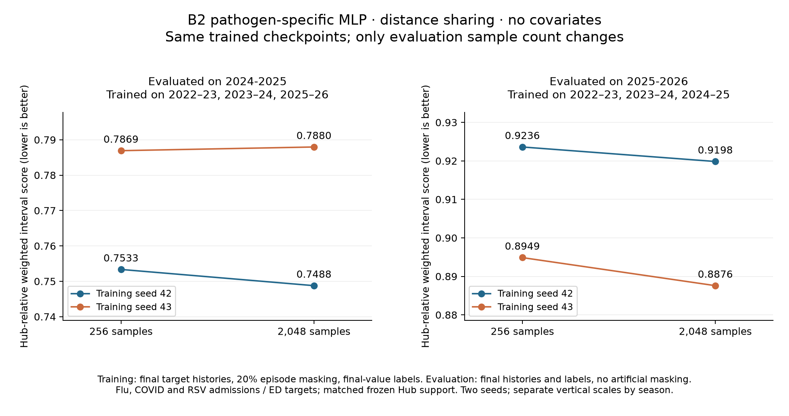

# B2 evaluation with 256 versus 2,048 forecast samples

Requested October 5, 2026. B2 and its subsequent replay experiments used 256
evaluation samples, not 258; the earlier B0 reference used 2,048. This small
experiment changes only the number of forecast samples used to calculate
evaluation quantiles. It reuses trained models; it does not retrain them.

## Model, inputs and labels

Assumption: use the best-ranked original B2 configuration (C1), the
pathogen-partition MLP with distance-weighted spatial sharing and no covariates.
Use its existing training seeds 42 and 43. Each seed has two trained checkpoints:

| Training seasons | Evaluation season |
| --- | --- |
| 2022–2023, 2023–2024, 2025–2026 | 2024–2025 |
| 2022–2023, 2023–2024, 2024–2025 | 2025–2026 |

The first split is retrospective and includes a training season later than the
evaluation season. The second is a forward-time holdout. The models learned
final-value labels for flu, COVID and RSV hospital admissions and ED proportions.
Training supplied final target histories at T-0 under B2's assumed availability
schedule, with natural missing values and artificial history masking in 20% of
training episodes. Artificial masking did not change labels. The original fits
used 128 training samples, 256 early-stopping validation samples, a 300-epoch cap
and patience 30; those fits and selected epochs are reused.

Evaluation supplies the same final target histories, natural availability masks
and finality flags as original B2, with no artificial masking and no covariates.
Both sample counts are evaluated against the same final labels and frozen Hub
comparison tasks. Thus this does not test real-time vintage inputs or whether
using more samples during training or early stopping helps.

There are four manager runs: two training seeds × two evaluation sample counts.
Each run evaluates both seasons, for eight fold evaluations. The same four
checkpoint files are pinned by SHA-256 in both experiments, and the dataset,
population data and frozen scoring support are checked against the original B2
experiment. Planning snapshots the existing Longleaf working-tree code for each
arm; this launch does not synchronize or overwrite that working tree.

The evaluation random seed is training seed + 1000 (1042 or 1043) for both
sample counts. The existing evaluator advances its random stream across episodes;
the 256 draws are therefore not guaranteed to be a nested subset of the 2,048
draws at every date. Two training seeds provide a small sensitivity check, not
a precise estimate of Monte Carlo variability or a test across all B2 models.

Compare paired scores within each seed and season, then the equal-season mean.
The manager reports Hub-relative weighted interval score: lower is better and
1 is the matched Hub ensemble. Report the 2,048-minus-256 score difference and
percentage change. The score weights and scoring support remain unchanged.

## Manager commands

Run from `/proj/jlessler/projects/tapestry-all/tapestry` on Longleaf.
The helper validates and pins the four original checkpoints, then prints and
executes the exact `tapestry.experiment.planner plan` command for each sample
count. Do not re-plan after launch; use `status` to resume unfinished work.

The manager plan performed inside the helper is the following (the helper must
also write `replay-source.json` before launch, so use the helper for a new plan):

```bash
scenario='replay_from=data/experiments/b-2-t0,replay_inputs=finalized,ed_transform=logit,spatial=distance,epochs=300,patience=30,fit_partition=pathogen,supplied_final=1,mask_rate=0.2,covariate_encoder=summary,input_mode=scheduled_final,input_normalization=b0,evaluation_seasons=recent_two'
for n in 256 2048; do
  .venv/bin/python -m tapestry.experiment.planner plan \
    -e b2-eval-samples-20261005-n$n -s "$scenario" --seeds 42 43 \
    --device cuda --eval-members "$n" --dataset data/processed/panel.npz \
    --frozen data/evaluation/b0_hub_comparison_q23
done
```

```bash
.venv/bin/python scripts/plan_b2_eval_samples.py --seeds 42 43 --eval-members 256 2048

for n in 256 2048; do
  name=b2-eval-samples-20261005-n$n
  LANES=2 GPUS=2 OPENBLAS_NUM_THREADS=1 sbatch --job-name="$name" --array=0-0 --time=01:00:00 scripts/jlessler.sbatch "$name"
  .venv/bin/python -m tapestry.experiment.planner status -e "$name"
done

# After completion:
for n in 256 2048; do
  .venv/bin/python -m tapestry.experiment.planner rank -e b2-eval-samples-20261005-n$n
done
```

Each arm requests one L40 GPU on g1803jles01 in the jlessler partition and runs
its two seeds concurrently. The standard launcher sends an ntfy summary after
each arm finishes, including failures or timeouts.

## Results

All four runs completed. The B2 pathogen-specific MLP with distance sharing and
no covariates, trained on final histories with 20% training-episode masking and
final-value prediction labels, scored as follows when the same saved models
received the original final-history evaluation inputs. The only treatment was
the evaluation forecast sample count. Each row averages seeds 42 and 43.
Lower Hub-relative weighted interval score is better; 1 is the matched Hub
ensemble. Scoring includes only targets supported by the frozen Hub tasks;
the 2024–25 composite here contains flu and COVID admissions, whereas 2025–26
contains all six admission/ED targets.

| Training seasons | Evaluation season | 256 samples | 2,048 samples | Difference (2,048 minus 256) |
| --- | --- | ---: | ---: | ---: |
| 2022–23, 2023–24, 2025–26 | 2024–25 | 0.770133 | 0.768362 | −0.001771 |
| 2022–23, 2023–24, 2024–25 | 2025–26 | 0.909241 | 0.903714 | −0.005527 |
| The two training/evaluation splits above, weighted equally | Two-season mean | 0.839687 | 0.836038 | −0.003649 |

Increasing evaluation samples reduced the mean score by **0.43%**. The same
models' equal-season scores decreased by 0.004174 for training seed 42 and
0.003123 for training seed 43. Three of four seed/season comparisons improved;
seed 43 evaluated on 2024–25 increased from 0.786917 to 0.787957. This is a small
but visible sampling effect for this model, with a larger mean benefit on
2025–26. It does not establish the effect across the full B2 grid or its ranking.

The 256-sample replay reproduced original quantiles within one admission count
and 1.82e-7 in ED proportion units. Evaluation truth, masks, dates and locations
matched the original artifacts exactly. Both comparison arms were freshly
evaluated on L40 GPUs with the same pinned code, rather than using original
archived scores as the 256-sample arm.

Job 3932198 (256 samples) completed in 32 seconds; job 3932200 (2,048 samples)
completed in 1 minute 46 seconds, with both seeds concurrent in each job.
These are observed job wall times including startup and scoring, not isolated
inference timings. Both manager rankings were generated with `rank --no-plots`;
the focused graph below uses those same exported score tables.



[Paired scores CSV](b2-eval-samples-20261005/paired_scores.csv) ·
[Figure PDF](b2-eval-samples-20261005/evaluation-samples.pdf)

## Launch record

Submitted October 5, 2026: job **3932198** evaluates 256 samples and job
**3932200** evaluates 2,048 samples. Slurm accounting confirmed both running on
g1803jles01, and each dispatcher started seeds 42 and 43. Both ntfy follow-up
jobs were successfully queued. Scores were not yet available at launch.

Use `squeue -a -u chadi` to include the hidden jlessler partition, or
`sacct -j 3932198,3932200 --format=JobID,State,ExitCode,Elapsed` for accounting.
