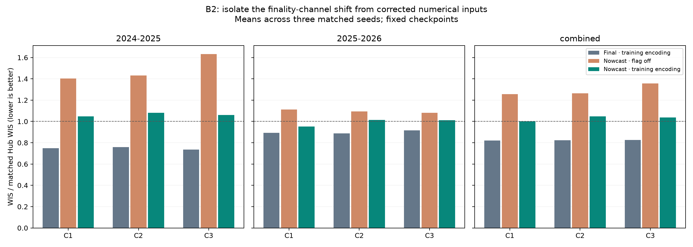

# B2 input-encoding controls

The initial input replay switched every vintage/nowcast target's known-final
flag off. B2's scheduled-final training always supplied that channel as a copy
of availability, including after artificial masking. It never trained on
available-but-non-final input combinations. This experiment isolates that
representation shift from numerical reporting revisions.

## Findings and next steps

The earlier replay overstated the loss attributable to revised numerical values
by changing an untrained feature encoding too. All 27 new runs / 54 fold
evaluations completed on Longleaf (GPU job 3338189; aggregation job 3338604).
Three focused scientific checks verify unchanged values, masks and labels under
the flag controls. No reference labels are used to set the compatibility flag:
it is simply the current input's availability, as during B2 training.

For the forward 2025–26 season:

| Model | Final WIS ratio | Nowcast, flag off | Nowcast, training encoding | Remaining loss vs final |
| --- | ---: | ---: | ---: | ---: |
| C1 | 0.8919 | 1.1126 | **0.9517** | **6.7%** |
| C2 | 0.8880 | 1.0946 | 1.0153 | 14.3% |
| C3 | 0.9163 | 1.0801 | 1.0112 | 10.4% |

C1's remaining loss is 4.9% on complete 12-week target histories and 2.5% when
also requiring eight uninterrupted reports. All three seed-specific full-season
C1 losses fall between 6.15% and 7.28%. The older 2024–25 replay remains harder:
nowcast losses with the training encoding are 40–44% across the three models.
The equal-season combined losses are 22–27%, not the earlier 53–64%.

This identifies an input-contract fix for existing B2 checkpoints: preserve their
trained feature encoding when substituting provisional point estimates. For new
fits, omit the redundant finality flag unless the training data actually contains
both available-final and available-non-final examples. Compatibility does not
make the underlying observations final.

After fixing encoding, the current nowcaster does not improve C1's 2025–26
forecast score: raw vintage 0.9500 versus corrected 0.9517 (paired mean change
+0.18%). It improves C2 by 1.47% and C3 by 0.71%. The immediate priority is
therefore realistic forecaster training, not optimizing nowcast MAE alone:

1. Use C1 with the legacy training encoding as the current strong baseline;
   keep raw-vintage and corrected-vintage versions in the comparison.
2. Train the same small forecaster on causal vintage/corrected histories, with
   final values only as prediction labels; remove the redundant finality channel.
   Match deployment covariates and preserve forward-time CV and early-stopping
   boundaries. The 2025–26 forward split is the primary development comparison.
3. Evaluate forecast WIS, bias and interval coverage by horizon on matched
   complete-history cohorts. Add empirically learned revision perturbations or
   history uncertainty only if these improve those downstream metrics.

The corrected-encoding C1 replay identifies a concrete forecast weakness in
2025–26: COVID ED WIS is 1.329 times the Hub's, whereas its other five target
ratios range from 0.758 to 0.990. COVID ED's nominal 90% interval covers only
53.5% of outcomes under the standard geography weighting. Its overprediction
penalty is larger than its underprediction penalty (0.799 versus 0.222 in
Hub-WIS units). This supports prioritizing that target's bias and interval
calibration, fit on out-of-fold training predictions rather than the scored
season. These figures describe the current replay; they do not establish that
a particular calibration or augmentation will improve next season.

These are development results on reused CV seasons. Architecture, source set and
spatial sharing differ between C1–C3, so their differences do not isolate a
causal covariate effect. The compatibility control is tested; the proposed
retraining and uncertainty treatments have not yet been run.

## Controls

Reuse all C1–C3 checkpoints, seeds 42–44 and both original CV seasons. Together
with the first replay, this supplies six conditions:

| Numerical inputs | Original replay encoding | New control encoding |
| --- | --- | --- |
| Finalized | Flag equals availability | Flag off |
| Raw vintage | Flag off | Flag equals availability |
| Nowcast-corrected vintage | Flag off | Flag equals availability |

The new final-input arm changes the flag alone. The corrected vintage comparison
keeps B2's training representation and changes numerical data and reporting
availability. Setting the extra channel equal to availability is a compatibility
control; it does not assert that provisional values have become final. The old
checkpoints cannot have learned what non-finality means from their training data.

Checkpoint weights, normalization, labels, dates, 256 Monte Carlo members and
paired sampling seeds remain fixed. Covariates are vintaged in both vintage
conditions; the latest eight target weeks are corrected only in the nowcast
condition. Underlying causal nowcasts must again match the saved best-model
outputs. No predictive uncertainty from nowcasting is propagated. These are
reused development CV seasons, not a new-season validation.

## Manager commands

Run once on Longleaf from `/proj/jlessler/projects/tapestry-all/tapestry`:

```bash
.venv/bin/python scripts/plan_b2_replay.py -e b2-flag-controls-20261001 --flag-controls
LANES=6 GPUS=1 sbatch --job-name=b2-flag-controls-20261001 --time=04:00:00 scripts/jlessler.sbatch b2-flag-controls-20261001
.venv/bin/python -m tapestry.experiment.planner status -e b2-flag-controls-20261001
.venv/bin/python -m tapestry.experiment.planner rank -e b2-flag-controls-20261001 --no-plots
.venv/bin/python docs/experiments/b2-flag-controls-20261001/report.py
```

Plan pins 18 existing source checkpoints and creates 27 runs / 54 fold evaluations.
Do not re-plan a running experiment; use manager status to resume.

<!-- results:start -->
## Results

| Model | Season | Final | Final, flag off | Vintage, training encoding | Nowcast, training encoding | Nowcast loss vs final |
| --- | --- | ---: | ---: | ---: | ---: | ---: |
| C1 | 2024-2025 | 0.7495 | 1.0599 | 1.0974 | 1.0486 | +40.0% |
| C1 | 2025-2026 | 0.8919 | 1.0114 | 0.9500 | 0.9517 | +6.7% |
| C1 | combined | 0.8207 | 1.0357 | 1.0237 | 1.0001 | +21.9% |
| C2 | 2024-2025 | 0.7599 | 0.9888 | 1.1163 | 1.0810 | +42.1% |
| C2 | 2025-2026 | 0.8880 | 0.9475 | 1.0303 | 1.0153 | +14.3% |
| C2 | combined | 0.8239 | 0.9681 | 1.0733 | 1.0481 | +27.2% |
| C3 | 2024-2025 | 0.7368 | 1.1752 | 1.1628 | 1.0610 | +43.9% |
| C3 | 2025-2026 | 0.9163 | 0.9491 | 1.0187 | 1.0112 | +10.4% |
| C3 | combined | 0.8265 | 1.0622 | 1.0907 | 1.0361 | +25.3% |



[All six conditions](encoding-comparison.csv) · [Paired seed scores](paired-scores.csv). Loss percentages are means of paired seed ratios.

[Complete-history and uninterrupted-reporting comparisons](stable-encoding-comparison.csv) · [Seed-level continuity scores](stable-seed-scores.csv). These cohorts concern the forecast target/location; other inputs may have gaps.
