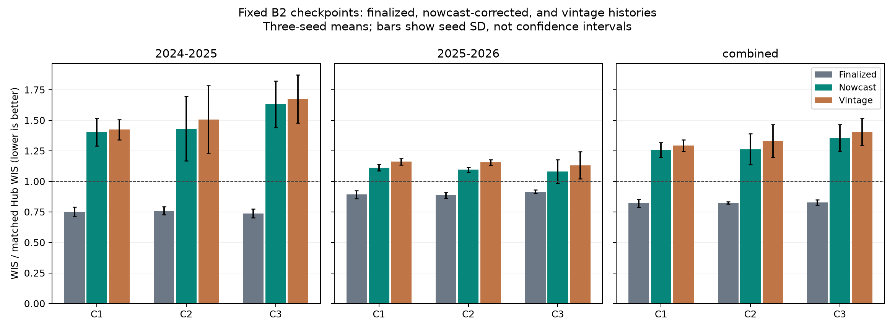

# B2 leaders on final, nowcast-corrected, and vintage inputs

**Interpretation update:** this initial replay changed B2's redundant finality
channel as well as its numerical inputs. The [encoding controls](../b2-flag-controls-20261001/index.md)
show that this accounted for a substantial part of the headline loss. With its
training encoding retained, C1's 2025–26 nowcast degradation is 6.7%, rather than
24.8%; it is 4.9% on complete target histories and 2.5% with eight uninterrupted
reports as well. The tables below remain the results of the original flag-off
intervention and should not be presented as the isolated cost of revisions.

Fixed-checkpoint replay of the top three B2 configurations (C1–C3), seeds 42–44,
on each checkpoint's own held-out season: 2024–25 and 2025–26. The purpose is to
measure degradation from the finalized-input benchmark and recovery from the
selected statistical nowcaster. There is no forecaster retraining.

## Findings

All 27 runs / 54 fold evaluations completed. In the forward 2025–26 season,
nowcasting reduces WIS by 4.2–5.2% relative to vintage inputs, but leaves a
17.9–24.8% loss relative to the finalized-input benchmark. Across both seasons,
the remaining loss is 53.2–64.0%; the older 2024–25 replay is much harder.
The loss percentages are means of paired seed ratios, not ratios of rounded
table entries. All non-final arms remain above the Hub ensemble's score of 1.

The loss persists on the user's preferred complete-history subset: in 2025–26,
nowcast degradation versus final inputs is 23.2% for C1, 21.9% for C2, and 16.2%
for C3. With eight uninterrupted reports as well, those losses are 17.7%, 13.3%
and 7.0%. These subsets change the scored calendar, so compare arms within a
subset, not absolute scores across subsets. Coverage is saved below.

This is a substantial shift for a forecaster trained on final values. It combines
target revisions, remaining gaps, vintage covariates, and changing the known-final
input channel from its finalized setting to false. B2's training regime did not
expose it to these non-final inputs. The present experiment does not separate
those causes; vintage→nowcast is the isolated correction comparison. Nor does
it establish the performance of a forecaster retrained on corrected vintages.

The causal cache matched 204,972 saved selected-model prediction cells. All 18
finalized fold replays preserved the original label/date/location support; the
largest quantile difference from the old outputs was one raw unit. This small
difference is consistent with numerical execution and rounding differences.
The resulting three finalized mean WIS ratios reproduce the published values
to four decimal places: 0.8207, 0.8239 and 0.8265.

Longleaf GPU job **3332778** and final aggregation job **3334399** completed.
The first aggregation job, 3334217, stopped after writing score tables because a
reporting helper was absent on the remote checkout. The helper was copied and
aggregation rerun; the completed inference artifacts were reused.

## Input comparison

- **Finalized:** original B2 scheduled-final target/covariate inputs and finality
  flags, including original T-0/T-1 covariate lags and native missingness.
- **Vintage:** the complete forecast lookback uses the Wednesday target vintage;
  all selected covariates use their actual vintages too. Missing reports remain
  missing; no later final values fill gaps. All target finality flags are false.
- **Nowcast:** the same vintage input, with the latest eight target weeks replaced
  by the selected seasonal adaptive-chain median nowcasts. Older target weeks and
  all covariates stay vintaged. Corrected targets remain marked non-final.

Thus final→vintage includes target revisions, reporting availability, covariate
revisions and finality flags. Vintage→nowcast isolates the eight-week target
correction, including its gap predictions. This is not a nowcast of covariates or
an estimate of degradation from target revisions alone. Native structural gaps
with no prior archive history remain missing in the nowcast arm.

C1 uses a pathogen MLP with distance sharing and no covariates; C2 uses a target
MLP with all covariates except outpatient and no spatial sharing; C3 uses a target
MLP with neighbor sharing and Kinsa. Each retains its original trained weights,
normalizers, 20% training-mask recipe and CV split. Seeds use the same 256-member
sampling stream in all arms. Forecast labels, held-out boundaries and frozen Hub
support are identical; missing input episodes are not dropped to improve scores.

## Assumptions and limits

The statistical nowcaster is recomputed causally at each Wednesday using the
selected two-year seasonal archive, weekly updating, median factors, four-week
state pooling, 12-week mature endpoint, observable proxy gap predictions and
NSSP rounding. All comparable outputs must match the saved selected nowcasts.
Its hyperparameters were chosen on these development seasons, so downstream
results are still development evidence. The forecaster remains trained on
finalized inputs: this measures a deployment-input shift, not the best achievable
model after retraining on corrected data. No nowcast uncertainty is propagated.

The old 2024–25 B2 fold intentionally trains on 2025–26, as in the original B2
retrospective CV design. The nowcaster itself uses only prior available reporting
pairs. Frozen forecast scoring in 2024–25 covers flu/COVID admissions; 2025–26
covers all six targets. Equal season weighting does not imply identical targets.
Use the unchanged manager's location-relative WIS ratio: US 20%, states/DC 80%,
admissions weight 1 and ED weight 0.5. Ratios below 1 beat the matched Hub ensemble.

The plan pins hashes for all 18 source checkpoints and the original dataset.
A shared cache generates causal corrections once. Focused scientific checks cover
input/label separation, no truth fallback, eight-week time alignment, and
identical label masks; finalized replay also checks exact original output support.

## Manager commands

Run on Longleaf from `/proj/jlessler/projects/tapestry-all/tapestry`:

```bash
.venv/bin/python scripts/plan_b2_replay.py -e b2-input-replay-20261001
LANES=6 GPUS=1 sbatch --job-name=b2-input-replay-20261001 --time=04:00:00 scripts/jlessler.sbatch b2-input-replay-20261001
.venv/bin/python -m tapestry.experiment.planner status -e b2-input-replay-20261001
.venv/bin/python -m tapestry.experiment.planner rank -e b2-input-replay-20261001 --no-plots
.venv/bin/python docs/experiments/b2-input-replay-20261001/report.py
```

The planning wrapper invokes the shared manager's `plan` for nine scenarios and
seeds 42–44. Plan once; use status and its resubmission command to resume. The
shared scorer requires identical frozen support across all 27 runs.

<!-- results:start -->

## Results

| Model | Season | Final | Nowcast | Vintage | Nowcast loss vs final | Vintage loss vs final |
| --- | --- | ---: | ---: | ---: | ---: | ---: |
| C1 | 2024-2025 | 0.7495 | 1.4024 | 1.4238 | +87.1% | +90.0% |
| C1 | 2025-2026 | 0.8919 | 1.1126 | 1.1612 | +24.8% | +30.3% |
| C1 | combined | 0.8207 | 1.2575 | 1.2925 | +53.2% | +57.5% |
| C2 | 2024-2025 | 0.7599 | 1.4319 | 1.5060 | +88.1% | +97.7% |
| C2 | 2025-2026 | 0.8880 | 1.0946 | 1.1544 | +23.4% | +30.1% |
| C2 | combined | 0.8239 | 1.2633 | 1.3302 | +53.2% | +61.3% |
| C3 | 2024-2025 | 0.7368 | 1.6319 | 1.6754 | +121.8% | +127.7% |
| C3 | 2025-2026 | 0.9163 | 1.0801 | 1.1312 | +17.9% | +23.4% |
| C3 | combined | 0.8265 | 1.3560 | 1.4033 | +64.0% | +69.7% |

Loss percentages are averaged paired seed ratios; scores are seed means.



[Paired seed scores](paired-seed-scores.csv) · [Geography summaries](input-comparison.csv) · [Target and season scores](target-season-scores.csv).

<!-- results:end -->

## Complete reporting histories

| Model | Season | Final | Nowcast | Vintage | Nowcast loss vs final | Vintage loss vs final |
| --- | --- | ---: | ---: | ---: | ---: | ---: |
| C1 | 2024-2025 | 0.7742 | 1.3542 | 1.4000 | +74.8% | +80.9% |
| C1 | 2025-2026 | 0.8890 | 1.0940 | 1.1421 | +23.2% | +28.6% |
| C2 | 2024-2025 | 0.7920 | 1.3957 | 1.4380 | +75.9% | +81.1% |
| C2 | 2025-2026 | 0.8864 | 1.0794 | 1.1385 | +21.9% | +28.5% |
| C3 | 2024-2025 | 0.7610 | 1.5989 | 1.6521 | +110.4% | +117.4% |
| C3 | 2025-2026 | 0.9152 | 1.0638 | 1.1149 | +16.2% | +21.8% |

These subsets require the forecast target/location to have all 12 context weeks visible at issuance. The stricter subset additionally requires eight uninterrupted newest-week reports. Other target and covariate histories may still contain gaps. The same support and standard scorer weights apply in every arm; coverage can differ between seasons.

[Continuity comparisons](stable-input-comparison.csv) · [Coverage](stable-coverage.csv) · [Seed-level continuity scores](stable-season-scores.csv).
