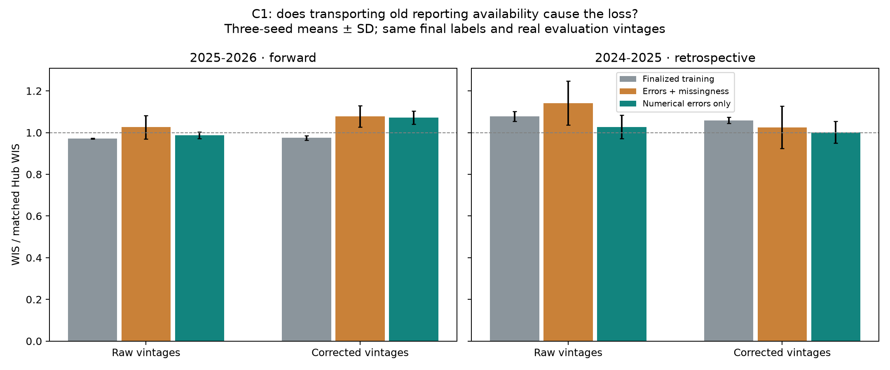
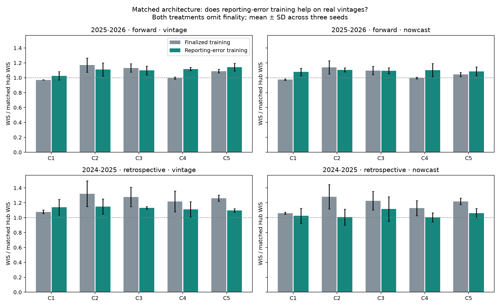
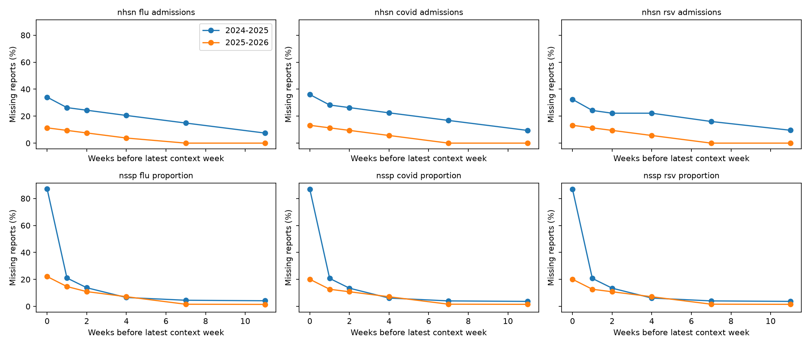
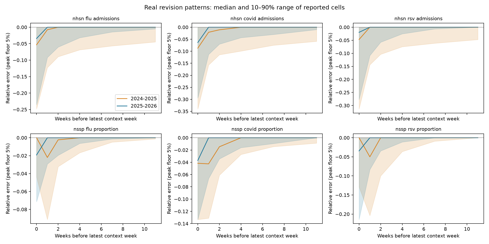
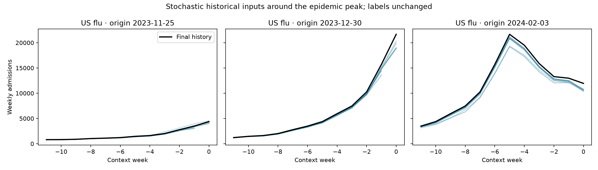
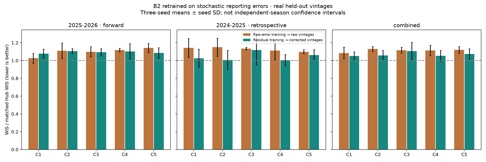

# Reporting-error augmentation of B2 · completed October 2, 2026

**Recommendation: retain finalized training for the preferred C1 forecaster.**
The tested stochastic reporting-error augmentation does not improve its forward
2025–26 forecasts on real vintages. Removing transferred missingness recovers
part of the raw-input loss but still does not beat the matched finalized-training
control. Nowcast-residual augmentation is consistently worse for C1.

All work completed on **g1803jles01 only**: 30 augmented-training runs, 15 matched
finalized-training controls, 30 fixed-control real-vintage replays, and six focused
numerical-error-only training runs. Seeds are 42–44, and each run evaluates both
original B2 CV seasons. Four focused scientific checks passed. Tables and graphs
are saved alongside this report; images were not inspected by the agent.

## Main finding: the preferred C1 model

Forward 2025–26 WIS relative to the matched Hub ensemble, averaged over three
seeds; lower is better, and 1 is the Hub comparator:

| C1 training | Real raw vintages | Real corrected vintages |
| --- | ---: | ---: |
| Matched finalized training, no finality channel | **0.9714** | **0.9747** |
| Reporting errors plus donor missingness | 1.0261 | 1.0779 |
| Numerical reporting errors only | 0.9881 | 1.0714 |
| Earlier original B2 checkpoint, compatible input encoding | 0.9500 | 0.9517 |

The first three rows are matched architectures. The last row is the previously
completed replay of the original B2 checkpoint, which retains its finality input
channel with the availability encoding used during training; it is a historical
reference rather than the matched intervention control. This encoding does not
assert that provisional values are actually final.

Full augmentation worsens C1 by **5.6% raw / 10.6% corrected** in mean paired seed
ratios, with losses in every seed. Numerical-error-only augmentation still loses
**1.7% raw / 9.9% corrected** versus the matched control. Its raw arm improves in
only one of three seeds; its corrected arm loses in all three. These seed effects
are not independent-season confidence intervals.

The copied availability pattern is therefore a plausible contributor to the
raw-arm loss, but removing it does not establish a useful training improvement.
Keep the earlier C1 raw-vintage replay with its compatible training encoding as
the strongest existing reference within this axis; the matched retrained C1
control also beats all its augmentation variants. Do not promote an augmentation
variant simply because its score is below 1 or its retrospective score improves.



[Paired C1 seeds](values-only-paired-seeds.csv) ·
[All C1 geographies and seasons](values-only-summary.csv) ·
[Follow-up target scores](values-only-target-scores.csv).

## All five B2 leaders

The original C1–C5 ranking determined the five configurations before this work.
Forward 2025–26 changes versus their matched no-finality finalized-training
controls, averaged paired seed ratios:

| Model | Raw-error augmentation | Nowcast-residual augmentation |
| --- | ---: | ---: |
| C1 | +5.6% | +10.6% |
| C2 | −5.1% | −2.5% |
| C3 | −2.7% | −0.3% |
| C4 | +12.2% | +10.7% |
| C5 | +4.9% | +4.0% |

Negative favors augmentation. C2's raw improvement is consistent across all
three seeds, but its augmented score is 1.1103 and does not challenge C1.
C1 and C4 worsen in all seeds in both arms. None of the ten full-augmentation
configuration/arm means beats the matched Hub ensemble on the forward season.
There is no consistent benefit across the five architectures.

The older 2024–25 fold is explicitly retrospective: the original B2 protocol
trains it on 2025–26. Its larger augmentation gains should not drive a forward
deployment choice. For C1, numerical-error-only raw training improves that fold
from 1.0785 to 1.0273 while worsening the forward fold from 0.9714 to 0.9881.
Its combined score of 1.0077 versus control 1.0249 masks this tradeoff.

COVID ED remains poorly calibrated. C1 numerical-error-only residual training
has forward WIS 1.4960 and 58.4% coverage of nominal 90% intervals; its normalized
overprediction penalty is 0.898 versus underprediction 0.201. Its raw counterpart
has WIS 1.1808 and 59.9% coverage. Augmentation did not resolve this calibration
problem. The matched target/horizon diagnostics are saved for subsequent work,
without fitting a new calibration to these reused scored seasons.



[Matched seed scores](matched-control-seeds.csv) ·
[Matched summary](matched-control-summary.csv) ·
[Target/horizon coverage and WIS components](horizon-calibration.csv) ·
[Comparison with earlier original B2 checkpoints](versus-fixed-summary.csv).

## Observed reporting distributions

The two recent seasons do **not** share a stable availability distribution.
Among cells with finite final truth, newest-week ED flu reports are missing
87.1% in 2024–25 versus 22.1% in 2025–26; NHSN flu missingness is 34.1% versus
11.3%. Median signed reported-cell flu-admission error, normalized by
max(final value, 5% of its seasonal location peak), is −5.3% versus −3.4%.
These figures include archive gaps, not only post-onboarding reporting weeks.
The 2023–24 archive lacks newest-week vintages for five of six targets.

Use only the latest permitted **training** season as the error donor: 2024–25
for forward evaluation on 2025–26; 2025–26 for the retrospective 2024–25 fold.
Exclude donor windows without any reports in the latest four weeks for each
of the six targets, while retaining ordinary latest-week missingness. The full
forward library has 34 joint windows; the inner selection library has 26.
These overlapping windows are not independent seasons. Using 2025–26's error
distribution to train its own evaluated fold would leak held-out information.





[Distribution values and older-archive support](revision-distributions.csv).

## Query-time transform

All original finalized training seasons and final prediction labels are retained.
Every optimizer minibatch gets a fresh stochastic input transformation, followed
by B2's original 20% artificial episode-masking recipe.

A single donor supplies the full 12-week target/covariate/location block, retaining
its empirical temporal, spatial, and cross-signal error correlations. Uniformly
sample one of eight nearest donor windows in national epidemic phase. Matching
uses six latest-two-week mean levels and six twice-signed two-week changes,
normalized by the corresponding fitting-season national peaks; unavailable
feature pairs do not enter the distance. The exact origin cannot donate to itself.
Matching is approximate and need not find an identical phase in this small library.

Transport each cell's signed `(reported − final) / max(final, 0.05 × peak)` error
using the recipient's corresponding denominator. Covariates use absolute final
value in that denominator. Peaks are signal/location-specific and use permitted
fitting dates only. Constrain synthetic targets to nonnegative counts or
proportions in [0,1], and selected covariates to nonnegative values. Synthetic
counts remain continuous after rescaling. Epidemic dates and forecast labels
are never shifted, resampled, or augmented.

Raw-error training uses real donor vintages throughout the window. Residual-error
training replaces errors in the latest eight target weeks with residuals from
the selected causal adaptive-chain median nowcaster, including supported gap
predictions; the older four target weeks and covariates remain vintaged. The
nowcaster uses the selected two-year seasonal reporting archive, weekly updating,
median factors, four-week state pooling, 12-week mature endpoint, observable-proxy
gap predictions, and NSSP rounding. No nowcast uncertainty is propagated separately
at evaluation. Its evaluation cache matched 204,972 previously saved predictions.

Full augmentation transfers donor missingness only where permitted donor final
truth exists. Native missing recipient cells stay missing. A donor cell without
permitted final truth supplies no evidence and leaves the recipient unchanged;
it is not interpreted as a reporting outage. The inner forward library has final
truth for 82.5% of target cells. Sparse sources cannot supply a realistic revision
model: wastewater archives start in 2026, outside the forward fold's donor season.
Covariate/locations that can never be visible under the augmentation are masked
using the model's existing trained-support mechanism.

The single focused C1 ablation sets `reporting_missingness=0`: transport identical
numerical errors while keeping native target/covariate availability. A missing
donor report supplies zero raw numerical error rather than an invented revision.
Supported residual gap-nowcast errors remain eligible. B2's artificial masking
still applies. This diagnostic tests missingness transfer; it does not claim to
simulate the whole reporting process.



## Fitting, leakage controls and limits

Retain C1–C5 architectures, source sets, spatial sharing, 300-epoch caps,
patience 30, optimizer, mask recipe, CV boundaries, and seeds 42–44. Remove the
redundant finality input channel in both new training treatments and their
matched controls. Target normalizers, loss scales and covariate standardization
use permitted finalized fitting inputs, as in B2. The raw, residual, and control
runs use paired evaluation seeds and 256 predictive members.

Early stopping retains the original hidden calendar blocks. Before constructing
the inner error library, peak scales, phase features, or nowcast reporting-pair
history, exclude all inner validation and outer held-out reference dates. Give
validation one fixed synthetic donor draw per episode/seed across epochs.
Refit after restoring the validation weeks with the full-training library.
Controls select epochs on finalized validation inputs. Thus the matched
comparison measures the whole augmentation intervention, including validation
input treatment; it does not isolate optimizer updates alone.

Score every original B2 held-out episode on actual raw or corrected Wednesday
vintages, with actual vintage covariates and unchanged final labels. No future
truth fills evaluation gaps. The evaluation nowcaster updates from previously
available reports, including prior reports during the scored season. Training
residual libraries exclude the scored season's reference dates and inner
validation dates as appropriate. Frozen data hashes, denominator, population,
quantile count, and target/season/location/horizon support match across treatments.

Scoring weights: native US 20%, equally weighted states/DC 80%; admissions 1,
ED 0.5; equal season weighting only for the explicitly labeled combined result.
2024–25 frozen support has flu/COVID admissions, whereas 2025–26 has all six
targets. Equal season weighting does not make their target support identical.

Material assumptions: normalized reporting errors and within-window dependence
transfer between seasons; national levels/slopes sufficiently match epidemic
phase; eight neighbors and the 5% peak floor are useful fixed regularization.
The measured archive shift challenges transfer. This work neither establishes
stationarity nor creates new independent seasons. All architecture selection,
nowcaster choices, and the focused follow-up use reused development seasons;
none is untouched prospective evidence. Three seeds measure fitting variability,
not season-level uncertainty. The negative result concerns this tested scheme,
not every possible reporting augmentation method.

Scientific checks cover unchanged labels/masks, fresh stochastic queries,
held-out/validation exclusion, joint donor time/signal/location alignment,
and unchanged native availability for the numerical-error-only diagnostic.
The numerical nowcasts also pass the saved-prediction parity check.

## Completed jobs and manager commands

| Stage | Experiment | Training/replay job | Final aggregation |
| --- | --- | --- | --- |
| Full augmentation, C1–C5 | b2-reporting-augmentation-20261001 | 3351848 | 3352500 |
| Matched finalized training | b2-reporting-controls-20261001 | 3352914 | 3354554 |
| Real-vintage control replay | b2-reporting-control-replay-20261001 | 3410494 | 3411371 |
| C1 numerical errors only | b2-reporting-values-only-20261002 | 3412427 | 3412430 |

All training/replay allocations and final reports completed successfully on the
first node. Follow-up job 3354554 ranked the controls and launched replay, then
failed to submit its dependent report because an older completed Slurm job ID
had expired. Report 3411371 repaired that submission; completed computations
were reused. An earlier pending follow-up was replaced before execution to fix
the planning source path. No scientific run was lost to either scheduling issue.

Run on Longleaf in the isolated checkout. Plans below are **already complete**;
use status to resume rather than re-plan or repeat a completed launch.

```bash
cd /proj/jlessler/projects/tapestry-all/tapestry-reporting-augmentation-20261001
export PYTHONPATH="$PWD/src"

.venv/bin/python scripts/plan_b2_augmentation.py -e b2-reporting-augmentation-20261001
LANES=8 GPUS=4 sbatch --job-name=b2-reporting-augmentation-20261001 --array=0-3 \
  --nodelist=g1803jles01 scripts/jlessler.sbatch b2-reporting-augmentation-20261001
.venv/bin/python -m chromantis.experiment.planner status -e b2-reporting-augmentation-20261001
.venv/bin/python -m chromantis.experiment.planner rank -e b2-reporting-augmentation-20261001 --no-plots

.venv/bin/python scripts/plan_b2_augmentation_controls.py fit
LANES=8 GPUS=2 sbatch --job-name=b2-reporting-controls-20261001 --array=0-1 \
  --nodelist=g1803jles01 scripts/jlessler.sbatch b2-reporting-controls-20261001
.venv/bin/python -m chromantis.experiment.planner status -e b2-reporting-controls-20261001
.venv/bin/python -m chromantis.experiment.planner rank -e b2-reporting-controls-20261001 --no-plots

.venv/bin/python scripts/plan_b2_augmentation_controls.py replay
LANES=8 GPUS=2 sbatch --job-name=b2-reporting-control-replay-20261001 --array=0-1 \
  --nodelist=g1803jles01 --time=04:00:00 scripts/jlessler.sbatch b2-reporting-control-replay-20261001
.venv/bin/python -m chromantis.experiment.planner status -e b2-reporting-control-replay-20261001
.venv/bin/python -m chromantis.experiment.planner rank -e b2-reporting-control-replay-20261001 --no-plots

.venv/bin/python scripts/plan_b2_reporting_values_only.py
LANES=3 GPUS=2 sbatch --job-name=b2-reporting-values-only-20261002 --array=0-1 \
  --nodelist=g1803jles01 --cpus-per-task=6 --mem=48G \
  scripts/jlessler.sbatch b2-reporting-values-only-20261002
.venv/bin/python -m chromantis.experiment.planner status -e b2-reporting-values-only-20261002
.venv/bin/python -m chromantis.experiment.planner rank -e b2-reporting-values-only-20261002 --no-plots

# Regenerate result sections in this order, without training or inference:
.venv/bin/python docs/experiments/b2-reporting-augmentation-20261001/report.py
.venv/bin/python docs/experiments/b2-reporting-augmentation-20261001/controls_report.py
.venv/bin/python docs/experiments/b2-reporting-augmentation-20261001/values_only_report.py
```

Each plan invokes the shared manager and pins its source snapshot. Completed
snapshots and checkpoints remain intact. The isolated code directory prevents
interference with the second-node experiment. To retrieve reports from the Mac:

```bash
rsync -a longleaf:/proj/jlessler/projects/tapestry-all/tapestry-reporting-augmentation-20261001/docs/experiments/b2-reporting-augmentation-20261001/ docs/experiments/b2-reporting-augmentation-20261001/
```

Regenerate training-data diagnostic plots locally with
`.venv/bin/python docs/experiments/b2-reporting-augmentation-20261001/audit.py`.

## Decision log

October 1–2: used the latest eligible training-season donor distribution because
archive regimes differ; retained original history, labels and CV design. Added
matched no-finality controls to isolate the training intervention. After those
controls confirmed C1's forward loss, tested one numerical-error-only ablation
to examine the observed availability mismatch. It recovered part of the raw-arm
loss but did not beat finalized training. Concluded this axis without another
parameter search; retain finalized C1 training and record COVID calibration as
an unresolved issue, not a promised augmentation benefit. The AFK heartbeat
`finish-b2-reporting-error-experiments` was paused after the completed report was saved.

<!-- results:start -->
## Completed forecast scores

| Model | Season | Raw-error training | Residual-error training | Residual vs raw |
| --- | --- | ---: | ---: | ---: |
| C1 | 2024-2025 | 1.1416 | 1.0255 | -9.1% |
| C1 | 2025-2026 | 1.0261 | 1.0779 | +5.4% |
| C1 | combined | 1.0838 | 1.0517 | -2.6% |
| C2 | 2024-2025 | 1.1496 | 1.0075 | -11.7% |
| C2 | 2025-2026 | 1.1103 | 1.1058 | +0.1% |
| C2 | combined | 1.1300 | 1.0566 | -6.5% |
| C3 | 2024-2025 | 1.1331 | 1.1169 | -1.5% |
| C3 | 2025-2026 | 1.0978 | 1.0928 | -0.3% |
| C3 | combined | 1.1155 | 1.1049 | -0.8% |
| C4 | 2024-2025 | 1.1118 | 1.0048 | -9.0% |
| C4 | 2025-2026 | 1.1175 | 1.1024 | -1.3% |
| C4 | combined | 1.1147 | 1.0536 | -5.4% |
| C5 | 2024-2025 | 1.0972 | 1.0612 | -3.2% |
| C5 | 2025-2026 | 1.1418 | 1.0862 | -4.7% |
| C5 | combined | 1.1195 | 1.0737 | -3.9% |



[Paired seed scores](paired-seed-scores.csv) · [All geographies](augmentation-comparison.csv) · [Target scores](target-season-scores.csv).

[C1–C3 versus earlier fixed-checkpoint replay](versus-fixed-summary.csv). This comparison changes training and removes the finality channel; it does not isolate augmentation alone.

<!-- controls:start -->
## Matched finalized-training controls

| Model | Input treatment | Season | Finalized training | Error-augmented training | Change |
| --- | --- | --- | ---: | ---: | ---: |
| C1 | nowcast | 2024-2025 | 1.0589 | 1.0255 | -3.1% |
| C1 | nowcast | 2025-2026 | 0.9747 | 1.0779 | +10.6% |
| C1 | nowcast | combined | 1.0168 | 1.0517 | +3.5% |
| C1 | vintage | 2024-2025 | 1.0785 | 1.1416 | +5.9% |
| C1 | vintage | 2025-2026 | 0.9714 | 1.0261 | +5.6% |
| C1 | vintage | combined | 1.0249 | 1.0838 | +5.7% |
| C2 | nowcast | 2024-2025 | 1.2806 | 1.0075 | -20.7% |
| C2 | nowcast | 2025-2026 | 1.1387 | 1.1058 | -2.5% |
| C2 | nowcast | combined | 1.2097 | 1.0566 | -12.2% |
| C2 | vintage | 2024-2025 | 1.3220 | 1.1496 | -11.5% |
| C2 | vintage | 2025-2026 | 1.1699 | 1.1103 | -5.1% |
| C2 | vintage | combined | 1.2459 | 1.1300 | -8.6% |
| C3 | nowcast | 2024-2025 | 1.2271 | 1.1169 | -9.1% |
| C3 | nowcast | 2025-2026 | 1.0976 | 1.0928 | -0.3% |
| C3 | nowcast | combined | 1.1624 | 1.1049 | -4.9% |
| C3 | vintage | 2024-2025 | 1.2785 | 1.1331 | -10.7% |
| C3 | vintage | 2025-2026 | 1.1320 | 1.0978 | -2.7% |
| C3 | vintage | combined | 1.2053 | 1.1155 | -7.0% |
| C4 | nowcast | 2024-2025 | 1.1276 | 1.0048 | -10.6% |
| C4 | nowcast | 2025-2026 | 0.9956 | 1.1024 | +10.7% |
| C4 | nowcast | combined | 1.0616 | 1.0536 | -0.8% |
| C4 | vintage | 2024-2025 | 1.2179 | 1.1118 | -8.3% |
| C4 | vintage | 2025-2026 | 0.9961 | 1.1175 | +12.2% |
| C4 | vintage | combined | 1.1070 | 1.1147 | +0.9% |
| C5 | nowcast | 2024-2025 | 1.2186 | 1.0612 | -12.7% |
| C5 | nowcast | 2025-2026 | 1.0440 | 1.0862 | +4.0% |
| C5 | nowcast | combined | 1.1313 | 1.0737 | -5.1% |
| C5 | vintage | 2024-2025 | 1.2617 | 1.0972 | -13.0% |
| C5 | vintage | 2025-2026 | 1.0890 | 1.1418 | +4.9% |
| C5 | vintage | combined | 1.1754 | 1.1195 | -4.8% |


[Paired seeds](matched-control-seeds.csv) · [All geographies](matched-control-summary.csv) · [Horizon, coverage and WIS-component diagnostics](horizon-calibration.csv).

Negative changes favor augmentation. Both treatments use the same no-finality architecture, seed, training history, mask recipe and frozen evaluation support. Reporting augmentation also changes the synthetic validation input treatment; this comparison measures the complete training intervention. Three seeds do not provide independent-season replication.

<!-- values-only:start -->
## Numerical-error-only follow-up

| Season | Input treatment | Finalized training | Errors + missingness | Errors only | Errors only vs control |
| --- | --- | ---: | ---: | ---: | ---: |
| 2024-2025 | nowcast | 1.0589 | 1.0255 | 1.0017 | -5.4% |
| 2025-2026 | nowcast | 0.9747 | 1.0779 | 1.0714 | +9.9% |
| combined | nowcast | 1.0168 | 1.0517 | 1.0365 | +2.0% |
| 2024-2025 | vintage | 1.0785 | 1.1416 | 1.0273 | -4.8% |
| 2025-2026 | vintage | 0.9714 | 1.0261 | 0.9881 | +1.7% |
| combined | vintage | 1.0249 | 1.0838 | 1.0077 | -1.7% |


[Paired seed changes](values-only-paired-seeds.csv) · [All geographies](values-only-summary.csv) · [Target scores](values-only-target-scores.csv).
