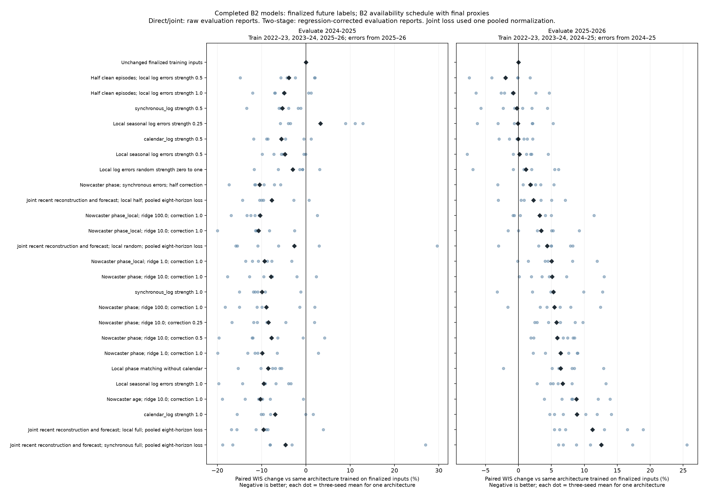
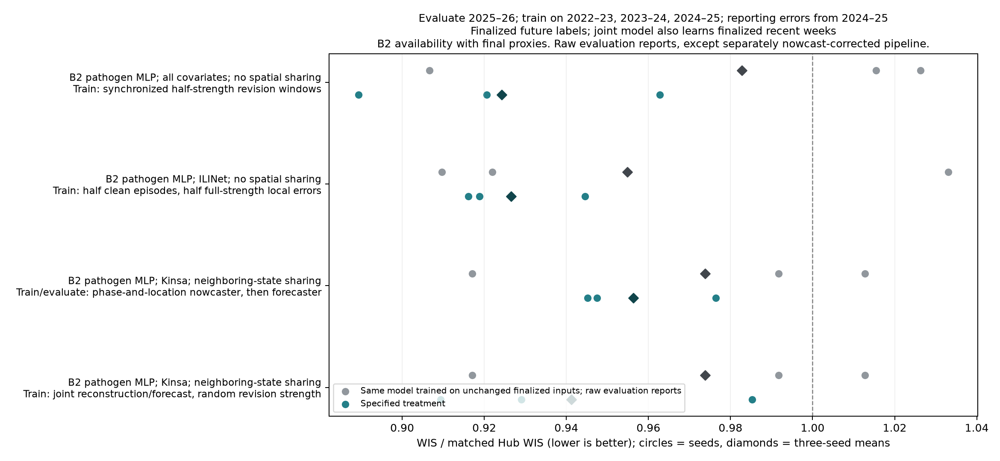

# Completed weekend results, analyzed 5 October 2026

There are promising individual models, but the clearest repeatable signal is to
**reduce how much artificial revision error is added**. Applying full errors to
all training episodes generally improved retrospective 2024–25 evaluation and
hurt 2025–26 evaluation. Leaving half the training episodes clean was more
reliable across the six architectures with complete three-seed comparisons.

These weekend treatments changed inputs in **all three training seasons**.
They do not yet answer whether changing only 2022–23 and 2023–24 works better.
That is being tested by the separately launched overnight vintaging agent,
including a learned reporting-error model.

## What actually finished

- 1,730 of 4,320 planned seed runs completed; each completed run includes both
  evaluation seasons, for 3,460 completed scored outer folds.
- 180 nominal configurations have all three seeds, spanning six B2 architectures.
- The joint-loss-weight field was not wired into the optimizer. Removing that
  fictitious treatment distinction leaves **156 distinct three-seed configurations**.
- C1, the original strongest B2 architecture, had no completed seed runs. C2 and
  C3 each have one completed seed per treatment. Their results are exploratory,
  not included in the three-seed conclusions below.
- The six fully evaluated backbones were original B2 C21, C22, C25, C26, C241,
  and C267. This is a selected, incomplete architecture subset, not the full sweep.
- The unfinished continuation allocations were stopped on 5 October to free the
  patron nodes for the user's requested focused overnight experiments.

The saved queue and completed-run ranking are in `analysis/`. The exact training
and evaluation support was verified by the common scorer and ranker: every
included run covers the same frozen target/season/location/horizon tasks.

## Training, labels, and evaluation

Every model below is newly trained, not an old checkpoint given different inputs.

| Evaluation season | Forecaster and nowcaster training seasons | Empirical reporting-error season |
|---|---|---|
| 2024–25, retrospective | 2022–23, 2023–24, 2025–26 | 2025–26 |
| 2025–26 | 2022–23, 2023–24, 2024–25 | 2024–25 |

All models learn finalized t+1 through t+4 labels. Joint models additionally learn
finalized t−3 through t labels. Separate nowcasters learn finalized recent values
from synthetically revised training histories. Reporting errors never change
prediction labels. Direct and joint models evaluate raw Wednesday reports; the
separate pipeline first corrects those reports with its training-season regression.

All comparisons use the assumed B2 availability schedule and source lags. Missing
archived evaluation reports use **explicit finalized-value proxies** where the
schedule assumes availability. No extra reporting gaps or random masking were
added; the finality indicator was removed. This is an optimistic simulation of
availability, not an operational forecast evaluation. It also changes B2's
original random-masking regularizer, which may affect performance.

Scores are WIS divided by matched Hub WIS: **lower is better; 1 equals the Hub**.
They retain the original 80% state/DC, 20% US weights and admission/ED weights
1/0.5. The older evaluation season covers fewer Hub targets than the newer one.
Each season is reported separately. Across-season scores weight seasons equally.

## Consistent treatment effects across six architectures

Each entry below compares a treatment with the **same architecture and seed
trained on unchanged finalized inputs, then evaluated on raw Wednesday reports**.
Percentages average paired seed-relative changes, first within architecture and
then equally across the six architectures. Negative means improvement.

| Training-input treatment | 2024–25 score change | 2025–26 score change | Architectures improved in 2025–26 |
|---|---:|---:|---:|
| Half clean episodes; other half receive half-strength local log errors | −3.86% | **−1.98%** | **5/6** |
| Half clean episodes; other half receive full-strength local log errors | −4.89% | −0.79% | 4/6 |
| Half-strength local log errors in every episode | −4.73% | +0.17% | See full table |
| Full-strength local log errors in every episode | −9.53% | **+6.73%** | See full table |
| Half-strength synchronized error windows in every episode | −5.33% | −0.25% | See full table |

Here “half strength” multiplies the signed log reporting error by 0.5. It does
not weaken evaluation reports. Synchronized errors use the same donor date across
locations, preserving concurrent reporting patterns. The synthetic values are
applied to the permitted training seasons only.

The average improvements are modest, and three seeds do not establish uncertainty
about future seasons. The six backbones are not independent epidemic datasets.
Still, these results motivate the overnight tests of clean/noisy mixtures,
first-two-season-only augmentation, and learned rather than copied errors.



## Specific three-seed comparisons in 2025–26

All rows train on **2022–23, 2023–24, 2024–25**, learn finalized prediction labels,
and evaluate **2025–26**. Artificial errors come only from **2024–25**. The
baseline in each row is the same architecture trained on unchanged finalized
inputs and evaluated on raw reports with the same assumed availability.

| Forecaster and training/evaluation treatment | Matched baseline WIS ratio | Treatment WIS ratio | Seeds improved |
|---|---:|---:|---:|
| Pathogen-specific B2 MLP, all covariates, no spatial sharing (original C22); train with synchronized half-strength errors; evaluate raw reports | 0.98281 | **0.92426** | 2/3 |
| Pathogen-specific B2 MLP, ILINet, no spatial sharing (C21); half clean training episodes, half full local errors; evaluate raw reports | 0.95491 | **0.92650** | 1/3 |
| Pathogen-specific B2 MLP, Kinsa, neighboring-state sharing (C25); train on phase/location-regression-corrected synthetic histories; evaluate regression-corrected reports | 0.97385 | **0.95636** | 2/3 |
| Same Kinsa/neighbor backbone (C25); jointly reconstruct recent weeks and forecast from random-strength artificial revisions; evaluate raw reports | 0.97385 | **0.94124** | 2/3 |

“All covariates” means inpatient, outpatient, wastewater WVAL-like, Kinsa, ILINet,
clinical laboratory, and FluSurv sources, each under the documented B2 schedule.
The separate nowcaster row uses phase and location features, ridge penalty 10,
and full correction. Its regression labels exclude the trajectory season being
corrected, but the empirical donor-error distribution is shared within the
permitted training fold. The joint row used the actual pooled eight-horizon loss,
not the intended separately weighted auxiliary objective.

The first row is the best forward score among completed three-seed configurations.
Its paired seed changes are −6.19%, +1.54%, and −12.42%; it is a promising lead,
not a demonstrated universal improvement. The second row's mean gain is driven
by one seed (−11.32%, +2.45%, +1.00%), making it less convincing on its own.
These examples were selected after observing development-season scores.



## Why the two-season average is not enough

The best completed two-season pipeline uses the pathogen-specific ILINet MLP
without spatial sharing (C21) and a phase/location nowcaster with ridge penalty
100. It trains on synthetic reports corrected by the nowcaster, learns finalized
future labels, and evaluates corrected Wednesday reports.

- Trained on **2022–23, 2023–24, 2025–26** with **2025–26** reporting errors and
  evaluated on corrected **2024–25** reports, it scores **0.81181**, compared with
  **0.90972** for the same forecaster trained on finalized inputs and evaluated on
  raw reports. This is retrospective.
- Trained on **2022–23, 2023–24, 2024–25** with **2024–25** reporting errors and
  evaluated on corrected **2025–26** reports, it scores **0.95328**, compared with
  **0.95491** for the matched finalized-training/raw-report baseline: nearly tied.

Its two-season mean, **0.88254 versus 0.93232**, therefore mainly reflects the
retrospective gain. Most separate-nowcaster and joint treatments show the same
seasonal asymmetry when averaged across the six complete backbones. The overnight
agents have been instructed to prioritize the newer season rather than optimize
only this pooled number.

## Archive completeness also differs between seasons

An input-only audit by the overnight nowcasting agent found that, across **all
seasonal origins** (not WIS-weighted frozen scoring tasks), latest-week state/DC
inputs use finalized-value proxies for about 33–37% of admissions and 88.5% of
ED cells in 2024–25, versus 11.5–13.5% and 20.5–22.6%, respectively, in 2025–26.
Thus the two folds do not expose models to the same amount of actual revision
error. This is a measured limitation of the assumed-full-availability experiment,
not proof that proxies cause the observed score differences. The nowcaster has
no oracle indicator that a supplied value is a finalized proxy.

A follow-up restricted to distinct target-origin-location cells on the frozen
scored support gives a different, narrower view: latest-week proxy shares are
7.41% for flu admissions and 8.57% for COVID admissions in 2024–25; these are the
only two scored retrospective targets. In 2025–26 the admission shares are zero,
and state/DC ED shares are 5.46% for flu, 1.44% for COVID, and 4.93% for RSV.
These are cell fractions, not WIS-weighted fractions. The large all-season ED
proxy share therefore describes additional input context, not directly scored
retrospective ED targets. Neither audit alone estimates the effect on forecasts.

The audit and graph are in the [overnight nowcaster protocol](../nowcast-overnight-20261005/protocol.md).

## Joint-loss implementation error and repeatability

The old fitter used `loss_cell_weights` directly instead of the separately
normalized `objective_weights` helper. Consequently, `joint_weight=0.25` and
`joint_weight=1` represented the **same actual pooled objective**, with relative
recent/future influence determined by available labels. They cannot support a
conclusion about auxiliary loss strength.

The analysis retains the default nominal weight-1 result whenever available,
without choosing by its score; the equivalent nondefault spelling is used only
when the default did not finish. Both settings finished for the six fully
compared backbones. They count as one intervention, not two.

These repeated fits were not always numerically identical despite the same seed.
Across 452 paired all-geography season scores, median absolute difference was
zero, mean absolute difference 0.02079, and maximum 0.27404. The largest pair ran
on H100 versus L40 hardware and selected markedly different stopping epochs.
That association does not isolate the cause. It is an additional reason to avoid
strong claims from single runs. Each overnight agent now keeps its matched
comparisons on one GPU type.

The fitter has been repaired for new runs. Training now uses separately normalized
forecast and reconstruction losses; early stopping uses future labels only. This
second change is intentional and also differs from the weekend protocol. A
focused one-step scientific check verifies that changing the auxiliary weight
actually changes the loss used by the optimizer; five targeted weekend checks
pass. Existing pinned weekend models and source snapshots were not rewritten.

## Artifacts and reproducibility

- `analysis/three-seed-ranking.csv`: 156 effective configurations, both seasons.
- `analysis/three-seed-season-results.csv`: separate season/geography means.
- `analysis/all-available-seed-scores.csv`: paired seed scores, training seasons,
  error-source seasons, labels, evaluation processing, and availability assumptions.
- `analysis/treatment-across-six-architectures.csv`: matched treatment effects.
- `analysis/joint-ignored-weight-audit.csv`: repeated nominal-weight comparisons.
- `analysis/completion.csv`: exactly what completed and what did not.
- `analysis/ranking/`: original common-ranker output, including incomplete-seed
  means that must **not** be mistaken for three-seed comparisons.

No new forecasts were fitted to produce this analysis. The common ranker aggregates
saved scored forecasts. It ran as CPU job **3800082**; the local analysis only
reads its CSVs and generates tables and graphs. No graphs were visually inspected.

```bash
cd /proj/jlessler/projects/tapestry-all/tapestry-weekend-20261002
PYTHONPATH=src .venv/bin/python -m tapestry.experiment.planner status -e b2-weekend-20261002
PYTHONPATH=src .venv/bin/python -m tapestry.experiment.planner rank -e b2-weekend-20261002 --allow-incomplete --no-plots

# Local table/graph regeneration after syncing ranking files:
.venv/bin/python docs/experiments/b2-weekend-20261002/analyze_completed.py
```

Original plan/launch/resumption commands are in [the protocol](index.md).
The stopped broad sweep should not be resumed on patron nodes while the new
user-requested overnight experiments own those nodes.

## Repository storage

The bulky `analysis/ranking/` and `analysis/all-available-seed-scores.csv` exports are generated artifacts excluded from Git. They remain in the local checkout and in `/proj/jlessler/projects/tapestry-all/tapestry-weekend-20261002/docs/experiments/b2-weekend-20261002/analysis/` on Longleaf. The committed `analyze_completed.py`, paired three-seed summaries and figures preserve the analysis; restoring the ranking exports allows the script to regenerate the detailed tables.
