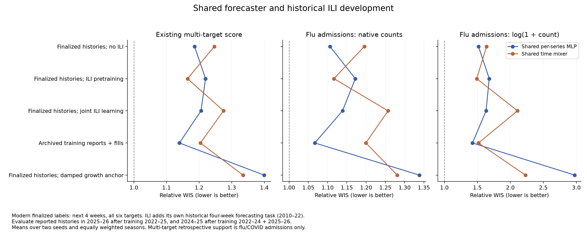

# B3 pilot results, 5 October 2026

All 74 runs completed: 37 configurations, seeds 42 and 43, each with two seasonal folds. The four training array tasks completed in approximately 1 hour 44 minutes on four L40 GPUs. Ranking job 3959160 computes scores from the saved forecasts; it does not retrain models. The 1,000-configuration search has not been launched.

The most promising balanced candidate is the target-specific MLP with neighbors and Kinsa trained on cross-fitted synthetic-tree-corrected histories and evaluated on admission-corrected histories. It nearly ties the best existing rank while substantially improving both influenza scores relative to that rank leader. Real-pair-tree correction leads on both influenza scores. The new shared architectures need further development; historical ILI pretraining helps the mixer, and interval undercoverage remains a material weakness. Exact seasons, labels, inputs and limitations follow.

## What every comparison means

Unless explicitly stated otherwise, every comparison in this report averages seeds 42 and 43 and weights these two evaluations equally:

- **Forward season:** train on 2022–23, 2023–24 and 2024–25; evaluate 2025–26.
- **Retrospective season:** train on 2022–23, 2023–24 and 2025–26; evaluate 2024–25. This uses a later training season and is not an operational historical backtest.

Every forecaster learns finalized outcomes for the next four weeks of influenza, COVID and RSV admissions and ED proportions. Training-input treatments change the histories the forecaster sees, not those prediction labels. Joint reconstruction additionally learns finalized recent-history labels. Historical ILI transfer adds a separate four-week ILI forecasting task using pre-August-2022 data, never invented historical admission labels.

Evaluation uses each Hub's submission-deadline reported histories, usually Wednesday, with finalized values where an archive is absent and the chosen T-0 ED availability rule. These are partly reconstructed publication histories, not entirely observed historical vintages. “Reported evaluation” below means these inputs. “Admissions-corrected evaluation” replaces the newest eight admissions weeks using a fitted nowcaster, leaving ED unchanged. “50/50 forecast mixture” combines the forecasts produced from reported and admissions-corrected inputs; it does not average the input values or retrain the forecaster. Direct-quantile mixtures use the numerical approximation documented in the protocol.

**Scores:** lower WIS is better; 1 equals the matched frozen Hub ensemble. The existing ranking weights states/DC 80%, the US 20%, admissions targets 1 and ED targets 0.5, with equal seasons. Despite its `six_target_native` field name, the frozen ensemble comparison has all six targets only in 2025–26 and flu/COVID admissions only in 2024–25. The two influenza admission scores use native counts and log(1 + count), respectively, with the same geographic and season weighting. They remain separate objectives. They are location-relative ensemble comparisons, not the official pairwise Hub ranking.

All experiments share a 120-epoch cap and patience 15. This pilot tests specified recipes, not each method's best achievable version. Two seeds are insufficient for strong statistical claims; both evaluation seasons have already influenced development. Selecting a best model or evaluation mixture using these results is further development-set selection.

## Training-input treatments

The existing backbones are (1) separate pathogen MLPs with distance exchange and no covariates, and (2) separate target MLPs with neighbor exchange and summarized Kinsa. Their sampled forecast heads and all training/evaluation seasons are as defined above.

The clearest repeatable treatment is to perturb admissions inputs in 2022–23 and 2023–24 with half-strength empirical reporting errors and use archived reports, with finalized fills where necessary, in the most recent permitted training season. The prediction labels remain finalized future outcomes. At reported evaluation inputs, this lowers the existing score from 1.0656 to 0.9347 for the pathogen MLPs (12.3%) and from 1.0156 to 0.9388 for the target MLPs (7.6%). It improves all four season–seed comparisons for the pathogen MLPs and three of four for the target MLPs. The 0.004 difference between the two treated backbones is too small to justify declaring one architecture superior.

The improvement is larger in the retrospective season. For the pathogen MLPs, 2024–25 goes from 1.1147 to 0.8911 and 2025–26 from 1.0164 to 0.9784. For the target MLPs, the corresponding changes are 1.0189 to 0.8868 and 1.0122 to 0.9907. The retrospective composite includes only two admission targets, so these season differences mix epidemic differences with target-support differences.

Other treatments are architecture dependent. Training target MLPs on archived/fill histories scores 0.9707 versus 1.0156 with unchanged finalized histories; pathogen MLPs score 1.0211 versus 1.0656. Cross-fitted synthetic-tree correction of synthetic training histories is promising for target MLPs (0.9526) but less so for pathogen MLPs (1.0127), evaluated on reported inputs. Joint reconstruction of two recent weeks with weight 0.05 gives the pathogen model a strong forward-season score of 0.9187, but a retrospective score of 1.0663. Keep both reconstruction settings: the four-week setting also changes the reconstruction weight to 0.25, so this pilot cannot isolate the effect of reconstruction duration.

## Shared architecture and ILI

The new width-32 per-series MLP and residual time mixer share weights across all six targets and predict 23 ordered quantiles. They have no spatial exchange or Kinsa covariates. The following comparisons use the same seasonal training sets, finalized future labels and reported evaluation inputs defined above.

The shared MLP trained on archived/fill histories is the best of these initial shared recipes on the existing score (1.1396). Historical ILI pretraining helps the mixer, from 1.2467 to 1.1646 (6.6%), but hurts the MLP, from 1.1862 to 1.2198 (2.8%). Joint ILI learning at the tested weight worsens both. The damped growth anchor substantially worsens both. This does not show that historical ILI lacks value; it shows that transfer depends on architecture and the initial joint-loss setting is not effective.

Shared models have 6,936–7,248 parameters versus 97,731 or 197,766 for the sampled existing backbones. Their two-fold manager runs average roughly 3–5 minutes, versus 17 minutes for unchanged-finalized pathogen MLPs and 43 minutes for unchanged-finalized target MLPs. These times include concurrent scheduling and nowcaster work, so they are operational turnaround, not isolated GPU throughput. Of 40 shared-model inner selections, 23 choose epoch 110 or later and four choose the exact 120-epoch cap. More training is therefore a reasonable targeted follow-up, not an explanation established by this pilot.

Changing only the existing encoder's output to ordered quantiles improves the pathogen recipe from 1.0656 to 1.0279 but slightly worsens the target recipe from 1.0156 to 1.0293. The corresponding runs take about 7.5 and 11.1 minutes, respectively. The poor shared-model ranking cannot be attributed to quantile output alone.

## Forecast uncertainty

For the pathogen MLP trained with older-season admissions errors and most-recent-season archived/fill histories, evaluated on reported inputs with finalized future outcomes as truth, weighted nominal 90% coverage is 78.6%, compared with 69.2% for unchanged finalized training histories and 85.5% for the Hub ensemble on identical tasks. Nominal 50% coverage improves from 35.1% to 43.5%, versus 53.0% for the ensemble. These are weighted coverage frequencies over the same frozen support, two seeds and equal seasons, not uncertainty intervals around the ranking.

The winning WIS recipe is still under-covering. Future development should tune uncertainty using training-only validation predictions, separating calibration of dispersion from correction of reporting bias. Calibration fitted on either evaluation season would contaminate these comparisons.

## Files and reproduction

- [Protocol, exact model settings and original plan/launch/status/rank commands](../index.md).
- [Exact scenarios](../design.json).
- [All scores, labelled by configuration, seed, season and evaluation inputs](scores-labelled.csv).
- [Mean scores for every configuration and evaluation-input choice](scores-summary.csv).
- [Paired training comparisons, including individual seasons and seed wins](paired-training-comparisons.csv).
- [Paired changes to evaluation inputs of each fitted forecaster](paired-evaluation-comparisons.csv).
- [Coverage on frozen tasks](coverage-summary.csv), [target/season coverage](coverage-target-season.csv).
- [Nowcaster diagnostics](nowcast-diagnostics.csv), [fitting time and selected epochs](fitting-summary.csv).

The score exports are in `ranking/`. Rebuild comparison tables and figures with `.venv/bin/python docs/experiments/b3-pilot-20261005/analysis/analyze.py`. Coverage extraction uses the downloaded per-run `totals.csv` and manifests under `/tmp/b3-pilot-analysis/artifacts`; `coverage.py` documents its weighting. Source forecasts and complete run artifacts remain on Longleaf under `/proj/jlessler/projects/tapestry-all/tapestry-b3-pilot-20261005/data/experiments/b3-pilot-20261005`.

## Where the leading training treatment improves

The large retrospective improvement for the pathogen MLP is mainly COVID admissions: its 2024–25 relative WIS falls from 1.3720 with unchanged finalized training histories to 0.9332 with older-season errors and recent archived/fill training histories. Flu admissions change only from 0.8575 to 0.8489 in that season. Both use reported evaluation inputs and the same finalized future labels. In the forward 2025–26 season, this training treatment improves five of six targets: flu admissions 1.0113 → 0.9719, COVID admissions 0.9930 → 0.9742, RSV admissions 1.0251 → 0.9275, flu ED 0.9909 → 0.9581, COVID ED 1.1737 → 1.1509; RSV ED worsens 0.9246 → 0.9495. Thus the composite win is not evidence of an equally large improvement for influenza or every target.

## Joint shortlist across the three scores

This table concerns **separate target MLPs with neighbor exchange and Kinsa**. All use the two training/evaluation season assignments and finalized four-week prediction labels defined above. The training descriptions specify the changed histories. Every row evaluates the fitted forecaster on **admissions-corrected histories**, leaving ED reported, with a synthetic-pair tree except the row explicitly using the real-pair tree. Lower is better in every column.

| Training inputs | Existing multi-target native score | Flu admissions native | Flu admissions log |
|---|---:|---:|---:|
| Unchanged finalized histories | 0.9855 | 0.8973 | 0.9150 |
| Older-season admissions errors; most-recent-season archived/fill histories | **0.9245** | 0.9530 | 0.9475 |
| Synthetic reports, corrected by a cross-fitted synthetic-pair tree | **0.9251** | 0.8399 | 0.8821 |
| Synthetic reports, corrected by a cross-fitted real-pair tree; real-pair tree also used at evaluation | 0.9393 | **0.8344** | **0.8800** |

The synthetic-tree corrected-training recipe is the strongest balanced starting point: essentially tied on the existing score (a 0.0006 gap), while much better than the older-error/recent-report recipe on both flu scores. Compared with unchanged finalized training plus the same correction at evaluation, it improves the existing score by 6.1%, flu native by 6.4%, and flu log by 3.6%. All three equal-season improvements hold in both seeds; the multi-target improvement holds in three of four individual season–seed comparisons. Its multi-target score is 0.9144 retrospectively and 0.9358 forward.

The real-pair-tree pipeline is the influenza leader, but its 0.9393 multi-target score is weaker than 0.9251. Its multi-target improvement over unchanged finalized training plus synthetic-tree evaluation correction holds in all four season–seed comparisons. That comparison changes both the corrected training inputs and the evaluation nowcaster, so it is evidence for the whole pipeline, not an isolated real-versus-synthetic tree effect. Real supervision means genuinely archived report-to-12-week-reference pairs in the latest permitted training season; the forecaster still receives corrected synthetic histories, not corrected historical reports. The maturity reference approximates final truth.

The multi-target leading older-error/recent-report target model is not an influenza winner: giving it corrected evaluation admissions raises forward-season flu native relative WIS from 1.0654 to 1.1278. Keep the flu native/log scores alongside the existing rank; optimizing only the aggregate would conceal this tradeoff.

## Nowcaster development without changing the forecaster

These comparisons fix the separate pathogen MLP recipe trained on unchanged finalized histories, with the two seasonal assignments and finalized future labels defined above. Its reported-input forecasts and scores coincide across all four corrector configurations. We then feed each fixed forecaster histories with its newest eight admission weeks corrected; ED remains reported. Thus these numbers isolate the choice of correction replay rather than a different forecaster training treatment.

| Evaluation inputs for that forecaster | Multi-target native | Flu native | Flu log |
|---|---:|---:|---:|
| Reported histories, no correction | 1.0656 | 0.9344 | 0.9611 |
| Synthetic-pair tree corrections | 1.0279 | 0.9298 | 0.9381 |
| Real-pair tree corrections | **0.9861** | 0.9262 | **0.9233** |
| Real-pair neural corrections | 1.0167 | 0.9180 | 0.9263 |
| Neural corrector with synthetic pretraining then real-pair fitting | 1.0203 | **0.9177** | 0.9258 |

Real-pair trees improve the existing score 7.5% versus reported evaluation inputs, outperforming both neural correctors on that score. Synthetic pretraining of the neural corrector brings no clear downstream advantage at the tested budget. Historical ILI pretraining of the forecaster is a different experiment.

Nowcast point diagnostics do **not** select the same winner. The synthetic tree reduces newest-week absolute error about 34% and recent-four-week mean-level absolute error about 34%, averaged as corrected/raw ratios across the three admission targets, two seasons and two seeds; the real tree reduces them about 27% each. Yet the real tree gives better downstream multi-target forecasts with the fixed forecaster. These diagnostics pool US and state observations in native units within each target/season and exclude cells without an archived mature reference; they are not the geographic-weighted forecast objective. Train/evaluate nowcasters on genuine reporting pairs, but select them jointly with downstream forecast performance and growth/level behavior, not newest-week MAE alone.

## Recommended refinement before the large random search

1. Keep all six targets and retain three separate score columns. Advance the synthetic-tree corrected-training target MLP as the balanced reference, the real-pair-tree version as the flu reference, and older-error/recent-report training as the strong multi-target challenger. Include unchanged finalized training with both reported and corrected/mixture evaluation baselines.
2. Keep the proposed six training-treatment allocations as a starting design, but place most artificial-error draws near the older-season-errors/recent-reports treatment. Randomize error strength, donor strategy and the use of actual recent reports separately; the pilot used only one latest-training-season donor. Do not eliminate joint reconstruction because the two-week pathogen recipe is strong in the forward season.
3. Continue real-pair tree development. Tune correction age, shrinkage and the reported/corrected mixture, with objectives that include both recent level and growth. Re-evaluate each fitted forecaster with all correction choices so gains from retraining remain distinct from gains from changing its inputs. Neural correctors currently deserve a smaller development allocation than trees.
4. Give shared MLP/mixer models a small targeted follow-up at longer training budgets and larger widths, crossing the promising reported/corrected training inputs. Keep ILI pretraining for the mixer: it improves all three scores in both seeds, including flu log by 9.1%. Reduce or retune the joint ILI loss rather than expanding the tested weight 0.25. Drop the current damped-growth recipe from the main search unless its mechanism is changed.
5. Include training-only interval calibration/dispersion development. The leading reported-input recipe still achieves only 78.6% nominal 90% coverage. Confirm finalists with more seeds and a genuinely untouched evaluation period before claiming superiority.

These are recommendations from the completed pilot, not a newly submitted search. The current score agreement check found the raw-history multi-target score matches the existing manager rank to within 4.5e-16 across all 37 configurations. All 1,998 seed/season/history/metric score rows are present.




## Measured vintage limitation

The reference width-64 pathogen MLP uses 12-week histories. In its 2024–25 evaluation episodes, the newest ED input is a finalized fill for 100% of flu observations, 83.7% of COVID observations and 100% of RSV observations; across the full 12-week own-target histories the corresponding fractions are 12.5%, 10.7% and 15.4%. RSV admissions also have 32.3% newest-week and 24.3% full-history fills. These are fractions of available inputs within each target's standard scoring window, not fractions of missing observations or scored future labels. In 2025–26, newest-week admissions fills are 0.14% for flu, 13.5% for COVID and 19.4% for RSV. The complete [reference fill table](ranking/reference-input-fills.csv) records both seasons and all six channels. Other lookback lengths can have different full-history fractions.

The high retrospective ED fill rates matter even where ED is absent from the frozen ensemble score: ED histories can still influence admissions forecasts. A stronger future vintage experiment should distinguish archive-available evaluation from the intended T-0 scenario, and make the missing-archive policy an explicit experimental dimension. These results assess the documented archive/final-fill scenario; they do not establish performance using only reports genuinely available at every historical deadline.

## Analysis execution record

CPU scoring job **3959160** runs on `g1803jles01` in the same isolated project directory as the training pilot. All three pilot metrics, both seasonal folds, both seeds and all three evaluation-history choices are scored and downloaded. The raw-history manager ranking agrees with the pilot scoring implementation. At this report's initial completion, the same job was still producing the supplementary official-style pairwise/full-window exports; conclusions above use the completed pilot and manager tables, not unfinished exports.

The original manager plan and GPU launch, plus status/rank commands, are reproduced in the [protocol](../index.md#launch-and-follow-up). This analysis used:

```bash
cd /proj/jlessler/projects/tapestry-all/tapestry-b3-pilot-20261005
export PYTHONPATH=src
.venv/bin/python -m tapestry.experiment.planner status -e b3-pilot-20261005
sbatch --partition=jlessler --nodelist=g1803jles01 \
  --job-name=b3-pilot-analysis --cpus-per-task=2 --mem=16G --time=01:00:00 \
  --output=output/slurm/b3-pilot-analysis-%j.log \
  --wrap='export PYTHONPATH=src OPENBLAS_NUM_THREADS=1 OMP_NUM_THREADS=1; .venv/bin/python -m tapestry.experiment.planner rank -e b3-pilot-20261005 --no-plots'
# Direct reranking alternative, once the existing scoring job finishes:
.venv/bin/python -m tapestry.experiment.planner rank -e b3-pilot-20261005 --no-plots
```

Ranking output: `data/experiments/b3-pilot-20261005/ranking-b48d88bd15f0/`. No additional model training was submitted for this analysis.
