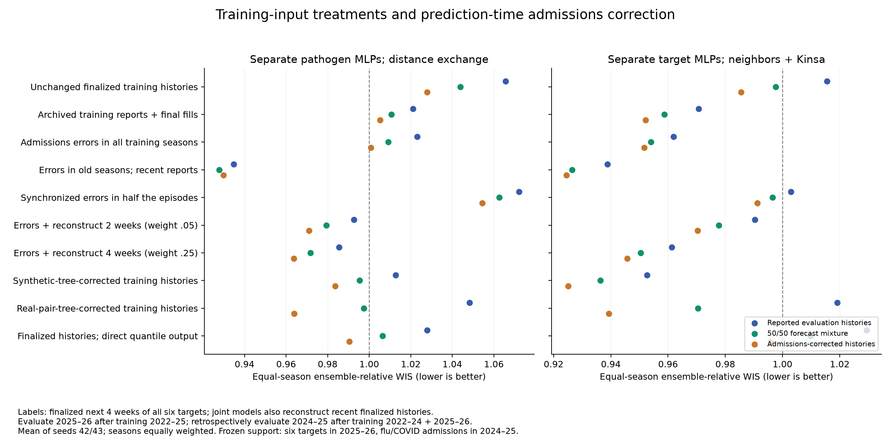
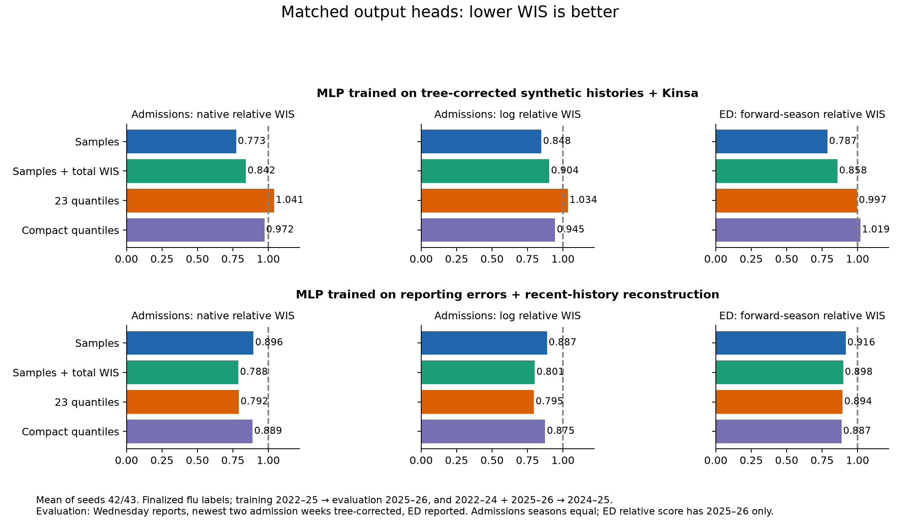
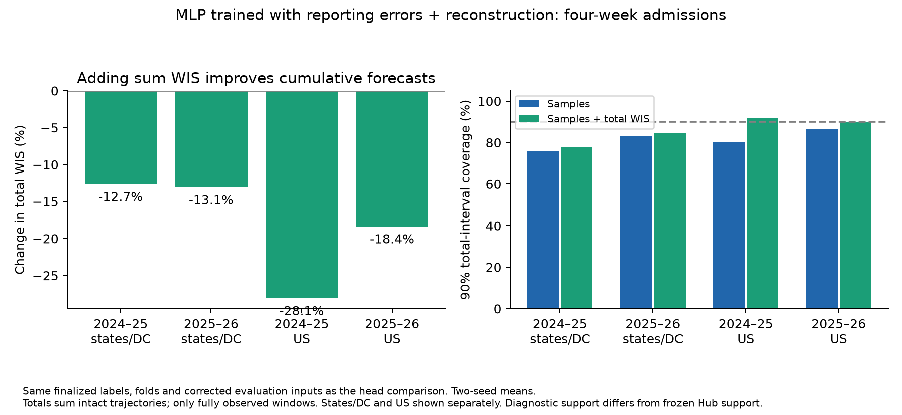

# B.3 and B.4 Flu forecasting and predictive distributions

[Editable Page](https://chatgpt.com/space/page_7b98c1aa60d08191b0e3f8b505446d7c).

This analysis starts with the B.3 reporting-history pilot and follows its findings through three completed B.4 experiments: a broad search over flu forecasting models, a focused covariate and correction-window refinement, and a matched comparison of probabilistic output heads. Together they favor two existing MLP recipes over the new shared architectures. One recipe gives the strongest native admissions and forward-season ED forecasts; another gives the strongest log-admissions forecasts. Adding a cumulative-admissions WIS loss creates a useful sampled version of the second recipe, but hurts the first. No single output head or auxiliary loss is best across both recipes.

B.4 is used here because the execution records already call the 600-configuration sweep B4. B.3 remains the earlier pilot used as a reference; C-series experiments are separate. The subsection names below are readable analysis labels, not changes to immutable experiment IDs.

| Analysis section | Question | Configurations | Seeds per configuration | Completed research runs |
|---|---|---:|---:|---:|
| B.3.pilot | Which reporting treatments, nowcasters and shared models justify a larger search? | 37 | 2 | 74 |
| B.4.earlyexplore | Which flu models, training inputs, disease covariates and historical ILI treatments work? | 600 | 2 | 1,200 |
| B.4.covariateexplore | Can contemporary ILINet, Kinsa or a longer correction window improve the two leaders? | 24 | 2 | 48 |
| B.4.encoderexplore | Which of four output-distribution heads and losses works on each leading recipe? | 8 | 2 | 16 |

All **1,338 research runs** completed successfully: 74 in B.3 and 1,264 in B.4. Each run contains two seasonal folds. Short validation runs are excluded from every result below. The hourly monitor was deactivated after scoring and analysis finished. No additional training is queued.

## B.3.pilot Reporting histories and nowcaster development

### What was tried

The B.3 pilot comprised **37 configurations × seeds 42 and 43 = 74 runs**, each evaluated in two seasonal folds. It tested reporting-history treatments, tree and neural nowcasters, shared series architectures, historical ILI transfer, and sampled versus direct-quantile output. All models used a 120-epoch cap and patience 15. This was a comparison of selected recipes, not a search for each method's best achievable setting.

Unlike the later B.4 experiments, B.3 forecasters learned finalized next-four-week outcomes for **all six targets: flu, COVID and RSV admissions and ED proportions**. Changing training histories did not change these future labels. Reconstruction additionally learned recent finalized observations; historical ILI transfer added a separate four-week ILI task using pre-August-2022 data, not invented historical hospitalization labels.

The forward fold trained on 2022–23, 2023–24 and 2024–25, then evaluated 2025–26. The retrospective fold trained on 2022–23, 2023–24 and 2025–26, then evaluated 2024–25. The latter is retrospective development, not an operational historical backtest. Both seasons had already influenced model development.

The two existing sampled backbones were separate pathogen MLPs with distance exchange and no extra covariates, and separate target MLPs with neighbor exchange and summarized Kinsa. Shared width-32 MLP and residual time-mixer alternatives predicted 23 ordered quantiles, without spatial exchange or Kinsa.

Evaluation used each Hub's Wednesday or holiday deadline, archived reports where available, finalized fills where archives were absent, and the documented T-0 ED rule. The corrected-input view replaced the newest **eight weeks of admissions for all three pathogens**, leaving ED reported. A 50/50 forecast-distribution mixture was also evaluated without retraining. This differs from B.4's flu-only admission correction, usually over two weeks.

**Score scope matters.** B.3's native multi-target rank has all six targets in 2025–26 but only flu/COVID admissions in 2024–25. It weights states/DC 80%, US 20%, admissions 1 and ED 0.5, then seasons equally. Flu admissions native and log WIS remain separate equal-season objectives. Lower is better and 1 equals the matched frozen ensemble. B.3's multi-target composite cannot be compared directly with B.4's flu-only composite.

### Training inputs that helped

Adding half-strength empirical admissions reporting errors to 2022–23 and 2023–24, while using archived reports with finalized fills in the latest permitted training season, improved both existing backbones when evaluated on reported inputs. Their future labels remained finalized outcomes for all six targets.

| Model, evaluated on reported histories | Trained on finalized histories | Trained on older-season errors and recent archived/fill histories | Improvement |
|---|---:|---:|---:|
| Separate pathogen MLPs, distance exchange, no covariates | 1.0656 | 0.9347 | 12.3% |
| Separate target MLPs, neighbor exchange, Kinsa | 1.0156 | 0.9388 | 7.6% |

The improvement held in all four season–seed comparisons for pathogen MLPs and three of four for target MLPs. Much of the large retrospective gain came from COVID admissions: for the pathogen MLPs, 2024–25 COVID admissions improved from 1.3720 to 0.9332 while flu admissions changed only from 0.8575 to 0.8489. Thus the aggregate improvement was not evidence of an equally large flu improvement.

Training on actual archived reports with finalized fallback also helped at reported evaluation inputs: target MLPs scored 0.9707 versus 1.0156 with finalized training histories; pathogen MLPs scored 1.0211 versus 1.0656. Synthetic-tree correction of artificial training histories favored the target recipe more strongly. Reconstruction was season-dependent: a two-week reconstruction objective with weight 0.05 gave pathogen MLPs a forward score of 0.9187 but retrospective score of 1.0663. The four-week variant also changed the weight, so duration and strength were not isolated.

### Why the best aggregate recipe was not the best flu recipe

The following models are all separate target MLPs with neighbor exchange and Kinsa, trained on the six finalized future outcomes in the folds described above. Each is evaluated with its newest eight admission weeks corrected, leaving ED reported. Synthetic-pair trees are used at evaluation except in the explicitly real-pair row.

| Histories used during forecaster fitting and evaluation corrector | Multi-target native | Flu admissions native | Flu admissions log |
|---|---:|---:|---:|
| Finalized training histories; synthetic tree at evaluation | 0.9855 | 0.8973 | 0.9150 |
| Older-season errors and recent archived/fill training; synthetic tree at evaluation | **0.9245** | 0.9530 | 0.9475 |
| Cross-fitted synthetic-tree-corrected artificial training reports; synthetic tree at evaluation | 0.9251 | 0.8399 | 0.8821 |
| Cross-fitted real-tree-corrected artificial training reports; real tree at evaluation | 0.9393 | **0.8344** | **0.8800** |

The synthetic-tree corrected-training model was the balanced starting point: virtually tied on the multi-target score while substantially stronger on flu than the aggregate leader. The real-pair-tree pipeline led flu native and log scores, at the cost of a weaker multi-target score. This motivated carrying separate native/log flu objectives into B.4 rather than optimizing only the original aggregate.

Real supervision here means archived report-to-12-week-reference pairs from the latest permitted training season; maturity approximates final truth. The forecaster still receives corrected synthetic histories. The real-tree comparison changes training correction and evaluation correction together, so it identifies a promising complete pipeline rather than isolating the source of the gain.

### Nowcaster development with the forecaster held fixed

B.3 also fixed the separate pathogen MLP recipe trained on unchanged finalized histories, with finalized six-target future labels and the same seasonal folds. Its reported-input predictions coincided across corrector settings. Feeding that fixed forecaster different eight-week admissions corrections produced:

| Evaluation inputs for the fixed forecaster | Multi-target native | Flu native | Flu log |
|---|---:|---:|---:|
| Reported histories | 1.0656 | 0.9344 | 0.9611 |
| Synthetic-pair tree corrections | 1.0279 | 0.9298 | 0.9381 |
| Real-pair tree corrections | **0.9861** | 0.9262 | **0.9233** |
| Real-pair neural corrections | 1.0167 | 0.9180 | 0.9263 |
| Neural correction with synthetic pretraining then real-pair fitting | 1.0203 | **0.9177** | 0.9258 |

This comparison changes the inputs to an existing forecaster, not its training treatment. Real-pair trees improved the multi-target score by 7.5% relative to reported inputs and beat the tested neural corrections on that objective.

Point nowcast accuracy did not select the same winner: synthetic trees reduced newest-week and recent-level absolute errors by about 34%, versus roughly 27% for real trees, yet the real tree gave better downstream forecasts. Those point diagnostics pool US and state observations in native units and use only available mature report pairs; they differ from the geographic-weighted forecasting objective. The practical lesson is to evaluate a nowcaster through downstream forecasting as well as point reconstruction.

### Shared architectures, historical ILI and quantiles

Under the same six-target finalized labels, seasonal folds and reported evaluation inputs, historical ILI pretraining improved the shared mixer from 1.2467 to 1.1646, but worsened the shared MLP from 1.1862 to 1.2198. Joint ILI learning at the tested weight and the damped growth anchor worsened both. The best initial shared recipe, an MLP trained on archived/fill histories, scored 1.1396 and remained behind the existing backbones.

Many shared-model internal validations selected epochs near the 120-epoch cap. That motivated longer budgets and larger widths in B.4, alongside lower auxiliary ILI weight and explicit fit-only scaling. It did not establish that insufficient training explained the gap.

Changing only the existing backbone's output to ordered quantiles improved the pathogen recipe from 1.0656 to 1.0279 but slightly worsened the target recipe from 1.0156 to 1.0293. Thus B.3 already showed a recipe-dependent output-head effect. B.4.encoderexplore later tested that question directly on the selected flu-focused recipes, including compact quantiles and cumulative WIS.

### Coverage and vintage limitations

For pathogen MLPs trained with older-season errors and recent archived/fill histories, evaluated on reported inputs, nominal 90% coverage improved from 69.2% under finalized-history training to 78.6%; the matched ensemble achieved 85.5%. Nominal 50% coverage improved from 35.1% to 43.5%, versus 53.0% for the ensemble. Better WIS therefore did not eliminate undercoverage. Calibration would need training-only validation predictions, not fitting on these evaluation seasons.

The archived-report scenario is also incomplete. In the reference 12-week pathogen model's 2024–25 evaluation, the newest ED input was a finalized fill for 100% of flu observations, 83.7% of COVID observations and 100% of RSV observations. Newest-week RSV admissions had 32.3% fills. These are fractions of available input cells in the target's scoring window, not missing future labels. ED can affect admissions predictions even when retrospective ED is absent from the frozen score. The pilot therefore assesses the stated archive/final-fill scenario, not an entirely observed historical-vintage backtest.

### Conclusion for B.3.pilot and transition to B.4

B.3 supported realistic reporting-error training, cross-fitted corrected histories and real-pair trees, but showed that the aggregate rank could hide flu-specific losses. It also showed persistent interval undercoverage, architecture-dependent ILI benefits and a recipe-dependent sample-versus-quantile effect. Those findings motivated the flu-focused random search, tree tuning, historical ILI follow-up and matched output-head study described below.

The earlier proposed 1,000-configuration multi-target search was not the executed follow-up: after the user's scope change, the completed next experiment was B.4's 600-configuration flu-focused sweep. Its 0.7799 composite must not be compared directly with B.3's 0.9251 multi-target composite. The B.4 section instead uses the B.3 reference rescored on identical flu-only support, where it scores 0.8563, and states the remaining training and correction differences.

[Detailed B3 pilot report and source tables](../b3-pilot-20261005/analysis/README.md). Manager experiment: `b3-pilot-20261005`; final ranking: `ranking-b48d88bd15f0`; 74 completed research runs. No B.3 models were retrained to add this section.

## B.4.protocol Shared training and evaluation conditions

All three B.4 experiments forecast **flu hospital admissions and flu ED visit proportions**, with finalized next-four-week prediction labels. COVID and RSV are optional inputs in the broad sweep, not prediction targets. Training weights are admissions 1 and ED 0.5. An auxiliary reconstruction objective, when present, learns recent finalized flu observations separately from the future forecast objective.

| Fold | Seasons used for model fitting | Season evaluated | Interpretation |
|---|---|---|---|
| Forward | 2022–23, 2023–24, 2024–25 | 2025–26 | Forecasting a later season from earlier seasons |
| Retrospective | 2022–23, 2023–24, 2025–26 | 2024–25 | Retrospective development comparison using a later training season |

Both evaluation seasons have informed development. These are useful model-selection experiments, **not an untouched prospective test**. Training epochs are selected with internal validation, then the model is refitted using the permitted training fold. Other hyperparameters are explored by the random search. Cross-fitted training corrections and fit-only ILI scaling are intended to prevent evaluation truth from entering training transformations.

Evaluation histories follow each Hub's Wednesday or holiday-adjusted deadline. Where an archived report exists, the reported value is used; unavailable archives are filled with finalized values. ED uses the documented T-0 reporting regime. Three evaluation-input treatments are produced from each fitted model:

- **Reported histories:** archived reports with finalized fills where no archive exists.
- **Admission-corrected histories:** the selected tree replaces the configured newest flu-admission weeks; flu ED remains reported.
- **Half-mixture forecasts:** a 50/50 mixture of the forecast distributions produced from those two histories. This is not an average of the two input histories or their quantiles.

Except where another view is explicitly named, tables below use admission-corrected evaluation histories. Comparing these views reuses a fitted forecaster. Changing a training treatment, covariate set or output head independently retrains it. Correction-window changes can affect both training and evaluation for models trained on corrected histories; that distinction matters in the second experiment.

### How to read the scores

Native admissions WIS measures probabilistic error on the count scale. Log admissions WIS applies the documented log(1 + count) evaluation. Relative scores compare model WIS with the frozen Hub ensemble on identical tasks, first within location. States/DC receive 80% of the geographic weight and US 20%; admissions seasons are weighted equally. **Lower is better; 1 is the ensemble reference.** A value of 0.80 is approximately 20% lower under this scoring construction, not 20% lower at every location and date.

The native composite uses admissions and ED weights 1 and 0.5 within each season. **Frozen 2024–25 support has admissions but no flu ED.** Therefore the retrospective half of the composite is admissions-only, and reported ED relative WIS covers 2025–26 only. Full-window raw ED WIS is checked in both seasons to prevent that omission from silently driving selection. Raw counts and ED proportions are not combined into an invented common score.

Coverage reports how often observations fall within prediction intervals. It is assessed alongside WIS, since very wide intervals can achieve high coverage while forecasting poorly. Two seeds provide a useful replication check, but not precise uncertainty estimates for small score differences. Hardware and numerical variation can cause small differences when a configuration is retrained.

## B.4.earlyexplore Broad flu model search

### What was tried

This experiment comprised **150 randomly selected recipes crossed with four matched disease-input sets**: flu alone, flu plus COVID, flu plus RSV, and all three pathogens. Each disease contributes admissions and ED inputs. Excluded disease values and availability masks are removed from both the forecaster and the nowcaster, preventing hidden use of excluded covariates. Each of the 600 configurations was trained on seeds 42 and 43 using the folds and finalized flu prediction labels above.

The first 440 configurations used existing MLP encoders: 336 fit flu targets separately, and 104 fit admissions and ED jointly. They varied width, lookback, learning rate, weight decay, admission transforms, sampled versus direct-quantile output, geographic information exchange, Kinsa input, reporting-error strength, tree settings and training budget. The remaining 160 used shared series encoders: 112 mixers and 48 shared MLPs, with matched historical ILI treatments. These architectures shared features across series, rather than simply fitting separate flu targets.

Six training-input or auxiliary-objective treatments were represented. Every treatment retained finalized future flu prediction labels.

| Treatment during forecaster fitting | Configurations | What changed |
|---|---:|---|
| Synthetic reports corrected by synthetic-pair trees | 180 | Artificially degraded training histories were corrected using cross-fitted trees trained on synthetic report-to-final pairs |
| Synthetic reports corrected by real-pair trees | 120 | Artificially degraded training histories were corrected using cross-fitted trees trained on genuine archived report-to-mature pairs |
| Errors in older seasons and actual reports in the recent permitted season | 120 | Older 2022–24 training histories received artificial admission errors; the latest permitted training season used archived reports with finalized fills |
| Actual archived reports with finalized fallback | 60 | Training used the report where archived, otherwise the finalized value, matching the evaluation fallback rule |
| Artificial errors plus recent reconstruction | 60 | Training histories received artificial errors and the model additionally learned recent finalized flu observations |
| Unchanged finalized histories | 60 | The forecaster learned from finalized historical inputs |

Real nowcaster supervision used report-to-12-week-reference pairs from the latest permitted training season; these labels are approximately mature rather than guaranteed final. Cross-fitting purged context-date unions, and the internal validation labels were excluded from correction fitting. This study therefore developed both the forecaster and its reporting correction, rather than treating the nowcaster as a fixed preprocessing step.

The sweep tested **312 sampled heads and 288 direct-quantile heads**. Among existing MLPs the split was 312 sampled and 128 direct quantiles; the 160 new shared models also used direct quantiles. Pooling all architectures into a single decoder comparison would conflate the output head with the feature architecture.

### Two leading recipes

**Recipe A, the native-score leader:** a width-96 MLP jointly predicting flu admissions and ED from flu histories plus Kinsa. It trains on synthetic reports corrected by cross-fitted real-pair trees and learns finalized future flu outcomes. At evaluation it uses a tree to correct the newest two admission weeks while ED remains reported. Its output is sampled.

**Recipe B, the log-admissions leader:** a width-96 MLP jointly predicting flu admissions and ED from flu histories, without extra covariates, with spatial neighbor exchange. It trains with artificial reporting errors and auxiliary reconstruction of recent finalized flu observations, alongside finalized future labels. At evaluation it also corrects the newest two admission weeks and leaves ED reported. Its output is 23 ordered quantiles.

Both recipes use the forward and retrospective folds specified above. Their scores are two-seed means, with equal-season admissions scoring.

| Fitted model and corrected evaluation setup | Native admissions | Log admissions | Forward ED | Native composite |
|---|---:|---:|---:|---:|
| Recipe A, sampled output | **0.7724** | 0.8480 | **0.7871** | **0.7799** |
| Recipe B, direct quantiles | 0.7918 | **0.7953** | 0.8941 | 0.7956 |
| Earlier B.3 reference on identical flu scoring support | 0.8399 | 0.8821 | 0.9742 | 0.8563 |

The B.3 reference used separate-target MLPs trained on all six pathogen outcomes, synthetic-tree-corrected artificial training reports, finalized future labels and the same seasonal fold assignments. Its evaluation also corrected other pathogens' admission histories, whereas B.4 corrects only flu admissions. Recipe A improves on that complete setup by approximately **8.0% native admissions, 3.9% log admissions, 19.2% forward ED and 8.9% composite**. This is not an isolated causal estimate of the benefit of dropping non-flu prediction labels.

Recipe A's original composite scores were 0.7782 and 0.7816 across the two seeds. For the same model, native admissions averaged 0.8026 in 2024–25 and 0.7422 in 2025–26; log admissions averaged 0.8089 and 0.8871. Both seasons support its strength, while emphasizing different relative advantages.

Raw ED WIS reveals a tradeoff that the composite cannot fully represent. Recipe B is better on retrospective ED: states/DC 0.005722 versus A's 0.006035, and US 0.004964 versus 0.005162. Recipe A is better on forward ED: states/DC 0.005070 versus B's 0.005713, and US 0.004069 versus 0.005056. These are separate raw-WIS comparisons on common full-window support; lower is better.

### Did adding other diseases help

All **150 matched recipes**, with both seeds and all four input sets complete, are available. The following are median percentage changes after independently retraining with added disease inputs, holding each recipe's other model settings, training treatment, finalized labels, seasonal folds and evaluation correction rule fixed. Positive changes are worse.

| Added disease inputs | Native admissions | Log admissions | Forward ED | Composite |
|---|---:|---:|---:|---:|
| COVID | +4.96% | +1.83% | +5.06% | +4.38% |
| RSV | +1.08% | +1.12% | +1.21% | +0.73% |
| COVID and RSV | +1.19% | +2.42% | +1.94% | +0.65% |

COVID inputs generally hurt. RSV has a smaller, mixed effect; neither added-input choice gives a consistent overall improvement. The composite improves for about 35% of recipes with COVID and 43% with RSV or both. Some recipes benefit, so the conclusion is to avoid making these covariates the default, not to claim they contain no forecasting information.

For Recipe A specifically, the composite is 0.7799 with flu inputs, 0.9266 with COVID, 0.8110 with RSV, and 0.8877 with both, retaining Kinsa and the same training and correction setup. The best overall recipe thus did not require another pathogen.

### Did historical ILI and shared architectures help

The shared-architecture portion crossed ten model recipes, four disease-input sets and four historical ILI modes: no historical task, own-source pretraining, flu-scaled pretraining, and flu-scaled joint learning. Historical ILI precedes August 2022. Modern finalized flu prediction labels and the permitted seasonal folds are unchanged.

Flu-scaled ILI multiplies historical values by a scale derived only from the current fitting partition's target quantiles, and uses the appropriate flu source head. ED pseudo-values are clipped to the valid proportion range. This transfers historical shape information; it does **not** create observed historical admissions or ED. The comparison changes both units and source identity, so it does not isolate scaling alone.

Across 40 matched architecture/input-set recipes, flu-scaled pretraining lowers median corrected-view composite by **3.00%**, native admissions by **3.35%**, and log admissions by **2.14%** relative to no historical task. Own-source pretraining lowers composite by 1.06% but worsens log admissions by 4.99%. Flu-scaled joint learning is slightly worse on all three measures. Historical pretraining is therefore promising in a specific form, rather than uniformly beneficial.

It does not close the gap to the existing MLP leaders. Best corrected-view composite scores are **0.9155 for the shared mixer** and **1.0431 for the shared MLP**, versus 0.7799 for Recipe A. These are minima from different searched configurations, not a controlled architecture-only comparison. A weaker model family can benefit from ILI and still remain weaker overall.

### Conclusion for B.4.earlyexplore

Keep flu-focused prediction and retain Recipes A and B for their different strengths. Do not add COVID or RSV by default. Retain fit-only scaled historical ILI pretraining as a research possibility for shared architectures, but do not promote those architectures over the existing MLPs based on this sweep. The winning treatments are corrected training histories and reconstruction training, yet their search budgets and other hyperparameters differ; the sweep does not by itself prove a universal ranking of training treatments.

## B.4.covariateexplore Contemporary ILI and correction windows

### What was tried

This experiment independently retrained the two leading MLP recipes across **four covariate choices**—none, Kinsa, contemporary ILINet, and Kinsa plus ILINet—and **three admission correction windows**—two, four and eight weeks. That gives 24 configurations and 48 two-seed runs. ILINet uses the existing publication lag; it is distinct from historical ILI pretraining and introduces no new target-based scaling.

Recipe A retains its training on real-tree-corrected synthetic reports; Recipe B retains reporting-error training and finalized reconstruction. Both learn finalized next-four-week flu labels. The forward fold trains 2022–25 and evaluates 2025–26; the retrospective fold trains 2022–24 plus 2025–26 and evaluates 2024–25. Evaluation uses reported histories with the configured admission correction and reported ED.

For Recipe A, changing the correction window changes both its corrected training histories and corrected evaluation inputs. For Recipe B, artificial-error training stays unchanged and the window changes evaluation correction. Thus A's window comparison is not merely an input replay of the same fitted model.

### What the covariates changed

At the two-week correction window, two-seed mean scores were:

| Recipe and covariates | Native admissions | Log admissions | Forward ED | Composite |
|---|---:|---:|---:|---:|
| A with Kinsa, original | **0.7724** | 0.8480 | **0.7871** | **0.7799** |
| A with Kinsa and ILINet | 0.7897 | **0.8424** | 0.8902 | 0.7980 |
| A with ILINet | 0.8893 | 0.8941 | 0.8770 | 0.8879 |
| A without extra covariates | 0.9126 | 0.9441 | 0.9538 | 0.9178 |
| B without extra covariates, original | **0.7918** | **0.7953** | 0.8941 | **0.7956** |
| B with ILINet | 0.9037 | 0.8946 | 0.8970 | 0.8981 |
| B with Kinsa and ILINet | 0.9646 | 0.9556 | **0.8696** | 0.9566 |
| B with Kinsa | 1.0223 | 1.0104 | 0.8869 | 1.0051 |

Adding ILINet to A with Kinsa slightly improves mean log admissions, by about 0.7%, but worsens native admissions by about 2.2% and forward ED by about 13.1%. Its admission benefit is retrospective: native WIS changes from 0.8026 to 0.7389 in 2024–25, but worsens from 0.7422 to 0.8405 in 2025–26. Log WIS likewise improves retrospectively and worsens forward. This is a season tradeoff, not a broadly better forecaster.

Raw ED tells the same story: A with Kinsa and ILINet slightly improves retrospective ED, but worsens forward states/DC WIS from 0.005070 to 0.005740 and US from 0.004069 to 0.004798. On B, extra covariates substantially worsen admissions; Kinsa plus ILINet modestly improves forward ED while worsening retrospective ED. No covariate addition dominates the original recipes across objectives and seasons.

Covariates change the learned context dimensions and initialization as well as the available information. With two seeds these results should not be interpreted as a universal causal effect of Kinsa or ILINet across model designs.

### What the correction windows changed

| Fitted recipe | Two weeks | Four weeks | Eight weeks |
|---|---:|---:|---:|
| A with Kinsa, native composite | **0.7799** | 0.8610 | 0.9495 |
| B without extra covariates, native composite | **0.7956** | 0.7969 | 0.7972 |

Correcting older admission weeks does not help either original recipe. The large degradation on A includes retraining on differently corrected histories; the small changes on B primarily reflect the evaluation correction window. A conclusion about nowcaster window length must preserve that distinction.

### Conclusion for B.4.covariateexplore

Retain **A with Kinsa** and **B without additional covariates**, both with **two-week admission correction**. Contemporary ILINet offers some retrospective gains but no better overall candidate. No configuration in this focused batch displaced the original leaders. All 48 runs finished in about 20 minutes, substantially faster than the initial runtime estimate.

## B.4.encoderexplore Matched probabilistic output heads

### What was tried

Despite the shorthand section name, this experiment holds the existing MLP **feature encoder fixed** and changes the output head or its training loss. The broad sweep contained no exact pair differing only between sampled and quantile heads, so both leading recipes were used rather than assuming one was already good with both heads.

Each of Recipes A and B was independently retrained with four variants, on seeds 42 and 43: **eight configurations and 16 runs**. Other settings, training-input treatments, finalized labels and seasonal folds remain fixed within a recipe. Evaluation again uses Wednesday/holiday histories with two-week flu-admission correction and reported ED. Both original-head controls are rerun in this batch, so its comparisons do not rely on subtracting results from different software snapshots.

| Variant | Forecast distribution | Training objective |
|---|---|---|
| Samples | Existing latent sampled output head | Marginal fair CRPS |
| Samples with total WIS | Same sampled output head | Marginal fair CRPS plus 0.25 times four-week flu-admission-total WIS |
| Current quantiles | Median plus 22 positive ordered gaps, giving 23 quantiles | Marginal pinball loss equivalent to WIS on the evaluation grid |
| Compact quantiles | Forecast-specific median, lower spread and upper spread, with two shared learned monotone shapes | Same marginal pinball/WIS loss |

The cumulative loss sums each intact sampled trajectory across the four future weeks **before** taking quantiles. It never sums matching marginal quantiles. Its scale is four times the training-only admission Q95; equal seasons and the 80/20 geographic weighting are preserved, with complete windows wholly within a season. Reconstruction weeks are excluded. The weight 0.25 is a fixed exploratory choice, not a tuned optimum. Early stopping stays based on marginal future-forecast loss. Coverage is diagnostic, not a separate penalty.

The compact head has three forecast-specific outputs, while its two eleven-point shape curves are shared within a head across forecasts, locations and horizons. Positive shape gaps accumulate and normalize to each side's outer quantile. Shape parameters live in model residual space before the unchanged native-unit transformation. This constrains flexibility more than the current quantile head, but still allows asymmetric lower and upper spreads.

### Matched marginal scores

These are two-seed means using corrected evaluation histories. Admissions average the two evaluation seasons equally; ED relative WIS covers only 2025–26. The rows labeled A and B refer to the fully specified training recipes above, not generic “corrected” or “joint” models.

| Training recipe | Output variant | Native admissions | Log admissions | Forward ED | Composite |
|---|---|---:|---:|---:|---:|
| A, corrected synthetic histories and Kinsa | Samples | **0.7731** | **0.8481** | **0.7873** | **0.7804** |
| A | Samples with total WIS | 0.8417 | 0.9040 | 0.8583 | 0.8485 |
| A | Current quantiles | 1.0407 | 1.0341 | 0.9967 | 1.0500 |
| A | Compact quantiles | 0.9725 | 0.9447 | 1.0189 | 0.9816 |
| B, reporting errors and reconstruction | Samples | 0.8957 | 0.8874 | 0.9161 | 0.8875 |
| B | Samples with total WIS | **0.7883** | 0.8012 | 0.8982 | 0.7963 |
| B | Current quantiles | 0.7921 | **0.7955** | 0.8942 | **0.7959** |
| B | Compact quantiles | 0.8889 | 0.8747 | **0.8866** | 0.8882 |

Samples clearly remain best on A. Adding total WIS hurts both seeds and both seasons. Direct quantiles do not transfer successfully to this recipe without retuning.

On B, current quantiles beat ordinary samples. Adding total WIS to the sampled model closes nearly all that gap: native admissions become slightly better than current quantiles, while log admissions and forward ED remain slightly worse. The composite difference, 0.7963 versus 0.7959, is too small to treat as a decisive advantage with two seeds.

Both B seeds improve with the total-WIS objective. Their native composite scores move from 0.8662 and 0.9088 to 0.8082 and 0.7843. The corresponding current-quantile scores are 0.8019 and 0.7899. The sampled cumulative candidate is therefore competitive, not a clear replacement for direct quantiles.

The head preference depends on the whole training recipe. A was originally selected with samples and B with quantiles, and this matched experiment deliberately does not retune each head's optimizer or transforms. It supports recipe-specific choices, not an intrinsic ranking of sampled versus quantile forecasting.

### Did sum WIS improve cumulative forecasts and coverage

For sampled models, evaluation constructs the four-week admission-total distribution from intact trajectories. Direct marginal quantiles do not identify this distribution, so no cumulative WIS or cumulative coverage is invented for either quantile head. ED proportions are not summed.

The cumulative diagnostics use fully observed four-week windows over the saved evaluation episodes, a different support from frozen Hub tasks. The following raw WIS values keep states/DC and US separate because their count scales differ. These are not ensemble-relative total scores. Issuance windows overlap and are not independent observations.

For **Recipe B**, comparing independently retrained sampled models with and without the added total-WIS objective:

| Evaluation season and geography | Ordinary samples total WIS | Samples with total WIS | Change | Coverage of 90% total interval |
|---|---:|---:|---:|---|
| 2024–25 states/DC | 195.39 | 170.66 | **−12.7%** | 75.7% → 77.7% |
| 2025–26 states/DC | 125.76 | 109.30 | **−13.1%** | 82.9% → 84.5% |
| 2024–25 US | 8654.45 | 6223.40 | **−28.1%** | 80.2% → 91.7% |
| 2025–26 US | 6135.53 | 5008.63 | **−18.4%** | 86.7% → 89.8% |

The two-seed average improves in every season/geography group. National coverage moves close to its nominal level, but states/DC still under-cover. The improvement is not uniform at seed level: seed 42 in 2025–26 worsens by about 2% in both geographies, while seed 43 improves strongly. More seeds would be needed to estimate the gain precisely.

For **Recipe A**, the same added loss worsens two-seed mean cumulative WIS by roughly 10–20% across the two seasons and geographies. Every season × seed × geography comparison worsens. Weighted 90% total coverage falls from 80.2% to 74.9%. Adding a score for the desired aggregate is therefore not automatically beneficial; its weight and interaction with the existing training treatment matter.

### What happened to compact quantiles and ED

Compact quantiles did not beat either original leader. On B they slightly improve forward ED relative WIS but worsen admissions and retrospective ED. Their admission tails are too narrow or misplaced often enough to under-cover: nominal 95% marginal intervals cover 83.4% on B, versus 91.3% with current quantiles. On A they cover 80.4%, versus 85.5% with samples. This implicates the restricted shape or its optimization as hypotheses; it does not rule out every compact distribution family.

The B sampled model with total WIS also does not dominate direct quantiles on ED. On retrospective ED, direct quantiles score raw WIS 0.005720 for states/DC and 0.004959 for US, versus 0.005988 and 0.005050 for samples with total WIS. Forward states/DC slightly favors direct quantiles, while forward US slightly favors the sampled cumulative candidate. The objectives remain a tradeoff.

All four heads have weekly interval-coverage diagnostics and a diagnostic for whether all four observations lie within their respective marginal intervals. That rectangular simultaneous coverage is **not** a nominally calibrated joint prediction region: 90% marginal coverage does not imply 90% simultaneous coverage. The experiment does not establish full joint calibration across targets, locations or arbitrary aggregates. Geographic-sum WIS, energy scores and variogram scores were not tested.

### Conclusion for B.4.encoderexplore

Keep **A with ordinary samples** for native admissions and forward ED. Keep **B with current quantiles** for log admissions. Retain **B with samples plus total WIS** as an additional candidate when coherent cumulative-admission uncertainty matters. Do not replace the existing heads with compact quantiles or make total WIS a universal training default based on these results.

## B.4.decisions Conclusions across all three experiments

| Decision | Evidence | Practical choice |
|---|---|---|
| Predict flu admissions and ED together in the leading recipes | Both leading recipes outperform the earlier complete setup on their strongest objectives | Retain the flu-focused recipes, while recognizing that the B.3 comparison changes more than target scope |
| Add other pathogen histories | Full matched comparisons show median deterioration; individual exceptions exist | Flu-only pathogen inputs remain the default for the selected models |
| Use historical ILI | Scaled pretraining helps shared architectures modestly, but they remain behind | Keep it as a development option rather than replacing the current leaders |
| Add contemporary ILINet | Some retrospective benefits, no better overall candidate | Keep A with Kinsa and B without extra covariates |
| Correct more old admission weeks | Four/eight-week windows do not improve the original recipes | Keep two-week correction |
| Choose samples or quantiles | Clear interaction with training recipe | Samples for A, current quantiles for B |
| Train on cumulative WIS | Improves B samples and hurts A samples | Preserve B with total WIS as a separate cumulative-forecast candidate |
| Simplify quantile parameterization | Neither original leader improves; tail coverage worsens | Do not promote the tested compact head |

The strongest result is not one universally best model. It is a small set of explicit choices tied to the forecast objective. Native-scale performance and forward ED favor A; log admissions favor B's current quantiles; cumulative admission uncertainty gives a reason to retain B's sampled total-WIS model.

Future work could test more seeds, an untouched prospective period, a smaller range of total-WIS weights, and compact heads with different shared shapes or initialization. These are proposed follow-ups, **not launched experiments**. The current evidence does not justify adding complexity everywhere.

## B.4.records Reproducibility and completion

The readable subsection labels map to the existing immutable experiment records as follows. Times are America/New_York. B.3 ran on October 5; the B.4 completions below are October 6, 2026.

| Subexperiment | Manager experiment | Final ranking | Training completion |
|---|---|---|---|
| B.3.pilot | `b3-pilot-20261005` | `ranking-b48d88bd15f0` | October 5; approximately 1 hour 44 minutes of training |
| B.4.earlyexplore | `b4-flu-600-20261005` | `ranking-98cf1e1c8cb0` | About 08:21; ranking completed 08:25 |
| B.4.covariateexplore | `b4-flu-refine-20261006` | `ranking-8717617b218d` | 09:18 |
| B.4.encoderexplore | `b4-flu-heads-20261006` | `ranking-63f2eff0ea53` | 09:43 |

The main sweep initially exceeded L40 memory at ten workers per GPU. It was resumed with four workers per L40, preserving completed runs and retrying interrupted/failed runs without changing scientific configurations. The H100 workers continued. All final comparisons use completed seed runs, not failed attempts or a partial completion subset. The first focused refinement started before the 9am cutoff. The later output-head experiment was separately requested and authorized by the user after that cutoff.

The main sweep and covariate refinement use the isolated Longleaf checkout `/proj/jlessler/projects/tapestry-all/tapestry-b4-flu-600-20261005`. The output-head comparison uses `/proj/jlessler/projects/tapestry-all/tapestry-b4-flu-heads-20261006`. Each manager plan pins source code. All use the common plan, launch, status and rank workflow; no training is launched by opening this analysis.

Repository records:

- [Broad sweep protocol and exact design](../b4-flu-600-20261005/index.md), with final tables in `b4-flu-600-20261005/final-analysis/`.
- [Covariate refinement protocol](../b4-flu-refine-20261006/index.md) and [detailed results](../b4-flu-refine-20261006/analysis/README.md).
- [Output-head protocol](../b4-flu-heads-20261006/index.md) and [detailed results](../b4-flu-heads-20261006/analysis/README.md).
- Exact scenario strings and seeds are preserved in each experiment's `design.json` and `scenarios.txt`. Per-seed/per-season scores and location-level distribution diagnostics are retained alongside each analysis.
- Analysis and figure generation are in `scripts/analyze_b4_followups.py` and `scripts/plot_b4_followups.py`. Scientific checks cover quantile ordering, WIS mathematics, member alignment, exclusion of reconstruction horizons, missing windows and seasonal/geographic weights.

All scoring and interpretation requested for these three batches are complete. The final decisions above do not claim external validation or certainty beyond the two-seed development comparisons.
