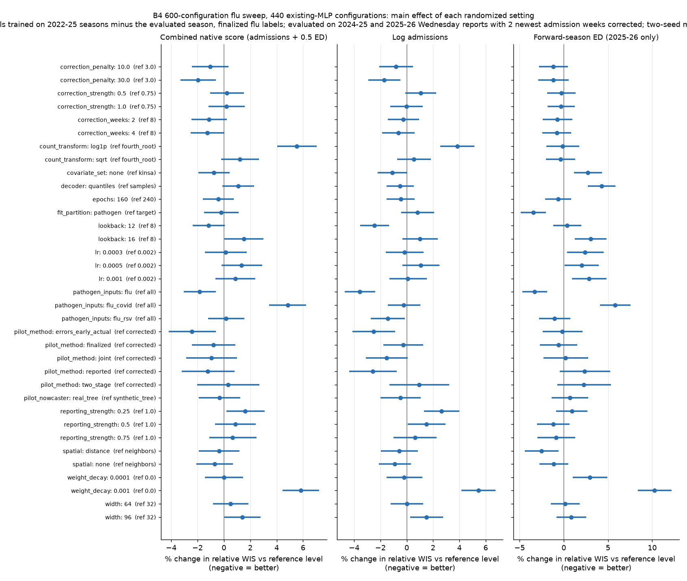
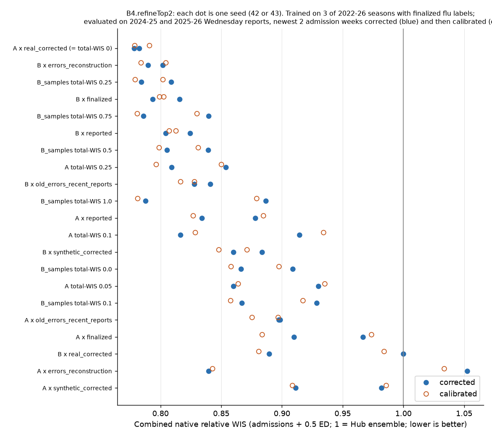

# B4.refineTop2 — follow-ups on the two B4 flu leaders

Requested 6 October 2026 after the [B.3/B.4 consolidated analysis](../b4-flu-study-20261006/index.md). Five items:

1. Which randomized settings of the 600-configuration sweep mattered (analysis only, no training).
2. Seed and recipe ensembles of already-saved forecasts (re-scoring only, no training).
3. Interval-width calibration fitted only on weeks held out inside the training seasons (new code; applied to every run of this experiment).
4. Each leading architecture retrained under each of the six training-history treatments.
5. Retraining the sampled leaders with several weights on the four-week admission-total loss.

Manager experiment `b4-refinetop2-20261006` (items 3–5, 21 configurations × seeds 42/43 = 42 runs). Ensemble output: `data/experiments/b4-refinetop2-ensembles` in the remote checkout.

## The two leaders (unchanged definitions)

Both are width-96 MLPs that jointly predict **flu hospital admissions and flu ED visit proportions** for the next four weeks, learn **finalized** future flu labels, and are fitted in two folds:

| Fold | Training seasons | Evaluated season |
|---|---|---|
| Forward | 2022–23, 2023–24, 2024–25 | 2025–26 |
| Retrospective | 2022–23, 2023–24, 2025–26 | 2024–25 |

Evaluation inputs are each Hub's Wednesday (holiday-adjusted) reports, with finalized values filling cells that were never archived. Unless stated otherwise the newest two weeks of flu admissions are corrected by the run's tree nowcaster ("corrected view"); flu ED stays as reported.

- **Recipe A** — flu histories plus Kinsa; one model per pathogen (admissions + ED together); no spatial exchange; sqrt admission transform; learning rate 0.002; 160 epochs. **Sampled output** (fair CRPS). Training histories: artificially degraded reports corrected by cross-fitted trees fitted on genuine archived report-to-mature pairs (`pilot_method=two_stage`, `pilot_nowcaster=real_tree`). Tree penalty 30.
- **Recipe B** — flu histories only; neighbor exchange; fourth-root transform; learning rate 0.0005; 240 epochs. **Direct 23-quantile output** (pinball/WIS). Training histories: artificial reporting errors, plus an auxiliary loss (weight 0.1) for reconstructing the 4 most recent finalized weeks (`pilot_method=joint`). Tree penalty 3; evaluation tree trained on synthetic pairs.

Scores: location-relative WIS divided by the frozen Hub ensemble's on identical tasks; states/DC 80%, US 20%; **lower is better, 1 = ensemble**. "Combined native" = admissions (weight 1) and ED (0.5) on the count/proportion scale, seasons weighted equally; frozen 2024–25 support has no flu ED, so that season is admissions-only.

## Item 1 — which sweep settings mattered

Data: the saved two-seed mean scores of the **440 existing-MLP configurations** of [b4-flu-600-20261005](../b4-flu-600-20261005/index.md) (the 160 shared-encoder configurations have a different design and are excluded), corrected view. Method: least squares on log score with every randomized setting as a categorical main effect, robust (HC0) 95% intervals. Effects are % change in relative WIS when a setting moves from its reference level (the most common level), **holding the other randomized settings fixed on average**. Interactions are ignored; the model explains about 46% of the variance (R² 0.46–0.50), so recipe-specific interactions (e.g. Kinsa helps A, hurts B) are not captured. Configurations were chosen by a random design, so main effects are not confounded with each other, but they were scored on the same two seasons used for all model selection.



Clear effects (interval excludes 0 on the combined native score):

| Setting | Effect on combined native score | Verdict |
|---|---|---|
| Weight decay 0.001 vs 0 | +5.8% (log admissions +5.4%, ED +10.3%) | Hurts; keep 0 (1e-4 neutral on admissions, +3% ED) |
| Admission transform log1p vs fourth root | +5.5% | Hurts; sqrt ≈ fourth root (+1.2%, n.s.) |
| COVID inputs (flu+COVID vs all) | +4.8%; flu-only −1.8% vs all | Flu-only inputs best |
| Old-season errors + recent archived reports vs synthetic-tree-corrected training | −2.4% (log −2.5%) | Best training treatment on average |
| Tree penalty 30 vs 3 | −2.0% | Stronger tree regularization better |
| Artificial error strength 0.25 vs 1.0 | +1.6% (log +2.7%) | Weaker augmentation hurts; strength 1.0 is the top of the tested range |
| Lookback 16 vs 8 | +1.5%; 12 vs 8 −1.2% (log −2.5%, significant) | 12 weeks best |
| Width 96 vs 32 | +1.4% | Bigger is not better on average, even though both leaders use 96 |

Not distinguishable from zero on the combined score: learning rate (but 0.002 is best for ED by 2–3%), epochs 160 vs 240, fit per pathogen vs per target (but per-pathogen −3.4% on ED), correction strength, correction weeks (2/4 slightly better than 8), Kinsa on/off on average, nowcaster type, spatial exchange (but distance −2.5% on ED), output head (but quantiles +4.3% worse on ED).

Implications: no evidence for widening the networks or raising the learning rate further; error strength above 1.0, tree penalty above 30, and weight decay between 0 and 1e-4 are untested edges worth extending. Tables: `axis-analysis/axis-effects.csv`, `axis-effects.txt`, `top20-native.csv`; script `scripts/analyze_b4_axes.py`.

## Item 2 — ensembles of saved forecasts (no retraining)

Members are completed runs from [b4-flu-heads-20261006](../b4-flu-heads-20261006/index.md) (A samples; B quantiles; B samples trained with 0.25 × four-week-total WIS, "Bsum") and from the 600 sweep (top 5 / top 10 configurations by corrected combined native score, two seeds each). Each ensemble combines the members' saved 23 quantiles view by view (raw, corrected, half), equal weight per member, by two rules: **Vincent** (average quantiles level by level) and **mixture** (equal mixture of the members' predictive distributions, quantile functions linearly interpolated, constant beyond 1%/99%). Admission quantiles are re-rounded. Scored by the common `rank_pilot`.

Groups: A two seeds; B two seeds; Bsum two seeds; A+B; A+B+Bsum; sweep top 5; sweep top 10. All members were selected using both evaluation seasons, so ensemble gains are development results. Script `scripts/ensemble_b4.py`.

Results (corrected view; ensembles have one score, single models are two-seed means from the heads experiment rerun of the same configurations; lower is better):

| Forecast | Combined native | Native admissions | Log admissions | Forward ED | 90% interval coverage, admissions | 95% coverage |
|---|---:|---:|---:|---:|---:|---:|
| Single Recipe A run (mean of seeds) | 0.7804 | 0.7731 | 0.8481 | 0.7873 | – | 0.855 |
| Single Recipe B run (mean of seeds) | 0.7959 | 0.7921 | 0.7955 | 0.8942 | – | 0.913 |
| A, two seeds averaged (Vincent) | 0.7601 | 0.7535 | 0.8189 | **0.7689** | 0.813 | 0.857 |
| B, two seeds averaged (Vincent) | 0.7855 | 0.7815 | 0.7777 | 0.8903 | 0.865 | 0.919 |
| A + B (four runs, mixture) | 0.7412 | 0.7341 | 0.7711 | 0.8117 | 0.873 | 0.915 |
| A + B (Vincent) | 0.7419 | 0.7356 | **0.7643** | 0.8122 | 0.855 | 0.903 |
| Sweep top 5 configurations (10 runs, Vincent) | **0.7384** | **0.7268** | 0.7690 | 0.8134 | 0.839 | 0.888 |
| Sweep top 10 (20 runs, mixture) | 0.7437 | 0.7390 | 0.7730 | 0.7940 | 0.844 | 0.893 |
| A + B + Bsum (mixture) | 0.7464 | 0.7393 | 0.7678 | 0.8289 | 0.868 | 0.912 |

Coverage weights states/DC 80% and US 20%, averaged over the two seasons. Full table (all views and rules): `ensembles/summary.csv`; raw outputs `ensembles/pilot-*.csv`, `distribution-scores.csv`, members `groups.json`.

Conclusions: **ensembling works and is the largest gain found so far.** Averaging A's two seeds alone improves the combined score 2.6% (0.7804 → 0.7601). Combining A and B improves it 5.0% (0.7412) and gives the best log-admissions score (0.764, vs 0.796 for B alone), because their strengths are complementary; it costs ED (0.812 vs A's 0.787). The top-5 sweep ensemble is marginally best on the combined score (0.738) but was chosen by ranking on the same seasons, so its edge over A+B is not meaningful. Mixture and Vincent rules are within 0.002 on the combined score; mixture gives wider intervals (A+B 90% coverage 87% vs 86%). Adding Bsum to A+B does not help. Ensembles also reduce undercoverage (A alone 85.5% at nominal 95%; A+B 90–92%), though still below nominal.

## Item 3 — calibration fitted inside the training seasons

New code: `src/tapestry/evaluation/calibration.py`, `pilot.calibrate`. For every run (each fold separately):

1. The early-stopping model of the inner fit is kept. It was trained without the labels of the inner validation weeks (3 consecutive weeks of every 16 in each training season).
2. Forecasts are issued with that model for every origin whose 1–4-week targets fall in those validation weeks, using the **evaluation pipeline**: FluSight-deadline Wednesday reports cut from the fold's training-season panel only, with the newest admission weeks corrected by a tree fitted without the validation weeks.
3. Origins in 2022–23 are skipped: no reports were archived that season (0% of newest flu-admission weeks archived, versus 56% in 2023–24, 69% in 2024–25, 89% in 2025–26), so those inputs would all be finalized values.
4. One spread factor per target (flu admissions, flu ED) and horizon is chosen on a log grid 0.5–4 to minimize native WIS, each location divided by its own uncalibrated WIS, states/DC 80% / US 20%. Quantiles are rescaled about the median, admissions clipped at 0 and rounded, ED clipped to [0, 1]. No center shift.
5. Factors are applied to the run's corrected-view evaluation forecasts and scored as a fourth view, `calibrated`.

Assumptions: the inner early-stopping model approximates the refitted model's spread (it saw fewer weeks and its epoch count was selected on the same validation weeks, which can make it look slightly better there than on new weeks); calibration is fitted on native WIS, so it may not help log WIS; four-week totals are not recalibrated.

## Items 4 and 5 — retraining design

Item 4 (12 configurations): Recipe A and Recipe B architectures, optimizer, head, covariates, exchange and tree penalty held fixed, crossed with the six training-history treatments of the sweep. Labels stay finalized.

| Treatment | What the training histories are |
|---|---|
| synthetic_corrected | Artificially degraded reports, corrected by cross-fitted trees trained on synthetic report/final pairs (`corrected`, synthetic tree) |
| real_corrected | Same, trees trained on genuine archived report-to-mature pairs (`two_stage`, real tree) — Recipe A's own |
| old_errors_recent_reports | Artificial errors in older seasons; actual archived reports with finalized fills in the latest training season (`errors`, `early_actual`) |
| reported | Actual archived reports, finalized values where none archived |
| errors_reconstruction | Artificial errors plus auxiliary reconstruction of 4 recent finalized weeks, weight 0.1 (`joint`) — Recipe B's own |
| finalized | Unchanged finalized histories |

Confound stated explicitly: for synthetic_corrected and real_corrected the scenario's tree type is forced, and the same tree also corrects evaluation inputs; other treatments keep each recipe's own evaluation tree (A real, B synthetic). Recipe A under the reconstruction treatment uses B's reconstruction settings (4 weeks, weight 0.1).

Item 5 (9 further configurations): four-week flu-admission-total WIS weight for sampled heads: Recipe A at 0, 0.05, 0.10, 0.25; Recipe B with sampled head at 0, 0.10, 0.25, 0.50, 0.75, 1.0 (1.0 is the code's maximum). The total-loss definition is unchanged from the heads experiment.

Design: `design.json` (rows carry recipe, treatment, weight and role), `scenarios.txt`. Planner: `scripts/plan_b4_refinetop2.py`.

## Execution

Remote checkout `/proj/jlessler/projects/tapestry-all/tapestry-b4-refinetop2-20261006` (data, frozen support and environment linked to the B3 pilot checkout; panel md5 `b5a04751…` identical to local). Validation experiment `b4-refinetop2-check-20261006` (all 21 configurations, seed 42, 2 epochs; excluded from results). Slurm: validation 4029583; main H100 array 4029584 (2 × 6 workers) and L40 array 4029585 (4 × 4 workers), both after successful validation; rank 4029586; ensembles 4029587 (failed: output folder not created; fixed and resubmitted as 4030035).

```bash
export PYTHONPATH=src
.venv/bin/python scripts/plan_b4_refinetop2.py --plan   # = planner plan -e b4-refinetop2-20261006 -s $(cat docs/experiments/b4-refinetop2-20261006/scenarios.txt) --seeds 42 43 --device cuda
LANES=6 GPUS=6 sbatch --job-name=b4-refinetop2-20261006 --array=0-1 --nodelist=g1803jles02 --cpus-per-task=8 --mem=180G --time=06:00:00 scripts/jlessler.sbatch b4-refinetop2-20261006
LANES=4 GPUS=6 sbatch --job-name=b4-refinetop2-l40 --array=0-3 --nodelist=g1803jles01 --cpus-per-task=4 --mem=100G --time=06:00:00 scripts/jlessler.sbatch b4-refinetop2-20261006
.venv/bin/python -m tapestry.experiment.planner status -e b4-refinetop2-20261006
.venv/bin/python -m tapestry.experiment.planner rank -e b4-refinetop2-20261006 --no-plots
.venv/bin/python scripts/ensemble_b4.py
```

## Results for items 3–5

All 42 runs completed (validation 21/21; main training 32 minutes on 2 H100 + 4 L40 GPUs, 28 concurrent runs). Ranking `ranking-57e6fe4803a0`. Every number is a two-seed mean (seeds 42, 43) of the combined native relative WIS unless labeled otherwise; lower is better, 1 = Hub ensemble. Each configuration was independently retrained; "corrected" and "calibrated" are two evaluation views of the same fitted model. The reruns of the original leaders reproduce the heads experiment (A 0.7803 vs 0.7804; B 0.7959 vs 0.7959) — with the same seeds, so this checks reproducibility, not robustness to new seeds.



### Item 4 — training-history treatments (corrected view)

| Training histories | Recipe A architecture | Recipe B architecture |
|---|---:|---:|
| synthetic_corrected | 0.947 | 0.872 |
| real_corrected | **0.780** (A's own) | 0.945 |
| old_errors_recent_reports | 0.898 | 0.834 |
| reported | 0.856 | 0.814 |
| errors_reconstruction | 0.946 | **0.796** (B's own) |
| finalized | 0.938 | 0.805 |

**Each architecture is best with the treatment it was selected with, and the pairing matters more than either part.** Recipe A is fragile: any other treatment costs 10–21%, and seeds diverge (A × errors_reconstruction: 0.839 vs 1.052). Recipe B is robust: four of six treatments land within 0.80–0.83, and B trained on plain **finalized** histories scores 0.805 — only 1% behind its own treatment — while scoring better on forward ED (0.868 vs 0.894). Real-tree-corrected histories are the best treatment for A but the worst for B (0.945). Because A was the best of 600 random draws and its edge appears only in this exact pairing, part of its lead may be selection luck on these two seasons; a confirmation on new seeds is needed before relying on it. The sweep-wide average favored old_errors_recent_reports (item 1), which is not the best for either leader.

Detailed: `analysis/labeled-summary.csv`, `analysis/summary.txt` (native/log admissions, ED, coverage for every row).

### Item 5 — four-week admission-total loss weight (corrected view)

| Weight | Recipe A (sampled) | Recipe B with sampled head |
|---:|---:|---:|
| 0 | **0.780** | 0.888 |
| 0.05 | 0.895 | – |
| 0.10 | 0.865 | 0.898 |
| 0.25 | 0.832 | **0.797** |
| 0.50 | – | 0.822 |
| 0.75 | – | 0.813 |
| 1.00 | – | 0.837 |

**Recipe A: any weight hurts** (by 7–15%), consistent with the heads experiment. **Recipe B sampled: 0.25 remains best** (0.797, matching direct-quantile B at 0.796); 0.1 gives no gain and 0.5–1.0 are worse than 0.25 but better than 0. The response is not smooth (0.1 ≈ 0; 0.75 better than 0.5), and seed-level scores differ by up to 0.1 (B sampled at 1.0: 0.887 vs 0.788), so only the contrast "0.25 ≫ 0" is reliable. Four-week-total raw WIS for B sampled is lowest at 0.25–0.5 (states/DC 2024–25: 195 → 171/168), confirming the loss improves the total distribution in the retrospective season; in 2025–26 the gain is smaller. For A, totals improve in 2025–26 but worsen in 2024–25 at every weight.

### Item 3 — training-season calibration (calibrated vs corrected view, same fitted models)

Fitted spread factors (median across runs): admissions 1.00 / 1.19 / 1.23 / 1.15 for horizons 1–4; ED 1.32 / 1.57 / 1.68 / 1.74. Calibration widens intervals, mostly for ED.

| Model | Combined native | Native admissions | Log admissions | Forward ED | 95% coverage, admissions |
|---|---|---|---|---|---|
| A (corrected → calibrated) | 0.780 → 0.785 | 0.773 → 0.770 | 0.848 → 0.877 | 0.787 → 0.837 | 85.5% → 88.4% |
| B (corrected → calibrated) | 0.796 → 0.794 | 0.792 → 0.792 | 0.796 → 0.803 | 0.894 → 0.880 | 91.3% → 93.2% |
| B sampled, total-WIS 0.25 | 0.797 → 0.790 | 0.789 → 0.783 | 0.801 → 0.804 | 0.898 → 0.886 | 87.6% → 89.9% |

Across all 21 configurations the calibrated view changes the combined score by a median of −0.8% (range −1.5% to +1.9%); for the leaders it stays within ±0.6%. **Calibration fixes coverage but not WIS:** coverage rises 2–4 points toward nominal, native admissions WIS barely changes, log-admissions WIS gets worse (wider lower tails hurt on the log scale), and A's ED gets worse because the ED spread factors fitted in the training seasons (≈1.6×) are too large for A's 2025–26 ED forecasts. Not recommended as a default in this form. Possible refinements (untested): fit on log WIS, one factor pooled across horizons, or shrink factors toward 1. Ensembling (item 2) improves coverage and WIS together, so it is the better route.

## Overall conclusions

1. **Ensemble A and B** (0.741 combined, 0.764 log; item 2) — the clearest gain, no retraining.
2. Keep each leader with its own training treatment; B is the more robust recipe (finalized-history B is almost as good), A depends on one exact combination.
3. Four-week-total loss: only B-sampled at 0.25; never on A.
4. Calibration in this form: no.
5. Next: confirm A, B, B-finalized and the A+B ensemble on five new seeds (44–48), since A's lead may partly be selection luck.

Pulled tables: `analysis/` (rank_pilot outputs, `runs.csv`, `calibration-factors.csv`, `labeled-summary.csv`). Scripts: `scripts/summarize_b4_refinetop2.py`, `scripts/summarize_b4_ensembles.py`.

## Combined confirmation, exploration and production plan for 2026–27

Status: planning only. The user clarified that implementation and launch should wait. The five-hour budget below means wall-clock fitting across available patron GPUs, not five total GPU-hours. It is an additional exploration budget, separate from the confirmation and operational checks. Engineering, short execution checks and analysis are outside the fitting budget. Five hours is a cap; no exact configuration throughput is guaranteed. Final refinement and all-season fitting follow review of the exploration, rather than launching automatically.

### Objective and assumptions

The immediate objective is weekly FluSight hospitalizations in 2026–27. Choose models primarily on native admissions WIS, reporting log admissions WIS, coverage, horizons, geography and rising/peak/declining weeks separately. Lower WIS is better; a relative WIS of 1 is the frozen Hub ensemble on identical tasks. The admissions-plus-ED composite remains a secondary diagnostic, not the selection objective. Verify current Hub target/horizon/submission rules before production. All historical future prediction labels remain finalized flu admissions and ED. Operational fitting must use only sufficiently mature labels available at the fitting cutoff.

A means the sampled-output width-96 MLP with Kinsa, sqrt admission transform and no spatial exchange, trained on artificial reports corrected by cross-fitted trees learned from genuine archived report-to-mature pairs. B means the direct-quantile width-96 MLP with neighbor exchange and fourth-root admission transform, trained with artificial reporting errors and reconstruction of four recent finalized weeks. Both jointly learn future flu admissions and ED. Except in explicitly stated input-replay comparisons, evaluation uses archived reports with finalized fills where unavailable, the recipe's tree correction of its newest two admission weeks, and reported ED. These finalized fills remain a limitation of historical-vintage evaluation.

The production candidate remains A+B, each retrained on pooled 2022–23 through 2025–26, five seeds per recipe, equal total weight per recipe. This is a candidate, not a demonstrated optimum. More seasons can help or hurt. An ensemble mitigates member-specific error but does not guarantee protection from a badly failing A. New seeds cannot remove selection bias from repeatedly using the same evaluation seasons. No defensible numerical range for prospective 2026–27 WIS is established yet.

### 1. Stress ensembles using saved forecasts

Combine original B with A retrained on unchanged finalized training histories, keeping finalized future prediction labels and each recipe's original evaluation correction. Compare B alone, 25% A/75% B and equal A+B. The weaker A is a proxy for member degradation, not a simulation of an actual Kinsa outage. Test adding B retrained on finalized histories as a third member, with seed forecasts averaged within each recipe/treatment before assigning recipe weights. Compare quantile averaging and predictive-distribution mixtures. B trained on finalized histories still uses its synthetic-pair correction at evaluation; use its saved uncorrected-input forecasts to assess a correction-free evaluation fallback separately.

Existing seed-42/43 quantile-averaged native admissions relative WIS supports diversification:

| Training seasons → evaluated season | A, two seeds | B, two seeds | Equal A+B |
|---|---:|---:|---:|
| 2022–23, 2023–24, 2025–26 → 2024–25 | 0.7781 | 0.6971 | 0.6968 |
| 2022–23, 2023–24, 2024–25 → 2025–26 | 0.7288 | 0.8659 | 0.7744 |

Training treatments, finalized future labels and corrected archived/fill evaluation inputs are defined above. Source: `ensembles/pilot-seed-scores.csv`, corrected `flu_admissions_native`. Both evaluation seasons informed selection; the first row is retrospective development using a later training season. Report each season rather than hiding the reversal in a pooled mean.

### 2. Confirm recipes and training-season choices

Retrain A, B and B with unchanged finalized training histories on seeds 44–48 in the existing folds: train on 2022–23/2023–24/2024–25 and evaluate 2025–26; train on 2022–23/2023–24/2025–26 and evaluate 2024–25. Preserve each recipe's future finalized labels and evaluation correction. This is 15 research runs containing 30 outer seasonal fits, plus internal epoch selection/refitting. Use all seeds, not only the best. Compare ensemble size and A's incremental benefit across seed subsets, seasons, horizons and epidemic phases.

For the same three recipes and five seeds, add two chronological training policies: all earlier seasons, or the latest two earlier seasons. For 2024–25 both policies use 2022–23/2023–24 and are the same fit, so reuse it. For 2025–26, all-earlier training uses 2022–23/2023–24/2024–25 and is already present in confirmation; latest-two training uses 2023–24/2024–25. Thus only 30 additional distinct outer seasonal fits are scientifically needed. Correction fitting, error estimation and preprocessing must obey each training cutoff. These comparisons improve chronology and test history length, but the seasons are still development data.

### 3. Five-hour exploration before refinement

Highest-priority hypothesis: the treatment of reporting revisions is underexplored relative to network size. In the current code A's nowcaster learns from real revisions, but its forecaster sees corrected synthetic training reports. Corrected training histories are generated once per cross-fit partition. The default reporting-error bank draws a local donor separately for each location, and real correction supervision uses the latest permitted training season. These choices motivate matched alternatives, not a claim that those alternatives will improve forecasts.

Aim for roughly 72 configurations × three seeds (44–46), sized after a short runtime check and capped at five wall-clock hours across available GPUs. The allocation below is a planning envelope, not an executable scenario list. Include exact A/B reference configurations and one-factor comparisons before a small predeclared set of interactions. Avoid taking the full Cartesian product. Main exploration uses the existing two folds and finalized future flu labels, with no evaluation truth used in any transformation. Carry promising methods into strictly chronological confirmation before selecting a production member.

| Direction | Approximate configurations | What changes and why |
|---|---:|---|
| Realistic vintage training | 24 | Compare synthetic histories, archived/final-fill histories, and 50/50 mixtures, with cross-fitted corrections where applicable. Use multiple reporting realizations per finalized trajectory, compare latest-season versus pooled permitted-season real correction pairs, and compare local versus state-synchronous revision draws. Test whether matching the real input process reduces A's treatment dependence. |
| Propagate nowcast uncertainty | 16 | Replace the single corrected recent history with a small bank of plausible histories using cross-fitted correction residuals, preserving dependence across recent weeks and relevant locations. Train and forecast using the same history-uncertainty treatment; combine conditional predictive distributions at evaluation. Compare no uncertainty and reduced/full residual scales. Test whether revision uncertainty is a missing source of admission undercoverage. |
| Damped-growth residual forecast | 12 | On A/B backbones, predict residuals around a conservative extrapolation of recent transformed admissions instead of only the latest level. Compare two damping strengths and a few history lengths. Use observed/corrected inputs only, bound the slope, and disable extrapolation when required recent inputs are missing. This is a new formulation for the existing MLPs, distinct from the previously tested shared-series growth anchor. |
| Native plus log weekly admission loss | 12 | Add modest log1p-admissions CRPS/WIS weight to the existing native objective, with training-only normalization and unchanged finalized labels. Keep ED supervision. Test whether one model can retain high-count accuracy while improving relative errors at small counts. This is distinct from the already-tested four-week-total loss. |
| Robustness and limited interactions | 8 | Kinsa feed dropout during fitting, occasional uncorrected histories during A's fitting, and a few predeclared combinations of vintage treatment with growth or loss changes. Keep labels unchanged. Seek a useful ensemble member, not only the best individual score. |

Safeguards with scientific consequences: real correction pairs must exclude final-value fallback cells; mature references must be published before the permitted training cutoff; correction residuals must be obtained out of fold with overlapping context dates purged; neither holdout nor inner-validation labels may enter correction/error fitting; extra input realizations must not multiply a season's scientific weight. Archived/fill mixtures must explicitly report genuine-vintage coverage. When archives are absent, distinguish synthetic fallback from finalized fallback instead of silently calling either one observed vintage data.

Uncertainty propagation is not ordinary interval widening: uncertainty in the recent epidemic history can shift both the forecast center and spread. It can also double-count uncertainty already learned by a forecaster, so retain a zero-uncertainty reference and compare downstream WIS as well as coverage. Mixture quantiles must be computed from the combined distributions, not by averaging component quantiles. Seed averaging and uncertainty over recent histories are separate operations.

The fitting cap stops new exploration work; retain and identify incomplete configurations without ranking them as fully replicated. If the budget cannot cover the envelope, prioritize vintage training, nowcast uncertainty, then growth/loss alternatives. Do not spend unused time on an unplanned broad sweep or launch refinement automatically.

### 4. Review, refine, then select the production model

For each completed configuration, report native/log admission WIS, coverage and interval width, season/horizon/state-US breakdowns and epidemic phases. Evaluate whether adding its forecasts improves the fixed A+B reference. A weaker standalone model may still be valuable if it makes different errors. Report new-seed uncertainty as optimization variability, not independent-season evidence. Do not tune many ensemble weights on two seasons or select by a tiny pooled score difference.

After reviewing the five-hour exploration, choose only the few directions with consistent gains or clear complementary errors for a separate focused refinement. Confirm selected candidates under the chronological training policies. Replay the same fitted models with reduced/no admission correction, delayed admissions and supported missing-Kinsa inputs. These change evaluation inputs without retraining; a separately trained no-Kinsa model is not an outage simulation. Retain equal A+B if A adds repeatable admissions benefit and the ensemble tolerates plausible disturbances; otherwise reduce its weight or use B alone. Add B trained on finalized histories only for measured ensemble benefit.

### 5. All-season fitting and prospective forecasts

Once selection is settled, implement/verify an explicit cutoff-based production fitting mode without an outer held-out season. Choose epochs with internal training validation and refit each retained recipe on all permitted mature labels, normally pooled 2022–23 through 2025–26 unless chronological evidence supports a shorter history. Refit correction models and input scales using permitted data; preserve cross-fitting for training corrections. Five seeds per retained recipe is the initial production budget. Use equal total recipe weights by default, with a smaller A weight only if the preceding checks justify it. Quantile averaging is the initial reference; compare distribution mixing for its uncertainty benefits.

Do not automatically apply the current spread calibration or add cumulative-total loss to A. If ensemble calibration is later justified, fit it using held-out training forecasts. Verify current feeds, units and submission format, archive actual deadline snapshots and issue prospective 2026–27 forecasts. These forecasts supply the genuinely new-season evidence. Keep weekly inference distinct from any later retraining; do not treat immature current-season labels as final truth.

### Planning correction log

On October 6 the assistant initially interpreted the request as authorization to execute, prepared an isolated remote directory and submitted confirmation array 4045326. The user then clarified plan-only intent. Slurm confirmed cancellation before the array started (elapsed 00:00:00; user queue empty). The assistant reverted this turn's local implementation changes and removed generated execution scripts/configuration files. The remote draft directory and manager plan may remain; they are not an active experiment or completed result. No exploration, chronological comparison, refinement or production fit was submitted. Exact manager plan/launch/status/rank commands will accompany any subsequently authorized execution.
