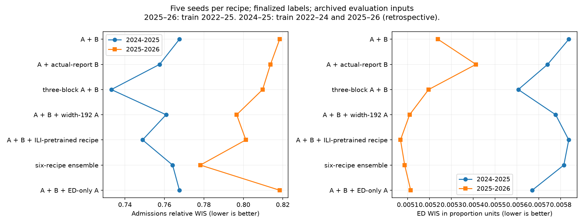

# Complete original campaign: 44 recipes, five seeds each

All 220 two-fold runs completed. Every comparison here uses seeds 44–48, equal recipe weights and averaged quantiles. Lower WIS is better. Admissions relative WIS uses 80% mean state/DC score and 20% US, then equal seasons. ED raw WIS below uses the same geography weights in proportion units and the admissions evaluation date window. The frozen Hub ED baseline is available only for 2025–26; do not treat the combined headline score as equally measuring ED in both seasons.

For evaluation on 2025–26, models train on 2022–23, 2023–24 and 2024–25. For evaluation on 2024–25, they train on 2022–23, 2023–24 and 2025–26: this is retrospective. All learn finalized future labels. Evaluation uses archived reports with finalized fallback where reports are absent. Original A trains on artificially perturbed admissions histories followed by cross-fitted real-report correction; original B trains on perturbed histories with reconstruction labels. A uses real-report trees and B synthetic trees to correct the latest two admission weeks at evaluation. ED remains as reported in this original campaign. The new extension tests ED correction separately.

A is the width-96 sampled model with Kinsa and learning rate 0.002. B is the width-96 neighbor quantile model with learning rate 0.0005. Actual-report B is retrained using archived training reports (finalized fallback) instead of synthetic report errors, retaining finalized prediction labels. Three-block A changes decoder depth. Width-192 A also halves A's learning rate to 0.001. The ILI-pretrained B5 recipe is a width-96 sampled two-stage model with 1,200 flu-scaled ILI pretraining steps, multiscale features, Kinsa, 10-week history and one-week correction with strength 0.75; it is not the original B head. ED-only A learns only finalized flu ED labels from ED history plus Kinsa; it contributes no admissions forecasts.

The six-recipe ensemble contains A, B, width-192 A at half learning rate, width-256 A at half learning rate, the sampled neighbor B5 recipe with 25% actual training reports, and three-block B. Its new members were also trained on the same three-season folds and finalized labels. These are development comparisons, not an untouched test set.

| Ensemble | Admissions relative WIS | Log-admissions relative WIS | ED WIS 2024–25 | ED WIS 2025–26 |
| --- | --- | --- | --- | --- |
| A + B | 0.793018 | 0.802390 | 0.005837 | 0.005238 |
| A + actual-report B | 0.785649 | 0.816992 | 0.005740 | 0.005412 |
| three-block A + B | 0.771426 | 0.789983 | 0.005606 | 0.005196 |
| A + B + width-192 A | 0.778726 | 0.801810 | 0.005777 | 0.005109 |
| A + B + ILI-pretrained recipe | 0.775091 | 0.799545 | 0.005837 | 0.005067 |
| six-recipe ensemble | 0.771171 | 0.796198 | 0.005814 | 0.005086 |
| A + B + ED-only A | 0.793018 | 0.802390 | 0.005670 | 0.005114 |

Actual-report B improves native admissions but worsens log admissions and recent-season ED, so it is not promoted to System 1 at this point. Three-block A and the ILI-pretrained recipe merit joint contribution checks. The original six-recipe broad ensemble improves native and log admissions plus recent-season ED; older-season ED changes little.

The reference differs from earlier interim tables because all A and B fits now come from the completed B6 run, rather than partly reused B4 saved fits. Compare within this table; do not combine scores across reference inventories. Shared nominal seeds do not guarantee identical retraining outcomes across numerical/runtime settings. Exact original recipes and paths are recorded in the scoring groups.json on Longleaf.

Coverage is in coverage-by-season.csv and uses all stored complete four-week windows; that support differs from the Hub scoring date window. Graphs were generated without visual inspection. Horizon-specific analysis and new eight-recipe quantile-mixture comparison remain pending.

