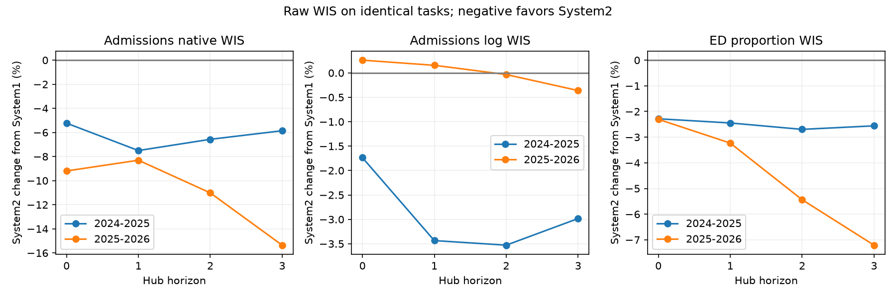

# Selected systems by forecast horizon

System1 is original A+B with averaged quantiles. System2 is the selected nine-recipe marginal mixture defined in ../b6-system2-nine-1605/index.md. These saved development forecasts use five seeds44–48 per recipe, not the new ten-seed production fits. All models learn finalized labels. Evaluation on2025–26 trains on2022–23,2023–24,2024–25; evaluation on2024–25 trains on2022–23,2023–24,2025–26 and is retrospective. Inputs are archived reports with finalized fallback and each recipe's trained correction treatment.

The shared raw-WIS scorer is applied separately at horizons0–3, on identical tasks and finalized truth verified by support hashes. The date window is the standard raw-WIS admissions reference-date window, including ED. Geography weights are80% mean state/DC and20%US. This is raw WIS, not the location-relative-to-Hub ratio in headline selection tables, so its percentage differences need not match those tables. ED stays in proportions; log admissions uses log1p. Lower WIS is better.

System2 improves native admissions and ED at every horizon in both evaluation seasons. On2025–26, native admissions improves9.2%,8.3%,11.0%,15.4% across horizons0–3; ED improves2.3%,3.2%,5.4%,7.2%. Recent log admissions is nearly tied:0.26% and0.16% worse at horizons0–1,0.03% and0.36% better at2–3. On retrospective2024–25, all three measures improve at all horizons. These diagnostics support the selected ensemble while retaining the development/reverse-fold limitations.

weighted.csv and comparison.csv contain exact values; raw.csv retains geography scores, task counts and support hashes. Graph generated without visual inspection.

