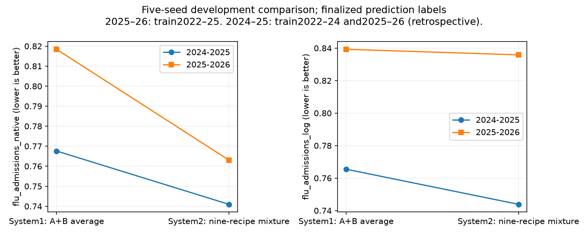

# Selected System2: nine-recipe marginal mixture

System1 remains original A+B with averaged quantiles. System2 is the jointly evaluated equal-recipe ensemble of: three-block A; B with synthetic ED augmentation and evaluation ED correction; A width192/lr0.001; A width256/lr0.001; sampled neighbor B5 with25% actual reports; three-block B; the ILI-pretrained B5 recipe; A96 with ED augmentation and no ED correction; and B width256/lr0.00025 with FluSurv. Each recipe uses five seeds44–48 for this development comparison. Production retrains each on all four completed seasons with ten seeds42–51.

All evaluation models learn finalized future labels. Evaluation on2025–26 trains on2022–23,2023–24,2024–25. Evaluation on2024–25 trains on2022–23,2023–24,2025–26 and is retrospective. Training histories use each recipe's synthetic errors or actual-report mixture. Evaluation inputs are archived reports with finalized fallback and the recipe's fitted correction. The revised B adds ED reporting errors during training but corrects ED only during evaluation; its joint reconstruction training inputs remain uncorrected. The augmented A recipe adds ED training errors but does not correct ED. Other members use their original input treatments, as detailed in the core and complete-extension reports. Every correction tree learns only allowed training-season report-to-mature pairs.

System2 uses equal recipe and equal within-recipe seed weights. Its marginal distribution mixture reconstructs inverse CDFs from23 saved quantiles with constant endpoint tails; it is not a joint trajectory mixture. Versus System1's quantile average, admissions relative WIS improves0.793018→0.752032, log admissions0.802390→0.789864, and recent-season ED0.837567→0.794652. Lower is better. Geographic weights are80% mean states/DC and20%US, then equal seasons for admissions. ED relative WIS is supported only in2025–26. The same System2 recipes with quantile averaging score0.755284 native,0.786454 log,0.798157 ED: mixing is chosen for native/ED/coverage gains while accepting a small log-score cost.

The nine-member ensemble was assembled and evaluated directly after removing original A,B and correctedA256 from the twelve-member group. The leave-one-out table shows tradeoffs: three-block B and B256+FluSurv improve log admissions while costing some native accuracy; ILI pretraining contributes across headline scores. No additional untested joint removals are assumed beneficial. This is a pragmatic multi-metric selection on repeatedly used development seasons, not proof of optimality or untouched-test accuracy.

The reference rows in this directory mean three-block A plus revised B, NOT System1. Original System1 scores come from b6-core-complete-1400. season-scores.csv and coverage-by-season.csv preserve breakdowns; coverage uses all stored complete four-week windows, which differs from the Hub WIS date range. A graph is supplied without visual inspection. Horizon-specific checks remain pending.

Ten production seeds are a variance-reduction choice; the saved selected five-versus-seven comparison did not isolate seed count. Both submissions remain unpublished. Final model names are pending user input.

<!-- model-choices:start -->
## Model choices

What this report's models were trained on, how errors and corrections were made, what they learned to predict, which seasons they were trained and evaluated on, and what they were scored on, for every configuration (generated 9 October 2026 from the saved scenario strings).

### System2 recipes (the eight kept after removing the FluSurv recipe)

Each heading links to its explanation in [Model choices A–F](../../reference/model-choices.md). One row per group of configurations with identical choices.

| Configurations | [Training histories (A)](../../reference/model-choices.md#a-training-histories) | [Error source (B)](../../reference/model-choices.md#b-error-source) | [Error signals (C)](../../reference/model-choices.md#c-error-signals) | [Correction model (D)](../../reference/model-choices.md#d-correction-model) | [Evaluation inputs (E)](../../reference/model-choices.md#e-evaluation-inputs) | [Forecast view (F)](../../reference/model-choices.md#f-input-view) | [Prediction labels](../../reference/model-choices.md#labels-and-folds) | [Evaluated season ← training seasons](../../reference/model-choices.md#labels-and-folds) |
|---|---|---|---|---|---|---|---|---|
| A_blocks3, A_width192_half_lr, A_width256_half_lr | final values with artificial reporting errors; corrected by the cross-fitted correction model | each fold's latest training season | admissions | tree on real examples; newest 2 week(s) of admissions | real archived Wednesday reports | raw, half, corrected (and calibrated with early stopping) scored; forecast_view was not yet a recipe field (added 9 October 2026): see this page for the view each comparison used | latest panel values, next 4 weeks | 2024-25 ← 2022-23, 2023-24, 2025-26; 2025-26 ← 2022-23, 2023-24, 2024-25 |
| B5_confirmed_candidate_1 | final values with artificial reporting errors; corrected by the cross-fitted correction model | each fold's latest training season | admissions | tree on real examples; newest 1 week(s) of admissions | real archived Wednesday reports | raw, half, corrected (and calibrated with early stopping) scored; forecast_view was not yet a recipe field (added 9 October 2026): see this page for the view each comparison used | latest panel values, next 4 weeks | 2024-25 ← 2022-23, 2023-24, 2025-26; 2025-26 ← 2022-23, 2023-24, 2024-25 |
| B5_confirmed_candidate_2, B_blocks3 | final values with artificial reporting errors; plus reconstruction labels | each fold's latest training season | admissions | tree on synthetic examples; newest 2 week(s) of admissions | real archived Wednesday reports | raw, half, corrected (and calibrated with early stopping) scored; forecast_view was not yet a recipe field (added 9 October 2026): see this page for the view each comparison used | latest panel values, next 4 weeks + last 4 context weeks | 2024-25 ← 2022-23, 2023-24, 2025-26; 2025-26 ← 2022-23, 2023-24, 2024-25 |
| X_A_ED_errors_only | final values with artificial reporting errors; corrected by the cross-fitted correction model | each fold's latest training season | admissions and ED | tree on real examples; newest 2 week(s) of admissions | real archived Wednesday reports | raw, half, corrected (and calibrated with early stopping) scored; forecast_view was not yet a recipe field (added 9 October 2026): see this page for the view each comparison used | latest panel values, next 4 weeks | 2024-25 ← 2022-23, 2023-24, 2025-26; 2025-26 ← 2022-23, 2023-24, 2024-25 |
| X_B_ED_corrected | final values with artificial reporting errors; plus reconstruction labels | each fold's latest training season | admissions and ED | tree on real examples; newest 2 week(s) of admissions and ED | real archived Wednesday reports | raw, half, corrected (and calibrated with early stopping) scored; forecast_view was not yet a recipe field (added 9 October 2026): see this page for the view each comparison used | latest panel values, next 4 weeks + last 4 context weeks | 2024-25 ← 2022-23, 2023-24, 2025-26; 2025-26 ← 2022-23, 2023-24, 2024-25 |
<!-- model-choices:end -->
