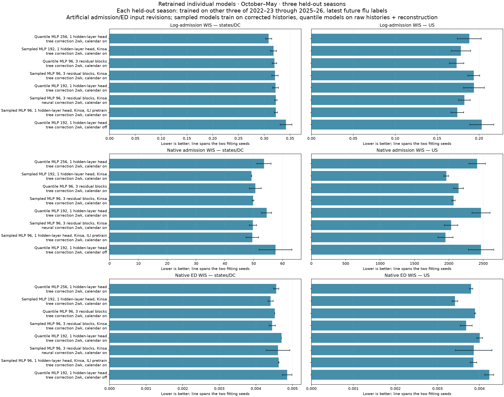
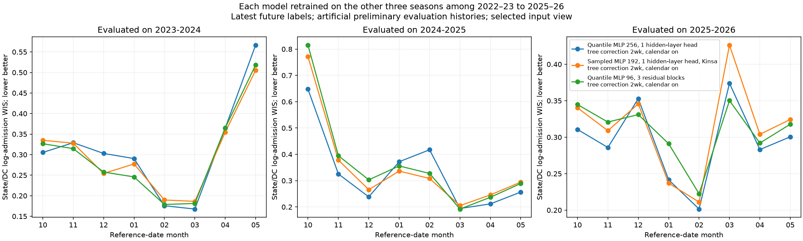

# Focused retraining and revised scoring — 7 October 2026

Completed both seeds and all three held-out seasons for **8 of 10 planned configurations**. Only these fully matched configurations enter this comparison. Any single-seed results are retained in `incomplete-seed-comparisons.csv` and do not compete in this ranking. Best state/DC log-admission mean: **B_width256**, evaluated with **nowcaster-corrected inputs**, WIS **0.3086** (lower is better).

Every model is retrained, with two seeds (44, 45). Evaluation on 2023–24 trains on 2022–23, 2024–25 and 2025–26; evaluation on 2024–25 trains on 2022–23, 2023–24 and 2025–26; evaluation on 2025–26 trains on 2022–23, 2023–24 and 2024–25. Seasons are treated exchangeably. The forecasters learn the existing September 2026 latest future admission and ED labels. Joint models also learn recent-history reconstruction. See `model-contracts.csv` for each model and its exact input treatment.

Training admission and ED histories receive artificial revisions from the prescribed 2025–26 reporting process. Sampled-path forecasters learn on cross-fitted nowcaster-corrected artificial histories; direct-quantile forecasters learn on artificial preliminary histories. The ILI-pretrained sampled model also uses two corrected realizations and 10% raw artificial inputs during training. Kinsa is unchanged and FluSurv is omitted. ILI pretraining, where present, uses pre-August-2022 state ILI rescaled into the two flu channels.

Evaluation uses three independently sampled artificial histories for every held-out issuance, shared across model seeds and configurations. Future labels and availability masks are unchanged. Scores average the three draws, then the three seasons equally, then the two fitting seeds. States/DC are pooled equally per available forecast task; US is separate. The October–May window uses reference dates, horizons 0–3. ED stays in proportions. Lower WIS is better.

Training and epoch selection use native predictive loss divided by fitting-data Q95 plus 0.5 times log(1+admissions) predictive loss. ED retains native loss. Training geography weights remain 80% states/DC and 20% US; headline scoring has no such mixture. The sampled models optimize fair CRPS; the direct-quantile models optimize quantile loss. Both are scored with the same 23-quantile WIS.

Raw, corrected and half are three input replays of the same fitted individual model. Raw means artificial preliminary histories. Corrected means the fitted nowcaster corrects the recent histories. Half is a 50/50 predictive distribution mixture of those two views, not a half-strength input correction. Each model's displayed view is chosen by its mean state/DC log-admission WIS and is held fixed for all other displayed metrics. This selection uses the evaluation results; seed ranges are descriptive, not confidence intervals. These are comparisons of complete configurations: model families also differ in covariates and training treatment, so their differences do not isolate a decoder or Kinsa effect.

Assumptions: sources are available at prescribed T-X times, Kinsa does not revise, the 2025–26 empirical reporting process is prescribed, and epidemic seasons are exchangeable. The closest seasonal donor release is excluded in every recipient season. Adjacent donor releases may share reference weeks; only reporting residuals are transported, never donor epidemic trajectories or future labels. This replaces the unequal six-month exclusion used in the stopped audit. Latest 2024 labels remain unchanged; no reporting-coverage mask or interval recalibration was introduced.

Hub pairwise scores use the frozen Hub task support and frozen truth, which differ from the complete October–May latest-label headline evaluation. They are external benchmark comparisons, not scores on identical artificial input histories. All model views, all seeds, all three reporting draws, individual locations, horizons, months and interval coverage remain in the CSV files.

Runtime: the first allocations had a 28-minute limit and timed out with nine runs complete. The user then authorized a 20-minute continuation on two H100 GPUs. Saved fold models and complete forecasts were reused; training restarted only for folds without a saved model, with the original seed and settings.

Budget decision: sampled-model calendar removal and four-week correction were stopped based on runtime, before inspecting comparative accuracy, to prioritize the six base configurations, B calendar removal and A neural correction. These stopped comparisons cannot support an accuracy conclusion.

| Model | Evaluation view | State/DC log admissions | State/DC native admissions | State/DC ED | US log admissions |
|---|---|---:|---:|---:|---:|
| B_width256 | corrected | 0.3086 | 53.60 | 0.004555 | 0.1884 |
| A_width192_half_lr | corrected | 0.3180 | 49.26 | 0.004403 | 0.1785 |
| B_blocks3 | corrected | 0.3199 | 50.56 | 0.004515 | 0.1733 |
| A_blocks3 | corrected | 0.3210 | 49.76 | 0.004447 | 0.1938 |
| B_width192_half_lr | corrected | 0.3219 | 54.49 | 0.004700 | 0.1940 |
| A_blocks3_nowcast_MLP | corrected | 0.3226 | 49.73 | 0.004605 | 0.1827 |
| B5_confirmed_candidate_1 | corrected | 0.3226 | 49.52 | 0.004623 | 0.1741 |
| B_width192_half_lr_calendar_off | corrected | 0.3423 | 57.58 | 0.004856 | 0.2033 |

- **B_width256**: 256-wide MLP, one-hidden-layer decoder head, direct ordered quantiles; neighbor sharing; no auxiliary covariates; calendar on; 2-week admission/ED synthetic_tree. Training inputs: artificial preliminary admission/ED histories. Labels: latest future flu admissions and ED; recent-history reconstruction. Evaluation: nowcaster-corrected inputs.
- **A_width192_half_lr**: 192-wide MLP, one-hidden-layer decoder head, sampled future paths; no neighbor sharing; Kinsa; calendar on; 2-week admission/ED synthetic_tree. Training inputs: cross-fitted corrected artificial admission/ED histories. Labels: latest future flu admissions and ED. Evaluation: nowcaster-corrected inputs.
- **B_blocks3**: 96-wide MLP, 3 residual decoder blocks, direct ordered quantiles; neighbor sharing; no auxiliary covariates; calendar on; 2-week admission/ED synthetic_tree. Training inputs: artificial preliminary admission/ED histories. Labels: latest future flu admissions and ED; recent-history reconstruction. Evaluation: nowcaster-corrected inputs.
- **A_blocks3**: 96-wide MLP, 3 residual decoder blocks, sampled future paths; no neighbor sharing; Kinsa; calendar on; 2-week admission/ED synthetic_tree. Training inputs: cross-fitted corrected artificial admission/ED histories. Labels: latest future flu admissions and ED. Evaluation: nowcaster-corrected inputs.
- **B_width192_half_lr**: 192-wide MLP, one-hidden-layer decoder head, direct ordered quantiles; neighbor sharing; no auxiliary covariates; calendar on; 2-week admission/ED synthetic_tree. Training inputs: artificial preliminary admission/ED histories. Labels: latest future flu admissions and ED; recent-history reconstruction. Evaluation: nowcaster-corrected inputs.
- **A_blocks3_nowcast_MLP**: 96-wide MLP, 3 residual decoder blocks, sampled future paths; no neighbor sharing; Kinsa; calendar on; 2-week admission/ED synthetic_mlp. Training inputs: cross-fitted corrected artificial admission/ED histories. Labels: latest future flu admissions and ED. Evaluation: nowcaster-corrected inputs.
- **B5_confirmed_candidate_1**: 96-wide MLP, one-hidden-layer decoder head, sampled future paths; no neighbor sharing; Kinsa; calendar on; 2-week admission/ED synthetic_tree; pre-August-2022 state ILI pretraining, ten-week histories and multiscale features; 2 corrected training realizations per history; 10% raw artificial training inputs. Training inputs: cross-fitted corrected artificial admission/ED histories. Labels: latest future flu admissions and ED. Evaluation: nowcaster-corrected inputs.
- **B_width192_half_lr_calendar_off**: 192-wide MLP, one-hidden-layer decoder head, direct ordered quantiles; neighbor sharing; no auxiliary covariates; forecaster calendar off; 2-week admission/ED synthetic_tree. Training inputs: artificial preliminary admission/ED histories. Labels: latest future flu admissions and ED; recent-history reconstruction. Evaluation: nowcaster-corrected inputs.

The direct nowcast error table is [nowcast-accuracy.csv](nowcast-accuracy.csv): absolute admission-count errors and ED-proportion errors against latest histories, using evaluation reporting draw zero and equal averaging over fitted seeds and held-out seasons. Age zero is the newest input week. These diagnostics use all available held-out episodes, not the headline October–May window. Episode support can differ between model families, so compare raw versus corrected errors within a model; do not interpret absolute differences between families as a controlled nowcaster comparison.

Model definitions are in [model-contracts.csv](model-contracts.csv); all settings and assumptions in [design.json](design.json). Full tables: [all input views](headline-rankings.csv), season and reporting draws (`headline-season-scores.csv`), monthly, horizon and location WIS/coverage (`score-details.csv`), [Hub pairwise scores](hub-pairwise-scores.csv). The two tables shown without links (77 MB) are not kept in the docs; regenerate them with `planner rank -e b7-folds-20261007` on Longleaf.

Audit conclusions and remaining limitations: [review.md](review.md). Numerical verification: [score-validation.json](score-validation.json). Exact plan, launch, status and rank commands: [commands.sh](commands.sh).

<!-- model-choices:start -->
## Model choices

What this report's models were trained on, how errors and corrections were made, what they learned to predict, which seasons they were trained and evaluated on, and what they were scored on, for every configuration (generated 9 October 2026 from the saved scenario strings).

Each heading links to its explanation in [Model choices A–F](../../reference/model-choices.md). One column per group of configurations with identical choices.

| Choice | A_blocks3, A_width192_half_lr, B5_confirmed_candidate_1, A_blocks3_calendar_off | B_width192_half_lr, B_width256, B_blocks3, B_width192_half_lr_calendar_off | A_blocks3_correct_4_weeks | A_blocks3_nowcast_MLP |
|---|---|---|---|---|
| [Training histories (A)](../../reference/model-choices.md#a-training-histories) | final values with artificial reporting errors; corrected by the cross-fitted correction model | final values with artificial reporting errors; plus reconstruction labels | final values with artificial reporting errors; corrected by the cross-fitted correction model | final values with artificial reporting errors; corrected by the cross-fitted correction model |
| [Error source (B)](../../reference/model-choices.md#b-error-source) | prescribed 2025-26 process | prescribed 2025-26 process | prescribed 2025-26 process | prescribed 2025-26 process |
| [Error signals (C)](../../reference/model-choices.md#c-error-signals) | admissions and ED | admissions and ED | admissions and ED | admissions and ED |
| [Correction model (D)](../../reference/model-choices.md#d-correction-model) | tree on synthetic examples; newest 2 week(s) of admissions and ED | tree on synthetic examples; newest 2 week(s) of admissions and ED | tree on synthetic examples; newest 4 week(s) of admissions and ED | mlp on synthetic examples; newest 2 week(s) of admissions and ED |
| [Evaluation inputs (E)](../../reference/model-choices.md#e-evaluation-inputs) | artificial: prescribed 2025-26 errors, 3 draw(s) | artificial: prescribed 2025-26 errors, 3 draw(s) | artificial: prescribed 2025-26 errors, 3 draw(s) | artificial: prescribed 2025-26 errors, 3 draw(s) |
| [Forecast view (F)](../../reference/model-choices.md#f-input-view) | raw, half, corrected scored; each configuration shown at its best view by states/DC log-admission WIS (corrected for every configuration); forecast_view was added on 9 October 2026 | raw, half, corrected scored; each configuration shown at its best view by states/DC log-admission WIS (corrected for every configuration); forecast_view was added on 9 October 2026 | raw, half, corrected scored; each configuration shown at its best view by states/DC log-admission WIS (corrected for every configuration); forecast_view was added on 9 October 2026 | raw, half, corrected scored; each configuration shown at its best view by states/DC log-admission WIS (corrected for every configuration); forecast_view was added on 9 October 2026 |
| [Prediction labels](../../reference/model-choices.md#labels-and-folds) | latest panel values, next 4 weeks | latest panel values, next 4 weeks + last 4 context weeks | latest panel values, next 4 weeks | latest panel values, next 4 weeks |
| [Evaluated season ← training seasons](../../reference/model-choices.md#labels-and-folds) | 2023-24 ← 2022-23, 2024-25, 2025-26; 2024-25 ← 2022-23, 2023-24, 2025-26; 2025-26 ← 2022-23, 2023-24, 2024-25 | 2023-24 ← 2022-23, 2024-25, 2025-26; 2024-25 ← 2022-23, 2023-24, 2025-26; 2025-26 ← 2022-23, 2023-24, 2024-25 | 2023-24 ← 2022-23, 2024-25, 2025-26; 2024-25 ← 2022-23, 2023-24, 2025-26; 2025-26 ← 2022-23, 2023-24, 2024-25 | 2023-24 ← 2022-23, 2024-25, 2025-26; 2024-25 ← 2022-23, 2023-24, 2025-26; 2025-26 ← 2022-23, 2023-24, 2024-25 |
<!-- model-choices:end -->
