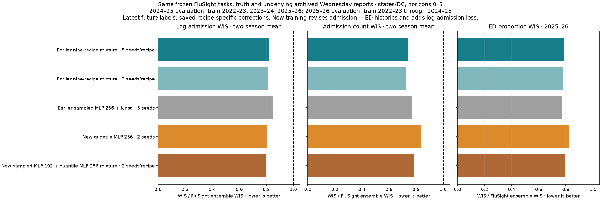

# Submission decision after matched validation — 7 October 2026

**Submit the existing nine-recipe marginal-distribution mixture, currently named System2.** This is a judgment across log admissions, admission counts, ED and readiness. A strict log-admission-only decision favors the new models; the recommendation does not claim the earlier ensemble wins every metric.

The completed comparison replays the newly trained 192-wide sampled MLP with Kinsa and 256-wide neighbor-sharing quantile MLP without Kinsa on the earlier study's underlying archived Wednesday reports. Their saved two-week synthetic correction trees are applied to admission and ED histories. No models were retrained for this comparison. The earlier models retain their saved recipe-specific correction pipelines. Thus underlying reported data are shared; corrected values can differ by pipeline.

Both campaigns used the same frozen training panel, SHA256 `b3cb41a0a1a06541221128b9f9e6b21f1456f7836b89f9b5b364d25233de6287` (the exact machine-readable hash is in plan.json). Evaluation on 2024–25 trains on 2022–23, 2023–24 and 2025–26; evaluation on 2025–26 trains on 2022–23, 2023–24 and 2024–25. All learn the same latest future flu admission and ED labels. The new sampled model trained on cross-fitted corrected synthetic admission/ED histories; the new quantile model trained on synthetic preliminary histories plus recent-history reconstruction. Both added log-admission training loss. Earlier recipes retain their earlier augmentation and correction treatments, detailed in the earlier selection review (removed on 9 October 2026; superseded by the [submission choice review](../submission-choice-review-20261007.md)).

Every candidate is scored on exactly the frozen FluSight ensemble task grid and frozen observed truth: reference dates 23 November 2024–31 May 2025 for 2024–25 admissions; 22 November 2025–30 May 2026 for 2025–26 admissions and ED. Horizons are 0–3. There are 5,616, 5,824 and 5,768 tasks respectively, including US; state/DC scores exclude US and Puerto Rico. ED has no 2024–25 frozen ensemble comparison. US scores are reported separately. This is not the previous full October–May latest-label comparison, and scores must not be compared across those two tables.

| Model evaluated with its own correction on the same archived 2025–26 inputs | State/DC log-admission WIS | Admission-count WIS | ED-proportion WIS |
|---|---:|---:|---:|
| Earlier nine-recipe mixture, five seeds per recipe | 0.284342 | 47.1617 | 0.005102 |
| Earlier nine-recipe mixture, two seeds per recipe | 0.283601 | 46.2488 | 0.005093 |
| Earlier 256-wide sampled MLP with Kinsa, five seeds | 0.289296 | 46.3142 | 0.005031 |
| New 256-wide quantile MLP without Kinsa, two seeds | **0.279719** | 53.1832 | 0.005381 |
| New 192-wide sampled + 256-wide quantile mixture, two seeds each | 0.281026 | 50.7264 | 0.005151 |

Lower WIS is better. Relative to the earlier five-seed nine-recipe mixture, the new quantile model gains 1.6% on last-season log admissions but loses 12.8% on counts and 5.5% on ED. The new two-recipe mixture gains 1.2% on log admissions but loses 7.6% on counts and 1.0% on ED. With two seeds per recipe on both sides, the new mixture gains 0.9% on log admissions but loses 9.7% on counts and 1.1% on ED. The earlier 256-wide sampled model remains a good simpler alternative for native admission and ED accuracy; its weaker log result keeps it behind the broader mixture in my balanced submission choice.

Across the two admission seasons equally, the new two-recipe mixture has log WIS 0.267285 versus 0.274160 for the earlier five-seed nine-recipe mixture. Its admission-count WIS is 64.5041 versus 60.6687. The log advantage is therefore real in this development comparison; it does not come with improvement across all targets. The five-seed versus two-seed sensitivity also shows that small ranking differences are not stable enough to justify treating one seed cohort as definitive.

The nine-recipe production forecast is already available using ten seeds per recipe, trained on all four seasons 2022–23 through 2025–26 with the same recipe-specific input treatments and latest future labels. Recipes have equal weight; seeds have equal weight within a recipe. The marginal mixture preserves the evaluated inverse-CDF combination method. Its prepared file is `output/b6/submission-20261007/2026-10-10-ACCIDDA-System2.csv` (a local output, not published with these docs). The name System2 remains provisional. Choosing it here does not publish the file.

Assumptions and limitations: seasons are exchangeable; the earlier archived-input finalized substitutions are retained for an exact comparison, so this is not an archive-only prospective replay. New correction trees retain their prescribed 2025–26 reporting calibration. The same historical seasons informed candidate selection. The two-seed new mixture is a newly examined candidate, not an independently confirmed improvement. No new interval calibration was introduced. The ten-seed production mixture is a variance-reduction choice; the validation comparison uses two and five seeds per recipe.

A saved three-block quantile model was replayed as a consistency check. Both seasons reproduce target dates, truth, masks and flu-input availability/fill masks; maximum differences were one rounded admission count and less than 1.2e-7 ED proportion, consistent with GPU numerical differences. All forecast candidates must cover every frozen task; the scorer rejects missing tasks, duplicate keys, invalid units or unordered quantiles. Identical task/truth hashes are saved in support.json.

Full results: [summary.csv](summary.csv), [season-scores.csv](season-scores.csv), [monthly and horizon detail](details.csv), [exact task support](support.json), [input and checkpoint plan](plan.json), and [plan/launch/status/rank commands](commands.sh). The graph shows mean season-specific ratios to the FluSight ensemble, not the official pairwise relative-WIS ranking.

<!-- model-choices:start -->
## Model choices

What this report's models were trained on, how errors and corrections were made, what they learned to predict, which seasons they were trained and evaluated on, and what they were scored on, for every configuration (generated 9 October 2026 from the saved scenario strings).

### New B7-fast models

Each heading links to its explanation in [Model choices A–F](../../reference/model-choices.md). One column per group of configurations with identical choices.

| Choice | A_width192_half_lr | B_width256 |
|---|---|---|
| [Training histories (A)](../../reference/model-choices.md#a-training-histories) | final values with artificial reporting errors; corrected by the cross-fitted correction model | final values with artificial reporting errors; plus reconstruction labels |
| [Error source (B)](../../reference/model-choices.md#b-error-source) | prescribed 2025-26 process | prescribed 2025-26 process |
| [Error signals (C)](../../reference/model-choices.md#c-error-signals) | admissions and ED | admissions and ED |
| [Correction model (D)](../../reference/model-choices.md#d-correction-model) | tree on synthetic examples; newest 2 week(s) of admissions and ED | tree on synthetic examples; newest 2 week(s) of admissions and ED |
| [Evaluation inputs (E)](../../reference/model-choices.md#e-evaluation-inputs) | real archived Wednesday reports at the FluSight deadline (saved fold models replayed, no refit); frozen FluSight tasks of 2024-25 and 2025-26 only | real archived Wednesday reports at the FluSight deadline (saved fold models replayed, no refit); frozen FluSight tasks of 2024-25 and 2025-26 only |
| [Forecast view (F)](../../reference/model-choices.md#f-input-view) | **corrected** (each model with its own saved correction model) | **corrected** (each model with its own saved correction model) |
| [Prediction labels](../../reference/model-choices.md#labels-and-folds) | latest panel values, next 4 weeks | latest panel values, next 4 weeks + last 4 context weeks |
| [Evaluated season ← training seasons](../../reference/model-choices.md#labels-and-folds) | 2023-24 ← 2022-23, 2024-25, 2025-26; 2024-25 ← 2022-23, 2023-24, 2025-26; 2025-26 ← 2022-23, 2023-24, 2024-25 | 2023-24 ← 2022-23, 2024-25, 2025-26; 2024-25 ← 2022-23, 2023-24, 2025-26; 2025-26 ← 2022-23, 2023-24, 2024-25 |

### Earlier System2 recipes

Each heading links to its explanation in [Model choices A–F](../../reference/model-choices.md). One row per group of configurations with identical choices.

| Configurations | [Training histories (A)](../../reference/model-choices.md#a-training-histories) | [Error source (B)](../../reference/model-choices.md#b-error-source) | [Error signals (C)](../../reference/model-choices.md#c-error-signals) | [Correction model (D)](../../reference/model-choices.md#d-correction-model) | [Evaluation inputs (E)](../../reference/model-choices.md#e-evaluation-inputs) | [Forecast view (F)](../../reference/model-choices.md#f-input-view) | [Prediction labels](../../reference/model-choices.md#labels-and-folds) | [Evaluated season ← training seasons](../../reference/model-choices.md#labels-and-folds) |
|---|---|---|---|---|---|---|---|---|
| A_blocks3, A_width192_half_lr, A_width256_half_lr | final values with artificial reporting errors; corrected by the cross-fitted correction model | each fold's latest training season | admissions | tree on real examples; newest 2 week(s) of admissions | real archived Wednesday reports at the FluSight deadline (saved fold models replayed, no refit); frozen FluSight tasks of 2024-25 and 2025-26 only | **corrected** (each model with its own saved correction model) | latest panel values, next 4 weeks | 2024-25 ← 2022-23, 2023-24, 2025-26; 2025-26 ← 2022-23, 2023-24, 2024-25 |
| B5_confirmed_candidate_1 | final values with artificial reporting errors; corrected by the cross-fitted correction model | each fold's latest training season | admissions | tree on real examples; newest 1 week(s) of admissions | real archived Wednesday reports at the FluSight deadline (saved fold models replayed, no refit); frozen FluSight tasks of 2024-25 and 2025-26 only | **corrected** (each model with its own saved correction model) | latest panel values, next 4 weeks | 2024-25 ← 2022-23, 2023-24, 2025-26; 2025-26 ← 2022-23, 2023-24, 2024-25 |
| B5_confirmed_candidate_2, B_blocks3 | final values with artificial reporting errors; plus reconstruction labels | each fold's latest training season | admissions | tree on synthetic examples; newest 2 week(s) of admissions | real archived Wednesday reports at the FluSight deadline (saved fold models replayed, no refit); frozen FluSight tasks of 2024-25 and 2025-26 only | **corrected** (each model with its own saved correction model) | latest panel values, next 4 weeks + last 4 context weeks | 2024-25 ← 2022-23, 2023-24, 2025-26; 2025-26 ← 2022-23, 2023-24, 2024-25 |
| X_A_ED_errors_only | final values with artificial reporting errors; corrected by the cross-fitted correction model | each fold's latest training season | admissions and ED | tree on real examples; newest 2 week(s) of admissions | real archived Wednesday reports at the FluSight deadline (saved fold models replayed, no refit); frozen FluSight tasks of 2024-25 and 2025-26 only | **corrected** (each model with its own saved correction model) | latest panel values, next 4 weeks | 2024-25 ← 2022-23, 2023-24, 2025-26; 2025-26 ← 2022-23, 2023-24, 2024-25 |
| X_B_ED_corrected | final values with artificial reporting errors; plus reconstruction labels | each fold's latest training season | admissions and ED | tree on real examples; newest 2 week(s) of admissions and ED | real archived Wednesday reports at the FluSight deadline (saved fold models replayed, no refit); frozen FluSight tasks of 2024-25 and 2025-26 only | **corrected** (each model with its own saved correction model) | latest panel values, next 4 weeks + last 4 context weeks | 2024-25 ← 2022-23, 2023-24, 2025-26; 2025-26 ← 2022-23, 2023-24, 2024-25 |
<!-- model-choices:end -->
