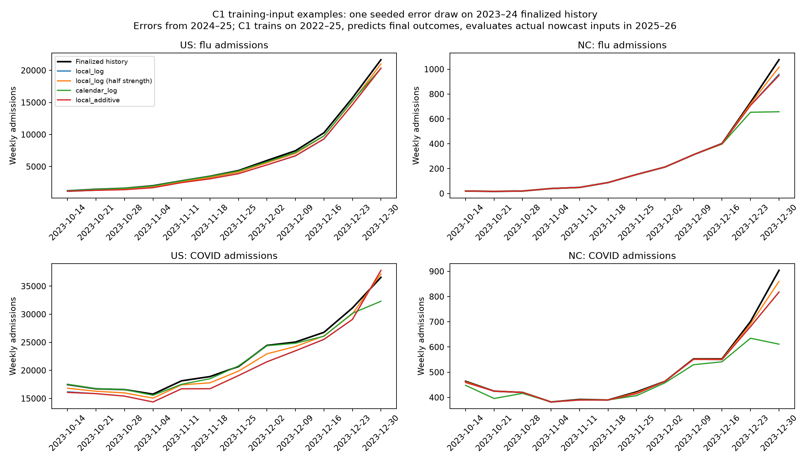
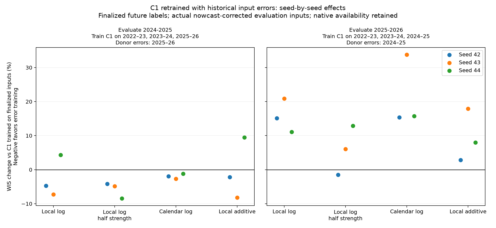
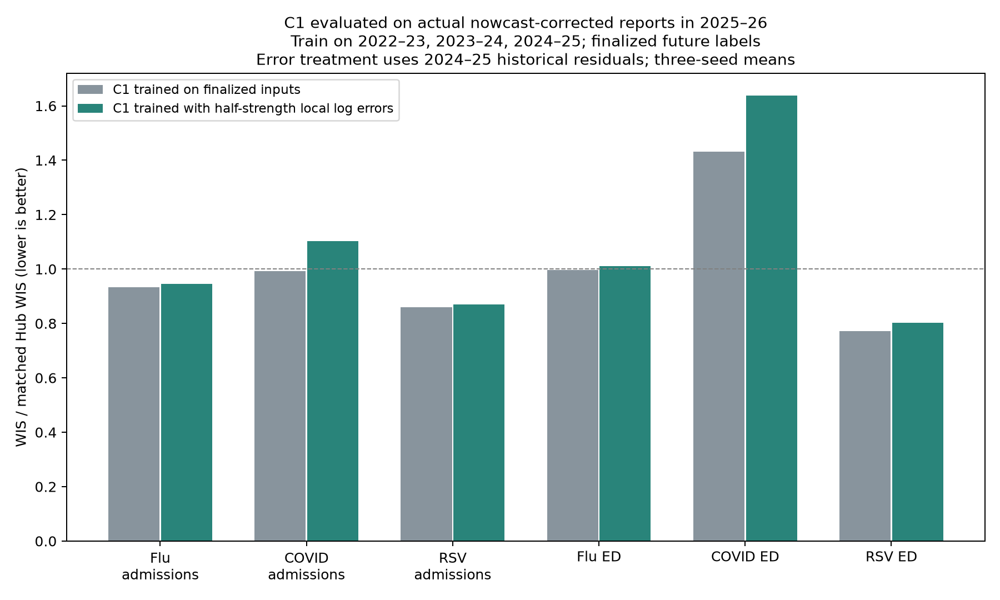
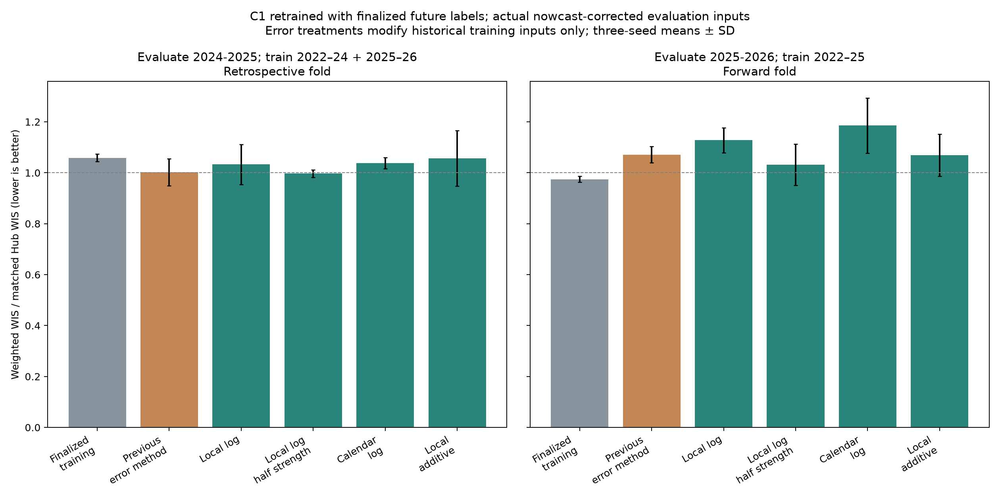

# C1 training with locally matched historical nowcast errors

The earlier negative result applies to one error simulation, not to every way
of training on reporting errors. This batch retrains C1 using four alternatives.
No improvement is assumed before the runs finish.

## What is trained and evaluated

C1 is the B2 pathogen-specific MLP with distance-based spatial sharing, no
external covariates, a 12-week context, and a logit ED transform. All treatments
remove the finality channel, retain finalized future prediction labels, and
retain the original history, 300-epoch cap, patience 30, and seeds 42, 43, 44.
Reporting augmentation does not hide additional observations. The pre-existing
B2 20% artificial masking regularizer remains in all training conditions.

| Evaluation season | Forecaster training seasons | Season supplying error windows | Interpretation |
| --- | --- | --- | --- |
| 2024–25 | 2022–23, 2023–24, 2025–26 | 2025–26 | Retrospective leave-one-season-out CV |
| 2025–26 | 2022–23, 2023–24, 2024–25 | 2024–25 | Forward relative to forecaster training |

This retains the requested two-season B2 CV, rather than claiming two independent
prospective tests. Historical vintages before 2024–25 lack sufficient newest-week
support across targets. A forward-only 2024–25 error-training fold would need a
different archive/support protocol. Both seasons have been used for development.

At evaluation every model receives actual Wednesday reports corrected by the
same causal adaptive-chain nowcaster, with actual availability and finalized
future outcomes used for scoring. No evaluation truth fills input gaps.
The nowcaster corrects the latest eight context weeks; the older four weeks keep
actual vintage values. Error extraction mirrors that exact input treatment.

Compare against the completed matched C1 trained on finalized inputs and the
completed C1 trained with the earlier numerical-error-only simulation, using
identical evaluation inputs, three seeds, dataset, frozen support, 256 prediction
members, and scoring weights. These comparisons reuse completed checkpoints'
scores; each new treatment trains fresh C1 weights.

## Four training-input treatments

1. **Local seasonal log:** match each location's recent levels and changes across
   six signals, together with circular seasonal timing; transfer signed log errors.
2. **Local seasonal log, half strength:** use the same matching but multiply each
   log error by 0.5 before applying it. This shrinks both bias and variability.
3. **Calendar log:** use seasonal timing alone to choose same-location error
   windows; transfer the same signed log errors.
4. **Local seasonal additive:** use local seasonal matching, but transport
   normalized additive errors. This distinguishes matching from transport scale.

A donor always retains its original location, signal, and reporting age. One
12-week donor block supplies all six signals for each recipient location. Donor
locations never exchange errors. Different locations can choose different donor
weeks, so this preserves within-location temporal and signal dependence but
**does not preserve cross-location synchrony**. This is a material assumption,
especially because C1 shares information across locations.

Local matching uses latest-two-week and preceding-two-week available means,
divided by the permitted training-season location/signal peak. Log level uses
an offset of 0.05 and bandwidth log(2); two-week log change uses bandwidth 0.5.
The mean squared feature difference is added to squared circular seasonal
week distance divided by eight weeks. Calendar phase accounts for 52/53-week
seasons. Missing local phase uses calendar only. Select among eight nearest
windows with weights proportional to exp(-distance/2); exclude the identical
origin. These bandwidths are fixed assumptions, not tuned on held-out scores.

For each reference week, define f as max(5% of that week's training-season
location/signal peak, 1 admission or 0.0001 ED fraction). The log error is
log((donor nowcast + f)/(donor final + f)). Apply it as
max(0, (recipient final + recipient f) * exp(strength * error) - recipient f).
The additive treatment uses (donor nowcast - donor final)/max(donor final, f)
and rescales with max(recipient final, recipient f). Bound ED proportions by
one. Keep rescaled admission counts continuous. Preserve signed bias; do not
recenter errors. At a season boundary, target floors follow each reference
week's season, not the window's origin season.

A donor cell without final truth or a finite nowcast/report supplies no numerical
perturbation. It does not make a recipient cell missing. Lack of supported errors
therefore still understates uncertainty in sparse cells; this batch cannot
recover an unobserved reporting-error distribution. Season-specific scaling and
local matching improve conditional transport but cannot establish stability of
reporting rules between years.

## Leakage controls and interpretation

Outer held-out reference dates are excluded from donor truth, matching features,
peaks, and nowcaster reporting-pair histories. Inner early-stopping validation
reference dates are excluded in the same way. Validation inputs get one fixed
synthetic draw per seed; their finalized prediction labels stay unchanged.
The full refit restores permitted validation weeks. The masked nowcaster archive
may itself alter residuals; that inherited restriction remains in all four arms
and is not claimed to have been validated as an optimal residual estimator.

Nowcast numerical caches are reused only because the nowcaster, dataset, and
fold masks are unchanged; their source hashes and masks are checked at runtime.
No old forecaster weights are used for new fits. Code snapshots isolate this
batch from other experiments. Scientific checks cover label/mask preservation,
held-out/validation exclusion, residual sign/inversion, and age/location alignment.

Report each season and paired seed changes before the combined score. Lower
weighted WIS is better; ratios below one beat the matched Hub. Native US gets
20% weight and states/DC 80%; admissions weight 1 and ED 0.5. The 2024–25 support
contains flu/COVID admissions, while 2025–26 contains all six targets. Three
seeds measure training variability, not independent-season uncertainty. Choosing
a winner among four methods on these reused folds is exploratory.

## Manager commands

Run on Longleaf in `/proj/jlessler/projects/tapestry-all/tapestry-c1-error-cv-20261002`.
The planning script calls the shared planner with four explicit scenarios and
pins the dataset, evaluation support, seeds, and code snapshot.

```bash
export PYTHONPATH="$PWD/src"
.venv/bin/python scripts/plan_c1_local_errors.py -e c1-local-errors-20261002
LANES=6 GPUS=2 sbatch --job-name=c1-local-errors-20261002 --array=0-1 --nodelist=g1803jles01 --cpus-per-task=8 --mem=64G scripts/jlessler.sbatch c1-local-errors-20261002
.venv/bin/python -m chromantis.experiment.planner status -e c1-local-errors-20261002
.venv/bin/python -m chromantis.experiment.planner rank -e c1-local-errors-20261002 --no-plots
.venv/bin/python docs/experiments/c1-local-errors-20261002/report.py
```

After planning, use status to resume; do not re-plan an existing experiment.

## Decision log

October 2, 2026: reopened the earlier negative augmentation result at the user's
request. The earlier method chose donors by national phase and transported
additive errors; neither choice establishes that nowcast residual training is
ineffective. Replaced that transport code with explicit local/calendar matching
and log/additive choices, and planned a four-treatment batch. Preserved the
existing CV, nowcaster, labels, and matched finalized-training reference so the
batch focuses on how historical errors are applied. No coding defect or improved
forecast performance has yet been established by these methodological concerns.

## Launch and input audit

Slurm training array **3457823** was submitted on October 2, 2026, using two L40
GPUs on g1803jles01, with six concurrent seed runs per GPU. Dependent report
job **3457832** ranks the completed runs and generates the comparison graph.
The launch also queued the standard ntfy completion summary. Twelve seed runs
each contain two fold fits. Five focused scientific tests passed locally.
The real nowcast-cache audit also passed for all 16 method/fold/stage combinations.
The 2025–26 evaluation fold has 26 inner and 34 full-training donor windows from
2024–25; the 2024–25 evaluation fold has 36 inner and 48 full-training donor
windows from 2025–26. Valid paired residual evidence covers 81.1%/98.2% of inner/full
bank cells for the forward fold and 73.3%/87.8% for the retrospective fold.

[Input audit numbers](input-audit.csv). The graph below shows one seeded draw on
2023–24 historical inputs used to train C1 on 2022–23, 2023–24, and 2024–25,
with finalized future labels and eventual evaluation on actual nowcast-corrected
2025–26 reports. This graph is an input example, not a forecast result.




## Analysis of the completed batch

All 12 seed runs, containing 24 fold fits/evaluations, completed successfully.
The two GPU allocations took about 51 minutes; the dependent comparison report
also completed. The target/season/location/horizon support was checked by the
report, and the subsequent analysis verified matching target/seed/geography
sample counts against finalized-training C1. Recomputing its weighted target
scores reproduced the baseline composite scores.

**Changing error application matters, but none of these four treatments beats
finalized-training C1 on average in the forward 2025–26 evaluation.** Half-strength
local log errors are the closest alternative. They nearly tie finalized training
on the two-season mean because a retrospective improvement offsets a forward loss.
That is not evidence of a reliable forward improvement.

Every result below uses C1, finalized future prediction labels, and actual
Wednesday inputs corrected by the same causal adaptive-chain nowcaster for
evaluation. The training-input intervention alone is listed in the first column;
its corresponding early-stopping inputs receive a fixed simulated draw as well.
For evaluation in 2024–25, C1 was trained on 2022–23, 2023–24, and 2025–26, with
errors learned from 2025–26. For evaluation in 2025–26, C1 was trained on 2022–23,
2023–24, and 2024–25, with errors learned from 2024–25. All values average seeds
42, 43, and 44. Lower relative WIS is better; one equals the matched Hub ensemble.

| C1 historical training inputs | 2024–25 retrospective relative WIS | 2025–26 forward relative WIS | Equal-season mean |
| --- | ---: | ---: | ---: |
| Finalized numbers, no reporting-error augmentation | 1.0589 | **0.9747** | 1.0168 |
| Previous national-phase numerical nowcast-error simulation | 1.0017 | 1.0714 | 1.0365 |
| Local seasonal log errors | 1.0325 | 1.1276 | 1.0801 |
| Local seasonal log errors, half strength | **0.9970** | 1.0320 | **1.0145** |
| Calendar-matched log errors | 1.0386 | 1.1857 | 1.1122 |
| Local seasonal additive errors | 1.0565 | 1.0685 | 1.0625 |

### Seed consistency and what the combined score hides

C1 trained with half-strength local log errors and evaluated in 2024–25 improves
on finalized-training C1 by 5.8% in mean paired seed ratios, with improvement in
all three seeds. The same training method, trained on the older history and
evaluated in 2025–26, loses by 5.8% on average: seed 42 improves 1.5%, seed 43
loses 6.1%, and seed 44 loses 12.9%.

The half-strength two-season mean improves just 0.24% in paired seed ratios,
with only one of three seeds improving. The paired changes are −2.9%, +0.4%,
and +1.8%; their standard deviation is 2.4 percentage points. These are training
seed differences, not an independent-season confidence interval. The 2024–25
fold also scores only flu/COVID admissions, whereas 2025–26 scores all six
targets. Equal season weighting does not give the two folds identical target
support or make retrospective training prospective.

Compared with the **previous numerical-error-only nowcast simulation**, the
half-strength method improves the forward mean paired score by 3.5%, with two
of three seeds improving. It therefore partly recovers the earlier degradation,
but it does not beat finalized training. Full-strength local log, calendar log,
and local additive errors lose to finalized training in every forward seed.
Their mean paired losses are 15.7%, 21.6%, and 9.6%, respectively.



[Seed consistency numbers](seed-consistency.csv).

### COVID explains most of the forward loss

For C1 trained on 2022–23, 2023–24, and 2024–25 with half-strength 2024–25
nowcast errors and evaluated on actual nowcast-corrected 2025–26 reports, all
six target mean WIS ratios are worse than for C1 trained on the same finalized
history without reporting-error augmentation. Both learn finalized future labels.

| Forward target | Finalized-training C1 | Half-strength error-training C1 |
| --- | ---: | ---: |
| Flu admissions | 0.9334 | 0.9454 |
| COVID admissions | 0.9934 | 1.1030 |
| RSV admissions | 0.8597 | 0.8699 |
| Flu ED proportion | 0.9958 | 1.0105 |
| COVID ED proportion | 1.4326 | 1.6384 |
| RSV ED proportion | 0.7711 | 0.8022 |

COVID admissions account for 42.5% of the increase in the weighted composite,
and COVID ED for 39.9%: **82.5% together**. This is a decomposition of the
observed mean score difference using the stated target weights, not a causal
explanation. It uses the difference of mean scores, rather than the mean paired
percentage ratios used above.

The normalized COVID-admission overprediction penalty increases from 0.426 to
0.581; COVID ED's increases from 0.912 to 1.079. Underprediction penalties decline.
Nominal 90% COVID ED coverage stays near 52.9% in both conditions; COVID-admission
coverage falls from 74.6% to 72.5%. Thus the method does not fix the existing COVID
calibration problem. It increases overprediction penalties despite reducing
underprediction penalties. Flu/RSV score differences are smaller. In the
retrospective 2024–25 fold, half-strength augmentation instead reduces
underprediction penalties and improves both admission targets' scores and coverage.

The forward loss is present in both geographic summaries: half-strength error
training loses 3.7% versus finalized training for states/DC and 14.6% for the
native US forecast, in mean paired seed ratios. The result is not solely an
artifact of one geographic weighting choice, though national performance makes
the overall loss larger.



[Target scores and calibration](target-diagnostics.csv) ·
[Decomposition of the forward loss](half-strength-forward-attribution.csv).

### Interpretation and next decision

Keep finalized-training C1 for the current forward forecasting setup. The
narrow conclusion is that **these four ways of applying historical nowcast errors
have not produced a reproducible forward improvement**. Do not interpret this as
proof that nowcast-error augmentation is inherently ineffective or that a coding
bug caused the original loss.

The batch shows sensitivity to perturbation strength and does not establish that
log transport or local matching is superior. Half-strength log errors perform
better on average than full-strength log errors, but the stronger local log
method performs worse than the new local additive method in the forward fold.
The batch also changes cross-location donor dependence relative to the earlier
method, so comparisons against that earlier method do not isolate matching alone.

Remaining material assumptions are the transfer of normalized errors between
seasons, fixed matching bandwidths, and independent donor choices across
locations. Residual extraction still masks outer/inner excluded reference dates
from the nowcaster's reporting archive. That may alter the errors the nowcaster
would make with an intact causal archive; this batch did not isolate that issue.
Correct units, signs, mask preservation, and date exclusion do not by themselves
validate the simulated error distribution.

Before another parameter sweep, the most informative audit would compare COVID
residual magnitude, sign, and cross-state dependence by reporting age and season,
including the effect of masking the nowcaster's calibration archive. That is a
proposed next diagnostic, not an analysis already performed or a new job launched.
No new fitting or scoring jobs were launched for this completed-run analysis.

<!-- results -->
## Results

| Training-input error treatment | Evaluation season | C1 relative WIS | Finalized-training C1 | Previous error-training C1 | Change vs finalized training |
| --- | --- | ---: | ---: | ---: | ---: |
| Calendar log | 2024-2025 | 1.0386 | 1.0589 | 1.0017 | -1.9% |
| Calendar log | 2025-2026 | 1.1857 | 0.9747 | 1.0714 | +21.6% |
| Calendar log | combined | 1.1122 | 1.0168 | 1.0365 | +9.4% |
| Local seasonal additive | 2024-2025 | 1.0565 | 1.0589 | 1.0017 | -0.3% |
| Local seasonal additive | 2025-2026 | 1.0685 | 0.9747 | 1.0714 | +9.6% |
| Local seasonal additive | combined | 1.0625 | 1.0168 | 1.0365 | +4.5% |
| Local seasonal log | 2024-2025 | 1.0325 | 1.0589 | 1.0017 | -2.5% |
| Local seasonal log | 2025-2026 | 1.1276 | 0.9747 | 1.0714 | +15.7% |
| Local seasonal log | combined | 1.0801 | 1.0168 | 1.0365 | +6.2% |
| Local seasonal log, half strength | 2024-2025 | 0.9970 | 1.0589 | 1.0017 | -5.8% |
| Local seasonal log, half strength | 2025-2026 | 1.0320 | 0.9747 | 1.0714 | +5.8% |
| Local seasonal log, half strength | combined | 1.0145 | 1.0168 | 1.0365 | -0.2% |

Lower WIS is better; 1 equals the matched Hub ensemble. Changes average paired seed ratios. All rows use C1 and finalized future prediction labels. For evaluation in 2024–25, train on 2022–23, 2023–24, and 2025–26; for evaluation in 2025–26, train on 2022–23, 2023–24, and 2024–25. Evaluation inputs are actual nowcast-corrected reports.



[Paired seeds](paired-seed-scores.csv) · [Summary](summary.csv) · [Target scores](target-season-scores.csv).

October 2, 2026, completed-run analysis: half-strength local log errors partly recover the previous forward loss, but do not beat finalized-training C1 on average. Retain finalized training; distinguish this tested-method result from a universal rejection of augmentation.
