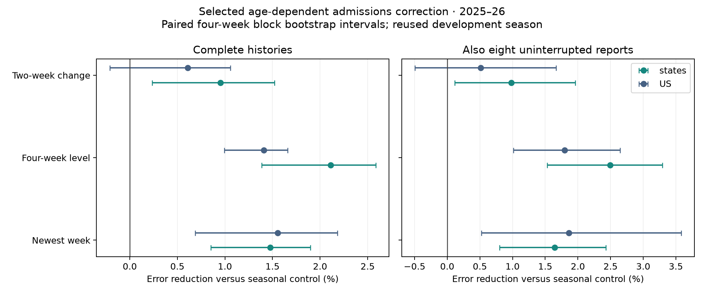

# A better reporting-triangle nowcaster · October 2, 2026

The **balanced candidate** retains the seasonal reporting triangle, adds a small
age-dependent admissions correction, and propagates joint revision-error draws
into the fixed forecaster. It improves reconstructed point values, recent level,
and growth, while lowering average C1 forecast WIS on both priority cohorts.
The forecast gain survives increasing evaluation from 256 to **2,048 members**.
It is modest and not established as prospective superiority.

[Exact configurations](recommended.json) · [Research log and every launch](research-log.md) ·
[Forecast comparisons](confirmation/tradeoff.csv) · [Paired forecast intervals](confirmation/forecast-bootstrap.csv).

## Results

### Compared with keeping reports unchanged

The small incremental gains below are relative to the **seasonal nowcaster**.
Compared with retaining the actual currently available report, nowcasting has a
substantial newest-week benefit. The following uses the balanced point estimate
(quarter-strength correction), frozen-panel final truth, and 2025–26 saved outputs.
Here t−0 is the newest event week available at issuance; t−1 and t−2 are earlier
event weeks in that same vintage, not forecasts or reports from older issuances.

| Cohort | Event week | State unchanged | State nowcast | US unchanged | US nowcast |
|---|---|---:|---:|---:|---:|
| Complete history | t−0 | 9.193% | 6.173% | 8.061% | 2.540% |
| Complete history | t−1 | 3.411% | 3.200% | 2.626% | 1.958% |
| Complete history | t−2 | 2.246% | 2.158% | 1.720% | 1.282% |
| Also eight uninterrupted reports | t−0 | 8.894% | 5.811% | 8.072% | 2.221% |
| Also eight uninterrupted reports | t−1 | 3.091% | 2.760% | 2.564% | 1.519% |
| Also eight uninterrupted reports | t−2 | 2.015% | 1.923% | 1.751% | 1.248% |

These are WAPE: sum absolute errors / sum final values within each target,
then an equal-weight average of the six targets. Within a state-target group,
this weights larger final values more heavily; it is not mean cell percentage
error or equal-state MAE. Mixing native admission counts and ED proportions into
one unscaled MAE would be meaningless. The linked per-target table supplies
literal native-unit MAE and signed bias (prediction minus final truth), averaging
weeks within location and then locations equally. ED values there are fractions;
multiply by 100 for percentage points.

Cohorts are anchored at the issuance's t−0, with complete 12-week raw target
history and, for the strict cohort, eight consecutive newest-week reports.
Require finite actual reports, truth, and all candidate predictions at all three
ages. All methods and ages share exactly the same target/location/issuance cells:
12,880 state and 255 US cells per age for complete histories; 9,611 and 190 for
the strict cohort. This extra three-age matching makes t−0 slightly different
from the independently supported newest-week table below. No final-value proxies
replace missing reports in this comparison. Documented availability and the
existing frozen panel remain the experiment assumptions; delay-12 labels train
the correction, while frozen final values score it. This is development-set
evidence and does not establish prospective performance.

For example, state flu-admission MAE is 16.52→11.61 admissions at t−0,
5.41→4.90 at t−1, and 3.66→3.48 at t−2. Benefits are not universal:
state flu ED t−1 MAE worsens from 0.02855 to 0.03247 percentage points.

[Age-specific summary](age-error-summary.csv) ·
[Per-target MAE, signed bias, and percentage errors](age-error-by-target.csv) ·
[Reproduction script](report_age_errors.py).

### Incremental improvement over the seasonal nowcaster

2025–26, with identical scored cells and input encoding across forecast arms:

| Metric | Complete 12-week history | Also eight uninterrupted reports |
|---|---:|---:|
| State newest-week WAPE | 6.310% → **6.162%** | 5.975% → **5.832%** |
| US newest-week WAPE | 2.587% → **2.546%** | 2.279% → **2.240%** |
| State four-week level error | **2.11% lower** | **2.50% lower** |
| State two-week growth error | **0.95% lower** | **0.98% lower** |
| C1 WIS / matched Hub WIS | 0.92148 → **0.91764** | 0.97046 → **0.96775** |
| Paired C1 WIS change | **−0.413%** | **−0.272%** |

The primary point-trajectory score improves **1.44%**. The fraction of state
newest-week values individually within 5% increases slightly, 63.47%→63.58% on
complete histories. This is not universal 5% accuracy.

The state point, level and growth improvements all have positive paired
four-week block-bootstrap improvement intervals in both cohorts. National growth
remains less certain. Forecast intervals include zero: WIS changes are
[−0.829%, +0.205%] and [−0.917%, +0.397%]. Every complete-history seed improves;
one uninterrupted-history seed worsens 0.135%. The older 2024–25 C1 fold improves
0.159% and 0.430%, but that forecaster fold is retrospective.

These seasons were repeatedly used for development. The intervals do not account
for selecting among candidates. Relative-WIS bootstrap intervals condition on
917/1,000 and 656/1,000 resamples with positive Hub denominators in every original
location/target group; sparse low-burden groups limit this diagnostic.




The tradeoff graph uses the 256-member factorial sweep; the result table above
uses the 2,048-member confirmation.

[US level and growth with revision draws](quarter-correction/history-intervals-US.png) ·
[NC level and growth with revision draws](quarter-correction/history-intervals-NC.png) ·
[Point score components](strength-ablation/trajectory-summary.csv) ·
[Target-specific WIS](confirmation/forecast-target-scores.csv.gz) ·
[Horizon-specific WIS](confirmation/forecast-horizon-target-scores.csv.gz).

## Model and training

Use `finalization_model=context_residual`, `finalization_features=age`,
`finalization_gate=admissions`, `finalization_penalty=1000`, and
`finalization_strength=0.25`. Reconstruct eight recent weeks from twelve-week
histories. For forecast propagation, use `replay_uncertainty=0.5`.

The underlying adaptive-chain seasonal model is unchanged: 104-week history,
eight-week seasonal bandwidth, eight-week recent-pair half-life, exposure-weighted
median ratios, and four effective prior weeks for state pooling. National
estimation is independent of the states. ED point estimates retain this base.

For admissions, fit a pooled multiplicative residual to **original causal
predictions**, using only archived delay-12 reports already available at each
refit. Features are report age, recent four-week log growth, missing-growth status,
Thanksgiving/Christmas/New Year reporting and recovery flags, and local offsets.
Context and local effects have two smooth age profiles, `2^(-age/2)` and
`age * 2^(-age/2)`, so they can correct trajectory shape rather than only level.
The two-week decay is a fixed modeling assumption.
Growth is half the log ratio of the newest two-week mean to the previous
two-week mean, with a one-count offset and clipping at ±1 log-unit/week.
Holiday flags mark a holiday in the preceding 0–6 days or 7–13 days at issuance.

Refit every four issuances on at most 104 weeks with a 26-week residual recency
half-life. Give locations equal total fitting weight. Three ridge-regularized IRLS
steps approximate absolute newest-point, four-week-level and two-week-change
losses with equal primary weights; auxiliary point errors at all eight ages get
weight 0.125 each. Normalize using mature local Q95, with a one-count floor.
The robust residual floor is 0.01 in normalized units. Require twelve historical
issuances before residual fitting. Bound the extra multiplier to ±50%, then
apply quarter strength before native-unit rounding, limiting its final additional
change to ±12.5%. Unsupported cases retain the seasonal estimate.

Joint uncertainty uses prequential log revision errors over a 104-week window,
with 26-week recency weighting. A single sampled donor supplies the entire
week × target × location error pattern. Require twelve mature donor issuances
and twelve observed errors per cell. Missing donor cells receive zero perturbation;
insufficiently supported cells remain deterministic. Remove each cell's weighted
median log error, cap errors at ±log(4), and use offsets of one count or 0.0001 ED
fraction. Apply half strength, round count draws and bound ED fractions to [0,1].
Median centering does not preserve the arithmetic mean. Give C1 one future per
intact sampled history, with paired latent draws and unchanged weights.

The balanced distribution improves trajectory CRPS over its deterministic center
by **6.66% in states / 16.65% nationally** on complete histories, and
**9.94% / 18.72%** on uninterrupted histories. These are empirical input draws,
**not calibrated 80% nowcast intervals**: central-80% newest-week coverage is
only 54% in states and 43% nationally on complete histories.
[Distribution scores](confirmation/distribution-scores.csv) ·
[Scoring provenance](confirmation/distribution-score-provenance.json).

## Scores, availability and assumptions

The primary reconstruction score equally averages normalized absolute error in
the newest point, four-week mean, and newest-two minus previous-two mean. Average
weeks within location, locations within target, and targets within geography;
combine 80% states and 20% US. Training Q95 supplies the common native-unit scale.
Log growth, WAPE and individual within-5% accuracy are secondary diagnostics.
All point models use identical four-week scored paths.

Distribution diagnostics use exact empirical CRPS for those same three
functionals and report interval coverage. Their scale is causal donor-maturity
Q95, falling back to **raw observed-history Q95**, with native-resolution floors.
This scale is independent of the candidate point estimate. The final diagnostic
CSV files were regenerated from the original cached points and original draw
counts after correcting that fallback; exact coverage checks confirm unchanged
draws/support. No forecast artifact or WIS changes in this diagnostic correction.

Forecast WIS uses the existing shared scorer: model/Hub WIS ratios within
location and target; equal state weights, 20% US weight; admissions weight 1 and
ED weight 0.5. Percentage changes average the three paired seed ratios. C1 weights
are reused from `b-2-t0`, with no ancillary covariates and no forecaster retraining.

Apply the [documented availability schedule](../../data/index.md): targets,
Kinsa, inpatient/outpatient and NWSS at T-0; ILINet, labs and FluSurv at T-1.
Assume this schedule even where archived publication records differ. For absent
historical target reports, use an **explicit frozen-final numerical proxy** in
forecast replay, equally across arms; scheduled-final covariates follow B2.
Preserve actual reports wherever present. Native final-data gaps remain missing,
and Vermont inpatient remains unsupported. Proxies never train revision curves,
enter uncertainty donors, or receive perturbations. This is the requested
availability counterfactual, not a claim of historically deployable replay.

A complete history means twelve visible reports for the **scored target/location**
at issuance. The stricter cohort also requires a latest-week report at each of
eight consecutive issuances. Cohorts come from the unfilled archive; they do not
require every other model input to be complete. C1's finality input is encoded
as availability in every arm, matching its original training convention; it does
not assert that the numerical estimates are final.

Delay twelve approximates reporting maturity; later revisions may remain.
Holiday dates are calendar proxies for reporting behavior. Uncertainty assumes
past relative revision patterns transfer to the current epidemic. Its donor
cache begins in the two evaluated seasons, leaving an early-2024–25 warmup and
sparse-cell fallbacks. No 2026–27 outcome is used. The frozen panel spans
2022-05-14 through 2026-09-19, SHA-256
`54d0e3306a76ded067c6d1b65493d50b1c19bde2e66ab80a438674ec37e6c80f`.

## Which configuration to use

- **Balanced reconstruction and forecasting:** quarter correction plus half
  uncertainty, as above. This is the completed candidate for this axis.
- **Best point reconstruction:** full age-dependent admissions correction.
  Its primary trajectory gain is 4.11%, state newest-week WAPE is 5.87%, and
  state level error falls 6.72%. It worsens C1 on the strict cohort.
- **Best fixed-C1 forecast here:** seasonal point estimates plus half uncertainty.
  At 2,048 members WIS improves 0.45%/0.41% on the two cohorts, in every seed,
  but point reconstruction does not improve.

These choices expose the tradeoff. Full residual correction is the winner of
the declared point score; the balanced candidate was selected from the finite
strength/uncertainty comparison to also improve both mean forecast scores.
The generic scenario defaults remain compatible with existing experiment IDs;
use the explicit settings or the `balanced` planner preset for this candidate.

## Reproduce and resume

All **27 nowcaster runs and 102 forecast replays** completed on patron node 2
(54 and 204 fold evaluations). Work used the isolated checkout
`/proj/jlessler/projects/tapestry-all/nowcaster-20261001`, with shared frozen data
and experiment outputs. The complete chronology and all original plan/launch/
status/rank commands are in the [research log](research-log.md).

A fresh point-comparison recipe (not an additional launched experiment):

```bash
export PYTHONPATH="$PWD/src"
bash scripts/plan_context_nowcast.sh context-nowcast-balanced balanced
sbatch --job-name=context-nowcast-balanced --nodelist=g1803jles02 \
  scripts/finalization.sbatch context-nowcast-balanced
.venv/bin/python -m tapestry.experiment.planner status -e context-nowcast-balanced
.venv/bin/python -m tapestry.experiment.planner rank -e context-nowcast-balanced
```

The completed higher-member forecast confirmation was planned and launched with:

```bash
export PYTHONPATH="$PWD/src"
.venv/bin/python scripts/plan_context_replay.py -e context-replay-confirm-20261002 \
  --reference context-nowcast-v6-20261001 --candidate mlp-all-vintaged-4498052c695b \
  --uncertainty 0.5 --seasonal-uncertainty 0.5 --eval-members 2048
LANES=6 GPUS=2 sbatch --job-name=context-replay-confirm-20261002 --array=0-1 \
  --nodelist=g1803jles02 --time=04:00:00 scripts/jlessler.sbatch context-replay-confirm-20261002
.venv/bin/python -m tapestry.experiment.planner status -e context-replay-confirm-20261002
.venv/bin/python -m tapestry.experiment.planner rank -e context-replay-confirm-20261002
```

Use `status` to inspect/resume existing experiments; use a new name for a fresh
plan. Each experiment pins its source, dataset and checkpoints. Replays verify
numerical agreement with the completed nowcaster before forecasting. Scientific
checks cover loss/functionals, units, vintage alignment, future isolation,
candidate-independent score scales, and preservation of latent pairing when
history uncertainty is zero. No broad regression suite was added.
