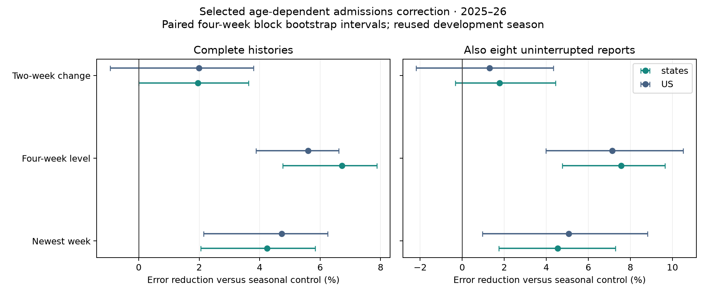
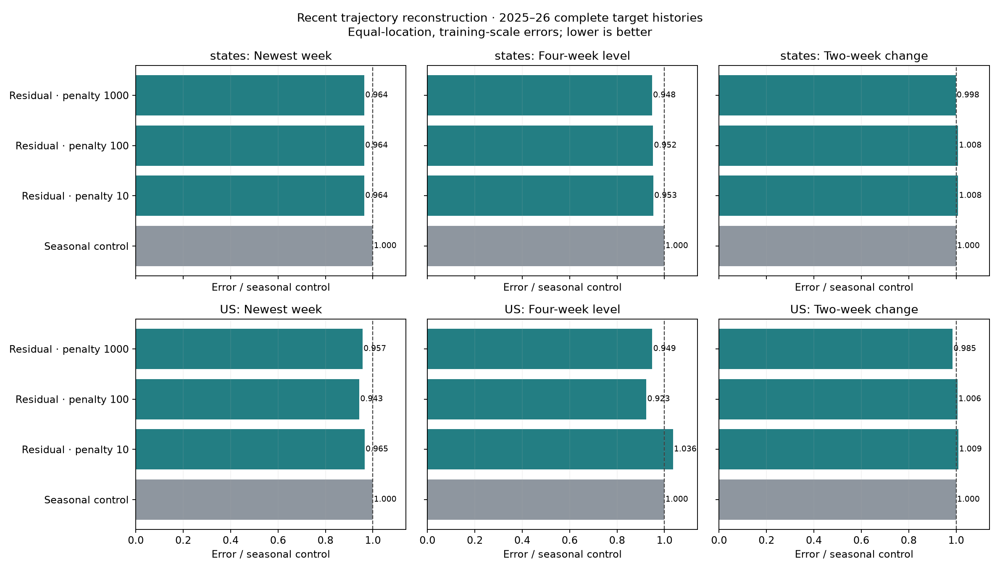
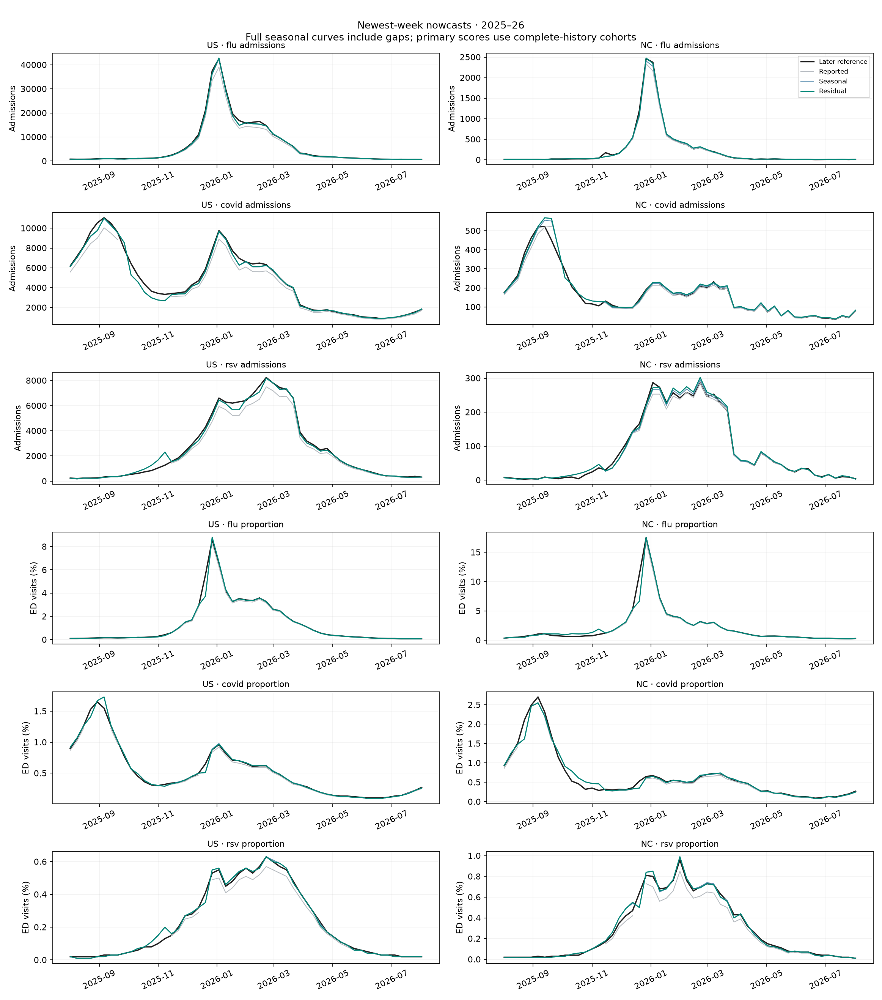
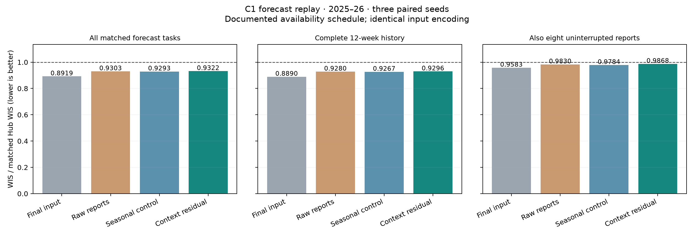
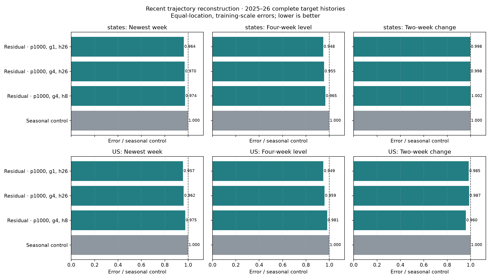
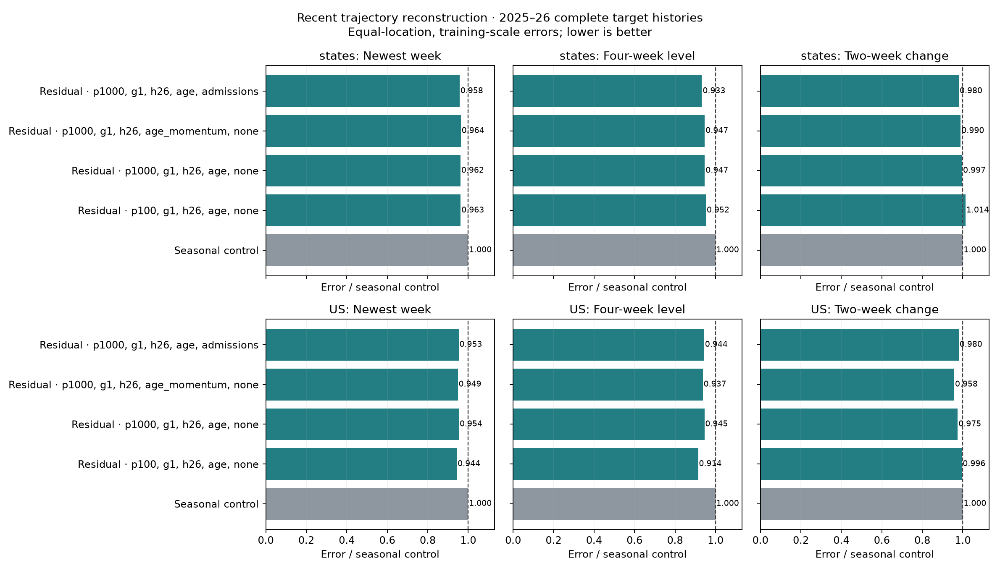
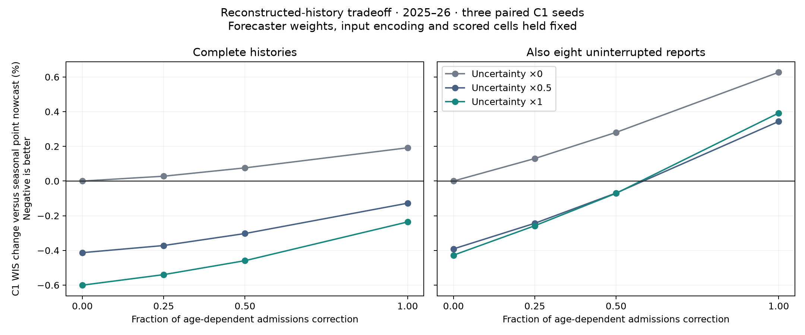

# Nowcaster research log · October 1–2, 2026

This records successive experiments. See the [current result](index.md) for the selected configurations and corrected scores.

# Context-conditioned nowcasting · October 1–2, 2026

The strongest completed point nowcaster uses age-dependent residual correction
for admissions and keeps the seasonal ED estimates. On 2025–26 complete histories,
state newest-week WAPE improves 6.31% → **5.87%**, four-week level error improves
**6.7%**, and growth error improves **2.0%** (the growth interval still includes
zero). Joint revision uncertainty improves C1 WIS **0.24%** on complete histories,
but still worsens it **0.39%** with uninterrupted reporting. A smaller residual
correction is being evaluated to resolve that tradeoff; no forecast default is
promoted yet. Later sections record the successive finite comparisons and their
manager commands. All runs use patron node 2.



[Recent US level and growth](age-ablation/level-growth-US.png) ·
[Recent NC level and growth](age-ablation/level-growth-NC.png) ·
[Current forecast comparison](uncertainty-replay/forecast-summary.csv).

Improve the existing seasonal reporting triangle and the recent epidemic
trajectory it supplies to forecasting. Complete target histories are primary;
the intersection with eight uninterrupted reporting issuances is the stricter
check. The previously explored 2024–25 and 2025–26 seasons are development data,
not independent prospective validation. No 2026–27 outcomes are used.

## Availability and scientific assumptions

Use the current [human availability assumptions](../../data/index.md): six targets,
Kinsa, inpatient/outpatient and NWSS through T-0; FluSurv, labs and ILINet through
T-1. Apply this schedule even where the historical archive does not establish it.
Native gaps (no finalized value) remain missing; Vermont inpatient remains
unsupported. The earlier audit's source delays are not the current policy.

Availability alone does not specify the numerical contents of missing historical
reports. For downstream scheduled-input replay, use the frozen reference as an
explicit proxy where a target report is absent, and use scheduled finalized
covariates as in B2. Preserve actual target reports wherever present. These
proxy values include later revisions; scores involving them measure the assumed
reporting environment, not historically deployable performance. Apply the same
proxies to every arm. Do not use proxy pairs to learn reporting development,
and do not count their exact reconstruction as evidence of nowcaster accuracy.
Primary nowcaster comparisons use observed complete-history cohorts; availability
flags for these cohorts always come from the unfilled archive.
Here a complete history means all twelve context reports for the scored
target/location are observed at that issuance. The stricter cohort additionally
requires the latest report to have been present at each of the preceding eight
issuances for that target/location. It does not require simultaneous completeness
of every other input target. All arms are scored on identical task cells.

## Models and training

Control: the existing adaptive-chain model, 104-week history, eight-week seasonal
bandwidth, eight-week recent-pair half-life, exposure-weighted median factors,
four effective prior weeks for state pooling, independent national estimation.
All fitting uses only actually archived report pairs whose end report was
available at that issuance. Delay 12 approximates maturity. Calendar and local
reporting behavior are presumed transferable within the fitting window; signed
revisions are allowed. No future frozen reference trains the candidate curves.

Candidates condition the same weighted-median fits on local epidemic growth and
holiday reporting. Growth is half the log ratio of the newest two-week mean to
the preceding two-week mean, measured at the same historical reporting delay as
the target estimate. It is computed from that historical issuance, not maturity.
Counts receive a one-count offset; rates receive no offset and nonpositive or
missing means have unknown growth. Growth is clipped to ±1 log-unit/week.
Historical contexts receive weight `0.25 + 0.75 exp(-0.5 (difference/bandwidth)^2)`;
unknown growth leaves the previous weights intact. Bandwidths 0.1, 0.2 and 0.4
are compared. This floor preserves support under sparse context.

Thanksgiving, Christmas and New Year define a reporting-week indicator and a
following-week recovery indicator. Mismatched contexts receive one-quarter
weight. Holiday dates are deterministic calendar features, not measured office
closures. These are prespecified modeling choices; no external holiday data or
new dependency is needed. Weekly-chain candidates condition every later step on
the currently observable growth, assuming that regime remains informative over
subsequent revision steps. A direct current-delay-to-12 candidate checks that
assumption. Output rounding and the proxy gap model match the control.

## Scores and selection

Save newest-week error and four-week trajectories on identical observations for
all methods. Each trajectory must have four scored reference values and finite
predictions from every comparator; partial trajectories are excluded explicitly.
The first three boundary weeks of a seasonal fold cannot form full trajectories
because their earlier ages lie outside that fold's scored labels.

- **Point:** absolute newest-week error / training Q95.
- **Level:** absolute error in the four-week mean / training Q95.
- **Growth:** absolute error in (newest two-week mean − preceding two-week mean)
  / training Q95. This remains defined at zero and reflects absolute change in
  epidemic burden.
- **Trajectory:** arithmetic mean of point, level and growth errors; this explicit
  equal-component utility is the development selection criterion. Preserve all
  components to expose tradeoffs.
- **Log growth:** secondary absolute error in half the log ratio of those two
  means, adding 1% of training Q95 to both means. The offset is an explicit
  near-zero regularizer; this diagnostic does not determine selection.

Average weeks within location, then locations within target/geography. Report
states and US separately and target-macro scores. WAPE and within-5% accuracy
remain secondary point diagnostics. Downstream WIS retains the shared manager's
weights (20% US, 80% equally weighted states; admissions twice ED), fixed C1
checkpoint weights, three paired seeds and compatible availability encoding.
A better trajectory score alone does not establish better forecasting.

## Manager commands

Remote working directory: `/proj/jlessler/projects/tapestry-all/nowcaster-20261001`.
This source staging directory shares the existing data and environment but does
not overwrite the main remote checkout. The manager pins each experiment's code.

```bash
export PYTHONPATH="$PWD/src"
bash scripts/plan_context_nowcast.sh context-nowcast-v1-20261001
sbatch --job-name=context-nowcast-v1-20261001 --nodelist=g1803jles02 scripts/finalization.sbatch context-nowcast-v1-20261001
.venv/bin/python -m tapestry.experiment.planner status -e context-nowcast-v1-20261001
.venv/bin/python -m tapestry.experiment.planner rank -e context-nowcast-v1-20261001
```

Do not re-plan while a job runs. `status` provides the resubmission command;
retain `--nodelist=g1803jles02` for this work.

## Decision log

- October 1: started with conditional reweighting of the existing seasonal
  estimator to keep the implementation simple. Added matched level/growth
  scoring and scientific checks for vintage isolation, rate units, and score
  mathematics. Two focused tests passed. Figures are for user inspection.

## First sweep result and revised training

All five kernel candidates completed (Longleaf job 3351522). The seasonal control
won the specified 2025–26 complete-history trajectory criterion: 0.035860 versus
0.036764 for the least harmful kernel candidate (bandwidth 0.4, +2.5%). Bandwidth
0.2 scored 0.037043 (+3.3%); direct conditional completion scored 0.039832 (+11.1%).
These fixed similarity weights are rejected as an improvement. The experiment's
pinned source and score tables retain the comparison.

The second sweep learns a residual on top of the unchanged seasonal predictions.
Its examples are past predictions actually generated using each historical
issuance's information. Labels are scheduled delay-12 archived reports, admitted
only when that delay-12 report has arrived. Complete historical four-week paths
supply the level/growth examples. Reference truth and the evaluation fold's label
mask do not construct these training examples. The wrapper builds them from
vintages with dummy reference labels, independently of score support.

Assumptions and fixed choices:

- Fit each signal independently; states share growth/holiday slopes with ridge
  regularized local offsets, and US fits independently. Age-specific offsets,
  recent growth, a missing-growth indicator and holiday/recovery indicators
  predict an additional multiplicative adjustment to the seasonal estimate.
- Use up to 104 preceding issuance weeks; 26-week recency half-life; equal total
  initial weight per location. Require twelve historical issuances and complete
  four-week paths. Refit every four scheduled issuances. The seasonal base still
  updates weekly and incorporates recent partial revision pairs.
- Normalize training residuals by each location's Q95 of the admitted mature
  reports across admitted issuance/age examples (a mature event week can occur
  at several ages); minimum scale 1 count or 1e-8 rate units. This scale can update during
  the season using past reports. Evaluation scales remain the existing frozen
  training-label Q95, so all candidates are compared identically.
- Three iteratively reweighted ridge fits approximate absolute error in newest
  point, four-week level and two-week change, with equal weight for those three
  terms. An auxiliary point term across all eight ages has 1/8 weight per cell.
  A residual floor of 0.01 in normalized units stabilizes IRLS. Penalties
  10, 100 and 1000 check regularization; this finite sweep is development tuning.
- Limit the extra multiplicative adjustment to ±50%, retain nonnegativity,
  and apply the same output resolution as the control. Before sufficient
  mature paths exist, keep the seasonal prediction.
- Supervision at delay 12 assumes remaining revisions are small. This can improve
  reconstruction of delay-12 values without necessarily improving the later
  frozen reference or forecasting; evaluate both rather than assuming transfer.

```bash
export PYTHONPATH="$PWD/src"
bash scripts/plan_context_nowcast.sh context-nowcast-v2-20261001 residual
sbatch --job-name=context-nowcast-v2-20261001 --nodelist=g1803jles02 scripts/finalization.sbatch context-nowcast-v2-20261001
.venv/bin/python -m tapestry.experiment.planner status -e context-nowcast-v2-20261001
.venv/bin/python -m tapestry.experiment.planner rank -e context-nowcast-v2-20261001
```

The development selection averages target-macro trajectory errors with 80%
weight on states and 20% on US, evaluated on complete histories in 2025–26.
All six targets receive equal weight here; downstream WIS keeps the established
admissions/ED weighting. Seven focused checks passed across trajectory mathematics,
causal report access, rate scaling, scheduled proxies and input/label alignment.

## Selected residual model

All four second-sweep runs completed on node 2 (job 3352507). Select
`finalization_model=context_residual,finalization_penalty=1000` using the declared
complete-history 2025–26 criterion: 0.034778 versus 0.035860 (3.0% lower). Penalties
100 and 10 scored 0.034878 and 0.035026. These differences are development
comparisons, not independent hyperparameter validation.

| 2025–26 condition | Geography | Newest-week WAPE, control → residual |
| --- | --- | ---: |
| Complete 12-week history | States | 6.310% → 5.903% |
| Complete 12-week history | US | 2.587% → 2.448% |
| Also eight uninterrupted reports | States | 5.975% → 5.596% |
| Also eight uninterrupted reports | US | 2.279% → 2.204% |

WAPE pools observations within each target then averages targets equally.
On complete-history four-week paths, equal-location normalized point, level,
and growth errors change by −3.62%, −5.24%, and −0.18% for states; nationally
by −4.35%, −5.15%, and −1.52%. Growth improvement is weak: its block-bootstrap
interval includes both improvement and degradation. Under the stricter continuity
criterion, level error falls 7.71% for states and 6.28% nationally, while growth
error rises 0.23% and 0.40%. The result primarily supports improved level
reconstruction, not a convincing improvement in growth estimation.

State trajectory error falls 2.95%, with a four-week circular block-bootstrap
95% interval for its change of −4.35% to −0.85%. The stricter group changes
−3.49% (−6.49% to −0.47%). National intervals include zero. Resample the full
seasonal issuance calendar jointly across targets and locations, with 1,000
draws and seed 42; recompute equal-location/target means in each draw. A draw
without any observations for a required target is excluded (one strict-cohort
draw). These intervals describe within-season variability and do not account
for selecting this model on these outcomes.

Complete trajectories cover 12,578 state and 249 US target/issuance paths; the
stricter group contains 9,309 and 184. Newest-week point diagnostics have broader
support because they do not require four scored labels. The fraction of positive
state observations individually within 5% falls from 63.47% to 62.56% with complete
histories, and from 64.06% to 62.72% in the strict group. National within-5%
accuracy improves slightly. Better aggregate errors do not imply every cell
improves.

The older 2024–25 complete-history trajectory result is effectively unchanged for
states (0.071417 → 0.071284) and worse nationally (0.040475 → 0.041160). It has
limited source support and does not establish cross-season generalization.





[Trajectory scores](trajectory-summary.csv) · [Point scores](point-summary.csv) ·
[Paired bootstrap](trajectory-bootstrap.csv) · [Selection](selection.csv).

## Matched downstream C1 experiment

Use the selected residual model, the seasonal control, raw reports and finalized
inputs. All use the documented schedule and B2-compatible input encoding. C1 has
no ancillary covariates; the schedule still governs target inputs and the
implementation supports the documented covariate schedule for other models.
Point corrections replace the latest eight weeks. No nowcaster uncertainty is
propagated. Do not interpret this experiment as retraining the forecaster.

Original C1 checkpoints and scales are fixed for seeds 42–44; draw 256 forecast
members with paired evaluation seeds. Candidate predictions must reproduce the
saved second-sweep finalization outputs before forecasting. The 2025–26 fold is
the primary forward development check; the original 2024–25 C1 fold was trained
using the later season as part of its leave-one-season-out protocol and is a
secondary retrospective check.

```bash
export PYTHONPATH="$PWD/src"
.venv/bin/python scripts/plan_context_replay.py -e context-replay-v1-20261001 --nowcaster context_residual --penalty 1000
LANES=6 GPUS=1 sbatch --job-name=context-replay-v1-20261001 --nodelist=g1803jles02 --time=04:00:00 scripts/jlessler.sbatch context-replay-v1-20261001
.venv/bin/python -m tapestry.experiment.planner status -e context-replay-v1-20261001
.venv/bin/python -m tapestry.experiment.planner rank -e context-replay-v1-20261001 --no-plots
.venv/bin/python docs/experiments/context-nowcast-20261001/forecast_report.py -e context-replay-v1-20261001
```

GPU replay job 3352976; automatic aggregation job 3353048 runs the shared ranker
and the report above after successful completion. Reproduce that dependency with
`sbatch --job-name=context-replay-report --dependency=afterok:JOB_ID scripts/context_report.sbatch context-replay-v1-20261001`.

To regenerate the local nowcaster figures from completed artifacts:

```bash
.venv/bin/python docs/experiments/context-nowcast-20261001/report.py context-nowcast-v2-20261001
.venv/bin/python docs/experiments/context-nowcast-20261001/trajectory_details.py
```

## First forecast result

All 12 runs / 24 fold evaluations completed. Forecasting reproduced the candidate
on **204,972 saved nowcaster cells** before applying the scheduling proxies.
The finalized-input control also retained the original C1 labels and support.

| 2025–26 cohort | Final input | Raw reports | Seasonal nowcaster | Residual nowcaster | Residual vs seasonal |
| --- | ---: | ---: | ---: | ---: | ---: |
| All matched tasks | 0.8919 | 0.9303 | 0.9293 | 0.9322 | +0.31% |
| Complete target history | 0.8890 | 0.9280 | 0.9267 | 0.9296 | +0.31% |
| Also uninterrupted reporting | 0.9583 | 0.9830 | 0.9784 | 0.9868 | +0.87% |

Values are WIS / matched Hub WIS under the standard scientific weighting, means
of three paired seeds. Percentage changes average the paired seed ratios. All
three seeds worsen on both priority cohorts. The older 2024–25 residual improves
WIS 0.41% on complete histories and 1.33% on the strict cohort, but does not alter
the primary 2025–26 conclusion. **The first residual is a level-reconstruction
improvement, not an established forecast improvement.**

The availability assumption changes these numbers relative to the earlier
4.9%/2.5% degradation report. That earlier replay retained archive missingness;
this experiment uses the requested scheduled-availability proxies identically
across arms. Do not attribute the difference between those experiments to the
new nowcaster.

In the complete-history 2025–26 comparison, the residual changes target WIS by
−0.06% (flu admissions), +0.95% (COVID admissions), −0.22% (RSV admissions),
−0.02% (flu ED), +0.72% (COVID ED), and +0.43% (RSV ED). For states, all three
admission targets improve point, level and growth reconstruction, whereas ED
improvements are weak or absent. A fixed forecaster trained on finalized inputs
can respond poorly even to a more accurate reconstructed level.



[Forecast summaries](forecast-summary.csv) · [Paired seeds](forecast-paired.csv) ·
[Target scores](forecast-target-scores.csv.gz) ·
[Horizon/target diagnostics](forecast-horizon-target-scores.csv.gz) ·
[Coverage](forecast-coverage.csv).

## Growth-focused training check

A final finite ablation holds the evaluation criterion fixed while comparing
training growth weight 4 (versus 1), and residual recency half-life 8 weeks
(versus 26). The seasonal base remains unchanged. Rescale the combined training
weights by `4/(3 + growth_weight)` so the nominal ridge strength is not changed
merely by giving growth more weight. Keep penalty 1000. This checks a training
tradeoff suggested by the weak growth result; it is additional development
selection on reused seasons, not a new validation sample.

```bash
export PYTHONPATH="$PWD/src"
bash scripts/plan_context_nowcast.sh context-nowcast-v3-20261001 trajectory
sbatch --job-name=context-nowcast-v3-20261001 --nodelist=g1803jles02 scripts/finalization.sbatch context-nowcast-v3-20261001
.venv/bin/python -m tapestry.experiment.planner status -e context-nowcast-v3-20261001
.venv/bin/python -m tapestry.experiment.planner rank -e context-nowcast-v3-20261001
```

Job 3353468 runs this comparison. No existing forecast or nowcaster default has
been promoted on the basis of improved reconstruction alone.


## Completed growth ablation and final decision

All four third-sweep runs completed. Stronger growth weighting scores 0.034941,
and stronger growth weighting with the eight-week residual half-life scores
0.035125, versus **0.034778** for the previously selected residual. The selection
criterion therefore retains penalty 1000, growth weight 1 and residual half-life
26. The repeated selected model produces exactly identical predictions on all
213,315 saved cells across the two seasons. Its existing C1 replay remains the
applicable downstream test; there is no need to replay unchanged predictions.

The shorter-half-life candidate improves national growth error somewhat but
trades away point/level accuracy and does not improve state growth. Do not select
it using its best isolated metric after declaring a different primary criterion.



[Growth-ablation selection](growth-ablation/selection.csv) ·
[All component scores](growth-ablation/trajectory-summary.csv).

The completed work provides a reproducible level-oriented candidate and a scorer
that exposes trajectory and downstream tradeoffs. It does not establish an
untouched-season improvement, calibrated nowcast uncertainty, universal 5%
point accuracy, or a forecast benefit. The stronger claim would require matched
forecaster training and evaluation with these reconstructed inputs; changing
that forecaster is outside this nowcaster comparison.

For the selected model alone, an exact fresh plan is:

```bash
export PYTHONPATH="$PWD/src"
.venv/bin/python -m tapestry.experiment.planner plan -e context-nowcast-selected-20261001 \
  -s 'task=finalize,input_mode=vintaged,lookback=12,finalization_weeks=8,finalization_scope=targets,finalization_gap=proxy,finalization_statistic=median,finalization_quantize=1,finalization_cv=season,evaluation_seasons=recent_two,finalization_model=context_residual,finalization_penalty=1000' \
  --seeds 42 --device cpu
sbatch --job-name=context-nowcast-selected-20261001 --nodelist=g1803jles02 scripts/finalization.sbatch context-nowcast-selected-20261001
.venv/bin/python -m tapestry.experiment.planner status -e context-nowcast-selected-20261001
.venv/bin/python -m tapestry.experiment.planner rank -e context-nowcast-selected-20261001
```

This last block is a reproduction recipe, **not an additional launched run**.
The completed selected artifacts already live in `context-nowcast-v2-20261001`
and its exact repeat in `context-nowcast-v3-20261001`.

## Continuation: reporting momentum and causal correction strength

The fourth sweep (`context-nowcast-v4-20261001`, job 3355213 on patron node 2)
keeps the primary selection criterion fixed. It compares the seasonal control,
the residual with causal strength selection, added revision-momentum features,
their combination, and a residual restricted to admission counts. The last arm
is a development ablation motivated by the weaker ED result, not an independent
validation of a preselected target restriction.

Momentum compares the **same event week** at the current and previous issuance:
the three event weeks preceding the latest event, plus the event being corrected.
Counts use log ratios with offset one; ED fractions use no artificial count
offset. Log ratios are clipped to ±1. Invalid comparisons get zero and an explicit
missing indicator. Features only use reports available at issuance.

The causal strength rule chooses among 0, 0.25, 0.5 and 1 times the proposed
residual. It scores original historical predictions whose four recent event
weeks have all reached their actual delay-12 reports. It requires eight distinct
mature issuances within a 38-week window (26 weeks plus the maturity lag) and
complete original 12-week histories. Selection uses the same equally weighted
point, level and growth loss, normalized by mature local Q95, with locations
weighted equally. Each signal's states share a strength; US chooses independently.
The zero correction wins ties; a nonzero correction requires at least 1%
historical improvement. No forecast outcomes or retrospective frozen-final
proxies enter this rule. These finite thresholds are modeling assumptions.

The past predictions used by the rule were produced causally at their original
issuance. It does not refit a model on all available truth and score that model
on its own fitted residuals. A synthetic check verifies future-report isolation,
rejection of a harmful correction, and the lack of permission to correct before
sufficient labels mature. Momentum alignment and native rate units are checked.

```bash
export PYTHONPATH="$PWD/src"
bash scripts/plan_context_nowcast.sh context-nowcast-v4-20261001 momentum
sbatch --job-name=context-nowcast-v4-20261001 --nodelist=g1803jles02 scripts/finalization.sbatch context-nowcast-v4-20261001
.venv/bin/python -m tapestry.experiment.planner status -e context-nowcast-v4-20261001
.venv/bin/python -m tapestry.experiment.planner rank -e context-nowcast-v4-20261001
```

The earlier decision above describes the first three sweeps. Further candidates
remain development experiments on the same two seasons and must still clear
the fixed-forecaster replay before claiming a forecast improvement.

The completed fourth sweep selects the admissions-only residual at 0.034414
(4.03% below the seasonal control's 0.035860). Momentum alone scores 0.034756;
momentum plus causal strength 0.034964; basic residual plus causal strength
0.035000. The more elaborate alternatives do not beat the selected restriction.
This is another within-development comparison, not evidence from an untouched
season. [Results](momentum-ablation/selection.csv).

The selected admissions model is replayed in `context-replay-v2-20261001`, GPU
job 3356933, with the same frozen C1 checkpoints, three seeds and availability
policy. Its report is kept separate in `admissions-replay/`.

```bash
export PYTHONPATH="$PWD/src"
.venv/bin/python scripts/plan_context_replay.py -e context-replay-v2-20261001 \
  --reference context-nowcast-v4-20261001 --candidate mlp-all-vintaged-ce82ebe7d71f
LANES=6 GPUS=1 sbatch --job-name=context-replay-v2-20261001 \
  --nodelist=g1803jles02 --time=04:00:00 scripts/jlessler.sbatch context-replay-v2-20261001
.venv/bin/python -m tapestry.experiment.planner status -e context-replay-v2-20261001
.venv/bin/python -m tapestry.experiment.planner rank -e context-replay-v2-20261001
```

## Age-dependent level and slope corrections

The fifth sweep keeps the same training utility and selection criterion. It
replaces each shared context/local effect with two smooth age effects:
`2^(-age/2)` and `age * 2^(-age/2)`. Separate age intercepts remain. The two-week
half-life is a fixed modeling assumption: additional reporting corrections
should diminish as reports mature, while their shape can change recent growth.
These effects remain linear in fitted coefficients and retain ridge shrinkage,
causal delay-12 labels, three IRLS steps and the ±50% multiplier bound. Unlike
a single multiplier shared across report ages, they can correct trajectory shape.
Compare penalties 100 and 1000, added momentum, and admissions-only restriction;
retain the seasonal control in the same managed experiment.

The fifth sweep is job 3357331. Its manager commands are:

```bash
export PYTHONPATH="$PWD/src"
bash scripts/plan_context_nowcast.sh context-nowcast-v5-20261001 age
sbatch --job-name=context-nowcast-v5-20261001 --nodelist=g1803jles02 scripts/finalization.sbatch context-nowcast-v5-20261001
.venv/bin/python -m tapestry.experiment.planner status -e context-nowcast-v5-20261001
.venv/bin/python -m tapestry.experiment.planner rank -e context-nowcast-v5-20261001
```

The completed admissions-only C1 replay still worsens WIS by 0.223% on complete
histories and 0.676% on uninterrupted complete histories in 2025–26. It improves
the older retrospective fold by 0.414% and 1.334%, respectively. Do not promote
it as a forecast upgrade. [Matched results](admissions-replay/forecast-summary.csv).

## Joint history uncertainty

Point estimation discards reporting uncertainty. A separate finite experiment
passes intact draws of eight-week histories into fixed C1, one future per history.
The latent draw ordering is preserved; a degenerate history bank reproduces the
ordinary forecast quantiles (checked for global/local noise and pathogen bundles).
This leaves forecaster weights, masks, flags, forecast labels and scoring unchanged.

The bootstrap learns log errors of **original causal nowcasts** against actual
archived delay-12 reports. It uses a 104-week donor window with 26-week recency
half-life, after all eight event weeks have matured. A single donor supplies the
whole week × target × location error array. Each cell's weighted median log error
is removed, centering the distribution on the selected point nowcast. This
preserves paired reporting patterns but assumes their relative sizes transfer
to the current epidemic; it is an empirical uncertainty model, not a mechanistic
reporting posterior. Log errors are capped at ±log(4), with offsets of one count
and 0.0001 ED fraction. Counts are rounded and ED draws bounded to [0,1].

At least twelve mature donor issuances and twelve observed donor errors per cell
are required. Missing donor cells receive zero perturbation. This can understate
uncertainty under sparse support, which is reported explicitly. Frozen-final
availability proxies are never donors and are never perturbed. The donor cache
contains original nowcasts from the two evaluation seasons, so early 2024–25
has a documented warmup period with deterministic histories. Only labels actually
mature at issuance are eligible; later observations in the same season may inform
later predictions, as in the existing online point estimator.

Compare uncertainty strengths 0.5 and 1 against the deterministic candidate.
The history sampling seed is fixed at 42 across C1 checkpoints; it is separate
from their paired forecast RNG. Primary forecast comparisons retain identical
complete-history and uninterrupted-report support. Distribution diagnostics score
the newest value, four-week mean, and recent-two minus older-two mean using exact
empirical-distribution CRPS and 80% interval coverage. Their normalizer is the
causal donor-maturity Q95 (floor one count or 0.0001 fraction), applied equally to
the distribution and its deterministic center, then averaged equally over weeks,
locations and signals. These proper scores assess the history distribution;
forecast WIS determines whether its propagation helps C1.

The completed fifth sweep selects age-dependent admissions correction, penalty
1000: trajectory score 0.034384, a 4.11% reduction from seasonal control. State
newest-week WAPE is 5.874% (versus 6.310%). The normalized state point, level,
and growth errors improve 4.24%, 6.72%, and 1.95%. Under uninterrupted reporting,
those improvements are 4.54%, 7.56%, and 1.78%. Growth confidence intervals still
include zero, so its smaller improvement remains less certain than the level gain.
[Age-ablation scores](age-ablation/selection.csv) ·
[Paired block bootstrap](age-ablation/trajectory-bootstrap.csv).



Replay `context-replay-v3-20261001` (job 3364345) includes finalized inputs, raw
reports, seasonal control, the selected deterministic age/admissions candidate,
and candidate uncertainty strengths 0.5 and 1, each with three C1 checkpoints
and both folds (18 runs, 36 fold evaluations). Reports go in `uncertainty-replay/`.

```bash
export PYTHONPATH="$PWD/src"
.venv/bin/python scripts/plan_context_replay.py -e context-replay-v3-20261001 \
  --reference context-nowcast-v5-20261001 --candidate mlp-all-vintaged-eb672d2cc4de --uncertainty 0.5 1
LANES=6 GPUS=1 sbatch --job-name=context-replay-v3-20261001 \
  --nodelist=g1803jles02 --time=04:00:00 scripts/jlessler.sbatch context-replay-v3-20261001
.venv/bin/python -m tapestry.experiment.planner status -e context-replay-v3-20261001
.venv/bin/python -m tapestry.experiment.planner rank -e context-replay-v3-20261001
```

## Forecast tradeoff and residual shrinkage

The first uncertainty replay completes all 18 runs. In 2025–26, the full-strength
age-dependent point correction worsens complete-history C1 WIS by 0.192% and
strict uninterrupted-history WIS by 0.627%. Adding full uncertainty changes these
to **−0.236%** and **+0.392%** versus seasonal control; half uncertainty gives
−0.128% and +0.344%. This is a small complete-history forecast improvement, but
it does not yet clear both priority cohorts. [Forecast table](uncertainty-replay/forecast-summary.csv).

For the same candidate in 2025–26, half uncertainty reduces trajectory CRPS
relative to its deterministic center by 5.5% in states and 17.5% nationally on
complete histories. Full uncertainty gives 4.6% and 18.2%. Nominal 80% intervals
still under-cover: full uncertainty's newest-point coverage is 63% in states and
60% nationally. The distribution is useful but not fully calibrated. The older
fold's initial normalizer fell to its native-unit floor before donor support,
producing unhelpfully large normalized scores. These early-fold diagnostic
scores should not be used for model selection. Subsequent diagnostics use the
observable current-history Q95 until a donor scale is available; forecasts and
sampled histories are unchanged by this scoring correction.

The sixth point sweep compares full, half and quarter residual strength **before
native-unit rounding**, with the seasonal control. It keeps the declared point
selection score. The follow-on forecast comparison explores a Pareto tradeoff:
accept a smaller reconstruction gain only if it also improves forecast WIS on
both complete and uninterrupted complete histories. Do not call a smaller
correction the best point nowcaster merely because it forecasts better.

```bash
export PYTHONPATH="$PWD/src"
bash scripts/plan_context_nowcast.sh context-nowcast-v6-20261001 strength
sbatch --job-name=context-nowcast-v6-20261001 --nodelist=g1803jles02 scripts/finalization.sbatch context-nowcast-v6-20261001
.venv/bin/python -m tapestry.experiment.planner status -e context-nowcast-v6-20261001
.venv/bin/python -m tapestry.experiment.planner rank -e context-nowcast-v6-20261001
```

The [maturity audit](maturity-diagnostic.csv) finds 2025–26 admission reports at
age four are still about 1.0–1.6% below age-twelve reports. Earlier labels would
speed adaptation but introduce systematic supervision bias. Keep age-twelve
labels in the residual and uncertainty fits. No early report is asserted final.

Across the first five sweeps, 18 distinct configurations were examined on reused
development seasons. [Cross-sweep table](all-sweeps.csv). Selection using only the
older season would choose growth weight 4 and residual half-life 8, which still
improves the 2025–26 trajectory score about 2.0%, but has only a 0.08% advantage
on the older season itself. This is a stability diagnostic, not retrospective
creation of an untouched validation set.

The sixth point sweep completes all four runs (job 3367082). The same full-strength
model remains the point-score winner. Half strength retains a 2.61% primary
trajectory improvement; quarter strength retains 1.44%. State newest-week WAPE
is 6.042% and 6.162%, respectively, versus 6.310% for seasonal control. Quarter
strength slightly improves the proportion individually within 5% (63.58% versus
63.47%), while the stronger point model lowers that proportion despite reducing
aggregate errors. [Strength comparison](strength-ablation/selection.csv).

The matched follow-on `context-replay-v4-20261001` runs all four correction
strengths (seasonal/zero, quarter, half, full) crossed with uncertainty strengths
0, 0.5 and 1, plus raw and finalized inputs: fourteen configurations, three C1
seeds, two folds. Job 3368578, report job 3368843. This checks the tradeoff using
the same checkpoints, task support and paired latent draws. Half strength is the
planner's reference candidate label; it is not predeclared the overall winner.
The full factorial results, rather than only that reference label, determine
whether any reconstruction/forecast compromise is supported.

```bash
export PYTHONPATH="$PWD/src"
.venv/bin/python scripts/plan_context_replay.py -e context-replay-v4-20261001 \
  --reference context-nowcast-v6-20261001 --candidate mlp-all-vintaged-5db50fe96ee7 \
  --additional-strengths 0.25 1 --uncertainty 0.5 1 --seasonal-uncertainty 0.5 1
LANES=6 GPUS=1 sbatch --job-name=context-replay-v4-20261001 \
  --nodelist=g1803jles02 --time=04:00:00 scripts/jlessler.sbatch context-replay-v4-20261001
.venv/bin/python -m tapestry.experiment.planner status -e context-replay-v4-20261001
.venv/bin/python -m tapestry.experiment.planner rank -e context-replay-v4-20261001
```

For forecast uncertainty intervals, resample four consecutive issuance weeks in
circular blocks, keeping horizons, locations, targets and paired arms together.
Recompute each location's model/Hub WIS ratio inside each bootstrap, then apply
the shared scorer's geography and target weights and average paired changes over
the three fixed C1 seeds. An exact check requires the unresampled calculation to
match the shared scorer. These intervals describe week sensitivity; they do not
account for trying multiple candidate models or provide prospective validation.

The first paired forecast bootstrap (full point correction plus full uncertainty)
has a complete-history WIS change interval of −1.28% to +1.33%, and an
uninterrupted-history interval of −1.13% to +1.79%. Neither establishes a stable
forecast gain. Of 1,000 proposed week resamples, 917 and 656 have positive Hub
WIS denominators in every original target/location group. Reported intervals
are conditional on those valid resamples; sparse low-burden groups limit this
relative-score bootstrap. Do not hide that rejection rate or describe these
intervals as accounting for model-selection uncertainty.

## Complete strength/uncertainty comparison

All 42 factorial replay runs finish. Quarter correction with half uncertainty
improves 2025–26 mean C1 WIS by **0.372%** on complete histories and **0.244%**
with uninterrupted reports. It also retains a 1.44% point-trajectory improvement.
The three complete-history seed changes all improve (−0.538% to −0.221%); the
strict cohort ranges from −0.538% to +0.086%. The same candidate improves older
2024–25 WIS by 0.148% and 0.419%, respectively (retrospective C1 fold).

Seasonal-center uncertainty forecasts better than any residual correction in
this factorial comparison: half uncertainty improves WIS 0.413%/0.391% on the
two priority cohorts and improves every seed. The balanced candidate gives up
some of this forecast benefit to improve the reconstructed point trajectory.
Full residual correction is still best for point accuracy. These are distinct
choices on a tradeoff, not a single configuration winning every score.



[All forecast combinations](strength-replay/tradeoff.csv) ·
[Paired seeds](strength-replay/tradeoff-seeds.csv) ·
[Distribution scores](strength-replay/distribution-scores.csv).

The uncertainty distribution is centered at the point estimate in log-median
space; it does **not** preserve the arithmetic mean. Forecast improvement cannot
be attributed solely to wider intervals. On complete histories the balanced
candidate's underprediction component falls from 0.36324 to 0.34385, while
its dispersion rises 0.27342→0.28201 and overprediction rises 0.29006→0.29738
(location/target-weighted components relative to Hub WIS). Their sum gives the
small net gain. Keep all three components when interpreting this intervention.

## Higher-member confirmation

Fix quarter residual and half uncertainty as the reconstruction/forecast
compromise, then rerun 2,048 members versus the exploratory 256. Include the
seasonal-center half-uncertainty comparator, deterministic candidate, and the
three original input controls. This is Monte Carlo precision confirmation on
the same data, **not** new external validation. Two H100 allocations on node 2
run job array 3370809; report job 3370995 also computes the paired week bootstrap.

```bash
export PYTHONPATH="$PWD/src"
.venv/bin/python scripts/plan_context_replay.py -e context-replay-confirm-20261002 \
  --reference context-nowcast-v6-20261001 --candidate mlp-all-vintaged-4498052c695b \
  --uncertainty 0.5 --seasonal-uncertainty 0.5 --eval-members 2048
LANES=6 GPUS=2 sbatch --job-name=context-replay-confirm-20261002 --array=0-1 \
  --nodelist=g1803jles02 --time=04:00:00 scripts/jlessler.sbatch context-replay-confirm-20261002
.venv/bin/python -m tapestry.experiment.planner status -e context-replay-confirm-20261002
.venv/bin/python -m tapestry.experiment.planner rank -e context-replay-confirm-20261002
```

## Confirmed result and final diagnostic correction

All 18 higher-member runs complete. Quarter correction with half uncertainty
improves C1 WIS by **0.413%** on complete histories and **0.272%** on uninterrupted
complete histories at 2,048 members. The paired week-block intervals are
[−0.829%, +0.205%] and [−0.917%, +0.397%], conditional on 917/1,000 and 656/1,000
valid relative-score resamples. Every complete-history seed improves; one strict
seed worsens by 0.135%. Older-season means improve 0.159% and 0.430%.
These are reproducible, modest development-set gains, not established prospective
superiority. Seasonal-center uncertainty alone remains the strongest C1-only
choice, improving both cohorts 0.45% and 0.41% without changing point estimates.

The final history-score normalizer fallback uses **raw observed history Q95**,
not the candidate's corrected history Q95. This guarantees that changing a point
center cannot change its fallback scoring denominator. Mature donor Q95 remains
the first choice. A scientific test checks candidate independence and future
isolation. Re-score all uncertainty diagnostics from the original cached points
and original draw counts using `rescore_histories.py`. Exact 80%-coverage parity
checks verify unchanged history draws/support. Forecast artifacts, fitted
corrections, WIS, and the declared point-trajectory score do not change. The
updated diagnostic CSVs and their `distribution-score-provenance.json` supersede
earlier normalizations in this log, in both seasons.

The confirmed balanced model reduces trajectory CRPS versus its deterministic
center by 6.66% in states and 16.65% nationally on complete histories; reductions
are 9.94% and 18.72% on the strict cohort. Its central 80% newest-week intervals
cover only 54% of state outcomes and 43% of national outcomes on complete
histories. Do not present these empirical forecast-input draws as calibrated
80% nowcast intervals. Current findings and commands are consolidated in
[index.md](index.md).

## User-requested comparison against unchanged reports · October 2

The user asked whether improvement was impossible and requested mean errors at
t−0, t−1, and t−2 against keeping reports unchanged. Re-scored saved v6 point
predictions, without fitting new models. Keep the current vintage's actual
report as the comparator. Anchor cohorts at t−0 and require identical finite
support at all three ages and across seasonal, quarter, and full corrections.
Use frozen final truth; no missing-report final proxies. Aggregate WAPE equally
over six targets and additionally save native equal-location MAE, signed bias,
normalized MAE, and equal-location WAPE. Do not mix counts and proportions in one
native MAE. Per-target ED MAE is stored as fractions.

Balanced complete-history state WAPE is 9.193→6.173%, 3.411→3.200%, and
2.246→2.158% for ages 0, 1, 2. US is 8.061→2.540%, 2.626→1.958%, and
1.720→1.282%. Strict-cohort results and exact support are in index.md and
age-error-summary.csv. State flu ED age-1 MAE worsens; aggregate gains are not
universal. Calling the whole nowcaster mediocre based only on tiny incremental
gains over an already useful seasonal correction was too broad. These results
show a substantial newest-week benefit over raw reports, without establishing
that richer corrections solve trajectory reconstruction or calibration.

Commands supplied with this analysis (existing training complete; not relaunched):

```bash
bash scripts/plan_context_nowcast.sh context-nowcast-v6-20261001 strength
sbatch --nodelist=g1803jles02 scripts/finalization.sbatch context-nowcast-v6-20261001
.venv/bin/python -m tapestry.experiment.planner status -e context-nowcast-v6-20261001
.venv/bin/python -m tapestry.experiment.planner rank -e context-nowcast-v6-20261001
PYTHONPATH=src .venv/bin/python docs/experiments/context-nowcast-20261001/report_age_errors.py
```
