# 2026-09-25 · Covariate encoders and spatial sharing with reporting gaps

## Best models by season

Top three configurations by the reported combined score (all configurations if fewer than three). Season columns are seed means. Lower is better; 1 is the matched Hub ensemble.

| Model | 2023-2024 | 2024-2025 | 2025-2026 | Combined |
|---|---:|---:|---:|---:|
| C1 | 1.0194 | 0.8784 | 1.2102 | 1.0360 |
| C2 | 0.9559 | 0.9207 | 1.2710 | 1.0492 |
| C3 | 0.9890 | 0.8754 | 1.3246 | 1.0630 |
| Hub ensemble | 1.0000 | 1.0000 | 1.0000 | 1.0000 |
| B0 reference | 1.0179 | 0.7485 | 0.9003 | 0.8889 |

C1–C3 refer to the full ranking below. B0 is the reproduced stage09 reference, averaged over these same seasons and its three seeds. B0 uses finalized target histories and a different training recipe and forecast sample count; this is a reference comparison, not a matched intervention or a claim of significance.

## Protocol

<!-- protocol:start -->

189 runs, 63 configurations, seeds 42, 43, 44. Ranking `ranking-e53fd92c4f32`: US weight 0.2, admissions 1.0, ED 0.5. Lower WIS ratio is better; 1 = hub ensemble. Figures, table and appendix are regenerated by `planner rank`; `C<k>` labels are ranking positions, see the appendix.

<!-- protocol:end -->

## Season splits

<figure class="report-figure" markdown="1">

<figcaption>cv-layout-es3-16-4</figcaption>

<div class="report-plot" markdown="1">

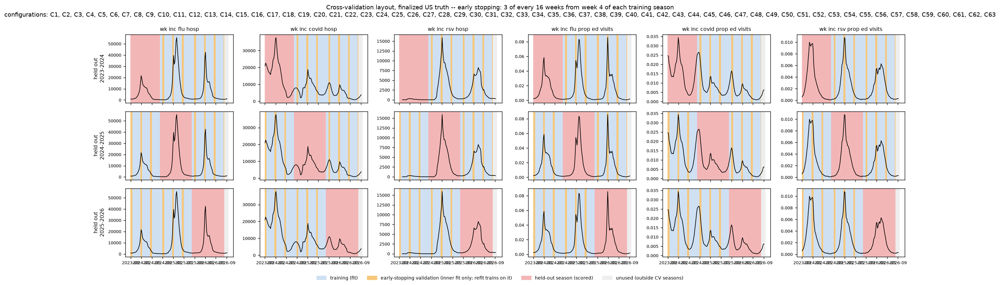{style="width: 1200px"}

</div>

[Open original figure](figures/05d494dbfdec1310.png)

</figure>

## Findings

<!-- write-up: kept across regenerations -->

### Write-up

**Completed 2026-09-25: all 189 runs, 63 configurations, three seeds and three
held-out seasons.** The best configuration is the independent-location pathogen
MLP with compact summaries of the mixed covariate bundle. It improves on its
no-covariate control in all three seeds, but does not beat the Hub ensemble overall.
The main practical result is to keep simple covariate processing and avoid adding
geographic attention by default.

<!-- no-mask-followup:start -->

### Follow-up: removing artificial masking mostly hurt

**All 96 follow-up runs completed: 32 selected formulations × three seeds.**
These were the top half of the original 63-formulation ranking. Every new run
uses the same pinned model code, data hashes, seeds, scoring support and training
settings as its counterpart, except `mask_rate=0.5` becomes `mask_rate=0`.
**Wednesday reporting availability remains unchanged.**

Removing artificial masking worsened the three-seed mean for **29 of 32
formulations**. Only **18 of 96 paired seeds** improved, and **16 formulations
worsened in all three seeds**. Across these selected formulations, the mean
seed-paired relative WIS change was **+6.0%** (median across formulations +5.4%);
positive means removing masking made the score worse.

| Formulation | With artificial masking | Without | Paired WIS change on removal | Seeds improved by removal |
| --- | ---: | ---: | ---: | ---: |
| **Independent, mixed summaries** | **1.036** | **1.121** | **+8.2%** | **0/3** |
| Independent, new flu sources smoothed | 1.049 | 1.115 | +6.3% | 0/3 |
| Independent, Kinsa summaries | 1.063 | 1.208 | +13.8% | 0/3 |
| Pooled, claims summaries | 1.067 | 1.109 | +4.1% | 1/3 |
| Independent, claims smoothed | 1.071 | 1.096 | +2.2% | 1/3 |
| Independent, no covariates | 1.124 | 1.101 | **−1.8%** | 2/3 |
| Attention, no covariates | 1.119 | 1.127 | +1.9% | 1/3 |

The percentages are means of seedwise ratios, not ratios of the displayed means;
this distinction matters when a control has large seed variation. Formulations
are counted as improved when their mean WIS decreases. The three improved means
are independent/no covariates, attention/claims summaries, and attention/new flu
shared encoder. The latter's gain is approximately 0.1%, too small to treat as a
compelling result from three seeds.


#### The original leader remains the model to keep

Mixed summaries without artificial masking get worse both for states/DC
(**+7.8%**) and native US (**+9.7%**), with all three seeds worsening in each.
Its three-seed mean worsens in every held-out season:

| Season | Masked mixed summaries | No-mask mixed summaries |
| --- | ---: | ---: |
| 2023–24 | 1.019 | 1.082 |
| 2024–25 | 0.878 | 0.991 |
| 2025–26 | 1.210 | 1.289 |

The best no-mask mean is independent/smoothed claims at **1.096 ± 0.065** seed SD.
It is only **0.5% better** than the new no-covariate control in the paired
comparison (two of three seeds improve), and it is worse than its own masked
version, 1.071. None of the 32 no-mask configuration means beats the Hub ensemble.
The masked mixed-summary model remains the overall leader at 1.036.

Removing masking also worsened the leading models' interval coverage. Under the
same location/target/season weights, nominal 95% coverage changed:

- Mixed summaries: **84.0% → 81.7%**.
- Smoothed new flu sources: **84.6% → 80.0%**.
- Kinsa summaries: **85.2% → 81.7%**.

Thus the better coverage under masking is not just accompanied by an inferior
WIS tradeoff: the masked versions are better on both measures for these leaders.
All remain undercovered relative to 95%.

#### Paired fan plots, directly on this page

These compare the **same mixed-summary formulation and seed 42**, with and without
artificial masking, against the Hub ensemble. The selected seed is fixed, not
chosen for looking good. Bands are 50% and 90%; the coverage statistics above
refer to separately scored 95% intervals. US and North Carolina illustrate behavior;
the numerical conclusions use all scored locations and all three seeds.


#### What this changes in the interpretation

**Keep artificial masking for the current leading covariate formulations.** The
result is consistent with masking acting as useful regularization or encouraging
use of covariates when target histories are incomplete. This experiment cannot
distinguish those mechanisms. Its effect is conditional: the no-covariate
independent model improves slightly without masking.

**Artificial masking is not the main explanation supported by this experiment
for losing the old B0 performance.** Removing it does not restore B0; even the
unmasked no-covariate control scores 1.101. Full finalized target-history
availability versus Wednesday masks, the changed panel, and exact B0 recipe
reproduction remain separate unresolved comparisons. We should not switch back
to blaming natural reporting gaps: the scored-date availability audit below
already shows most latest targets are present.

**Selection limits the conclusion.** We deliberately reran the best half under
masking, so this comparison favors formulations selected for doing well in that
condition. It is not an unbiased estimate of masking's effect over all 63 models,
and the 96 paired seeds are not 96 independent epidemiological datasets. The
consistent deterioration of the three prior leaders supports retaining their
current settings; a universal claim that masking always helps would be unjustified.
No new training or calibration was launched for this analysis.

Evidence: [32 matched configuration comparisons](no-mask/matched_configurations.csv),
[96 paired seeds by geography](no-mask/paired_seeds.csv),
[season comparisons](no-mask/paired_seasons.csv),
[coverage](no-mask/coverage95.csv), and
[comparison provenance](no-mask/comparison_provenance.json).
Ranking `ranking-981191c4dc56` was generated in patron-node report job **2466709**.
Every matched seed was checked for identical frozen target/season/location/horizon
support, and identical dataset/population/frozen-manifest hashes and evaluation
member count. Early stopping is unchanged but may select different epochs when
masking changes; that is part of the training-procedure comparison.

Reproduce status and ranking on Longleaf:

```bash
.venv/bin/python -m tapestry.experiment.planner status -e forecast-no-mask-top32-v3
.venv/bin/python -m tapestry.experiment.planner rank -e forecast-no-mask-top32-v3
```

<!-- no-mask-followup:end -->

### B0 comparison and reporting availability

**This is not a matched reproduction of B0.** B0 had finalized target histories
without the historical Wednesday publication mask and without the added 50%
artificial masking. This screen masks targets as well as covariates and uses a
different training recipe. That changes the forecasting task. We have not isolated the cause of the difference from B0's 0.883–0.895 results.

A scored-support audit found that most scored target histories contain the latest
week: all admissions in 2025–26 and approximately 95–99% of ED cells. Broad
full-calendar missingness does not establish the cause of the B0 score difference.
The completed no-artificial-mask follow-up above isolates that change; it mostly worsened the selected models.

A previous Saturday's wastewater value absent from the Wednesday snapshot is
unavailable even if final truth now exists. Smoothing can use older reports,
never the withheld value. A separately trained nowcaster was not used here.

### Leading results

Lower relative WIS is better; 1 is Hub ensemble parity. “Paired improvement” is
the mean of `100 × (1 − model/control)` over matched seeds, using the control with
the same geography. It is not the percentage computed from the two displayed means.
SD describes variation across three seeds, not a confidence interval.

| Model | Relative WIS, mean ± seed SD | Paired improvement | Seeds improved |
| --- | ---: | ---: | ---: |
| Independent, no covariates | 1.124 ± 0.062 | — | — |
| **Independent, mixed summaries** | **1.036 ± 0.030** | **7.6%** | **3/3** |
| Independent, new flu sources smoothed | 1.049 ± 0.038 | 6.6% | 3/3 |
| Independent, Kinsa summaries | 1.063 ± 0.025 | 5.3% | 3/3 |
| Pooled geography, claims summaries | 1.067 ± 0.039 | 9.5% versus pooled control | 3/3 |
| Independent, claims smoothed | 1.071 ± 0.035 | 4.4% | 2/3 |

The pooled control is weaker (1.181), so its larger percentage improvement does
not make it the better final model. The winning mean remains **3.6% worse than
the Hub ensemble** under this score; all three winning-model seeds exceed 1.

### 1. The original “covariates do not help” conclusion was too broad

For the independent-location model, the raw mixed bundle scores 1.125, essentially
unchanged from the 1.124 control. Summarizing exactly that bundle gives 1.036.
The mixed bundle contains claims, new ILINet/clinical-lab/FluSurv inputs, wastewater
WVAL-like indices and Kinsa. Its parameter count falls from **152,259 to 114,243**
across the three pathogen models—a 25% reduction. The control has 101,571.

This is consistent with the concern that a long raw covariate history is a poor
representation for this dataset. It does **not** establish excess parameters as
the cause: the summaries also change the statistics and transform the values.
The learned bottleneck is not a general cure: mixed/shared scores 1.140 despite
being compact. Smoothing the new flu bundle is excellent without reducing its
parameter count. Useful inductive structure matters more here than compression
alone.

Across the 15 geography/bundle pairs, smoothing and summaries each beat raw inputs
in 9; the learned encoder does so in 7. None is uniformly superior. Claims
summaries, for example, are poor without pooling even though mixed summaries win.

### 2. The new Delphi sources and national Kinsa are worth retaining

The three new flu sources with smoothing improve overall WIS by 6.6%, with
improvement in every seed. They improve both states/DC (5.3%) and US (11.2%).
These are bundle results; the experiment does not identify whether ILINet,
clinical-lab positivity or FluSurv drives the gain.

Kinsa summaries improve overall WIS by 5.3%. Broadcasting the national series
allows a **5.1% state/DC improvement, in all three seeds**, despite the absence of
learned spatial exchange. Its US improvement is 6.0%, but only two of three seeds
improve there. Raw Kinsa alone (1.128) does not improve the independent control.

The winning mixed-summary model improves states/DC by 6.7% and US by 11.0%, with
all three seeds improving in each geography. National gains are therefore not
merely hiding worse state forecasts. We cannot attribute the mixed model's gain
to any single source without leave-one-source-out comparisons.

Wastewater alone is less compelling: raw inputs score 1.191, summaries 1.100;
the summary arm improves on the control in two seeds, but trails the other leaders.
There is not enough evidence here to call wastewater useless or to credit it for
the mixed model's improvement.

### 3. More geographic sharing usually made things worse

The no-covariate means are 1.124 (independent), 1.181 (pooled) and 1.119 (attention).
Attention's tiny mean advantage comes with much larger seed SD: 0.146 versus
0.062 for the independent control.

Keeping bundle and representation matched, **attention wins only 5/21 comparisons**
and pooling only 4/21. The best attention arm, raw Kinsa, scores 1.079; only one
seed improves against its attention control. The mixed-summary winner deteriorates
from 1.036 to 1.210 with attention. Pooling plus claims summaries is a useful
exception, but does not surpass the best independent model.

This screen does not support the hypothesis that covariates generally need
nationwide attention to become useful. It tests equal-state context pooling and
all-location attention, not adjacency, distance-based structure, regional models
or population-weighted pooling. Kinsa is a national input even in the independent
architecture, so “independent” does not mean “without national information.”

### 4. There are remaining season and calibration weaknesses

| Model | 2023–24 | 2024–25 | 2025–26 |
| --- | ---: | ---: | ---: |
| Independent, no covariates | 1.077 | 0.966 | 1.329 |
| Mixed summaries | 1.019 | 0.878 | 1.210 |
| New flu sources smoothed | 0.956 | 0.921 | 1.271 |
| Kinsa summaries | 0.989 | 0.875 | 1.325 |

Mixed summaries improve the mean in all three seasons, although not every
seed-season pair improves. Kinsa contributes almost no mean improvement in
2025–26. The new flu bundle is particularly good in 2023–24, when the benchmark
supports only flu admissions.

**The seasons do not contain the same scored targets:** 2023–24 has flu admissions;
2024–25 has flu and COVID admissions; 2025–26 has all six targets. Therefore the
higher last-season score cannot be interpreted purely as a temporal failure.
COVID ED is a conspicuous weakness: the mixed-summary model's relative WIS is
2.157 on that target. Its flu admissions score is 0.967, COVID admissions 1.100,
RSV admissions 1.001, flu ED 1.187 and RSV ED 0.894. These target scores use their
available seasons and should not be averaged to reconstruct the combined score.

The best model's nominal 95% intervals cover only **84.0%** under the same
location/target/season weighting; the control covers 85.0% and the ensemble 90.7%.
Better WIS has not resolved undercoverage. Calibration and COVID ED diagnostics
are more justified next steps than increasing geographic complexity.

### What to take forward

1. Use **independent-location mixed summaries** as the primary candidate and
   **smoothed new flu sources** as the simpler alternative.
2. Keep **Kinsa summaries** as a compact national-signal comparator.
3. Confirm these shortlisted models on a genuinely new evaluation period before
   declaring a winner. Three seeds measure optimization variability, not three
   independent epidemiological replications; selecting among 63 configurations
   on these same folds introduces selection optimism.
4. Examine COVID ED errors and interval calibration. Any calibration parameters
   must be fitted outside the final evaluation data.
5. If further source attribution is needed, drop one group at a time from the
   winning mixed representation. These runs were not a factorial source-ablation
   study and cannot separate individual source effects.

No further training or calibration was launched for this report.

### Ensemble-support audit

A direct audit of the original leading model (seed 42) verified **56,662 scored
forecast cells across nine target/season cases**. Every scored cell has both a
model forecast and the named official Hub ensemble forecast, matched on reference
date, target-end date, location and horizon within its target/season. There are
**zero missing ensemble rows, zero missing model rows, zero duplicate ensemble
keys and zero truth mismatches**. Both forecasts use the same frozen observed value
and 23-quantile grid. The model's extra predictions outside ensemble support are
excluded. No ensemble forecast is imputed. Horizon 0 ends on the reference Saturday;
the model's context ends one week before that Saturday.

This audit checks the saved benchmark, not every historical upstream submission.
Within each saved case, frozen units exactly equal the available ensemble rows.
The shared scorer applies the same matching requirements to every fitted run and
raises on missing or duplicate forecast tasks. Earlier ranking checks also verified
identical support across all runs. This rules out scoring model-only weeks as an
explanation for the current comparison; it does not by itself prove equivalence
to the old B0 training/data protocol. Both forecasts are scored against **frozen
benchmark truth**, which need not equal the most recently rebuilt training panel.

[Per-case support counts](ensemble_support_audit.csv) ·
[Audit record](ensemble_support_audit.json). The shared scorer verifies frozen support for each ranking.

### Reproduction

Use `planner status -e forecast-geography-v2` to inspect completed runs and
`planner rank -e forecast-geography-v2` for canonical scoring, matched comparisons,
plots and report regeneration. Saved evidence accompanies this report. See
[Workflow](../../workflow.md#analyze-a-run) for methods and commands.

<!-- end write-up -->

## Forecast fans

### Fan plots: the three leading models

Shown directly below: the Hub ensemble, mixed covariate summaries, smoothed new
flu covariates, and Kinsa summaries. The models were selected by three-seed mean
WIS; all fans use **seed 42**, not the best seed. Black curves are final truth;
fans show medians and 50%/90% intervals at four-week reference intervals.
The native US and North Carolina are shown; these are illustrative locations,
not substitutes for all-location scores. Hub fans appear only where benchmark
support exists.

#### US admissions


#### US ED proportions


#### North Carolina admissions


#### North Carolina ED proportions

<figure class="report-figure" markdown="1">

<figcaption>fans-US-hosp</figcaption>

<div class="report-plot" markdown="1">

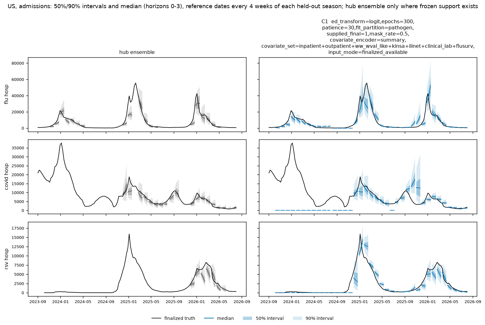{style="width: 1200px"}

</div>

[Open original figure](figures/3edca13b3c825ffd.png)

</figure>

<figure class="report-figure" markdown="1">

<figcaption>fans-US-ed</figcaption>

<div class="report-plot" markdown="1">

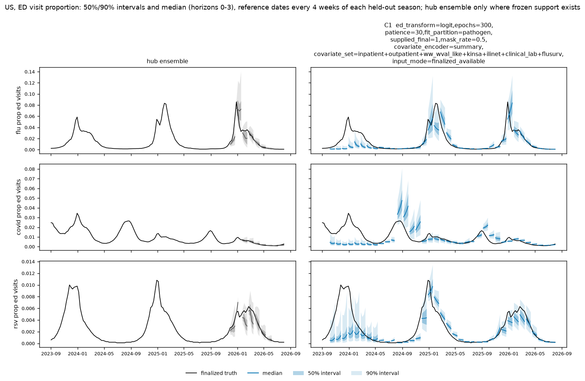{style="width: 1200px"}

</div>

[Open original figure](figures/8fc1dcbe49ae3610.png)

</figure>

<figure class="report-figure" markdown="1">

<figcaption>fans-NC-hosp</figcaption>

<div class="report-plot" markdown="1">

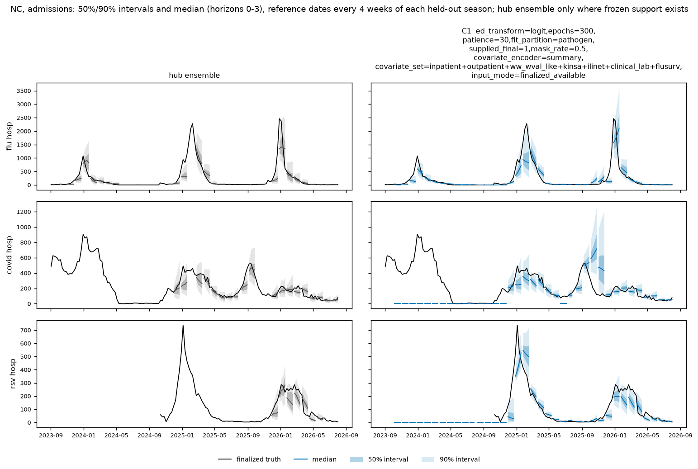{style="width: 1200px"}

</div>

[Open original figure](figures/238d95ffb179ad77.png)

</figure>

<figure class="report-figure" markdown="1">

<figcaption>fans-NC-ed</figcaption>

<div class="report-plot" markdown="1">

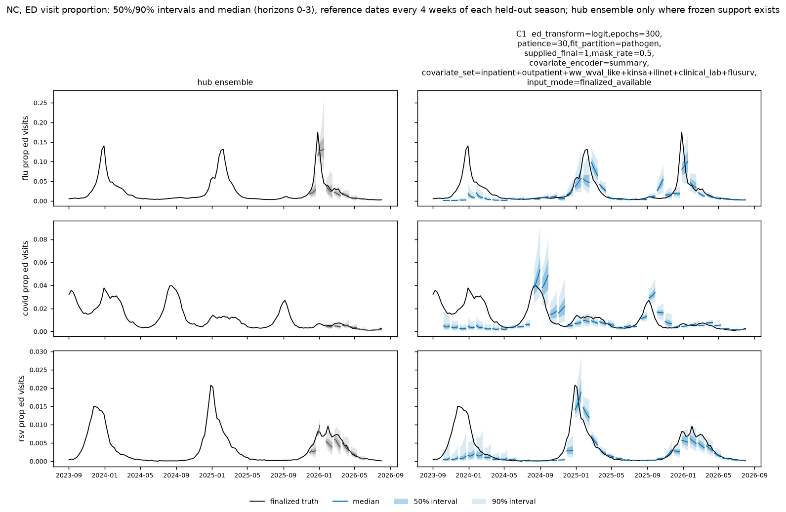{style="width: 1200px"}

</div>

[Open original figure](figures/7d4eaad2a98aa3c2.png)

</figure>

<figure class="report-figure" markdown="1">

<figcaption>US admissions: Hub ensemble and three leading models</figcaption>

<div class="report-plot" markdown="1">

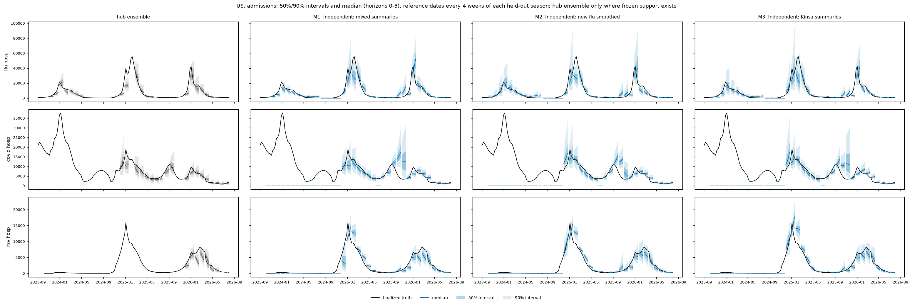{style="width: 1200px"}

</div>

[Open original figure](best-fans/fans-US-hosp.png)

</figure>

<figure class="report-figure" markdown="1">

<figcaption>US ED proportions: Hub ensemble and three leading models</figcaption>

<div class="report-plot" markdown="1">

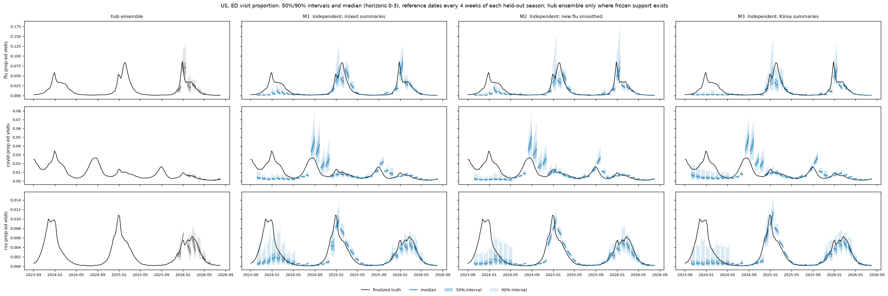{style="width: 1200px"}

</div>

[Open original figure](best-fans/fans-US-ed.png)

</figure>

<figure class="report-figure" markdown="1">

<figcaption>North Carolina admissions: Hub ensemble and three leading models</figcaption>

<div class="report-plot" markdown="1">

{style="width: 1200px"}

</div>

[Open original figure](best-fans/fans-NC-hosp.png)

</figure>

<figure class="report-figure" markdown="1">

<figcaption>North Carolina ED proportions: Hub ensemble and three leading models</figcaption>

<div class="report-plot" markdown="1">

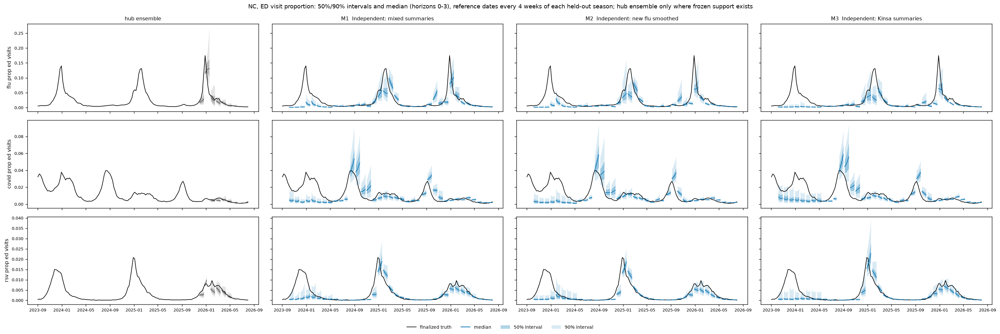{style="width: 1200px"}

</div>

[Open original figure](best-fans/fans-NC-ed.png)

</figure>

## Score diagnostics

<figure class="report-figure" markdown="1">

<figcaption>dotplot</figcaption>

<div class="report-plot" markdown="1">

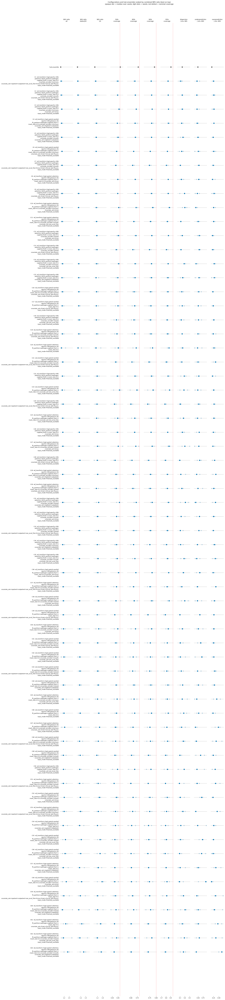{style="width: 1200px"}

</div>

[Open original figure](figures/74b5647f9e51d729.png)

</figure>

<figure class="report-figure" markdown="1">

<figcaption>heatmap-C1</figcaption>

<div class="report-plot" markdown="1">

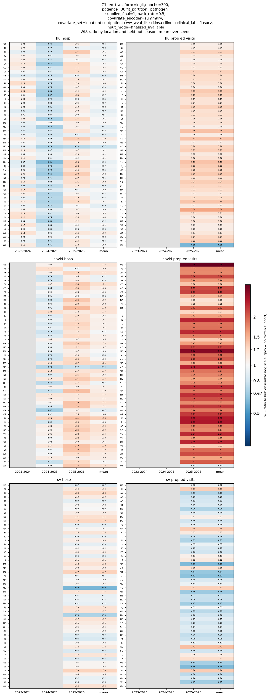{style="width: 1182px"}

</div>

[Open original figure](figures/1cce5cbf3b6404ba.png)

</figure>

<figure class="report-figure" markdown="1">

<figcaption>Paired artificial-masking comparison for all 32 formulations</figcaption>

<div class="report-plot" markdown="1">

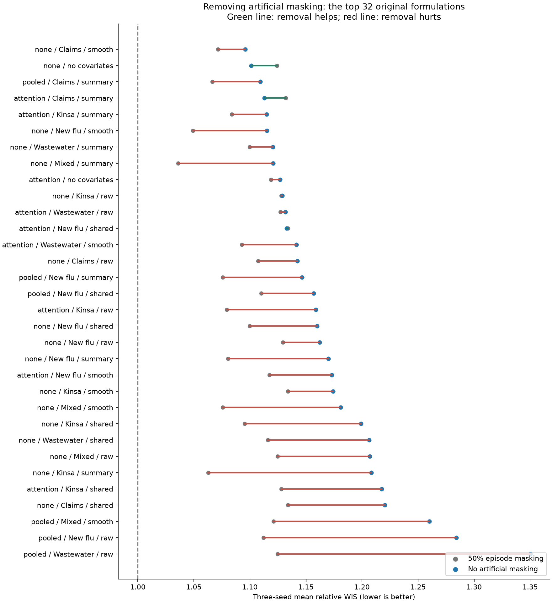{style="width: 1200px"}

</div>

[Open original figure](no-mask/matched-masking.png)

</figure>

<figure class="report-figure" markdown="1">

<figcaption>US admissions: original leader with and without artificial masking</figcaption>

<div class="report-plot" markdown="1">

{style="width: 1200px"}

</div>

[Open original figure](no-mask/fans-US-hosp.png)

</figure>

<figure class="report-figure" markdown="1">

<figcaption>US ED: original leader with and without artificial masking</figcaption>

<div class="report-plot" markdown="1">

{style="width: 1200px"}

</div>

[Open original figure](no-mask/fans-US-ed.png)

</figure>

<figure class="report-figure" markdown="1">

<figcaption>North Carolina admissions: original leader with and without artificial masking</figcaption>

<div class="report-plot" markdown="1">

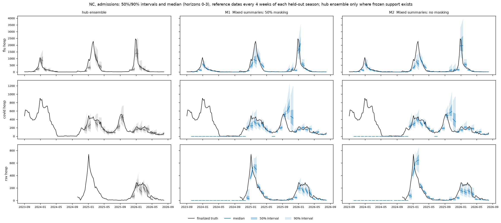{style="width: 1200px"}

</div>

[Open original figure](no-mask/fans-NC-hosp.png)

</figure>

<figure class="report-figure" markdown="1">

<figcaption>North Carolina ED: original leader with and without artificial masking</figcaption>

<div class="report-plot" markdown="1">

{style="width: 1200px"}

</div>

[Open original figure](no-mask/fans-NC-ed.png)

</figure>

<figure class="report-figure" markdown="1">

<figcaption>Leading models and individual seeds</figcaption>

<div class="report-plot" markdown="1">

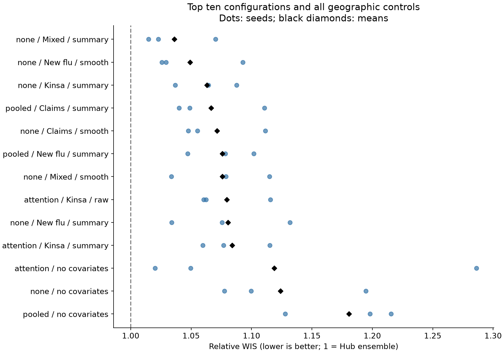{style="width: 1200px"}

</div>

[Open original figure](leaders-and-seeds.png)

</figure>

<figure class="report-figure" markdown="1">

<figcaption>Covariate effects against matched controls</figcaption>

<div class="report-plot" markdown="1">

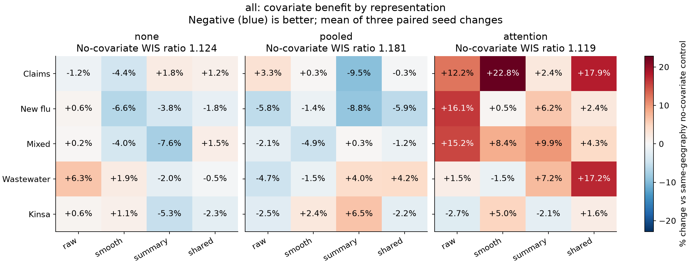{style="width: 1200px"}

</div>

[Open original figure](covariate-effects-overall.png)

</figure>

<figure class="report-figure" markdown="1">

<figcaption>State and DC effects</figcaption>

<div class="report-plot" markdown="1">

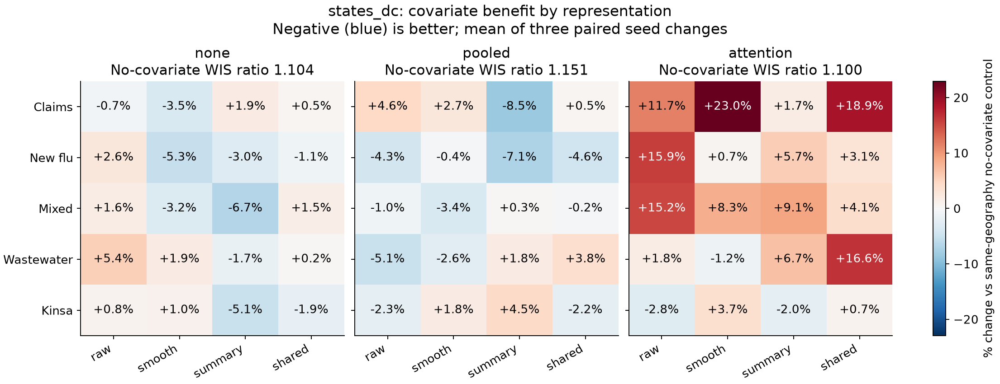{style="width: 1200px"}

</div>

[Open original figure](covariate-effects-states.png)

</figure>

<figure class="report-figure" markdown="1">

<figcaption>US effects</figcaption>

<div class="report-plot" markdown="1">

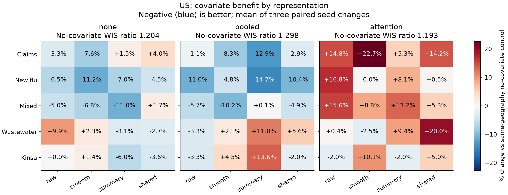{style="width: 1200px"}

</div>

[Open original figure](covariate-effects-us.png)

</figure>

<figure class="report-figure" markdown="1">

<figcaption>Leading models across seasons</figcaption>

<div class="report-plot" markdown="1">

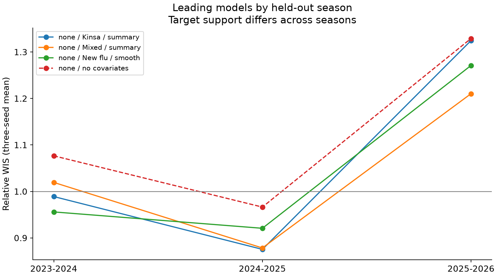{style="width: 1200px"}

</div>

[Open original figure](leading-seasons.png)

</figure>

## Matched comparisons

No known result or figure.

## Full ranking

### Ranking

| Label | Configuration | Seeds | Combined | States/DC | US | wk inc flu hosp | wk inc covid hosp | wk inc rsv hosp | wk inc flu prop ed visits | wk inc covid prop ed visits | wk inc rsv prop ed visits |
|---|---|---|---|---|---|---|---|---|---|---|---|
| C1 | `ed_transform=logit,epochs=300,patience=30,fit_partition=pathogen,supplied_final=1,mask_rate=0.5,covariate_encoder=summary,covariate_set=inpatient+outpatient+ww_wval_like+kinsa+ilinet+clinical_lab+flusurv,input_mode=finalized_available` | 3 | 1.036 ± 0.030 | 1.028 | 1.067 | 0.967 | 1.100 | 1.001 | 1.187 | 2.157 | 0.894 |
| C2 | `ed_transform=logit,epochs=300,patience=30,fit_partition=pathogen,supplied_final=1,mask_rate=0.5,covariate_encoder=smooth,covariate_set=ilinet+clinical_lab+flusurv,input_mode=finalized_available` | 3 | 1.049 ± 0.038 | 1.045 | 1.067 | 0.974 | 1.176 | 1.080 | 1.127 | 2.114 | 1.084 |
| C3 | `ed_transform=logit,epochs=300,patience=30,fit_partition=pathogen,supplied_final=1,mask_rate=0.5,covariate_encoder=summary,covariate_set=kinsa,input_mode=finalized_available` | 3 | 1.063 ± 0.025 | 1.047 | 1.126 | 0.978 | 1.197 | 1.000 | 1.161 | 2.728 | 0.854 |
| C4 | `ed_transform=logit,spatial=pooled,epochs=300,patience=30,fit_partition=pathogen,supplied_final=1,mask_rate=0.5,covariate_encoder=summary,covariate_set=inpatient+outpatient,input_mode=finalized_available` | 3 | 1.067 ± 0.039 | 1.051 | 1.128 | 0.979 | 1.151 | 1.116 | 1.262 | 2.139 | 1.274 |
| C5 | `ed_transform=logit,epochs=300,patience=30,fit_partition=pathogen,supplied_final=1,mask_rate=0.5,covariate_encoder=smooth,covariate_set=inpatient+outpatient,input_mode=finalized_available` | 3 | 1.071 ± 0.035 | 1.063 | 1.105 | 1.000 | 1.142 | 1.242 | 1.202 | 1.959 | 0.938 |
| C6 | `ed_transform=logit,spatial=pooled,epochs=300,patience=30,fit_partition=pathogen,supplied_final=1,mask_rate=0.5,covariate_encoder=summary,covariate_set=ilinet+clinical_lab+flusurv,input_mode=finalized_available` | 3 | 1.076 ± 0.028 | 1.068 | 1.107 | 0.990 | 1.095 | 1.228 | 1.323 | 1.498 | 1.211 |
| C7 | `ed_transform=logit,epochs=300,patience=30,fit_partition=pathogen,supplied_final=1,mask_rate=0.5,covariate_encoder=smooth,covariate_set=inpatient+outpatient+ww_wval_like+kinsa+ilinet+clinical_lab+flusurv,input_mode=finalized_available` | 3 | 1.076 ± 0.041 | 1.067 | 1.113 | 1.024 | 1.128 | 1.258 | 1.284 | 2.093 | 0.967 |
| C8 | `ed_transform=logit,spatial=attention,epochs=300,patience=30,fit_partition=pathogen,supplied_final=1,mask_rate=0.5,covariate_set=kinsa,input_mode=finalized_available` | 3 | 1.079 ± 0.031 | 1.062 | 1.149 | 0.964 | 1.173 | 1.082 | 1.229 | 2.675 | 1.071 |
| C9 | `ed_transform=logit,epochs=300,patience=30,fit_partition=pathogen,supplied_final=1,mask_rate=0.5,covariate_encoder=summary,covariate_set=ilinet+clinical_lab+flusurv,input_mode=finalized_available` | 3 | 1.080 ± 0.049 | 1.071 | 1.118 | 1.021 | 1.155 | 1.153 | 1.189 | 1.911 | 0.935 |
| C10 | `ed_transform=logit,spatial=attention,epochs=300,patience=30,fit_partition=pathogen,supplied_final=1,mask_rate=0.5,covariate_encoder=summary,covariate_set=kinsa,input_mode=finalized_available` | 3 | 1.084 ± 0.028 | 1.070 | 1.141 | 1.012 | 1.121 | 0.912 | 1.249 | 2.229 | 0.952 |
| C11 | `ed_transform=logit,spatial=attention,epochs=300,patience=30,fit_partition=pathogen,supplied_final=1,mask_rate=0.5,covariate_encoder=smooth,covariate_set=ww_wval_like,input_mode=finalized_available` | 3 | 1.093 ± 0.036 | 1.081 | 1.142 | 0.978 | 1.164 | 1.263 | 1.232 | 2.492 | 1.428 |
| C12 | `ed_transform=logit,epochs=300,patience=30,fit_partition=pathogen,supplied_final=1,mask_rate=0.5,covariate_encoder=shared,covariate_set=kinsa,input_mode=finalized_available` | 3 | 1.095 ± 0.018 | 1.081 | 1.153 | 1.027 | 1.168 | 1.057 | 1.228 | 2.591 | 0.972 |
| C13 | `ed_transform=logit,epochs=300,patience=30,fit_partition=pathogen,supplied_final=1,mask_rate=0.5,covariate_encoder=shared,covariate_set=ilinet+clinical_lab+flusurv,input_mode=finalized_available` | 3 | 1.100 ± 0.045 | 1.090 | 1.140 | 0.976 | 1.254 | 1.295 | 1.223 | 2.141 | 1.291 |
| C14 | `ed_transform=logit,epochs=300,patience=30,fit_partition=pathogen,supplied_final=1,mask_rate=0.5,covariate_encoder=summary,covariate_set=ww_wval_like,input_mode=finalized_available` | 3 | 1.100 ± 0.038 | 1.085 | 1.158 | 1.033 | 1.165 | 1.029 | 1.315 | 2.185 | 1.023 |
| C15 | `ed_transform=logit,epochs=300,patience=30,fit_partition=pathogen,supplied_final=1,mask_rate=0.5,covariate_set=inpatient+outpatient,input_mode=finalized_available` | 3 | 1.107 ± 0.060 | 1.095 | 1.158 | 1.026 | 1.155 | 1.180 | 1.264 | 2.079 | 1.102 |
| C16 | `ed_transform=logit,spatial=pooled,epochs=300,patience=30,fit_partition=pathogen,supplied_final=1,mask_rate=0.5,covariate_encoder=shared,covariate_set=ilinet+clinical_lab+flusurv,input_mode=finalized_available` | 3 | 1.110 ± 0.050 | 1.097 | 1.163 | 1.074 | 1.095 | 1.061 | 1.368 | 1.714 | 0.913 |
| C17 | `ed_transform=logit,spatial=pooled,epochs=300,patience=30,fit_partition=pathogen,supplied_final=1,mask_rate=0.5,covariate_set=ilinet+clinical_lab+flusurv,input_mode=finalized_available` | 3 | 1.112 ± 0.061 | 1.101 | 1.155 | 1.036 | 1.087 | 1.432 | 1.266 | 1.670 | 1.329 |
| C18 | `ed_transform=logit,epochs=300,patience=30,fit_partition=pathogen,supplied_final=1,mask_rate=0.5,covariate_encoder=shared,covariate_set=ww_wval_like,input_mode=finalized_available` | 3 | 1.116 ± 0.079 | 1.104 | 1.162 | 1.031 | 1.209 | 1.241 | 1.189 | 2.354 | 1.142 |
| C19 | `ed_transform=logit,spatial=attention,epochs=300,patience=30,fit_partition=pathogen,supplied_final=1,mask_rate=0.5,covariate_encoder=smooth,covariate_set=ilinet+clinical_lab+flusurv,input_mode=finalized_available` | 3 | 1.117 ± 0.066 | 1.103 | 1.175 | 1.056 | 1.179 | 1.231 | 1.299 | 1.613 | 1.360 |
| C20 | `ed_transform=logit,spatial=attention,epochs=300,patience=30,fit_partition=pathogen,supplied_final=1,mask_rate=0.5,input_mode=finalized_available` | 3 | 1.119 ± 0.146 | 1.100 | 1.193 | 1.041 | 1.152 | 1.015 | 1.321 | 2.234 | 0.854 |
| C21 | `ed_transform=logit,spatial=pooled,epochs=300,patience=30,fit_partition=pathogen,supplied_final=1,mask_rate=0.5,covariate_encoder=smooth,covariate_set=inpatient+outpatient+ww_wval_like+kinsa+ilinet+clinical_lab+flusurv,input_mode=finalized_available` | 3 | 1.121 ± 0.043 | 1.110 | 1.163 | 1.055 | 1.190 | 1.131 | 1.284 | 1.784 | 0.998 |
| C22 | `ed_transform=logit,epochs=300,patience=30,fit_partition=pathogen,supplied_final=1,mask_rate=0.5,input_mode=finalized_available` | 3 | 1.124 ± 0.062 | 1.104 | 1.204 | 0.982 | 1.251 | 1.216 | 1.180 | 2.450 | 1.022 |
| C23 | `ed_transform=logit,spatial=pooled,epochs=300,patience=30,fit_partition=pathogen,supplied_final=1,mask_rate=0.5,covariate_set=ww_wval_like,input_mode=finalized_available` | 3 | 1.125 ± 0.091 | 1.092 | 1.256 | 1.043 | 1.145 | 1.177 | 1.296 | 1.831 | 1.214 |
| C24 | `ed_transform=logit,epochs=300,patience=30,fit_partition=pathogen,supplied_final=1,mask_rate=0.5,covariate_set=inpatient+outpatient+ww_wval_like+kinsa+ilinet+clinical_lab+flusurv,input_mode=finalized_available` | 3 | 1.125 ± 0.060 | 1.121 | 1.140 | 1.071 | 1.140 | 1.228 | 1.271 | 2.032 | 1.037 |
| C25 | `ed_transform=logit,spatial=attention,epochs=300,patience=30,fit_partition=pathogen,supplied_final=1,mask_rate=0.5,covariate_set=ww_wval_like,input_mode=finalized_available` | 3 | 1.127 ± 0.059 | 1.113 | 1.182 | 1.033 | 1.140 | 1.229 | 1.187 | 2.278 | 1.404 |
| C26 | `ed_transform=logit,epochs=300,patience=30,fit_partition=pathogen,supplied_final=1,mask_rate=0.5,covariate_set=kinsa,input_mode=finalized_available` | 3 | 1.128 ± 0.014 | 1.111 | 1.196 | 1.008 | 1.267 | 1.287 | 1.267 | 2.719 | 1.062 |
| C27 | `ed_transform=logit,spatial=attention,epochs=300,patience=30,fit_partition=pathogen,supplied_final=1,mask_rate=0.5,covariate_encoder=shared,covariate_set=kinsa,input_mode=finalized_available` | 3 | 1.128 ± 0.049 | 1.102 | 1.234 | 1.000 | 1.216 | 1.185 | 1.256 | 2.645 | 1.177 |
| C28 | `ed_transform=logit,epochs=300,patience=30,fit_partition=pathogen,supplied_final=1,mask_rate=0.5,covariate_set=ilinet+clinical_lab+flusurv,input_mode=finalized_available` | 3 | 1.129 ± 0.061 | 1.131 | 1.123 | 1.024 | 1.230 | 1.412 | 1.131 | 2.297 | 1.269 |
| C29 | `ed_transform=logit,spatial=attention,epochs=300,patience=30,fit_partition=pathogen,supplied_final=1,mask_rate=0.5,covariate_encoder=summary,covariate_set=inpatient+outpatient,input_mode=finalized_available` | 3 | 1.132 ± 0.040 | 1.108 | 1.227 | 1.023 | 1.197 | 1.262 | 1.127 | 2.354 | 1.149 |
| C30 | `ed_transform=logit,spatial=attention,epochs=300,patience=30,fit_partition=pathogen,supplied_final=1,mask_rate=0.5,covariate_encoder=shared,covariate_set=ilinet+clinical_lab+flusurv,input_mode=finalized_available` | 3 | 1.134 ± 0.045 | 1.126 | 1.165 | 1.079 | 1.139 | 1.173 | 1.334 | 1.781 | 1.009 |
| C31 | `ed_transform=logit,epochs=300,patience=30,fit_partition=pathogen,supplied_final=1,mask_rate=0.5,covariate_encoder=shared,covariate_set=inpatient+outpatient,input_mode=finalized_available` | 3 | 1.134 ± 0.048 | 1.107 | 1.240 | 1.034 | 1.178 | 1.110 | 1.234 | 2.216 | 0.973 |
| C32 | `ed_transform=logit,epochs=300,patience=30,fit_partition=pathogen,supplied_final=1,mask_rate=0.5,covariate_encoder=smooth,covariate_set=kinsa,input_mode=finalized_available` | 3 | 1.134 ± 0.017 | 1.114 | 1.213 | 1.020 | 1.266 | 1.287 | 1.267 | 2.719 | 1.062 |
| C33 | `ed_transform=logit,epochs=300,patience=30,fit_partition=pathogen,supplied_final=1,mask_rate=0.5,covariate_encoder=shared,covariate_set=inpatient+outpatient+ww_wval_like+kinsa+ilinet+clinical_lab+flusurv,input_mode=finalized_available` | 3 | 1.140 ± 0.060 | 1.120 | 1.223 | 1.053 | 1.151 | 1.230 | 1.185 | 2.238 | 1.336 |
| C34 | `ed_transform=logit,epochs=300,patience=30,fit_partition=pathogen,supplied_final=1,mask_rate=0.5,covariate_encoder=summary,covariate_set=inpatient+outpatient,input_mode=finalized_available` | 3 | 1.142 ± 0.063 | 1.123 | 1.217 | 1.063 | 1.229 | 0.974 | 1.266 | 2.622 | 0.804 |
| C35 | `ed_transform=logit,epochs=300,patience=30,fit_partition=pathogen,supplied_final=1,mask_rate=0.5,covariate_encoder=smooth,covariate_set=ww_wval_like,input_mode=finalized_available` | 3 | 1.144 ± 0.026 | 1.123 | 1.227 | 1.031 | 1.204 | 1.286 | 1.250 | 2.852 | 1.086 |
| C36 | `ed_transform=logit,spatial=pooled,epochs=300,patience=30,fit_partition=pathogen,supplied_final=1,mask_rate=0.5,covariate_set=kinsa,input_mode=finalized_available` | 3 | 1.151 ± 0.062 | 1.125 | 1.257 | 1.085 | 1.162 | 1.186 | 1.325 | 1.790 | 1.216 |
| C37 | `ed_transform=logit,spatial=attention,epochs=300,patience=30,fit_partition=pathogen,supplied_final=1,mask_rate=0.5,covariate_encoder=shared,covariate_set=inpatient+outpatient+ww_wval_like+kinsa+ilinet+clinical_lab+flusurv,input_mode=finalized_available` | 3 | 1.154 ± 0.021 | 1.136 | 1.227 | 1.050 | 1.159 | 1.256 | 1.331 | 2.241 | 1.287 |
| C38 | `ed_transform=logit,spatial=pooled,epochs=300,patience=30,fit_partition=pathogen,supplied_final=1,mask_rate=0.5,covariate_encoder=shared,covariate_set=kinsa,input_mode=finalized_available` | 3 | 1.154 ± 0.039 | 1.125 | 1.272 | 1.091 | 1.140 | 1.107 | 1.296 | 1.879 | 0.997 |
| C39 | `ed_transform=logit,spatial=pooled,epochs=300,patience=30,fit_partition=pathogen,supplied_final=1,mask_rate=0.5,covariate_set=inpatient+outpatient+ww_wval_like+kinsa+ilinet+clinical_lab+flusurv,input_mode=finalized_available` | 3 | 1.156 ± 0.031 | 1.139 | 1.223 | 1.069 | 1.217 | 1.286 | 1.286 | 1.760 | 1.309 |
| C40 | `ed_transform=logit,spatial=attention,epochs=300,patience=30,fit_partition=pathogen,supplied_final=1,mask_rate=0.5,covariate_encoder=smooth,covariate_set=kinsa,input_mode=finalized_available` | 3 | 1.161 ± 0.107 | 1.131 | 1.283 | 1.011 | 1.284 | 1.120 | 1.210 | 2.904 | 1.062 |
| C41 | `ed_transform=logit,spatial=pooled,epochs=300,patience=30,fit_partition=pathogen,supplied_final=1,mask_rate=0.5,covariate_encoder=smooth,covariate_set=ilinet+clinical_lab+flusurv,input_mode=finalized_available` | 3 | 1.162 ± 0.037 | 1.144 | 1.234 | 1.090 | 1.106 | 1.172 | 1.345 | 2.207 | 1.143 |
| C42 | `ed_transform=logit,spatial=pooled,epochs=300,patience=30,fit_partition=pathogen,supplied_final=1,mask_rate=0.5,covariate_encoder=smooth,covariate_set=ww_wval_like,input_mode=finalized_available` | 3 | 1.164 ± 0.114 | 1.123 | 1.329 | 1.086 | 1.136 | 1.178 | 1.367 | 1.834 | 1.140 |
| C43 | `ed_transform=logit,spatial=pooled,epochs=300,patience=30,fit_partition=pathogen,supplied_final=1,mask_rate=0.5,covariate_encoder=shared,covariate_set=inpatient+outpatient+ww_wval_like+kinsa+ilinet+clinical_lab+flusurv,input_mode=finalized_available` | 3 | 1.166 ± 0.064 | 1.149 | 1.234 | 1.103 | 1.152 | 1.161 | 1.416 | 1.904 | 1.207 |
| C44 | `ed_transform=logit,spatial=pooled,epochs=300,patience=30,fit_partition=pathogen,supplied_final=1,mask_rate=0.5,covariate_encoder=shared,covariate_set=inpatient+outpatient,input_mode=finalized_available` | 3 | 1.178 ± 0.073 | 1.157 | 1.260 | 1.063 | 1.162 | 1.304 | 1.346 | 1.900 | 1.224 |
| C45 | `ed_transform=logit,spatial=attention,epochs=300,patience=30,fit_partition=pathogen,supplied_final=1,mask_rate=0.5,covariate_encoder=summary,covariate_set=ww_wval_like,input_mode=finalized_available` | 3 | 1.180 ± 0.141 | 1.159 | 1.260 | 1.102 | 1.131 | 1.106 | 1.213 | 2.214 | 1.087 |
| C46 | `ed_transform=logit,spatial=pooled,epochs=300,patience=30,fit_partition=pathogen,supplied_final=1,mask_rate=0.5,input_mode=finalized_available` | 3 | 1.181 ± 0.046 | 1.151 | 1.298 | 1.104 | 1.106 | 1.286 | 1.258 | 1.776 | 1.034 |
| C47 | `ed_transform=logit,spatial=attention,epochs=300,patience=30,fit_partition=pathogen,supplied_final=1,mask_rate=0.5,covariate_encoder=summary,covariate_set=ilinet+clinical_lab+flusurv,input_mode=finalized_available` | 3 | 1.181 ± 0.101 | 1.158 | 1.272 | 1.099 | 1.131 | 1.048 | 1.128 | 1.993 | 0.842 |
| C48 | `ed_transform=logit,spatial=pooled,epochs=300,patience=30,fit_partition=pathogen,supplied_final=1,mask_rate=0.5,covariate_encoder=summary,covariate_set=inpatient+outpatient+ww_wval_like+kinsa+ilinet+clinical_lab+flusurv,input_mode=finalized_available` | 3 | 1.184 ± 0.160 | 1.155 | 1.300 | 1.117 | 1.086 | 1.231 | 1.278 | 1.896 | 1.027 |
| C49 | `ed_transform=logit,spatial=pooled,epochs=300,patience=30,fit_partition=pathogen,supplied_final=1,mask_rate=0.5,covariate_encoder=smooth,covariate_set=inpatient+outpatient,input_mode=finalized_available` | 3 | 1.184 ± 0.118 | 1.183 | 1.190 | 1.111 | 1.164 | 1.271 | 1.398 | 1.671 | 1.155 |
| C50 | `ed_transform=logit,epochs=300,patience=30,fit_partition=pathogen,supplied_final=1,mask_rate=0.5,covariate_set=ww_wval_like,input_mode=finalized_available` | 3 | 1.191 ± 0.064 | 1.161 | 1.311 | 1.093 | 1.191 | 1.333 | 1.253 | 2.865 | 1.135 |
| C51 | `ed_transform=logit,spatial=attention,epochs=300,patience=30,fit_partition=pathogen,supplied_final=1,mask_rate=0.5,covariate_encoder=smooth,covariate_set=inpatient+outpatient+ww_wval_like+kinsa+ilinet+clinical_lab+flusurv,input_mode=finalized_available` | 3 | 1.196 ± 0.134 | 1.178 | 1.265 | 1.129 | 1.147 | 1.150 | 1.254 | 1.818 | 0.945 |
| C52 | `ed_transform=logit,spatial=pooled,epochs=300,patience=30,fit_partition=pathogen,supplied_final=1,mask_rate=0.5,covariate_encoder=smooth,covariate_set=kinsa,input_mode=finalized_available` | 3 | 1.208 ± 0.004 | 1.171 | 1.355 | 1.154 | 1.161 | 1.125 | 1.292 | 1.792 | 1.169 |
| C53 | `ed_transform=logit,spatial=attention,epochs=300,patience=30,fit_partition=pathogen,supplied_final=1,mask_rate=0.5,covariate_encoder=summary,covariate_set=inpatient+outpatient+ww_wval_like+kinsa+ilinet+clinical_lab+flusurv,input_mode=finalized_available` | 3 | 1.210 ± 0.096 | 1.186 | 1.309 | 1.134 | 1.138 | 1.058 | 1.154 | 2.169 | 0.985 |
| C54 | `ed_transform=logit,spatial=pooled,epochs=300,patience=30,fit_partition=pathogen,supplied_final=1,mask_rate=0.5,covariate_set=inpatient+outpatient,input_mode=finalized_available` | 3 | 1.219 ± 0.154 | 1.203 | 1.283 | 1.162 | 1.128 | 1.311 | 1.370 | 1.813 | 1.088 |
| C55 | `ed_transform=logit,spatial=pooled,epochs=300,patience=30,fit_partition=pathogen,supplied_final=1,mask_rate=0.5,covariate_encoder=shared,covariate_set=ww_wval_like,input_mode=finalized_available` | 3 | 1.228 ± 0.091 | 1.193 | 1.369 | 1.182 | 1.138 | 1.122 | 1.317 | 1.644 | 1.096 |
| C56 | `ed_transform=logit,spatial=pooled,epochs=300,patience=30,fit_partition=pathogen,supplied_final=1,mask_rate=0.5,covariate_encoder=summary,covariate_set=ww_wval_like,input_mode=finalized_available` | 3 | 1.229 ± 0.103 | 1.172 | 1.454 | 1.164 | 1.153 | 1.145 | 1.286 | 1.582 | 1.100 |
| C57 | `ed_transform=logit,spatial=attention,epochs=300,patience=30,fit_partition=pathogen,supplied_final=1,mask_rate=0.5,covariate_set=inpatient+outpatient,input_mode=finalized_available` | 3 | 1.235 ± 0.178 | 1.212 | 1.327 | 1.113 | 1.162 | 1.355 | 1.209 | 1.814 | 1.372 |
| C58 | `ed_transform=logit,spatial=pooled,epochs=300,patience=30,fit_partition=pathogen,supplied_final=1,mask_rate=0.5,covariate_encoder=summary,covariate_set=kinsa,input_mode=finalized_available` | 3 | 1.253 ± 0.139 | 1.199 | 1.471 | 1.173 | 1.121 | 1.257 | 1.315 | 1.594 | 1.161 |
| C59 | `ed_transform=logit,spatial=attention,epochs=300,patience=30,fit_partition=pathogen,supplied_final=1,mask_rate=0.5,covariate_set=inpatient+outpatient+ww_wval_like+kinsa+ilinet+clinical_lab+flusurv,input_mode=finalized_available` | 3 | 1.263 ± 0.213 | 1.247 | 1.327 | 1.177 | 1.121 | 1.279 | 1.233 | 1.558 | 1.361 |
| C60 | `ed_transform=logit,spatial=attention,epochs=300,patience=30,fit_partition=pathogen,supplied_final=1,mask_rate=0.5,covariate_encoder=shared,covariate_set=inpatient+outpatient,input_mode=finalized_available` | 3 | 1.286 ± 0.352 | 1.281 | 1.306 | 1.125 | 1.207 | 1.386 | 1.266 | 2.182 | 1.355 |
| C61 | `ed_transform=logit,spatial=attention,epochs=300,patience=30,fit_partition=pathogen,supplied_final=1,mask_rate=0.5,covariate_set=ilinet+clinical_lab+flusurv,input_mode=finalized_available` | 3 | 1.287 ± 0.120 | 1.265 | 1.372 | 1.219 | 1.159 | 1.280 | 1.153 | 1.560 | 1.031 |
| C62 | `ed_transform=logit,spatial=attention,epochs=300,patience=30,fit_partition=pathogen,supplied_final=1,mask_rate=0.5,covariate_encoder=shared,covariate_set=ww_wval_like,input_mode=finalized_available` | 3 | 1.291 ± 0.315 | 1.267 | 1.389 | 1.201 | 1.143 | 1.171 | 1.131 | 1.948 | 1.195 |
| C63 | `ed_transform=logit,spatial=attention,epochs=300,patience=30,fit_partition=pathogen,supplied_final=1,mask_rate=0.5,covariate_encoder=smooth,covariate_set=inpatient+outpatient,input_mode=finalized_available` | 3 | 1.364 ± 0.153 | 1.345 | 1.442 | 1.256 | 1.164 | 1.309 | 1.141 | 1.778 | 1.182 |

## Appendix

### Appendix: scenarios run

Every configuration in this ranking. Field meanings, defaults and allowed values: [scenario field key](../../reference/scenario.md). "hub ensemble" in the figures is the frozen hub ensemble on the same tasks (WIS ratio 1).

| Label | Scenario string | Run id | Seeds | Non-default fields |
|---|---|---|---|---|
| C1 | `ed_transform=logit,epochs=300,patience=30,fit_partition=pathogen,supplied_final=1,mask_rate=0.5,covariate_encoder=summary,covariate_set=inpatient+outpatient+ww_wval_like+kinsa+ilinet+clinical_lab+flusurv,input_mode=finalized_available` | `mlp-pathogen-finalized_available-bec467b68bb5` | 42, 43, 44 | `ed_transform` = 'logit' (default 'linear'); `epochs` = 300 (default 50); `patience` = 30 (default 0); `fit_partition` = 'pathogen' (default 'all'); `supplied_final` = True (default False); `mask_rate` = 0.5 (default 0.0); `covariate_encoder` = 'summary' (default 'raw'); `covariate_set` = 'inpatient+outpatient+ww_wval_like+kinsa+ilinet+clinical_lab+flusurv' (default ''); `input_mode` = 'finalized_available' (default 'finalized') |
| C2 | `ed_transform=logit,epochs=300,patience=30,fit_partition=pathogen,supplied_final=1,mask_rate=0.5,covariate_encoder=smooth,covariate_set=ilinet+clinical_lab+flusurv,input_mode=finalized_available` | `mlp-pathogen-finalized_available-0d16b9ff40e5` | 42, 43, 44 | `ed_transform` = 'logit' (default 'linear'); `epochs` = 300 (default 50); `patience` = 30 (default 0); `fit_partition` = 'pathogen' (default 'all'); `supplied_final` = True (default False); `mask_rate` = 0.5 (default 0.0); `covariate_encoder` = 'smooth' (default 'raw'); `covariate_set` = 'ilinet+clinical_lab+flusurv' (default ''); `input_mode` = 'finalized_available' (default 'finalized') |
| C3 | `ed_transform=logit,epochs=300,patience=30,fit_partition=pathogen,supplied_final=1,mask_rate=0.5,covariate_encoder=summary,covariate_set=kinsa,input_mode=finalized_available` | `mlp-pathogen-finalized_available-1d2e1696f810` | 42, 43, 44 | `ed_transform` = 'logit' (default 'linear'); `epochs` = 300 (default 50); `patience` = 30 (default 0); `fit_partition` = 'pathogen' (default 'all'); `supplied_final` = True (default False); `mask_rate` = 0.5 (default 0.0); `covariate_encoder` = 'summary' (default 'raw'); `covariate_set` = 'kinsa' (default ''); `input_mode` = 'finalized_available' (default 'finalized') |
| C4 | `ed_transform=logit,spatial=pooled,epochs=300,patience=30,fit_partition=pathogen,supplied_final=1,mask_rate=0.5,covariate_encoder=summary,covariate_set=inpatient+outpatient,input_mode=finalized_available` | `mlp-pathogen-finalized_available-eacdc07765c8` | 42, 43, 44 | `ed_transform` = 'logit' (default 'linear'); `spatial` = 'pooled' (default 'none'); `epochs` = 300 (default 50); `patience` = 30 (default 0); `fit_partition` = 'pathogen' (default 'all'); `supplied_final` = True (default False); `mask_rate` = 0.5 (default 0.0); `covariate_encoder` = 'summary' (default 'raw'); `covariate_set` = 'inpatient+outpatient' (default ''); `input_mode` = 'finalized_available' (default 'finalized') |
| C5 | `ed_transform=logit,epochs=300,patience=30,fit_partition=pathogen,supplied_final=1,mask_rate=0.5,covariate_encoder=smooth,covariate_set=inpatient+outpatient,input_mode=finalized_available` | `mlp-pathogen-finalized_available-e11da6e3f679` | 42, 43, 44 | `ed_transform` = 'logit' (default 'linear'); `epochs` = 300 (default 50); `patience` = 30 (default 0); `fit_partition` = 'pathogen' (default 'all'); `supplied_final` = True (default False); `mask_rate` = 0.5 (default 0.0); `covariate_encoder` = 'smooth' (default 'raw'); `covariate_set` = 'inpatient+outpatient' (default ''); `input_mode` = 'finalized_available' (default 'finalized') |
| C6 | `ed_transform=logit,spatial=pooled,epochs=300,patience=30,fit_partition=pathogen,supplied_final=1,mask_rate=0.5,covariate_encoder=summary,covariate_set=ilinet+clinical_lab+flusurv,input_mode=finalized_available` | `mlp-pathogen-finalized_available-5d9898213437` | 42, 43, 44 | `ed_transform` = 'logit' (default 'linear'); `spatial` = 'pooled' (default 'none'); `epochs` = 300 (default 50); `patience` = 30 (default 0); `fit_partition` = 'pathogen' (default 'all'); `supplied_final` = True (default False); `mask_rate` = 0.5 (default 0.0); `covariate_encoder` = 'summary' (default 'raw'); `covariate_set` = 'ilinet+clinical_lab+flusurv' (default ''); `input_mode` = 'finalized_available' (default 'finalized') |
| C7 | `ed_transform=logit,epochs=300,patience=30,fit_partition=pathogen,supplied_final=1,mask_rate=0.5,covariate_encoder=smooth,covariate_set=inpatient+outpatient+ww_wval_like+kinsa+ilinet+clinical_lab+flusurv,input_mode=finalized_available` | `mlp-pathogen-finalized_available-56474f8f5bec` | 42, 43, 44 | `ed_transform` = 'logit' (default 'linear'); `epochs` = 300 (default 50); `patience` = 30 (default 0); `fit_partition` = 'pathogen' (default 'all'); `supplied_final` = True (default False); `mask_rate` = 0.5 (default 0.0); `covariate_encoder` = 'smooth' (default 'raw'); `covariate_set` = 'inpatient+outpatient+ww_wval_like+kinsa+ilinet+clinical_lab+flusurv' (default ''); `input_mode` = 'finalized_available' (default 'finalized') |
| C8 | `ed_transform=logit,spatial=attention,epochs=300,patience=30,fit_partition=pathogen,supplied_final=1,mask_rate=0.5,covariate_set=kinsa,input_mode=finalized_available` | `mlp-pathogen-finalized_available-72e8c6c0bdeb` | 42, 43, 44 | `ed_transform` = 'logit' (default 'linear'); `spatial` = 'attention' (default 'none'); `epochs` = 300 (default 50); `patience` = 30 (default 0); `fit_partition` = 'pathogen' (default 'all'); `supplied_final` = True (default False); `mask_rate` = 0.5 (default 0.0); `covariate_set` = 'kinsa' (default ''); `input_mode` = 'finalized_available' (default 'finalized') |
| C9 | `ed_transform=logit,epochs=300,patience=30,fit_partition=pathogen,supplied_final=1,mask_rate=0.5,covariate_encoder=summary,covariate_set=ilinet+clinical_lab+flusurv,input_mode=finalized_available` | `mlp-pathogen-finalized_available-1e679958a875` | 42, 43, 44 | `ed_transform` = 'logit' (default 'linear'); `epochs` = 300 (default 50); `patience` = 30 (default 0); `fit_partition` = 'pathogen' (default 'all'); `supplied_final` = True (default False); `mask_rate` = 0.5 (default 0.0); `covariate_encoder` = 'summary' (default 'raw'); `covariate_set` = 'ilinet+clinical_lab+flusurv' (default ''); `input_mode` = 'finalized_available' (default 'finalized') |
| C10 | `ed_transform=logit,spatial=attention,epochs=300,patience=30,fit_partition=pathogen,supplied_final=1,mask_rate=0.5,covariate_encoder=summary,covariate_set=kinsa,input_mode=finalized_available` | `mlp-pathogen-finalized_available-6580a821dc82` | 42, 43, 44 | `ed_transform` = 'logit' (default 'linear'); `spatial` = 'attention' (default 'none'); `epochs` = 300 (default 50); `patience` = 30 (default 0); `fit_partition` = 'pathogen' (default 'all'); `supplied_final` = True (default False); `mask_rate` = 0.5 (default 0.0); `covariate_encoder` = 'summary' (default 'raw'); `covariate_set` = 'kinsa' (default ''); `input_mode` = 'finalized_available' (default 'finalized') |
| C11 | `ed_transform=logit,spatial=attention,epochs=300,patience=30,fit_partition=pathogen,supplied_final=1,mask_rate=0.5,covariate_encoder=smooth,covariate_set=ww_wval_like,input_mode=finalized_available` | `mlp-pathogen-finalized_available-cdc2d5b4fb4d` | 42, 43, 44 | `ed_transform` = 'logit' (default 'linear'); `spatial` = 'attention' (default 'none'); `epochs` = 300 (default 50); `patience` = 30 (default 0); `fit_partition` = 'pathogen' (default 'all'); `supplied_final` = True (default False); `mask_rate` = 0.5 (default 0.0); `covariate_encoder` = 'smooth' (default 'raw'); `covariate_set` = 'ww_wval_like' (default ''); `input_mode` = 'finalized_available' (default 'finalized') |
| C12 | `ed_transform=logit,epochs=300,patience=30,fit_partition=pathogen,supplied_final=1,mask_rate=0.5,covariate_encoder=shared,covariate_set=kinsa,input_mode=finalized_available` | `mlp-pathogen-finalized_available-f18c91dd9dca` | 42, 43, 44 | `ed_transform` = 'logit' (default 'linear'); `epochs` = 300 (default 50); `patience` = 30 (default 0); `fit_partition` = 'pathogen' (default 'all'); `supplied_final` = True (default False); `mask_rate` = 0.5 (default 0.0); `covariate_encoder` = 'shared' (default 'raw'); `covariate_set` = 'kinsa' (default ''); `input_mode` = 'finalized_available' (default 'finalized') |
| C13 | `ed_transform=logit,epochs=300,patience=30,fit_partition=pathogen,supplied_final=1,mask_rate=0.5,covariate_encoder=shared,covariate_set=ilinet+clinical_lab+flusurv,input_mode=finalized_available` | `mlp-pathogen-finalized_available-9c29e2e6938b` | 42, 43, 44 | `ed_transform` = 'logit' (default 'linear'); `epochs` = 300 (default 50); `patience` = 30 (default 0); `fit_partition` = 'pathogen' (default 'all'); `supplied_final` = True (default False); `mask_rate` = 0.5 (default 0.0); `covariate_encoder` = 'shared' (default 'raw'); `covariate_set` = 'ilinet+clinical_lab+flusurv' (default ''); `input_mode` = 'finalized_available' (default 'finalized') |
| C14 | `ed_transform=logit,epochs=300,patience=30,fit_partition=pathogen,supplied_final=1,mask_rate=0.5,covariate_encoder=summary,covariate_set=ww_wval_like,input_mode=finalized_available` | `mlp-pathogen-finalized_available-29e2caa9a9b0` | 42, 43, 44 | `ed_transform` = 'logit' (default 'linear'); `epochs` = 300 (default 50); `patience` = 30 (default 0); `fit_partition` = 'pathogen' (default 'all'); `supplied_final` = True (default False); `mask_rate` = 0.5 (default 0.0); `covariate_encoder` = 'summary' (default 'raw'); `covariate_set` = 'ww_wval_like' (default ''); `input_mode` = 'finalized_available' (default 'finalized') |
| C15 | `ed_transform=logit,epochs=300,patience=30,fit_partition=pathogen,supplied_final=1,mask_rate=0.5,covariate_set=inpatient+outpatient,input_mode=finalized_available` | `mlp-pathogen-finalized_available-86e39e7246c5` | 42, 43, 44 | `ed_transform` = 'logit' (default 'linear'); `epochs` = 300 (default 50); `patience` = 30 (default 0); `fit_partition` = 'pathogen' (default 'all'); `supplied_final` = True (default False); `mask_rate` = 0.5 (default 0.0); `covariate_set` = 'inpatient+outpatient' (default ''); `input_mode` = 'finalized_available' (default 'finalized') |
| C16 | `ed_transform=logit,spatial=pooled,epochs=300,patience=30,fit_partition=pathogen,supplied_final=1,mask_rate=0.5,covariate_encoder=shared,covariate_set=ilinet+clinical_lab+flusurv,input_mode=finalized_available` | `mlp-pathogen-finalized_available-230e50c1877d` | 42, 43, 44 | `ed_transform` = 'logit' (default 'linear'); `spatial` = 'pooled' (default 'none'); `epochs` = 300 (default 50); `patience` = 30 (default 0); `fit_partition` = 'pathogen' (default 'all'); `supplied_final` = True (default False); `mask_rate` = 0.5 (default 0.0); `covariate_encoder` = 'shared' (default 'raw'); `covariate_set` = 'ilinet+clinical_lab+flusurv' (default ''); `input_mode` = 'finalized_available' (default 'finalized') |
| C17 | `ed_transform=logit,spatial=pooled,epochs=300,patience=30,fit_partition=pathogen,supplied_final=1,mask_rate=0.5,covariate_set=ilinet+clinical_lab+flusurv,input_mode=finalized_available` | `mlp-pathogen-finalized_available-d19c8a0518bb` | 42, 43, 44 | `ed_transform` = 'logit' (default 'linear'); `spatial` = 'pooled' (default 'none'); `epochs` = 300 (default 50); `patience` = 30 (default 0); `fit_partition` = 'pathogen' (default 'all'); `supplied_final` = True (default False); `mask_rate` = 0.5 (default 0.0); `covariate_set` = 'ilinet+clinical_lab+flusurv' (default ''); `input_mode` = 'finalized_available' (default 'finalized') |
| C18 | `ed_transform=logit,epochs=300,patience=30,fit_partition=pathogen,supplied_final=1,mask_rate=0.5,covariate_encoder=shared,covariate_set=ww_wval_like,input_mode=finalized_available` | `mlp-pathogen-finalized_available-1aee701fe3ed` | 42, 43, 44 | `ed_transform` = 'logit' (default 'linear'); `epochs` = 300 (default 50); `patience` = 30 (default 0); `fit_partition` = 'pathogen' (default 'all'); `supplied_final` = True (default False); `mask_rate` = 0.5 (default 0.0); `covariate_encoder` = 'shared' (default 'raw'); `covariate_set` = 'ww_wval_like' (default ''); `input_mode` = 'finalized_available' (default 'finalized') |
| C19 | `ed_transform=logit,spatial=attention,epochs=300,patience=30,fit_partition=pathogen,supplied_final=1,mask_rate=0.5,covariate_encoder=smooth,covariate_set=ilinet+clinical_lab+flusurv,input_mode=finalized_available` | `mlp-pathogen-finalized_available-ea35fc14d031` | 42, 43, 44 | `ed_transform` = 'logit' (default 'linear'); `spatial` = 'attention' (default 'none'); `epochs` = 300 (default 50); `patience` = 30 (default 0); `fit_partition` = 'pathogen' (default 'all'); `supplied_final` = True (default False); `mask_rate` = 0.5 (default 0.0); `covariate_encoder` = 'smooth' (default 'raw'); `covariate_set` = 'ilinet+clinical_lab+flusurv' (default ''); `input_mode` = 'finalized_available' (default 'finalized') |
| C20 | `ed_transform=logit,spatial=attention,epochs=300,patience=30,fit_partition=pathogen,supplied_final=1,mask_rate=0.5,input_mode=finalized_available` | `mlp-pathogen-finalized_available-a04749387e03` | 42, 43, 44 | `ed_transform` = 'logit' (default 'linear'); `spatial` = 'attention' (default 'none'); `epochs` = 300 (default 50); `patience` = 30 (default 0); `fit_partition` = 'pathogen' (default 'all'); `supplied_final` = True (default False); `mask_rate` = 0.5 (default 0.0); `input_mode` = 'finalized_available' (default 'finalized') |
| C21 | `ed_transform=logit,spatial=pooled,epochs=300,patience=30,fit_partition=pathogen,supplied_final=1,mask_rate=0.5,covariate_encoder=smooth,covariate_set=inpatient+outpatient+ww_wval_like+kinsa+ilinet+clinical_lab+flusurv,input_mode=finalized_available` | `mlp-pathogen-finalized_available-c9f842f913d5` | 42, 43, 44 | `ed_transform` = 'logit' (default 'linear'); `spatial` = 'pooled' (default 'none'); `epochs` = 300 (default 50); `patience` = 30 (default 0); `fit_partition` = 'pathogen' (default 'all'); `supplied_final` = True (default False); `mask_rate` = 0.5 (default 0.0); `covariate_encoder` = 'smooth' (default 'raw'); `covariate_set` = 'inpatient+outpatient+ww_wval_like+kinsa+ilinet+clinical_lab+flusurv' (default ''); `input_mode` = 'finalized_available' (default 'finalized') |
| C22 | `ed_transform=logit,epochs=300,patience=30,fit_partition=pathogen,supplied_final=1,mask_rate=0.5,input_mode=finalized_available` | `mlp-pathogen-finalized_available-c27efb4751dd` | 42, 43, 44 | `ed_transform` = 'logit' (default 'linear'); `epochs` = 300 (default 50); `patience` = 30 (default 0); `fit_partition` = 'pathogen' (default 'all'); `supplied_final` = True (default False); `mask_rate` = 0.5 (default 0.0); `input_mode` = 'finalized_available' (default 'finalized') |
| C23 | `ed_transform=logit,spatial=pooled,epochs=300,patience=30,fit_partition=pathogen,supplied_final=1,mask_rate=0.5,covariate_set=ww_wval_like,input_mode=finalized_available` | `mlp-pathogen-finalized_available-4dda3b8a15af` | 42, 43, 44 | `ed_transform` = 'logit' (default 'linear'); `spatial` = 'pooled' (default 'none'); `epochs` = 300 (default 50); `patience` = 30 (default 0); `fit_partition` = 'pathogen' (default 'all'); `supplied_final` = True (default False); `mask_rate` = 0.5 (default 0.0); `covariate_set` = 'ww_wval_like' (default ''); `input_mode` = 'finalized_available' (default 'finalized') |
| C24 | `ed_transform=logit,epochs=300,patience=30,fit_partition=pathogen,supplied_final=1,mask_rate=0.5,covariate_set=inpatient+outpatient+ww_wval_like+kinsa+ilinet+clinical_lab+flusurv,input_mode=finalized_available` | `mlp-pathogen-finalized_available-4cb5ecd2b98c` | 42, 43, 44 | `ed_transform` = 'logit' (default 'linear'); `epochs` = 300 (default 50); `patience` = 30 (default 0); `fit_partition` = 'pathogen' (default 'all'); `supplied_final` = True (default False); `mask_rate` = 0.5 (default 0.0); `covariate_set` = 'inpatient+outpatient+ww_wval_like+kinsa+ilinet+clinical_lab+flusurv' (default ''); `input_mode` = 'finalized_available' (default 'finalized') |
| C25 | `ed_transform=logit,spatial=attention,epochs=300,patience=30,fit_partition=pathogen,supplied_final=1,mask_rate=0.5,covariate_set=ww_wval_like,input_mode=finalized_available` | `mlp-pathogen-finalized_available-54e7a63ef510` | 42, 43, 44 | `ed_transform` = 'logit' (default 'linear'); `spatial` = 'attention' (default 'none'); `epochs` = 300 (default 50); `patience` = 30 (default 0); `fit_partition` = 'pathogen' (default 'all'); `supplied_final` = True (default False); `mask_rate` = 0.5 (default 0.0); `covariate_set` = 'ww_wval_like' (default ''); `input_mode` = 'finalized_available' (default 'finalized') |
| C26 | `ed_transform=logit,epochs=300,patience=30,fit_partition=pathogen,supplied_final=1,mask_rate=0.5,covariate_set=kinsa,input_mode=finalized_available` | `mlp-pathogen-finalized_available-6d1441bf8dd6` | 42, 43, 44 | `ed_transform` = 'logit' (default 'linear'); `epochs` = 300 (default 50); `patience` = 30 (default 0); `fit_partition` = 'pathogen' (default 'all'); `supplied_final` = True (default False); `mask_rate` = 0.5 (default 0.0); `covariate_set` = 'kinsa' (default ''); `input_mode` = 'finalized_available' (default 'finalized') |
| C27 | `ed_transform=logit,spatial=attention,epochs=300,patience=30,fit_partition=pathogen,supplied_final=1,mask_rate=0.5,covariate_encoder=shared,covariate_set=kinsa,input_mode=finalized_available` | `mlp-pathogen-finalized_available-2f546c782e98` | 42, 43, 44 | `ed_transform` = 'logit' (default 'linear'); `spatial` = 'attention' (default 'none'); `epochs` = 300 (default 50); `patience` = 30 (default 0); `fit_partition` = 'pathogen' (default 'all'); `supplied_final` = True (default False); `mask_rate` = 0.5 (default 0.0); `covariate_encoder` = 'shared' (default 'raw'); `covariate_set` = 'kinsa' (default ''); `input_mode` = 'finalized_available' (default 'finalized') |
| C28 | `ed_transform=logit,epochs=300,patience=30,fit_partition=pathogen,supplied_final=1,mask_rate=0.5,covariate_set=ilinet+clinical_lab+flusurv,input_mode=finalized_available` | `mlp-pathogen-finalized_available-a0dfcf6a7d86` | 42, 43, 44 | `ed_transform` = 'logit' (default 'linear'); `epochs` = 300 (default 50); `patience` = 30 (default 0); `fit_partition` = 'pathogen' (default 'all'); `supplied_final` = True (default False); `mask_rate` = 0.5 (default 0.0); `covariate_set` = 'ilinet+clinical_lab+flusurv' (default ''); `input_mode` = 'finalized_available' (default 'finalized') |
| C29 | `ed_transform=logit,spatial=attention,epochs=300,patience=30,fit_partition=pathogen,supplied_final=1,mask_rate=0.5,covariate_encoder=summary,covariate_set=inpatient+outpatient,input_mode=finalized_available` | `mlp-pathogen-finalized_available-815c74b96e2d` | 42, 43, 44 | `ed_transform` = 'logit' (default 'linear'); `spatial` = 'attention' (default 'none'); `epochs` = 300 (default 50); `patience` = 30 (default 0); `fit_partition` = 'pathogen' (default 'all'); `supplied_final` = True (default False); `mask_rate` = 0.5 (default 0.0); `covariate_encoder` = 'summary' (default 'raw'); `covariate_set` = 'inpatient+outpatient' (default ''); `input_mode` = 'finalized_available' (default 'finalized') |
| C30 | `ed_transform=logit,spatial=attention,epochs=300,patience=30,fit_partition=pathogen,supplied_final=1,mask_rate=0.5,covariate_encoder=shared,covariate_set=ilinet+clinical_lab+flusurv,input_mode=finalized_available` | `mlp-pathogen-finalized_available-8968b9664df2` | 42, 43, 44 | `ed_transform` = 'logit' (default 'linear'); `spatial` = 'attention' (default 'none'); `epochs` = 300 (default 50); `patience` = 30 (default 0); `fit_partition` = 'pathogen' (default 'all'); `supplied_final` = True (default False); `mask_rate` = 0.5 (default 0.0); `covariate_encoder` = 'shared' (default 'raw'); `covariate_set` = 'ilinet+clinical_lab+flusurv' (default ''); `input_mode` = 'finalized_available' (default 'finalized') |
| C31 | `ed_transform=logit,epochs=300,patience=30,fit_partition=pathogen,supplied_final=1,mask_rate=0.5,covariate_encoder=shared,covariate_set=inpatient+outpatient,input_mode=finalized_available` | `mlp-pathogen-finalized_available-fdbda2d34599` | 42, 43, 44 | `ed_transform` = 'logit' (default 'linear'); `epochs` = 300 (default 50); `patience` = 30 (default 0); `fit_partition` = 'pathogen' (default 'all'); `supplied_final` = True (default False); `mask_rate` = 0.5 (default 0.0); `covariate_encoder` = 'shared' (default 'raw'); `covariate_set` = 'inpatient+outpatient' (default ''); `input_mode` = 'finalized_available' (default 'finalized') |
| C32 | `ed_transform=logit,epochs=300,patience=30,fit_partition=pathogen,supplied_final=1,mask_rate=0.5,covariate_encoder=smooth,covariate_set=kinsa,input_mode=finalized_available` | `mlp-pathogen-finalized_available-487e1b200653` | 42, 43, 44 | `ed_transform` = 'logit' (default 'linear'); `epochs` = 300 (default 50); `patience` = 30 (default 0); `fit_partition` = 'pathogen' (default 'all'); `supplied_final` = True (default False); `mask_rate` = 0.5 (default 0.0); `covariate_encoder` = 'smooth' (default 'raw'); `covariate_set` = 'kinsa' (default ''); `input_mode` = 'finalized_available' (default 'finalized') |
| C33 | `ed_transform=logit,epochs=300,patience=30,fit_partition=pathogen,supplied_final=1,mask_rate=0.5,covariate_encoder=shared,covariate_set=inpatient+outpatient+ww_wval_like+kinsa+ilinet+clinical_lab+flusurv,input_mode=finalized_available` | `mlp-pathogen-finalized_available-d0081c367bb4` | 42, 43, 44 | `ed_transform` = 'logit' (default 'linear'); `epochs` = 300 (default 50); `patience` = 30 (default 0); `fit_partition` = 'pathogen' (default 'all'); `supplied_final` = True (default False); `mask_rate` = 0.5 (default 0.0); `covariate_encoder` = 'shared' (default 'raw'); `covariate_set` = 'inpatient+outpatient+ww_wval_like+kinsa+ilinet+clinical_lab+flusurv' (default ''); `input_mode` = 'finalized_available' (default 'finalized') |
| C34 | `ed_transform=logit,epochs=300,patience=30,fit_partition=pathogen,supplied_final=1,mask_rate=0.5,covariate_encoder=summary,covariate_set=inpatient+outpatient,input_mode=finalized_available` | `mlp-pathogen-finalized_available-30729ef827c1` | 42, 43, 44 | `ed_transform` = 'logit' (default 'linear'); `epochs` = 300 (default 50); `patience` = 30 (default 0); `fit_partition` = 'pathogen' (default 'all'); `supplied_final` = True (default False); `mask_rate` = 0.5 (default 0.0); `covariate_encoder` = 'summary' (default 'raw'); `covariate_set` = 'inpatient+outpatient' (default ''); `input_mode` = 'finalized_available' (default 'finalized') |
| C35 | `ed_transform=logit,epochs=300,patience=30,fit_partition=pathogen,supplied_final=1,mask_rate=0.5,covariate_encoder=smooth,covariate_set=ww_wval_like,input_mode=finalized_available` | `mlp-pathogen-finalized_available-f895fa55950d` | 42, 43, 44 | `ed_transform` = 'logit' (default 'linear'); `epochs` = 300 (default 50); `patience` = 30 (default 0); `fit_partition` = 'pathogen' (default 'all'); `supplied_final` = True (default False); `mask_rate` = 0.5 (default 0.0); `covariate_encoder` = 'smooth' (default 'raw'); `covariate_set` = 'ww_wval_like' (default ''); `input_mode` = 'finalized_available' (default 'finalized') |
| C36 | `ed_transform=logit,spatial=pooled,epochs=300,patience=30,fit_partition=pathogen,supplied_final=1,mask_rate=0.5,covariate_set=kinsa,input_mode=finalized_available` | `mlp-pathogen-finalized_available-075921ec79ee` | 42, 43, 44 | `ed_transform` = 'logit' (default 'linear'); `spatial` = 'pooled' (default 'none'); `epochs` = 300 (default 50); `patience` = 30 (default 0); `fit_partition` = 'pathogen' (default 'all'); `supplied_final` = True (default False); `mask_rate` = 0.5 (default 0.0); `covariate_set` = 'kinsa' (default ''); `input_mode` = 'finalized_available' (default 'finalized') |
| C37 | `ed_transform=logit,spatial=attention,epochs=300,patience=30,fit_partition=pathogen,supplied_final=1,mask_rate=0.5,covariate_encoder=shared,covariate_set=inpatient+outpatient+ww_wval_like+kinsa+ilinet+clinical_lab+flusurv,input_mode=finalized_available` | `mlp-pathogen-finalized_available-b700ee858f70` | 42, 43, 44 | `ed_transform` = 'logit' (default 'linear'); `spatial` = 'attention' (default 'none'); `epochs` = 300 (default 50); `patience` = 30 (default 0); `fit_partition` = 'pathogen' (default 'all'); `supplied_final` = True (default False); `mask_rate` = 0.5 (default 0.0); `covariate_encoder` = 'shared' (default 'raw'); `covariate_set` = 'inpatient+outpatient+ww_wval_like+kinsa+ilinet+clinical_lab+flusurv' (default ''); `input_mode` = 'finalized_available' (default 'finalized') |
| C38 | `ed_transform=logit,spatial=pooled,epochs=300,patience=30,fit_partition=pathogen,supplied_final=1,mask_rate=0.5,covariate_encoder=shared,covariate_set=kinsa,input_mode=finalized_available` | `mlp-pathogen-finalized_available-953b8ee1349e` | 42, 43, 44 | `ed_transform` = 'logit' (default 'linear'); `spatial` = 'pooled' (default 'none'); `epochs` = 300 (default 50); `patience` = 30 (default 0); `fit_partition` = 'pathogen' (default 'all'); `supplied_final` = True (default False); `mask_rate` = 0.5 (default 0.0); `covariate_encoder` = 'shared' (default 'raw'); `covariate_set` = 'kinsa' (default ''); `input_mode` = 'finalized_available' (default 'finalized') |
| C39 | `ed_transform=logit,spatial=pooled,epochs=300,patience=30,fit_partition=pathogen,supplied_final=1,mask_rate=0.5,covariate_set=inpatient+outpatient+ww_wval_like+kinsa+ilinet+clinical_lab+flusurv,input_mode=finalized_available` | `mlp-pathogen-finalized_available-41e4c0209010` | 42, 43, 44 | `ed_transform` = 'logit' (default 'linear'); `spatial` = 'pooled' (default 'none'); `epochs` = 300 (default 50); `patience` = 30 (default 0); `fit_partition` = 'pathogen' (default 'all'); `supplied_final` = True (default False); `mask_rate` = 0.5 (default 0.0); `covariate_set` = 'inpatient+outpatient+ww_wval_like+kinsa+ilinet+clinical_lab+flusurv' (default ''); `input_mode` = 'finalized_available' (default 'finalized') |
| C40 | `ed_transform=logit,spatial=attention,epochs=300,patience=30,fit_partition=pathogen,supplied_final=1,mask_rate=0.5,covariate_encoder=smooth,covariate_set=kinsa,input_mode=finalized_available` | `mlp-pathogen-finalized_available-3e339924cfa1` | 42, 43, 44 | `ed_transform` = 'logit' (default 'linear'); `spatial` = 'attention' (default 'none'); `epochs` = 300 (default 50); `patience` = 30 (default 0); `fit_partition` = 'pathogen' (default 'all'); `supplied_final` = True (default False); `mask_rate` = 0.5 (default 0.0); `covariate_encoder` = 'smooth' (default 'raw'); `covariate_set` = 'kinsa' (default ''); `input_mode` = 'finalized_available' (default 'finalized') |
| C41 | `ed_transform=logit,spatial=pooled,epochs=300,patience=30,fit_partition=pathogen,supplied_final=1,mask_rate=0.5,covariate_encoder=smooth,covariate_set=ilinet+clinical_lab+flusurv,input_mode=finalized_available` | `mlp-pathogen-finalized_available-ae7c3c6307d0` | 42, 43, 44 | `ed_transform` = 'logit' (default 'linear'); `spatial` = 'pooled' (default 'none'); `epochs` = 300 (default 50); `patience` = 30 (default 0); `fit_partition` = 'pathogen' (default 'all'); `supplied_final` = True (default False); `mask_rate` = 0.5 (default 0.0); `covariate_encoder` = 'smooth' (default 'raw'); `covariate_set` = 'ilinet+clinical_lab+flusurv' (default ''); `input_mode` = 'finalized_available' (default 'finalized') |
| C42 | `ed_transform=logit,spatial=pooled,epochs=300,patience=30,fit_partition=pathogen,supplied_final=1,mask_rate=0.5,covariate_encoder=smooth,covariate_set=ww_wval_like,input_mode=finalized_available` | `mlp-pathogen-finalized_available-85708c1e4f3d` | 42, 43, 44 | `ed_transform` = 'logit' (default 'linear'); `spatial` = 'pooled' (default 'none'); `epochs` = 300 (default 50); `patience` = 30 (default 0); `fit_partition` = 'pathogen' (default 'all'); `supplied_final` = True (default False); `mask_rate` = 0.5 (default 0.0); `covariate_encoder` = 'smooth' (default 'raw'); `covariate_set` = 'ww_wval_like' (default ''); `input_mode` = 'finalized_available' (default 'finalized') |
| C43 | `ed_transform=logit,spatial=pooled,epochs=300,patience=30,fit_partition=pathogen,supplied_final=1,mask_rate=0.5,covariate_encoder=shared,covariate_set=inpatient+outpatient+ww_wval_like+kinsa+ilinet+clinical_lab+flusurv,input_mode=finalized_available` | `mlp-pathogen-finalized_available-e44e6f5f7119` | 42, 43, 44 | `ed_transform` = 'logit' (default 'linear'); `spatial` = 'pooled' (default 'none'); `epochs` = 300 (default 50); `patience` = 30 (default 0); `fit_partition` = 'pathogen' (default 'all'); `supplied_final` = True (default False); `mask_rate` = 0.5 (default 0.0); `covariate_encoder` = 'shared' (default 'raw'); `covariate_set` = 'inpatient+outpatient+ww_wval_like+kinsa+ilinet+clinical_lab+flusurv' (default ''); `input_mode` = 'finalized_available' (default 'finalized') |
| C44 | `ed_transform=logit,spatial=pooled,epochs=300,patience=30,fit_partition=pathogen,supplied_final=1,mask_rate=0.5,covariate_encoder=shared,covariate_set=inpatient+outpatient,input_mode=finalized_available` | `mlp-pathogen-finalized_available-55c3e0b95f11` | 42, 43, 44 | `ed_transform` = 'logit' (default 'linear'); `spatial` = 'pooled' (default 'none'); `epochs` = 300 (default 50); `patience` = 30 (default 0); `fit_partition` = 'pathogen' (default 'all'); `supplied_final` = True (default False); `mask_rate` = 0.5 (default 0.0); `covariate_encoder` = 'shared' (default 'raw'); `covariate_set` = 'inpatient+outpatient' (default ''); `input_mode` = 'finalized_available' (default 'finalized') |
| C45 | `ed_transform=logit,spatial=attention,epochs=300,patience=30,fit_partition=pathogen,supplied_final=1,mask_rate=0.5,covariate_encoder=summary,covariate_set=ww_wval_like,input_mode=finalized_available` | `mlp-pathogen-finalized_available-613b1bb7934d` | 42, 43, 44 | `ed_transform` = 'logit' (default 'linear'); `spatial` = 'attention' (default 'none'); `epochs` = 300 (default 50); `patience` = 30 (default 0); `fit_partition` = 'pathogen' (default 'all'); `supplied_final` = True (default False); `mask_rate` = 0.5 (default 0.0); `covariate_encoder` = 'summary' (default 'raw'); `covariate_set` = 'ww_wval_like' (default ''); `input_mode` = 'finalized_available' (default 'finalized') |
| C46 | `ed_transform=logit,spatial=pooled,epochs=300,patience=30,fit_partition=pathogen,supplied_final=1,mask_rate=0.5,input_mode=finalized_available` | `mlp-pathogen-finalized_available-093949a65945` | 42, 43, 44 | `ed_transform` = 'logit' (default 'linear'); `spatial` = 'pooled' (default 'none'); `epochs` = 300 (default 50); `patience` = 30 (default 0); `fit_partition` = 'pathogen' (default 'all'); `supplied_final` = True (default False); `mask_rate` = 0.5 (default 0.0); `input_mode` = 'finalized_available' (default 'finalized') |
| C47 | `ed_transform=logit,spatial=attention,epochs=300,patience=30,fit_partition=pathogen,supplied_final=1,mask_rate=0.5,covariate_encoder=summary,covariate_set=ilinet+clinical_lab+flusurv,input_mode=finalized_available` | `mlp-pathogen-finalized_available-22493e94d1ff` | 42, 43, 44 | `ed_transform` = 'logit' (default 'linear'); `spatial` = 'attention' (default 'none'); `epochs` = 300 (default 50); `patience` = 30 (default 0); `fit_partition` = 'pathogen' (default 'all'); `supplied_final` = True (default False); `mask_rate` = 0.5 (default 0.0); `covariate_encoder` = 'summary' (default 'raw'); `covariate_set` = 'ilinet+clinical_lab+flusurv' (default ''); `input_mode` = 'finalized_available' (default 'finalized') |
| C48 | `ed_transform=logit,spatial=pooled,epochs=300,patience=30,fit_partition=pathogen,supplied_final=1,mask_rate=0.5,covariate_encoder=summary,covariate_set=inpatient+outpatient+ww_wval_like+kinsa+ilinet+clinical_lab+flusurv,input_mode=finalized_available` | `mlp-pathogen-finalized_available-e7d2cde1cc00` | 42, 43, 44 | `ed_transform` = 'logit' (default 'linear'); `spatial` = 'pooled' (default 'none'); `epochs` = 300 (default 50); `patience` = 30 (default 0); `fit_partition` = 'pathogen' (default 'all'); `supplied_final` = True (default False); `mask_rate` = 0.5 (default 0.0); `covariate_encoder` = 'summary' (default 'raw'); `covariate_set` = 'inpatient+outpatient+ww_wval_like+kinsa+ilinet+clinical_lab+flusurv' (default ''); `input_mode` = 'finalized_available' (default 'finalized') |
| C49 | `ed_transform=logit,spatial=pooled,epochs=300,patience=30,fit_partition=pathogen,supplied_final=1,mask_rate=0.5,covariate_encoder=smooth,covariate_set=inpatient+outpatient,input_mode=finalized_available` | `mlp-pathogen-finalized_available-0f13b1bee859` | 42, 43, 44 | `ed_transform` = 'logit' (default 'linear'); `spatial` = 'pooled' (default 'none'); `epochs` = 300 (default 50); `patience` = 30 (default 0); `fit_partition` = 'pathogen' (default 'all'); `supplied_final` = True (default False); `mask_rate` = 0.5 (default 0.0); `covariate_encoder` = 'smooth' (default 'raw'); `covariate_set` = 'inpatient+outpatient' (default ''); `input_mode` = 'finalized_available' (default 'finalized') |
| C50 | `ed_transform=logit,epochs=300,patience=30,fit_partition=pathogen,supplied_final=1,mask_rate=0.5,covariate_set=ww_wval_like,input_mode=finalized_available` | `mlp-pathogen-finalized_available-e4945b191401` | 42, 43, 44 | `ed_transform` = 'logit' (default 'linear'); `epochs` = 300 (default 50); `patience` = 30 (default 0); `fit_partition` = 'pathogen' (default 'all'); `supplied_final` = True (default False); `mask_rate` = 0.5 (default 0.0); `covariate_set` = 'ww_wval_like' (default ''); `input_mode` = 'finalized_available' (default 'finalized') |
| C51 | `ed_transform=logit,spatial=attention,epochs=300,patience=30,fit_partition=pathogen,supplied_final=1,mask_rate=0.5,covariate_encoder=smooth,covariate_set=inpatient+outpatient+ww_wval_like+kinsa+ilinet+clinical_lab+flusurv,input_mode=finalized_available` | `mlp-pathogen-finalized_available-285d73868760` | 42, 43, 44 | `ed_transform` = 'logit' (default 'linear'); `spatial` = 'attention' (default 'none'); `epochs` = 300 (default 50); `patience` = 30 (default 0); `fit_partition` = 'pathogen' (default 'all'); `supplied_final` = True (default False); `mask_rate` = 0.5 (default 0.0); `covariate_encoder` = 'smooth' (default 'raw'); `covariate_set` = 'inpatient+outpatient+ww_wval_like+kinsa+ilinet+clinical_lab+flusurv' (default ''); `input_mode` = 'finalized_available' (default 'finalized') |
| C52 | `ed_transform=logit,spatial=pooled,epochs=300,patience=30,fit_partition=pathogen,supplied_final=1,mask_rate=0.5,covariate_encoder=smooth,covariate_set=kinsa,input_mode=finalized_available` | `mlp-pathogen-finalized_available-6016e7a183b7` | 42, 43, 44 | `ed_transform` = 'logit' (default 'linear'); `spatial` = 'pooled' (default 'none'); `epochs` = 300 (default 50); `patience` = 30 (default 0); `fit_partition` = 'pathogen' (default 'all'); `supplied_final` = True (default False); `mask_rate` = 0.5 (default 0.0); `covariate_encoder` = 'smooth' (default 'raw'); `covariate_set` = 'kinsa' (default ''); `input_mode` = 'finalized_available' (default 'finalized') |
| C53 | `ed_transform=logit,spatial=attention,epochs=300,patience=30,fit_partition=pathogen,supplied_final=1,mask_rate=0.5,covariate_encoder=summary,covariate_set=inpatient+outpatient+ww_wval_like+kinsa+ilinet+clinical_lab+flusurv,input_mode=finalized_available` | `mlp-pathogen-finalized_available-1458a525fa1c` | 42, 43, 44 | `ed_transform` = 'logit' (default 'linear'); `spatial` = 'attention' (default 'none'); `epochs` = 300 (default 50); `patience` = 30 (default 0); `fit_partition` = 'pathogen' (default 'all'); `supplied_final` = True (default False); `mask_rate` = 0.5 (default 0.0); `covariate_encoder` = 'summary' (default 'raw'); `covariate_set` = 'inpatient+outpatient+ww_wval_like+kinsa+ilinet+clinical_lab+flusurv' (default ''); `input_mode` = 'finalized_available' (default 'finalized') |
| C54 | `ed_transform=logit,spatial=pooled,epochs=300,patience=30,fit_partition=pathogen,supplied_final=1,mask_rate=0.5,covariate_set=inpatient+outpatient,input_mode=finalized_available` | `mlp-pathogen-finalized_available-954ce09ec13e` | 42, 43, 44 | `ed_transform` = 'logit' (default 'linear'); `spatial` = 'pooled' (default 'none'); `epochs` = 300 (default 50); `patience` = 30 (default 0); `fit_partition` = 'pathogen' (default 'all'); `supplied_final` = True (default False); `mask_rate` = 0.5 (default 0.0); `covariate_set` = 'inpatient+outpatient' (default ''); `input_mode` = 'finalized_available' (default 'finalized') |
| C55 | `ed_transform=logit,spatial=pooled,epochs=300,patience=30,fit_partition=pathogen,supplied_final=1,mask_rate=0.5,covariate_encoder=shared,covariate_set=ww_wval_like,input_mode=finalized_available` | `mlp-pathogen-finalized_available-0087e2c05f91` | 42, 43, 44 | `ed_transform` = 'logit' (default 'linear'); `spatial` = 'pooled' (default 'none'); `epochs` = 300 (default 50); `patience` = 30 (default 0); `fit_partition` = 'pathogen' (default 'all'); `supplied_final` = True (default False); `mask_rate` = 0.5 (default 0.0); `covariate_encoder` = 'shared' (default 'raw'); `covariate_set` = 'ww_wval_like' (default ''); `input_mode` = 'finalized_available' (default 'finalized') |
| C56 | `ed_transform=logit,spatial=pooled,epochs=300,patience=30,fit_partition=pathogen,supplied_final=1,mask_rate=0.5,covariate_encoder=summary,covariate_set=ww_wval_like,input_mode=finalized_available` | `mlp-pathogen-finalized_available-599123a3ff5b` | 42, 43, 44 | `ed_transform` = 'logit' (default 'linear'); `spatial` = 'pooled' (default 'none'); `epochs` = 300 (default 50); `patience` = 30 (default 0); `fit_partition` = 'pathogen' (default 'all'); `supplied_final` = True (default False); `mask_rate` = 0.5 (default 0.0); `covariate_encoder` = 'summary' (default 'raw'); `covariate_set` = 'ww_wval_like' (default ''); `input_mode` = 'finalized_available' (default 'finalized') |
| C57 | `ed_transform=logit,spatial=attention,epochs=300,patience=30,fit_partition=pathogen,supplied_final=1,mask_rate=0.5,covariate_set=inpatient+outpatient,input_mode=finalized_available` | `mlp-pathogen-finalized_available-d7226685b720` | 42, 43, 44 | `ed_transform` = 'logit' (default 'linear'); `spatial` = 'attention' (default 'none'); `epochs` = 300 (default 50); `patience` = 30 (default 0); `fit_partition` = 'pathogen' (default 'all'); `supplied_final` = True (default False); `mask_rate` = 0.5 (default 0.0); `covariate_set` = 'inpatient+outpatient' (default ''); `input_mode` = 'finalized_available' (default 'finalized') |
| C58 | `ed_transform=logit,spatial=pooled,epochs=300,patience=30,fit_partition=pathogen,supplied_final=1,mask_rate=0.5,covariate_encoder=summary,covariate_set=kinsa,input_mode=finalized_available` | `mlp-pathogen-finalized_available-d34b3d51b4a1` | 42, 43, 44 | `ed_transform` = 'logit' (default 'linear'); `spatial` = 'pooled' (default 'none'); `epochs` = 300 (default 50); `patience` = 30 (default 0); `fit_partition` = 'pathogen' (default 'all'); `supplied_final` = True (default False); `mask_rate` = 0.5 (default 0.0); `covariate_encoder` = 'summary' (default 'raw'); `covariate_set` = 'kinsa' (default ''); `input_mode` = 'finalized_available' (default 'finalized') |
| C59 | `ed_transform=logit,spatial=attention,epochs=300,patience=30,fit_partition=pathogen,supplied_final=1,mask_rate=0.5,covariate_set=inpatient+outpatient+ww_wval_like+kinsa+ilinet+clinical_lab+flusurv,input_mode=finalized_available` | `mlp-pathogen-finalized_available-a3b9a08d9939` | 42, 43, 44 | `ed_transform` = 'logit' (default 'linear'); `spatial` = 'attention' (default 'none'); `epochs` = 300 (default 50); `patience` = 30 (default 0); `fit_partition` = 'pathogen' (default 'all'); `supplied_final` = True (default False); `mask_rate` = 0.5 (default 0.0); `covariate_set` = 'inpatient+outpatient+ww_wval_like+kinsa+ilinet+clinical_lab+flusurv' (default ''); `input_mode` = 'finalized_available' (default 'finalized') |
| C60 | `ed_transform=logit,spatial=attention,epochs=300,patience=30,fit_partition=pathogen,supplied_final=1,mask_rate=0.5,covariate_encoder=shared,covariate_set=inpatient+outpatient,input_mode=finalized_available` | `mlp-pathogen-finalized_available-f612476105c2` | 42, 43, 44 | `ed_transform` = 'logit' (default 'linear'); `spatial` = 'attention' (default 'none'); `epochs` = 300 (default 50); `patience` = 30 (default 0); `fit_partition` = 'pathogen' (default 'all'); `supplied_final` = True (default False); `mask_rate` = 0.5 (default 0.0); `covariate_encoder` = 'shared' (default 'raw'); `covariate_set` = 'inpatient+outpatient' (default ''); `input_mode` = 'finalized_available' (default 'finalized') |
| C61 | `ed_transform=logit,spatial=attention,epochs=300,patience=30,fit_partition=pathogen,supplied_final=1,mask_rate=0.5,covariate_set=ilinet+clinical_lab+flusurv,input_mode=finalized_available` | `mlp-pathogen-finalized_available-7a4edb0362c6` | 42, 43, 44 | `ed_transform` = 'logit' (default 'linear'); `spatial` = 'attention' (default 'none'); `epochs` = 300 (default 50); `patience` = 30 (default 0); `fit_partition` = 'pathogen' (default 'all'); `supplied_final` = True (default False); `mask_rate` = 0.5 (default 0.0); `covariate_set` = 'ilinet+clinical_lab+flusurv' (default ''); `input_mode` = 'finalized_available' (default 'finalized') |
| C62 | `ed_transform=logit,spatial=attention,epochs=300,patience=30,fit_partition=pathogen,supplied_final=1,mask_rate=0.5,covariate_encoder=shared,covariate_set=ww_wval_like,input_mode=finalized_available` | `mlp-pathogen-finalized_available-ba6df0ad9bef` | 42, 43, 44 | `ed_transform` = 'logit' (default 'linear'); `spatial` = 'attention' (default 'none'); `epochs` = 300 (default 50); `patience` = 30 (default 0); `fit_partition` = 'pathogen' (default 'all'); `supplied_final` = True (default False); `mask_rate` = 0.5 (default 0.0); `covariate_encoder` = 'shared' (default 'raw'); `covariate_set` = 'ww_wval_like' (default ''); `input_mode` = 'finalized_available' (default 'finalized') |
| C63 | `ed_transform=logit,spatial=attention,epochs=300,patience=30,fit_partition=pathogen,supplied_final=1,mask_rate=0.5,covariate_encoder=smooth,covariate_set=inpatient+outpatient,input_mode=finalized_available` | `mlp-pathogen-finalized_available-0d84c8ad3f02` | 42, 43, 44 | `ed_transform` = 'logit' (default 'linear'); `spatial` = 'attention' (default 'none'); `epochs` = 300 (default 50); `patience` = 30 (default 0); `fit_partition` = 'pathogen' (default 'all'); `supplied_final` = True (default False); `mask_rate` = 0.5 (default 0.0); `covariate_encoder` = 'smooth' (default 'raw'); `covariate_set` = 'inpatient+outpatient' (default ''); `input_mode` = 'finalized_available' (default 'finalized') |
