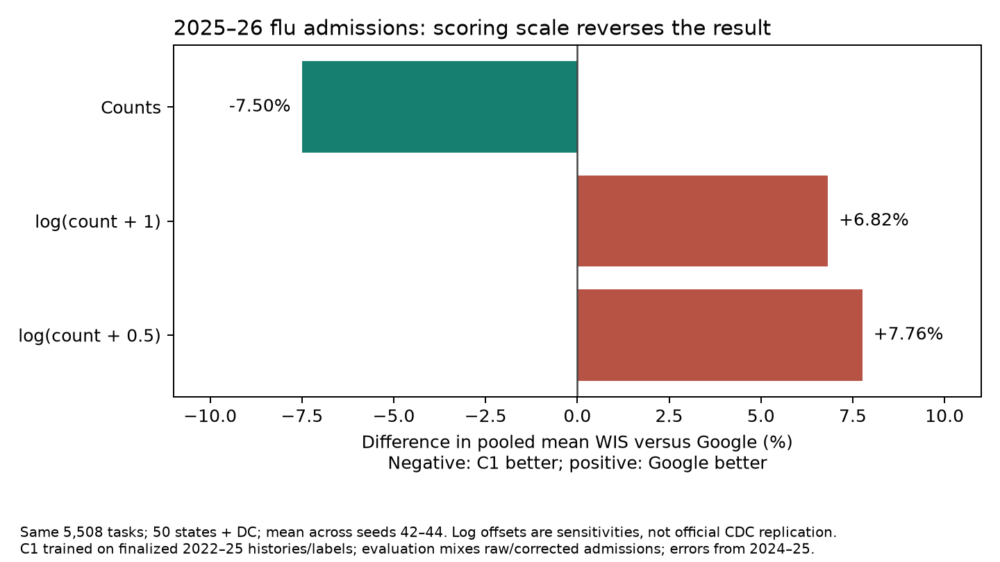

# Selected overnight C1 versus Google Hub forecasts, 2025–26

On our native-count, location-relative WIS rule, the selected C1 beats Google's flu and RSV admissions models in all three seeds. It narrowly beats Google's COVID model on the mean, but only one seed improves. This does **not** establish that C1 would beat Google in CDC's official FluSight ranking: CDC scores log-transformed counts using a different aggregation, and explicit log-scale sensitivity checks favor Google.

## Compared model and forecasts

C1 is the pathogen-specific B2 MLP with distance spatial sharing and no covariates, trained on finalized 2022–23, 2023–24 and 2024–25 inputs and finalized future labels. Its saved weights are unchanged. A separate no-covariate nonlinear nowcaster learns from synthetic training histories using only 2024–25 reporting errors and finalized recent labels. At 2025–26 evaluation, admission histories are either raw Wednesday reports or corrected by that nowcaster, with half the 2,048 H100 predictive draws assigned to each history. ED histories stay unchanged. Three training seeds are scored separately and their scores averaged; this is not a pooled three-seed forecast ensemble.

Evaluation uses the same B2 reporting availability/lag assumptions and final numerical proxies as the overnight study. This is development evaluation, not a prospective Hub submission. Choosing the method used these same evaluation seasons, so it cannot substantiate a counterfactual operational victory.

The Hub models are Google_SAI-FluEns, Google_SAI-Ensemble (COVID), and Google_SAI-RSVEns. Their submitted quantiles come from the project's pinned official Hub snapshots. `provenance.json` records repository commits, truth vintages and the SHA256 of each selected C1 forecast. Every comparison intersects the model, Google and Hub ensemble on identical reference date, target date, location and horizon. No missing Google forecasts are imputed. All shared locations happen to be the 50 states and DC; Google national forecasts are absent in this snapshot. Google has no ED submissions in these frozen tables, so the original six-target 0.918 score cannot be compared directly with Google.

## Native-count WIS, project scoring rule

For each location, sum model WIS and divide by the same location's Hub-ensemble WIS on the identical shared tasks, then average locations equally. Lower is better. Percent differences compare these matched mean scores, not the public baseline-relative CDC leaderboard values.

| Admission target | C1 mean across three seeds | Google | C1 difference versus Google | Seeds better | Shared tasks |
|---|---:|---:|---:|---:|---:|
| Flu | 0.882796 | 0.911220 | −3.12% | 3/3 | 5,712 |
| COVID | 0.918451 | 0.926654 | −0.89% | 1/3 | 6,630 |
| RSV | 0.929613 | 0.967110 | −3.88% | 3/3 | 4,692 |

Shared reference-date ranges are 2025-11-22 through 2026-05-30 for flu, 2025-12-13 through 2026-08-01 for COVID, and 2025-12-27 through 2026-05-30 for RSV. Horizons are Hub 0–3 wherever both models have forecasts. The masks and exact task counts are saved in support.csv; COVID late-season support is truncated by the common target-date bounds.

## Why the official FluSight answer differs

The [CDC 2025–26 report](https://www.cdc.gov/flu-forecasting/evaluation/2025-2026-report.html) names Google_SAI-FluEns the top individual submission. Its methods use natural-log-transformed counts, geometric aggregation of pairwise mean WIS ratios against all qualifying models, baseline normalization, national/PR exclusions, and July 1, 2026 target truth. The report does not specify its zero-handling offset or provide the exact scored date list in the methods text.

Our frozen flu truth is July 8, 2026 and our scoring is native-count location-relative WIS. We therefore do not label the following an official leaderboard reproduction. To test sensitivity, we restrict reference dates to November 22, 2025 through May 23, 2026 (the Saturday associated with the final May 20 submission), giving 5,508 tasks across 51 locations. We transform both quantiles and observations before computing WIS.

| Flu scoring sensitivity, common 5,508 tasks | C1 / Google pooled mean WIS | Interpretation |
|---|---:|---|
| Native admissions counts | 0.92498 | C1 lower by 7.50% on pooled-count WIS; the project's location-normalized difference is −3.14% |
| log(count + 1) | 1.06823 | C1 higher by 6.82%; all three seeds lose |
| log(count + 0.5) | 1.07763 | C1 higher by 7.76%; all three seeds lose |

With the project's equal-location ensemble-normalized aggregation retained after transformation, the two log sensitivities also favor Google by 6.06% and 6.53%, respectively. Thus the direction reverses because of the scoring scale, not solely because of aggregation. This is evidence against claiming an official FluSight win, not an exact estimate of C1's official rank.



## Reproduction

No training or inference was rerun and no cluster scoring job was launched. This analysis rescored saved quantiles locally using the existing `chromantis.evaluation.totals.quantile_scores` implementation. It asserts exact task alignment, unique keys, finite predictions, and positive common ensemble/Google denominators. The downloaded forecast paths are under `data/analysis/overnight-google-20261005/forecasts/`.

```bash
PYTHONPATH=src .venv/bin/python docs/experiments/google-comparison-20261005/compare.py
```

The original forecast plan/launch/status/rank commands are in [the nowcasting commands](../nowcast-overnight-20261005/commands.md) and [the exact GPU-mixture launch log](../nowcast-overnight-20261005/protocol.md). Outputs are `per-seed.csv`, `summary.csv`, `support.csv`, `native-location-scores.csv`, matched Google forecast parquet files and `provenance.json`. Zero-offset choices are labeled sensitivity assumptions throughout.
