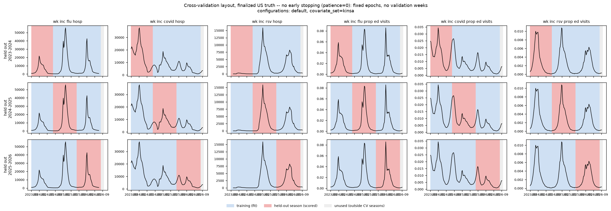
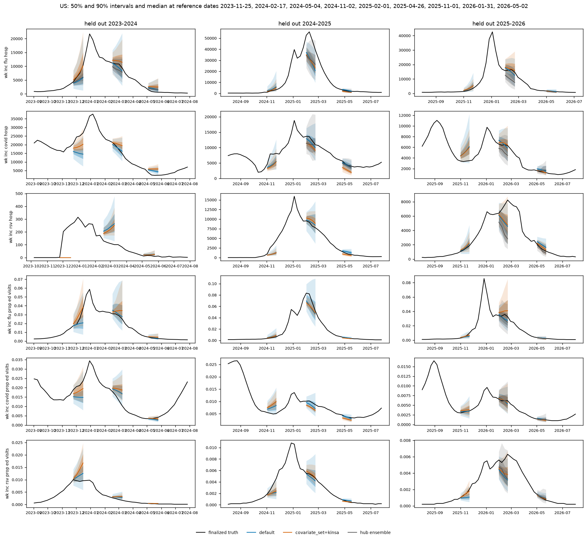
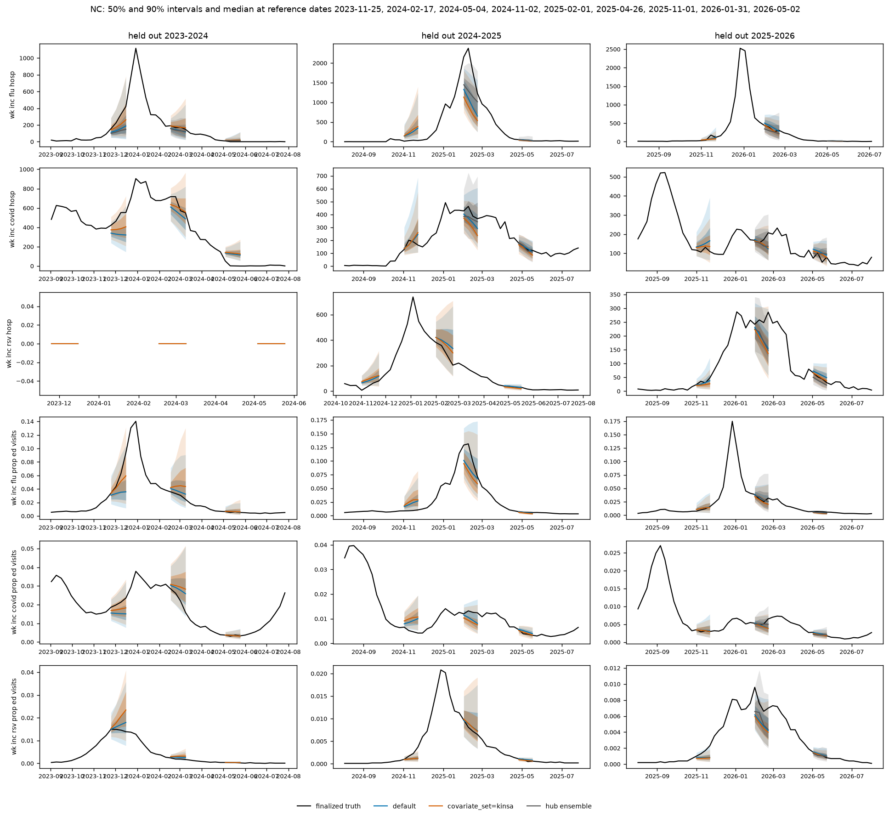
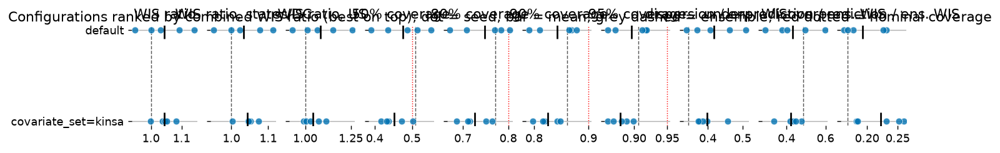
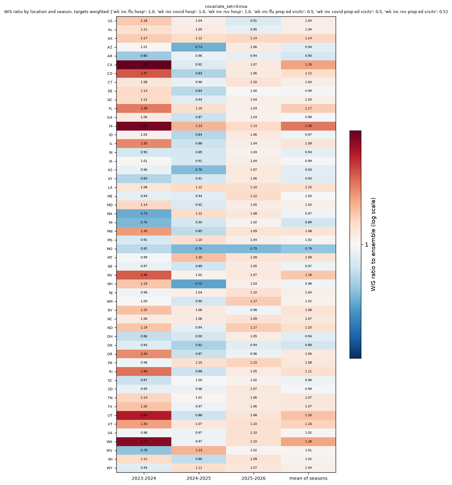
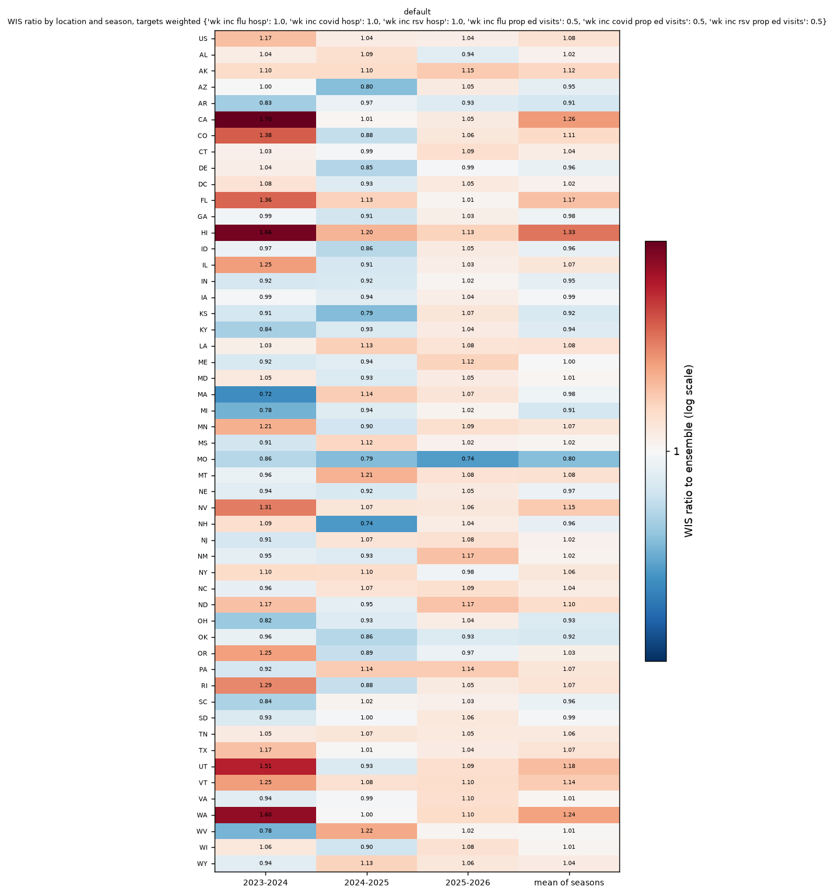

# 2026-09-22 · Adding national Kinsa to finalized target histories

## Best models by season

Top three configurations by the reported combined score (all configurations if fewer than three). Season columns are seed means. Lower is better; 1 is the matched Hub ensemble.

| Model | 2023-2024 | 2024-2025 | 2025-2026 | Combined |
|---|---:|---:|---:|---:|
| C1 · target history only | No known result | No known result | No known result | 1.0430 |
| C2 · Kinsa | No known result | No known result | No known result | 1.0440 |
| Hub ensemble | 1.0000 | 1.0000 | 1.0000 | 1.0000 |
| B0 reference | No known result | No known result | No known result | No known result |

Only rounded combined scores are recorded in this report. No known saved per-season scores or matched B0 comparison; these are not reconstructed from plot pixels.

## Protocol

<!-- protocol:start -->

Two configurations: default target histories, with or without national Kinsa; five seeds (42–46). Finalized inputs. Scores use US weight 0.2, admissions 1 and ED 0.5.

<!-- protocol:end -->

## Season splits

<figure class="report-figure" markdown="1">

<figcaption>cv-layout-fixed-epochs</figcaption>

{style="width: 1200px"}

[Open original figure](figures/09a5ba8880bda2d1.png)

</figure>

## Findings

<!-- write-up: kept across regenerations -->

No known result or figure.

<!-- end write-up -->

## Forecast fans

<figure class="report-figure" markdown="1">

<figcaption>fans-US</figcaption>

{style="width: 1200px"}

[Open original figure](figures/e552aa7dab409249.png)

</figure>

<figure class="report-figure" markdown="1">

<figcaption>fans-NC</figcaption>

{style="width: 1200px"}

[Open original figure](figures/61edd5d2e4f380a9.png)

</figure>

## Score diagnostics

<figure class="report-figure" markdown="1">

<figcaption>dotplot</figcaption>

{style="width: 1601px"}

[Open original figure](figures/78f8141a44dded0b.png)

</figure>

<figure class="report-figure" markdown="1">

<figcaption>heatmap-mlp-all-finalized-a4629e4a2a10</figcaption>

{style="width: 1200px"}

[Open original figure](figures/0adff994bff94018.png)

</figure>

<figure class="report-figure" markdown="1">

<figcaption>heatmap-mlp-all-finalized-e3b0c44298fc</figcaption>

{style="width: 1200px"}

[Open original figure](figures/054cf4aae9f22342.png)

</figure>

## Matched comparisons

No known result or figure.

## Full ranking

### Ranking

| Configuration | Seeds | Combined | States/DC | US | wk inc flu hosp | wk inc covid hosp | wk inc rsv hosp | wk inc flu prop ed visits | wk inc covid prop ed visits | wk inc rsv prop ed visits |
|---|---|---|---|---|---|---|---|---|---|---|
| `default` | 5 | 1.043 ± 0.076 | 1.033 | 1.083 | 1.028 | 1.018 | 1.018 | 1.085 | 1.034 | 1.187 |
| `covariate_set=kinsa` | 5 | 1.044 ± 0.030 | 1.044 | 1.043 | 1.026 | 0.971 | 1.049 | 1.026 | 0.980 | 1.252 |

## Appendix

No known result or figure.
