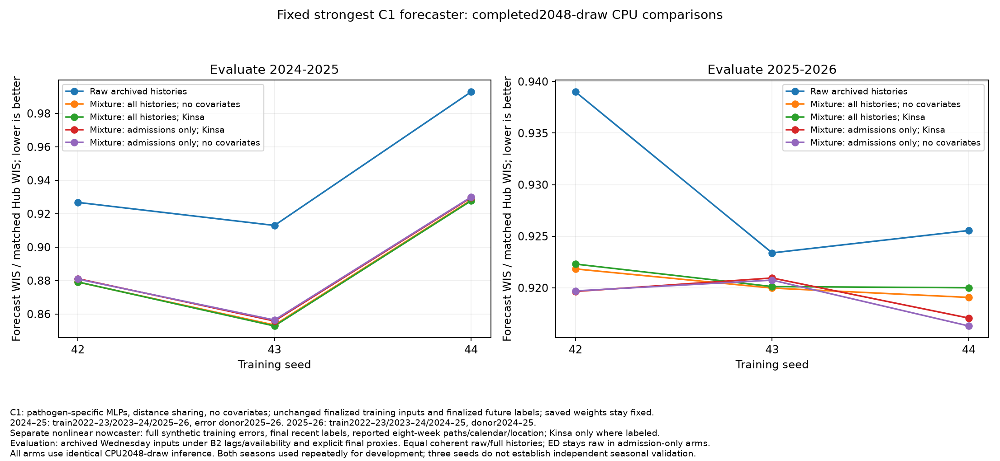
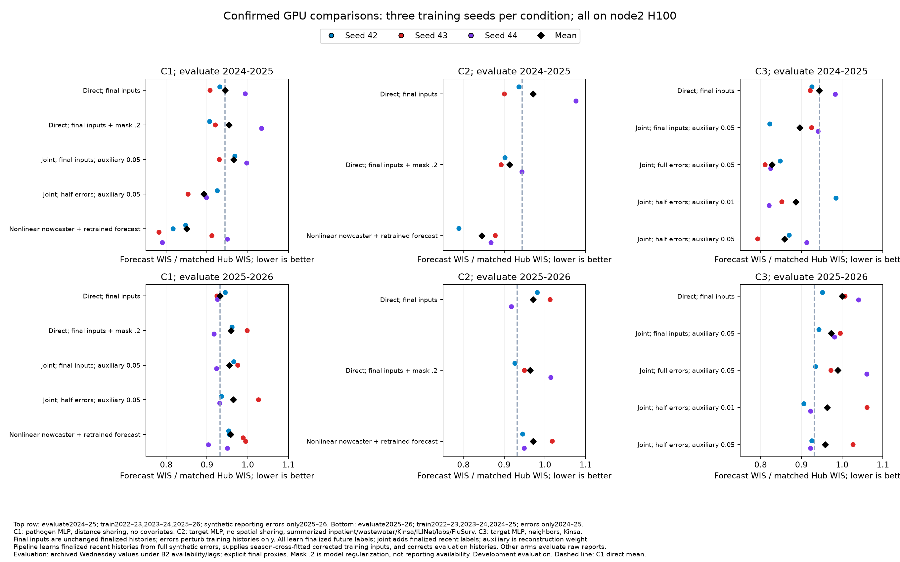
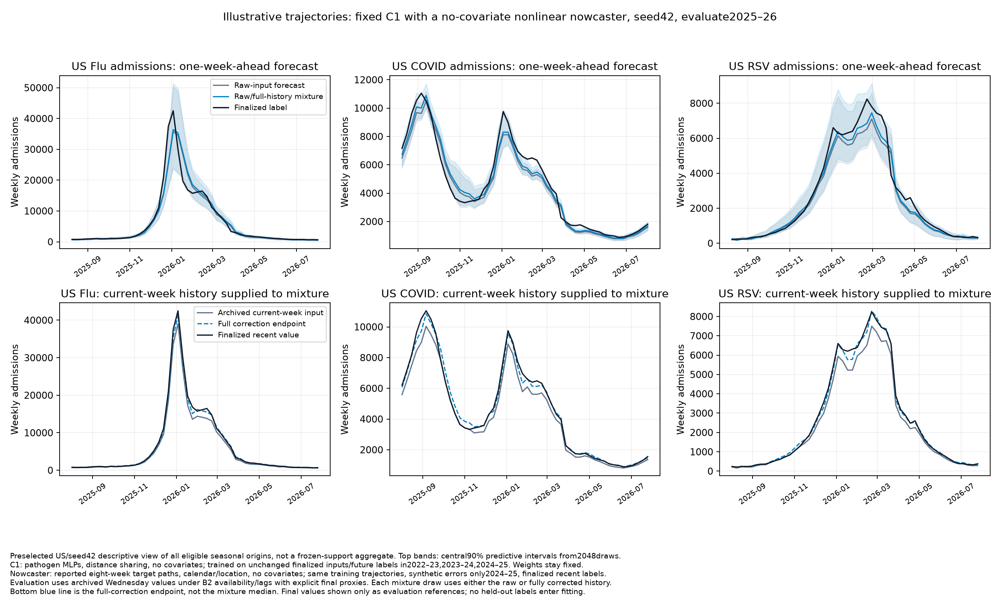
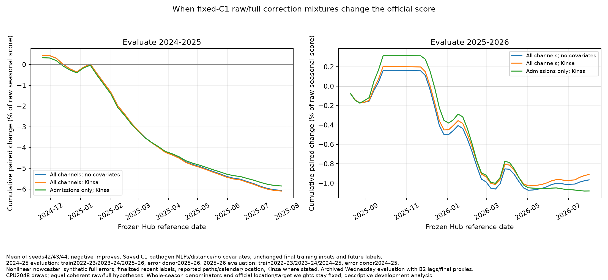

# Nowcasting and forecasting: overnight findings

**Final experimental readout, 07:48 EDT, 5 October 2026. All jobs completed; artifacts consolidated before the08:30 deadline.**

The strongest clean-input B2 model remains an important benchmark. Improving a
weaker architecture relative to itself does not necessarily beat it. On that
strong C1 model, applying half of a learned nonlinear revision correction helps
slightly across all three seeds. Propagating uncertainty improves a little more.
Retraining C1 or C2 behind the nonlinear nowcaster does not improve the forward mean. A final matched H100 check confirms about a1.1% forward gain from changing only the saved C1’s evaluation histories.
C3 joint training helps mostly through RSV; the fixed RSV-component composition
is promising but was selected using the evaluation season.

## What the numbers mean

Every main comparison below has seeds **42, 43, 44**. WIS is divided by matched
Hub-ensemble WIS on the unchanged frozen scoring support; **lower is better**.
State/DC locations jointly receive 80% and US 20%. Admissions targets receive
weight1 and ED proportions weight.5. The retrospective season has only flu/COVID
admissions on frozen support; the forward season has all six targets. Season
scores should not be interpreted as directly comparable levels of difficulty.

| Evaluation season | Model-training trajectories and finalized labels | Sole reporting-error donor season |
|---|---|---|
| 2024–25, retrospective | 2022–23, 2023–24, 2025–26 | 2025–26 |
| 2025–26, forward | 2022–23, 2023–24, 2024–25 | 2024–25 |

These are development evaluation seasons. Reporting errors alter **training
inputs**, never prediction labels. Joint models learn finalized recent t−3..t0
labels in addition to finalized future t+1..t+4 labels. Separate nowcasters learn
finalized recent-history labels from permitted synthetic training inputs only;
trajectory-season cross-fitting prevents that season's final recent labels from
training the corrector supplying its forecaster training inputs.

Evaluation uses archived Wednesday numerical values under the assumed B2 source
availability and lags. Missing archives use **explicit final numerical proxies**;
no oracle finality flag is supplied. Corrections can therefore also move a proxy
value. Genuine missing final observations remain unavailable. On unique own-target
frozen origin/location support, forward admission inputs have no final proxies;
state/DC ED proxy fractions are flu5.46%, COVID1.44%, RSV4.93%. Retrospective
flu/COVID-admission fractions are7.41%/8.57%. The larger all-season context audit
includes cross-signal inputs outside scored target support; neither audit is
WIS-weighted. See the two separately named audit CSVs and [protocol](protocol.md).

## Fixed strongest forecaster: correction and uncertainty

C1 has independent pathogen-specific MLPs, distance spatial sharing, and **no
forecaster covariates**. Each saved C1 was trained on unchanged final inputs and
finalized future labels in the seasons above. **Its weights stay fixed in this
table.** A separate nonlinear nowcaster uses reported eight-week paths,
calendar/location/Kinsa features, full-strength synthetic reporting errors from
the stated donor season, and finalized recent labels. It is fitted separately
for each seed. **Kinsa therefore adds information through the nowcaster relative to raw C1, even though the forecaster itself has no covariates; this is not a pure architecture-only comparison.** Only evaluation target histories are replaced; forecaster
covariates, source availability and prediction labels are unchanged. All rows
use matched CPU inference; do not substitute a saved GPU score as the control.

| Evaluation input treatment for the saved C1 | 2024–25 | 2025–26 |
|---|---:|---:|
| Raw archived histories, matched CPU control | .94848 | .93283 |
| Full nonlinear log-revision correction | .86000 | .93268 |
| Half nonlinear log-revision correction | .89557 | .92657 |
| Equal coherent raw/full-history mixture | .89006 | **.92413** |
| Half correction plus cross-fitted residual noise×.5 | .88881 | .92497 |
| Half correction plus cross-fitted residual noise×1 | .88058 | .92530 |
| Equal raw/full mixture; correct admission histories only, leave ED raw | .89240 | .92261 |

Half correction halves the predicted log revision, not the native-unit value.
The raw/full mixture assigns half of predictive draws to each complete history,
coherently across weeks, targets and locations. It is a predefined sensitivity
distribution, **not a calibrated posterior**. The residual bootstrap instead
uses intact synthetic revision residual trajectories measured by predictors that
excluded their trajectory season, with equal-season sampling and weighted-median
centering. No evaluation-season labels fit either uncertainty distribution.

Forward raw/full-mixture scores for seeds42/43/44 are .92362/.92138/.92741,
versus raw .94036/.92477/.93336: mean paired improvement .93%, with the same sign
in every seed. Half-scale residual noise also improves in every seed, but its
increment beyond the half-point estimate is small. Restricting applied corrections to admission histories gives a slightly lower forward mean, .92261, while all six targets remain scored. This scope was chosen after the target diagnostics and is evaluation-informed. The no-Kinsa ablation retains the benefit. The following higher-draw check uses its own matched raw control; absolute scores must not be compared with the 256-draw control above. These findings need another season before calling them robust operational improvements.

The same saved C1 forecasters evaluated with **2,048 CPU predictive draws** give:

| Evaluation histories supplied to saved C1 | 2024–25 | 2025–26 | Mean paired forward change |
|---|---:|---:|---:|
| Raw archived histories, matched 2,048-draw control | .944225 | .929312 | reference |
| Equal raw/full mixture, Kinsa nowcaster, all target histories | .886600 | .920807 | −.911% |
| Equal raw/full mixture, no-covariate nowcaster, all target histories | .886899 | .920289 | −.966% |
| Equal raw/full mixture, Kinsa nowcaster, admission histories only | .888884 | .919220 | −1.081% |
| Equal raw/full mixture, no-covariate nowcaster, admission histories only | .889101 | **.918912** | **−1.114%** |

All four mixture conditions improve in each of seeds42,43,44 relative to the
matched CPU control. The no-covariate nowcaster still uses eight-week reported
target paths, calendar and location; it receives no Kinsa or other covariates.
A scientific parity check confirmed that removing Kinsa leaves synthetic target
inputs, labels, availability and donor pairs identical across310 training draws
per seasonal fold. The admission-only/no-covariate combination is complete. Its forward scores for
seeds42/43/44 are.919696/.920744/.916297 versus matched raw.938998/.923384/.925555.
All six raw forecast files repeated in the final cohort are exactly identical to
the earlier2,048-draw raw controls, including every saved prediction array. These are modest development-set improvements; three
training seeds and more predictive draws do not supply independent seasonal validation.

Excluding synthetic cells whose error donor lacked an archived report/final pair
did not help: full correction then worsened forward WIS to .95760; half correction
was .93251. The usual zero-error fallback may regularize the nowcaster, but it is
**missing revision evidence, not observed zero revision**. The donor-pair flag
was used only to filter nowcaster supervision and never supplied at inference.

## H100 confirmation of the strongest fixed-C1 correction

This repeats the admission-only/no-covariate mixture using the **exact same saved
C1 forecasters and nowcasters** as the CPU comparison, with2,048 H100 predictive
draws and a newly matched H100 raw-input control. No models are refitted. The
forecaster was trained on unchanged final histories and final future labels;
the nowcaster learned finalized recent histories from full synthetic reporting
errors on the permitted training trajectories. For2024–25 evaluation those
trajectories are2022–23/2023–24/2025–26, with errors only2025–26. For2025–26 they
are2022–23/2023–24/2024–25, with errors only2024–25. Archived evaluation values,
B2 availability/lags and final proxies are unchanged; only admission histories
receive the equal raw/full mixture, while ED histories remain raw.

| H1002,048-draw evaluation inputs | 2024–25 | 2025–26 |
|---|---:|---:|
| Raw archived histories | .943373 | .928529 |
| Equal raw/full admission-history mixture; no covariates in nowcaster | **.888403** | **.918262** |

Mean paired forward change is**−1.100%**, compared with−1.114% in the CPU check.
Each seed improves on both hardware platforms. H100 forward corrected scores
for seeds42/43/44 are.918659/.917833/.918294, versus.937970/.920397/.927222 raw.
This supports a modest correction benefit across these inference implementations;
it does not supply an independent evaluation season. Always compare with the raw
control from the same hardware/draw group.

## Retrained pipelines and joint models

C2 uses independent target-specific MLPs, no spatial sharing, and summarized
inpatient/wastewater/Kinsa/ILINet/clinical-lab/FluSurv covariates. C3 uses independent
target-specific MLPs, neighbor spatial sharing and summarized Kinsa covariates.
All models are trained anew per season and seed. The two-stage C2 learns future
labels from cross-fitted nonlinear-corrected synthetic training histories and
receives corrected archived evaluation histories. Joint C3 learns future and
recent finalized labels from perturbed training inputs and receives raw archived
evaluation inputs. Both use the exact seasonal splits and proxies above.

| Model and training-input treatment | 2024–25 | 2025–26 |
|---|---:|---:|
| C1, unchanged final training inputs; raw archived evaluation | .94446 | **.93191** |
| C2, unchanged final training inputs; raw archived evaluation | .97115 | .97070 |
| C2, nonlinear nowcaster then retrained forecaster; full synthetic errors | .84505 | .97098 |
| C1, no-covariate nonlinear nowcaster then retrained forecaster; full correction of full synthetic errors | .86015 | .94865 |
| C1, same pipeline; half correction of full synthetic errors | .83992 | .96675 |
| C3, unchanged final training inputs; raw archived evaluation | .94378 | .99992 |
| C3 joint, full synthetic errors, auxiliary weight.05 | .82815 | .98953 |
| C3 joint, half synthetic errors, auxiliary weight.05 | .85888 | .95850 |
| C3 joint, half synthetic errors, auxiliary weight.01 | .88612 | .96345 |
| C3 joint, unchanged final training inputs, auxiliary weight.05 | .89642 | .97350 |
| C1 joint, half synthetic errors, auxiliary weight.05 | .89260 | .96459 |
| C1 joint, unchanged final training inputs, auxiliary weight.05 | .96546 | .95504 |

The nonlinear C2 pilot gain disappeared with three seeds. Its forward shared
flu/COVID-admissions score worsened from .93374 to .98634 despite the large
retrospective gain. C3 half-error joint likewise worsened shared forward
flu/COVID admissions (.96733 versus .91746); its overall gain comes from other
targets, especially RSV. Explicit current-level anchoring of future stochastic
residuals did not improve the C3 pilots.

Restoring the original B2 mask probability.2 changes model training regularization,
not reporting availability. C1's forward mean worsened to .95929; C2's was .96359,
a small inconsistent change from .97070. The completed joint follow-up found no improvement from reducing C3 auxiliary
weight to.01. Joint representation alone helps C3 but harms C1; adding half-strength
synthetic errors improves C3 further while still failing C1. These controls separate
the reconstruction objective from the training-input augmentation. All joint models
use separately normalized recent/future losses and future-only early stopping.

## Target-component diagnostic

The preselected rule uses clean-input-trained C3 flu/COVID components and joint
C3 RSV components; each component learns the finalized labels described above.
No averaging or further training occurs. The rule was chosen from full-error C3
seed42 evaluation, then fixed before half-error seeds43/44 results. It is therefore
**tuned on the evaluation season**; new seeds measure training variability only.

| C3 RSV component's training-input errors | 2024–25 | 2025–26 |
|---|---:|---:|
| Full errors, auxiliary.05; clean flu/COVID components | .94378 | .94044 |
| Half errors, auxiliary.05; clean flu/COVID components | .94378 | .92691 |

The half-error composition narrowly beats C1's .93191 mean, but only seed42 beats
its paired C1 score. Retrospective scores equal clean C3 because retrospective
frozen support contains no RSV. The same rule, predeclared for C1 before its half-error joint outputs arrived,
failed to transfer: its forward mean was.94855 versus unchanged C1.93191. Its
retrospective score equals C1 because no RSV tasks are scored in that season.

## Reproduction and scientific checks

The private project is `/proj/jlessler/projects/tapestry-all/tapestry-nowcast-overnight-20261005`
on Longleaf, node `g1803jles02`. Code snapshots are pinned per experiment. The
[canonical manager commands](commands.md) and [chronological protocol](protocol.md) include each exact manager
plan, launch, status and rank command. Use `PYTHONPATH=src` for ad hoc commands;
Slurm uses the pinned snapshot. Do not replan a live experiment.

The joint objective wiring was repaired: future loss has total mass1, recent
loss its requested auxiliary mass, and early stopping uses future loss only.
Numerical and gradient checks cover the scientific weighting. Old weekend
nominal weights did not reach the objective and are not causal weight treatments.
Fixed-replay checks assert seed, held-out season, dataset identity, training-season
provenance, input alignment, unchanged masks and finalized labels. Component
composition asserts identical dates, truth, masks and quantile grids before
replacement. The common scorer enforces identical frozen tasks.

Donor-support metadata extensions reproduced all12 repeated forecast files exactly.
Changing ordinary inference to history-bank inference produced only tiny numerical
differences (ED at most5.96e−8; rare rounded counts by1), so matched bank controls
are retained. Neither those differences nor CPU/GPU differences are claimed as
method gains. Detailed seed tables and graphs accompany this report.

## Compact matched comparison exports

[Principal comparisons](principal-comparisons.csv) contains both seasonal means,
mean paired percentage changes, reference run IDs, hardware, draw counts and full
input/model definitions. [Per-seed comparisons](principal-comparisons-per-seed.csv)
retains the underlying paired observations. Negative changes improve WIS. GPU256
and CPU2048 are separate comparison groups. The final factorial cell is included.

The US trajectory illustration uses preselected seed42, the saved C1 and its
no-covariate nowcaster. It shows all available origins descriptively; the official
aggregate remains restricted to frozen Hub support. Final truth in the figure is
for retrospective inspection only and is never supplied to the evaluated model.

## Where the fixed-C1 gain occurs

The score-contribution audit preserves each location's whole-season Hub-WIS
denominator and the official location/target weights. Its contributions sum back
to the common scorer within2.22×10⁻¹⁶ across all12 runs. For the Kinsa admission-only
mixture in2025–26, December contributes−.632 percentage points and February−.481
points of the raw whole-season score, while September contributes a+.465-point
loss. The total is−1.081%. No-Kinsa/all-channel correction has a similar pattern.
Consistent signs across training seeds therefore do not mean uniform improvement
throughout the season. These are contributions to one unchanged score, not a new
monthly score or a separately selected evaluation window.

## Completed run inventory

There are**182 completed experiment-seed tasks:65 forecaster retrainings and117
fixed-forecaster replays**. Every task evaluates both specified seasons. Forty-two
replays refit only the separate nowcaster;75 load a corrector or use raw histories.
Deduplicating exact scenario, seed, predictive-draw count and inference device
across cohorts leaves**160 tasks:65 retrainings and95 replays**. The22 repeated
recipes include matched controls and numerical checks; these are not independent
replications. Device is included so CPU and H100 comparisons remain distinct.
This recipe-based count does not assert that every recipe is a different
scientific condition. Nine additional two-fold component-composition seed
evaluations reuse fitted components without training; derived audits add no fits.

Eleven obsolete failed replay tasks are excluded (eight CUDA-assertion launch
failures and three invalid no-covariate configuration failures); their replacement
cohorts completed. Retried attempts within a task are not extra completed runs.
[Run inventory](run-inventory.csv) and [machine-readable counts](run-inventory-summary.json)
preserve the final states. All nowcast jobs finished by07:47 EDT; none remain queued.

## Isolating retraining from supplying corrected histories

The final C1 pipeline comparison uses the same seasonal folds above, full-strength
synthetic reporting errors, finalized recent/future labels and a nonlinear
nowcaster without covariates. Full or half learned log corrections supply both
cross-fitted training histories and archived evaluation histories. The follow-up
holds each saved final nowcaster exactly fixed and supplies its corrected
histories to the original C1 trained on unchanged finalized inputs. Both sides
use H100 inference with256 draws. The repeated raw forecasts match the original
H100 forecast files exactly, and the saved-corrector hashes match in every pair.

| C1 operation; same correction within each pair | 2024–25 | 2025–26 |
|---|---:|---:|
| Saved unchanged-input-trained C1; raw evaluation | .944463 | .931911 |
| Saved C1; full correction at evaluation only | .856797 | .929750 |
| Retrained C1; full correction at training and evaluation | .860146 | .948652 |
| Saved C1; half correction at evaluation only | .892100 | .924929 |
| Retrained C1; half correction at training and evaluation | .839920 | .966752 |

Changing evaluation histories helps slightly; retraining on corrected synthetic
histories harms the forward mean. Half-correction retraining worsens every seed;
full-correction retraining improves seed44 but worsens42/43. Retrospective gains
therefore should not be treated as evidence of forward improvement. The comparison
isolates the whole retraining procedure, including its training inputs and epoch
selection, rather than attributing the harm to a single internal mechanism.

The principal export now contains24 complete three-seed comparisons:14 training
conditions,5 CPU2048 conditions,3 H100256 point-replay conditions and2 H1002048
mixture conditions. All carry their own reference IDs, training/evaluation
specifications and matched controls.
