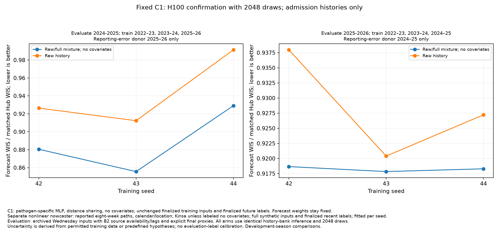
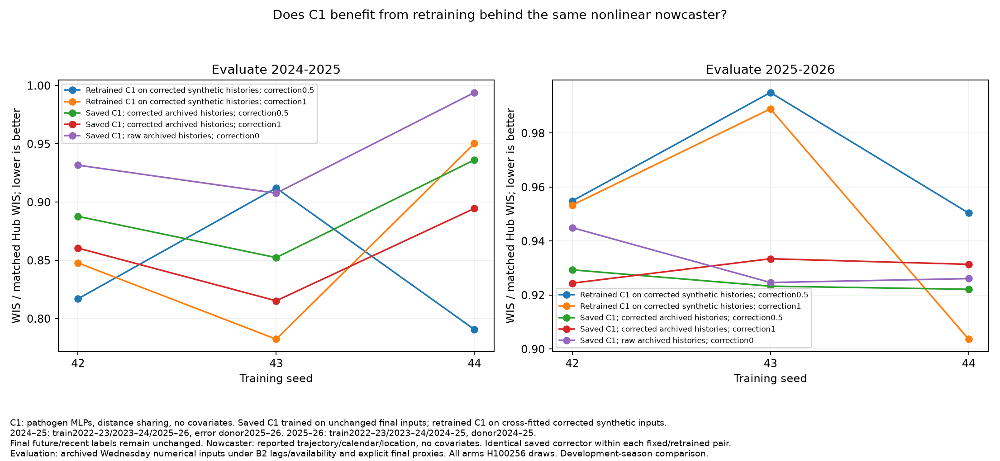
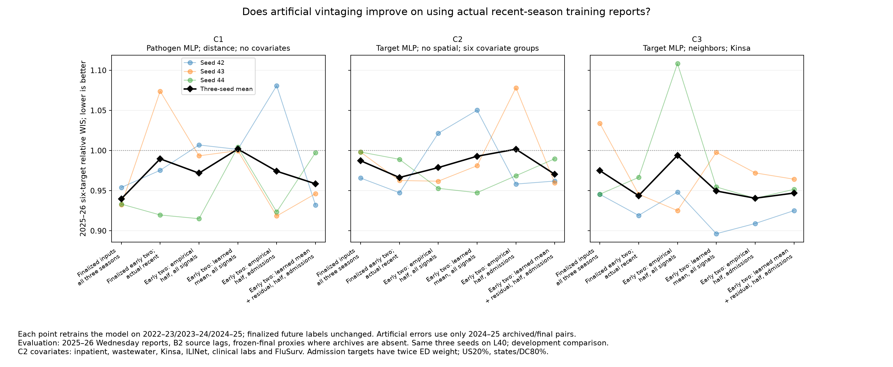

# B2 reporting-delay research: combined completed results

Completed 5 October 2026 before the 08:30 America/New_York cutoff. Both patron nodes have no remaining training or inference jobs. The strongest supported overnight improvement is small: retain the C1 forecaster trained on finalized inputs and mix predictions from raw admission histories with predictions from nowcaster-corrected admission histories. Artificial vintaging and joint training do not consistently improve the strongest direct forecaster.

## Common scientific protocol

| Evaluation | Training trajectories and finalized labels | Sole reporting-error donor |
|---|---|---|
| 2024–25, retrospective | 2022–23, 2023–24, 2025–26 | 2025–26 |
| 2025–26 | 2022–23, 2023–24, 2024–25 | 2024–25 |

All main comparisons have seeds 42, 43, 44. Forecast labels are finalized weeks t+1 through t+4. Joint models additionally reconstruct finalized t−3 through t0; separate nowcasters learn finalized recent histories. Artificial reporting errors modify inputs, never labels. Pipeline training uses trajectory-season cross-fitted correction; evaluation correctors use only permitted training seasons.

Evaluation uses Wednesday archived numerical values under the original B2 source availability and reporting lags, with explicit finalized-value proxies when archives are absent. No oracle finality flag is supplied. Historically absent final truth remains unavailable, including RSV admissions in 2022–23. Availability assumptions do not manufacture those observations. Model masking regularization is a separate treatment; original 20% masking controls were evaluated overnight.

Scores are relative WIS against the matched frozen Hub ensemble; lower is better. States/DC share 80% and US receives 20%; admissions receive twice the ED target weight. The retrospective score contains flu/COVID admissions only; the forward score contains flu/COVID/RSV admissions and ED proportions. Their levels are not directly comparable. Secondary common-target analyses use the same predictions and do not replace the official score.

C1: pathogen-specific MLP, distance spatial sharing, no covariates. C2: target-specific MLP, no spatial sharing, inpatient/wastewater/Kinsa/ILINet/clinical-lab/FluSurv covariates. C3: target-specific MLP, neighbor sharing, Kinsa. All are selected B2 architectures. Compare interventions with controls on the same hardware and number of predictive draws; do not rank L40, H100 and CPU results together.

## Strongest C1: correction without retraining

The saved C1 models were trained on unchanged finalized inputs and future labels in the seasons above. A separate nonlinear nowcaster learns from synthetic reported eight-week target paths, calendar/location features and finalized recent labels; the selected version has no extra covariates. At evaluation only admission histories are corrected, while ED histories remain raw. Half the predictive draws use the complete raw history and half use the corrected history. This coherent mixture is a sensitivity distribution, not a calibrated posterior.

| Same saved C1, H100 inference, 2,048 predictive draws | 2024–25 | 2025–26 |
|---|---:|---:|
| Raw archived/proxy evaluation histories | 0.943373 | 0.928529 |
| Equal raw/corrected admission-history mixture, no-covariate nowcaster | 0.888403 | 0.918262 |

Mean paired forward improvement is **1.10%**, with improvement in all three seeds. Matched CPU inference independently gives 0.929312 → 0.918912, or 1.11% mean paired improvement. These are hardware checks of the same models and seasons, not independent epidemiological validation. Temporal contribution analysis shows benefits concentrated in some months and losses in others.

## Retraining versus changing evaluation histories

The following uses the exact same saved nonlinear correctors and matched H100 inference with 256 draws. Retrained pipelines learn finalized future labels from cross-fitted corrected synthetic histories; fixed-model rows keep the original finalized-input-trained C1 weights and change only evaluation histories.

| C1 treatment | 2024–25 | 2025–26 |
|---|---:|---:|
| Saved forecaster, raw evaluation histories | 0.944463 | 0.931911 |
| Saved forecaster, half nonlinear correction | 0.892100 | 0.924929 |
| Retrained forecaster, half nonlinear correction | 0.839920 | 0.966752 |
| Saved forecaster, full nonlinear correction | 0.856797 | 0.929750 |
| Retrained forecaster, full nonlinear correction | 0.860146 | 0.948652 |

Correction alone helps modestly. Retraining on the corrected synthetic distribution harms the forward mean, despite large retrospective improvements. The half-correction retrained pipeline loses in all three forward seeds; the full-correction pipeline improves one seed and loses two. The separately retrained nonlinear C2 pipeline also loses its pilot benefit when all three seeds are included.

## Artificial vintaging of the first two seasons

These L40 comparisons all retrain the named model, retain finalized future labels and evaluate identical raw Wednesday/proxy inputs. Early seasons are 2022–23/2023–24; recent season is the permitted donor season in the common protocol. “Archived recent” includes the documented final proxies.

| Model and training inputs | 2024–25 | 2025–26 |
|---|---:|---:|
| C1, finalized inputs in all three seasons | 0.934667 | 0.939835 |
| C1, half episodes unchanged, half with half-strength empirical errors across all three seasons | 0.865183 | 0.947646 |
| C2, finalized inputs in all three seasons | 0.933966 | 0.987335 |
| C2, finalized first two seasons, archived recent season | 0.909097 | 0.966398 |
| C2, half-strength empirical admission errors across all three seasons; ED/covariates finalized | 0.906034 | 0.960526 |
| C2, learned half-strength admission errors in first two seasons; archived recent season | 0.84737 | 0.970441 |
| C3, finalized inputs in all three seasons | 0.97920 | 0.975009 |
| C3, finalized first two seasons, archived recent season | 0.862133 | 0.943732 |
| C3, half-strength empirical admission errors in first two seasons; archived recent season | 0.832489 | 0.940578 |
| C3, learned half-strength admission errors in first two seasons; archived recent season | 0.840711 | 0.947008 |

Actual-recent-only controls explain most apparent early-season vintaging gains on C2/C3. None of their learned first-two-season generators beats its actual-recent-only forward mean. C3 empirical admission errors add only a 0.33% improvement beyond actual recent reports. No fully replicated artificial-input treatment beats the strongest finalized-input C1 mean. C2 admission-only errors across all seasons improve its own reference by 2.72%, mainly through RSV admissions; all ED forecast targets worsen even though ED inputs were not perturbed.

The learned final-to-report generator is distinct from the report-to-final nowcaster. Conditional ridge predicts admission revision errors better than a shared mean on blocked donor validation, but more accurate error prediction does not ensure better forecasts. Gradient boosting and boosted residual variants did not improve admission-error validation. Sparse ED archive evidence limits learned transport: empirical missing-pair errors leave inputs unchanged, while learned means extrapolate into those cells. Missing pairs are not observed zero revisions.

## Joint training

All rows below use H100/256 inference and raw evaluation reports. Joint models learn recent finalized reconstruction labels plus future finalized labels, with separately normalized losses and future-only early stopping.

| Model and training inputs | 2024–25 | 2025–26 |
|---|---:|---:|
| Direct C1, finalized inputs | 0.944463 | 0.931911 |
| Joint C1, finalized inputs, auxiliary weight 0.05 | 0.965460 | 0.955038 |
| Joint C1, half-strength artificial errors, auxiliary weight 0.05 | 0.892596 | 0.964585 |
| Direct C3, finalized inputs | 0.943776 | 0.999919 |
| Joint C3, finalized inputs, auxiliary weight 0.05 | 0.896415 | 0.973500 |
| Joint C3, half-strength artificial errors, auxiliary weight 0.05 | 0.858881 | 0.958501 |

Joint representation helps C3 but harms C1. Choosing clean-trained C3 flu/COVID components and half-error joint RSV components yields 0.926908 forward, but the target rule was selected on evaluation results and only one paired seed beats direct C1. It is an exploratory composition, not a validated general replacement.

## Weekend experiment and total work

The parent analyzed all **1,730 completed weekend seed runs**, each covering both folds. Only six architectures completed all treatments and all three seeds. Removing fictitious joint-weight distinctions leaves 156 distinct complete three-seed configurations. Across these six architectures, half-clean/half-noisy training with half-strength empirical errors improves forward score by about 1.98% on average, with five architectures improving. This did not transfer to the strongest C1 in the new direct test above.

The best completed weekend individual forward configuration was original C22 (pathogen MLP, all covariates, no spatial sharing), trained with synchronized half-strength artificial reporting errors in all training seasons and evaluated on raw reports: 0.92426 versus its 0.98281 reference, with two of three seeds improving. This is a selected incomplete sweep and should not be compared numerically with different hardware/draw groups overnight.

**Weekend joint_weight settings were ignored by the training loop. Those nominal weight comparisons are invalid.** Overnight joint fitting repairs the wiring and also uses future-only stopping; repaired and old joint runs are not identical objectives. Completed weekend artifacts were preserved; unfinished arrays were cancelled to release resources.

Overnight completion:

- Node 1: 117 forecaster seed tasks, 234 seasonal fits; 37 three-seed conditions plus six one-seed pilots. One early timing-driven attempt was restarted and completed.
- Node 2: 65 forecaster seed retrainings plus 117 fixed-forecaster replay tasks, all with both folds. Forty-two replay tasks refit only the separate nowcaster. Exact recipe/seed/draw/device deduplication leaves 160 tasks; repeated controls are not independent evidence. Nine derived component-composition evaluations reuse existing models.
- Total overnight: **182 forecaster seed retrainings plus 117 replay tasks**, or 299 completed two-fold tasks. Historical failed attempts and initial smoke jobs are not included in these research counts.
- Both H100s ran nearly continuous training allocations 01:31–06:04, then were idle while CPU analysis finished; GPU work resumed at 07:13 for the missing C1 pipeline and matched inference checks. We did not keep them busy for every available minute. All final checks finished before the cutoff.

## Limits and reproducibility

These are repeatedly consulted development seasons. Three seeds assess training variability, not seasonal generalization; there are no independent seasonal confidence intervals. The smaller retrospective target set and different donor coverage partly explain differing seasonal conclusions.

The availability simulation is optimistic. Across all eligible current-week contexts, absent archives imply final proxies in roughly 33–37% of 2024–25 admission cells and 88–89% of ED cells; 2025–26 ranges are 12–14% and 20–23%. On the narrower unique own-target frozen scoring support, forward admissions have no proxies and state/DC ED fractions are 5.46% flu, 1.44% COVID, 4.93% RSV; retrospective flu/COVID admissions are 7.41%/8.57%. These denominators differ and neither is WIS-weighted. Correctors can also change a proxy value; no inference flag identifies it.

Research code and immutable fitted snapshots are preserved in private projects. The joint-loss wiring repair is integrated into the shared source; the broader experimental mechanisms are delivered as reviewed-by-author integration patches and source archives, not all merged into shared production code. No production default was selected or deployed. Graphs were generated without visual inspection, following repository instructions.

- [Vintaging results and complete paired data](vintage-overnight-20261005/results.md)
- [Vintaging manager plan, launch, status and rank commands](vintage-overnight-20261005/manager-commands.md)
- [Nowcasting results and complete matched data](nowcast-overnight-20261005/results.md)
- [Nowcasting manager plan, launch, status and rank commands](nowcast-overnight-20261005/commands.md)
- [Weekend results and graphs](b2-weekend-20261002/results-20261005.md)
- [Vintaging integration patch](vintage-overnight-20261005/implementation.patch)
- [Nowcasting integration patch](nowcast-overnight-20261005/nowcast-mechanisms-complete.patch)

Use the independent reproduction sources and fresh experiment names specified in those manager-command documents; do not replan a completed experiment in place. On Longleaf, `squeue -a -u "$USER"` includes the hidden patron partition. At the final supervision check no jobs were queued or running.
