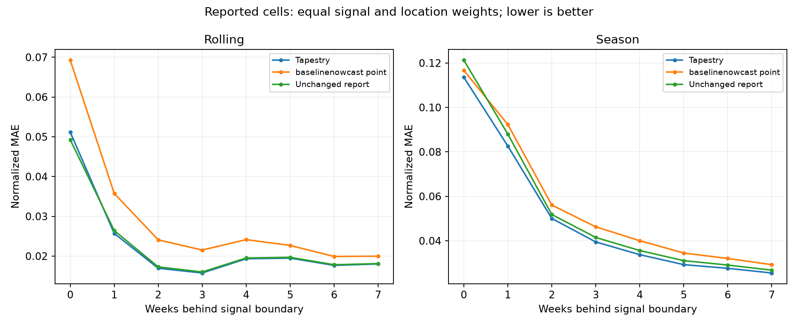
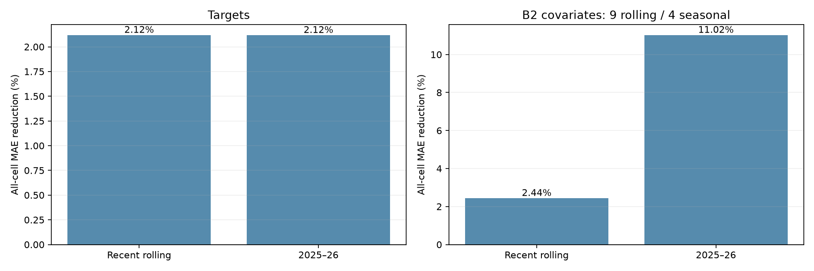
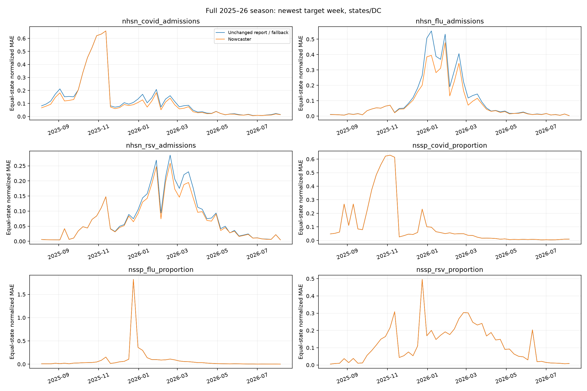
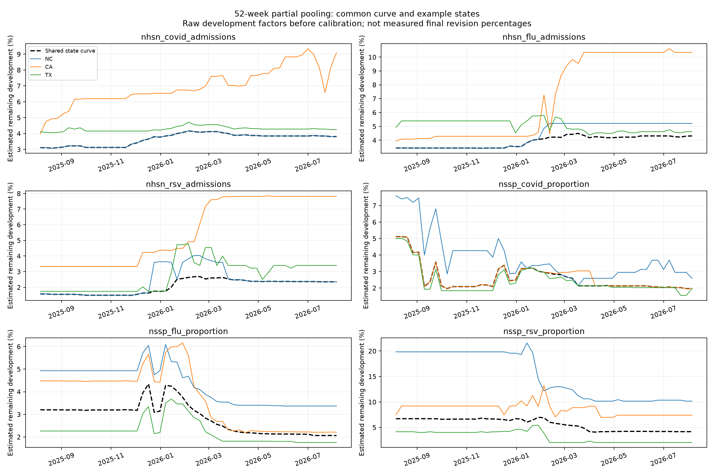
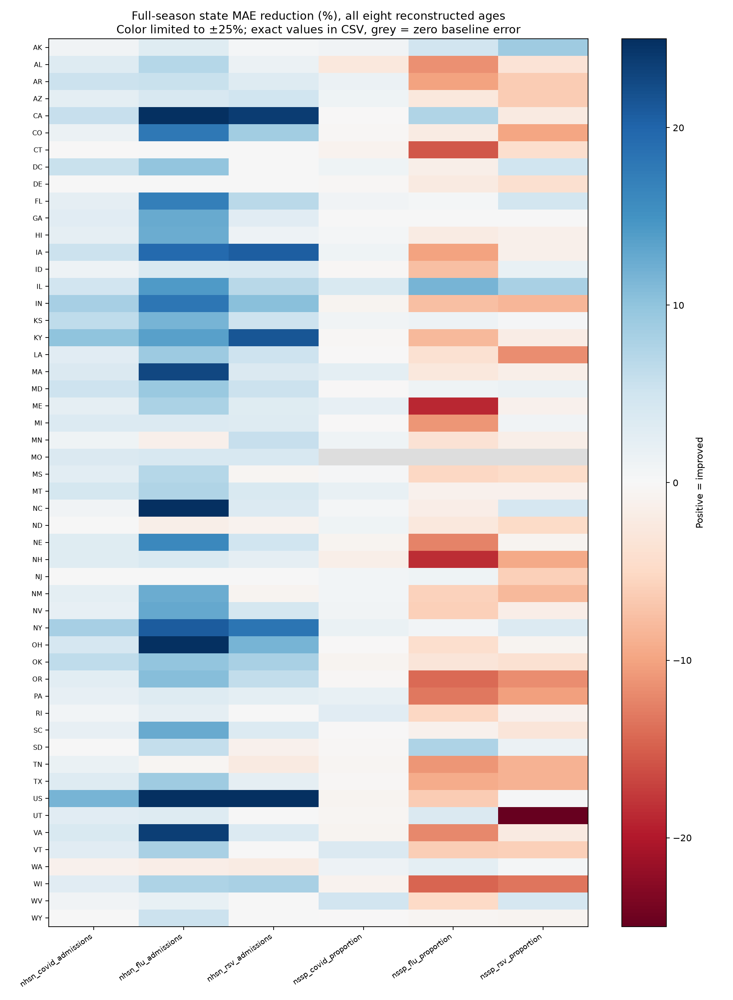

# Reporting-triangle nowcaster

## Configured baselinenowcast point comparison · 2026-10-01

**Audit qualification:** this is a 52-week, signed-revision configuration, not
the high-level package defaults. Continuous signals use a unit-preserving
adaptation. A corrected count-expectation implementation now matches the pinned
upstream R low-level functions on 27 real NHSN triangles to numerical precision
([parity results](baselinenowcast-r-parity.csv)); the original shortcut differed
by at most 0.13 admissions in that audit. Stored scores below were regenerated.
The history length and negative-revision handling have not been chosen using
pre-evaluation validation, so these numbers do not establish superiority over a
well-configured or default upstream baseline.

The stored v11 evaluations now include an independent
[baselinenowcast point comparator](../../reference/baselinenowcast.md), added
without refitting Chromantis. On **reported cells**, normalized MAE is 22.5% lower
for Chromantis in recent rolling evaluation and 10.1% lower in seasonal evaluation.
These summaries average folds within signal/age, then weight signals and ages
equally. They include ancillary signals; they are not the six-target forecasting
objective. They compare point estimates, not upstream probabilistic forecasts.



[Summary CSV](baselinenowcast-summary.csv) ·
[Coverage CSV](baselinenowcast-coverage.csv) ·
[Summary script](baseline_report.py).

Coverage is material: unsupported triangles retain persistence and missing
reports retain the documented fallback. In 2024–25 only 55,791 cells receive an
estimated baseline, while 84,070 reported cells have insufficient triangles and
66,923 cells have missing reports. All remain in their matched scoring groups.
The model's rolling reported-cell aggregate is also almost identical to
persistence, so improvement over this baseline alone is not evidence of a useful
improvement over unchanged reports. Stored per-cell predictions and baseline
provenance live under `data/experiments/reporting-triangle-v11-20261001/`.

Manager commands (the plan command is for fresh runs; the baseline command augments
completed fits without retraining):

```bash
bash scripts/plan_finalization.sh reporting-triangle-v11-20261001
.venv/bin/python -m tapestry.experiment.planner baseline -e reporting-triangle-v11-20261001
.venv/bin/python -m tapestry.experiment.planner status -e reporting-triangle-v11-20261001
.venv/bin/python -m tapestry.experiment.planner rank -e reporting-triangle-v11-20261001
.venv/bin/python docs/experiments/reporting-triangle-20261001/baseline_report.py
```

## Model

The nowcaster reconstructs eight weeks ending at each signal's T-X boundary.
Each Wednesday it estimates how the available reports will mature, separately
by signal and location. It permits upward and downward corrections, with an
explicit option to retain the report.

## Formulation and assumptions

The triangle stores C(t,d): the report for event week t at scheduled Wednesday
delay d. Each weekly development factor is estimated over the most recent **52
eligible event weeks**, then factors are multiplied through delay 12. This is a
full-season-length estimation window, not a fixed eight-week fit. Eight weeks
remains the output reconstruction window. All report pairs must be observed by
the issuance; later reference labels are never inputs to the development curve.

For each signal and delay, a common factor is the weighted median of paired
ratios across states/DC. Each state has unit total weight in this shared fit;
within a state, report exposure weights observations. At least three states with
four observed pairs each are required. The native US aggregate is excluded to
avoid double counting and is fitted independently.

Each state then fits its own weighted-median factor with **12 mean-exposure
pseudo-weeks at the common factor**. This is partial pooling: strong local
history can differ from the common curve, while a sparse state borrows more.
Fewer than four local pairs uses the supported common factor; without common
support, the fallback is identity. US/national-only series retain a four-week
identity prior. These prior strengths are fixed modeling assumptions, not fitted
hyperparameters. National Kinsa remains one national series.

NHSN counts use C+1 to permit a correction to a reported zero. Continuous signals
use C without an offset. The estimate is (report+offset)*development-offset,
clipped nonnegative and to source-specific bounds; reported NHSN outputs are
rounded to integers. Missing vintages are not zeros.

Assumptions: reporting patterns share a component across states; local departures
are estimable; the preceding year's behavior informs the present; and 12-week
reports approximate mature values. A complete fit can require roughly 64 weeks
of archived vintages (52 event weeks plus 12 delays). Short archives use only
observed pairs and are not described as a full season of training. The missing
cell regression below is unchanged in this experiment.

Up to 52 weeks of pre-cutoff training Wednesdays fit reported-cell correction
strength from 0, .25, .5, 1 separately by signal, reconstruction age, and US
versus pooled states. Require six training Wednesdays and at least 1% training
MAE improvement. These are fitted training parameters, not validation scores.
Only the missing-cell regression retains the final 12 training Wednesdays for
validation, with their event dates purged from inner training statistics. Triangle factors update causally
during evaluation using available reports; reference labels never enter them.
Calibration uses the frozen September 22 reference with a four-week age gap,
so this remains retrospective calibration, not strict historical-label replay.
The frozen reference is not guaranteed final. These reused evaluation folds
are development evidence, not untouched confirmation or a forecast-benefit test.

The implementation is inspired by [CDC nowcastNHSN](https://github.com/CDCgov/nowcastNHSN/blob/main/R/run_nowcasts.R)
and [baselinenowcast](https://github.com/epinowcast/baselinenowcast/blob/main/R/estimate_delay.R).
It is an independent point-estimate adaptation with robust fitting, not their
full probabilistic model. Inspected commits: nowcastNHSN
`3eba887604fab1194343ae6ebaf29e6590d1248b`; baselinenowcast
`e7eb9749622c732e0277349738b5c79141afa4b4`.

## Cross-source missing-value component

A ridge regression predicts log1p(final/reference-scale) relative to a prior-week
anchor. Inputs are Wednesday-visible signals at the event week and 1, 2, and 4
weeks before it, their availability masks, location indicators, annual phase,
and reconstruction age. The current target report is always excluded, including
for reported training examples. Own-source earlier values remain available.
Input medians come only from inner-training visible vintages, separately by
signal/lag/location; final covariate values are never features. National inputs
may inform states, but national labels are not replicated as state labels.

Training weights decay with a 26-week half-life, renormalized so each location
has equal total weight, and uses a fixed ridge penalty
of 10. Fit on inner training, calibrate missing-cell blend strength on chronological
validation (at least four validation Wednesdays, US and states separately), then
refit on outer training. Output and feature scales are saved with coefficients.
The model assumes cross-source associations transfer across the held-out period.
It cannot reliably fill a new source with no historical training/validation
support, and retains the fallback in that case. The log-space regression loss
is a modeling choice; model acceptance uses native-unit normalized MAE.

## Evaluation priorities and coverage

The six NHSN/NSSP targets are primary. Secondary outputs are the covariates in
B2's best covariate model: inpatient claims, wastewater wval_like, Kinsa, ILINet,
clinical-lab positivity, and FluSurv. B2's overall best model uses no covariates;
its third-best uses only Kinsa. Outpatient claims and wastewater percentile ranks
remain ancillary diagnostics and do not determine model selection.
See the [saved B2 ranking](../b-2-t0/index.md).

The main seasonal test is 2025–26: train before July 27, 2025. Recent rolling
holdouts begin June 10, July 8 and August 5, 2026, each covering four Wednesdays.
All six targets have scoring support in these tests. The 2025–26 covariate
score covers four of nine selected signals (inpatient flu/COVID, ILINet, clinical
lab); wastewater, Kinsa and FluSurv have no pre-cutoff training vintages. Recent
rolling evaluation covers all nine, although some retain identity corrections
when calibration history is insufficient. Reported and missing cells
are shown separately, alongside all-cell error.

The 2024–25 test trains before July 28, 2024 and is a limited-coverage diagnostic:
NHSN flu has 43 training Wednesdays, NSSP targets 14 each, and NHSN COVID/RSV have
none. Wastewater, FluSurv and Kinsa also have no usable pre-cutoff vintage history.
The NSSP series do not have the 24 Wednesdays required to reserve 12 for
missing-cell validation; reported-cell strength uses their available training history. Inpatient claims, ILINet and clinical lab have about 114–115 weeks.
These counts describe reporting vintages, not finalized-series length.

Using one common pre-2024 season to train for both evaluation seasons is
chronologically valid but cannot provide training evidence for the missing
archives. The two nowcaster seasonal fits are forward-only in date; B2's older
2024–25 evaluation instead included a later season in its training. The protocols
must not be conflated. Frozen later reference labels still make this nowcaster
experiment retrospective, as explained above.

MAE is normalized by training-location means, with equal location weights.
Within each age and protocol, average folds within signal, then signals equally;
aggregate over the eight reconstruction ages. All-cell metrics include reported
and missing examples using the same location weighting. Percent error reduction
is 100*(1-model MAE/baseline MAE). Baseline means unchanged reported values and
the prior-history/training-median fallback for missing cells. It is not forecast
error reduction. These development folds have been reused during iteration.

The selected model retains pooled reported-value calibration and recency-weighted
cross-source gap regression. State-specific reported calibration was rejected
because it worsened the full 2025–26 target evaluation. Corrections are restricted
to the priority outputs; outpatient and wastewater-rank outputs retain their
baseline. Those sources may still enter as Wednesday-visible predictors.



[Every fold and priority group](current-priority-folds.csv) ·
[Reported/missing breakdown](current-priority-summary.csv) ·
[Source-level diagnostics](current-source-ratios.csv).

```bash
bash scripts/plan_finalization.sh reporting-triangle-v11-20261001
sbatch --job-name=reporting-triangle-v11-20261001 scripts/finalization.sbatch reporting-triangle-v11-20261001
.venv/bin/python -m tapestry.experiment.planner status -e reporting-triangle-v11-20261001
.venv/bin/python -m tapestry.experiment.planner rank -e reporting-triangle-v11-20261001
```

The full-season hierarchical evaluation completed on Longleaf (job 3300106,
both configurations and all five folds). The current formulation removes **2.12%**
of all-cell target normalized MAE in 2025–26, and **6.44%** for the newest
reconstructed week alone. Recent rolling target error falls **2.12%**. B2
covariate error falls **11.02%** in 2025–26 (four supported signals) and **2.44%**
in recent rolling tests (all nine signals).

The result is mixed: the longer pooled fit improves recent rolling targets but
does not beat the prior seasonal target result. Within 2025–26, reductions are
3.01% NHSN COVID, 8.90% NHSN flu, 4.36% NHSN RSV, and 0.42% NSSP COVID;
NSSP flu and RSV errors increase 3.33% and 1.15%. Full-season pooling therefore
does not yet establish a reliable improvement across all targets. Keep this
as an evaluated nowcasting formulation, not a default replacement of forecasting
histories. No composed downstream forecasting benefit has been measured.

The plots show the complete 2025–26 season, state-specific scores, and the
common and local curves separately. The weekly error chart uses only age zero;
state scores aggregate all eight reconstructed ages.







[Exact per-state scores](current-season-state-scores.csv).

## Decision log

October 1: switched to robust triangle fitting to reduce sensitivity to rare
large revisions. Direct maturation was evaluated but reduced forward-season gains. Recent
report-pair weighting was effectively a tie and was not retained. Conditioning
on the current report level slightly improved rolling error but worsened seasonal
error, so it was discarded. The simpler weekly triangle is retained. Superseded model
implementations and report comparisons were removed.

The scenario's `lookback=12` controls missing-value fallback history, not the
triangle archive window. Seed and epoch fields are inherited manager settings;
this estimator is deterministic and has no neural training epochs. Scientific
checks cover vintage causality, T-X alignment, purged label dates, equal-location
scoring, known development in both directions, rare revisions, and rate units.


### Additional data-support findings

For the pre-July-2025 fit, NHSN flu has 95 training Wednesdays, NHSN COVID 36,
NHSN RSV 35, and NSSP targets 66 each. Thus even this fit does not contain a full
year of reporting vintages for every target. We cannot replace missing historical
snapshots with finalized values and call them revision-training examples.

In the recent rolling windows, 83–93% of target cells across all eight ages are
already exactly equal to the frozen reference (83% NHSN COVID, 88% NHSN flu,
90% NHSN RSV, 88% NSSP COVID/flu, 93% NSSP RSV). The newest week is less complete;
older ages dominate the exactly-correct count. This is a diagnostic of the current
sample, not a claim that the remaining errors are unpredictable.


October 1 continuation: prioritized outputs using the saved B2 ranking. Added
causal cross-source gap regression and retained recency weighting for the main
2025–26 covariate result. Rejected state-specific reported correction selection.
Kept reporting-triangle corrections pooled across states and restricted corrected
outputs to the six targets and nine selected covariates. Older implementations
and checkpoints were discarded; current-result plots contain no old-model curves.


October 1: expanded the development window to 52 event weeks and introduced a
shared state curve with state-specific partial pooling at the user's request.
National observations are excluded from the state pool. Shared/local factors are
saved per prediction. The reconstruction horizon remains eight weeks; evaluation
plots now explicitly show the entire season and newest-week errors separately.

October 1: fitted reported correction strength over up to 52 pre-cutoff training
weeks as well. Missing-cell validation remains separate. The first launch stopped
on string-array date reduction before producing results; the corrected run uses
Python date-string ordering and the same scientific protocol.
