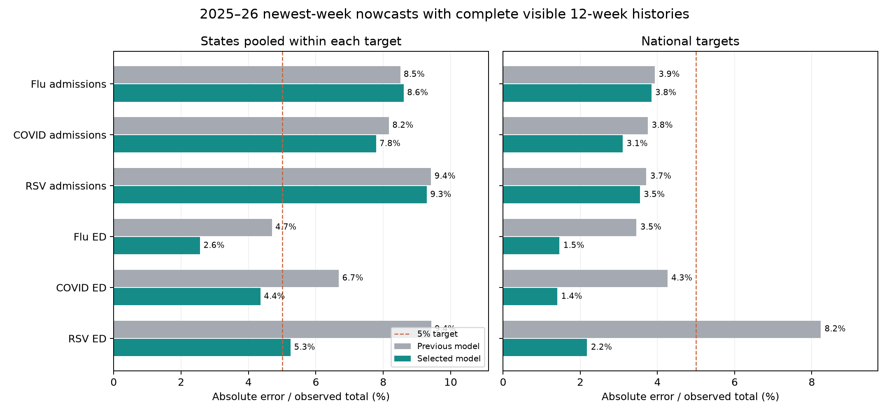
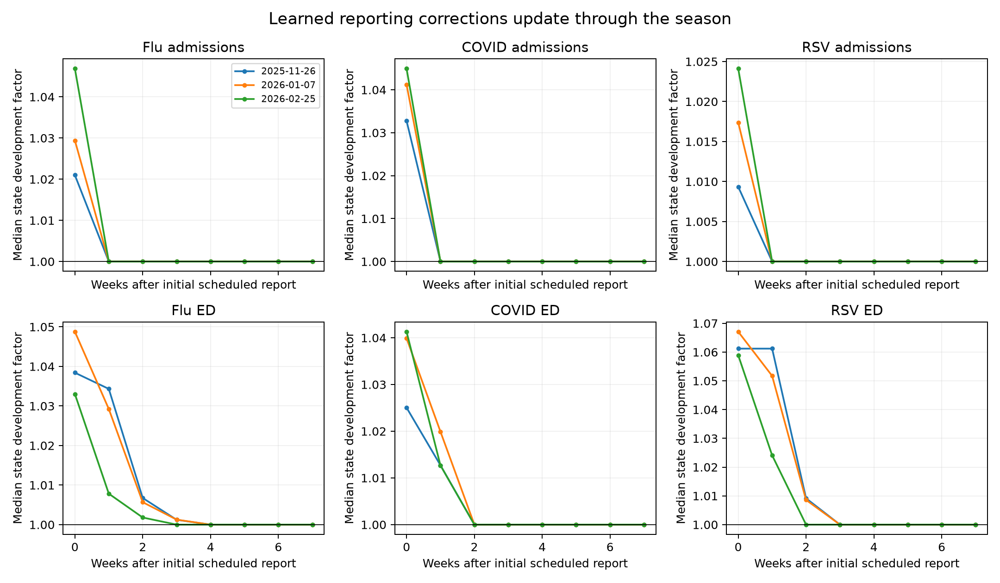
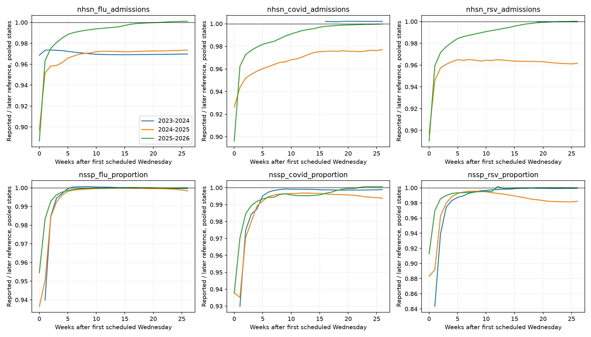

# Seasonal online nowcasting · October 1, 2026

Objective: improve reconstruction of the six NHSN/NSSP targets on a subsequent
season. The primary development comparison is 2025–26; 2024–25 has limited
archive support. These seasons have already been inspected during prior work,
so they are development evidence, not an untouched prospective test. Forecast
benefit requires a separate downstream forecasting comparison.

## Model nowcasts versus observed revisions

[Open the dated-row visualizer full-size](nowcast.html). Choose a target, location
and Wednesday range. The upper panel shows the reference epidemic curve and
newest-week model nowcasts. Below it, each Wednesday has its own vertical baseline;
all points remain aligned to their Saturday observation dates. Purple is the
actual subsequent revision, and dashed teal is the selected model's predicted
revision. Their separation shows the correction error.

<iframe src="nowcast.html" title="Selected nowcaster versus observed revisions by Wednesday" style="width:100%;height:1100px;border:1px solid #dce3e9;border-radius:6px" loading="lazy"></iframe>

Both revisions default to `100 × (value − Wednesday report) / Wednesday report`;
the denominator can instead be the frozen reference. Every row uses the same
linear percentage scale, with zero at its dated baseline and positive upward.
The row offsets encode issuance dates, not additional revision magnitude. Values
are never clipped or normalized separately by row. Both zero gives zero change;
other zero denominators and missing reports are undefined and break lines.
The curve above is in raw signal units on a separate vertical axis.

This view reads the completed selected model's 2025–26 seasonal replay, not a new
fit. The saved model reconstructs eight weeks, so the selector spans two to eight
weeks. Only saved evaluated cells have model/revision lines; an empty cell is not
an inferred zero. The reference curve comes from the same hash-verified panel.
The full-size view offers point details and CSV/PNG downloads. A
[static US flu example](nowcast-rows-us-flu.png) covers November–March.

Regenerate the visualization without fitting or scoring:

```bash
.venv/bin/python -m chromantis.explorer.nowcast_ridges
```

## Result on the requested reporting conditions

The selected statistical model learns seasonal reporting-triangle development
from the preceding two years and updates its factors every Wednesday. Robust
weighted medians and partial pooling protect individual states from rare large
revisions. It uses no neural network. All fitting completed on Longleaf.

Newest-week 2025–26 error, comparing the previous triangle model with the selected
model on exactly the same observations:

| Reporting condition | US WAPE, previous → selected | State WAPE, previous → selected | State target-weeks |
| --- | --- | --- | --- |
| Complete visible 12-week history | 4.56% → **2.59%** | 7.82% → **6.31%** | 13,484 |
| Also eight uninterrupted reporting issuances | 4.51% → **2.28%** | 7.51% → **5.98%** | 10,215 |

WAPE is absolute error divided by observed total within each target, then averaged
equally over the six targets. The state columns pool states within each target;
they do not imply that every state is this accurate. Giving each location equal
weight instead yields 8.78% → 7.29% and 8.49% → 6.98%, respectively. The
equal-location fraction of positive observations individually within 5% improves
from 56.0% to 63.5% with complete histories, and from 56.9% to 64.1% in the stricter
group. National support is 267 and 202 target-weeks, respectively. The stricter
group excludes about a quarter of reported observations, including reporting
interruptions around holidays and outages.



State ED WAPE improves from 4.70% to 2.56% for flu, 6.68% to 4.36% for COVID,
and 9.42% to 5.25% for RSV. Admissions remain harder: COVID improves from 8.17%
to 7.79%, RSV from 9.42% to 9.29%, and flu worsens slightly from 8.50% to 8.61%.
The overall improvement therefore does not establish universal 5% accuracy.

A paired four-week block bootstrap over the full seasonal calendar gives a
19.3% reduction in state WAPE (95% resampling interval 14.3–22.0%) and 43.2%
nationally (33.4–52.4%) for complete histories. These intervals describe
within-season variability; they do not account for model selection or establish
next-season generalization. See [bootstrap estimates](stable-bootstrap.csv).

Across three recent rolling folds, complete-history WAPE averages 5.30% → 4.66%
nationally and 9.33% → 8.92% for states. The older 2024–25 replay improves from
8.58% → 6.74% nationally and 9.71% → 8.36% for states, but covers only four
targets and 55 national/2,720 state target-weeks. It is a limited-support check.
No 2026–27 outcome or downstream forecasting benefit has been evaluated.



The learned curves are development corrections, not necessarily monotone delay
probability distributions: the sources can revise downward. The central
assumption is that nearby seasonal phases in the prior two years remain
informative, while newly visible development pairs can adapt the curve during
the current season. Delay 12 is treated as approximately mature; the source
audit below quantifies the remaining revisions.

## Primary evaluation: uninterrupted reporting

Following the user's clarification, missing-report accuracy is secondary. The
primary criterion is newest-week reconstruction for a target/location with all
12 recent event weeks visible at the current issuance. This means that target's
own history, not every unrelated covariate. A second check requires eight
consecutive scheduled Wednesdays with an available newest-week report; it cannot
be satisfied merely by subsequently backfilling an outage. We report the
intersection too. All flags use current/past vintages only, never future gaps.
Coverage is given by target and geography, since the stricter continuity group
can exclude substantial portions of the season. All models share identical
stratum membership. Missing-case improvements do not determine model choice.

[Continuity summaries](stable-summary.csv) ·
Target scores and coverage (`stable-target-scores.csv`, removed 9 October 2026: over 1 MB) ·
[Weekly continuity diagnostics](stable-weekly.csv.gz).

## Assumptions and protocol

- “Within 5%” means absolute error relative to the observed frozen reference.
  Report volume-weighted absolute percentage error (sum absolute error / sum
  observed), equal-location versions, and the proportion of nonzero observations
  individually within 5%. Zero observations have no defined relative error and
  are reported separately. Age zero is primary; ages 0–7 are also summarized.
- Scheduled Wednesday reports at delay 12 approximate mature observations.
  This is an assumption to audit against the frozen reference, not guaranteed
  finality. Corrections may be signed; development curves are not probability
  distributions when downward revisions occur.
- Prior-year reporting behavior is informative near the same seasonal phase.
  The seasonal kernel has eight-week standard deviation, a 104-week archive and
  a 52-week half-life. These are prespecified modeling choices for this sweep.
- Adaptive modes add a recency kernel with eight-week half-life since a pair
  became observable. Curves update each Wednesday with no future vintages.
- Direct seasonal/adaptive curves estimate delay d to delay 12. Adaptive-chain
  curves multiply d-to-d+1 factors, admitting recent partial triangles sooner.
- Mean-factor ablations use ratios of weighted cumulative totals; the selected
  model uses exposure-weighted medians of paired ratios. States borrow four effective
  weeks from the median of supported state factors (mean in mean-factor ablations). US is fitted
  independently and excluded from the shared curve. At least four local pairs
  are required; at least three states are required for a shared curve.
- NHSN uses a one-count offset; continuous sources have no offset. Outputs are
  nonnegative, respect source bounds and round reported NHSN counts.
- Selected predictions, including missing-cell predictions, use no later frozen
  reference labels or fitted reference shrinkage. Initial ridge-gap ablations
  used frozen reference labels with the documented four-week gap. Scoring
  normalization, support selection and comparator calibration retain the prior
  retrospective protocol. Model selection also uses the development outcomes.
- Seed 42 is a manager identifier; these estimators are deterministic. Training
  and scoring execute on Longleaf CPU allocations in the jlessler partition.

## Manager commands

Run from `/proj/jlessler/projects/tapestry-all/tapestry` on Longleaf:

```bash
bash scripts/plan_seasonal_nowcast.sh seasonal-nowcast-v1-20261001
sbatch --job-name=seasonal-nowcast-v1-20261001 scripts/finalization.sbatch seasonal-nowcast-v1-20261001
.venv/bin/python -m chromantis.experiment.planner status -e seasonal-nowcast-v1-20261001
.venv/bin/python -m chromantis.experiment.planner rank -e seasonal-nowcast-v1-20261001
```

`plan_seasonal_nowcast.sh` calls the shared manager's `plan` with all three model
choices and both chronological protocols. The pinned v11 experiment supplies the
previous model comparison on matched cells. Every launch uses a new experiment
name so earlier results retain their code snapshot.

## Missing-report iteration

The baseline's October–November 2025 target outage freezes late-September levels
for six to seven weeks. This dominates newest-week all-cell errors for COVID.
The second sweep changes target missing-value predictions only: extrapolate the
last available value by the visible historical seasonal growth over the same gap
one and two years earlier (weights 1 and 1/2). Historical levels use three-week
means; combine growth in log space. A second version blends in a fitted log slope
over the last six observed weeks, damping that slope toward the seasonal prior
with a four-week timescale. The latest observation must be within 12 weeks;
otherwise retain the existing fallback. NHSN uses a one-count offset. Weekly
trend is bounded to doubling/halving and total growth to exp(±4). These are
explicit regularization assumptions, not fitted parameters. No frozen reference
labels enter either seasonal gap prediction. The comparison uses adaptive-chain
reported corrections in both configurations and keeps ancillary gap models fixed.

```bash
bash scripts/plan_seasonal_nowcast.sh seasonal-nowcast-v2-20261001 gaps
sbatch --job-name=seasonal-nowcast-v2-20261001 scripts/finalization.sbatch seasonal-nowcast-v2-20261001
.venv/bin/python -m chromantis.experiment.planner status -e seasonal-nowcast-v2-20261001
.venv/bin/python -m chromantis.experiment.planner rank -e seasonal-nowcast-v2-20261001
```

## Reporting-data audit

The current reference uses finalized CDC NHSN values where available. The vintage
store remains unchanged. The [audit CSV](maturity-audit.csv) and figure below
measure observed reports against this later reference; these are descriptive
curves and are not estimator inputs. Delay-specific availability differs, so the
points do not all use the same set of cells or event weeks. No missing report is
counted as a zero. Rate totals are used as mathematical weights, not described as
population counts. The CSV reports coverage at every delay.



In 2025–26, reported newest-week NHSN values are 88.7–89.6% of the later reference
in pooled states, with 10.8–11.8% absolute error. At delay 12 the absolute error is
0.68–0.93%. Thus the 12-week approximation is reasonably close in this season,
while the 2024–25 NHSN residual is larger (2.94–4.60%). Historical reference changes
and variable support mean these are not an irreducible prediction-error floor.

October 1 log: implemented three causal seasonal curves and submitted Longleaf
job 3307564. Retained the existing gap component for that ablation. Two focused
scientific checks verify future-vintage isolation, rate scaling, and exact
seasonal extrapolation on a known exponential signal.

October 1 log: submitted the two gap variants as Longleaf job 3308526.
For the final report, use a four-week moving-block bootstrap jointly over all
six targets (2,000 replicates, fixed seed 42). This quantifies within-season
uncertainty on reused development data; it does not validate another season.

## Proxy-growth iteration and faster updating

Direct annual NHSN gap growth is rejected: sparse historical counts can generate
very large ratios around the prior year's reporting transition. The second
sweep's seasonal-gap result is a failed candidate, not a recommended model.

The third sweep instead anchors each missing target to its last local report
and transports the national growth of a related, actually visible signal:

- Flu and COVID: current outpatient claims, using trailing two-week means at the
  target week and last observed target week. A report at the target week is
  required; stale claims are not labeled contemporaneous.
- RSV: current national NSSP RSV when available; otherwise three-week-smoothed
  prior-year NSSP RSV seasonal growth. This avoids near-zero NHSN counts around
  historical changes in reporting support.
- If no supported proxy exists, use a recent national target log slope over three
  weeks, damped over four weeks. Growth is limited to exp(±0.35 × gap weeks).
  With no target observation within 12 weeks, use the median of up to 104 older visible observations; with no visible history, use zero.

Assumptions: national relative growth transfers approximately to each state's
anchored level; claims track flu/COVID target growth; ED RSV seasonality informs
RSV admissions; source revisions can affect proxy growth. These are mechanistic
modeling assumptions, not established source equivalences. All proxies are read
from the issuance vintage; frozen labels never enter the growth estimate.
The final proxy formulation removes the old reference-based no-history fallback. Evaluation support and normalized-error scales retain the retrospective qualification above. No zero is substituted for an absent proxy.

This sweep compares recency half-lives 8/2/4/8 weeks with state pooling strengths
4/1/1/0 effective weeks. Seasonal bandwidth remains eight weeks. It evaluates
only the six targets to speed iteration; scoring support for those targets is
unchanged. Latest curves still update every Wednesday, including during the
held-out season as reports become available. Such updating is intentional.

```bash
bash scripts/plan_seasonal_nowcast.sh seasonal-nowcast-v3-20261001 tuning
sbatch --job-name=seasonal-nowcast-v3-20261001 scripts/finalization.sbatch seasonal-nowcast-v3-20261001
.venv/bin/python -m chromantis.experiment.planner status -e seasonal-nowcast-v3-20261001
.venv/bin/python -m chromantis.experiment.planner rank -e seasonal-nowcast-v3-20261001
```

The manager now writes `finalization-ranking/target-performance.csv` and
`target-ranking.csv` for newest-week absolute-relative diagnostics, separately
for states and national targets. `wape` weights observations by their reference
value within each signal and geography; `location_wape` instead averages each
location's WAPE equally. Summary rows give each supported target equal weight.
`within5` averages positive-reference hit fractions equally across locations;
zero-valued observations have no relative-error denominator.

## Robust-factor check

The mean-factor candidates improve aggregate absolute error, but reduce the
fraction of small state observations individually within 5%. The fourth sweep
therefore compares exposure-weighted medians with means. A weighted median fits
absolute loss to paired report ratios, with the same seasonal/recency weights
and local pseudo-exposure. Shared factors use the median of supported state
factors, excluding US. The sweep checks the eight-week/four-prior-week setting
and a two-week/one-prior-week setting, with the proxy gap component held fixed.
This is an additional development-data comparison, not a fresh validation set.

```bash
bash scripts/plan_seasonal_nowcast.sh seasonal-nowcast-v4-20261001 robust
sbatch --job-name=seasonal-nowcast-v4-20261001 scripts/finalization.sbatch seasonal-nowcast-v4-20261001
.venv/bin/python -m chromantis.experiment.planner status -e seasonal-nowcast-v4-20261001
.venv/bin/python -m chromantis.experiment.planner rank -e seasonal-nowcast-v4-20261001
```

## Selected reproducible configuration

Use `seasonal-nowcast-causal-20261001`: adaptive weekly development, weighted
medians, a 104-week archive, eight-week seasonal bandwidth, eight-week recent-pair
half-life, four effective prior weeks for states, and independent national fits.
Keep proxy-growth outage bridging, and round NSSP point outputs to the observed
0.0001 proportion grid. The grid is verified against every finite stored NSSP
vintage and reference value, allowing float32 representation error. No existing
forecast configuration is silently replaced by this finalizer.

Rounding is also applied to the median-revision and baselinenowcast point
comparators. The latter is labeled `baselinenowcast_point_v2_nssp_grid` in the
saved metadata. Re-rounding the previous model changes its 2025–26 newest-week
state macro WAPE by less than 0.001 percentage point; the principal comparison
therefore does not obtain its improvement merely by rounding the new model.
NHSN reported predictions keep their existing integer resolution.

```bash
bash scripts/plan_seasonal_nowcast.sh seasonal-nowcast-causal-20261001 selected
sbatch --job-name=seasonal-nowcast-causal-20261001 scripts/finalization.sbatch seasonal-nowcast-causal-20261001
.venv/bin/python -m chromantis.experiment.planner status -e seasonal-nowcast-causal-20261001
.venv/bin/python -m chromantis.experiment.planner rank -e seasonal-nowcast-causal-20261001
```

The same planner can be called directly for the seasonal configuration:

```bash
.venv/bin/python -m chromantis.experiment.planner plan \
  -e seasonal-nowcast-causal-20261001 \
  -s 'task=finalize,input_mode=vintaged,lookback=12,finalization_weeks=8,finalization_model=adaptive_chain,finalization_gap=proxy,finalization_scope=targets,finalization_statistic=median,finalization_quantize=1,finalization_cv=season,evaluation_seasons=recent_two' \
  --seeds 42 --device cpu
```

Use the wrapper above when both seasonal and rolling configurations are wanted.
`status` prints the exact resubmission command if interrupted. `plan` is for a
fresh run and refreshes its pinned code snapshot; do not re-plan during fitting.

Scientific validation: focused tests cover causal vintage access, invariance to
future reference changes, rate scaling, known seasonal growth, robustness to rare
revision spikes, and percentage-error denominators with zero labels excluded from
the 5% hit fraction. Figures are generated for user inspection, not visually
reviewed by the agent.


## Final causality audit

The first selected run (job 3312259) exposed a legacy reference-median fallback
in 182 scored cells across all eight ages, including 26 newest-week state cells
in 2025–26. All involved sparse NSSP history. That fallback was removed from the
proxy model: beyond a 12-week gap, use the median of up to 104 actually visible
historical values, or zero when none exists. This is a conservative explicit
assumption for unsupported locations, not a claim of a learned accurate value.
A focused test changes the supplied reference fallback from zero to one billion
and verifies identical predictions with both sparse and entirely absent history.
The corrected model completed under `seasonal-nowcast-causal-20261001`, job
3313781: both configurations and all five folds finished. Evaluation-only
continuity scoring completed in job 3315529 without refitting. Pinned seasonal
and rolling runs are `mlp-all-vintaged-ed46d3e36e5f/s42/attempt-001` and
`mlp-all-vintaged-d4567dbbc8b8/s42/attempt-001`. Local and Longleaf panel SHA-256
matched: `54d0e3306a76ded067c6d1b65493d50b1c19bde2e66ab80a438674ec37e6c80f`.

The final target curves, gap predictions and long-gap fallback do not use frozen
reference labels. Frozen labels still determine retrospective scoring support,
normalization scales and comparator calibration. Model/hyperparameter selection
used these development seasons. The report therefore does not claim an untouched
prospective evaluation, calibrated predictive intervals, or downstream forecast
improvement. A delay-development factor is a signed-revision point correction,
not necessarily a monotone probability CDF.

Decision log: jobs 3307564, 3308526, 3309863 and 3310934 evaluated seasonal curves,
outage extrapolation, adaptation/pooling, and robust median factors respectively.
Rejected direct seasonal NHSN outage ratios and the mean-factor tradeoff; chose
the slower median update because faster settings brought no persuasive overall
gain. The source is kept simple and deterministic; no new dependency or neural
network is introduced.

## Reproduce the report

After syncing completed experiment artifacts from Longleaf, generate tables and
figures locally (these commands do not fit any model):

```bash
.venv/bin/python docs/experiments/seasonal-nowcast-20261001/report.py \
  data/experiments/reporting-triangle-v11-20261001 \
  data/experiments/seasonal-nowcast-v1-20261001 \
  data/experiments/seasonal-nowcast-v2-20261001 \
  data/experiments/seasonal-nowcast-v3-20261001 \
  data/experiments/seasonal-nowcast-v4-20261001 \
  data/experiments/seasonal-nowcast-causal-20261001
.venv/bin/python docs/experiments/seasonal-nowcast-20261001/selected_report.py \
  'adaptive_chain+proxy+statistic=median+quantize=1'
.venv/bin/python docs/experiments/seasonal-nowcast-20261001/maturity_audit.py
```

[All model summaries](summary.csv) · Target-level diagnostics (`target-scores.csv`, removed 9 October 2026: over 1 MB) ·
[Selected target scores](selected-target-scores.csv) ·
[Four-week block bootstrap](block-bootstrap.csv) ·
[Weekly errors](weekly-scores.csv.gz) · Learned factors (`learned-curves.csv.gz`, removed 9 October 2026: over 1 MB).


The manager's target-ranking files now include `stratum`: `all`, `reported`,
`complete_history_12`, `uninterrupted_8`, and `complete_and_uninterrupted`.
Existing fitted artifacts can be rescored without retraining. The frozen source
snapshot preserves fitting code; the current manager adds these evaluation-only
strata from the same pinned panel.

```bash
.venv/bin/python docs/experiments/seasonal-nowcast-20261001/stable_report.py \
  data/experiments/reporting-triangle-v11-20261001 \
  data/experiments/seasonal-nowcast-v1-20261001 \
  data/experiments/seasonal-nowcast-v3-20261001 \
  data/experiments/seasonal-nowcast-v4-20261001 \
  data/experiments/seasonal-nowcast-causal-20261001
```

A scientific check distinguishes a currently complete backfilled history from
uninterrupted historical reporting, preventing outage recovery from being
misclassified as a long period without missing reports.
