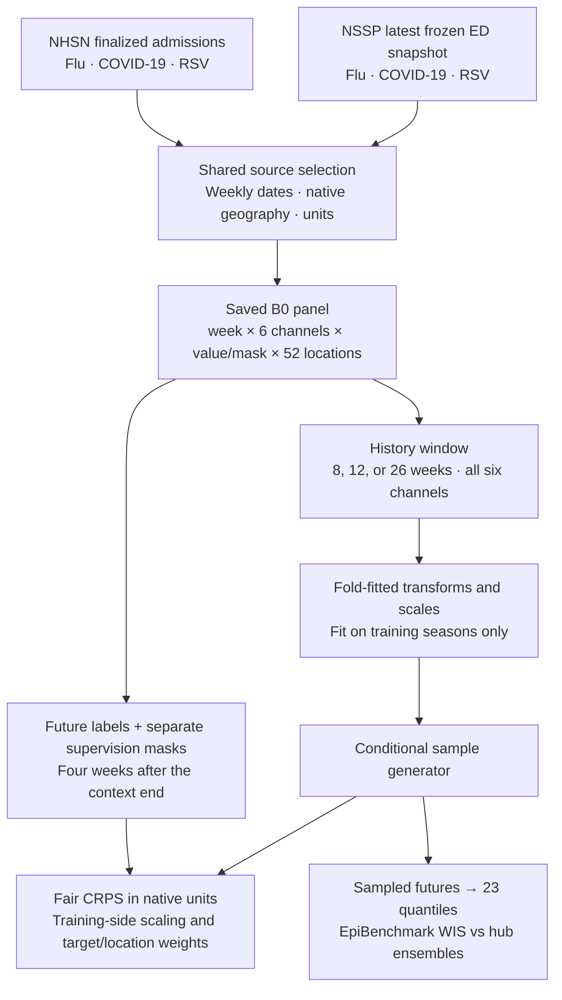
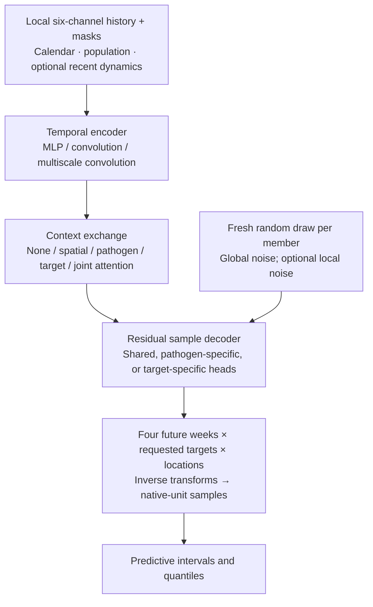
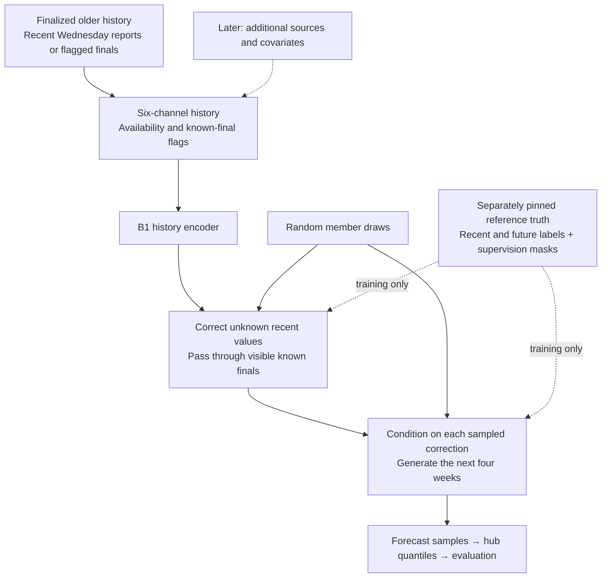

# Tapestry

This is the project with all my wishlist for infectious disease modeling:
Flusion's idea of learning across surveillance sources, InfluPaint's modeling
ideas and infrastructure, CRPS fitting like that very smart DeepMind paper,
and a way to bring it all together. The project builds on InfluPaint's Slurm
job manager and simulation storage, and EpiBenchmark's scoring.

The idea is simple: give a model the recent history of several pathogens and
ask it to generate possible futures. Learn across signals, track what is
observed, and fit the predictive distribution. The current models use MLP
encoders, convolutions, and transformer-style attention to exchange information
across locations and targets. The
[architecture notes](design/architecture.md#2-what-is-borrowed-from-each-paper)
explain the contributions from Flusion, InfluPaint, and DeepMind's Functional
Generative Networks paper, and their adaptations here.

## Unicorns exist

A **unicorn** is a model formulation that beats the ensemble across three
pathogens, on both admissions and ED visits — six targets — across the past
three seasons. It was unclear whether such a model existed, given how different
the seasons are. These retrospective experiments found candidates. Evaluation
uses season cross-validation: train on two seasons and forecast the third,
rotating through 2023–24, 2024–25, and 2025–26.

These models see finalized data with revisions unavailable to the hub ensembles
at forecast time. Whether the gains carry over to vintaged data remains to be
established. Ensemble comparisons cover flu admissions in 2023–24, flu and COVID
admissions in 2024–25, and all six targets in 2025–26. The unicorn finding applies
to this available support, not a complete six-by-three grid. These same seasons
guided architecture selection, so this is exploratory cross-validation, not an
untouched final evaluation.

[**Results — Fan plots.**](results/b0-1-crosses/index.md#fan-plots)
Green shows the new models; grey shows the ensemble. Measured interval coverage
remains below nominal levels.

Across B0.1, **36 of 172 configurations beat the ensemble on the combined
score**, with a best score of **0.883** (1 is ensemble parity; lower is better).
That count is not a count of unicorns winning every target/season comparison.
The top five configurations fit separate models by target or pathogen while
receiving all six input histories.

## B0: six channels, no revision nowcasting

B0 is the finalized-data experiment. The channels are:

| | Influenza | COVID-19 | RSV |
|---|---|---|---|
| NHSN hospital admissions | Channel 1 · counts | Channel 2 · counts | Channel 3 · counts |
| NSSP ED visits | Channel 4 · proportion | Channel 5 · proportion | Channel 6 · proportion |

Every channel has an observation mask. A missing value is different from an
observed zero. The panel contains 50 states, DC, and the native US series;
US is forecast directly rather than constructed by adding state predictions.

Admissions are stored as counts; ED percentages are converted to proportions.
Admission-rate transforms and normalization are fitted inside each training
partition. B0 treats the frozen latest NSSP values as retrospective truth;
they are not guaranteed immutable. The input mask handles existing gaps, but
this experiment does not establish performance with arbitrary missing sources
or historical reporting delays. See the [data contract](data/build-b-finalized.md).

## Architectures tried

The common model is a conditional sample generator. A history encoder describes
what is happening; random noise modulates a decoder to produce a possible
future. Repeating this gives a forecast distribution. Fair CRPS rewards
samples that are both accurate and appropriately spread, in admission counts
or ED proportions. Forecast quantiles are then evaluated with WIS.

| Part | Tried in B0.1 | Findings so far |
|---|---|---|
| History encoder | Flattened-history MLP, temporal convolution, multiscale convolution | MLP and ordinary convolution improved the tested matched references. More complexity did not consistently help. |
| Information exchange | Local only; shared spatial, pathogen-specific, target-specific, or joint location–target attention | These are transformer-style attention blocks over encoded histories, not a separate temporal-transformer encoder. Joint attention can see 52 × 6 = 312 tokens; its benefit depends on the recipe. |
| Sharing | Shared heads, three pathogen heads, six target heads; also fully independent fits by pathogen or target | The five leading configurations use independent fits. Each component still sees all six local input channels. Sharing inputs and sharing model weights are different choices. |
| Uncertainty | Noise-modulated residual decoders, global/local noise, stochastic trend decoder | The trend decoder worsened all four matched comparisons and has been removed from the active grid. Historical results retain it. |

The completed experiment crossed **172 configurations and three random seeds**,
with three held-out-season folds per seed. The [B0.1 specification](design/b0.1.md)
has the exact recipes; the [results](results/b0-1-crosses/index.md) have the
comparisons. These findings are about the tested combinations, not a general
ranking of MLPs, convolutions, and transformers.

## From prediction to nowcasting

The next steps are to evaluate masking with arbitrary source availability,
add covariates, and establish nowcasting performance.
The [B1 implementation](design/b1.md) has the Wednesday-vintage data
and correction/forecast path; the unicorn results above are still **B0 results**.
Nowcasting here means estimating the eventual values of recently completed
weeks whose reports are missing or provisional.

The key distinction is event time versus release time: what happened last week
may differ from what was reported by Wednesday. B1 uses finalized older history
and keeps eligible Wednesday reports for the two recent weeks. Missing recent
reports receive flagged reference finals, which bypass nowcasting and are excluded
from its loss and scores. This is retrospective conditioning on later information,
not evidence of operational Wednesday skill.

The goal is ensemble-matching performance across all six hub targets. Reporting
and revision timing remain central to that evaluation. An ensemble of the three
cross-validated models is one option for the FluSight submission; the mixture
still needs to be evaluated.

## Working with Tapestry

Start with [Getting started](getting-started.md), the
[training workflow](workflows/training.md), or the [data explorer](explorer/overview.md).
The [architecture notes](design/architecture.md) explain the model and masks; the [B1 page](design/b1.md) documents the current vintage-aware work.

*Documentation note · September 16, 2026: the “unicorn” terminology comes from the
project research update; numerical summaries come from the saved B0.1 report. No scores were recomputed for this update. “Across
three seasons” means the available target/season evaluation support, not a
complete six-by-three grid. Diagrams distinguish evaluated B0, implemented B1,
and later source/covariate extensions.*
