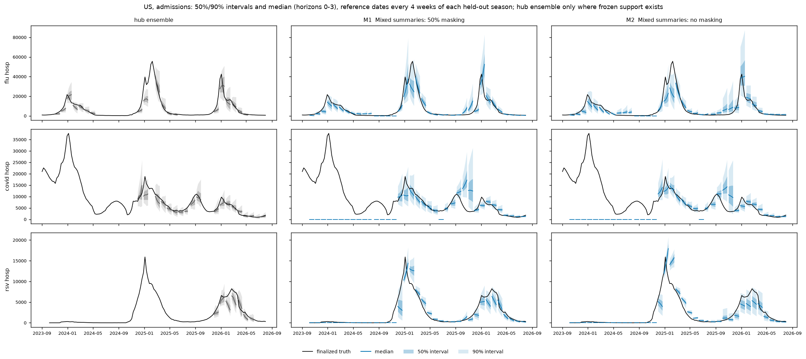
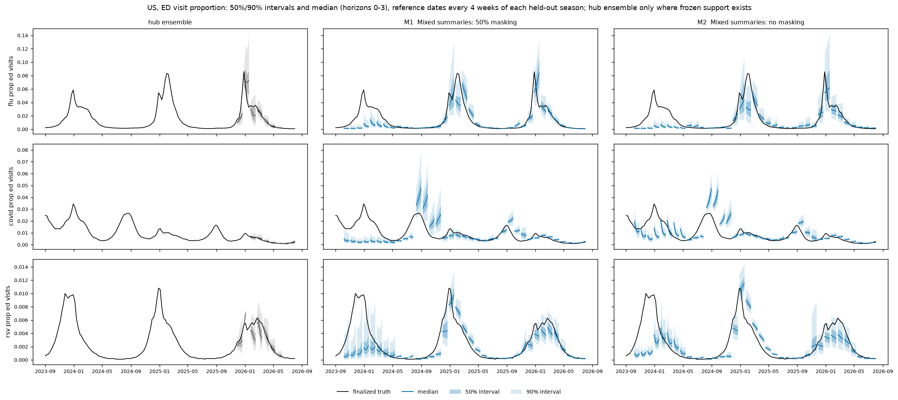
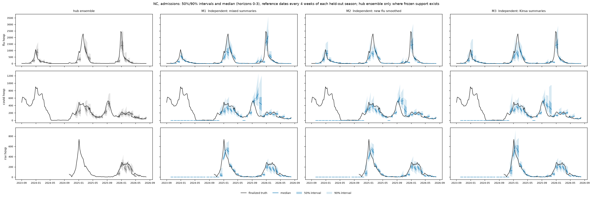
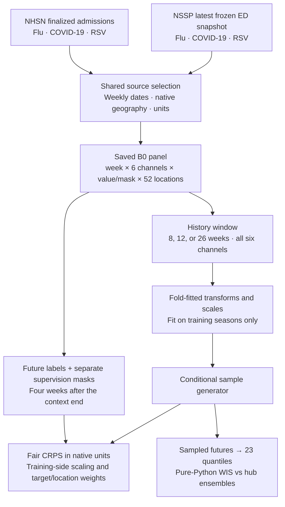
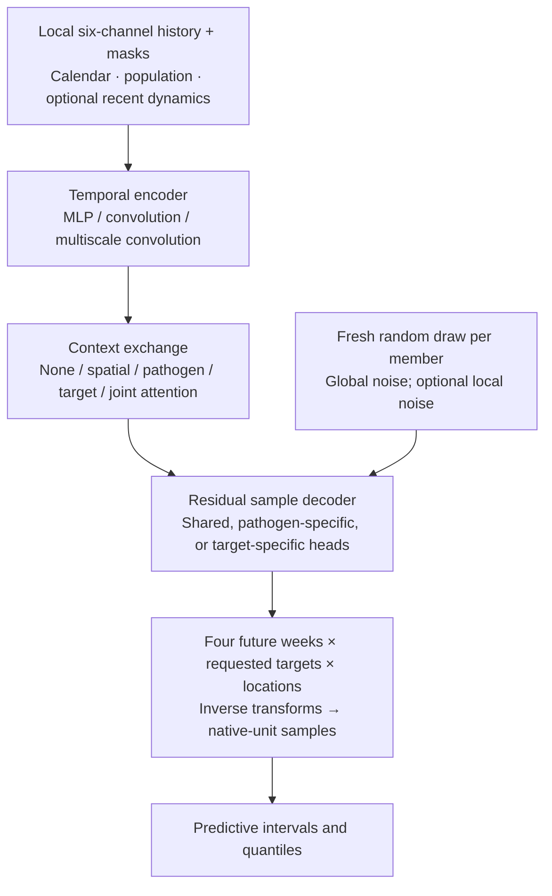
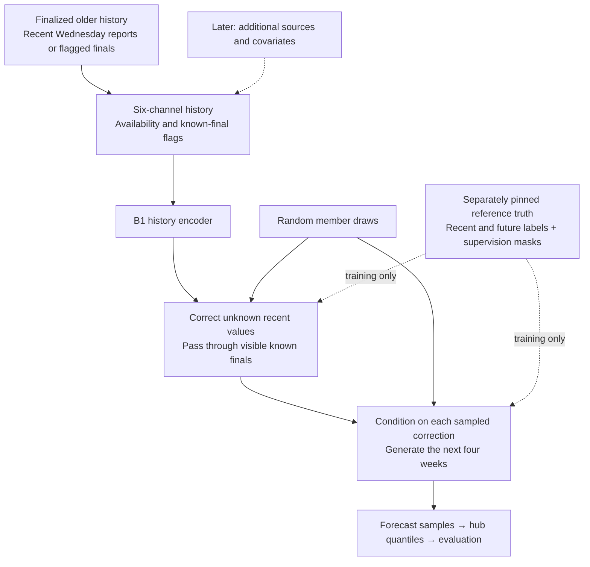

# Tapestry

**[Data: dataset coverage, availability staircase, source dates and revision tables](data/index.md)**

This is the project with all my wishlist for infectious disease modeling:
Flusion's idea of learning across surveillance sources, InfluPaint's modeling
ideas and infrastructure, CRPS fitting like that very smart DeepMind paper,
and a way to bring it all together. The project builds on InfluPaint's Slurm
job manager and simulation storage, and scores forecasts with its own
pure-Python WIS implementation.

The idea is simple: give a model the recent history of several pathogens and
ask it to generate possible futures. Learn across signals, track what is
observed, and fit the predictive distribution. The current models use MLP
encoders, convolutions, and transformer-style attention to exchange information
across locations and targets. The
[architecture notes](design/architecture.md#2-what-is-borrowed-from-each-paper)
explain the contributions from Flusion, InfluPaint, and DeepMind's Functional
Generative Networks paper, and their adaptations here.

## Run the current model

One shared panel feeds independently fitted nowcasting and forecasting stages.
Use the [current pipeline interface and manager commands](design/nowcast-forecast.md)
for training, prediction and ranking. The results below describe earlier research;
legacy experiment names do not select a separate implementation.

## Current direct-forecasting study

**Completed: 468/468 runs** in `b2-direct-research-v1`: 156 configurations,
three seeds, three held-out seasons and 256 evaluation draws. The best model
combines target-specific multiscale encoders, all seven covariates and geographic
pooling (WIS ratio **1.059**; Hub ensemble = 1). Covariates improve its matched
pooled control by 9.0%, mainly in 2024–25. No configuration mean beats the Hub
overall or in 2025–26; nominal 95% coverage is 79.3% for the leader.

Read the [completed analysis and best-model fan plots](results/b2-direct-research-v1/index.md)
for source attribution, spatial comparisons, uncertainty and the explicit
availability assumptions. The [study design and manager commands](design/b2-direct-research.md)
record the training recipe and launch.

## Previous forecasting results

**No-mask follow-up:** all 96 runs completed. Removing artificial target masking
worsened 29 of 32 selected formulations. The previous leader worsened from 1.036
to 1.121; the masked mixed-summary model remains best. The
[same main report](results/forecast-geography-v2/conclusions.md#follow-up-removing-artificial-masking-mostly-hurt)
contains the full paired analysis. The chart and US fan comparisons are directly below.

All 189 geography/covariate runs completed. Mixed covariate summaries lead with
relative WIS **1.036**, versus **1.124** without covariates. These are Wednesday-
availability-masked inputs, including target histories; they are not directly
comparable to B0's full finalized-input results. Read the
[conclusions](results/forecast-geography-v2/conclusions.md) and
[B0 protocol comparison](results/forecast-geography-v2/b0-comparison.md).

## Fan plots: the three leading models

Shown directly below: the Hub ensemble, mixed covariate summaries, smoothed new
flu covariates, and Kinsa summaries. The models were selected by three-seed mean
WIS; all fans use **seed 42**, not the best seed. Black curves are final truth;
fans show medians and 50%/90% intervals at four-week reference intervals.
The native US and North Carolina are shown; these are illustrative locations,
not substitutes for all-location scores. Hub fans appear only where benchmark
support exists.

### US admissions

### US ED proportions

### North Carolina admissions

### North Carolina ED proportions

## Unicorns exist

A **unicorn** is a model formulation that beats the ensemble across three
pathogens, on both admissions and ED visits — six targets — across the past
three seasons. The [September 25 audit](results/b0-audit/index.md) found that
none of the 172 B0 formulations meets this strict criterion, although their
aggregate gains reproduce exactly. Evaluation
uses season cross-validation: train on two seasons and forecast the third,
rotating through 2023–24, 2024–25, and 2025–26.

These models see finalized data with revisions unavailable to the hub ensembles
at forecast time. Whether the gains carry over to vintaged data remains to be
established. Ensemble comparisons cover flu admissions in 2023–24, flu and COVID
admissions in 2024–25, and all six targets in 2025–26. The aggregate results apply
to this available support, not a complete six-by-three grid. These same seasons
guided architecture selection, so this is exploratory cross-validation, not an
untouched final evaluation.

[**Results — Fan plots.**](legacy-v0/results/b0-1-crosses/index.md#fan-plots)
Green shows the new models; grey shows the ensemble. Measured interval coverage
remains below nominal levels.

Across B0.1, **36 of 172 configurations beat the ensemble on the combined
score**, with a best score of **0.883** (1 is ensemble parity; lower is better).
That count is not a count of unicorns winning every target/season comparison.
The top five configurations fit separate models by target or pathogen while
receiving all six input histories.

The [B1 overnight results](legacy-v0/results/b1-overnight/index.md) compare direct forecasts,
supplied-final flags, auxiliary nowcasts, and two-stage forecasts under vintage
inputs and artificial masking, with rankings and matched forecast fan plots.
The page also reports the [completed 300-epoch follow-up](legacy-v0/results/b1-overnight/index.md#300-epoch-results-and-comparison),
with matched-seed comparisons and 100-vs-300-epoch fan plots.

## B0: six channels, no revision nowcasting

B0 is the finalized-data experiment. The channels are:

| | Influenza | COVID-19 | RSV |
|---|---|---|---|
| NHSN hospital admissions | Channel 1 · counts | Channel 2 · counts | Channel 3 · counts |
| NSSP ED visits | Channel 4 · proportion | Channel 5 · proportion | Channel 6 · proportion |

Every channel has an observation mask. A missing value is different from an
observed zero. The panel contains 50 states, DC, and the native US series;
US is forecast directly rather than constructed by adding state predictions.

```mermaid
flowchart TD
    A["NHSN finalized admissions<br/>Flu · COVID-19 · RSV"] --> C["Shared source selection<br/>Weekly dates · native geography · units"]
    B["NSSP latest frozen ED snapshot<br/>Flu · COVID-19 · RSV"] --> C
    C --> D["Saved B0 panel<br/>week × 6 channels × value/mask × 52 locations"]
    D --> E["History window<br/>8, 12, or 26 weeks · all six channels"]
    D --> F["Future labels + separate supervision masks<br/>Four weeks after the context end"]
    E --> G["Fold-fitted transforms and scales<br/>Fit on training seasons only"]
    G --> H["Conditional sample generator"]
    F --> I["Fair CRPS in native units<br/>Training-side scaling and target/location weights"]
    H --> I
    H --> J["Sampled futures → 23 quantiles<br/>Pure-Python WIS vs hub ensembles"]
```

Admissions are stored as counts; ED percentages are converted to proportions.
Admission-rate transforms and normalization are fitted inside each training
partition. B0 treats the frozen latest NSSP values as retrospective truth;
they are not guaranteed immutable. The input mask handles existing gaps, but
this experiment does not establish performance with arbitrary missing sources
or historical reporting delays. See the [data contract](legacy-v0/data/build-b-finalized.md).

## Architectures tried

The common model is a conditional sample generator. A history encoder describes
what is happening; random noise modulates a decoder to produce a possible
future. Repeating this gives a forecast distribution. Fair CRPS rewards
samples that are both accurate and appropriately spread, in admission counts
or ED proportions. Forecast quantiles are then evaluated with WIS.

```mermaid
flowchart TD
    A["Local six-channel history + masks<br/>Calendar · population · optional recent dynamics"] --> B["Temporal encoder<br/>MLP / convolution / multiscale convolution"]
    B --> C["Context exchange<br/>None / spatial / pathogen / target / joint attention"]
    C --> D["Residual sample decoder<br/>Shared, pathogen-specific, or target-specific heads"]
    Z["Fresh random draw per member<br/>Global noise; optional local noise"] --> D
    D --> E["Four future weeks × requested targets × locations<br/>Inverse transforms → native-unit samples"]
    E --> F["Predictive intervals and quantiles"]
```

| Part | Tried in B0.1 | Findings so far |
|---|---|---|
| History encoder | Flattened-history MLP, temporal convolution, multiscale convolution | MLP and ordinary convolution improved the tested matched references. More complexity did not consistently help. |
| Information exchange | Local only; shared spatial, pathogen-specific, target-specific, or joint location–target attention | These are transformer-style attention blocks over encoded histories, not a separate temporal-transformer encoder. Joint attention can see 52 × 6 = 312 tokens; its benefit depends on the recipe. |
| Sharing | Shared heads, three pathogen heads, six target heads; also fully independent fits by pathogen or target | The five leading configurations use independent fits. Each component still sees all six local input channels. Sharing inputs and sharing model weights are different choices. |
| Uncertainty | Noise-modulated residual decoders, global/local noise, stochastic trend decoder | The trend decoder worsened all four matched comparisons and has been removed from the active grid. Historical results retain it. |

The completed experiment crossed **172 configurations and three random seeds**,
with three held-out-season folds per seed. The [B0.1 specification](legacy-v0/design/b0.1.md)
has the exact recipes; the [results](legacy-v0/results/b0-1-crosses/index.md) have the
comparisons. These findings are about the tested combinations, not a general
ranking of MLPs, convolutions, and transformers.

## From prediction to nowcasting

The next steps are to evaluate masking with arbitrary source availability,
add covariates, and establish nowcasting performance.
The [B1 implementation](legacy-v0/design/b1.md) has the Wednesday-vintage data
and correction/forecast path; the unicorn results above are still **B0 results**.
Nowcasting here means estimating the eventual values of recently completed
weeks whose reports are missing or provisional.

```mermaid
flowchart TD
    A["Finalized older history<br/>Recent Wednesday reports or flagged finals"] --> B["Six-channel history<br/>Availability and known-final flags"]
    B --> C["B1 history encoder"]
    C --> D["Correct unknown recent values<br/>Pass through visible known finals"]
    D --> E["Condition on each sampled correction<br/>Generate the next four weeks"]
    Z["Random member draws"] --> D
    Z --> E
    T["Separately pinned reference truth<br/>Recent and future labels + supervision masks"] -. "training only" .-> D
    T -. "training only" .-> E
    E --> F["Forecast samples → hub quantiles → evaluation"]
    G["Later: additional sources and covariates"] -.-> B
```

The key distinction is event time versus release time: what happened last week
may differ from what was reported by Wednesday. B1 uses finalized older history
and keeps eligible Wednesday reports for the two recent weeks. Missing recent
reports receive flagged reference finals, which bypass nowcasting and are excluded
from its loss and scores. This is retrospective conditioning on later information,
not evidence of operational Wednesday skill.

The goal is ensemble-matching performance across all six hub targets. Reporting
and revision timing remain central to that evaluation. An ensemble of the three
cross-validated models is one option for the FluSight submission; the mixture
still needs to be evaluated.

## Working with Tapestry

The [B2 covariate results](legacy-v0/results/B2-screen/index.md) include the completed
32-run screen, heatmaps, forecast fans and an explanation of the source-timing
and training-support limitations. The [B2-kinsa results](legacy-v0/results/B2-kinsa/index.md)
add the national Kinsa signal (PopHIVE) to that comparison.

Start with [Getting started](getting-started.md), the
[training workflow](workflows/training.md), or the [data explorer](explorer/overview.md).
The [architecture notes](design/architecture.md) explain the model and masks. Since 2026-09-22 B0, B1 and B2 are one
model and one scenario space ([unified design](design/restructure-2026-unified.md)); the B0/B1/B2 results quoted
above were produced by the earlier code and are kept under [Legacy (v0)](legacy-v0/index.md).

*Documentation note · September 16, 2026: the “unicorn” terminology comes from the
project research update; numerical summaries come from the saved B0.1 report. No scores were recomputed for this update. “Across
three seasons” means the available target/season evaluation support, not a
complete six-by-three grid. Diagrams distinguish evaluated B0, implemented B1,
and later source/covariate extensions.*
