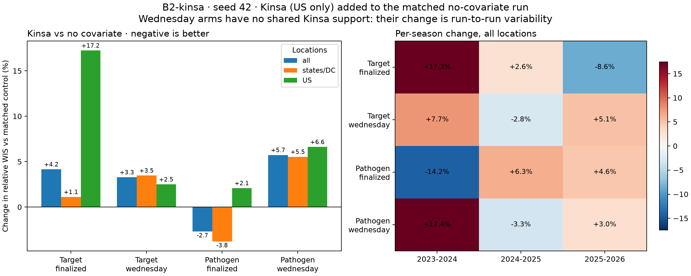

# B2-kinsa: does the national Kinsa signal help?

**No effect of Kinsa can be distinguished from run-to-run variability in this
seed-42 experiment.** Adding the US-only Kinsa cough/cold/flu signal changed the
three-season relative WIS by +4.15% (target recipe) and −2.69% (pathogen recipe)
with finalized inputs. Two independent noise checks below produce changes of the
same size (+3.3% to +5.7%) with no Kinsa signal involved.
The Wednesday arm could not test Kinsa at all, by construction.

All **8 runs** completed: two recipes × two input modes × {no covariates, Kinsa},
with three held-out seasons per run. That is 24 season fits and 108 component fits,
in 21.5 minutes on both patron nodes (Slurm arrays 1877664 and 1877665). The
[experiment specification](../../design/b2.md#kinsa-only-experiment-b2-kinsa) states
every assumption, and the [dataset page](../../data/b2.md#kinsa-national-only) and
[source page](../../../data/kinsa.md) describe the signal and its PopHIVE vintages.

## Result

Lower relative WIS is better. It is defined as on the
[B2-screen page](../B2-screen/index.md#results): model WIS over the official
ensemble's, states/DC weighted 80% and the native US series 20%, admissions
targets 1 and ED targets 0.5, seasons averaged equally, on the frozen scoring
support. All figures below use seed 42 only.

| Recipe | Inputs | No covariates | + Kinsa | Change | States/DC | US only |
|---|---|---:|---:|---:|---:|---:|
| Target MLP, gap-only | Finalized | 0.9592 | 0.9990 | **+4.15%** | +1.11% | +17.23% |
| Pathogen MLP, mixed | Finalized | 0.9523 | 0.9268 | **−2.69%** | −3.78% | +2.08% |
| Target MLP, gap-only | Wednesday | 0.9558 | 0.9872 | +3.28% | +3.47% | +2.49% |
| Pathogen MLP, mixed | Wednesday | 0.8993 | 0.9508 | +5.73% | +5.53% | +6.61% |

The overall minimum is unchanged: pathogen/Wednesday/no covariates, 0.8993.
The last two columns are the change in each location group's relative WIS.



[PDF](kinsa-effect.pdf) · [Matched-control scores, all targets](matched_controls.csv) ·
[Season-level contrasts](season_matched_controls.csv)

## How large is the noise?

Two independent checks bound what one seed can resolve.

**1. Identical runs do not always repeat.** The four no-covariate controls have
the same scenario strings, seed and data as their `B2-screen` originals. Three
reproduce within 0.4%; the fourth does not:

| Control | B2-screen | Here | Change |
|---|---:|---:|---:|
| Pathogen, Wednesday | 0.8994 | 0.8993 | −0.01% |
| Pathogen, finalized | 0.9523 | 0.9523 | 0.00% |
| Target, Wednesday | 0.9524 | 0.9558 | +0.36% |
| Target, finalized | 0.9248 | 0.9592 | **+3.72%** |

The pathogen recipe is reproducible to two decimals. The target recipe is not:
its per-season scores moved by up to 10.1% (the 2025–26 finalized fold) with no
change in configuration. Tasks are assigned dynamically to L40 and H100 GPUs, so
the two executions probably ran the folds on different hardware. The cause of the
target recipe's sensitivity is not established: both recipes select epochs by
early stopping, and the selected epochs were not compared. The result also
means the `B2-screen` comparison of covariates with this control, such as
inpatient claims at +7.92%, carries at least this much uncertainty.

**2. An input that cannot help still changes the score.** In the Wednesday arm
Kinsa has no shared support in any fold (zero evaluation support for two
folds, zero fitting support for the third; see the
[support table](../../data/b2.md#2026-09-21-rebuild-with-kinsa)), so the
Kinsa channel is masked or disabled at every scored input. Its scores still
differ from the control by +3.28% and +5.73%. The pathogen control is exactly
reproducible, so its +5.73% is not hardware noise: the extra input
shifts the random initialization, which acts as a different seed. Seed-level
variation of 3% to 6% is therefore an observed property of these recipes.

The two finalized Kinsa effects, +4.15% and −2.69%, lie inside that range and
have opposite signs. **Neither is evidence of a benefit or a harm.**

## Where the changes come from

Season-level changes in the finalized arm are far larger than the aggregate and
do not agree between recipes. Changes in relative WIS versus the matched control
(%), all locations:

| Recipe | Inputs | 2023–24 | 2024–25 | 2025–26 |
|---|---|---:|---:|---:|
| Target | Finalized | +17.3 | +2.6 | −8.6 |
| Pathogen | Finalized | −14.2 | +6.3 | +4.6 |
| Target | Wednesday | +7.7 | −2.8 | +5.1 |
| Pathogen | Wednesday | +17.4 | −3.3 | +3.0 |

For the US alone, where Kinsa is the only place the input is active, the
finalized target recipe changes by +43.1% in 2023–24 and the pathogen recipe by
−15.4% in that season and +28.6% in 2024–25. States/DC show the same signs as
the all-location figures. Per-target changes range from −11.7% to +39.1%
and follow no pattern across recipes; the largest, COVID-19 ED visits for the
finalized target recipe (+39.1%), is one target in one seed.

## What this does and does not say

- **One seed.** The spread above is an estimate from a few unrelated
  comparisons, not a standard error. A conclusion about Kinsa needs several
  seeds per cell; the whole suite takes about 22 minutes per seed on the patron
  nodes.
- **Kinsa reaches only the US.** It is masked at the other 51 locations by
  native geography, so states could respond only through shared weights. The
  states/DC changes measure that spillover, not a state-level signal.
- **The finalized arm is retrospective.** PopHIVE has held these values since
  2026-04-06 and never revised one. That says nothing about when Kinsa itself
  could have supplied them.
- **The Wednesday arm cannot test Kinsa.** PopHIVE's Git history begins on
  2026-04-06, so only late 2025–26 origins have a Kinsa vintage, and they never
  fall on both sides of a fold. A test needs an evaluation season that follows a
  training season with vintages, or a deeper vintage history.
- **No EpiBench comparison was run.** Only the ranking against the frozen Hub
  ensemble, the same scorer as the `B2-screen` primary table, is reported here.

## Reproduce

```bash
cd /proj/jlessler/projects/tapestry-all/tapestry
.venv/bin/python -m tapestry.models.manager status -e B2-kinsa
.venv/bin/python -m tapestry.models.manager rank -e B2-kinsa
.venv/bin/python scripts/plot_b2_kinsa.py --ranking docs/results/B2-kinsa/ranking --output docs/results/B2-kinsa
```

- Experiment `data/experiments/B2-kinsa` on Longleaf; ranking folder
  `ranking-db77e271a9bc`, mirrored in [`ranking/`](ranking/configuration_ranking.csv).
- Dataset `build_b2.npz`, SHA-256
  `5511f75076ffc0964df98b3b48de9c18d8315c3d21b7dc92ebb91872443c983b`; Kinsa
  snapshot `20260921T161214.502587Z` (133 PopHIVE commits, 2,820 daily values).
- Runs used the source snapshot saved by `plan`, from Longleaf checkout
  `ccb324c` with uncommitted changes, on both patron nodes with eight workers
  per GPU. Mixed hardware may cause small numerical differences.
