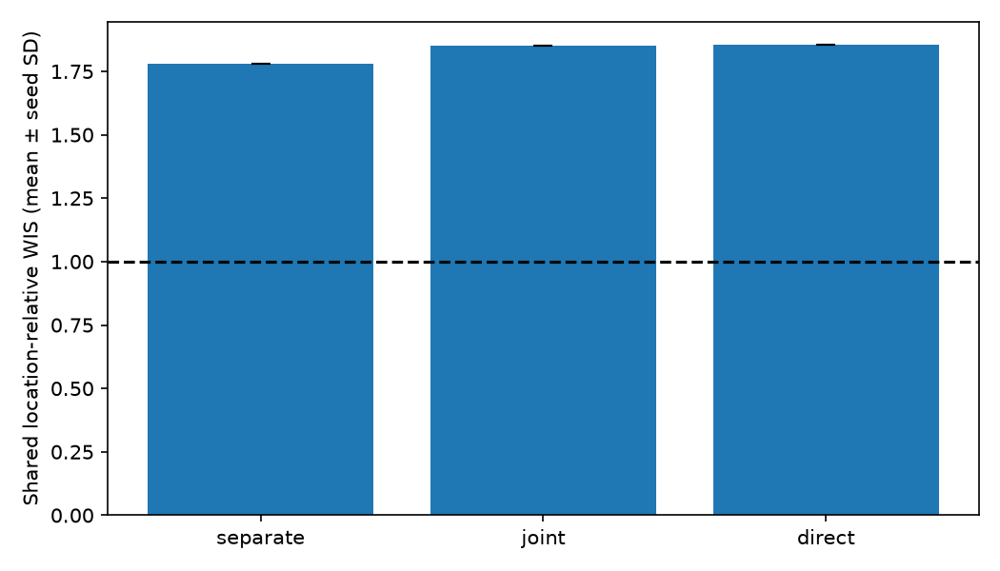
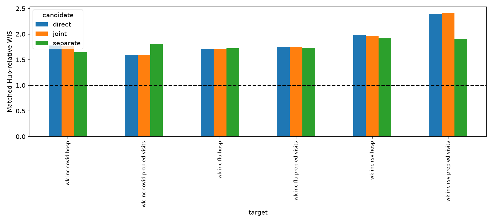
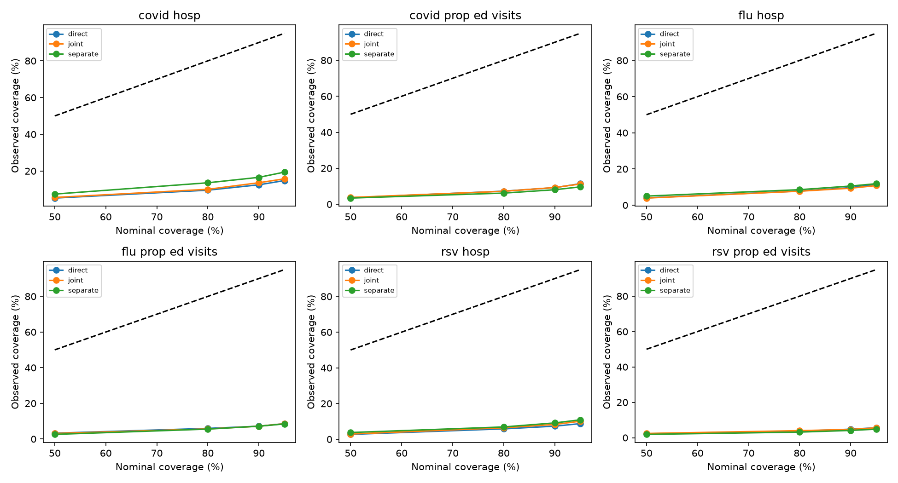
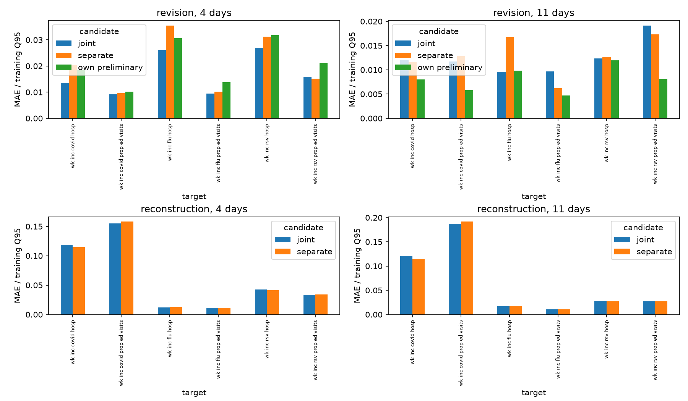

# Frozen forward development benchmark: 2025–26

Training cutoff: July 26, 2025 end of day UTC; mature labels through June 28. Test Wednesdays July 30, 2025–July 29, 2026; forecast targets August 2, 2025–August 1, 2026. Parameters frozen. This season was previously explored; this is **forward development**, not an untouched final test.

[Experiment specification](../../workflows/forward-2025.md) · [Data assumptions](../../data/forward-2025.md)

## Matched Hub-supported forecast tasks

| candidate | seeds | combined_mean | combined_sd | states_dc_combined_mean | US_combined_mean |
| --- | --- | --- | --- | --- | --- |
| separate | 1 | 1.7807 | nan | 1.7574 | 1.8740 |
| joint | 1 | 1.8500 | nan | 1.8144 | 1.9926 |
| direct | 1 | 1.8542 | nan | 1.8182 | 1.9985 |

Mean and sample SD describe fitting variability only. One season provides no independent season replication; seeds and locations are not independent seasons. Native WIS cannot be compared across targets' units. Hub support varies by target and is a subset of the full test period. [Matched target/season/geography scores](matched-hub-scores.csv).

## Full forward-period diagnostics

| candidate | target | wis | scaled_wis | covered_50 | covered_95 |
| --- | --- | --- | --- | --- | --- |
| direct | wk inc covid hosp | 339.6102 | 0.0600 | 0.0527 | 0.1480 |
| direct | wk inc covid prop ed visits | 0.0021 | 0.0708 | 0.0363 | 0.1141 |
| direct | wk inc flu hosp | 693.3233 | 0.1023 | 0.0401 | 0.1145 |
| direct | wk inc flu prop ed visits | 0.0070 | 0.1186 | 0.0329 | 0.0861 |
| direct | wk inc rsv hosp | 213.6888 | 0.1005 | 0.0272 | 0.0874 |
| direct | wk inc rsv prop ed visits | 0.0011 | 0.0955 | 0.0227 | 0.0563 |
| joint | wk inc covid hosp | 336.7664 | 0.0596 | 0.0560 | 0.1575 |
| joint | wk inc covid prop ed visits | 0.0021 | 0.0707 | 0.0377 | 0.1124 |
| joint | wk inc flu hosp | 694.7843 | 0.1021 | 0.0391 | 0.1081 |
| joint | wk inc flu prop ed visits | 0.0070 | 0.1186 | 0.0310 | 0.0858 |
| joint | wk inc rsv hosp | 210.4646 | 0.0995 | 0.0293 | 0.1010 |
| joint | wk inc rsv prop ed visits | 0.0011 | 0.0959 | 0.0239 | 0.0558 |
| separate | wk inc covid hosp | 347.1978 | 0.0619 | 0.0745 | 0.1941 |
| separate | wk inc covid prop ed visits | 0.0022 | 0.0773 | 0.0342 | 0.0965 |
| separate | wk inc flu hosp | 701.7429 | 0.1022 | 0.0501 | 0.1185 |
| separate | wk inc flu prop ed visits | 0.0070 | 0.1182 | 0.0258 | 0.0844 |
| separate | wk inc rsv hosp | 202.8986 | 0.0972 | 0.0377 | 0.1088 |
| separate | wk inc rsv prop ed visits | 0.0009 | 0.0804 | 0.0187 | 0.0482 |

All candidates share identical available forecast labels. Tables use equal locations within states/DC (80%) and US (20%). Target-native WIS, stable training-Q95-scaled WIS and coverage are reported separately from the Hub-relative ranking.

[Target and seed diagnostics](forecast-by-target-seed.csv) · [Location diagnostics](forecast-by-location.csv) · [Horizon diagnostics](forecast-by-horizon.csv)

## Recent predictions

4 candidate/seed/target/age/location ratios were undefined under the predeclared threshold (mean preliminary absolute error / training Q95 ≤ 0.0001). These are not assigned zero or epsilon denominators. No revision ratio exists for missing reports.

[Recent diagnostics](recent-summary.csv) · [Location diagnostics and denominator flags](recent-by-location.csv)

**Execution check only: one epoch. Do not interpret these scores as benchmark conclusions.**

Archive dates are accepted availability proxies, with assumed interior completeness; strict provider-publication availability is not independently certified. Finalized values are 28-day-mature cutoff proxies. Four-day NSSP visible correction training begins only June 18, 2025. Older-history fitting uses cutoff-final proxies; deployment uses Wednesday reports. The separate pipeline additionally learns forecasting on exact cutoff-final recent inputs and deploys on estimates; sampling propagates uncertainty but does not eliminate that mismatch. No calibration, artificial masking or test-driven epoch selection was used.
