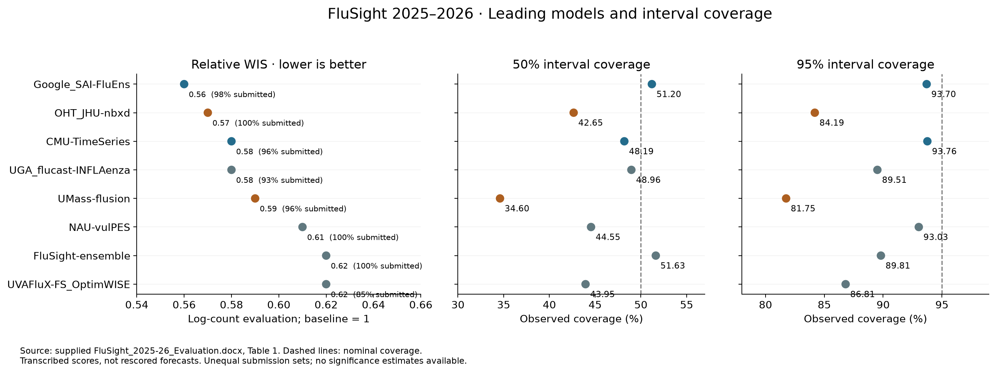

# FluSight 2025–2026 leading models

Research review, 19 September 2026. The main finding is that the leading systems combine statistical sharing, seasonal information, useful auxiliary surveillance, and ensembles. Their success does not identify a single winning neural architecture. Google's submission is especially informative: it ensembles forecasting programs developed through LLM-guided search, including adaptations of established epidemiological models.

## Evaluation source and interpretation

The ranking source is the user-supplied [FluSight 2025–2026 Evaluation](../../../influpaint/Flusight/FluSight_2025-26_Evaluation.docx). The file is outside this repository. Its public publication status was not established. Its Table 1, rather than an earlier paper's preliminary evaluation, is authoritative for the numbers below.

The report evaluates weekly influenza hospital-admission forecasts at horizons 0–3, uses final target data published July 1, 2026, excludes national forecasts and Puerto Rico, and requires at least 75% submission completeness. It describes solicitation through May 20, 2026, but gives inconsistent November start dates. The exact scored reference-date sequence is not supplied in the text.

Crucially, the report applies WIS to **log-transformed counts**, then describes relative performance through geometric aggregation against corresponding baseline forecasts. This is not ordinary arithmetic-mean WIS on hospital-admission counts. A relative score of 0.56 denotes 44% lower reported score than baseline under this protocol; it does not mean 44% fewer missed admissions. The document does not specify the zero offset or enough implementation detail to reproduce every aggregation choice.

Transforming observations and forecast quantiles before WIS differs from taking the logarithm of WIS afterward. The former changes the distance being assessed; the latter changes aggregation incentives. The referenced [Bosse et al. paper](https://journals.plos.org/ploscompbiol/article?id=10.1371/journal.pcbi.1011393) explains why log-scale scoring emphasizes relative errors and can change rankings. Do not infer that the report uses `log1p` merely because that is a common implementation.

| Model | Relative WIS | 50% coverage | 95% coverage | Submitted |
|---|---:|---:|---:|---:|
| Google_SAI-FluEns | 0.56 | 51.20% | 93.70% | 98% |
| OHT_JHU-nbxd | 0.57 | 42.65% | 84.19% | 100% |
| CMU-TimeSeries | 0.58 | 48.19% | 93.76% | 96% |
| UGA_flucast-INFLAenza | 0.58 | 48.96% | 89.51% | 93% |
| UMass-flusion | 0.59 | 34.60% | 81.75% | 96% |
| NAU-vulPES | 0.61 | 44.55% | 93.03% | 100% |
| FluSight-ensemble | 0.62 | 51.63% | 89.81% | 100% |
| UVAFluX-FS_OptimWISE | 0.62 | 43.95% | 86.81% | 85% |

The chart reproduces the supplied values; it is not an independent rescoring. No uncertainty bars are available. Differences of 0.01–0.03 should not be treated as statistically established differences, particularly with unequal submission sets and rounding.

Google and CMU combine low scores with near-nominal aggregate coverage. OHT and UMass have much stronger undercoverage: their nominal 95% intervals miss 15.81% and 18.25% of observations, respectively, versus the nominal 5%. Those are approximately 3.2 and 3.7 times the nominal miss rate. Coverage alone cannot distinguish narrow intervals from bias, mistimed peaks, or mixtures of these effects. Good average coverage also need not imply calibration during epidemic growth or by jurisdiction.

The source report contains editorial inconsistencies: its prose says 39 included models and 33 beating baseline, while Table 1 has 41 rows and 34 scores below 1. It also places one coverage trough on December 27, 2026, although the surrounding season narrative identifies December 27, 2025. These discrepancies do not change the transcribed top-eight rows, but they reinforce the need for the scoring code before exact replication.

## Evidence and version policy

Hub metadata was retrieved on September 19, 2026. It is self-reported and sometimes incomplete or stale. Papers explain published versions; code explains the inspected implementation, not necessarily every weekly production run. Season-end repository commits were located using a June 1, 2026 cutoff and recorded in [season-commits.json](flusight-2025-2026-model-review/season-commits.json). Where code and metadata differ, both are identified. No model was trained or rerun for this review.

### Google_SAI-FluEns

**Inputs.** NHSN hospital admissions, historical ILINet, and population. Its [hub metadata](https://github.com/cdcepi/FluSight-forecast-hub/blob/main/model-metadata/Google_SAI-FluEns.yml) does not list Google searches, proprietary mobility, or web-search volumes. Historical surveillance is important here: the [public task specification](https://github.com/google-research/google-research/blob/master/epi_forecasts/problem_statements/flu_problem_statement.txt) supplies roughly 20 years of ILI history and explicitly encourages either standardizing it into additional training seasons or mapping it into synthetic hospitalization history.

**What the AI does.** [Aygün et al., Nature 654, 909–916 (2026)](https://www.nature.com/articles/s41586-026-10658-6), published May 19, introduces Empirical Research Assistance (ERA). An LLM writes and modifies executable scientific programs; a tree search chooses which candidates to extend using measured performance. Scientific descriptions can seed adaptations and combinations. The Nature paper covers several scientific tasks and retrospective COVID forecasting. It is the methodological foundation, rather than the direct source of this end-of-season flu ranking.

The direct companion is [Martinson et al., arXiv:2605.16238](https://arxiv.org/abs/2605.16238). It evaluates prospective respiratory forecasts through May 2, 2026. The discussion describes an equally weighted median ensemble, but Methods 5.3 inconsistently calls it a median and then an average of component quantiles. Exact aggregation requires production-code verification. Its evaluation differs from the supplied report in dates, eligibility and geography, so its numerical results should not be substituted into Table 1. It also distinguishes methodological fidelity from accuracy: successful generated code can depart from the scientific model that inspired its prompt.

**Which models?** The [public flu inventory](https://github.com/google-research/google-research/blob/master/epi_forecasts/flu_hub/README.md) marks 13 entries as ensemble members. These include adaptations of PSI-PROF_MOA, UMass Flusion, UGA INFLAenza, Cornell/JHU hierarchSIR, two NU-PGF variants, and a LANL-DBM variant; four hybrids involving LANL, CMU, UGA, Columbia and UVA methods; and a novel multilayer model. These are Google's generated implementations, not simply the original teams' submitted forecasts. The inventory is a snapshot, not proof of constant membership every week. It explicitly notes that some code is not yet available.

**Concrete example.** The public [LANL-DBM × LANL-Inferno implementation](https://github.com/google-research/google-research/blob/master/epi_forecasts/flu_hub/model_py/Google_SAI-Hybrid_1.py) maps ILI into hospitalization proportions, works in logit space, and constructs a seasonal baseline using Fourier features and linear regression. It adds discrepancy/residual modeling. Thus a mechanistic source name should not be read as proof that the resulting code actually solves the source model's SIR equations.

**Interpretation.** Google's advantage plausibly comes from broad model search, useful historical transfer, and complementary errors. This is a hypothesis about mechanisms of improvement, not an attribution established by the end-of-season ranking. The actionable precedent is a reproducible development loop with untouched evaluation data, plus diversity among final forecasting programs.

**September 20 implementation follow-up.** The public generated scripts make the architecture distinction concrete. [Adapted_9](https://github.com/google-research/google-research/blob/master/epi_forecasts/flu_hub/model_py/Google_SAI-Adapted_9.py), named for Cornell/JHU hierarchSIR, actually fits LightGBM quantile regressors using statistical proxies; it does not implement the referenced SIR solver. [Adapted_3](https://github.com/google-research/google-research/blob/master/epi_forecasts/flu_hub/model_py/Google_SAI-Adapted_3.py), named for INFLAenza, uses BayesianRidge and empirical residual uncertainty rather than R-INLA. [Adapted_11](https://github.com/google-research/google-research/blob/master/epi_forecasts/flu_hub/model_py/Google_SAI-Adapted_11.py) combines boosted quantile models with an autoregressive component. Hybrid_1 uses histogram gradient boosting for conditional mean and variance in logit space, followed by sampling. These are inspected public versions, not proof of identical code in every submission. The earlier auxiliary-encoder proposal for B1 is our proposed alternative, not Google's demonstrated architecture.

### OHT_JHU-nbxd

**Inputs and architecture.** [Hub metadata](https://github.com/cdcepi/FluSight-forecast-hub/blob/main/model-metadata/OHT_JHU-nbxd.yml) lists hospitalizations, dew point, and NREVSS test positivity. A temporal convolutional network encodes multivariate history into a sequence consumed by an extended N-BEATS decoder. Additional blocks predict error variance; gamma quantiles provide uncertainty. The submission uses a median ensemble across lookback windows and initializations.

**Code adds detail.** In the [public flu defaults](https://github.com/CDDEP-DC/nbeats-xd/blob/87f255c68b13e5dfd721035c45c672cacf6790ee/data_utils/flu.py), predictors also include temperature, outpatient surveillance, and a seasonal calendar variable. Defaults enumerate lookbacks 2–5 and three repetitions. Separate configuration supports pretraining on a FluSurv-derived hospitalization series. These are available code paths, not confirmation that all were used in each 2025–2026 submission. The public repository's latest pre-June commit is from December 2024.

The [forecast utilities](https://github.com/CDDEP-DC/nbeats-xd/blob/87f255c68b13e5dfd721035c45c672cacf6790ee/data_utils/forecast.py) confirm gamma as the default quantile distribution. Training-loss names and output-distribution choice are separate settings; a Student-t loss setting does not contradict gamma output quantiles. I did not identify a dedicated peer-reviewed paper for this exact operational model; the repository and metadata are the direct references.

**Interpretation.** This is the clearest neural forecasting architecture in the group. Its score makes it a useful comparator for multivariate encoding and direct multi-horizon prediction. The substantial undercoverage makes uncertainty behavior an equally important part of that comparison. The table does not identify whether the gamma assumption, variance estimation, or timing errors caused the misses.

### CMU-TimeSeries

**Core method.** [Metadata](https://github.com/cdcepi/FluSight-forecast-hub/blob/main/model-metadata/CMU-TimeSeries.yml) describes quantile autoregression trained jointly across locations, population normalization, and whitening to pool historical FluSurv and ILI observations with hospitalizations. It selects a seven-week seasonal window across past years, fits quantiles separately, and repairs negative/crossing outputs afterward. Climatology and linear models supply additional ensemble components. The seasonal window selects comparable historical calendar weeks; it is not evidence of accessing future observations at forecast time.

**Important metadata limitation.** The [May 2026 production script](https://github.com/cmu-delphi/exploration-tooling/blob/e86834be5f681fda60591dee0105d3d81df179c0/scripts/flu_hosp_prod.R) explicitly loads NSSP emergency-department data and includes a seasonal model using that auxiliary signal. Its [dated weight file](https://github.com/cmu-delphi/exploration-tooling/blob/e86834be5f681fda60591dee0105d3d81df179c0/scripts/flu_geo_exclusions.csv) heavily favors the auxiliary seasonal component in several season entries. The metadata's approximate 6:1:1 description is therefore not an exact specification for this season. Nested ensemble stages also mean that raw weight-file entries should not be interpreted as final normalized shares without tracing the aggregation functions.

**Interpretation.** CMU is a particularly useful scientific baseline: a comparatively simple forecasting family, extensive sharing across locations and surveillance histories, a relevant early signal, and strong aggregate coverage. Its result argues for testing data construction and pooling before attributing gains to network complexity. Climatology here means historical disease seasonality; its name alone does not establish a meteorological input.

### UGA_flucast-INFLAenza

**Model family.** The original is a Bayesian spatial time-series model using R-INLA, as its [metadata](https://github.com/cdcepi/FluSight-forecast-hub/blob/main/model-metadata/UGA_flucast-INFLAenza.yml) states. INLA is integrated nested Laplace approximation, an inference approach for latent Gaussian models. The report's AI/ML label does not establish neural-network use. The relevant [Case, Salcedo and Fox preprint](https://www.medrxiv.org/content/10.1101/2025.03.03.25323259v1) explains a shared seasonal component plus short-term temporal and spatiotemporal variation.

**Inspected 2025–2026 code.** The [production script](https://github.com/brendandaisy/inla-forecasting-paper/blob/c980776fe342df05cc21546c2153bbd786500537/scripts/flusight-25-26/inflaenza-forecast.R) uses a Poisson hospitalization model with a population exposure. It includes state effects, an early-COVID indicator, a Christmas-relative effect, cyclic seasonal smoothing, a common AR(1) temporal effect, and an adjacency-based spatial effect evolving over time. Alaska, Hawaii and Puerto Rico have separate seasonal groups from the contiguous states. It limits older Puerto Rico data because of a level change. This is more specific than the metadata's generic random-walk description.

The [sampling code](https://github.com/brendandaisy/inla-forecasting-paper/blob/c980776fe342df05cc21546c2153bbd786500537/src/sample-forecasts.R) draws latent predictions and adds Poisson observation noise. The production script requests 5,000 samples and aggregates sampled state counts for national forecasts. This establishes an explicit probabilistic construction, although this review does not certify every aspect of its joint dependence implementation. The script fits ED proportions separately; it does not establish ED-to-hospital cross-target conditioning.

**Interpretation.** UGA provides the most explicit demonstration here of structured sharing: common seasonality, geographical relationships, holiday effects, and local departures. These are useful inductive biases to compare against a neural model's learned sharing. Neither the leaderboard nor the Bayesian label guarantees tail calibration: its 95% coverage remains low.

### UMass-flusion

**Inputs and seasonal changes.** [Metadata](https://github.com/cdcepi/FluSight-forecast-hub/blob/main/model-metadata/UMass-flusion.yml) specifies NHSN, FluSurv-NET and ILINet. From December 20, 2025, version 1.1 combines pooled AR(6), spatial GBQR for state forecasts, and GBQR for national forecasts through quantile averaging. All components are described as using the three sources. The national component is target-specific; this should not be described as three equally weighted predictions everywhere. The metadata does not give that weighting rule. Earlier seasons used different components.

**Published rationale.** [Ray et al., Epidemics 50, 100810 (2025)](https://pmc.ncbi.nlm.nih.gov/articles/PMC12367328/) documents the earlier Flusion version. It standardizes surveillance streams, uses a fourth-root transformation, and transfers information across signals and locations. Boosted quantile regressions use calendar, level, trend and curvature features; an alternative removes level features to diversify predictions and reduce dependence on historical epidemic amplitude. ILI+ incorporates influenza positivity into the syndromic signal. The paper's architecture must not be substituted for the 2025–2026 version.

**Interpretation.** Flusion is a natural comparator for shared training across surveillance sources. Its tree components are machine learning even though the report labels the ensemble STAT. Strong rank and poor coverage coexist here: operational evaluation should include interval misses and epidemic phase, not only aggregate WIS. The result cannot by itself establish whether the new spatial component improved or worsened performance.

### NAU-vulPES

[Metadata](https://github.com/cdcepi/FluSight-forecast-hub/blob/main/model-metadata/NAU-vulPES.yml) defines an ensemble of Fox-lab forecasts, with NHSN, NSSP, HHS, ILIp and FluSurv inputs entering through its members. It describes averaging predictions, integer rounding where appropriate, and normalizing probability outputs. It is explicitly an ensemble of hub models.

The metadata does not enumerate membership or weekly weights. I did not find a dedicated paper or an unambiguous public production implementation establishing those details. It would be unjustified to assert a fixed combination of INFLAenza, Copycat, Scenariocast and FourCAT based only on shared contributors. Nor does NSSP in its aggregate input list establish that every member uses ED data for hospitalization forecasts.

**Interpretation.** It is evidence that a laboratory-level ensemble can provide strong performance and relatively good tail coverage with complete submissions. It is weaker evidence about which particular base model or source supplies the benefit.

### FluSight-ensemble

The report and [metadata](https://github.com/cdcepi/FluSight-forecast-hub/blob/main/model-metadata/FluSight-ensemble.yml) specify a pointwise median of eligible submitted quantiles, implemented with hubEnsembles. Categorical probabilities use a mean. Its effective inputs are the contributed forecasts and, indirectly, their surveillance sources. It is not a separately fitted hospitalization-only model.

**Interpretation.** A pointwise median offers resistance to extreme component forecasts. It cannot guarantee compensation when many contributors miss the same turning point. The report documents failures around the late-December rise and January decline. Seven of the eight entries are ensembles, but this is not seven independent demonstrations of ensemble superiority: several systems overlap in inputs, ideas, contributors, or component forecasts.

### UVAFluX-FS_OptimWISE

The [exact model metadata](https://github.com/cdcepi/FluSight-forecast-hub/blob/main/model-metadata/UVAFluX-FS_OptimWISE.yml) describes learning weights on FluSight hub forecasts by minimizing regularized WIS over up to four recent weeks, separately by location and horizon. This is adaptive forecast combination. It is distinct from UVAFluX-Ensemble and from the similarly named UVAFluX-OptimWISE; descriptions of those systems should not be freely interchanged.

The [UVA project page](https://biocomplexity.virginia.edu/project/phoenix-phase-optimized-ensemble-and-network-approaches-influenza-forecasting-and) lists an OptimWISE CSTE 2026 conference submission. I did not locate a full methods paper or code verifying FS_OptimWISE's regularizer, handling of missing component forecasts, or whether its fitting score uses the same transformation as this evaluation.

**Interpretation.** Local and horizon-specific weights can adapt to component strengths, but four recent weeks supply limited evidence and may lag epidemic regime changes. Regularization is therefore consequential. Real-time replication must use only outcomes actually available when weights were fitted. Its rounded 0.62 equals the hub ensemble's score, with lower completeness and coverage; the table does not demonstrate a general advantage for learned weights.

## Implications for Tapestry

These are research priorities inferred from the evidence, not claims that any unrun change will improve performance.

1. **Align the comparison metric first.** Tapestry's [architecture documentation](../design/architecture.md) says losses are evaluated after inverting transforms, on original-scale values. This report ranks log-scale forecasts. Both evaluations are useful, but they answer different questions. Add a separately labeled, protocol-matched log-scale evaluation once zero handling and aggregation are confirmed; retain the existing scientific objective for comparison rather than silently changing it.
2. **Use CMU and current Flusion as strong simple baselines.** Compare on identical dates, jurisdictions, targets, horizons and data vintages. Their sources and seasonal versions matter as much as their model names. Retrospective training on revised data should not be presented as a like-for-like prospective comparison.
3. **Separate historical transfer from contemporaneous predictors.** Older ILI/FluSurv seasons enlarge the training distribution; recent ED activity or test positivity helps locate today's epidemic. Ablate these separately. Treating all auxiliary inputs as interchangeable would hide which problem they solve.
4. **Compare explicit calendar and spatial structure with learned structure.** Christmas-relative features, distinct seasonal regimes for noncontiguous jurisdictions, and pooled local dynamics provide concrete comparisons. Use only features and normalization information available at each forecast origin.
5. **Evaluate calibration by horizon and epidemic phase.** Marginal 50% and 95% coverage, signed bias, interval widths and WIS components can distinguish sharp-but-miscalibrated predictions from robust uncertainty. Evaluate calibration adjustments on separate data; the reported coverage percentages cannot determine an appropriate scaling factor.
6. **Test heterogeneous ensembles before elaborate weight learning.** A simple combination of independently useful neural, boosted-tree and structured statistical forecasts is a reasonable experiment. Check component error dependence. A common marginal quantile score does not reward realistic spatial-temporal trajectory dependence, so maintain separate diagnostics for Tapestry's joint forecasts.
7. **Borrow Google's research procedure carefully.** Automated implementation search can explore established ideas efficiently. Keep a locked evaluation period, document the selection budget, and inspect whether each claimed scientific mechanism survives implementation. Generating many models increases selection pressure even when every individual fit respects its time cutoff.

For context, the same supplied table gives UNC_IDD-InfluPaint 0.86 relative WIS, 43.46%/83.93% coverage and 100% submissions. Google's 0.56 is about 35% lower on that reported score, and the hub ensemble's 0.62 about 28% lower. These are descriptive comparisons of operational submissions, not an evaluation of the current Tapestry implementation or proof about diffusion as a model class.

## Assumptions, gaps and research log

- The local DOCX is treated as the source of the requested season ranking; public publication and exact scoring code remain unverified. Its textual inconsistencies are retained as caveats, not silently repaired.
- Latest metadata and inspected code are descriptions of particular versions. A June 1 repository snapshot is evidence available by season end, not a reconstruction of weekly deployment history.
- Source names in metadata do not prove every source was used for every target. Public optional code paths do not establish production use.
- Model labels and source-model names are not accepted as evidence of implementation family when code or method descriptions say otherwise.
- No statistical significance, causal feature contribution, full reproducibility, or forecast dependence quality is inferred from the aggregate table.
- September 19, 2026: matched all supplied rows to the local report; recovered UVA's row; established log-scale scoring; inspected eight metadata files, Google inventory and selected code, OHT utilities, CMU season-end production configuration, and UGA production/sampling code. Saved the table and coverage plot without rendering or inspecting document/figure images, following the user's research workflow. No training, scoring jobs, model changes, or submission actions were performed.
