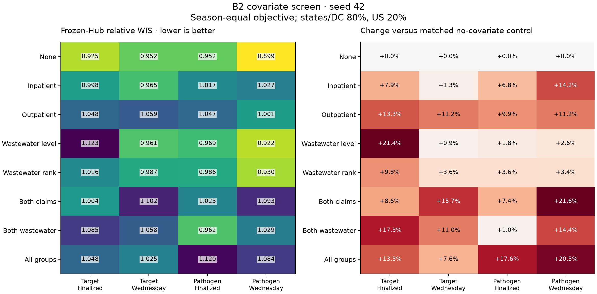
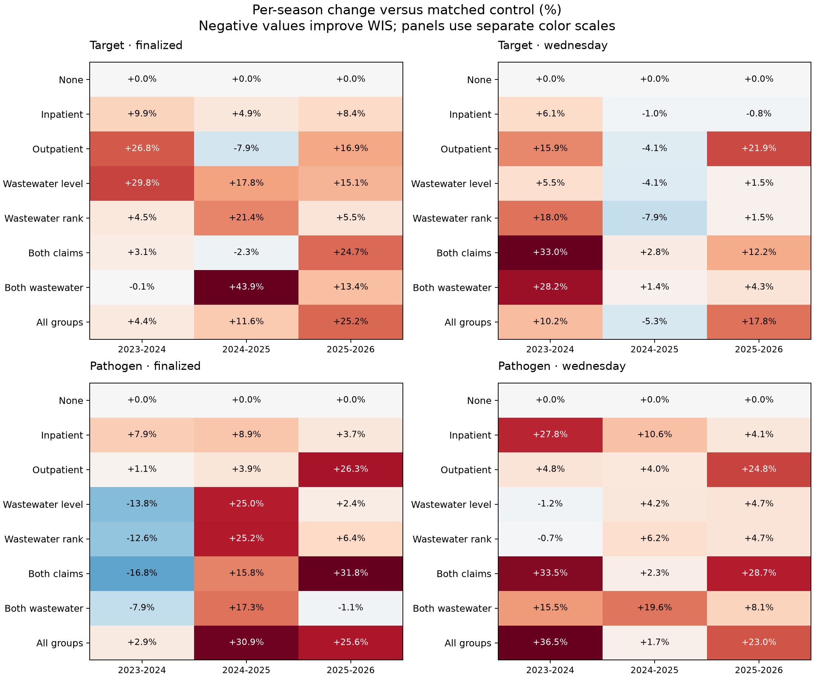
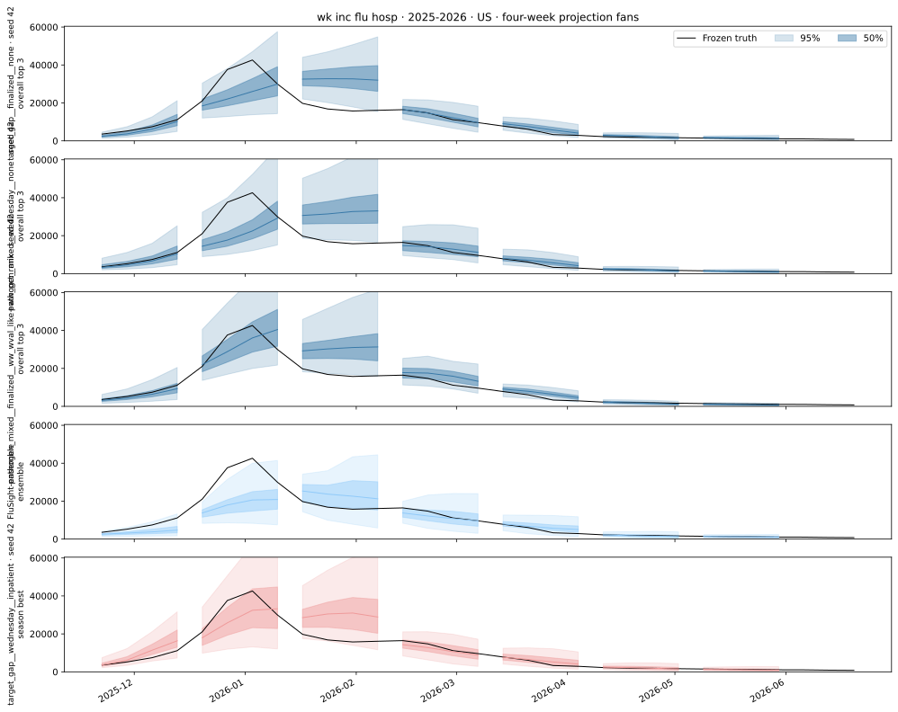
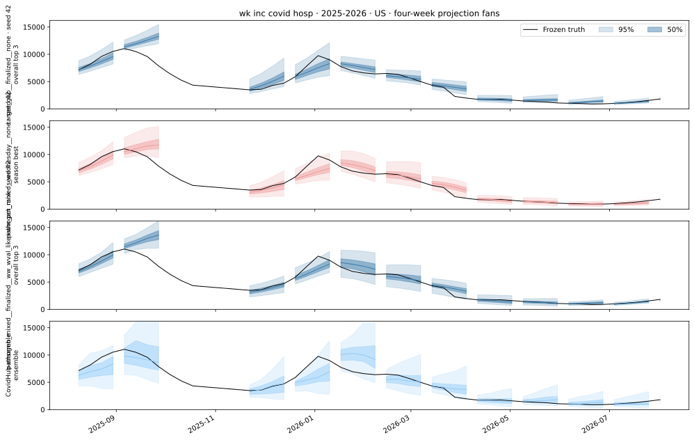
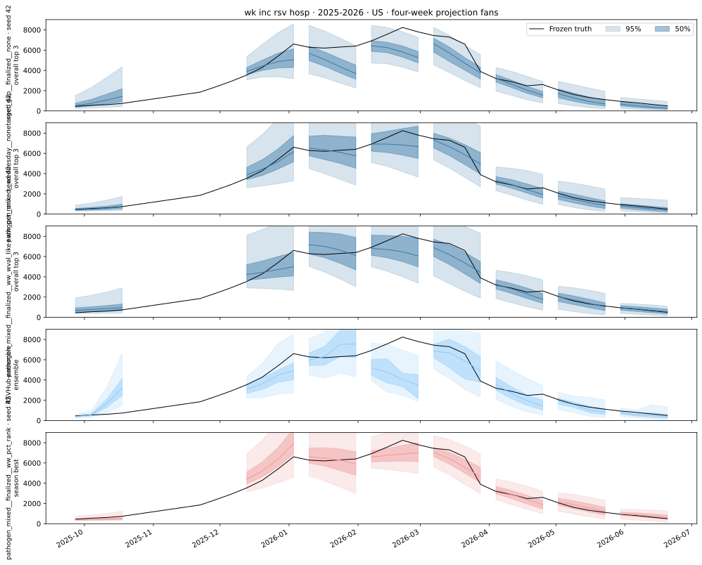

# B2: covariate results and what limits them

**None of the tested covariate sets improves the three-season aggregate over
its matched no-covariate control.** This holds for both model recipes and both
input modes in the seed-42 screen. It does not establish that the sources have
no predictive value: Wednesday wastewater is not learnable-and-testable under
these folds, while claims have training support but did not help these recipes.

All **32 runs** completed: eight covariate sets × two recipes × two input
modes, with three held-out seasons per run. That is 96 season fits and 432
target/pathogen component fits. The [experiment specification](../../design/b2.md)
and [dataset contract](../../data/b2.md) describe the model and source vintages.

## Results

Lower relative WIS is better. The primary score divides model WIS by the
official ensemble's WIS within each target/season/location, averages states/DC
with 80% weight and the native US series with 20%, weights admissions targets
1 and ED targets 0.5 within each season, then averages seasons equally.
Every comparison uses the same frozen scoring support. A score below 1 beats
the reference ensemble under this aggregation.

| Recipe | Inputs | No-covariate WIS | Best added-covariate set | Its WIS | Change versus control |
|---|---|---:|---|---:|---:|
| Target MLP, gap-only | Finalized | **0.9248** | Inpatient | 0.9980 | +7.92% |
| Target MLP, gap-only | Wednesday | **0.9524** | Wastewater level | 0.9608 | +0.89% |
| Pathogen MLP, mixed | Finalized | **0.9523** | Both wastewater indices | 0.9618 | +0.99% |
| Pathogen MLP, mixed | Wednesday | **0.8994** | Wastewater level | 0.9225 | +2.57% |

The overall minimum is the pathogen/Wednesday/no-covariate model. The small
differences in this table have no estimated seed uncertainty: each row uses
only seed 42. These are exploratory selections on the same three seasons,
not independently validated winners.

### Covariate heatmap

The right panel compares each set with the control in the **same recipe and
input mode**. Positive percentages mean worse WIS. “None” retains the six
original admission and ED histories; it does not mean a model without inputs.



[PDF](covariate-screen.pdf) · [All matched-control scores](matched_controls.csv)

### Does the result hold in every season?

No. Covariates improve **16 of 84 individual season comparisons**, but none
improves the three-season aggregate. Those 84 comparisons share data, controls,
and overlapping covariate sets; they are not independent replications.
The largest season-specific improvement is both claims in the finalized
pathogen recipe for 2023–24 (−16.84%), despite a +7.42% aggregate penalty.



[PDF](season-effects.pdf) · [Season-level contrasts](season_matched_controls.csv)

## What is the problem?

There are three different questions: does a source lead the target in event
time, is that observation released before the forecast, and do the training
folds contain enough examples to learn its relationship? B2 does not identify
one common failure mechanism for all four covariate groups.

| Possible explanation | Evidence in this experiment | What we can conclude |
|---|---|---|
| Wednesday wastewater lacks usable training/evaluation overlap | Native publisher vintages start on 2026-02-25; shared fold support is zero | A definite limitation of this evaluation design |
| Covariates arrive too late | Earlier source audits found slower wastewater releases, but fast claims releases | Plausible for wastewater; not a general explanation for claims |
| Too little data to learn added inputs | About 80–85 inner fitting origins and 99–104 refit origins per fold | Limited temporal diversity is plausible; this screen did not measure a learning curve |
| Little information beyond the original six histories | All finalized additions also lose in aggregate; earlier claims regressions found small incremental gains | Consistent with redundancy or poor use of the inputs, not proof of either |
| Model/optimization differences obscure small gains | Covariates change encoder dimensions and initialization; one seed and fixed recipes | The comparisons do not isolate information value from architecture and fitting effects |

### Wastewater: a hard fold-support limitation

The vintage archive begins on **2026-02-25**. Earlier sample dates in that
archive are not evidence that the values were available at earlier forecast
origins. The Wednesday arm uses actual publisher vintages, without an invented
release lag.

Recomputing availability from the frozen B2 dataset gives:

| Held-out season | Wednesday wastewater pairs in refit | Pairs in evaluation | Pairs present on both sides |
|---|---:|---:|---:|
| 2023–24 | 284 | 0 | **0** |
| 2024–25 | 284 | 0 | **0** |
| 2025–26 | 0 | 284 | **0** |

A pair is one covariate channel at one location, with any observed value
somewhere in its history windows. Six wastewater channels × 52 locations
gives 312 possible pairs. These counts precede component-specific target
filtering, so they are upper bounds on a fitted component's support. They
are not counts of independent samples.

The older evaluation folds have no Wednesday wastewater observations. The
latest fold has observations at evaluation time but no wastewater training
support; the model explicitly disables channels it never observed while
fitting. There is therefore **no held-out fold in which an operational
wastewater relationship can both be learned and evaluated**. More seeds or
longer optimization cannot repair that missing overlap. A later evaluation
season with earlier vintage-supported training, or a separately defined
within-season chronological study, would address this specific limitation.

This is not the same as proving that wastewater is biologically late. The
[earlier source analysis](../../data/wastewater.md) reported sample-level
median reporting latency of about 11 days, versus four days for NHSN. Such a
delay can consume a lead in event time. But that analysis used a synthetic
18-day wastewater availability rule for its regressions; those regressions
do not establish historical availability of the selected B2 indices. B2's
hard result is the vintage/fold mismatch above.

### Claims: not simply too late, but limited incremental evidence

Claims do have usable support across the folds: **206 of 208 possible
claims channel/location pairs** appear in both refit and evaluation in every
fold, under either input mode. This does not imply complete histories, but
it rules out the wholesale lack of overlap seen for Wednesday wastewater.
Native claims vintages begin on 2020-05-29; B2 nevertheless trains only on
the two non-held-out seasons in its three-season calendar.

In the [earlier exploratory claims sample](../../data/covariates.md), median
reporting latency was zero days for outpatient claims and two days for
inpatient claims. That sample had approximately 94% and 86% availability at
its Wednesday origin, respectively. These are measurements from that earlier
sample, not new completeness estimates for the full B2 dataset. They do not
support the blanket explanation that claims fail because they arrive late.

Redundancy is a plausible explanation. Inpatient claims measure a closely
related hospitalization signal, and B2 already conditions on admission and
ED histories for all three pathogens. A fast outpatient signal need not add
much once those histories and their dynamics are known. The earlier
in-sample adjusted-R² analysis found inpatient increments around zero and
modest outpatient increments. Those regressions were not held-out WIS tests,
so they motivate this interpretation without proving it.

### Is there enough training data?

There are **154 model origins overall**, not thousands of independent epidemic
trajectories. Each fold has 80–85 inner fitting origins and 99–104 final-refit
origins before component-specific target filtering. Pooling 52 locations and
12 history weeks produces many cells, but adjacent windows overlap and state
epidemics are correlated. The effective temporal diversity is much smaller
than the cell count. An archive reaching back to 2020 does not add training
seasons unless the model's target calendar is expanded as well.

This makes insufficient data a plausible contributor for claims and finalized
wastewater, especially when adding up to ten channels to a flexible encoder.
It is not demonstrated: we did not compare training-set sizes, simplify only
the covariate pathway, or retune regularization. The fixed B1 recipes may
also be poorly suited to the added inputs. Finalized wastewater has shared
training/evaluation support in all three folds (262, 296, and 284 pairs),
yet still does not improve aggregate WIS. **Release timing alone therefore
cannot explain all of the negative results.**

### Why do inactive wastewater inputs change the scores?

Adding a channel changes the context encoder's input dimension and its random
initialization. Equal seed numbers do not make the shared weights identical
across architectures. Thus a Wednesday wastewater-only model can differ from
its control even when no wastewater signal can be learned and used on the
same held-out fold. Its score difference is not evidence that the unseen
signal helped or harmed forecasting. L40 and H100 allocations were also mixed;
small numerical differences may reflect hardware.

The next informative comparison would hold the input dimensions and shared
initialization fixed while masking the added channel in the control, then
check repeat seeds for a small shortlist. This would isolate the contribution
of the supplied values more closely. It would not fix missing wastewater
vintage support. No new fits were launched for this documentation update.

[Fold-support audit](support_by_fold.csv) · [Audit definitions and dataset hash](support_manifest.json)

## Forecast-fan plots

Each fan joins one origin's four future weeks. Black is frozen truth; the
bands show 50% and 95% intervals. Every fourth origin is drawn to reduce
overlap; all origins were scored. US rows use the native national series;
NC is location 37. ED values are proportions.

These existing EpiBench fans show its overall top three configurations, the
official ensemble, and the case-specific best configuration, with duplicates
removed. Selection uses the **secondary EpiBench objective**, not the primary
heatmap objective. The case-specific best is selected using that same case's
outcomes. These are illustrations of saved forecasts, not paired ablations
or independent evidence that a particular covariate supplies an early signal.

### Influenza hospitalizations, 2025–26, US



### COVID-19 hospitalizations, 2025–26, US



### RSV hospitalizations, 2025–26, US



### All fan plots

| Target | Season | US | North Carolina |
|---|---|---|---|
| Flu admissions | 2023–24 | [Fan plot](benchmark/plots/flusight_flu_hosp_2023-2024/fans-US.svg) | [Fan plot](benchmark/plots/flusight_flu_hosp_2023-2024/fans-37.svg) |
| Flu admissions | 2024–25 | [Fan plot](benchmark/plots/flusight_flu_hosp_2024-2025/fans-US.svg) | [Fan plot](benchmark/plots/flusight_flu_hosp_2024-2025/fans-37.svg) |
| Flu admissions | 2025–26 | [Fan plot](benchmark/plots/flusight_flu_hosp_2025-2026/fans-US.svg) | [Fan plot](benchmark/plots/flusight_flu_hosp_2025-2026/fans-37.svg) |
| COVID admissions | 2024–25 | [Fan plot](benchmark/plots/covid_covid_hosp_2024-2025/fans-US.svg) | [Fan plot](benchmark/plots/covid_covid_hosp_2024-2025/fans-37.svg) |
| COVID admissions | 2025–26 | [Fan plot](benchmark/plots/covid_covid_hosp_2025-2026/fans-US.svg) | [Fan plot](benchmark/plots/covid_covid_hosp_2025-2026/fans-37.svg) |
| RSV admissions | 2025–26 | [Fan plot](benchmark/plots/rsv_rsv_hosp_2025-2026/fans-US.svg) | [Fan plot](benchmark/plots/rsv_rsv_hosp_2025-2026/fans-37.svg) |
| Flu ED | 2025–26 | [Fan plot](benchmark/plots/flusight_flu_prop_ed_visits_2025-2026/fans-US.svg) | [Fan plot](benchmark/plots/flusight_flu_prop_ed_visits_2025-2026/fans-37.svg) |
| COVID ED | 2025–26 | [Fan plot](benchmark/plots/covid_covid_prop_ed_visits_2025-2026/fans-US.svg) | [Fan plot](benchmark/plots/covid_covid_prop_ed_visits_2025-2026/fans-37.svg) |
| RSV ED | 2025–26 | [Fan plot](benchmark/plots/rsv_rsv_prop_ed_visits_2025-2026/fans-US.svg) | [Fan plot](benchmark/plots/rsv_rsv_prop_ed_visits_2025-2026/fans-37.svg) |

The [full secondary diagnostic report](benchmark/REPORT.md) includes all 72
SVG figures. Dense 32-model EpiBench charts emitted tight-layout warnings;
visual inspection is left to the reader. The compact heatmaps above are
provided separately.

## Scope and reproducibility

Both input modes score final outcomes at the pinned 2026-09-16 cutoff. Wednesday inputs
retain B1's retrospective policy: older original-six histories are final,
and the most recent two weeks can use flagged final fallback. Finalized
wastewater index baselines can incorporate observations later than a held-out
season; model centering/scaling is fitted only within training. This is not a
fully prospective evaluation. Missing covariates stay masked and never remove
evaluation tasks. Cross-source pairs and three-group subsets were not tested.

Training arrays 1829823 and 1829824 completed on both patron nodes in about
55 minutes. Postprocessing job 1852976 completed all nine frozen target/season
cases in 31m06s, using four CPUs and 30 GiB on `g1803jles02`. No fitting was
repeated during postprocessing. The primary ranking is
`ranking-570af4103817`; the secondary comparison is `comparison-0108ba6fb836`.
Full forecast exports and per-task scores remain in the Longleaf experiment
folder, `/proj/jlessler/projects/tapestry-all/tapestry/data/experiments/B2-screen/`.

- [Primary ranking](ranking/configuration_ranking.csv), [season scores](ranking/season_scores.csv), and [provenance](ranking/manifest.json).
- [Secondary comparison provenance](benchmark/manifest.json) and [completed job record](benchmark/job.json).
- [Plan, launch, status, rank and postprocessing commands](../../design/b2.md#prepare-run-and-postprocess).

Regenerate the support table without refitting or scoring:

```bash
.venv/bin/python scripts/audit_b2_support.py
```

The plotting script regenerates figures and numeric artifacts; this page's
interpretation is maintained separately.
