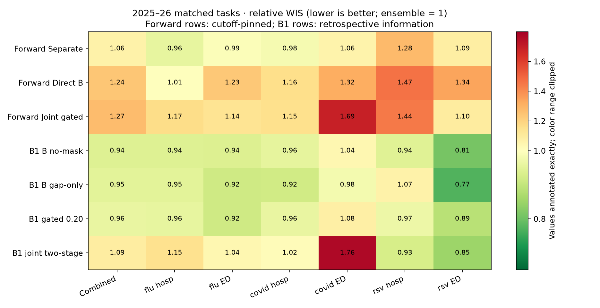
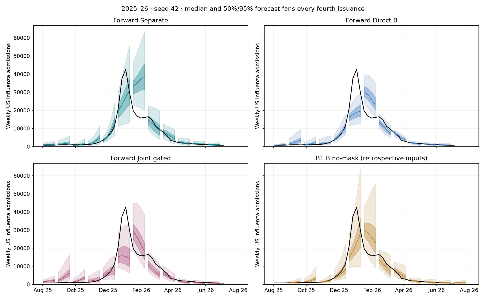
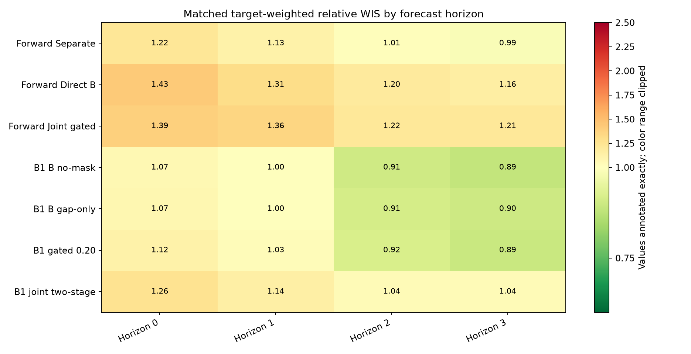
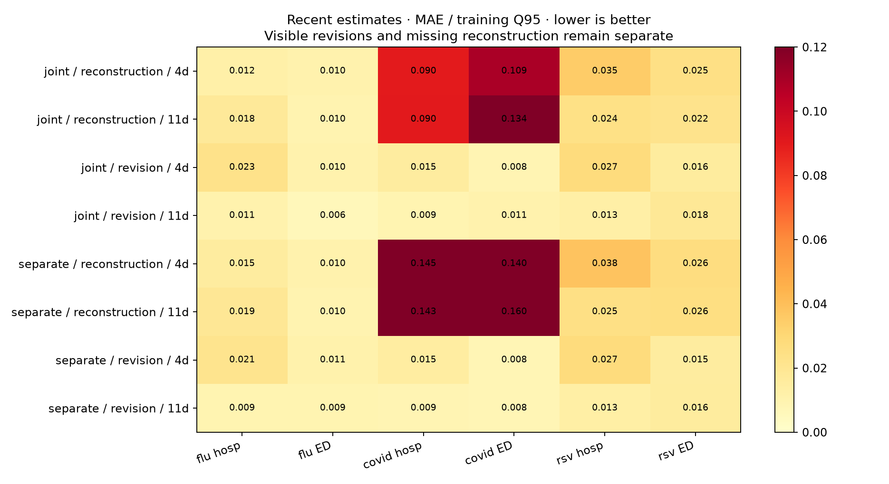

# Forward benchmark: ranking, fans and comparison with B1

**The separate nowcast-to-forecast pipeline is the strongest of the three forward candidates.** Its mean relative WIS is **1.064**, versus **1.240** for Direct B and **1.272** for Joint gated: improvements of **14.2%** and **16.4%**, respectively. It wins both paired comparisons for each of seeds 42, 43 and 44, and has the lowest mean in all six targets. These are fitting replicates of **one already-explored season**, not three independent season tests.

All nine forward runs are complete. No additional training was performed for this analysis. Saved B1 predictions were rescored with the shared scorer on **exactly the same 2025–26 tasks, pinned September 16, 2026 truth and Hub ensemble**. All 21 candidate/seed evaluations cover the same **37,844 forecast tasks**, and rescoring reproduces the original forward ranking. Relative WIS below 1 beats the ensemble; above 1 loses. The mean is a mean of model scores, not the score of an ensemble of seeds.

## Ranking on identical tasks

| Candidate | Relative WIS | Seed SD | States/DC | US | 95% coverage (%) |
| --- | --- | --- | --- | --- | --- |
| B1 B no-mask | 0.941 | 0.014 | 0.968 | 0.833 | 81.088 |
| B1 B gap-only | 0.949 | 0.027 | 0.976 | 0.839 | 83.194 |
| B1 gated 0.20 | 0.961 | 0.056 | 0.981 | 0.883 | 82.833 |
| Forward Separate | 1.064 | 0.036 | 1.075 | 1.019 | 75.413 |
| B1 joint two-stage | 1.093 | 0.134 | 1.090 | 1.104 | 84.035 |
| Forward Direct B | 1.240 | 0.098 | 1.226 | 1.299 | 67.736 |
| Forward Joint gated | 1.272 | 0.015 | 1.247 | 1.372 | 65.440 |

**The forward rows form the controlled formulation comparison. B1 rows are descriptive historical comparators with different information and fitting protocols.** This is a comparison of four named B1 recipes, not an exhaustive reranking of every B1 configuration. Seeds 42–44 are used throughout, even where five B1 fits exist.



The separate pipeline beats the Hub ensemble narrowly for flu admissions (0.957), COVID admissions (0.983) and flu ED visits (0.993), but not RSV admissions (1.280), COVID ED visits (1.057) or RSV ED visits (1.087). Its combined score remains **6.4% worse than the ensemble**. The improvement over Direct B appears in both states/DC (1.2255 → 1.0749) and US (1.2989 → 1.0193). It improves mean location scores in 36/52 flu-admission geographies, 46/52 COVID-admission, 51/52 RSV-admission, 45/52 flu-ED, 48/52 COVID-ED and 49/51 RSV-ED geographies. These counts describe breadth, not independent statistical replication.

Joint gated is 2.6% worse than Direct B in the mean and loses in two of three paired seeds; the ordering reverses for seed 44. Its small seed SD does not establish generalization. There is no forecast advantage for this joint recipe in the current benchmark.

[All seed scores](comparison-seeds.csv) · [Paired forward differences](paired-forward-seeds.csv) · [Target/season/geography scores](comparison-targets.csv) · [Matched support dates/counts](comparison-support.csv)

## Fan plots



Fans show **seed 42**, selected in advance for visualization, with medians and central **50%/95% intervals** every fourth test issuance. Black curves are pinned reference observations. They are not a seed ensemble or a plot of fitting variability. All candidates use the same displayed origins and truth; no favorable seed or date was selected. US, North Carolina and California are fixed illustrative geographies, not representative performance samples. Full fan sheets include all seven compared models:

- [Influenza admissions: US, NC, CA](fans-flu_hosp.png)
- [COVID admissions: US, NC, CA](fans-covid_hosp.png)
- [RSV admissions: US, NC, CA](fans-rsv_hosp.png)
- [Influenza ED visits: US, NC, CA](fans-flu_prop_ed_visits.png)
- [COVID ED visits: US, NC, CA](fans-covid_prop_ed_visits.png)
- [RSV ED visits: US, NC, CA](fans-rsv_prop_ed_visits.png)

Admissions remain counts; ED panels display percentages (the scorer uses proportions). Each fan is a four-week forecast, not a continuous forecast trajectory across origins. Some B1 origins at the season boundary are unavailable; no fan is fabricated there. Primary ranking uses only the common frozen support.

## Calibration and failure modes

The separate pipeline's nominal 95% forecast intervals cover only **75.4%**, versus **67.7%** for Direct B and **65.4%** for Joint gated. Its nominal 50% intervals cover **33.8%**. B1 intervals also undercover: approximately **81–84%** at the 95% level. These figures use the same matched tasks and scientific weighting as the ranking; the main results page additionally reports full-period coverage on all eligible labels.

The separate pipeline remains weakest relative to the ensemble at the shortest forecast horizon: **1.223 at horizon 0**, improving to **0.990 at horizon 3**. Horizon-specific denominators differ, so these are relative skill comparisons, not decreasing native error with distance. Its RSV-admission WIS is still 1.280, and about **80%** of that scientifically weighted WIS comes from underprediction penalties. Thus interval width is not the only issue; low predictions also need attention. This is a score decomposition, not a causal explanation of the model's behavior.



[Geography heatmap: separate versus direct](heatmap-geography.png) · [Horizon scores](comparison-horizons.csv) · [WIS decomposition](comparison-wis-components.csv)

## Recent correction is different from missing-report reconstruction

The table below uses training-only Q95 scaling, target weights 1 for admissions and 0.5 for ED, and states/DC 80%, US 20%. It retains all eligible groups, including near-zero baseline groups. It is a stable diagnostic, not a replacement for the predeclared location-relative recent ratios. Recent evaluation follows the test issuance partition; its observation weeks begin July 19, 2025, before the first forecast target week.

| Candidate | Recent task | Age (days) | MAE/Q95 | WIS/Q95 | Report MAE/Q95 | 95% coverage (%) |
| --- | --- | --- | --- | --- | --- | --- |
| joint | reconstruction | 4 | 0.047 | 0.033 | nan | 65.181 |
| joint | reconstruction | 11 | 0.048 | 0.034 | nan | 64.124 |
| joint | revision | 4 | 0.018 | 0.013 | 0.023 | 80.306 |
| joint | revision | 11 | 0.011 | 0.008 | 0.009 | 81.529 |
| separate | reconstruction | 4 | 0.064 | 0.048 | nan | 47.697 |
| separate | reconstruction | 11 | 0.063 | 0.048 | nan | 45.384 |
| separate | revision | 4 | 0.018 | 0.013 | 0.023 | 78.358 |
| separate | revision | 11 | 0.011 | 0.008 | 0.009 | 80.504 |

Four-day visible-report median errors improve relative to each observation week's own preliminary report. At eleven days the median corrections have **higher** scaled MAE than simply retaining that report, even though probabilistic WIS is modestly lower. The model's probabilistic objective and point accuracy should not be conflated.

The independent nowcaster reconstructs missing reports **worse** than the joint model: scaled MAE is about **0.064 versus 0.047** at four days and **0.063 versus 0.048** at eleven days. Its missing-report 95% coverage is only **48% / 45%**, versus **65% / 64%** for joint. Therefore better downstream forecasts do not demonstrate better nowcasting across all tasks. The pipeline contrast also changes forecast training inputs and adds independent fitting; it does not isolate the causal effect of nowcasting alone.

Missing reports have no report baseline or revision ratio (`nan` in the table means undefined, not zero). The predeclared near-zero rule flags two unique groups—Missouri flu ED at eleven days and Tennessee RSV admissions at eleven days—appearing in 12 candidate/seed instances. Relative ratios remain undefined for these groups. No threshold was selected after seeing these results.



[Recent scaled diagnostics](recent-scientific-summary.csv) · [Predeclared ratio flags and location diagnostics](recent-by-location.csv)

## What the B1 comparison means

The **2025–26 held-out B1 forecasts exist**. Four named target-MLP recipes were chosen for interpretation rather than by searching for the best 2025–26 result:

| B1 comparator | Fitting and evaluation differences |
| --- | --- |
| B no-mask | Closest backbone/input-channel recipe; cap 100 with validation-selected epochs, no masking, 256 predictive draws. |
| B gap-only | Previously strong control; cap 300 with selected epochs, 50% gap-only masking, 1,024 draws. |
| Gated 0.20 | Analogous gated formulation; recent weight 0.20, cap 300, mixed 50% masking, no revision augmentation, 1,024 draws. |
| Joint two-stage | Earlier jointly fitted recent-to-future formulation; recent weight 0.20, cap 300, mixed 50% masking, no revision augmentation, 1,024 draws. This is **not** the independently fitted forward pipeline. |

B1 used retrospective finalized older histories, supplied reference finals for some missing recent inputs, and later-finalized fitting references. It did not enforce the July 26, 2025 information cutoff or restrict NHSN revision fitting to the new reporting regime. Its held-out-season masking prevents ordinary cross-validation label overlap, but does not make the underlying revisions historically available. On these exact tasks, supplied-final flags account for **0–4.9%** of recent target input cells depending on target and age; they are not the majority of recent reports. Older finalized context, reference revisions, training-label maturity and selected epochs also differ. We cannot attribute the score gap specifically to recent final filling.

Rescoring aligns tasks, truth, quantiles and scientific weights; it cannot remove information already used during B1 fitting or prediction. Thus **0.941 for B1 B versus 1.064 for Forward Separate is not evidence that B1 would win at a Wednesday deployment cutoff**. Conversely, Forward Separate's small numerical advantage over old jointly trained two-stage B1 (1.064 versus 1.093) is not a controlled proof that independence alone is responsible.

[B1 input final-flag fractions](b1-final-input-fractions.csv) · [Configurations, refit epochs, paths and provenance](analysis-provenance.json)

## Conclusions for next-season development

1. **Keep the separate pipeline as the leading forward candidate**, with Direct B as the control. Its improvement is consistent across the three fits and six target averages in this development season. The evidence does not favor the present jointly gated forecast recipe.
2. **Do not treat the winning pipeline as calibrated or deployment-validated.** It remains above ensemble WIS overall, has substantial forecast undercoverage, and has weak missing-report reconstruction. Future calibration or input-mismatch adjustments must be fitted inside a training partition; these test results should not tune an apparent final-test winner.
3. **Treat correction and reconstruction separately.** The eleven-day median can damage an already useful visible report; missing values require a different evaluation from revision correction. Sparse pre-cutoff four-day NSSP revision support remains a serious limitation.
4. **Use older B1 as a descriptive reference, not a fair operational rival.** An operational comparison would require refitting a B1 recipe under the same historical information cutoff. These results do not establish that reporting-regime mixing caused prior failures or that nowcasting is generally unhelpful.

The exact-training/estimated-deployment mismatch remains present in the independent pipeline; sampling propagates uncertainty but does not resolve that mismatch. All forward candidates share a cutoff-final older-history fitting versus Wednesday-history deployment mismatch. Archive timestamps and completeness remain availability assumptions, and the 28-day maturity definition is a provisional finality proxy. This is forward development on an explored season, not an untouched final test. No seed- or geography-based significance claim is made.

## Reproduction

```bash
.venv/bin/python -m tapestry.models.manager rank -e Forward-2025
.venv/bin/python scripts/analyze_forward_2025.py
```

The script rescores saved predictions with the shared WIS scorer; it does not refit models. The [original manager plan, launch, status and rank commands](../../workflows/forward-2025.md#reproduce) reproduce the benchmark. Optional `--reuse-fans` retains previously generated full fan sheets while refreshing score summaries and the compact fan overview. Images were generated without visual inspection, as requested by the project instructions.

Analysis recorded September 19, 2026.

[Coverage across seasons and proposed calibration experiments](coverage-notes.md)
