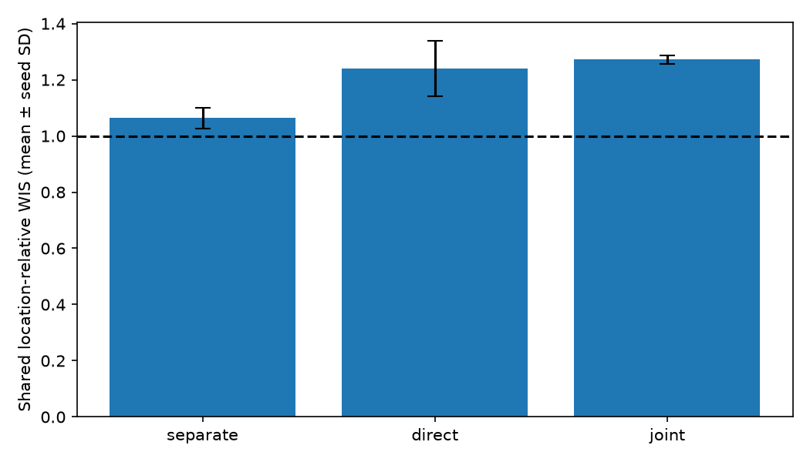
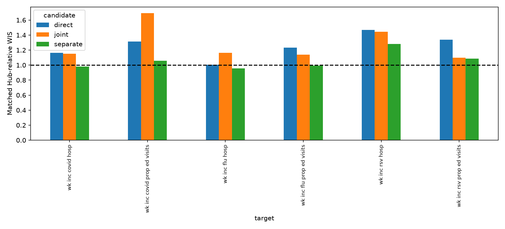
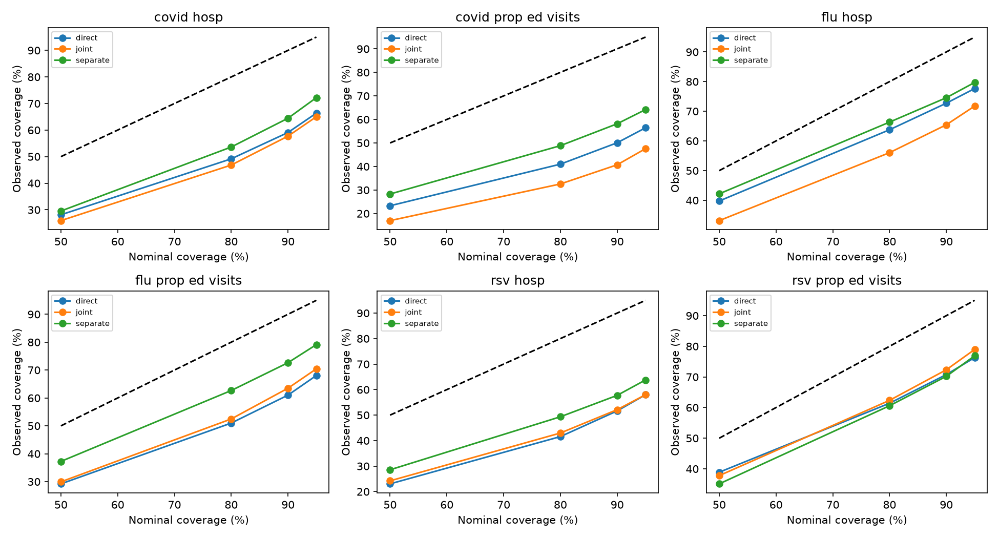
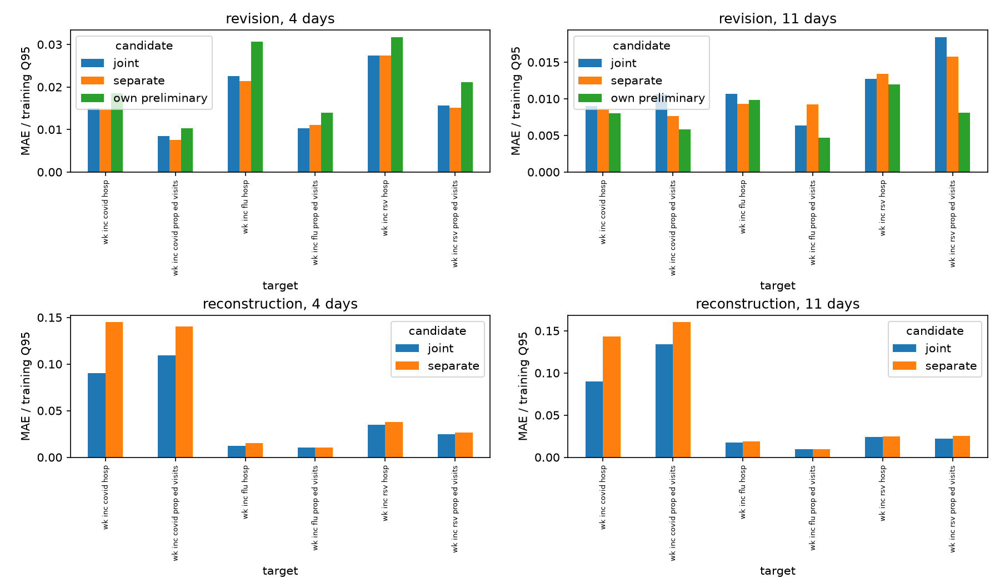

# Frozen forward development benchmark: 2025–26

Training cutoff: July 26, 2025 end of day UTC; mature labels through June 28. Test Wednesdays July 30, 2025–July 29, 2026; forecast targets August 2, 2025–August 1, 2026. Parameters frozen. This season was previously explored; this is **forward development**, not an untouched final test.

[Experiment specification](../../workflows/forward-2025.md) · [Data assumptions](../../data/forward-2025.md)

## Matched Hub-supported forecast tasks

| candidate | seeds | combined_mean | combined_sd | states_dc_combined_mean | US_combined_mean |
| --- | --- | --- | --- | --- | --- |
| separate | 3 | 1.0638 | 0.0365 | 1.0749 | 1.0193 |
| direct | 3 | 1.2402 | 0.0977 | 1.2255 | 1.2989 |
| joint | 3 | 1.2722 | 0.0145 | 1.2472 | 1.3720 |

Mean and sample SD describe fitting variability only. One season provides no independent season replication; seeds and locations are not independent seasons. Native WIS cannot be compared across targets' units. Hub support varies by target and is a subset of the full test period. [Matched target/season/geography scores](matched-hub-scores.csv).

## Full forward-period diagnostics

| candidate | target | wis | scaled_wis | covered_50 | covered_95 |
| --- | --- | --- | --- | --- | --- |
| direct | wk inc covid hosp | 220.4361 | 0.0403 | 0.2811 | 0.6638 |
| direct | wk inc covid prop ed visits | 0.0014 | 0.0498 | 0.2330 | 0.5644 |
| direct | wk inc flu hosp | 395.3301 | 0.0619 | 0.3976 | 0.7766 |
| direct | wk inc flu prop ed visits | 0.0051 | 0.0862 | 0.2921 | 0.6806 |
| direct | wk inc rsv hosp | 143.0794 | 0.0731 | 0.2305 | 0.5798 |
| direct | wk inc rsv prop ed visits | 0.0006 | 0.0535 | 0.3889 | 0.7631 |
| joint | wk inc covid hosp | 218.1275 | 0.0412 | 0.2592 | 0.6503 |
| joint | wk inc covid prop ed visits | 0.0017 | 0.0590 | 0.1699 | 0.4757 |
| joint | wk inc flu hosp | 476.6145 | 0.0715 | 0.3315 | 0.7176 |
| joint | wk inc flu prop ed visits | 0.0047 | 0.0795 | 0.2994 | 0.7045 |
| joint | wk inc rsv hosp | 143.8573 | 0.0716 | 0.2423 | 0.5800 |
| joint | wk inc rsv prop ed visits | 0.0005 | 0.0458 | 0.3779 | 0.7897 |
| separate | wk inc covid hosp | 232.8096 | 0.0425 | 0.2953 | 0.7221 |
| separate | wk inc covid prop ed visits | 0.0016 | 0.0551 | 0.2829 | 0.6419 |
| separate | wk inc flu hosp | 341.3595 | 0.0591 | 0.4218 | 0.7973 |
| separate | wk inc flu prop ed visits | 0.0041 | 0.0694 | 0.3726 | 0.7913 |
| separate | wk inc rsv hosp | 121.7592 | 0.0647 | 0.2856 | 0.6379 |
| separate | wk inc rsv prop ed visits | 0.0005 | 0.0448 | 0.3510 | 0.7691 |

All candidates share identical available forecast labels. Tables use equal locations within states/DC (80%) and US (20%). Target-native WIS, stable training-Q95-scaled WIS and coverage are reported separately from the Hub-relative ranking.

[Target and seed diagnostics](forecast-by-target-seed.csv) · [Location diagnostics](forecast-by-location.csv) · [Horizon diagnostics](forecast-by-horizon.csv)

## Recent predictions

12 candidate/seed/target/age/location ratios were undefined under the predeclared threshold (mean preliminary absolute error / training Q95 ≤ 0.0001). These are not assigned zero or epsilon denominators. No revision ratio exists for missing reports.

[Recent diagnostics](recent-summary.csv) · [Location diagnostics and denominator flags](recent-by-location.csv)

Archive dates are accepted availability proxies, with assumed interior completeness; strict provider-publication availability is not independently certified. Finalized values are 28-day-mature cutoff proxies. Four-day NSSP visible correction training begins only June 18, 2025. Older-history fitting uses cutoff-final proxies; deployment uses Wednesday reports. The separate pipeline additionally learns forecasting on exact cutoff-final recent inputs and deploys on estimates; sampling propagates uncertainty but does not eliminate that mismatch. No calibration, artificial masking or test-driven epoch selection was used.

[**Analysis, ranking against B1, fan plots and heatmaps**](analysis.md)
