# B0.1 — Architecture crosses

36 of 172 configurations beat the hub ensemble. The best score is 0.883.
The top five configurations fit separate models by target or pathogen.
The stochastic trend decoder raises the score in all four one-factor comparisons.
Interval coverage is below nominal levels.

## Experiment and score

172 configurations × 3 seeds = 516 season-CV runs and 1,548 season fits.
The suite includes six reference architectures, one-factor changes, two
interaction panels, and independent-model and convolution controls.
See the [specification](../../design/b0.1.md).

Lower scores are better; 1 means parity with the hub ensemble. The
[objective](../../design/architecture.md#82-design-choices-for-b0-loss-and-weights)
uses location-relative WIS, equal season weights, and 80% states/DC plus 20% US.
The B0.0 results page uses a different score; the comparison below uses rescored
B0.0 forecasts.

## Ranking

| Rank | Configuration | Combined | Seed SD | States/DC | US |
|---:|---|---:|---:|---:|---:|
| 1 | `independent__encoder_mlp__fit_partition_target__epochs_100` | 0.883 | 0.025 | 0.906 | 0.793 |
| 2 | `independent__encoder_mlp__fit_partition_pathogen__epochs_300` | 0.895 | 0.032 | 0.917 | 0.806 |
| 3 | `independent__encoder_mlp__fit_partition_target__epochs_300` | 0.895 | 0.047 | 0.917 | 0.807 |
| 4 | `independent__encoder_mlp__fit_partition_pathogen__epochs_100` | 0.897 | 0.019 | 0.922 | 0.796 |
| 5 | `independent__encoder_multiscale_conv__fit_partition_target__epochs_100` | 0.909 | 0.039 | 0.925 | 0.844 |
| 6 | `local_mlp__exchange_joint_location_target__head_sharing_pathogen` | 0.911 | 0.035 | 0.921 | 0.870 |

Scores are means over seeds 42, 43 and 44. Seed SD describes variation across
those runs; it is not a significance threshold for comparing configurations.

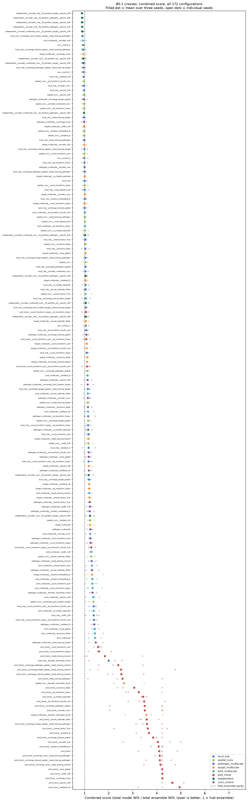

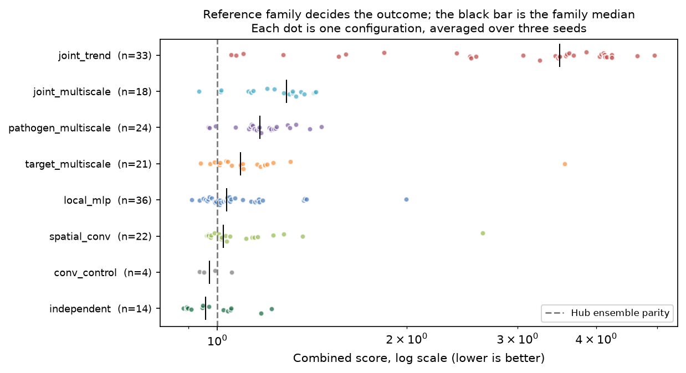

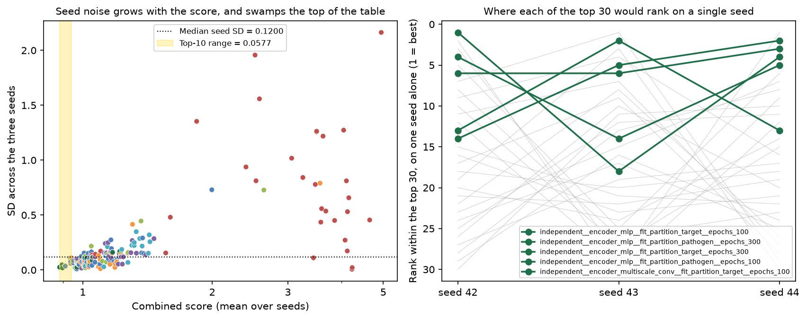

### Reference architectures

| Reference | Combined score | Rank of 172 |
|---|---:|---:|
| `local_mlp` | 1.004 | 38 |
| `spatial_conv` | 1.034 | 56 |
| `target_multiscale` | 1.228 | 114 |
| `pathogen_multiscale` | 1.230 | 115 |
| `joint_multiscale` | 1.433 | 139 |
| `joint_trend` | 4.104 | 164 |

`local_mlp` has the lowest score among the references. These recipes differ in
several settings, so their ranking does not isolate the effect of each setting.

## One-factor changes

Each change is compared with its own reference. Negative deltas mean lower WIS.
The table averages over the tested references, excluding `joint_trend`.
These are descriptive comparisons; they do not establish effects across all
architectures.

| Factor | Mean Δ | Range | Same sign |
|---|---:|---|:--:|
| `decoder_stochastic_trend` | +1.259 | +0.10 … +2.34 | 4/4 |
| `encoder_mlp` | −0.324 | −0.50 … −0.24 | 3/3 |
| `exchange_none` | −0.272 | −0.29 … −0.26 | 2/2 |
| `encoder_conv` | −0.139 | −0.22 … −0.04 | 4/4 |
| `ed_transform_linear` | −0.124 | −0.42 … −0.01 | 5/5 |
| `noise_global` | −0.090 | −0.20 … −0.01 | 3/3 |
| `epochs_100` | −0.069 | −0.11 … −0.04 | 5/5 |
| `head_sharing_pathogen` | −0.023 | −0.02 … −0.02 | 2/2 |
| `exchange_pathogen_spatial` | +0.054 | +0.03 … +0.08 | 2/2 |
| `ed_transform_fourth_root` | −0.127 | −0.42 … +0.06 | 4/5 |
| `exchange_shared_spatial` | −0.094 | −0.16 … +0.01 | 2/3 |
| `head_sharing_shared` | −0.080 | −0.23 … +0.06 | 2/3 |
| `us_heads_separate` | −0.068 | −0.22 … +0.04 | 4/5 |
| `lookback_26` | −0.049 | −0.29 … +0.19 | 4/5 |
| `count_transform_log1p` | −0.049 | −0.22 … +0.09 | 3/5 |
| `lookback_8` | −0.046 | −0.31 … +0.17 | 3/5 |
| `dynamics_False` | −0.041 | −0.13 … +0.03 | 4/5 |
| `shared_factor_True` | −0.030 | −0.13 … +0.02 | 3/5 |
| `count_transform_sqrt` | −0.028 | −0.14 … +0.15 | 3/5 |
| `annual_calendar_False` | −0.024 | −0.30 … +0.24 | 2/5 |
| `location_embedding_8` | −0.021 | −0.12 … +0.08 | 3/5 |
| `encoder_multiscale_conv` | −0.017 | −0.07 … +0.03 | 1/2 |
| `noise_global_local` | −0.009 | −0.02 … +0.00 | 1/2 |
| `exchange_target_spatial` | +0.009 | −0.26 … +0.18 | 2/3 |
| `width_128` | +0.014 | −0.25 … +0.37 | 2/5 |
| `exchange_joint_location_target` | +0.091 | −0.10 … +0.33 | 2/3 |
| `head_sharing_target` | +0.101 | −0.03 … +0.24 | 2/3 |

The trend decoder increases the score by 0.10–2.34 across four references.
MLP encoders, no exchange, convolution encoders and linear ED transforms lower
the score in each comparison where they were tested. Several other changes have
opposite effects across references.

The `joint_trend` reference scores 4.104. Its best one-factor variant scores
1.559. No `joint_trend` variant with a legacy decoder was run, so that family's
results do not isolate the decoder from the rest of the recipe.

## Coverage and forecast horizon

On states/DC tasks, configuration-level 50% coverage ranges from about 14% to
45%; 95% coverage reaches about 86% at best. The hub ensemble achieves 50.4%
and 90.4%, respectively, on the same tasks. Low coverage alone does not show
whether interval width, forecast bias, or both caused the misses.

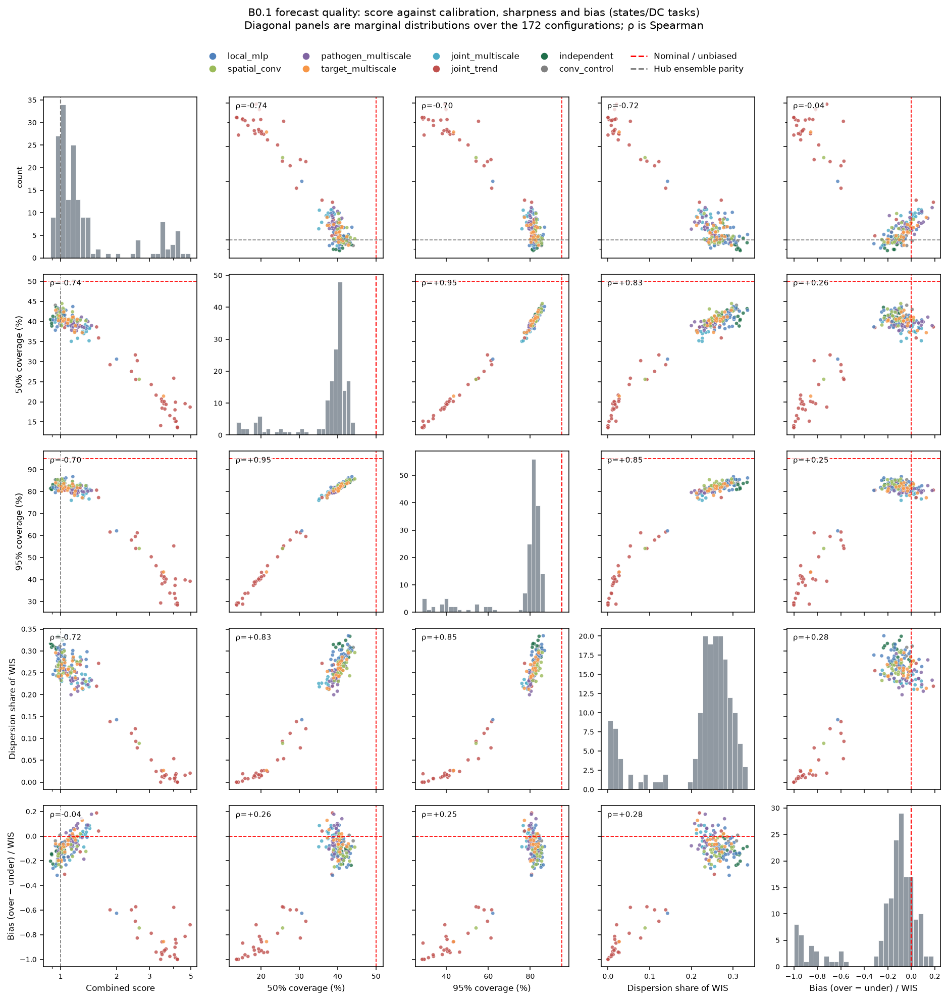

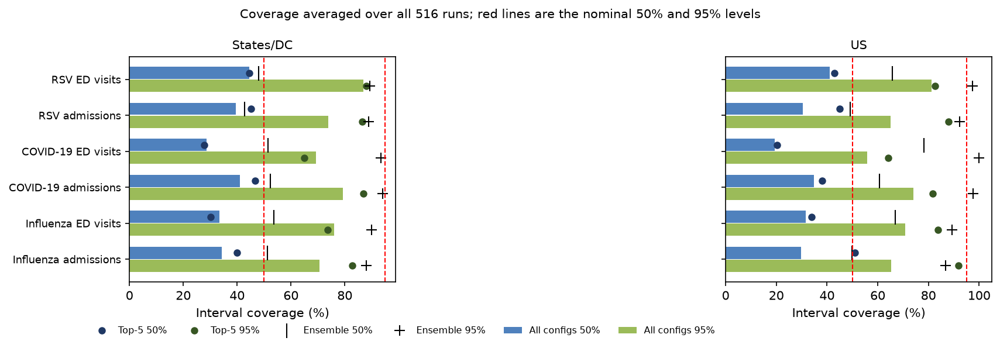

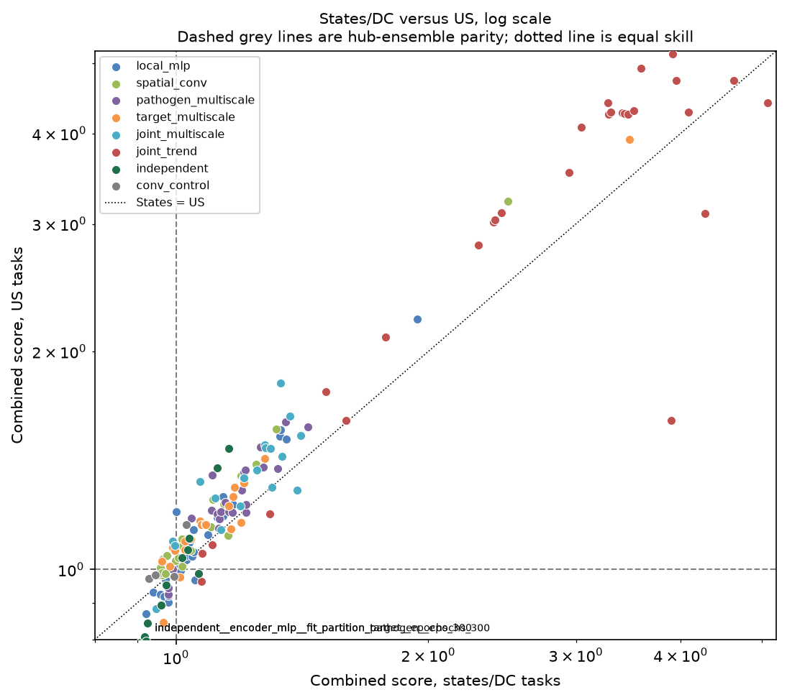

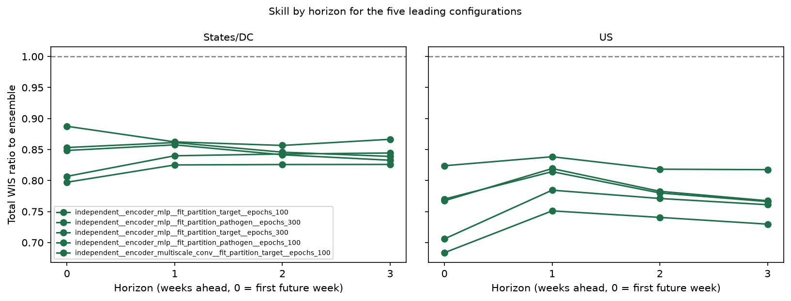

## Training budget

Across six recipes with both epoch caps, raising the cap from 100 to 300 changes
the mean score by +0.009 and worsens it in four cases. This comparison does not
establish an optimal budget or rule out overfitting. B0.1 did not test a cap of 50.

## Comparison with B0.0

The 180 saved B0.0 runs were rescored under the B0.1 objective without refitting.
The [B0.0 page](../b0-crosses/index.md) retains its historical scores.

| | B0.0 (rescored) | B0.1 |
|---|---:|---:|
| Configurations | 60 | 172 |
| Best combined score | 0.948 | 0.883 |
| Median combined score | 1.087 | 1.135 |
| Beating the hub ensemble | 10 (17%) | 36 (21%) |
| Best states/DC · US | 0.962 · 0.892 | 0.906 · 0.793 |

B0.1 has a lower best score and a higher median score. The suites contain
different configurations and training settings, so this comparison does not
attribute the difference to one model change.

## Fan plots

Four-week forecasts at every third origin for the three leading configurations,
each at its median-scoring seed, and the hub ensemble. Locations are the United
States and North Carolina.

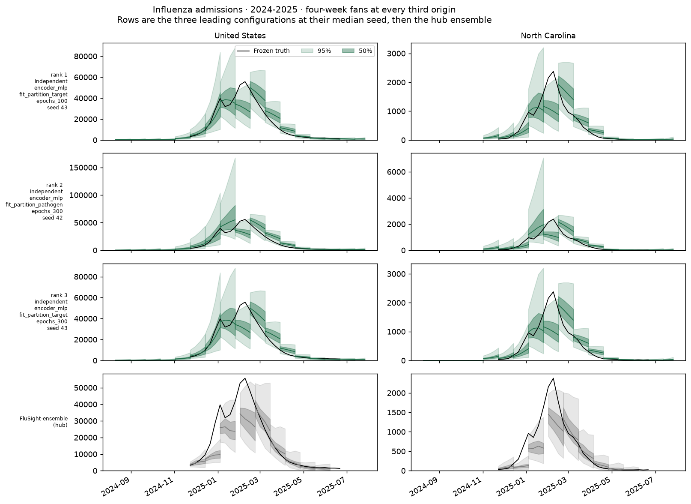

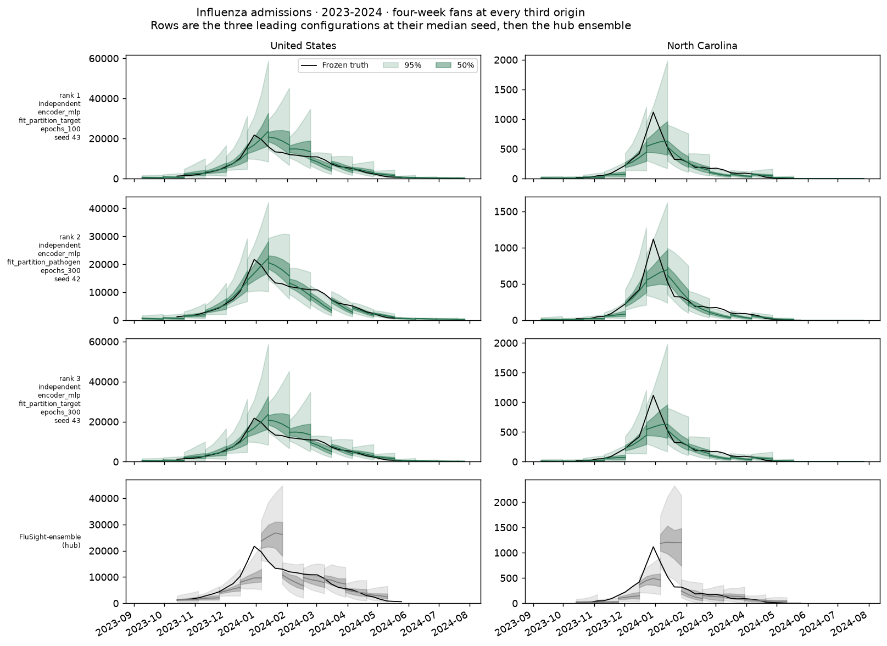

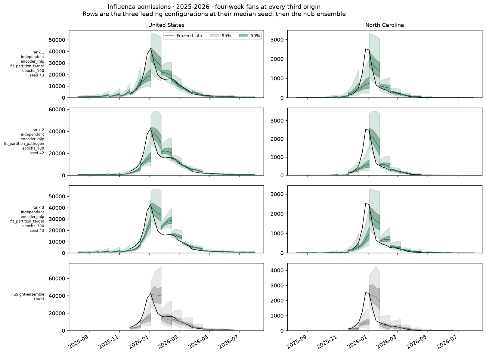

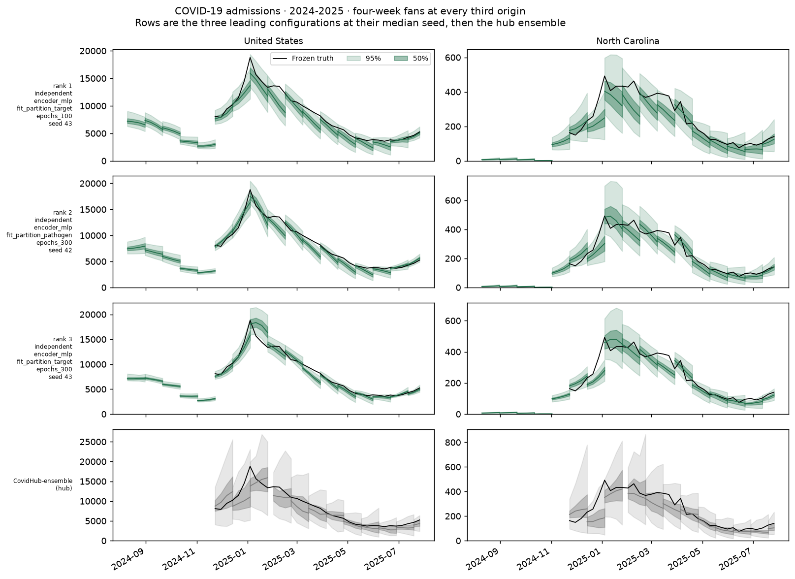

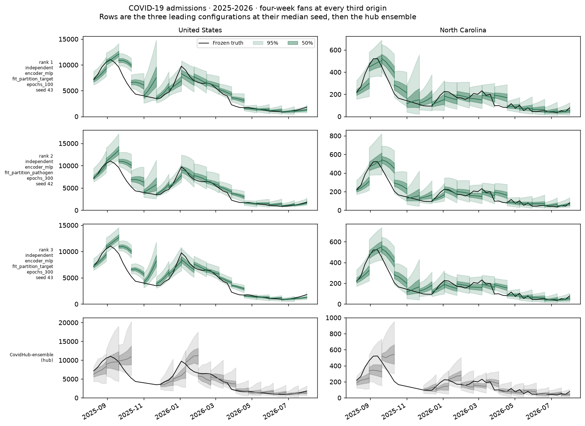

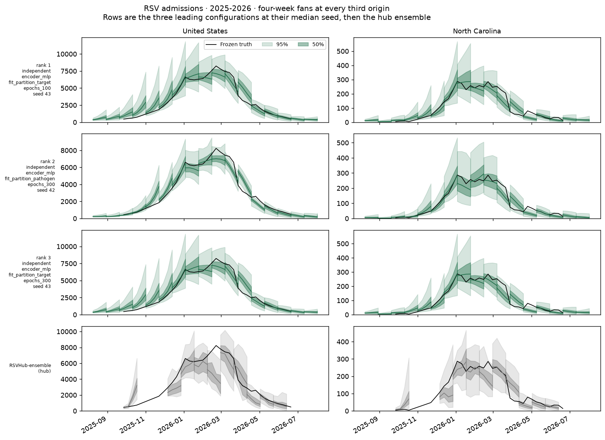

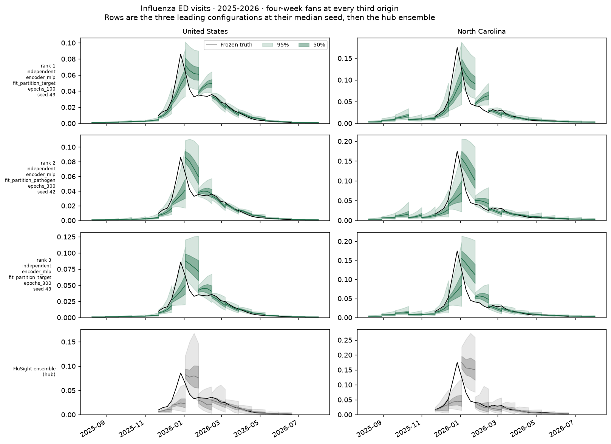

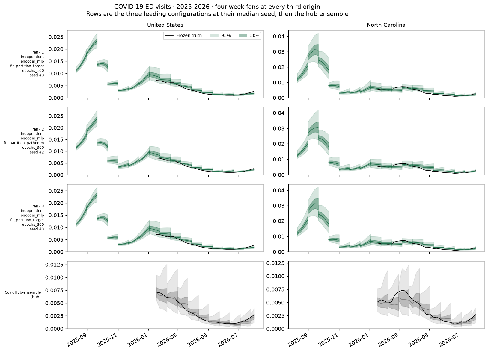

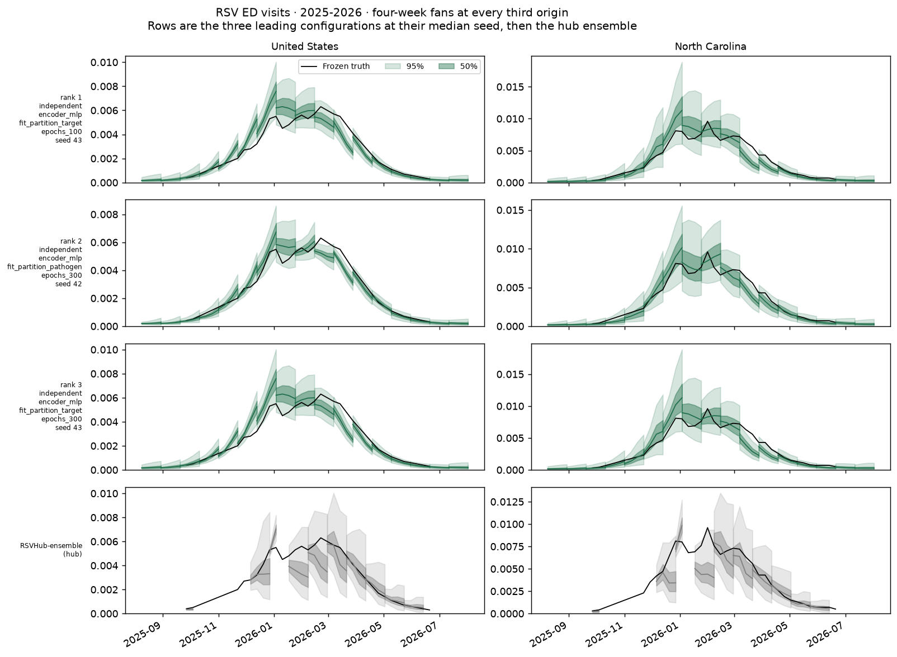

## Assumptions and limitations

- These are retrospective season-CV results, not prospective performance estimates.
- The same three seasons were used to rank and select configurations. A selected
  model needs evaluation on data not used for selection.
- Target availability differs by season. Three seeds measure only part of the
  uncertainty in performance.
- One-factor effects apply to the tested reference and settings.
- This rewrite retains the reported numerical results; it does not recompute scores.

## Reproducing

The general procedure is in
[Postprocessing an experiment](../../workflows/experiment-postprocessing.md).

The B0.0 rescore under this objective, for the comparison above:

```bash
for d in data/experiments/b0-us-cross-4/*/s*/attempt-001/cv; do
  .venv/bin/python -m tapestry.evaluation.totals score --run "$d" \
      --frozen data/evaluation/b0_hub_comparison_q23
done
```

then rank those runs into
`data/experiments/b0-us-cross-4/ranking-newobjective/`. `manager rank` cannot be
used for B0.0: its scenario strings predate six fields added for B0.1
(`head_sharing`, `annual_calendar`, `location_embedding`, `fit_partition`,
`validation_members`, `weight_decay`), so the runs are identified by rebuilding
each scenario from its own `manifest.json` and filling those fields with the
dataclass defaults, which describe what B0.0 actually did.

```bash
.venv/bin/python -m tapestry.models.manager rank -e B0.1
.venv/bin/python scripts/plot_b01_crosses.py -e B0.1 -r ranking-509b07b0d243
```

Ranking tables are in `data/experiments/B0.1/ranking-509b07b0d243/`
(`configuration_ranking.csv`, `run_scores.csv`, `season_scores.csv`,
`season_composite_scores.csv`, `manifest.json`). The per-configuration
calibration table behind the pairplot is saved alongside this page as
[`quality-metrics.csv`](quality-metrics.csv).

## Log

- 2026-09-16: Shortened the report. Removed causal explanations not established
  by the comparisons, seed-SD decision thresholds, and repeated recommendations.
