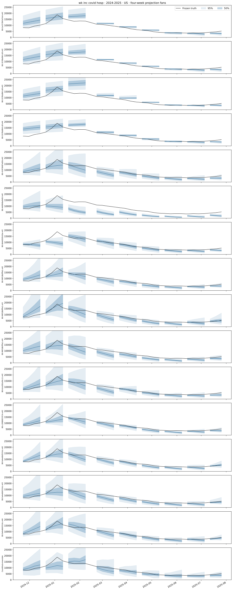
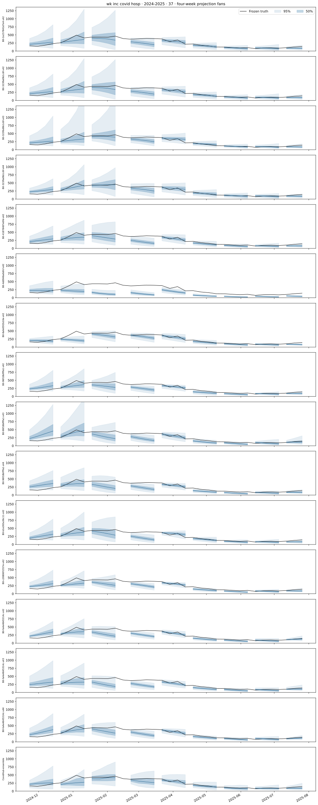
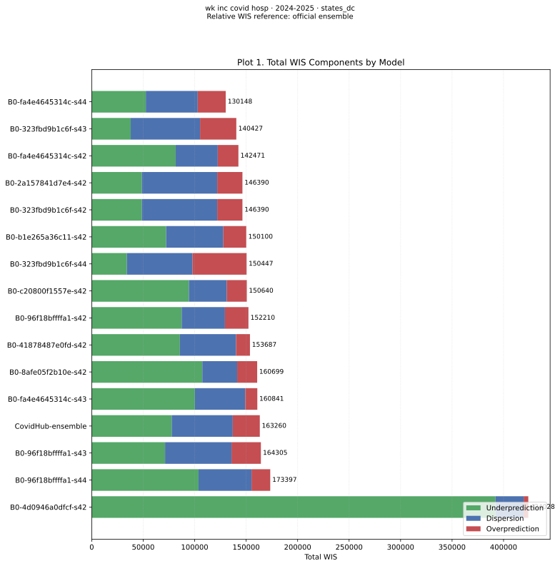
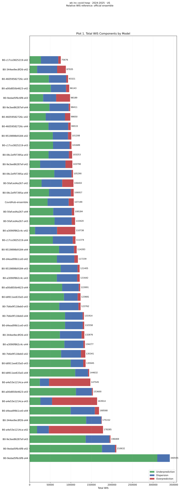
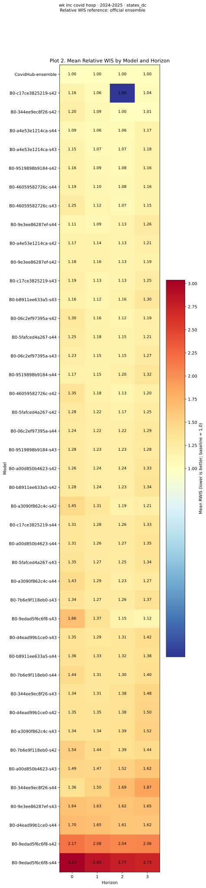
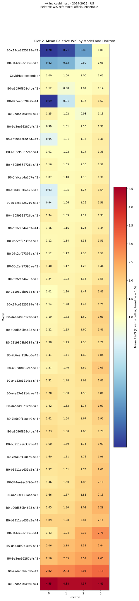
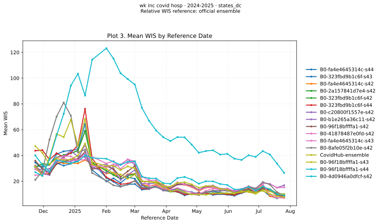
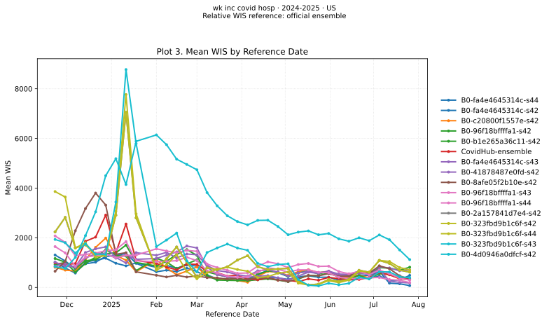

# COVID-19 admissions · 2024-2025

[Canonical report and model names](../b0-configuration-comparison.md)

All models use the same frozen tasks. US is the native national prediction; states/DC are evaluated individually. Fans connect the four horizons from one forecast origin. Fans show only the three best seeded runs across all six targets, plus the official ensemble (light blue) and this target/season’s best run (light red). Bands show 50%/95% intervals; black curves show truth. The season winner appears only once if already in the top three. Every fourth origin is illustrated. Admissions are counts; ED visits are proportions.

Overall top three: `latent32 · seed 42`, `residual2 · seed 43`, `balanced · seed 42`. Target/season best: `latent32 · seed 42`. See the [model differences table](../b0-configuration-comparison.md#model-differences) and the canonical report’s equal-target WIS-ratio selection rule.

## US projection fans

[{ loading=lazy }](../../assets/b0_configuration_comparison/covid_covid_hosp_2024-2025/fans-US.svg)

## North Carolina projection fans

[{ loading=lazy }](../../assets/b0_configuration_comparison/covid_covid_hosp_2024-2025/fans-37.svg)

## States/DC WIS components

[{ loading=lazy }](../../assets/b0_configuration_comparison/covid_covid_hosp_2024-2025/components-states_dc.svg)

## US WIS components

[{ loading=lazy }](../../assets/b0_configuration_comparison/covid_covid_hosp_2024-2025/components-US.svg)

## States/DC relative WIS

[{ loading=lazy }](../../assets/b0_configuration_comparison/covid_covid_hosp_2024-2025/relative-wis-states_dc.svg)

## US relative WIS

[{ loading=lazy }](../../assets/b0_configuration_comparison/covid_covid_hosp_2024-2025/relative-wis-US.svg)

## States/DC WIS over time

[{ loading=lazy }](../../assets/b0_configuration_comparison/covid_covid_hosp_2024-2025/timeseries-states_dc.svg)

## US WIS over time

[{ loading=lazy }](../../assets/b0_configuration_comparison/covid_covid_hosp_2024-2025/timeseries-US.svg)
