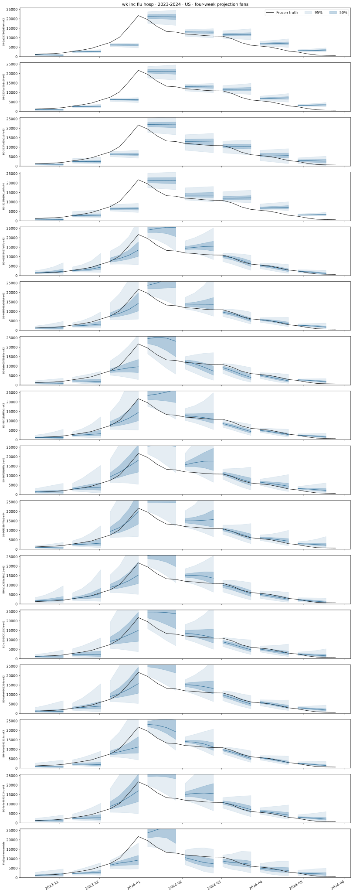
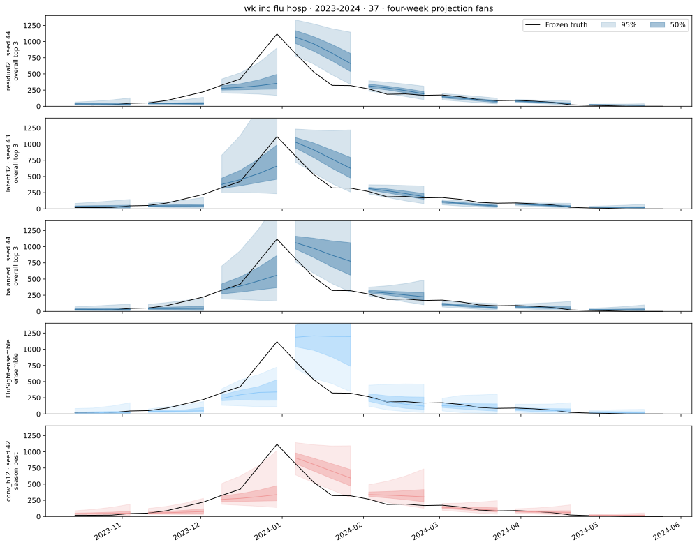
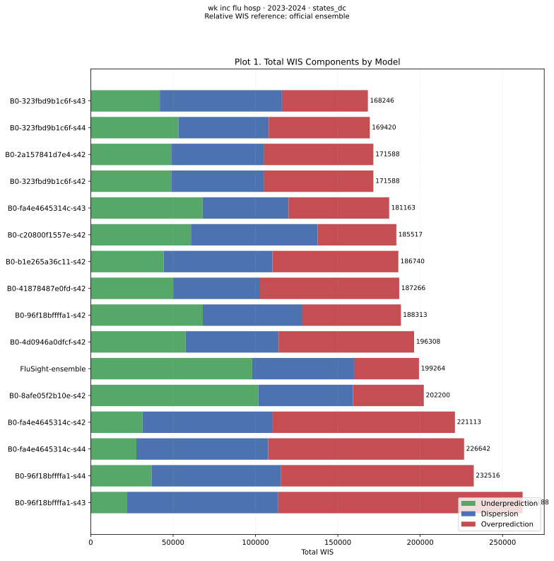
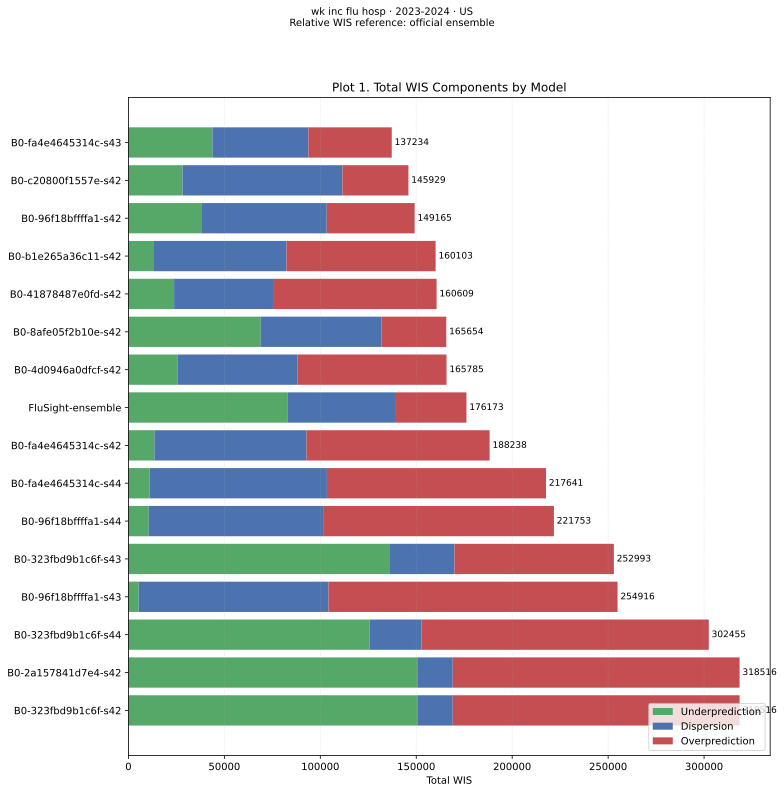
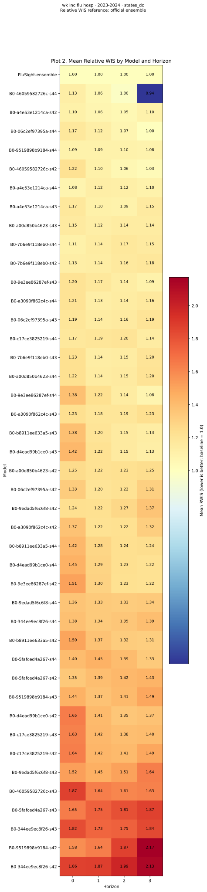
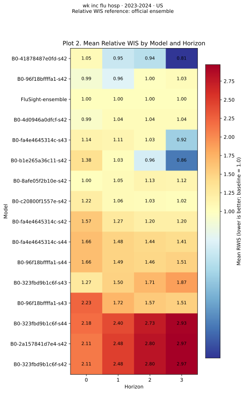
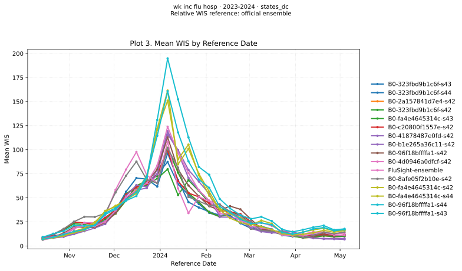
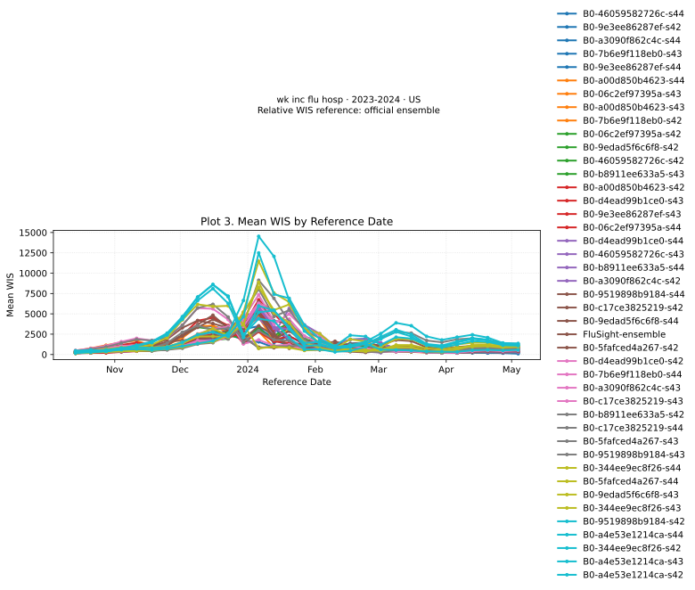

# Influenza admissions · 2023-2024

[Canonical report and model names](../b0-configuration-comparison.md)

All models use the same frozen tasks. US is the native national prediction; states/DC are evaluated individually. Fans connect the four horizons from one forecast origin. Fans show the three best configurations across all six targets, ranked by mean seed score, plus the official ensemble (light blue) and this target/season’s best configuration (light red). Bands show 50%/95% intervals; black curves show truth. Each panel uses the middle-performing seed under its selection objective. Identical representative runs appear once; different middle seeds appear separately. Every fourth origin is illustrated. Admissions are counts; ED visits are proportions.

Overall top three (middle seeds): `residual2 · seed 44`, `latent32 · seed 43`, `balanced · seed 44`. Target/season best (middle seed): `conv_h12 · seed 42`. See the [model differences table](../b0-configuration-comparison.md#model-differences) and the canonical report’s equal-target WIS-ratio selection rule.

## US projection fans

[{ loading=lazy }](../../assets/b0_configuration_comparison/flusight_flu_hosp_2023-2024/fans-US.svg)

## North Carolina projection fans

[{ loading=lazy }](../../assets/b0_configuration_comparison/flusight_flu_hosp_2023-2024/fans-37.svg)

## States/DC WIS components

[{ loading=lazy }](../../assets/b0_configuration_comparison/flusight_flu_hosp_2023-2024/components-states_dc.svg)

## US WIS components

[{ loading=lazy }](../../assets/b0_configuration_comparison/flusight_flu_hosp_2023-2024/components-US.svg)

## States/DC relative WIS

[{ loading=lazy }](../../assets/b0_configuration_comparison/flusight_flu_hosp_2023-2024/relative-wis-states_dc.svg)

## US relative WIS

[{ loading=lazy }](../../assets/b0_configuration_comparison/flusight_flu_hosp_2023-2024/relative-wis-US.svg)

## States/DC WIS over time

[{ loading=lazy }](../../assets/b0_configuration_comparison/flusight_flu_hosp_2023-2024/timeseries-states_dc.svg)

## US WIS over time

[{ loading=lazy }](../../assets/b0_configuration_comparison/flusight_flu_hosp_2023-2024/timeseries-US.svg)
