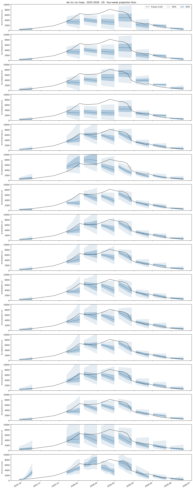
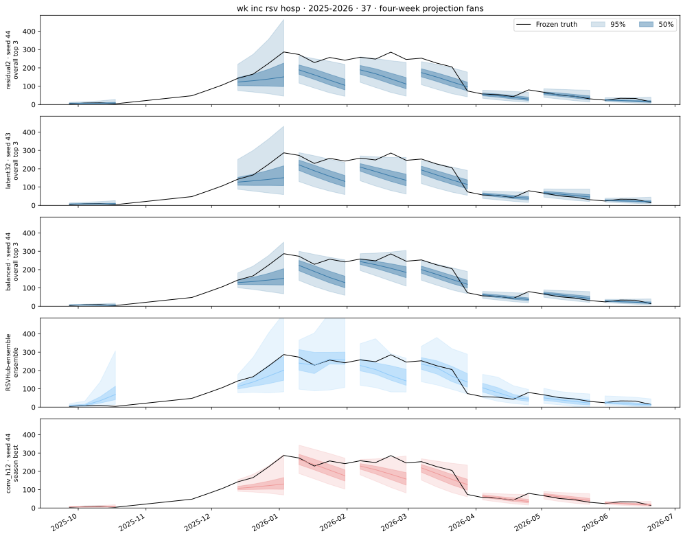
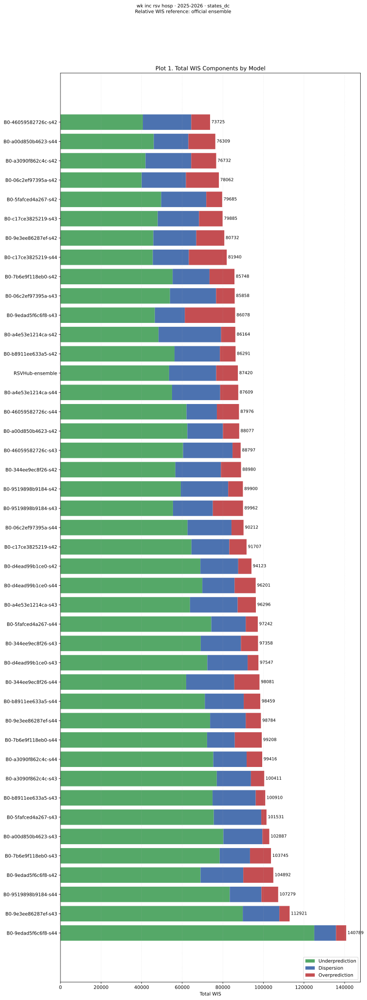
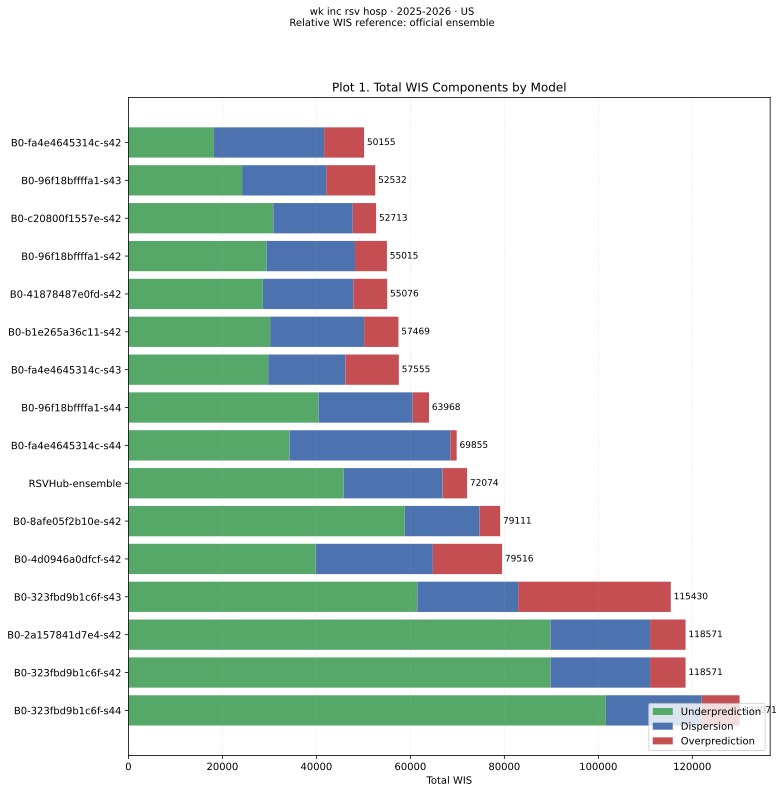
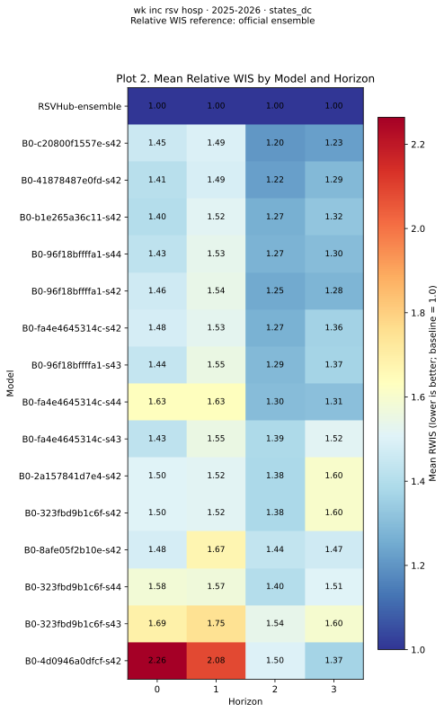
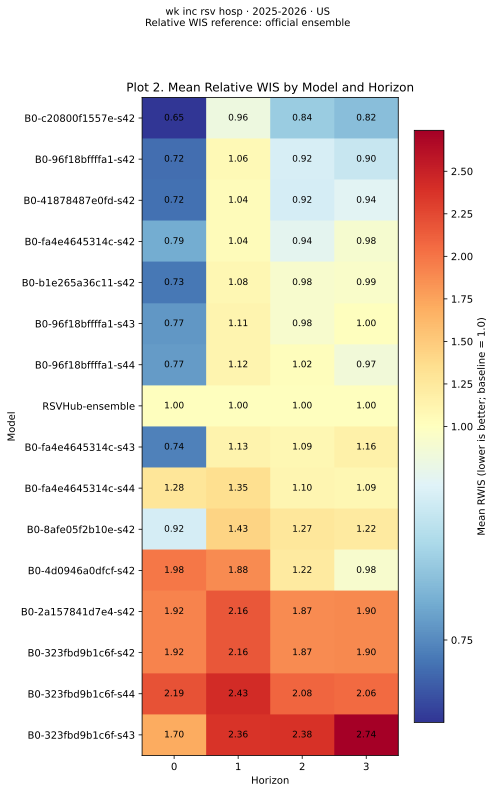
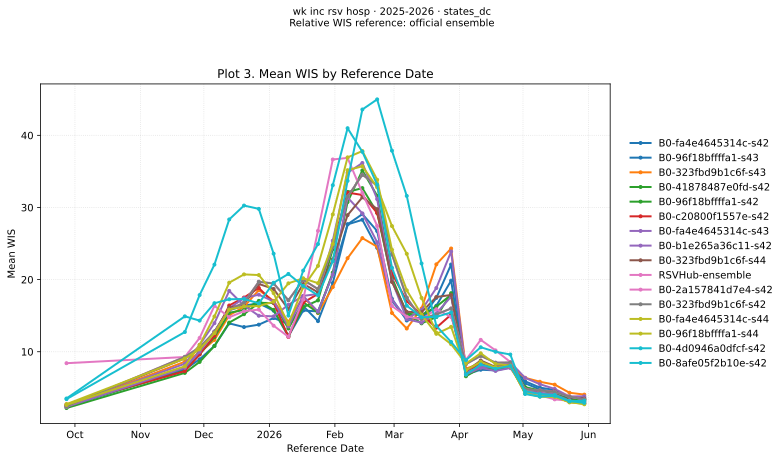
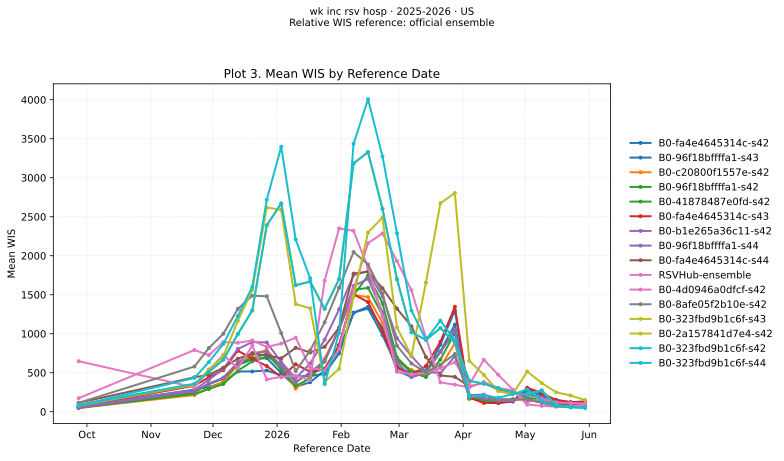

# RSV admissions · 2025-2026

[Canonical report and model names](../b0-configuration-comparison.md)

All models use the same frozen tasks. US is the native national prediction; states/DC are evaluated individually. Fans connect the four horizons from one forecast origin. Fans show the three best configurations across all six targets, ranked by mean seed score, plus the official ensemble (light blue) and this target/season’s best configuration (light red). Bands show 50%/95% intervals; black curves show truth. Each panel uses the middle-performing seed under its selection objective. Identical representative runs appear once; different middle seeds appear separately. Every fourth origin is illustrated. Admissions are counts; ED visits are proportions.

Overall top three (middle seeds): `residual2 · seed 44`, `latent32 · seed 43`, `balanced · seed 44`. Target/season best (middle seed): `conv_h12 · seed 44`. See the [model differences table](../b0-configuration-comparison.md#model-differences) and the canonical report’s equal-target WIS-ratio selection rule.

## Target/season configuration ranking

Arithmetic mean across seeds of each seed’s geometric WIS ratio across US and states/DC. All four horizons are included. Lower is better; 1 is ensemble parity.

| Variant | Mean seed score ± SD | Middle seed |
| --- | --- | --- |
| conv_h12 | 0.8915 ± 0.1282 | 44 |
| latent32 | 0.8923 ± 0.0812 | 44 |
| residual2 | 0.9045 ± 0.0835 | 43 |
| balanced | 0.9343 ± 0.1913 | 42 |
| mlp_h12 | 0.9860 ± 0.1724 | 44 |
| conv_h26 | 1.0062 ± 0.1660 | 44 |
| residual2_z32 | 1.0488 ± 0.1208 | 44 |
| mlp_h26_dynamics | 1.0503 ± 0.0644 | 43 |
| anchor | 1.0509 ± 0.0312 | 44 |
| mlp_h26 | 1.0597 ± 0.1139 | 42 |
| mlp_h8 | 1.0632 ± 0.2120 | 44 |
| state_us | 1.1429 ± 0.1134 | 44 |
| flu_only | 1.2131 ± 0.3960 | 42 |
| baseline | 1.3255 ± 0.0798 | 44 |

## US projection fans

[{ loading=lazy }](../../assets/b0_configuration_comparison/rsv_rsv_hosp_2025-2026/fans-US.svg)

## North Carolina projection fans

[{ loading=lazy }](../../assets/b0_configuration_comparison/rsv_rsv_hosp_2025-2026/fans-37.svg)

## States/DC WIS components

[{ loading=lazy }](../../assets/b0_configuration_comparison/rsv_rsv_hosp_2025-2026/components-states_dc.svg)

## US WIS components

[{ loading=lazy }](../../assets/b0_configuration_comparison/rsv_rsv_hosp_2025-2026/components-US.svg)

## States/DC relative WIS

[{ loading=lazy }](../../assets/b0_configuration_comparison/rsv_rsv_hosp_2025-2026/relative-wis-states_dc.svg)

## US relative WIS

[{ loading=lazy }](../../assets/b0_configuration_comparison/rsv_rsv_hosp_2025-2026/relative-wis-US.svg)

## States/DC WIS over time

[{ loading=lazy }](../../assets/b0_configuration_comparison/rsv_rsv_hosp_2025-2026/timeseries-states_dc.svg)

## US WIS over time

[{ loading=lazy }](../../assets/b0_configuration_comparison/rsv_rsv_hosp_2025-2026/timeseries-US.svg)
