# B0 calibration: the `crosses` experiment (legacy, superseded)

!!! danger "Superseded — kept only as a historical record"
    This page describes `b0-crosses`, fitted **before** the per-location input
    scaling fix (commit `11a23ea`). Under the single pooled scale documented
    here, the US sat at roughly 40× a state's model units, which collapsed its
    intervals — that is the cause of the "US looks wrong" section below, and it
    is now fixed. The replacement experiment is
    [the `us-cross-4` crosses calibration](../b0-crosses/index.md), and its
    conclusions differ materially: the leading recipe is no longer a `conv`
    variant, and the state/US disagreement largely disappears.

    The fit artifacts for this experiment have been **deleted** to reclaim disk
    (`data/experiments/` now holds only `b0-us-cross-4`), so nothing on this page
    can be regenerated or re-ranked. The numbers below are the only surviving
    record, and they should not be quoted as current B0 performance.

**Experiment:** `b0-crosses` · **Suite:** `crosses` · **Status:** complete —
51 configurations × 3 seeds = 153 season-CV runs, 459 season fits.
Fitted 2026-09-15 03:48–04:24 UTC on the patron GPU nodes `g1803jles01` (90 runs)
and `g1803jles02` (63 runs).

This is the smaller calibration that replaced the cancelled 4,097-configuration
`b0-sweep`. It screens **one-factor changes around three pre-chosen reference
recipes** — it does not estimate interactions, and the references were design
choices, not winners picked from the partial sweep.

| Reference | Recipe | Combined score | Rank |
|---|---|---:|---:|
| `raw` | Historical raw-count B0, 8 weeks, no geography/dynamics | 1.1072 | 44 |
| `anchor` | Fourth-root, geography, dynamics, 12 weeks, shared MLP | 0.9888 | 27 |
| `conv` | Anchor + convolution, residual decoder, latent 32, spatial attention, local noise, separate heads, logit ED | 0.9765 | 20 |

## Score definition

The selection score follows [architecture §10.3](../../design/architecture.md) and is
computed by `tapestry.evaluation.totals` from each run's `totals.csv`:

1. **Per target and season:** total model WIS ÷ total ensemble WIS over identical
   frozen tasks (every location including US, every reference date, horizons 0–3,
   on the hub's 23 quantiles). No per-task or per-location ratio is averaged.
2. **Per target:** mean of its season ratios, each season equal.
3. **Combined:** `(2 × (flu + COVID + RSV admissions) + (flu + COVID + RSV ED)) / 9`.
4. **Per configuration:** mean and seed SD over the three seeds.

**Lower is better; 1.0 means parity with the official hub ensemble.**

Ranking artifacts live in the experiment folder (not tracked in Git):
`data/experiments/b0-crosses/ranking-66c35025d66c/` —
`configuration_ranking.csv`, `run_scores.csv`, `season_scores.csv`, `manifest.json`.

## The three best models

| Rank | Configuration | Combined (mean ± seed SD) | States/DC | US | Scenario |
|---:|---|---:|---:|---:|---|
| 1 | `conv__heads_sh` | 0.9220 ± 0.0739 | 0.9453 | 0.9687 | `…enc_conv:sp_attn:hd_sh:dec_res2:nz_loc:z32…` |
| 2 | `conv__lookback_8` | 0.9256 ± 0.0264 | 0.9185 | 1.2197 | `b0:h8:…enc_conv:sp_attn:hd_su:dec_res2:nz_loc:z32…` |
| 3 | `conv__geography_0` | 0.9382 ± 0.0155 | 0.9305 | 1.2387 | `…geo0:…enc_conv:sp_attn:hd_su:dec_res2:nz_loc:z32…` |

All three are one-factor changes on the `conv` reference. Per-target means:

| Configuration | Flu adm. | COVID adm. | RSV adm. | Flu ED | COVID ED | RSV ED |
|---|---:|---:|---:|---:|---:|---:|
| `conv__heads_sh` | 0.893 | 0.897 | 0.799 | 0.956 | 1.380 | 0.784 |
| `conv__lookback_8` | 0.871 | 0.933 | 0.870 | 1.007 | 1.219 | 0.755 |
| `conv__geography_0` | 0.935 | 0.984 | 0.841 | 0.965 | 1.259 | 0.700 |

!!! warning "The top three are not separated"
    The top-10 range (0.0361) is barely above the median seed SD (0.0294), and
    rank 1 has the **largest** seed SD in the leaderboard: `conv__heads_sh`
    scores 0.880 / 1.007 / 0.879 on seeds 42/43/44 — one seed alone lands it at
    parity. Treat these three as an indistinguishable leading group, not an
    ordering. Three seeds cannot resolve differences this small.

## Model ranking plots

One dot per model, one column per metric, models sharing rows across columns —
the hub ensemble is ranked in among the configurations rather than set apart,
so its row shows where it actually falls. Ordered by pooled per-task mean WIS,
**best on top**. WIS components are per-task means; coverage is the fraction of
frozen tasks inside the interval, with the nominal level marked in red.

### Total WIS across all six targets

Columns are the six targets' total WIS, each on its own scale — raw WIS spans
roughly 10² to 10⁵ between admissions and ED proportions, so they cannot share
an axis. Rows are ordered by each configuration's mean WIS ratio to the
ensemble across all six targets, which is scale-free.

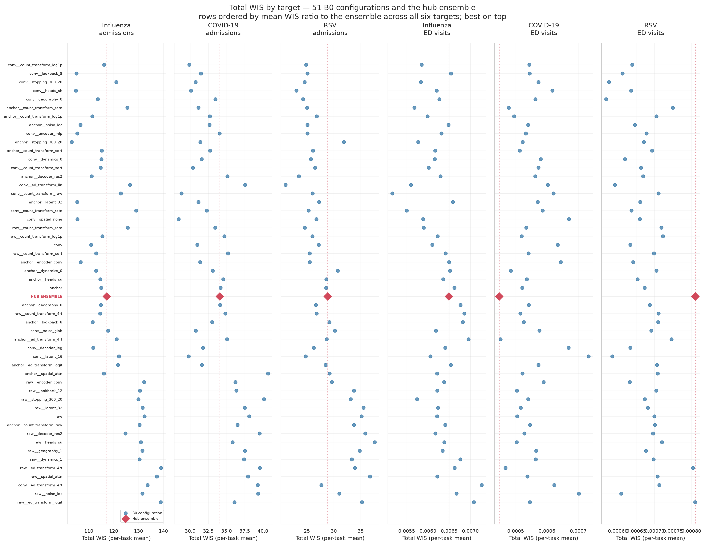

The ensemble lands at row 28 of 52 on that combined ordering: about half the
configurations beat it overall, which is the same result the selection score
reports, seen per target.

### Per target

Six columns each: WIS, underprediction, overprediction, dispersion, 50% and 90%
coverage — the metric set used by the influpaint component plots.

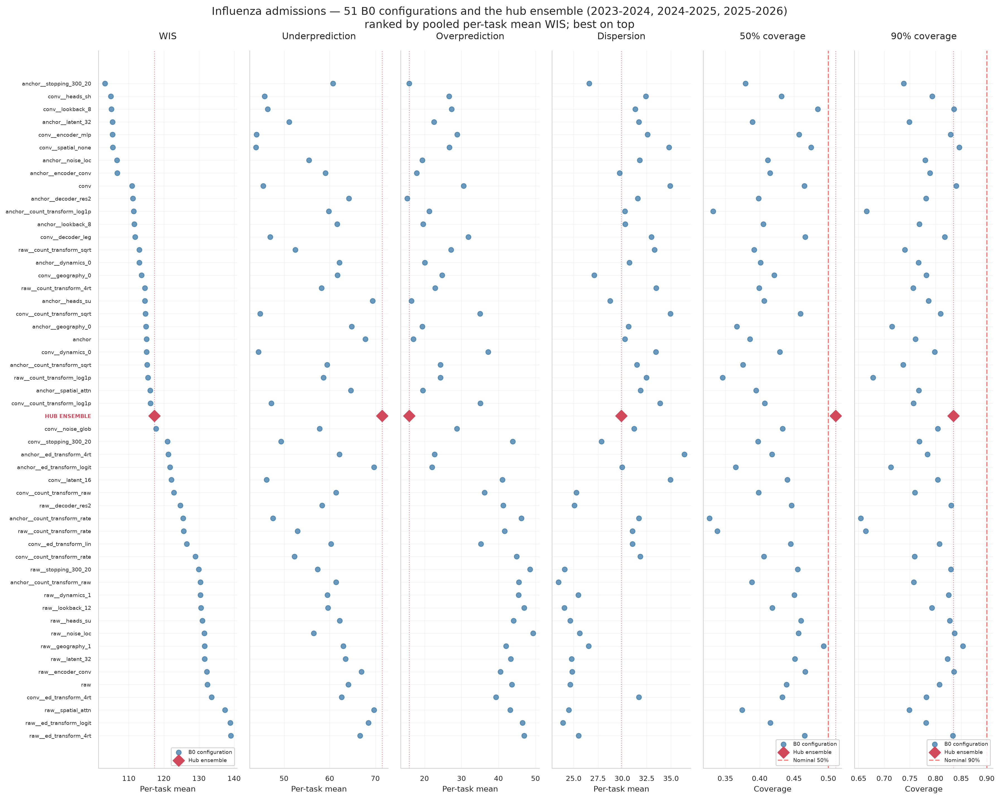

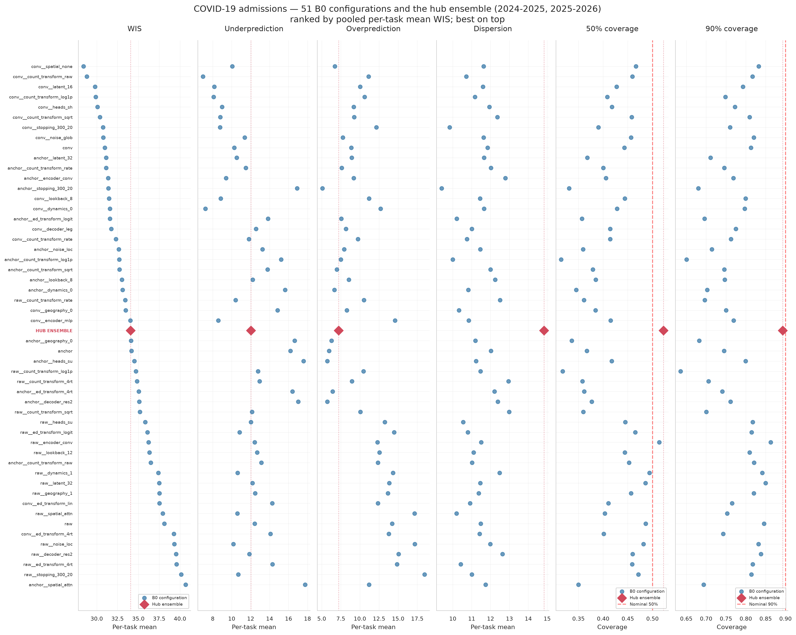

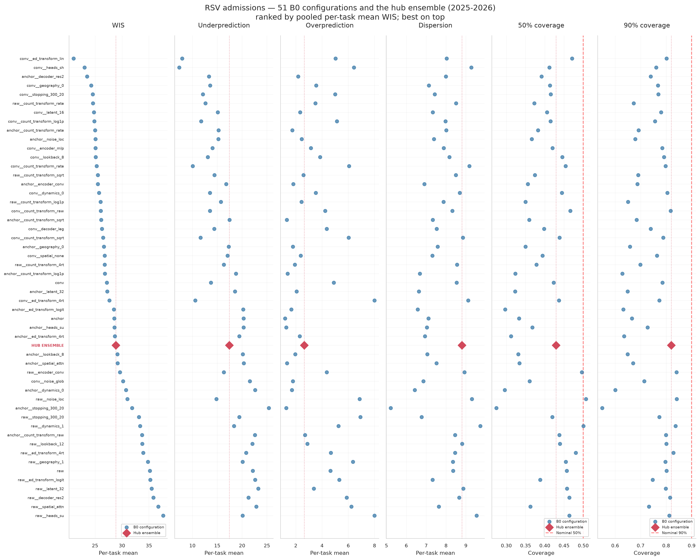

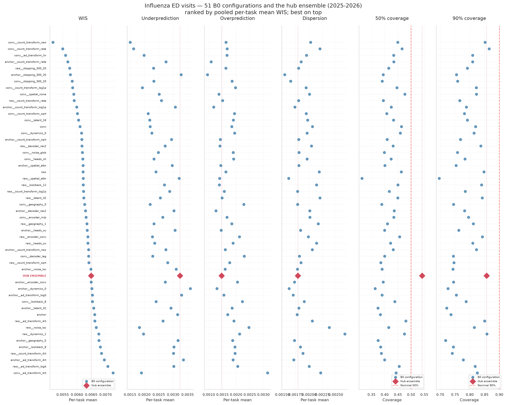

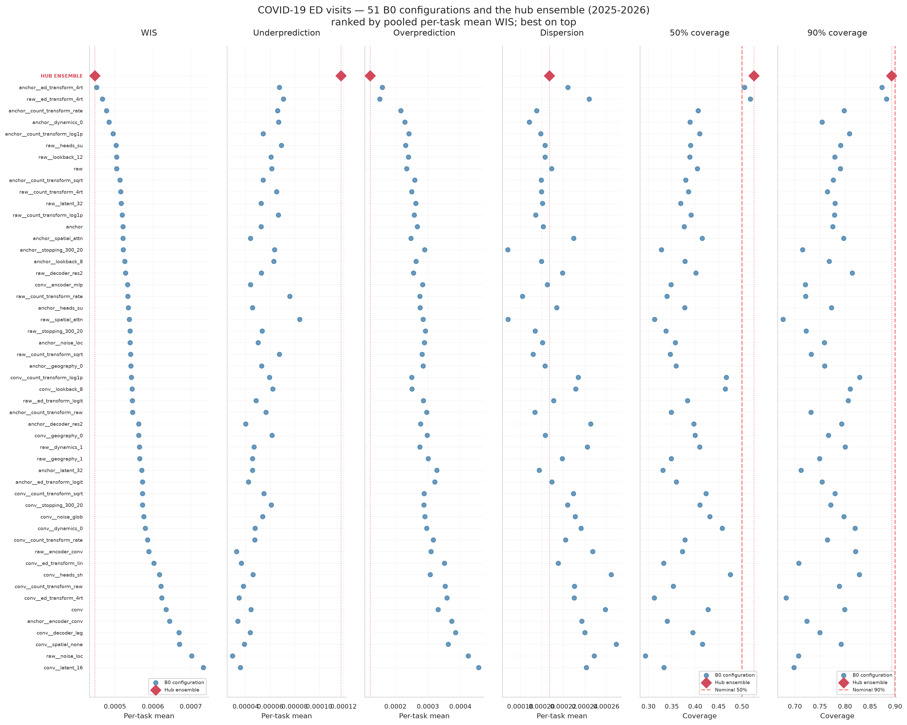

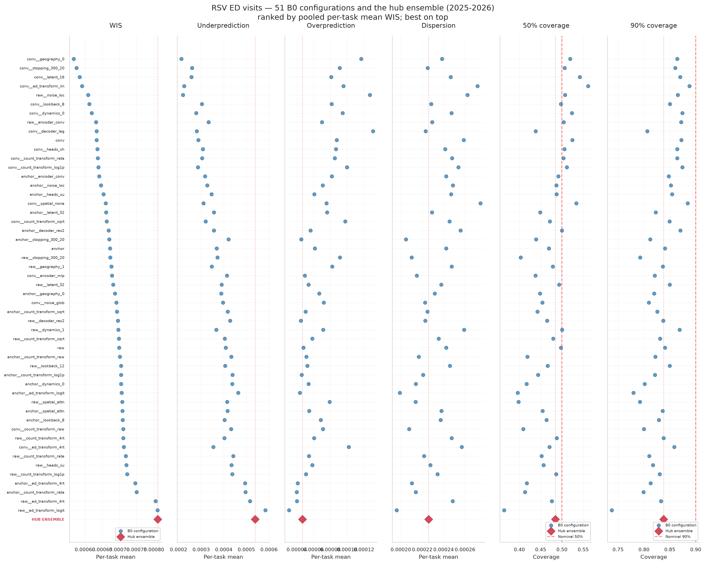

Where the ensemble falls among the 52 rows, by target:

| Target | Ensemble rank | Configurations beating it |
|---|---:|---:|
| Influenza admissions | 27 / 52 | 26 of 51 |
| COVID-19 admissions | 27 / 52 | 26 of 51 |
| RSV admissions | 33 / 52 | 32 of 51 |
| Influenza ED visits | 37 / 52 | 36 of 51 |
| COVID-19 ED visits | **1 / 52** | **0 of 51** |
| RSV ED visits | **52 / 52** | **51 of 51** |

The two extremes are the clearest signals here: no configuration beats the
ensemble on COVID-19 ED visits, and every configuration beats it on RSV ED
visits. The coverage columns show the calibration defect directly — nearly every
dot sits left of both nominal lines.

!!! note "This ordering is not the selection score"
    These figures rank by pooled per-task mean WIS within a target, which
    weights a season by how many tasks it contributes. The selection score in
    the table above instead averages season ratios equally, then weights
    admissions twice ED. The two orderings therefore differ — on influenza
    admissions this figure puts `anchor__stopping_300_20` first, while the
    selection score puts `conv__heads_sh` first. Neither is wrong; they answer
    different questions.

## Fan plots

One figure per season and target. **United States on the left, North Carolina
on the right**, and three rows:

1. **Medians only** — the hub ensemble and the three best configurations, so the
   central paths can be compared without overlapping bands.
2. **Fan of the rank-1 configuration** (`conv__heads_sh`) — median with 50% and
   95% intervals.
3. **Fan of the hub ensemble** — the same, for comparison.

Every third forecast origin is drawn; each configuration is shown at its
median-scoring seed (42, 44, 44). Truth is the frozen black line.

### Influenza admissions

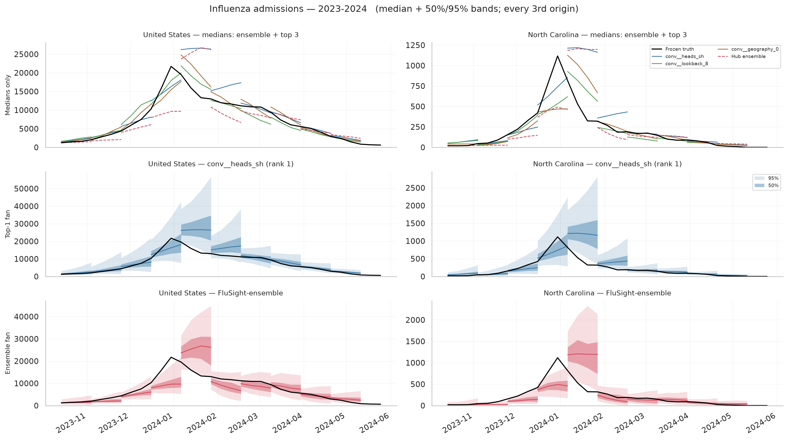

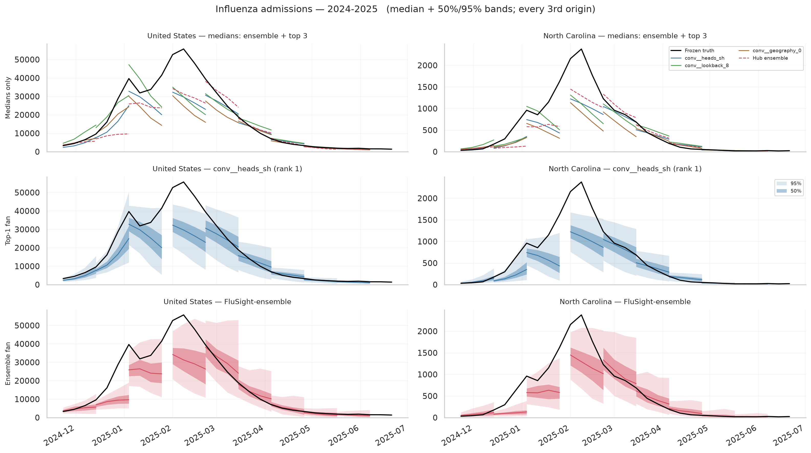

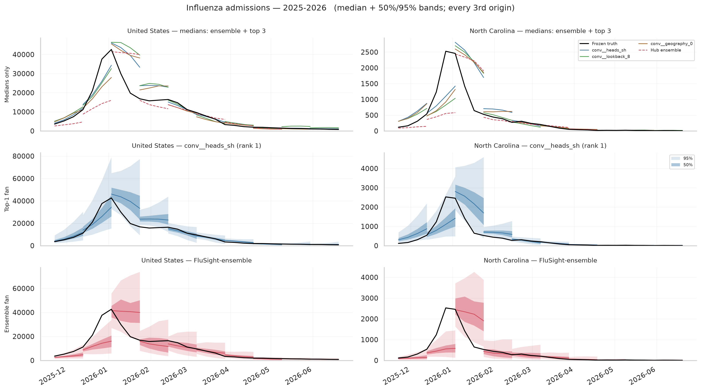

### COVID-19 admissions

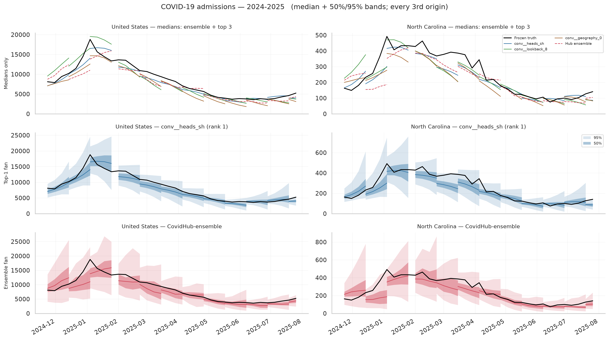

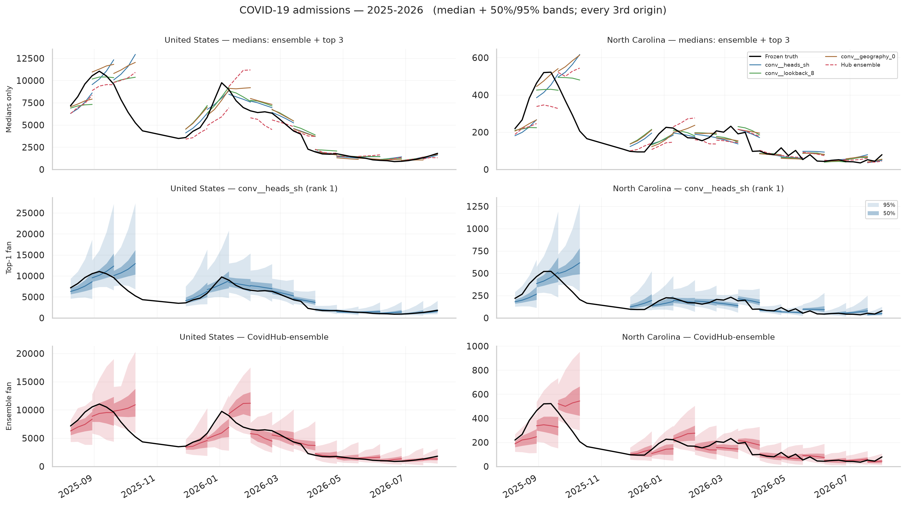

### RSV admissions

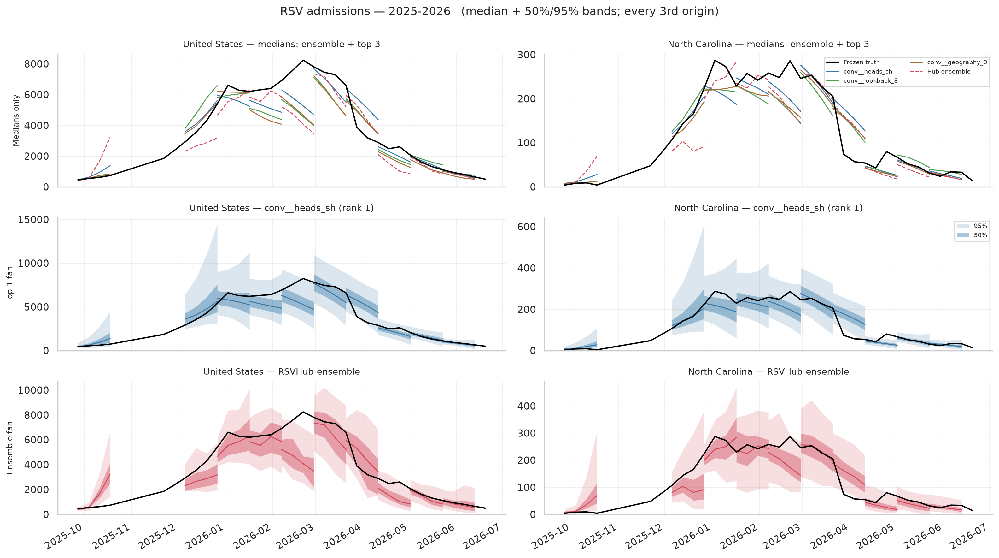

### ED visits, 2025-2026

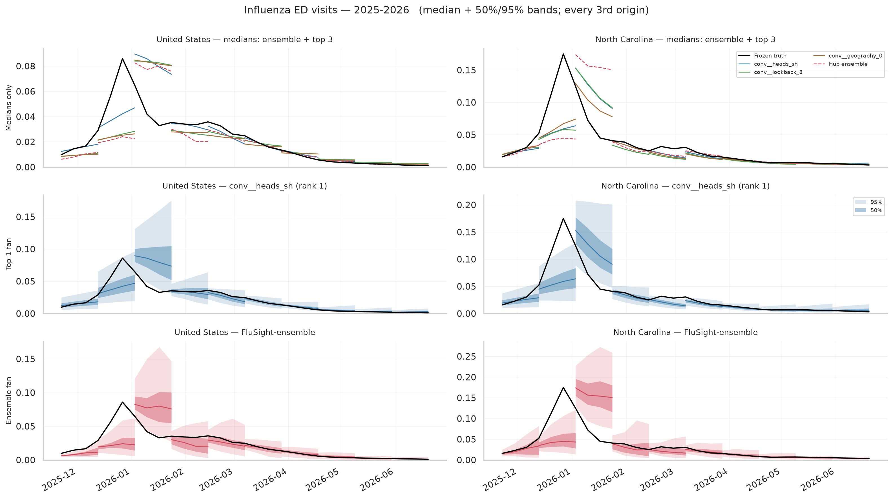

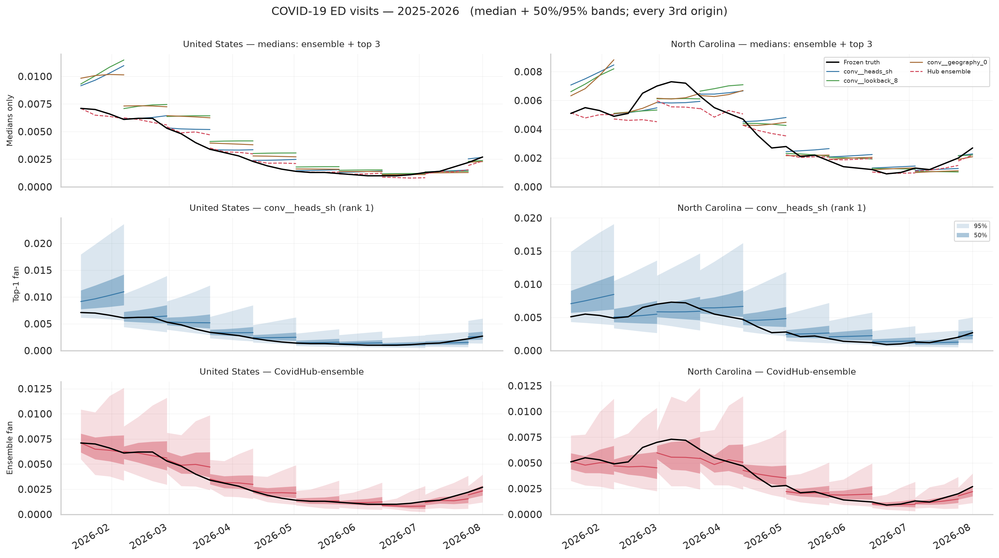

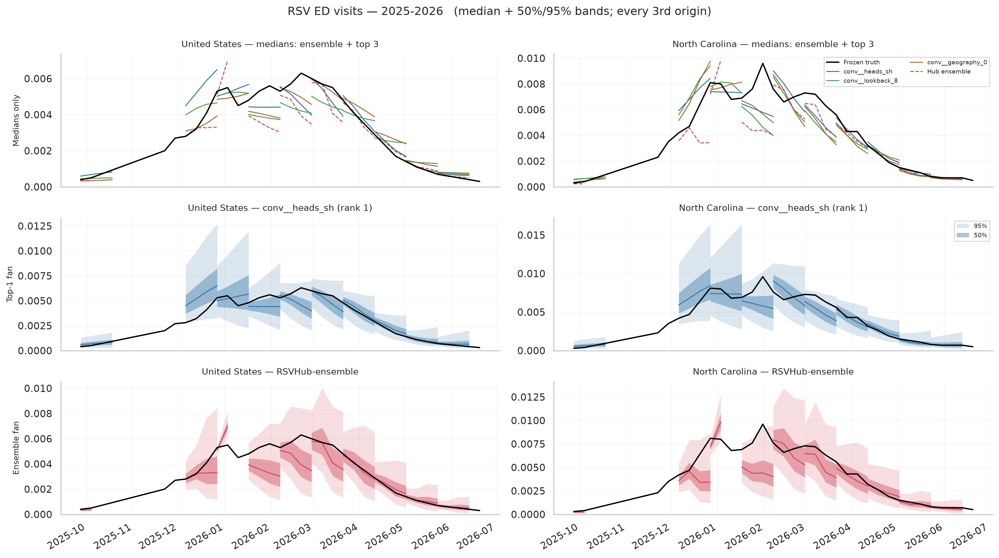

Rendered from saved `forecasts.npz` via `tapestry.evaluation.hubs.export_b0`
against the frozen truth, rather than through `manager compare`. Both
dependencies are available — EpiBenchmark (`epibench`, commit `ed418962`) and
R 4.5.0 with `scoringutils` 2.2.0 at `/nas/longleaf/rhel9/apps/r/4.5.0` — but
running the full EpiBench pipeline was a deliberate scope decision: the §10.3
selection score is the total-WIS ratio `rank` already computes. EpiBench
relative WIS and the standard diagnostic plot set are not included here.

The third row against the second also shows the calibration gap directly: the
ensemble's bands are visibly wider than the rank-1 configuration's at the same
origins, which is the 0.819 US dispersion ratio seen as a picture.

### The model is fooled by a second peak

The 2024-2025 influenza panels show the failure directly. National admissions
rise to about 40,000 in early January, **fall back to about 33,000**, then climb
to a higher second peak near 55,000 at the end of February. Forecasting from
origins around that dip, all three configurations project continued decline:
the fans point down from roughly 35,000 while truth more than doubles away from
them. North Carolina shows the same shape.

Measured over every origin where truth had fallen for a week and then rose more
than 10% within four weeks (896 such origin-locations):

| Influenza 2024-2025 rebounds, **states/DC** | B0 | Hub ensemble |
|---|---:|---:|
| Predicted *down* into the rebound | **77.7%** | 56.2% |
| Four-week truth inside the 95% interval | **31.9%** | 41.6% |
| Median miss at four weeks (admissions) | 226 | 203 |

These counts are state-level: 94 of the 95 influenza 2024-2025 rebound episodes
are states/DC. The national series contributes a **single** rebound origin, at
which both B0 and the ensemble predicted down and neither covered the outturn
(B0 missing by 38,545 admissions, the ensemble by 28,582). The national double
peak is therefore clear in the figure and in that one origin, but it is not
something these counts establish on their own.

!!! warning "This is season-specific, not a general defect"
    Pooled over all six admissions cases, B0 actually handles rebounds *better*
    than the ensemble: it calls the direction down at 24.3% of rebound origins
    versus the ensemble's 29.1%, with a smaller median miss (7 vs 15) and better
    four-week coverage (90.1% vs 85.1%). Influenza 2023-2024 is the opposite
    extreme — B0 calls down at 2.2% of rebounds against the ensemble's 32.6%.
    The double-peak failure is real and severe in 2024-2025; it is not a
    property of the model everywhere.

    A single-peak prior is the natural suspect: the training seasons rarely show
    a within-season rebound, and nothing in the six input channels marks one as
    possible. That is a hypothesis this experiment does not test.

## Performance against the ensemble

**32 of 51 configurations beat the official ensembles on the combined score.**
That headline hides the finding that actually matters:

| | Configurations beating the ensemble |
|---|---:|
| States/DC tasks | **40 of 51** |
| US tasks | **6 of 51** |

The model is competitive at state level and loses badly on the national
aggregate. Mean ratio by geography, across all 51 configurations:

| Target | US | States/DC |
|---|---:|---:|
| Flu admissions | 1.133 | 0.962 |
| COVID admissions | 1.062 | 0.969 |
| RSV admissions | 1.024 | 0.963 |
| Flu ED visits | 1.176 | 0.964 |
| COVID ED visits | 2.145 | 1.238 |
| RSV ED visits | 1.287 | 0.830 |

Even the leading group shows it: `conv__lookback_8` and `conv__geography_0` sit
at 1.22 and 1.24 on US tasks while beating the ensemble on states/DC. Only
`conv__heads_sh` — the one configuration with *shared* rather than separate
state/US heads — is below 1 on both (0.945 states, 0.969 US). That is the single
most suggestive result in the experiment, and with three seeds it is a hypothesis
worth testing, not a conclusion.

Per target, the picture is uneven. COVID ED visits is a systematic failure —
**0 of 51** configurations beat the ensemble (mean ratio 1.247) — while RSV ED
visits is a systematic win at **51 of 51** (mean 0.835). Flu admissions 23/51,
COVID admissions 27/51, RSV admissions 32/51, flu ED 36/51.

Skill also *improves* with horizon for the leaders — `conv__heads_sh` runs
0.936 / 0.910 / 0.875 / 0.859 across horizons 0–3. B0 is relatively weakest at
nowcasting and strengthens further out, the opposite of the usual pattern, which
points at the nowcast rather than the dynamics as the place to look next.

### Calibration is the outstanding defect

Coverage is short of nominal everywhere (mean over all 153 runs):

| Target | 50% cov. (model / ens.) | 95% cov. (model / ens.) |
|---|---|---|
| Flu admissions | 41.7 / 51.1 | 84.4 / 88.0 |
| COVID admissions | 41.5 / 52.5 | 83.5 / 94.2 |
| RSV admissions | 40.0 / 42.9 | 80.3 / 88.9 |
| Flu ED visits | 41.9 / 54.2 | 85.3 / 90.2 |
| COVID ED visits | 38.6 / 52.5 | 83.9 / 93.6 |
| RSV ED visits | 47.0 / 48.4 | 88.9 / 89.5 |

This is a genuine improvement on the withdrawn reference B0, which was severely
overconfident (2.7–5.7% coverage at the 50% level). Intervals are now roughly the
right *width* — dispersion ratios run 0.77–1.08 of the ensemble's — so the
shortfall is misplacement rather than gross overconfidence. No calibration has
been applied, and the saved early-stopping validation forecasts remain available
for one.

## How much of this is the United States?

US is **one location in 52** but carries roughly **half of all admissions WIS**,
because its per-task WIS is about fifty times a state's (influenza: 3,078 versus
62). The selection score sums WIS without reweighting by location, so for
admissions the headline ranking is close to half a national ranking.

| Target | US share of total WIS | US share of tasks |
|---|---:|---:|
| Influenza admissions | 49.4% | 1.9% |
| RSV admissions | 47.1% | 1.9% |
| COVID-19 admissions | 44.7% | 1.9% |
| ED-visit targets | 1.1–2.0% | ~2% |

ED visits are proportions, so magnitude is comparable across locations and US
carries no extra weight there.

### Without the US, a different configuration wins

| Rank | States/DC only | Combined | US only |
|---:|---|---:|---:|
| 1 | `conv__lookback_8` | 0.9256 | 1.2197 |
| 2 | `conv__count_transform_log1p` | 0.9383 | 1.1929 |
| 3 | `conv__geography_0` | 0.9382 | 1.2387 |

`conv__lookback_8` leads the states/DC ranking at **0.9185**; the combined
winner `conv__heads_sh` falls to sixth there (0.9453). The orderings genuinely
disagree — **Spearman ρ between the states-only and US-only rankings is
−0.324**, i.e. slightly *negative*. What helps states tends to hurt the US.
Forty of 51 configurations beat the ensemble on states/DC; only six do at US.

### Why the US looks wrong

It is not a magnitude problem but an overconfidence problem:

| | US | States/DC |
|---|---:|---:|
| 50% coverage | **37.5%** | 41.3% |
| 90% coverage | **73.1%** | 77.0% |
| Dispersion vs ensemble | **0.819** | 1.008 |
| Overprediction share of WIS | 32.1% | 22.2% |

At state level the intervals are about the right width; at US they are roughly
18% too narrow, and the error is flat across horizons (ratio 1.07 → 1.10 from
horizon 0 to 3) rather than growing, which points at level and calibration
rather than accumulating dynamics.

The mechanism is visible in the architecture: the global latent draw is shared
across locations, so state-level errors cancel when the national prediction is
formed, and US uncertainty ends up closer to an average of state uncertainties
than to a genuinely correlated national error.

What the experiment already rules out: **separate state/US heads make it
worse.** Turning them off on the `conv` reference improves US by −0.288; turning
them on at the `anchor` reference costs +0.109. The switch designed for this
problem backfires, plausibly because the US head sees 1/52 of the data. Spatial
attention is inconsistent (−0.092 on `conv`, +0.081 on `anchor`).

The untried directions are to form US as an aggregate of state predictions with
an explicit correlated national error, or to calibrate interval width per
geography using the saved early-stopping validation forecasts, which already
exist and are unused. Neither is tested here.

## Performance against the wider hub field

The ensemble is not the strongest hub model, so beating it is a weaker claim than
it sounds. The ensemble's own position in each frozen field:
7/39 (flu 23-24), 19/51 (flu 24-25), 24/59 (flu 25-26), 9/18 (flu ED),
6/19 (COVID 24-25), 7/18 (COVID 25-26), 3/6 (COVID ED), 4/8 (RSV), 3/5 (RSV ED).

Placing the top three against every other model on identical tasks
(`conv__heads_sh`, mean WIS over seeds):

| Task | Position | Field | vs ensemble |
|---|---:|---:|---:|
| Flu admissions 2023-2024 | 4 | 40 | 0.874 |
| Flu admissions 2024-2025 | 9 | 52 | 0.882 |
| Flu admissions 2025-2026 | 13 | 60 | 0.924 |
| Flu ED visits 2025-2026 | 8 | 19 | 0.956 |
| COVID admissions 2024-2025 | 6 | 20 | 0.728 |
| COVID admissions 2025-2026 | 8 | 19 | 1.066 |
| COVID ED visits 2025-2026 | 6 | 7 | 1.380 |
| RSV admissions 2025-2026 | 2 | 9 | 0.799 |
| RSV ED visits 2025-2026 | 3 | 6 | 0.784 |

A single B0 configuration placing 2nd of 9 on RSV admissions and 4th of 40 on
2023-24 flu is a real result for a six-channel model with no disease-specific
structure. It is not near the top of the large flu fields, and COVID ED visits
is last-but-one.

!!! note "Not the same B0 as the frozen leaderboards"
    The `Tapestry-B0-finalized-CV` entry inside
    `data/evaluation/b0_hub_comparison_q23/*/leaderboard.csv` is the **older
    reference run**, not a `crosses` configuration. It scores 1.58–2.00 × the
    ensemble and sits at 33/40, 46/52, 52/60 and similar. The `crosses`
    configurations above are a substantial improvement on it; do not read the
    frozen leaderboard rows as describing this experiment.

## What the one-factor screen says

Representation dominates architecture. Moving the historical `raw` reference off
raw counts is worth far more than any architectural switch:

| Change on `raw` | Δ combined |
|---|---:|
| `count_transform=log1p` | −0.131 |
| `count_transform=sqrt` | −0.128 |
| `count_transform=4rt` | −0.119 |
| `count_transform=rate` | −0.117 |
| `encoder=conv` | −0.046 |
| everything else | ≥ −0.027 |

Effects are also **not transferable between references** — the point of crossing
three recipes rather than one:

- `spatial=attention` **hurts** `raw` (+0.030) but removing it from `conv` also
  hurts slightly (−0.023 to remove, i.e. attention helps there). Its value
  depends on the surrounding recipe.
- `noise=local` hurts `raw` (+0.021) and is the **best** change to `anchor` (−0.049).
- `ed_transform=logit` is the worst change to `raw` (+0.038) yet is part of the
  best-performing family.
- By family, `conv` variants occupy ranks 1–40 (median 13), `anchor` 5–39
  (median 23), `raw` 19–51 (median 43).

Three changes improve on their own `conv` reference by more than the median seed
SD: shared heads (−0.055), 8-week history (−0.051), and dropping geography
(−0.038). All three *simplify* the model.

## Assumptions and limitations

- **Exploratory, not validation.** All three seasons inform development, and the
  first two folds have later seasons in the fitting set. These are finalized
  retrospective CV results on assumed-truth NSSP values.
- **Selection on the same folds** used for ranking; the top three are chosen on
  the data that scores them.
- **Three seeds** cannot resolve the differences separating the leading group.
- **One-factor screen only.** Interactions were explicitly out of scope; a change
  that helps one reference cannot be assumed to help another.
- **Provenance:** all 153 runs at commit `5e788ab` with `git_dirty=True`
  (uncommitted changes at fit time). Per architecture policy, mixed/dirty commits
  are acceptable only during exploration — paper results must be rerun clean.
- **`compare` was skipped by choice**, so this summary uses the total-WIS
  `rank` path only. EpiBenchmark and R `scoringutils` are both available; the
  EpiBench path was exercised end-to-end on one case as a check that it runs,
  but its scores were never diffed against these totals. Relative WIS, EpiBench
  diagnostics and the standard comparison plots are not included. This limits
  what can be said *alongside* the ranking, not the ranking itself.
- `runs.csv` had been left stale from the first launch (9 V100 kernel failures
  recorded as `failed`, the rest as `planned`); it has been rebuilt from the
  attempt records and now reads 153 `complete`.

## Log

**2026-09-15 — state scaling.** Current data: very decent performance except in
the US, due to a common scaling across all locations. That has been changed.

The `us-cross-4` experiment is running with that fix. The earlier write-ups of
the `us-cross-2` rerun and the proposed follow-up experiment have been removed
from these docs; this page is the surviving record of the `crosses` calibration.

!!! warning "Fit artifacts for this experiment are being cleared"
    The older experiment directories under `data/experiments/` — including
    `b0-crosses` — are slated for deletion to reclaim disk. Once that happens the
    `ranking-66c35025d66c/` artifacts referenced above are gone, and the
    *Reproducing* commands below require refitting from scratch rather than
    re-ranking existing runs. The numbers on this page are the record.

## Reproducing

```bash
.venv/bin/python -m tapestry.models.manager status -e b0-crosses
.venv/bin/python -m tapestry.models.manager rank -e b0-crosses
```

`rank` regenerates `ranking-66c35025d66c/` (it warns that runs carry a dirty
commit, as above). To add EpiBench relative WIS and the standard plot set later,
run `manager compare -e b0-crosses`. Both dependencies are present; R needs to
be on `PATH` first, which a Slurm job gets from `module load r/4.5.0` (as in
`scripts/b0_compare.sbatch`) and an interactive shell gets from
`export PATH=/nas/longleaf/rhel9/apps/r/4.5.0/bin:$PATH`. Note that `compare`
is documented for a shortlist from `rank`, not all 51 configurations.
