# B0.0 — Crosses calibration

37 of 60 configurations beat the hub ensemble under the historical combined
score. `anchor__stopping_300_0` ranks first at 0.8924, but scores 1.688 on
2023–2024 influenza admissions. Results depend on the season and location weights.

## Experiment and score

60 configurations × 3 seeds = 180 season-CV runs and 540 season fits.
Stored experiment: `b0-us-cross-4`. The suite tests one-factor changes around
three reference recipes after the per-location input scaling fix (`11a23ea`).
The [legacy run](../b0-crosses-legacy/index.md) is superseded.

This page retains the historical score:

1. For each target and season, divide total model WIS by total ensemble WIS on
   matching tasks, pooling locations, dates and horizons 0–3.
2. Average season ratios within each target.
3. Combine targets with weight 2 for admissions and 1 for ED visits.
4. Report the mean and SD across three seeds.

Lower is better; 1 means parity with the hub ensemble. This differs from the
later objective with equal seasons, location-relative WIS and 20% US weight.
See [B0.1](../b0-1-crosses/index.md#comparison-with-b00) for a comparison using
rescored B0.0 forecasts.

| Reference | Recipe | Combined score | Rank |
|---|---|---:|---:|
| `raw` | Historical raw-count B0, 8 weeks, no geography/dynamics | 1.0199 | 46 |
| `anchor` | Fourth-root, geography, dynamics, 12 weeks, shared MLP, latent 16 | 0.9701 | 24 |
| `conv` | Anchor + convolution, residual decoder, latent 32, spatial attention, local noise, separate heads, logit ED | 0.9215 | 4 |

## Ranking

| Rank | Configuration | Combined (mean ± seed SD) | States/DC | US |
|---:|---|---:|---:|---:|
| 1 | `anchor__stopping_300_0` | 0.8924 ± 0.0327 | 0.9062 | 0.8879 |
| 2 | `conv__decoder_leg` | 0.9069 ± 0.0233 | 0.9003 | 1.1895 |
| 3 | `anchor__stopping_100_0` | 0.9150 ± 0.0366 | 0.9351 | 0.9374 |
| 4 | `conv` (reference) | 0.9215 ± 0.0480 | 0.8988 | 1.2507 |
| 5 | `conv__us_error_shf` | 0.9291 ± 0.0674 | 0.9282 | 1.1770 |
| 6 | `anchor__stopping_300_20` | 0.9293 ± 0.0269 | 0.9593 | 0.9824 |

40 of 60 configurations beat the ensemble on states/DC tasks; 5 of 60 do so
on US tasks. Scores and seed variation for the full suite:

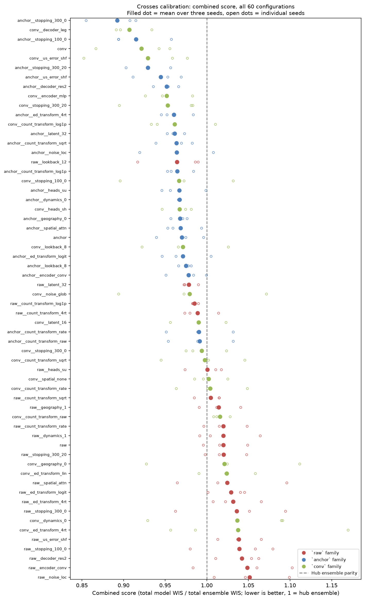

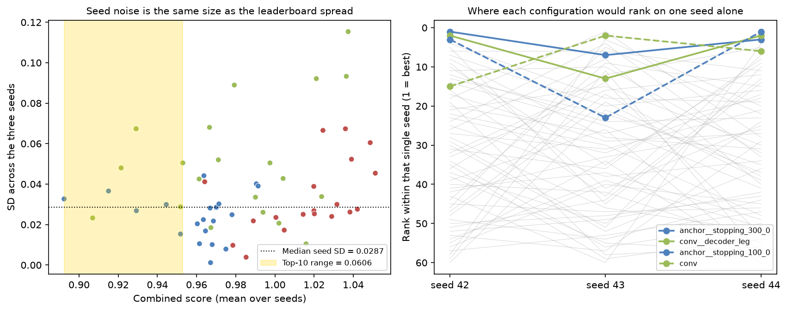

## Training length and season

| Family | ep50 | ep100 | ep300 | ep300 + patience 20 |
|---|---:|---:|---:|---:|
| `raw` | 1.0199 | 1.0391 | 1.0360 | 1.0202 |
| `anchor` | 0.9701 | 0.9150 | 0.8924 | 0.9293 |
| `conv` | 0.9215 | 0.9666 | 0.9939 | 0.9530 |

Longer training lowers the combined score for `anchor` and raises it for `conv`.
The improvement for `anchor` does not hold in every season:

| Configuration | 2023-2024 | 2024-2025 | 2025-2026 | Overall |
|---|---|---|---|---|
| `anchor__stopping_300_0` | 1.688 (51) | 0.832 (7) | 0.837 (1) | 0.8924 (1) |
| `conv__decoder_leg` | 1.145 (21) | 0.811 (3) | 0.925 (3) | 0.9069 (2) |
| `anchor__stopping_100_0` | 1.229 (30) | 0.865 (13) | 0.889 (2) | 0.9150 (3) |
| `conv` | 0.966 (10) | 0.865 (12) | 0.969 (28) | 0.9215 (4) |
| `conv__us_error_shf` | 1.107 (20) | 0.846 (8) | 0.962 (17) | 0.9291 (5) |
| `anchor__stopping_300_20` | 0.946 (5) | 0.778 (1) | 0.960 (14) | 0.9293 (6) |
| `anchor__us_error_shf` | 0.985 (12) | 0.848 (11) | 0.965 (22) | 0.9445 (7) |
| `anchor__decoder_res2` | 0.879 (1) | 0.905 (21) | 0.960 (15) | 0.9518 (8) |
| `conv__encoder_mlp` | 1.213 (27) | 0.830 (6) | 0.967 (23) | 0.9518 (9) |
| `conv__stopping_300_20` | 1.172 (26) | 0.848 (10) | 1.014 (45) | 0.9530 (10) |
| `anchor__ed_transform_4rt` | 0.896 (2) | 0.976 (45) | 0.972 (30) | 0.9604 (11) |
| `conv__count_transform_log1p` | 1.514 (39) | 0.925 (25) | 0.927 (4) | 0.9613 (12) |

At 300 epochs, adding patience 20 lowers the 2023–2024 score from 1.688 to
0.946, while raising the combined score from 0.8924 to 0.9293. These results
show a tradeoff across seasons; they do not establish its cause.

The scored season is excluded from fitting and scaling. Early stopping uses
validation data within the training seasons.

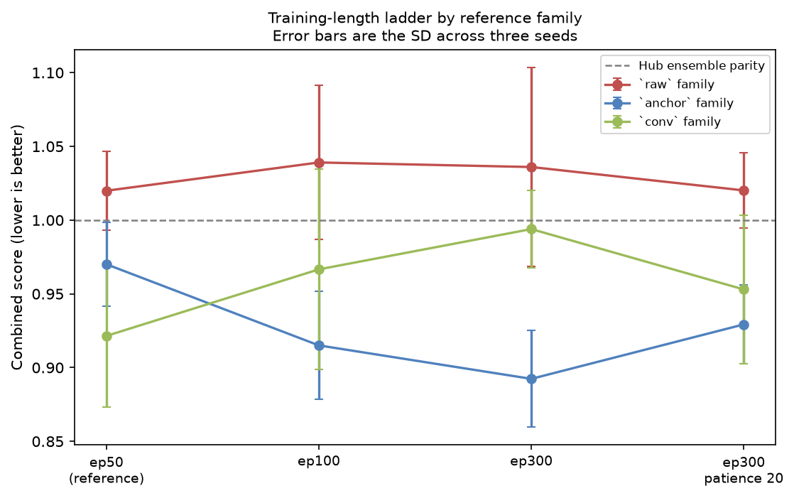

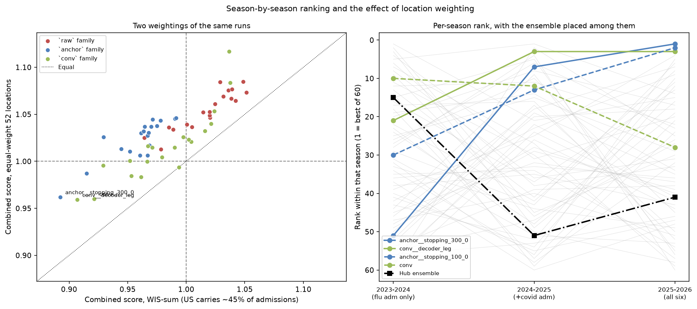

## One-factor changes

Deltas compare each configuration with its own reference; negative is better.

### Anchor

| Change | Δ combined | Δ states | Δ US |
|---|---:|---:|---:|
| `stopping_300_0` | −0.0777 | −0.0811 | −0.1773 |
| `stopping_100_0` | −0.0550 | −0.0522 | −0.1277 |
| `stopping_300_20` | −0.0408 | −0.0280 | −0.0827 |
| `us_error_shf` | −0.0256 | −0.0211 | −0.0430 |
| `decoder_res2` | −0.0183 | −0.0193 | −0.0461 |
| `ed_transform_4rt` | −0.0097 | −0.0149 | −0.0627 |
| `count_transform_raw` | +0.0214 | +0.0153 | −0.0608 |
| `count_transform_rate` | +0.0205 | +0.0144 | −0.0617 |

### Convolution

| Change | Δ combined | Δ states | Δ US |
|---|---:|---:|---:|
| `decoder_leg` | −0.0145 | +0.0015 | −0.0612 |
| `us_error_shf` | +0.0076 | +0.0294 | −0.0737 |
| `encoder_mlp` | +0.0303 | +0.0415 | −0.0707 |
| `heads_sh` | +0.0458 | +0.0699 | −0.1651 |
| `geography_0` | +0.0997 | +0.0755 | +0.1226 |
| `ed_transform_lin` | +0.1024 | +0.1014 | −0.0387 |
| `dynamics_0` | +0.1150 | +0.1539 | +0.0553 |
| `ed_transform_4rt` | +0.1159 | +0.1331 | −0.1176 |

### Raw

| Change | Δ combined | Δ states | Δ US |
|---|---:|---:|---:|
| `lookback_12` | −0.0558 | −0.0365 | −0.0962 |
| `latent_32` | −0.0414 | −0.0372 | −0.0647 |
| `count_transform_log1p` | −0.0346 | −0.0199 | −0.0225 |
| `count_transform_4rt` | −0.0309 | −0.0217 | −0.0122 |
| `encoder_conv` | +0.0287 | +0.0275 | +0.0579 |
| `noise_loc` | +0.0313 | +0.0260 | +0.0385 |

Effects depend on the reference. For example, convolution raises the score on
`raw` and `anchor`, while the bundled `conv` reference ranks fourth overall.
The reference ranking cannot isolate the contribution of convolution.

## Location weights

The historical score pools WIS across locations. The US contributes 47.2% of
influenza-admissions WIS. Averaging the 52 location-specific ratios equally
reduces its weight to 1/52 and changes the ranking:

| Configuration | Equal-weight 52 (± seed SD) | Rank | WIS-sum | Rank | Shift |
|---|---|---:|---:|---:|---:|
| `conv__decoder_leg` | 0.9591 ± 0.0201 | 1 | 0.9069 | 2 | +1 |
| `conv` | 0.9601 ± 0.0253 | 2 | 0.9215 | 4 | +2 |
| `anchor__stopping_300_0` | 0.9620 ± 0.0255 | 3 | 0.8924 | 1 | −2 |
| `conv__count_transform_log1p` | 0.9832 ± 0.0500 | 4 | 0.9613 | 12 | +8 |
| `conv__stopping_300_20` | 0.9844 ± 0.0370 | 5 | 0.9530 | 10 | +5 |
| `anchor__stopping_100_0` | 0.9870 ± 0.0177 | 6 | 0.9150 | 3 | −3 |
| `conv__stopping_300_0` | 0.9938 ± 0.0323 | 7 | 0.9939 | 36 | +29 |
| `conv__us_error_shf` | 0.9957 ± 0.0702 | 8 | 0.9291 | 5 | −3 |
| `conv__stopping_100_0` | 0.9996 ± 0.0661 | 9 | 0.9666 | 18 | +9 |
| `conv__encoder_mlp` | 1.0006 ± 0.0270 | 10 | 0.9518 | 9 | −1 |

Under equal location weights, 9 of 60 configurations beat the ensemble,
compared with 37 under the historical score. None beat it in all three seasons.
This equal-location score also differs from B0.1's 20% US weighting.

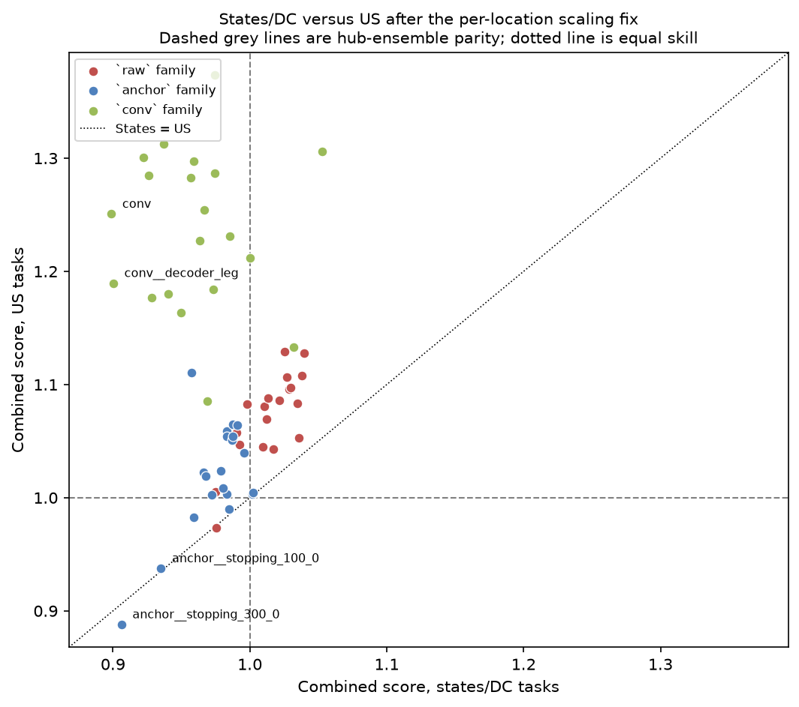

## Coverage and horizon

Coverage percentages averaged over all 180 runs; each cell gives model / ensemble:

| Target | 50% states (model/ens) | 95% states | 50% US | 95% US |
|---|---|---|---|---|
| Flu admissions | 36.7 / 51.2 | 77.7 / 88.0 | 39.5 / 49.7 | 80.3 / 86.8 |
| COVID admissions | 38.5 / 52.3 | 79.3 / 94.2 | 42.8 / 60.7 | 87.6 / 97.6 |
| RSV admissions | 38.7 / 42.8 | 77.5 / 88.9 | 41.8 / 49.1 | 84.0 / 92.2 |
| Flu ED visits | 40.7 / 53.9 | 84.9 / 90.3 | 41.7 / 67.0 | 78.0 / 89.3 |
| COVID ED visits | 34.1 / 52.0 | 80.8 / 93.5 | 31.6 / 78.2 | 82.6 / 100.0 |
| RSV ED visits | 46.2 / 48.1 | 88.2 / 89.4 | 45.0 / 65.8 | 82.2 / 97.3 |

Coverage is below nominal levels for all reported target/geography combinations.
No interval calibration was applied. Coverage alone does not identify the cause
of the errors.

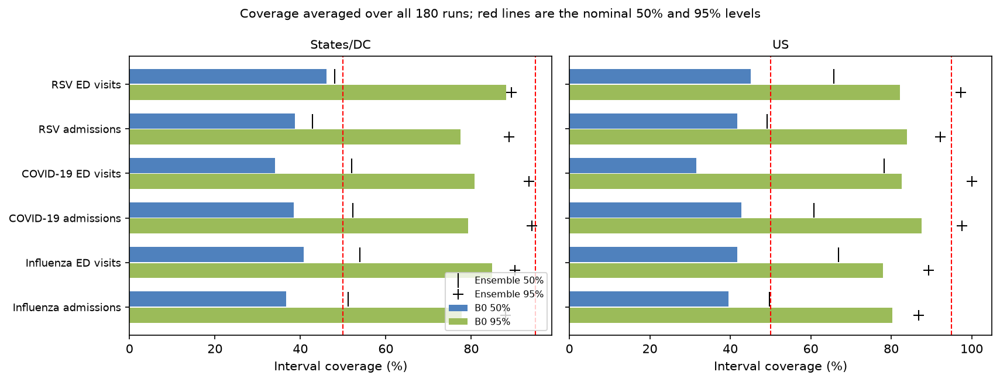

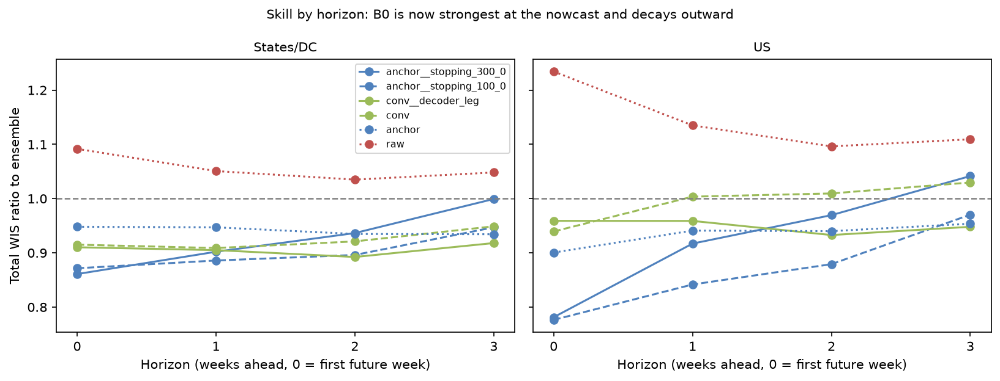

For `anchor__stopping_300_0`, states/DC WIS ratios rise from 0.861 at horizon 0
to 0.999 at horizon 3; US ratios rise from 0.781 to 1.042.

## Fan plots

United States on the left, North Carolina on the right. Rows show the three
leading configurations at their median-scoring seed (s44) and the hub ensemble.
Every third forecast origin is drawn against frozen truth.

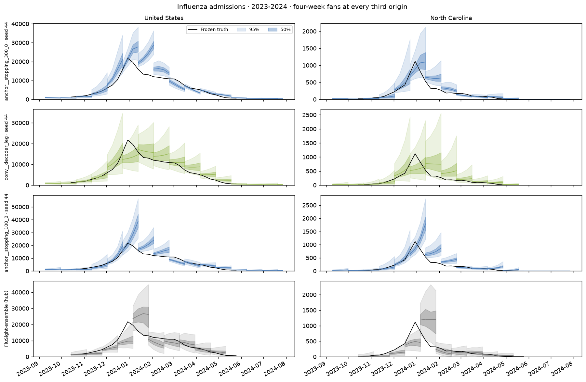

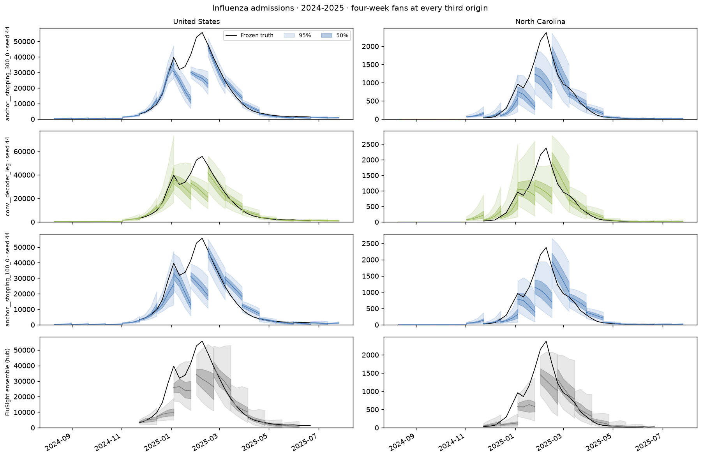

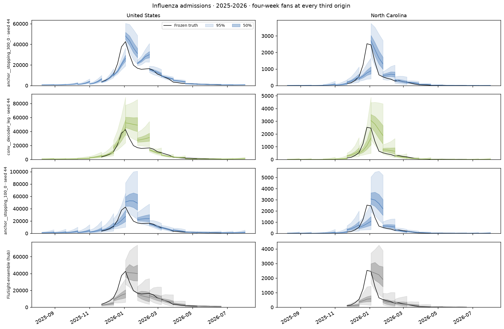

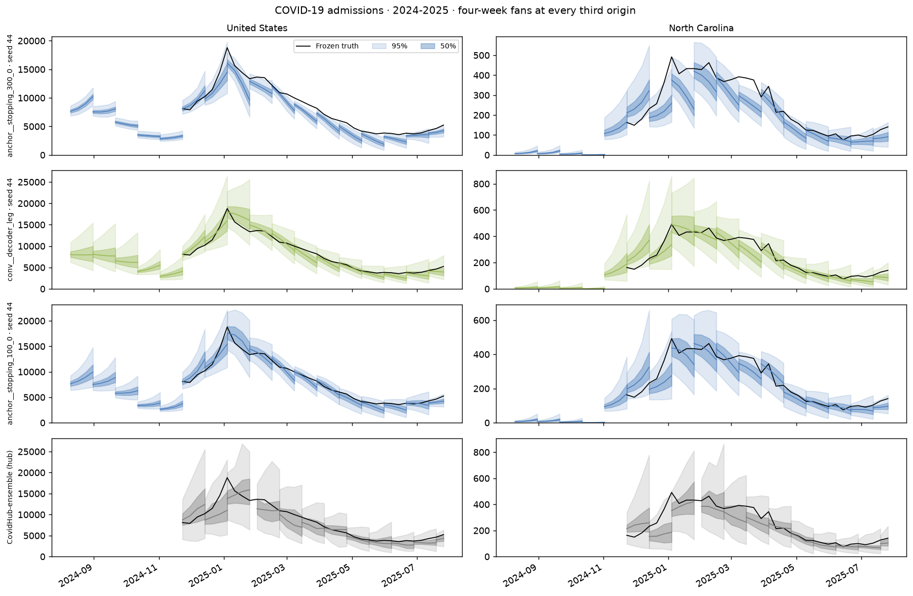

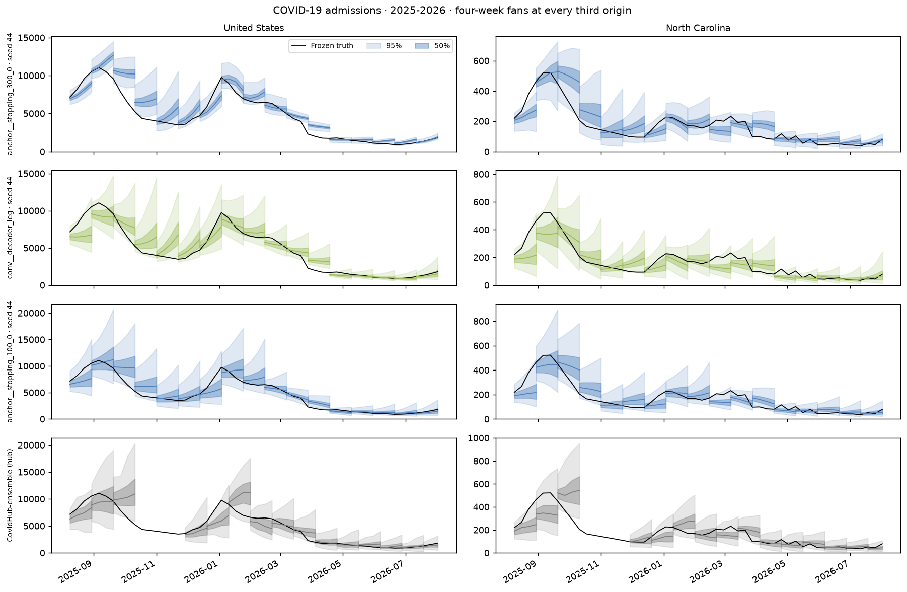

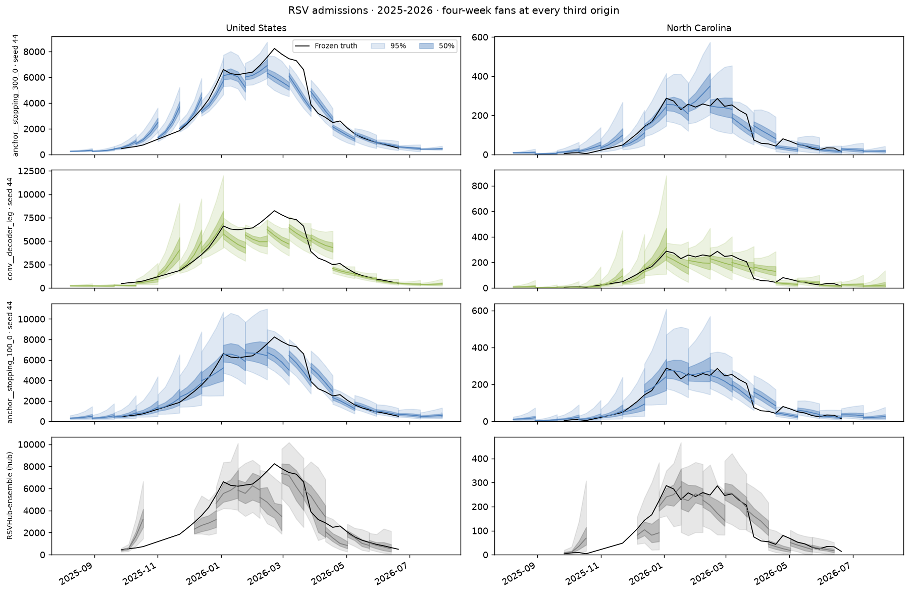

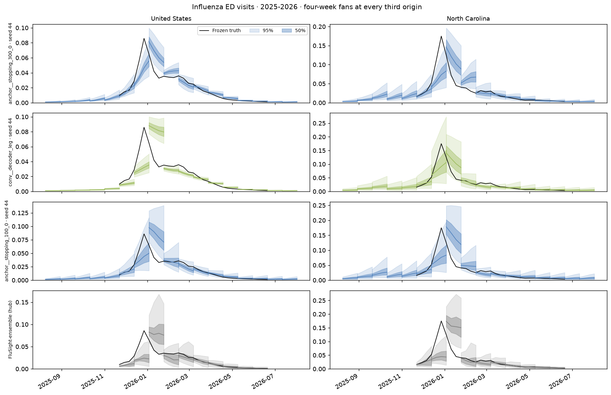

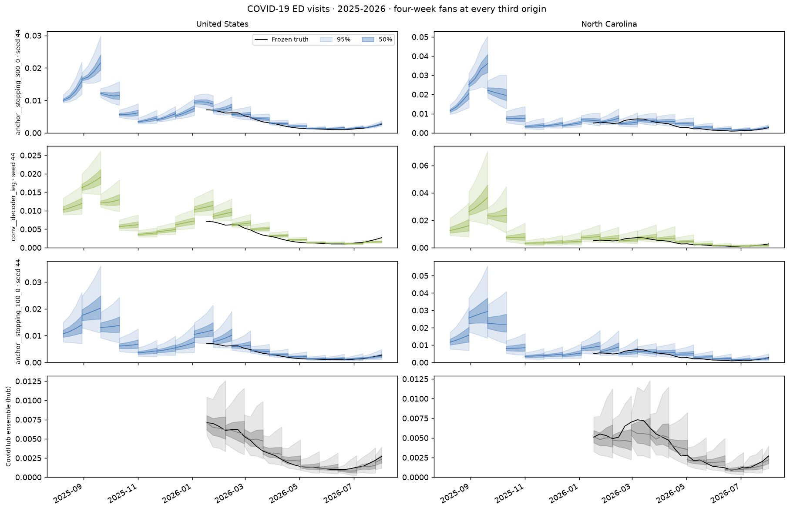

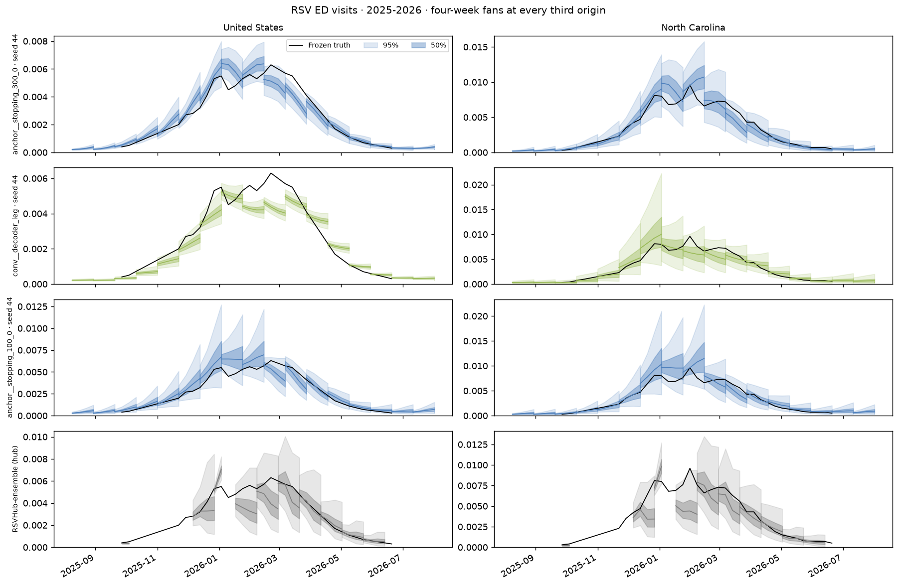

### Member trajectories

50 of the rank-1 configuration's 100 saved members per origin:

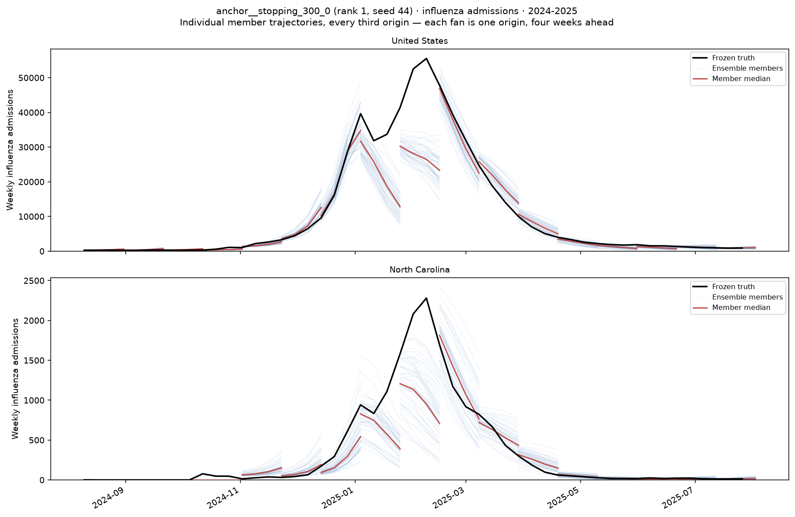

## Assumptions and limitations

- These are retrospective fits on finalized data, using NSSP values as truth.
  Earlier held-out seasons can have later seasons in their training set.
- All three seasons inform model selection; the ranking is not an independent
  evaluation of the selected model.
- Target coverage differs by season: 2023–2024 has influenza admissions only,
  2024–2025 adds COVID admissions, and 2025–2026 has all six targets.
- Three seeds describe run-to-run variation. Their SD is not a significance
  threshold for differences between configurations.
- One-factor changes apply to their reference recipes; the suite does not
  estimate all interactions.
- Runs include mixed clean/dirty source states. The recorded review found no
  model-code differences; publication results need a clean rerun.
- This rewrite retains the reported numerical results; it does not recompute scores.

## Reproducing

Historical ranking artifacts are in
`data/experiments/b0-us-cross-4/ranking-2739af8db682/`.
The plotting command uses that saved ranking:

```bash
.venv/bin/python scripts/plot_b0_crosses.py -e b0-us-cross-4 -r ranking-2739af8db682
```

Current scoring uses a different objective. See the
[postprocessing workflow](../../workflows/experiment-postprocessing.md) and the
[B0.1 reproduction notes](../b0-1-crosses/index.md#reproducing) for rescoring.
The follow-up design is in [B0 after crosses: next steps](next-steps.md).

## Log

- 2026-09-15: Reran the suite after replacing pooled input scaling with
  per-location scaling (`11a23ea`). The legacy fit artifacts were deleted.
- 2026-09-16: Shortened the report. Removed repeated analysis and explanations
  of overfitting, distribution shift and interval errors that the comparisons
  did not establish. Retained the historical score and figures.
