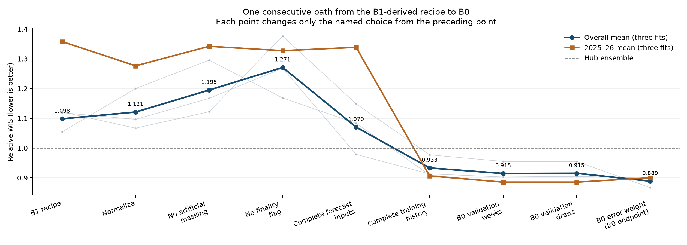
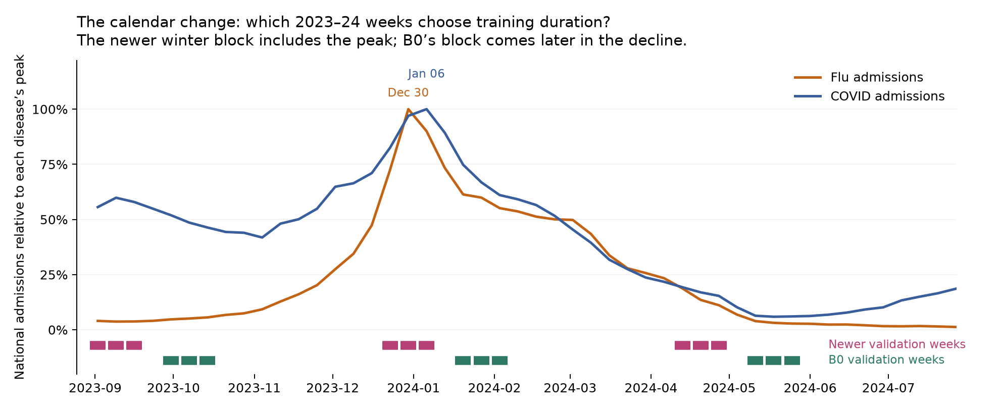

| Consecutive change | Overall error | Change from preceding row | 2025–26 error |
| --- | ---: | ---: | ---: |
| Starting point: B1-derived direct forecaster | 1.09830 | — | 1.35764 |
| Restore B0 input normalization | 1.12110 | +0.02280 | 1.27626 |
| Remove artificial missing inputs during training | 1.19484 | +0.07374 | 1.34177 |
| Remove the “this value is final” indicator | 1.27085 | +0.07601 | 1.32718 |
| Restore complete inputs **at forecast time only** | 1.07026 | -0.20059 | 1.33836 |
| Restore complete histories **during training** | 0.93339 | -0.13687 | 0.90652 |
| Restore B0 validation weeks | 0.91476 | -0.01863 | 0.88568 |
| Restore B0 validation simulations | 0.91540 | +0.00064 | 0.88568 |
| Restore B0 training-error weight → **B0** | 0.88889 | -0.02651 | 0.90025 |

**Lower is better; 1 is the Hub ensemble benchmark.** Relative weighted interval score (WIS) measures forecast error, including uncertainty intervals. Numbers average three fits with different random seeds. Each row changes the preceding row; negative differences are improvements.

**1. Starting point: B1-derived direct forecaster.** Three networks—flu, COVID and RSV—learn from two seasons to predict admissions and emergency-department (ED) visit proportions for the next four weeks using 12 weeks of histories; the remaining season evaluates them. This starting recipe restricts inputs to reports present in the checked archives by each deadline, adds artificial missingness during training, includes a “this value is final” indicator, and omits B0’s fitted input normalization. All subsequent rows keep the original dataset, network recipe, evaluation cases and forecast simulation draws fixed, with no extra predictors or separate recent-history estimation stage.

**2. Restore B0 input normalization.** Admissions inputs are divided by each location’s historical high level, while transformed ED inputs are centered around their historical average and divided by their variability, using training data only. This puts different histories on comparable numerical scales without changing forecast units or scoring weights. It improves 2025–26 error from **1.35764 to 1.27626**, especially COVID ED, but worsens the overall mean, so its benefit depends on the season.

**3. Remove artificial missing inputs during training.** Previously, half the training examples received an additional pattern of hidden observations, teaching the model to forecast from incomplete histories; this step stops that deliberate hiding while retaining genuine archive gaps. Error worsens in all three repeated fits, both overall and in 2025–26. That supports keeping this training exercise under the input restrictions tested here.

**4. Remove the “this value is final” indicator.** This removes the extra input telling the model which supplied observations are finalized; the ordinary indication of whether an observation is present remains. Because every supplied value in these experiments is finalized, the extra indicator adds no new information, but removing it changes the input representation and therefore the fitted model. Overall error worsens **1.19484 → 1.27085**, with inconsistent effects across repeated fits, while the 2025–26 mean improves slightly.

**5. Restore complete inputs at forecast time only.** Keep the fitted models unchanged, but give them every observation present in the finalized history when making forecasts, including observations absent from the deadline archives. Overall error improves **1.27085 → 1.07026**, driven by the older seasons; 2025–26 instead worsens slightly, **1.32718 → 1.33836**. This is consistent with the corrected 2025–26 scored dates already having every latest admissions input and nearly every latest ED input.

**6. Restore complete histories during training.** Now also train with complete finalized histories, retaining the complete forecast inputs from the preceding row. This improves 2025–26 **1.33836 → 0.90652**, across all six outcomes and all three repeated fits. The likely benefit is much richer training information and better-informed normalization: the older archive supplies no latest-week ED inputs in 2023–24 and only about 13% in 2024–25, despite observations existing in finalized history.

**7. Restore B0 validation weeks.** Validation temporarily hides historical weeks during an initial fit to choose training duration, after which the final fit uses all training weeks. This step changes the hidden 2023–24 dates: the winter block moves from **December 23, 30 and January 6**, around the flu/COVID peak, to **January 20, 27 and February 3**, during the later decline, keeping peak observations visible to the initial fit. Overall error improves **0.93339 → 0.91476** in all three repeated fits, although the 2025–26 aggregate improvement comes from only one fit, so later validation is not established as universally better.

**8. Restore B0 validation simulations.** The model produces simulated possible outcomes to estimate its validation error and choose training duration; this step replaces the newer simulation draws with B0’s draws. Both versions use a fixed set across candidate training durations, and the forecast simulations used for final evaluation remain unchanged. The effect is negligible: overall error changes **0.91476 → 0.91540**, while 2025–26 remains **0.88568**.

**9. Restore B0 training-error weight → B0.** This approximately triples each pathogen model’s combined training error, preserving the relative importance of admissions, ED, seasons and locations; it changes neither input normalization nor final scoring weights. The optimizer limits unusually large parameter updates, and numerical behavior can also make rescaling the error change the fitted model. This reaches B0’s **0.88889** overall error, but worsens 2025–26 **0.88568 → 0.90025** in every repeated fit, so recovering B0 does not mean every B0 choice helps the latest season.

The complete validation-calendar change is below; dates in the other two seasons are unchanged.

| Block | Newer calendar: weeks ending | B0 calendar: weeks ending | Epidemic timing |
| --- | --- | --- | --- |
| Autumn 2023 | Sep 2, 9, 16 | Sep 30; Oct 7, 14 | Before the main winter peaks |
| Winter 2023–24 | Dec 23, 30; Jan 6 | Jan 20, 27; Feb 3 | Newer block straddles flu/COVID peaks; B0 uses the later decline |
| Spring 2024 | Apr 13, 20, 27 | May 11, 18, 25 | Both after the winter peaks |

National flu admissions peaked **December 30**, COVID admissions **January 6**; flu/COVID ED peaked December 30 and RSV ED November 25. B0’s calendar selects longer training for 2025–26: average passes through the data rise **53 → 68** for flu, **54 → 131** for COVID and **37 → 104** for RSV. Keeping peak observations visible is a plausible explanation, but changing validation weeks also changes the data used to fit normalization, so these mechanisms were not isolated separately.

**Conclusion:** a season resembling 2025–26 supports training on complete histories rather than recreating old archive gaps. It does **not** justify copying every B0 choice: masking helps, normalization helps the recent season, and B0’s larger error weight hurts that season. The best recent-season row is **0.88568**, before the weight change. These are sequential effects; combining their best elements remains untested.

<strong>Assumptions, corrected holiday deadlines, and every missing 2025–26 week/location</strong>

**Scope:** all visible values are finalized; preliminary-value revisions are untested. Only 2025–26 availability has corrected deadlines; earlier seasons retain the saved Wednesday archive. These retrospective season comparisons do not establish future superiority. Scoring gives states/DC 80%, native US 20%, admissions twice ED, and seasons equal weight. Available benchmark outcomes are flu admissions in 2023–24, flu/COVID admissions in 2024–25, and all six in 2025–26.

These are observation weeks (Saturday week ends), not submission dates. The latest expected input is the Saturday seven days before the forecast reference date, even when a holiday moves submission later. Each row was checked at the appropriate Hub deadline, including Christmas and New Year extensions. Presence means a report exists in the checked Hub files, raw NSSP files (CSV and Parquet), or dated Delphi archives. Absence here does not establish absence from every possible upstream or private source.

For scored forecasts, all latest admissions inputs are present. The ED cases below are all in Missouri. Different target counts reflect different scoring calendars, not different statewide ED reporting coverage.

| Scored outcome | Location | Missing observation weeks |
| --- | --- | --- |
| COVID ED | Missouri | 2026-01-10, 2026-01-17, 2026-01-24, 2026-01-31, 2026-02-07, 2026-02-14, 2026-02-21, 2026-02-28, 2026-03-07, 2026-03-14, 2026-03-21, 2026-03-28, 2026-04-04, 2026-04-11, 2026-04-18, 2026-04-25, 2026-05-02, 2026-05-09, 2026-05-16, 2026-05-23, 2026-05-30 |
| Flu ED | Missouri | 2025-11-15, 2025-11-22, 2025-11-29, 2025-12-06, 2025-12-13, 2025-12-20, 2025-12-27, 2026-01-03, 2026-01-10, 2026-01-17, 2026-01-24, 2026-01-31, 2026-02-07, 2026-02-14, 2026-02-21, 2026-02-28, 2026-03-07, 2026-03-14, 2026-03-21, 2026-03-28, 2026-04-04, 2026-04-11, 2026-04-18, 2026-04-25, 2026-05-02, 2026-05-09, 2026-05-16, 2026-05-23 |
| RSV ED | Missouri | 2025-09-20, 2025-11-15, 2025-11-22, 2025-11-29, 2025-12-06, 2025-12-13, 2025-12-20, 2025-12-27, 2026-01-03, 2026-01-10, 2026-01-17, 2026-01-24, 2026-01-31, 2026-02-07, 2026-02-14, 2026-02-21, 2026-02-28, 2026-03-07, 2026-03-14, 2026-03-21, 2026-03-28, 2026-04-04, 2026-04-11, 2026-04-18, 2026-04-25, 2026-05-02, 2026-05-09, 2026-05-16, 2026-05-23 |

The complete season covers 53 observation weeks, August 2, 2025 through August 1, 2026. The following also includes dates outside the scored forecasts. Those calendar checks use the usual weekly cutoff and do not imply that a Hub submission was required. All 52 means the 50 states, District of Columbia and the native United States series.

| Outcomes | Missing locations | Missing observation weeks |
| --- | --- | --- |
| COVID admissions, Flu admissions, RSV admissions | All 52 modeled locations | 2025-09-27, 2025-10-04, 2025-10-11, 2025-10-18, 2025-10-25, 2025-11-01, 2025-11-08 |
| COVID ED, Flu ED, RSV ED | Missouri | 2025-08-02, 2025-08-09, 2025-08-16, 2025-08-30, 2025-09-13, 2025-09-20, 2025-11-15, 2025-11-22, 2025-11-29, 2025-12-06, 2025-12-13, 2025-12-20, 2025-12-27, 2026-01-03, 2026-01-10, 2026-01-17, 2026-01-24, 2026-01-31, 2026-02-07, 2026-02-14, 2026-02-21, 2026-02-28, 2026-03-07, 2026-03-14, 2026-03-21, 2026-03-28, 2026-04-04, 2026-04-11, 2026-04-18, 2026-04-25, 2026-05-02, 2026-05-09, 2026-05-16, 2026-05-23, 2026-05-30 |
| COVID ED, Flu ED, RSV ED | All 52 modeled locations | 2025-08-23, 2025-09-06, 2025-09-27, 2025-10-04, 2025-10-11, 2025-10-18, 2025-10-25, 2025-11-01, 2025-11-08 |

All modeled locations: Alabama, Alaska, Arizona, Arkansas, California, Colorado, Connecticut, Delaware, District of Columbia, Florida, Georgia, Hawaii, Idaho, Illinois, Indiana, Iowa, Kansas, Kentucky, Louisiana, Maine, Maryland, Massachusetts, Michigan, Minnesota, Mississippi, Missouri, Montana, Nebraska, Nevada, New Hampshire, New Jersey, New Mexico, New York, North Carolina, North Dakota, Ohio, Oklahoma, Oregon, Pennsylvania, Rhode Island, South Carolina, South Dakota, Tennessee, Texas, US, Utah, Vermont, Virginia, Washington, West Virginia, Wisconsin, Wyoming.

For the forecast reference date December 27, 2025, the latest expected observation week was December 20; COVID/RSV submissions closed December 29 and FluSight December 30. For reference date January 3, 2026, the latest expected observation week was December 27; deadlines were January 4 and January 5 respectively. All cutoffs are 23:00 Eastern. At each earlier common deadline, all three latest ED series were present at every modeled location except Missouri. The extra FluSight day changes no input-presence mask.

[Every missing latest-input case, with location and deadline](../b1-to-b0-chain/missing_latest_2025-2026.csv) · [Every missing cell in the 12-week input histories](../b1-to-b0-chain/missing_context_2025-2026.csv) · [All audited latest-input cases, including those present](../b1-to-b0-chain/deadline_latest_cells.csv) · [Git source versions](../b1-to-b0-chain/deadline_sources.csv).

[Table data](../b1-to-b0-chain/report_table.csv) · [Individual fits](../b1-to-b0-chain/run_scores.csv) · [Outcome-specific effects](../b1-to-b0-chain/target_effects.csv) · [Validation dates and peaks](../b1-to-b0-chain/validation_week_peak_positions.csv).
