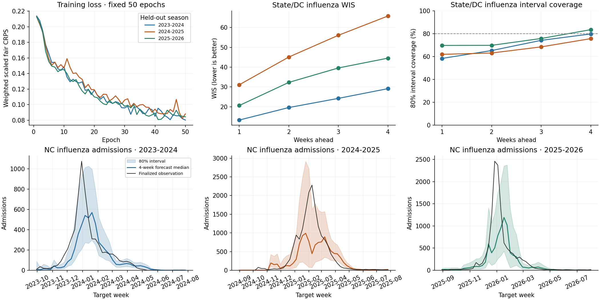

# Build B0: three-season cross-validation

Completed locally on the Apple M2 Max (32 GiB), using two CPU threads and
PyTorch 2.10.0. All three training/evaluation combinations finished in
**116.2 seconds**. Longleaf was unnecessary for this model;
[connection and rsync instructions](../development-longleaf.md) are documented.

## Results

Influenza admissions, 50 states + DC, pooled over four horizons and all eligible
weekly origins in each respiratory season. US national scores are separate in the
CSV. These are year-round season scores, not official FluSight challenge scores.

| Train seasons | Evaluate season | Origins | WIS | MAE | 80% coverage | 95% coverage | WIS / persistence* |
|---|---|---:|---:|---:|---:|---:|---:|
| 2024-2025 + 2025-2026 | 2023-2024 | 47 | 21.44 | 32.50 | 69.2% | 84.9% | 0.454 |
| 2023-2024 + 2025-2026 | 2024-2025 | 51 | 49.24 | 75.24 | 67.2% | 82.5% | 0.423 |
| 2023-2024 + 2024-2025 | 2025-2026 | 52 | 34.07 | 53.57 | 74.6% | 89.8% | 0.446 |

*Persistence is a **deterministic last-observed-value distribution**, a simple
sanity-check baseline, not a strong probabilistic forecasting comparator. Ratios
use only common valid tasks; 10 of 10,030 model-scored cells in season 2024–25 lack
a baseline anchor. The table's WIS/MAE/coverage use all available model labels.
The model's WIS beats this baseline in every fold. Its 80% and 95% intervals
under-cover in every fold. This is an uncalibrated pilot, not evidence of
competitiveness with GBQR, the FluSight ensemble, or other operational models.



NC is a fixed illustrative location, chosen without searching for a good or bad
example. Each plotted forecast was issued four weeks before its target date;
these are rolling marginal forecasts, not one full-season sampled trajectory.
The top panels summarize all states/DC. Inspect the saved forecasts for any
other location, channel, or horizon.

## Exact experiment

- Season 1: 2023–24 (available data September 2, 2023–July 27, 2024).
- Season 2: 2024–25 (August 3, 2024–July 26, 2025).
- Season 3: 2025–26 (August 2, 2025–August 1, 2026).
- Season grouping is CDC epiweek 31–30, including the 53-week calendar effect.
  The four available weeks of 2026–27 are excluded entirely from this experiment.
- Each sample moves forward **one week**, with an **8-week context** and targets
  **1, 2, 3, and 4 weeks after context end**. Whole location panels share an origin.
- The held-out season is removed from every training context, every training
  target, and scaler fitting. Its absent training-context weeks stay masked,
  rather than being filled from the held-out data. Training origins belong only
  to the two fit seasons. Evaluation may condition on all already observed past
  context, including earlier weeks within the evaluation season.
- Labels outside the evaluation season are masked. Origins with no evaluable
  future labels are omitted. Final origins can have fewer than four scored
  horizons; all four forecasts are still generated. Leading contexts can be
  padded/masked at the September 2023 data boundary or a training-season gap.
- Fixed B0 settings: width 64, 16-dimensional global latent, 22,785 parameters,
  50 epochs, batch size 8, Adam learning rate 0.001, eight training members,
  seed 42. Per-channel training-only Q95 scales and loss weights
  `[1,.1,.1,.1,.1,.1]` are unchanged. No held-out tuning or early stopping.
- 2,048 independent draws per evaluation origin; quantiles on the 23-level grid.
  Admission quantiles are rounded half-up; ED proportions remain continuous.
  WIS, median MAE, interval coverage/width, and persistence comparisons are saved
  separately for each channel, horizon, and geography group.
- 100 complete sample members per origin are retained alongside quantiles
  computed from all 2,048 draws. Member identity is preserved over all locations,
  channels and horizons within that origin. Identity does not link separate origins.

Only **train seasons 1+2 → evaluate season 3** is chronological. The other two
folds intentionally train on later seasons and are retrospective leave-one-season-out
experiments. All folds use finalized snapshots, so even the chronological fold is
not a reconstruction of real-time data availability. Season 1 had already been
used for the skeleton's smoke test. All three seasons have now been examined;
none should subsequently be called an untouched final test set. No new settings
were selected from these scores.

## Timing and artifacts

- Evaluate 2023-2024: 104 training windows; fit 17.2s, forecast/save/score 18.0s; loss 0.2139 → 0.0802.
- Evaluate 2024-2025: 99 training windows; fit 16.6s, forecast/save/score 21.7s; loss 0.2129 → 0.0882.
- Evaluate 2025-2026: 99 training windows; fit 16.9s, forecast/save/score 25.7s; loss 0.2128 → 0.0844.

Run directory: `data/experiments/b0_season_cv_20260913` (relative to the repository root).
It contains `manifest.json`, pooled `scores.csv`, and one `eval_SEASON/` folder
per fold with `model.pt`, `training.json`, `forecasts.npz`, and `scores.csv`.
The manifest records source/code hashes, exact origins, fitted scales, seeds,
configuration and elapsed time. Raw forecasts are saved before scoring.

```bash
PYTHONPATH=src .venv/bin/python -m tapestry.models.season_cv \
  --device cpu --epochs 50 --eval-members 2048 \
  --output data/experiments/b0_season_cv_repeat
PYTHONPATH=src .venv/bin/python experiments/b0/report_b0_cv.py \
  data/experiments/b0_season_cv_repeat
```

To inspect the chronological fold without resampling:

```python
import numpy as np
p = np.load('data/experiments/b0_season_cv_20260913/eval_2025-2026/forecasts.npz',
            allow_pickle=False)
print(p['quantiles'].shape)  # (23, 52, 4, 6, 52)
print(p['samples'].shape)    # (100, 52, 4, 6, 52)
# Quantile/member × origin × horizon × channel × location.
print(p['context_end'], p['target_dates'], p['locations'], p['channels'])
```

Checks cover held-out-data perturbation invariance for training inputs/labels/scales,
weekly stride, horizon/season mask boundaries, WIS against an independent pinball
calculation, fair CRPS, masking, and stochastic gradients. Saved outputs are also
checked for finite values, monotone quantiles, valid units, and fold label boundaries.
No calibration correction or model architecture change was made after evaluation.
