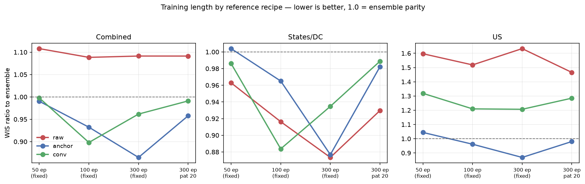
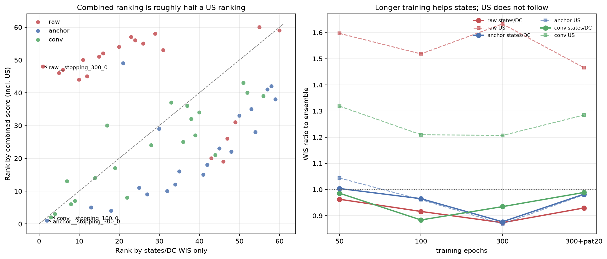
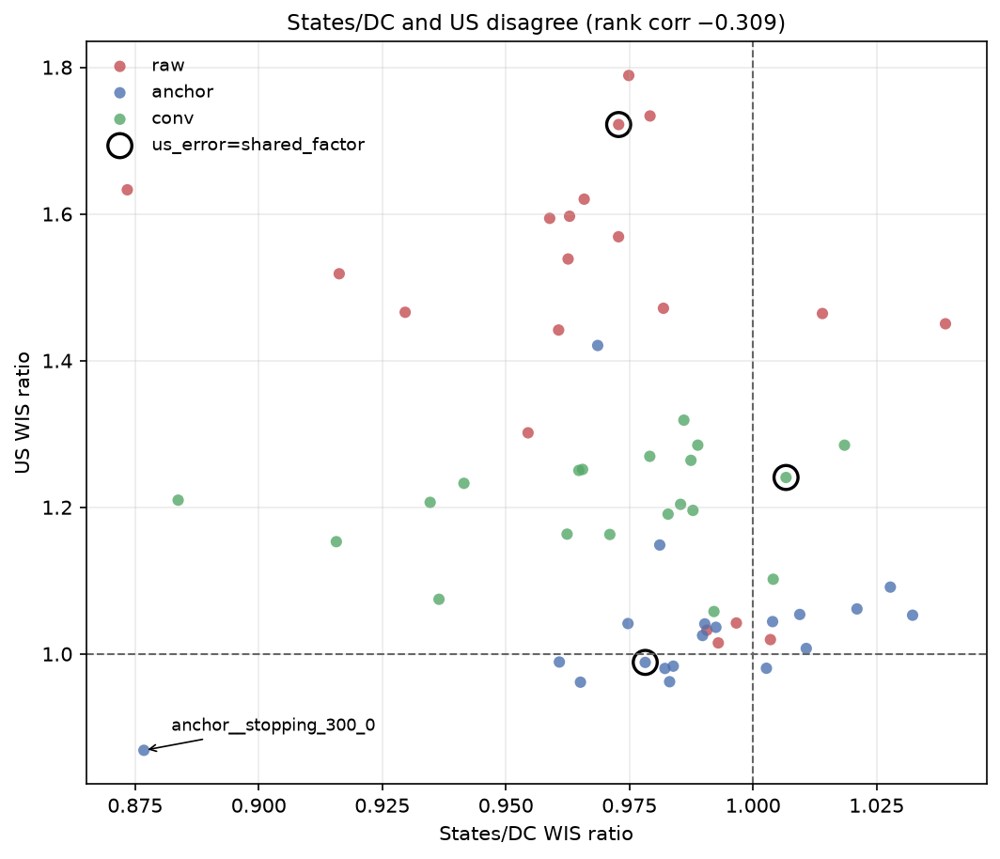

# B0 calibration: the `us-cross-2` rerun

**Experiment:** `b0-us-cross-2` · **Suite:** `crosses` · **Status:** complete —
60 configurations × 3 seeds = 180 season-CV runs, 540 season fits.
Fitted 2026-09-15 on the shared Longleaf GPU partitions (`a100-gpu`, `l40-gpu`,
`volta-gpu`), torch `2.9.1+cu126`, commit `cc13d5e` with `git_dirty=True`.

This is a full rerun of [the crosses calibration](b0-crosses.md), not an
extension of it. Everything was refitted under one environment so the new arms
and the original 51 configurations are directly comparable. It adds three things
the first experiment could not answer:

1. an **epoch ladder** (50 / 100 / 300 fixed epochs) that separates training
   length from the validation-split cost of early stopping;
2. a **correlated national error** variant (`us_error=shared_factor`);
3. a **states-only ranking**, reported beside the combined score rather than
   folded into it.

!!! danger "Headline: the first experiment ranked undertrained models"
    `anchor` was rank 27 of 51 at 50 epochs. At 300 epochs the same recipe
    scores **0.8647 and ranks 1 of 60** — better than every configuration in
    the original screen. The architecture conclusions in the crosses write-up
    were drawn at a training length that had not converged.

## What changed in the grammar

`us_error` was added as a scenario field (`us_none` / `us_shf`), which changes
every scenario string. The old 18-token strings do not parse under the new
grammar; this is why the experiment was rerun rather than extended. `grid()` and
the 4,097-configuration sweep were deleted — `AXES` is now the single registry of
levels that `crosses()` iterates, so adding or removing an option is a one-line
change.

## The environment moved the scores

Torch was pinned from `2.14.0+cu130` to `2.9.1+cu126` so that V100 (sm_70) nodes
could be used: CUDA 13 wheels dropped Volta, and L40/L40S (sm_89) run the sm_86
cubin by Ada binary compatibility. All five GPU classes on the cluster are now
reachable from one wheel.

Refitting the **identical 51 configurations** under the new build reproduces the
old ranking well but not exactly:

| | Value |
|---|---:|
| Configurations matched old ↔ new | 51 of 51 |
| Spearman rank correlation | **0.907** |
| Median \|Δ combined\| | 0.0024 |
| 90th percentile \|Δ combined\| | 0.0282 |
| Max \|Δ combined\| | **0.0781** |

Six reference configurations, same recipe, environment change only:

| Configuration | Old | New | Δ |
|---|---:|---:|---:|
| `conv__stopping_300_20` | 0.9511 | 0.9910 | **+0.0399** |
| `conv` | 0.9765 | 0.9978 | +0.0213 |
| `anchor` | 0.9888 | 0.9902 | +0.0014 |
| `raw` | 1.1072 | 1.1080 | +0.0008 |
| `anchor__stopping_300_20` | 0.9651 | 0.9577 | −0.0074 |
| `raw__stopping_300_20` | 1.0990 | 1.0913 | −0.0077 |

**This bound matters for reading everything below.** A change smaller than about
0.03 cannot be attributed to a treatment: the environment alone moved one
configuration by 0.04, and the median seed SD is 0.0323.

## Training length



All arms hold `patience=0`, so the only thing varying across the first three
points is training length — no validation split, no checkpoint selection.

| Configuration | Combined | States/DC | US |
|---|---:|---:|---:|
| `anchor` (50 ep) | 0.9902 | 1.0040 | 1.0441 |
| `anchor__stopping_100_0` | 0.9323 | 0.9651 | 0.9615 |
| **`anchor__stopping_300_0`** | **0.8647** | **0.8768** | **0.8686** |
| `anchor__stopping_300_20` | 0.9577 | 0.9822 | 0.9802 |
| `conv` (50 ep) | 0.9978 | 0.9860 | 1.3188 |
| `conv__stopping_100_0` | 0.8981 | 0.8837 | 1.2097 |
| `conv__stopping_300_0` | 0.9616 | 0.9347 | 1.2067 |
| `conv__stopping_300_20` | 0.9910 | 0.9888 | 1.2847 |
| `raw` (50 ep) | 1.1080 | 0.9629 | 1.5969 |
| `raw__stopping_100_0` | 1.0884 | 0.9163 | 1.5185 |
| `raw__stopping_300_0` | 1.0913 | **0.8734** | 1.6329 |
| `raw__stopping_300_20` | 1.0913 | 0.9296 | 1.4659 |

**The effect is real but reference-specific, and "more epochs is better" is false
as a general statement.**

- **`anchor` improves monotonically** — 0.9902 → 0.9323 → 0.8647, a total gain of
  0.1255, four times the environment bound. This is the one unambiguous result.
- **`conv` peaks at 100 epochs** and then regresses — on the combined score
  (0.8981 → 0.9616) *and* on states/DC (0.8837 → 0.9347). The regression is
  above the environment bound but the seed SDs are large (0.0400 and 0.0519), so
  read it as "conv does not benefit past 100 epochs" rather than as a measured
  penalty for training longer.
- **`raw` does not improve on the combined score at all** (1.1080 → 1.0913) —
  but its states/DC score improves substantially, 0.9629 → **0.8734**, the best
  states/DC score in the experiment. The combined score hides this because US
  moves the other way.

`raw`'s US ratio is **not** monotone in training length: 1.5969 (50 ep) → 1.5185
(100) → **1.6329** (300) → 1.4659 (300 + patience 20). The worst US score comes
from the longest fixed-epoch arm and the best from the early-stopping arm, so
"longer training hurts the US" is not supported either; on `anchor` the US ratio
improves monotonically to 0.8686. Training length and US skill are not related in
a consistent direction across references.

The followup proposal predicted longer training would help the *small* models
most and narrow `raw`'s deficit. **That prediction was wrong on the combined
score** — `raw`'s combined deficit did not narrow. It was right about `raw`'s
states/DC behaviour, which the combined score obscures.

### Early stopping is not the mechanism

At an equal 300-epoch cap, `pat20` is worse than `pat0` on every reference:
anchor 0.9577 vs 0.8647, conv 0.9910 vs 0.9616, raw 1.0913 vs 1.0913. The
early-stopping arm in the first experiment was buying **epochs**, not
regularisation, and the ~20% of training episodes it spends on a validation split
is a net cost. The confounding flagged in the followup proposal resolves cleanly
in favour of "just train longer".

## Correlated national error: a null result

`us_error=shared_factor` adds a per-episode, per-member, per-channel common mode
to every location's residual before the anchor, scaled by a learned parameter
initialised at `softplus(-8) ≈ 0.000335` so it starts as a no-op.

**It never trained.** Reading `national_scale` from all 27 saved checkpoints:

| Configuration | Learned `softplus(national_scale)` | Ratio to init |
|---|---|---:|
| `anchor__us_error_shf` | 0.000336 | **1.0×** |
| `conv__us_error_shf` | 0.000338 | 1.1× |
| `raw__us_error_shf` | 0.000336 | 1.1× |

The gradient was verified non-zero before launch, so the parameter was reachable
by the optimizer — it simply was not recruited. **The `us_shf` arms are therefore
the reference model plus a different RNG draw, and any score difference between
them and their reference is seed noise, not a treatment effect.**

Read that way, the numbers are consistent with a no-op: US dispersion moves
0.984 → 0.927 on `anchor` (*narrower*, the opposite of the design intent),
0.912 → 0.916 on `conv`, 0.474 → 0.512 on `raw`.

!!! note "What would need to change"
    A zero-initialised scale under this loss has no gradient pressure to grow:
    widening intervals costs WIS dispersion immediately and only pays off on the
    rare correlated-shock episode. Testing the mechanism properly needs either a
    non-trivial initialisation (start the scale at a meaningful width and let
    training shrink it) or a loss term that rewards calibration directly. The
    architecture is in place; the training signal is not.

## Ranking on states/DC alone

US is one location in 52 but carries **44.9–49.7% of all admissions WIS** in this
rerun (flu 49.7%, RSV 47.4%, COVID 44.9%). The combined score sums WIS without
reweighting by location, so for admissions the headline ranking is close to half
a national ranking. The two orderings disagree — **rank correlation −0.309**,
replicating the −0.324 seen in the first experiment.



### Top 12 by states/DC WIS only

| States rank | Configuration | States/DC | Combined | Combined rank | US |
|---:|---|---:|---:|---:|---:|
| 1 | `raw__stopping_300_0` | **0.8734** | 1.0913 | 48 | 1.6329 |
| 2 | `anchor__stopping_300_0` | 0.8768 | **0.8647** | **1** | **0.8686** |
| 3 | `conv__stopping_100_0` | 0.8837 | 0.8981 | 2 | 1.2097 |
| 4 | `conv__lookback_8` | 0.9157 | 0.9102 | 3 | 1.1531 |
| 5 | `raw__stopping_100_0` | 0.9163 | 1.0884 | 46 | 1.5185 |
| 6 | `raw__stopping_300_20` | 0.9296 | 1.0913 | 47 | 1.4659 |
| 7 | `conv__stopping_300_0` | 0.9347 | 0.9616 | 13 | 1.2067 |
| 8 | `conv__count_transform_raw` | 0.9365 | 0.9496 | 6 | 1.0745 |
| 9 | `conv__count_transform_sqrt` | 0.9415 | 0.9528 | 7 | 1.2326 |
| 10 | `raw__encoder_conv` | 0.9545 | 1.0607 | 44 | 1.3015 |
| 11 | `raw__heads_su` | 0.9589 | 1.1038 | 50 | 1.5940 |
| 12 | `raw__lookback_12` | 0.9607 | 1.0783 | 45 | 1.4417 |

`raw__stopping_300_0` is the clearest demonstration of the problem: **best
states/DC score in the experiment, 48th on the combined score**, because its US
ratio is 1.63. Five of the states-only top ten are `raw` variants that the
combined score ranks 44th or worse.

`anchor__stopping_300_0` is the only configuration in the top two of *both*
orderings. It is good everywhere rather than good at the US, which is why it
should be preferred over `raw__stopping_300_0` despite the near-tie on states.

### US reported separately

| | Value |
|---|---:|
| Beat the ensemble, combined | 37 of 60 |
| Beat the ensemble, **states/DC** | **47 of 60** |
| Beat the ensemble, **US** | **8 of 60** |

Best US configurations by `US_combined_mean`: `anchor__stopping_300_0` (0.8686),
`anchor__stopping_100_0` (0.9615), `anchor__count_transform_log1p` (0.9621),
`anchor__stopping_300_20` (0.9802), `anchor__count_transform_rate` (0.9804).
**All eight best US configurations are `anchor` variants.** The `conv` family —
which supplies the best states/DC scores — does not place a single configuration
in the US top eight.

!!! note "This ordering depends on the aggregation"
    These are `US_combined_mean` values: season-equal, admissions weighted twice
    ED, matching the §10.3 selection score and the tables above. Ranking US
    instead by *pooled* total-WIS ratio reorders the leaders and puts
    `conv__lookback_8` and `conv__spatial_none` in the top three. The two
    aggregations answer different questions; this page uses the former
    throughout for consistency with [the crosses page](b0-crosses.md).



US 50% coverage remains short of nominal (0.416–0.435 on `anchor` variants
against the ensemble's 0.588), so the calibration defect described in the first
experiment is unchanged. The `us_error` intervention did not address it, for the
reason given above.

### Recommendation

Rank on **states/DC WIS** for architecture selection, and report US as a separate
diagnostic. The combined score conflates a 51-location average with a single
high-magnitude location, and the two disagree systematically. Note that this is a
change of reporting convention, not of the §10.3 score definition — the numbers
in the tables above are the same per-geography quantities `rank` already
computes.

## Limitations

- **Three seeds.** Median seed SD is 0.0323 and the states-only top-10 range is
  0.0811, so the leading group is not separated. `anchor__stopping_300_0` leads
  by 0.0334 on the combined score, about one seed SD.
- **The environment moved scores** by up to 0.0781 on identical configurations.
  Effects smaller than ~0.03 are not attributable.
- **`us_error=shared_factor` is untested, not refuted.** The parameter never
  trained, so the experiment says nothing about whether a correlated national
  error term would help if it were actually fitted.
- **Exploratory, not validation.** All three seasons inform development and
  selection uses the folds that score it.
- **One-factor screen.** Interactions were out of scope; `AXES` levels are
  crossed against three references, not against each other.
- **Provenance:** all 180 runs at commit `cc13d5e` with `git_dirty=True`. Per
  architecture policy, dirty commits are acceptable during exploration only.
- The test suite was **not run** against the grammar change.

## Reproducing

```bash
.venv/bin/python -m tapestry.models.manager status -e b0-us-cross-2
```

```bash
.venv/bin/python -m tapestry.models.manager rank -e b0-us-cross-2
```

`rank` regenerates `ranking-cd1da26254c4/`. Because `config_id` is the scenario
string and the grammar gained a field, runs from `b0-crosses` and
`b0-us-cross-2` cannot be pooled in a single `totals.rank` call; the old↔new
comparison above was made by stripping the `us_none` token and joining.
