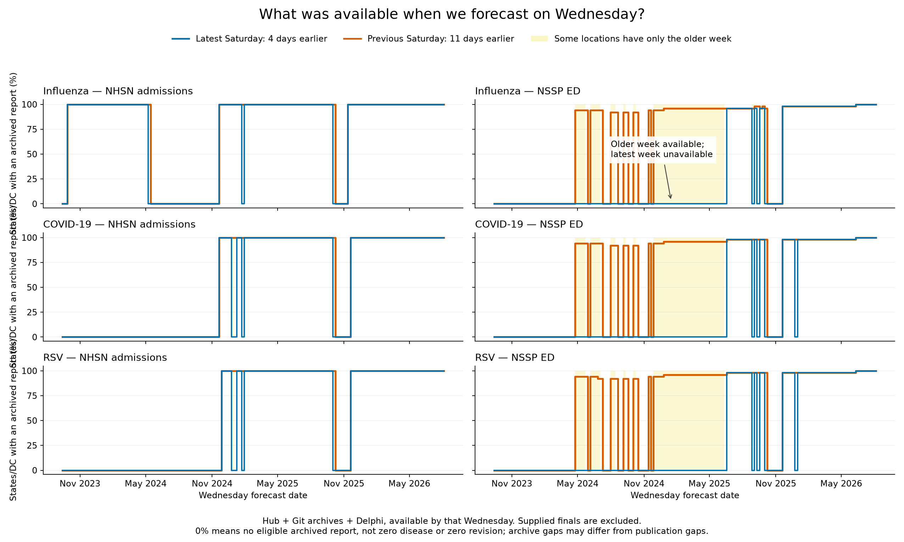
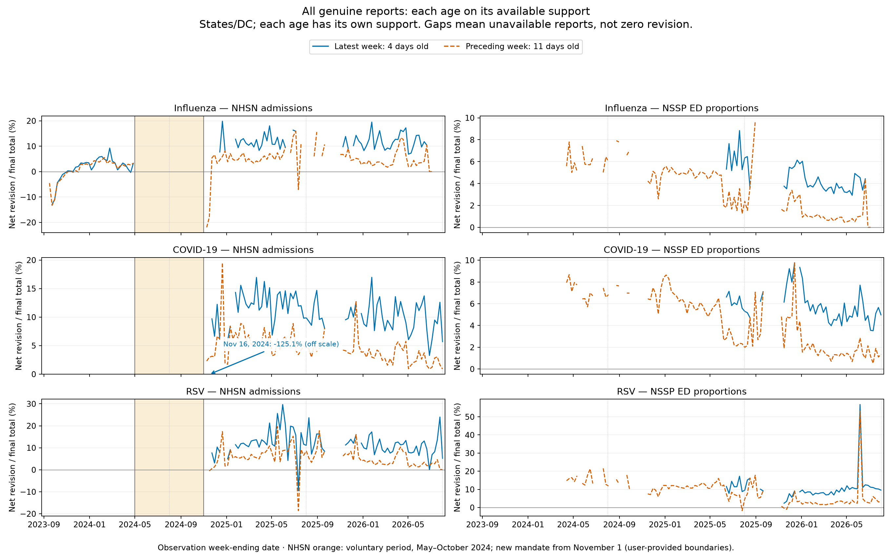
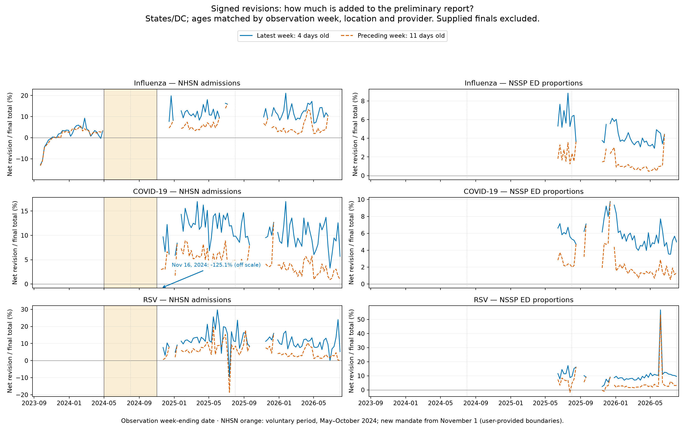
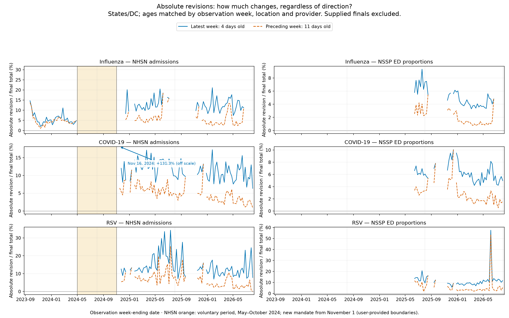
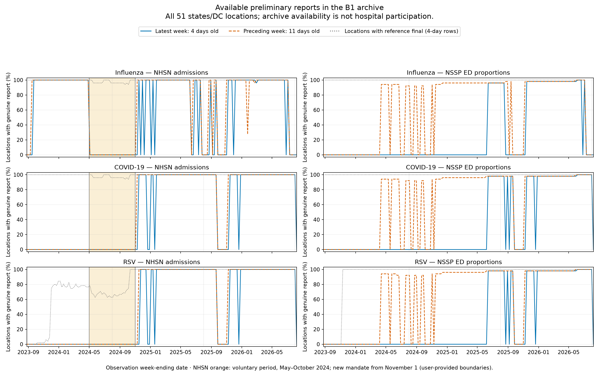

# Revisions across NHSN reporting regimes and seasons

For the calendar explanation and modeling implications, start with
[data exploration: what is available when we forecast?](../../data/reporting-availability.md).

The latest two weeks have different reporting maturity: at Wednesday issuance,
the latest completed week is **4 days old**, and the preceding week is **11 days
old**. These graphs compare their genuine preliminary reports with the pinned
reference finals, separately for NHSN admissions and NSSP ED proportions.

The NHSN periods supplied by the user are **before May 1, 2024** (previous
regime), **May 1–October 31, 2024** (voluntary reporting), and **November 1, 2024
onward** (new mandate). The orange band marks the voluntary period on NHSN
panels only. These dates are user-provided context, not independently verified
policy findings from this analysis. Periods are assigned by observation
week-ending date; boundary weeks can span regimes. Dotted August lines are
calendar guides for successive seasons, not policy changes.

## Availability at the Wednesday forecast cutoff



Both lines are solid: **blue is the latest Saturday (4 days earlier)** and
**orange is the previous Saturday (11 days earlier)**. The x-axis is the
Wednesday forecast date, so the two lines describe what was available at the
same forecast cutoff. Yellow highlights dates where at least one location has
an older-week report but no newest-week report.

This uses the provider audit's eligible Hub, Git and Delphi vintages before B1
source precedence. The denominator is 51 states/DC, with no requirement that a
reference-final label exists. Supplied-final fallbacks do not count as reports.
Dates lacking either age in the audit, including the first calendar boundary,
are omitted rather than counted as missing reports. Solid steps extend a weekly
status to the next Wednesday for display; they do not determine the release day
within that interval. A zero means archive unavailability, not proven absence
of publication. These definitions differ from the label-conditioned coverage
chart below.

Reproduce: `.venv/bin/python scripts/plot_b1_availability.py`.
[Wednesday counts](wednesday-availability.csv) ·
[Availability provenance](wednesday-availability-manifest.json).

## NSSP has revisions even where one recent age is unavailable

**An empty curve is missing support, not zero revision.** In 2024–25, each NSSP
target has 43 weeks of genuine 11-day-old reports but only seven weeks of genuine
4-day-old reports. Delphi supplies all 43 older-week flu reports and 35 of the
43 older-week COVID/RSV reports; Hub supplies the other eight. Older-week net
revisions over each target's full available support are 4.96% for flu, 6.48% for
COVID and 10.83% for RSV. Delphi also supplies the seven newest-week flu reports.
These counts come from the original source-stratified B1 revision audit.
The provider-availability audit independently finds Delphi vintages for all three
ED targets at 11 days across 43 weeks, but at four days only for June 14–July 26,
2025 (seven weeks within 2024–25). This is availability by the Wednesday cutoff
in the current archive, not proof that the underlying values never revised.

This view retains **each age's own available reports**. It exposes older-week
revision history that the matched-age comparison below necessarily omits. Its
curves are descriptive; differing support prevents an isolated age-effect claim.



The extreme COVID point is marked with the same off-scale arrow as below.
[All-report weekly values](weekly-all-reports.csv).

## Revision direction and size

Positive net revisions mean that the preliminary reports undercount the pinned
finals. Negative values mean reports were revised downward. The two ages use
**the same observation weeks, locations and selected providers** within each
comparison. Missing vintage support stays missing; supplied-final fallbacks do
not count as reports with zero revision.

The November 16, 2024 newest-week COVID admission point is shown with an
**off-scale arrow** (net −125.1%; absolute 131.3%) to keep the remaining curves
readable. It is omitted only from the plotted lines and axis scaling, and remains
in all data tables and summary statistics.



Absolute revisions reveal changes that net upward/downward revisions can cancel.



## Coverage is essential to interpretation



Coverage is the number of states/DC locations with both a genuine archived
preliminary report and a reference final, divided by 51. It is **B1 archive
availability**, not the fraction of hospitals reporting to NHSN or NSSP. The
dotted reference-final line shows how many locations have labels. Gaps can
reflect missing archives, selection rules or missing labels as well as source
reporting; these graphs cannot attribute those causes individually. US results
are kept separate in the downloadable tables.

## What the matched data show

The model is intended for **next-season forecasting**. The user specified that
**the NHSN nowcasting task should represent the regime from November 2024 onward**.
This assumes that regime remains relevant next season; it does not mean initial
reports in that period are already final.
Within that regime, substantial revision remains at both recent ages.

| Source / target | Season | Matched weeks | Net revision, 4 days | Net revision, 11 days |
|---|---|---:|---:|---:|
| NHSN flu admissions | 2023–24, previous regime | 32 | 3.25% | 2.87% |
| NHSN flu admissions | 2024–25, new mandate | 29 | 11.01% | 5.42% |
| NHSN flu admissions | 2025–26, new mandate | 35 | 11.15% | 3.84% |
| NHSN COVID admissions | 2024–25, new mandate | 34 | 7.48% | 5.76% |
| NHSN COVID admissions | 2025–26, new mandate | 45 | 10.35% | 4.06% |
| NHSN RSV admissions | 2024–25, new mandate | 33 | 10.30% | 5.50% |
| NHSN RSV admissions | 2025–26, new mandate | 45 | 10.94% | 4.31% |
| NSSP flu ED | 2024–25 | 7 | 6.33% | 2.27% |
| NSSP flu ED | 2025–26 | 35 | 4.61% | 1.45% |
| NSSP COVID ED | 2024–25 | 7 | 6.21% | 2.58% |
| NSSP COVID ED | 2025–26 | 43 | 6.23% | 3.06% |
| NSSP RSV ED | 2024–25 | 7 | 11.67% | 5.64% |
| NSSP RSV ED | 2025–26 | 43 | 8.72% | 3.03% |

**NHSN flu shows a marked difference between the previous and current regimes.**
The two later seasons have similar newest-week net revisions, while the older
week is substantially more mature. This supports separating reporting regimes
and report ages rather than treating every season as an interchangeable example.

There are **no genuine recent NHSN reports in the current B1 inputs for
May–October 2024**, at either age. There are also no genuine COVID/RSV admission
reports before May 2024 in this dataset. These absences are not zero revisions
and do not prove that no hospitals reported. Supplied-final inputs from these
periods do not provide genuine visible-report revision supervision.

NSSP retains revisions too, with a smaller older-week correction. Only **seven
weeks** have matched ages per target in 2024–25, versus 35–43 in 2025–26. These
unequal seasonal windows prevent interpreting their aggregate difference as a
clean reporting-regime effect. NHSN mandates are not assigned to NSSP.

## What this means for nowcasting

Training a revision model across different reporting processes requires it to
learn a correction that transfers between regimes. The B1 leave-one-season-out
splits do not guarantee that: a season can span policy regimes, and an older
season may have little genuine revision supervision for a particular target.
Hiding finalized values teaches reconstruction, not correction of a biased but
visible preliminary report.

For the intended next-season use, post-November-2024 NHSN revision performance
is the relevant evidence. Earlier-regime performance is a transfer diagnostic,
not the deciding measure of whether nowcasting is worthwhile. Older epidemic
history may still help forecast training; that is a separate choice from which
examples teach recent-report corrections.

This makes reporting-regime transfer a plausible explanation to investigate for
weak nowcasts. It does **not** demonstrate that regime mixing caused the model
failures, or that nowcasting is unhelpful. A useful next comparison would evaluate
on identical post-November-2024 report cells while changing only which training
revision examples are allowed. Forecast training and scoring support should stay
fixed; provider, reporting age and season should be reported separately. No such
model comparison is run by this descriptive analysis.

## Proposed training and validation response

Separate fitting is a useful next experiment, not an established improvement:

1. Fit the forecaster using the longer epidemic history, while keeping its recent
   input representation consistent with intended deployment. Retain direct B
   as the comparator; finalized recent histories alone do not reproduce live inputs.
2. Fit a separate recent-report model using genuine revision examples appropriate
   to each source and report age. For NHSN, the intended regime begins November
   2024; NSSP eligibility follows its own vintage availability, not that mandate.
   An unavailable newest report is reconstruction, not visible-report correction.
3. Prefer a chronological test: fit on information available before 2025–26,
   then evaluate through 2025–26, with optional expanding-window updates. Any
   update uses only revisions/labels available at that historical fit date;
   retrospective final labels may be used later for scoring. Blocks must prevent
   the same target weeks leaking through adjacent overlapping episodes. There
   remains only one complete later season here, not many independent replications.
4. First compare separate forecast and nowcast outputs. If nowcasts are then fed
   into forecasting, generate training inputs out of fold or chronologically,
   propagate uncertainty, and evaluate the entire pipeline against direct B on
   identical issuance/target cells. Separate training does not by itself repair
   the two-stage results or establish a forecast benefit.

These are proposed experiments; no fitting or model scoring has been launched.

## Definitions, assumptions and reproducibility

- Net revision: `100 × sum(final − report) / sum(final)`.
- Absolute revision: `100 × sum(abs(final − report)) / sum(final)`.
- States/DC are pooled within target and week. For admissions, this weights by
  count mass. For ED, this sums equally weighted location proportions; it is
  not a national visit-weighted revision rate. Neither is the forecast WIS score.
- Both ages require a genuine report from the same selected provider for the
  same observation/location. This avoids changing support between the two age
  curves, but selects a subset of all reports. Age-specific unpaired coverage is
  shown separately; `paired_reports` in the coverage CSV records the subset size.
- Seasonal/regime summaries pool that matched subset within each period. They
  do not match weeks, epidemic intensity or locations across different seasons.
  Source-stratified summaries are included to expose changes in provider mix.
- Zero final cells remain in sums; a zero aggregate denominator produces no
  percentage. No smoothing, interpolation, independent-cell uncertainty estimate
  or causal claim is applied.
- Reference finals are pinned to September 16, 2026 and may still revise. “Final”
  does not mean that initial reports after November 2024 are revision-free.
- The full B1 calendar is used, not just Hub forecast-scored cells. This analysis
  neither trains models nor scores model predictions. Graphs were generated
  without visual inspection, following repository instructions.

Reproduce with:

```bash
.venv/bin/python scripts/plot_b1_reporting_regimes.py
```

[Weekly paired revisions](weekly-paired.csv) ·
[Regime/season summaries](regime-season-summary.csv) ·
[Provider summaries](source-summary.csv) · [Coverage](coverage.csv) ·
[Dataset hash and assumptions](manifest.json).

See also the [B1 overview](../b1-conclusions.md) and the
[revision experiment](../b1-overnight/index.md#revision-experiment-separating-forecasting-nowcasting-and-reconstruction).

## Log

- 2026-09-18: recorded the user's NHSN reporting-regime context in `icare.md`;
  generated matched-age revision curves and separate archive-coverage curves
  for all three pathogens in NHSN and NSSP. Regime transfer remains a hypothesis.

- 2026-09-18: replaced the extreme November 16 COVID point with a labelled off-scale arrow in both revision graphs; underlying statistics are unchanged.

- 2026-09-18: added an all-report view after the paired-age graph concealed available 11-day NSSP revisions. Missing 4-day vintages do not imply no older-week revision.

- 2026-09-18: added solid-line availability on Wednesday issuance dates, highlighting locations with an older-week report but no newest-week report.
