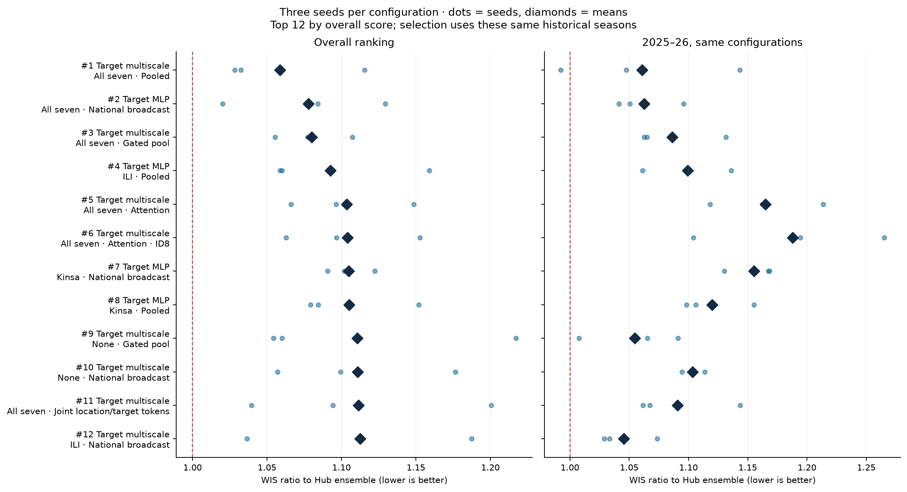
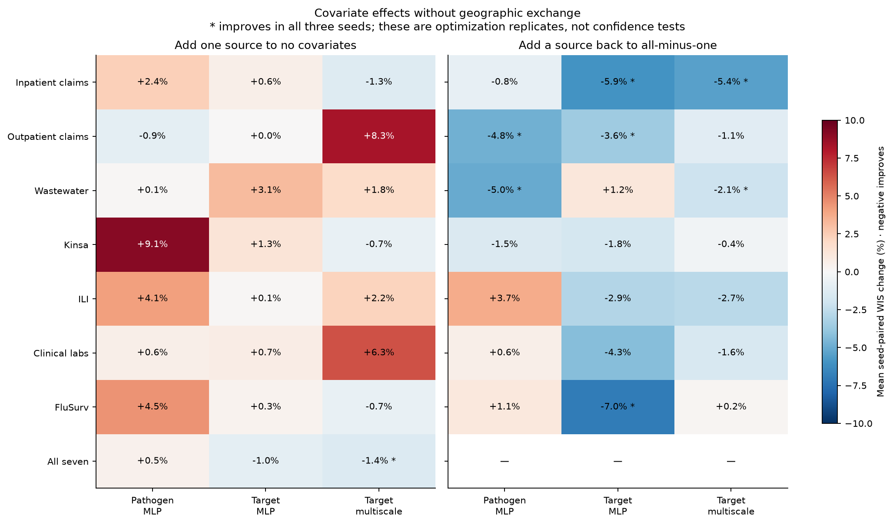
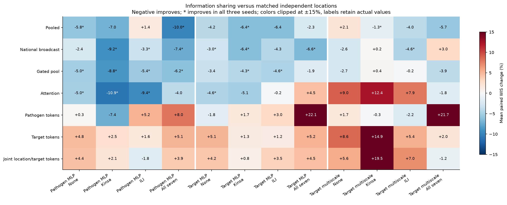
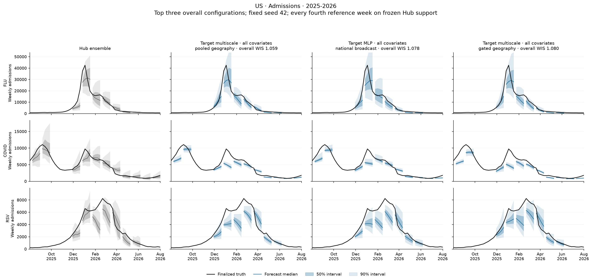
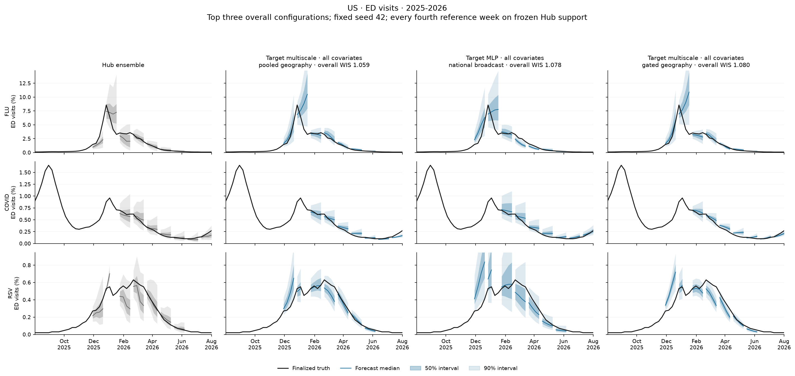
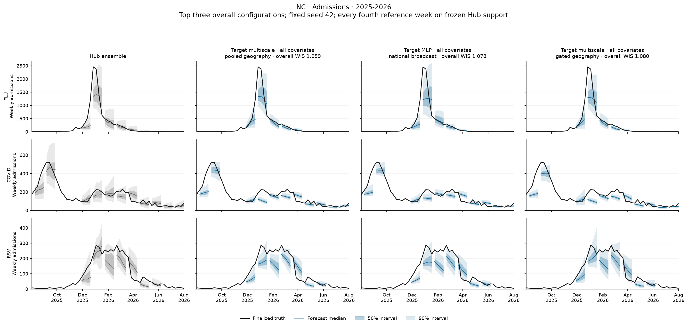
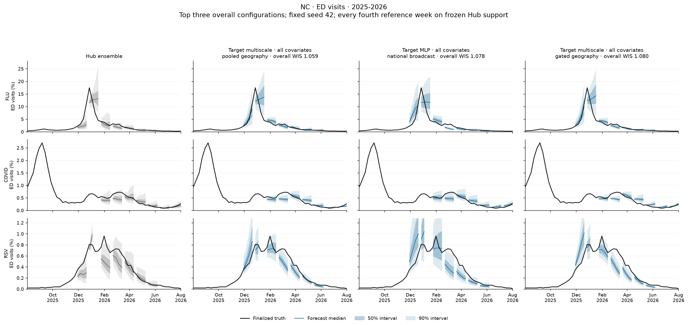
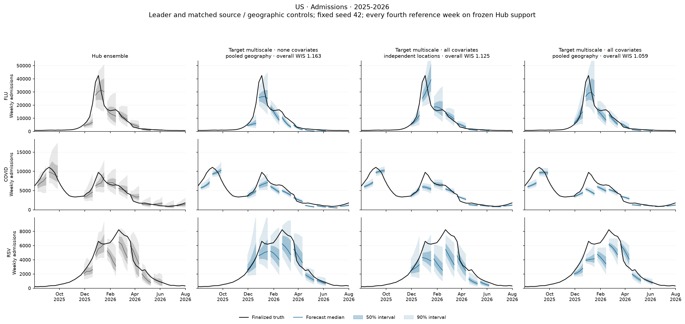

# Covariates help with simple geographic pooling; complex target attention does not

**Complete: 468/468 runs, 156 configurations, three seeds and 1,404 held-out-season folds.** Every forecast evaluation used **256 draws**. This is the completed `b2-direct-research-v1` study; no new models were fitted for this report.

The best overall configuration is **six separately fitted target models, a multiscale temporal encoder, all seven covariate groups, and simple geographic pooling**. Its WIS ratio is **1.059 ± 0.049** across seeds, where **1 is the Hub ensemble and lower is better**. It improves on its matching pooled no-covariate control by **9.0% in the mean seed-paired comparison**, with all three seeds improving. **None of the 156 configuration means beats the Hub ensemble overall or on the 2025–26 combined score.**

Three findings should guide the next decision:

- **Keep simple messages in the leading candidate set.** Pooling, national broadcasts and gated pooling usually improve their matched independent-location controls. Same-target token attention improves none of the 12 backbone/source means; joint location/target tokens improve only two.
- **Covariate value depends on the model and the other sources.** Neither Kinsa-only nor ILI-only is a reliable general replacement for the full bundle. Some specific matched comparisons favor them, and source removal shows complementarity. The experiment does not isolate each source inside the winning pooled model.
- **The overall gain is concentrated in 2024–25, and intervals remain too narrow.** For the leader, adding covariates changes 2025–26 from 1.064 to 1.061, improving only one seed. Weighted nominal 95% coverage is **79.3%**, compared with **90.7%** for the Hub ensemble.

The forecasting inputs use the explicitly authorized **2025–26 reporting-regime hypothesis**: available historical vintages first, otherwise lag-gated finalized substitutes when an archive is missing. This matters especially for Kinsa, wastewater and FluSurv. These are exploratory development results under that assumption, not a fully historical real-time backtest or a prospective confirmation.

## Leading models

| Rank | Backbone | Covariates | Exchange | WIS ± seed SD | States/DC | US |
| --- | --- | --- | --- | --- | --- | --- |
| 1 | Target multiscale | All seven | Pooled | 1.059 ± 0.049 | 1.072 | 1.005 |
| 2 | Target MLP | All seven | National broadcast | 1.078 ± 0.055 | 1.076 | 1.087 |
| 3 | Target multiscale | All seven | Gated pool | 1.080 ± 0.026 | 1.084 | 1.063 |
| 4 | Target MLP | ILI | Pooled | 1.093 ± 0.057 | 1.090 | 1.103 |
| 5 | Target multiscale | All seven | Attention | 1.104 ± 0.042 | 1.104 | 1.100 |
| 6 | Target multiscale | All seven | Attention + ID8 | 1.104 ± 0.045 | 1.100 | 1.120 |
| 7 | Target MLP | Kinsa | National broadcast | 1.105 ± 0.016 | 1.092 | 1.156 |
| 8 | Target MLP | Kinsa | Pooled | 1.105 ± 0.041 | 1.098 | 1.132 |
| 9 | Target multiscale | None | Gated pool | 1.111 ± 0.092 | 1.100 | 1.151 |
| 10 | Target multiscale | None | National broadcast | 1.111 ± 0.061 | 1.101 | 1.151 |

ID8 denotes an eight-dimensional learned location embedding. Scores average target-weighted season scores, with 80% states/DC and 20% native US weight. The displayed SD describes the three fitting seeds, not uncertainty across future seasons. Means of paired percentage changes below are **not** ratios of the displayed means. All configurations have all three seeds; no partial run enters this report.



The leader's individual overall seed scores are **1.032, 1.115 and 1.028** (42, 43, 44). The first and third ranked models differ by only 0.021 in their means. Selection among 156 configurations on reused historical seasons makes small rank differences weak evidence of general superiority. [All configurations and their exact scenario strings](leaderboard.csv).

## What covariates help?

### One source at a time, holding geography independent

The table shows mean seed-paired percentage WIS changes relative to the same backbone with no external covariates. Negative improves.

| Source added | Pathogen MLP | Target MLP | Target multiscale |
| --- | --- | --- | --- |
| Inpatient claims | +2.4% | +0.6% | -1.3% |
| Outpatient claims | -0.9% | +0.0% | +8.3% |
| Wastewater | +0.1% | +3.1% | +1.8% |
| Kinsa | +9.1% | +1.3% | -0.7% |
| ILI | +4.1% | +0.1% | +2.2% |
| Clinical labs | +0.6% | +0.7% | +6.3% |
| FluSurv | +4.5% | +0.3% | -0.7% |
| All seven | +0.5% | -1.0% | -1.4% |

No singleton improves all three independent-location backbones. Adding the complete bundle improves the target multiscale mean in all three seeds, but has little average benefit for the target MLP and slightly worsens the pathogen MLP. **Source relationships and the way information is shared matter more than declaring one universally useful predictor.**



### Removing a source from the full bundle

These contrasts also use **independent locations**. Adding a removed source back into the otherwise full bundle gives:

- Inpatient claims: **−5.9%** for target MLP and **−5.4%** for target multiscale, both improving all three seeds.
- Outpatient claims: **−4.8%** for pathogen MLP and **−3.6%** for target MLP, both improving all seeds.
- Wastewater: **−5.0%** for pathogen MLP and **−2.1%** for target multiscale, both improving all seeds; the target MLP mean instead worsens.
- FluSurv: **−7.0%** for target MLP in all seeds, but no consistent benefit in the other backbones.

These results suggest complementarity, not a source ranking independent of architecture. Kinsa's conditional mean is mildly favorable in all three backbones but improves only **2/3, 2/3 and 1/3** seeds, respectively. Its contribution is therefore uncertain. Source effects include the change in model input features/parameters; there is no parameter-count-matched noise-source control.

### Kinsa-only and ILI-only with geographic exchange

The clearest favorable Kinsa-only contrast is **target MLP with national broadcasting**: adding Kinsa improves **2.4%**, in all three seeds, to WIS **1.105**. Kinsa is already broadcast from its national series to every location before the model; this result is not obtained by restricting Kinsa to the US output.

For **target MLP with pooled geography**, adding ILI alone improves **2.3%**, in all seeds, to WIS **1.093**. In this same architecture, all covariates score **1.126** and do not improve the pooled no-covariate mean. Thus “more sources” is not automatically better. Both promising single-source results remain above the Hub ensemble overall and are selected comparisons within a broad screen.

[Every singleton comparison](singleton-summary.csv) · [Conditional source comparisons](conditional-summary.csv) · [All paired seed effects](paired_seed_scores.csv).

## Passing information across locations and targets

Each method is compared against independent locations with the same backbone, source bundle and zero location-ID embedding. There are **12 comparisons per method** (three backbones × none/Kinsa/ILI/all covariates).

| Method | Improved mean / 12 | Improved all 3 seeds / 12 | Median paired change |
| --- | --- | --- | --- |
| Pooled | 10/12 | 4/12 | -4.9% |
| National broadcast | 10/12 | 7/12 | -3.8% |
| Gated pool | 11/12 | 6/12 | -4.1% |
| Attention | 8/12 | 4/12 | -2.9% |
| Pathogen tokens | 4/12 | 0/12 | +1.7% |
| Target tokens | 0/12 | 0/12 | +4.9% |
| Joint location/target tokens | 2/12 | 0/12 | +4.0% |



Simple pooling shares the observed-state mean and the native US context; national broadcasting shares the US context; gated pooling learns how strongly each recipient uses pooled and national messages. **Gated pooling is the most consistent by the count of improved means (11/12); plain pooling produces the best overall configuration.** Full location attention is mixed, especially in the multiscale models.

The failure of scoped target-token methods is specific to these implementations and settings. Every model already sees all six local target histories, and the scoped tokens also carry selected covariates. Separate target fits do not imply absence of cross-target inputs. The study does **not** show that all cross-pathogen information is useless, nor does it compare adjacent-state graphs, geographic distance or a jointly optimized multi-model ensemble.

Adding an eight-dimensional location-ID embedding **worsens every independent-location mean (12/12)**. With location attention it improves 6/12 means, including a large recovery for multiscale/no-covariates, but is not a dependable default. Existing population and native-US features are retained in both embedding conditions. [Detailed spatial counts](spatial-summary.csv) · [Embedding comparisons](embedding.png).

## Where the leader improves—and where it does not

This is the clean covariate contrast for the best configuration: **target multiscale with pooled geography, all covariates versus none**.

| Season | No covariates, pooled | All covariates, pooled | Paired change | Seeds improved |
| --- | --- | --- | --- | --- |
| 2023-2024 | 1.032 | 1.006 | -1.0% | 1/3 |
| 2024-2025 | 1.394 | 1.109 | -20.2% | 3/3 |
| 2025-2026 | 1.064 | 1.061 | -0.4% | 1/3 |
| all | 1.163 | 1.059 | -9.0% | 3/3 |

The overall advantage is mainly the **20.2% paired reduction in 2024–25**. There is no consistent recent-season gain: the 2025–26 difference is only **−0.4%**, with **one of three seeds improving**. The best 2025–26-only configuration has a mean of **1.008**, but ranks 146th overall; this season-specific selection is not a replacement recommendation.

Adding pooling to the all-covariate multiscale model is a separate contrast: **1.125 → 1.059**, mean paired improvement **5.7%**, two seeds improving. It improves 2025–26 by 2.8% in the paired mean, also two seeds. Do not add these percentages as independent causal contributions.

### Outcomes and interval coverage

| 2025–26 outcome | WIS ratio | Model 95% coverage | Hub 95% coverage |
| --- | --- | --- | --- |
| covid hosp | 1.119 | 69.3% | 94.2% |
| covid prop ed visits | 1.170 | 70.8% | 94.7% |
| flu hosp | 0.923 | 76.0% | 89.8% |
| flu prop ed visits | 0.941 | 78.3% | 89.9% |
| rsv hosp | 1.239 | 70.5% | 89.5% |
| rsv prop ed visits | 0.875 | 89.0% | 90.9% |

The leader beats the ensemble for **2025–26 flu admissions, flu ED and RSV ED**, but loses for COVID admissions/ED and RSV admissions. The combined 2025–26 score remains 1.061. Across the complete weighted task set, its 95% coverage is **79.3%** (states/DC **77.0%**, US **88.5%**); corresponding ensemble coverage is **90.7%**. The WIS decomposition shows smaller dispersion but larger penalties for both underprediction and overprediction than the ensemble. This supports investigating uncertainty calibration, not treating the best point on this ranking as ready for deployment. No calibration was fitted here.

## Fan plots: best three models

**Columns:** Hub ensemble; rank 1 target multiscale/all/pooled; rank 2 target MLP/all/national broadcast; rank 3 target multiscale/all/gated pool. Fans use **seed 42 fixed in advance**, not the best seed, and the saved 256-draw evaluation. Black is finalized truth; colored lines are medians; dark/light bands are 50%/90% intervals. ED is displayed as percent of visits. Forecasts are shown every fourth reference week and only on the same frozen Hub target/location/reference/horizon support. These plots illustrate individual fits; the ranking averages three seeds.

### United States, 2025–26

[](fans/best-2025-2026-US-hosp.png)

[](fans/best-2025-2026-US-ed.png)

### North Carolina, 2025–26

North Carolina is the same preselected example state used in preceding reports; it was not chosen from this ranking or for visually favorable performance.

[](fans/best-2025-2026-NC-hosp.png)

[](fans/best-2025-2026-NC-ed.png)

### Matched controls and all seasons

The control figures put **pooled/no covariates**, **all covariates/no exchange**, and **all covariates/pooled** beside the ensemble. They hold the target-multiscale backbone and seed fixed.

[](fans/controls-2025-2026-US-hosp.png)

[US ED controls](fans/controls-2025-2026-US-ed.png) · [NC admissions controls](fans/controls-2025-2026-NC-hosp.png) · [NC ED controls](fans/controls-2025-2026-NC-ed.png).

Full three-season fans for the top three: [US admissions](fans/best-all-US-hosp.png), [US ED](fans/best-all-US-ed.png), [NC admissions](fans/best-all-NC-hosp.png), [NC ED](fans/best-all-NC-ed.png). [Exact fan selections and conventions](fans/selection.json).

## What this experiment supports next

Keep **target multiscale + all sources + pooling** as the overall development leader, alongside **target MLP + all sources + national broadcast** and the simpler **target MLP + ILI + pooling**. Avoid defaulting to target-token attention or location embeddings without a specific matched benefit. Source-removal experiments inside the winning pooled model would be needed to identify its essential predictors; the current independent-location ablations cannot answer that question for it.

The immediate unresolved issue is robustness on the most recent season and interval calibration. A prospective season or untouched rolling holdout is needed before calling the recipe a demonstrated winner. The earlier B0 value near 0.889 used a different input/data protocol; this experiment is not a matched reproduction, and its difference cannot be assigned to covariates or one training choice. No additional training or calibration was launched for this analysis.

## Availability assumptions and interpretation

**Subsequent raw-data audit:** same-report-date conflicts in claims were converted to missing by the shared extractor, affecting both deadline and final arrays. This understates reported claims availability and limits claims attribution and revision estimates. The [corrected availability audit](../../data/availability/conflict-audit.md) separates finite source reports from retained pipeline inputs. Saved runs have not been changed; the performance effect of resolving these conflicts remains unmeasured.


[Detailed 2025–26 covariate availability by observation lag and revisions to final](../../data/availability/index.md) counts actual archived reports separately from assumed availability.

Training uses complete finalized target and covariate histories after holding out the evaluation/validation weeks. Normalization uses fitting data only. Artificial missingness affects target histories in 50% of training examples; covariates receive no extra artificial dropout. All three backbones use cap 300/patience 30, including families whose historical best used cap 100. Finality flags, B0 normalization and fixed calendar, current validation draws and smaller loss scale remain as planned.

Forecasting uses actual deadline vintages when available, then finalized historical proxies only where there was no known report/null and the assumed release preceded the holiday-adjusted cutoff. Known withdrawals, structurally missing native coverage and audited missing Missouri ED inputs are not filled. Release-delay assumptions are **targets 4 days; Kinsa 1; inpatient claims 3; outpatient flu/COVID 0/1; ILI/labs/FluSurv 6; wastewater flu/COVID 13 and RSV 9**. The 2025–26-derived median schedule is explicitly backcast onto earlier seasons; it is an availability assumption informed by that season, not an independently estimated historical schedule.

Among available input cells in 12-week contexts, **Kinsa, wastewater and FluSurv are 100% finalized proxies in 2023–24 and 2024–25**. In 2025–26, proxy shares remain **67.6% for Kinsa, 53–55% for wastewater and 29.1% for FluSurv**. These unweighted input-context counts include all modeled origins and repeat observations across contexts; they are not percentages of scored forecast cells. Finalized substitutes can contain later revisions; wastewater's final index can also use retrospectively updated baselines. Consequently, covariate benefit is conditional on these assumptions.

[Availability fractions by source/season](availability-summary.csv) · [Release lags and exact proxy counts](../../data/availability/provenance/operational-source-lags.csv) · [Full data policy and checksums](../../data/availability/provenance/operational-policy.json) · [Design and launch commands](../../design/b2-direct-research.md).

## Evidence and reproduction

The complete ranking is **`ranking-ac92a3c7dbcc`**; the earlier partial `ranking-e54000acc7af` is excluded. All 468 seed runs and all 267 planned matched contrasts are complete. Three seeds represent fitting variability, not three independent epidemic replications. No confidence claim or multiple-comparison correction is attached to the exploratory means.

[Ranking manifest](ranking-manifest.json) · [All run scores](run_scores.csv) · [Season composites](season_composite_scores.csv) · [Target-season scores](season_scores.csv) · [Coverage aggregates](coverage-summary.csv) · [All matched results](research.md) · [Research provenance](research-provenance.json).

```bash
# From /proj/jlessler/projects/tapestry-all/tapestry on Longleaf.
.venv/bin/python -m tapestry.experiment.planner status -e b2-direct-research-v1
.venv/bin/python -m tapestry.experiment.planner rank -e b2-direct-research-v1 --no-plots
.venv/bin/python analysis/b2-research/report.py --experiment b2-direct-research-v1 --ranking data/experiments/b2-direct-research-v1/ranking-ac92a3c7dbcc
.venv/bin/python analysis/b2-research/fans.py
.venv/bin/python analysis/b2-research/write_report.py
```
